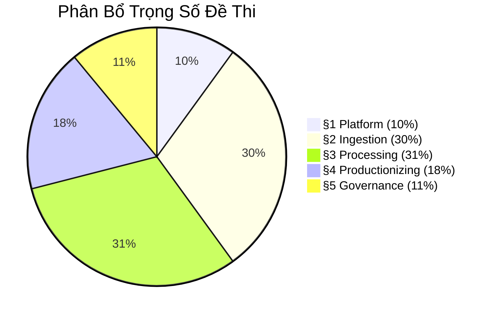

#databricks/claude

#  DATABRICKS CERTIFIED DATA ENGINEER ASSOCIATE — Exam Prep Guide

> **Phiên bản:** Nov 30, 2025 (Syllabus mới nhất, áp dụng cho kỳ thi 2026)
> **Nguồn:** [Official Exam Guide](https://www.databricks.com/learn/certification/data-engineer-associate)

---

## 📊 Exam Overview

| Thông tin | Chi tiết |
|-----------|----------|
| **Số câu hỏi** | 45 MCQ (Multiple Choice) |
| **Thời gian** | 90 phút |
| **Điểm đậu** | 70% (≥ 32/45 câu đúng) |
| **Phí thi** | $200 USD |
| **Hiệu lực** | 2 năm |
| **Kinh nghiệm khuyến nghị** | 6+ tháng hands-on Databricks |

---

## 📋 Cấu Trúc Đề Thi — 5 Sections

| Section | Weight | ~Số câu | Files Prep |
|---------|--------|---------|------------|
| **§1 Databricks Intelligence Platform** | 10% | 4-5 | [[01_Lakehouse_Platform]], [[02_Optimization_DataLayout]] |
| **§2 Development & Ingestion** | 30% | 13-14 | [[03_Notebooks_Debugging]], [[04_Auto_Loader]], [[05_Delta_Lake_Core]], [[06_Structured_Streaming]] |
| **§3 Data Processing & Transformations** | 31% | 14 | [[07_Medallion_Architecture]], [[08_SQL_PySpark_Operations]], [[09_Lakeflow_Declarative_Pipelines]] |
| **§4 Productionizing Data Pipelines** | 18% | 8 | [[10_Jobs_Workflows]], [[11_Asset_Bundles_CICD]], [[12_Performance_SparkUI]] |
| **§5 Data Governance & Quality** | 11% | 5 | [[13_Unity_Catalog]], [[14_Delta_Sharing_Lineage]] |

---

## 📚 Study Plan

### Track A: 2 Tuần (Intensive)

| Ngày | Nội dung | Files |
|------|----------|-------|
| 1-2 | Platform + Data Layout | 01, 02 |
| 3-4 | Delta Lake Core + Auto Loader | 04, 05 |
| 5-6 | Streaming + Notebooks | 03, 06 |
| 7-8 | Medallion + SQL/PySpark | 07, 08 |
| 9-10 | Declarative Pipelines + Jobs | 09, 10 |
| 11-12 | CI/CD + Spark UI + Governance | 11, 12, 13 |
| 13-14 | Delta Sharing + Review All | 14, ôn tổng |

### Track B: 4 Tuần (Balanced)

| Tuần | Focus | Files |
|------|-------|-------|
| 1 | §1 Platform + §2 Ingestion (Part 1) | 01, 02, 03, 04 |
| 2 | §2 Ingestion (Part 2) + §3 Processing (Part 1) | 05, 06, 07 |
| 3 | §3 Processing (Part 2) + §4 Productionizing | 08, 09, 10, 11 |
| 4 | §4-§5 + Ôn tổng + Mock test | 12, 13, 14 |

---

## 🔗 Deep Dive Reference

Mỗi file prep chỉ tập trung vào **ý thi**. Để hiểu sâu hơn, đọc:
- [[01_Databricks|Databricks Data Intelligence Platform — 3000-line Encyclopedia]]

---

## 📁 Nguồn Đề Thi

- **Official Exam Guide PDF:** `databricks-certified-data-engineer-associate-exam-guide-nov-30-2025-000.pdf`
- **ExamTopics Questions:** `Examtopics Databricks.txt` (60+ câu hỏi thật)

> ⚠️ **Lưu ý:** ExamTopics là nguồn tham khảo, KHÔNG phải brain dump. Hãy hiểu concept thay vì học thuộc đáp án.
