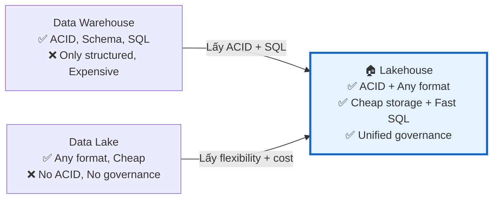
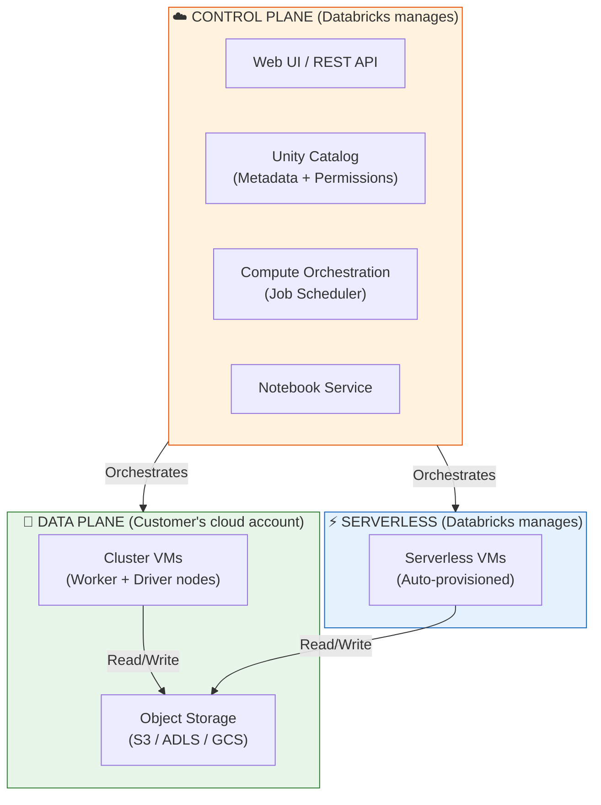

# §1 DATABRICKS INTELLIGENCE PLATFORM — Lakehouse Architecture & Compute

> **Exam Weight:** 10% (~4-5 câu) | **Difficulty:** Dễ-Trung bình
> **Exam Guide Sub-topics:** Value Proposition, Compute Selection, Platform Architecture

---

## TL;DR

**Databricks Data Intelligence Platform** = Lakehouse platform kết hợp ưu điểm Data Lake (lưu mọi format, giá rẻ) + Data Warehouse (ACID, schema, BI performance) trên một engine duy nhất, được quản lý bởi Unity Catalog.

---

## Nền Tảng Lý Thuyết

### Tại sao cần Lakehouse? — Bài toán lịch sử

Trước Lakehouse, thế giới data chia làm 2 trường phái:

**Data Warehouse (DWH)** — ví dụ: Oracle, Teradata, Redshift
- ✅ ACID transactions (dữ liệu luôn chính xác)
- ✅ Schema enforcement (cấu trúc rõ ràng)
- ✅ SQL performance cao (index, materialized views)
- ❌ Chỉ lưu structured data (bảng, cột)
- ❌ **Đắt** — storage + compute gắn liền, scale = mua thêm license
- ❌ Không hỗ trợ ML/AI workloads

**Data Lake** — ví dụ: HDFS, S3
- ✅ Lưu mọi loại data (JSON, CSV, Parquet, images, video)
- ✅ **Rẻ** — object storage giá $0.023/GB/tháng
- ✅ Schema-on-read (đọc lúc nào, schema lúc đó)
- ❌ Không có ACID → data corruption, inconsistency
- ❌ Không có governance → "data swamp" (ai cũng đổ data vào, không ai quản lý)
- ❌ BI performance kém (full scan mỗi query)

**Lakehouse** — "Best of Both Worlds":

- ✅ **Open Formats**: Lưu data bằng chuẩn mở (Parquet, Delta) trên cloud storage của bạn → **Không bị vendor lock-in** (khác với DWH đóng như Snowflake/Redshift).
- ✅ **Multi-Persona Platform**: Một nền tảng duy nhất cho mọi roles (Data Engineers viết pipeline, Data Scientists train model, Data Analysts chạy SQL/BI) → Tăng collaboration, giảm copy data.
- ✅ **AI-Powered (Databricks Intelligence Platform)**: Tích hợp AI sâu vào nền tảng (Databricks Assistant viết code/debug, AI-generated comments cho catalog, Predictive Optimization tự chạy maintenance).



**Databricks Lakehouse cụ thể hoạt động như thế nào?**
1. **Storage:** Data lưu trên S3/ADLS/GCS dưới dạng **Parquet files** (rẻ như Data Lake)
2. **ACID Layer:** **Delta Lake** thêm Transaction Log lên Parquet → biến thành bảng có ACID
3. **Compute:** **Spark + Photon** engine xử lý data (nhanh như DWH)
4. **Governance:** **Unity Catalog** quản lý permissions, lineage, audit (tốt hơn DWH)

→ Kết quả: Bạn có storage rẻ của Data Lake + tính năng enterprise của DWH + khả năng chạy ML/AI.

### Databricks Architecture — Control Plane vs Data Plane

Hiểu kiến trúc này là **nền tảng** cho mọi kiến thức Databricks:




- Classic workspace architecture (compute/data trong cloud account của bạn)
- Serverless workspace architecture (compute do Databricks quản lý)


**Giải thích đơn giản:**
- **Control Plane** = "bộ não" — Databricks hosted, chạy UI, scheduler, metadata. Bạn KHÔNG quản lý.
- **Data Plane** = "cơ bắp" — VMs chạy trong cloud account CỦA BẠN. Data cũng nằm trong storage CỦA BẠN.
- **Serverless** = "cơ bắp thuê ngoài" — VMs do Databricks quản lý, bạn chỉ trả $/giờ chạy.

**Tại sao cần phân biệt?** Vì nó ảnh hưởng đến:
- **Security:** Data lưu ở Data Plane = customer sở hữu → không bị vendor lock-in storage.
- **Networking:** Classic Compute = customer VPC (tùy chỉnh network). Serverless = Databricks VPC (ít control).
- **Cost:** Control Plane = free. Data Plane = customer trả cloud bill + DBU.

---

## So Sánh Với Open Source

| Databricks Component | OSS Equivalent | Khác biệt chính |
|----------------------|---------------|-----------------|
| Databricks Runtime (DBR) | Apache Spark | DBR = Spark + Photon (C++ engine) + optimizations riêng |
| SQL Warehouse | Hive / Presto / Trino | SQL Warehouse = Serverless, Photon-powered, auto-scale |
| Unity Catalog | Apache Ranger + Hive Metastore | UC = unified governance + 3-level namespace + lineage |
| Lakeflow Jobs | Apache Airflow | Native DAG orchestration, serverless, nhưng lock-in |
| Databricks Notebooks | Jupyter Notebook | Multi-language cells (Python + SQL + Scala + R), collaboration |
| Delta Lake | Apache Iceberg / Hudi | ACID + Time Travel + Liquid Clustering + UniForm |

---

## Cú Pháp / Keywords Cốt Lõi

### Compute Types — Khi Nào Dùng Cái Nào?

Đây là phần đề thi hỏi **rất trực tiếp**: cho scenario, chọn compute đúng.

| Compute Type | Boot Time | Ai manage? | Use Case | DBU Rate |
|-------------|-----------|-----------|----------|----------|
| **All-Purpose Cluster** | 3-5 phút | Customer | Dev, exploration, ad-hoc | Cao nhất |
| **Job Cluster** | 3-5 phút | Auto-create/terminate | Scheduled ETL (production) | Trung bình |
| **SQL Warehouse (Classic)** | 1-3 phút | Databricks | BI queries, dashboards | ~$0.22/DBU |
| **SQL Warehouse (Serverless)** | 2-5 giây | Databricks | Bursty BI, zero-config | ~$0.70/DBU |
| **Serverless Compute** | 2-5 giây | Databricks | Notebooks + Jobs, zero-config | Premium |

**Cách nhớ:**
- **Dev/test** = All-Purpose (cần interactive, restart nhanh)
- **Production ETL** = Job Cluster (tự tạo → chạy → tự xóa = tiết kiệm)
- **BI/SQL** = SQL Warehouse (optimized cho SQL)
- **"Tôi không muốn manage gì hết"** = Serverless

### Serverless Compute — Supported Languages

```
⚠️ Lưu ý theo docs hiện tại:
- Khả năng ngôn ngữ trên Serverless phụ thuộc bề mặt sản phẩm (Notebook/Jobs/SQL), cloud, region và workspace rollout.
- Khi làm bài exam set cụ thể, chọn đáp án theo đúng phạm vi câu hỏi và ngữ cảnh được nêu.
```

**Cách học an toàn:** Không suy luận một danh sách ngôn ngữ cố định cho mọi môi trường. Luôn kiểm tra đúng trang docs của compute type đang dùng.

> 🚨 **ExamTopics Q180:** Với bộ đề hiện tại trong repo, đáp án bám theo ngữ cảnh câu hỏi là **SQL + Python**. Khi áp dụng thực tế, vẫn phải đối chiếu docs ở workspace của bạn.

---

## Use Case Trong Thực Tế

### Scenario-Based Decision Table

| Scenario | Compute đúng | Logic |
|----------|-------------|-------|
| DE viết notebook thử nghiệm | All-Purpose Cluster | Cần interactive, restart nhanh, iterate |
| Chạy ETL pipeline lúc 2AM hàng đêm | **Job Cluster** | Tự tạo → chạy → tự terminate = chỉ trả $ lúc chạy |
| 50 analysts chạy SQL dashboard sáng thứ 2 | **SQL Warehouse** (scale) | Multi-cluster scaling cho concurrent queries |
| SLA 99.9% + team không có DevOps | **Serverless** | Zero-config, auto-optimize, Databricks lo hết |
| Team nhỏ, query burst lúc sáng, idle trưa-tối | **Serverless SQL Warehouse** | Boot 2s, auto-stop khi idle |
| Job chạy đêm, nhiều tasks, startup cluster chậm | **Cluster Pool** | Pool giữ idle VMs sẵn → job cluster boot nhanh |

> 🚨 **ExamTopics Q192:** Migrate to Serverless → bước đầu tiên = **low frequency BI + adhoc SQL** (đáp án D), KHÔNG phải Python ETL pipeline. Logic: bắt đầu từ workload ít risk nhất.

> 🚨 **ExamTopics Q191:** SLA cao + minimal ops overhead → **Serverless** (đáp án D). Logic: Serverless = Databricks manage mọi thứ.

### Cluster Pools — Giảm Startup Time

**Cluster Pool** = tập hợp idle VMs sẵn sàng, khi Job Cluster cần start → lấy VM từ pool thay vì provision mới từ cloud provider.

```
Không có Pool:  Job start → Request VM từ AWS/Azure → 3-5 phút boot → Run
Có Pool:        Job start → Lấy VM từ Pool (đã sẵn) → ~30 giây boot → Run
```

| Tham số Pool | Ý nghĩa |
|-------------|---------|
| `min_idle_instances` | Số VMs luôn giữ sẵn (idle) trong pool |
| `max_capacity` | Tổng số VMs tối đa pool có thể hold |
| `idle_instance_autotermination_minutes` | Sau bao lâu idle VM bị terminate |

**Khi nào dùng?** Job cluster có nhiều tasks, mỗi task tạo cluster riêng → startup cost cộng dồn. Pool giảm startup ~90%.

> 🚨 **ExamTopics Q127:** "Job with multiple tasks, clusters take long to start. How to improve?" → **Use clusters from a Cluster Pool** (đáp án D). KHÔNG phải autoscale, SQL endpoints, hay chuyển sang job clusters (đã là job clusters rồi).

### SQL Warehouse — Auto Stop

SQL Warehouse có tính năng **Auto Stop**: tự terminate sau khi idle (không có query) trong khoảng thời gian cấu hình (mặc định 10-120 phút).

> 🚨 **ExamTopics Q90:** "Minimize running time of SQL endpoint for daily dashboard refresh?" → **Turn on Auto Stop** (đáp án C). Auto Stop = tự tắt khi hết query → chỉ chạy khi cần.

---

## Khung Tư Duy Trước Khi Vào Trap

### Cách suy luận nhanh khi gặp câu về Platform
- Bước 1: Xác định loại workload: ETL batch, interactive dev, hay BI/SQL analytics.
- Bước 2: Xác định tiêu chí chính: tốc độ start, chi phí idle, concurrency, hay đơn giản vận hành.
- Bước 3: Map về compute phù hợp:
    - ETL theo lịch: Job Cluster.
    - Dev/khám phá tương tác: All-Purpose.
    - BI/SQL query: SQL Warehouse/Serverless SQL.

### Sai lầm hay gặp của người mới
- Chọn compute theo "tên nghe mạnh" thay vì theo workload thực tế.
- Nhầm lẫn control plane với nơi dữ liệu thực sự được lưu/truy vấn.
- Bỏ qua Auto Stop/Cluster Pools nên chi phí tăng không cần thiết.

## Giải Thích Sâu Các Chỗ Dễ Nhầm (Đối Chiếu Docs Mới)

### 1) "Serverless luôn tốt nhất" là cách hiểu sai
- Theo tài liệu Databricks hiện tại, Serverless là lựa chọn rất mạnh khi bạn muốn zero-config, scale nhanh và giảm vận hành thủ công.
- Nhưng không có câu trả lời tuyệt đối kiểu "luôn nhanh nhất/luôn rẻ nhất" cho mọi workload.
- Lý do: hiệu năng và chi phí phụ thuộc kiểu truy vấn, độ đồng thời, data layout, và cách cấu hình workload ở môi trường thực tế.
- Cách học chắc tay: xem Serverless là mặc định nên cân nhắc trước, rồi xác nhận lại bằng nhu cầu cụ thể (latency, concurrency, governance, ngân sách).

### 2) Không cố định con số startup time/DBU trong đầu
- Các con số thời gian khởi động hoặc DBU rate thay đổi theo cloud, region, loại warehouse, chính sách giá và thời điểm.
- Vì vậy, trong tài liệu học nên dùng ngôn ngữ "thường nhanh hơn" hoặc "thường tối ưu vận hành" thay vì cam kết số cố định.

### 3) Compute selection nên đi theo trình tự quyết định
- Bước 1: Workload là interactive dev, batch ETL, hay SQL BI?
- Bước 2: Tính ưu tiên là độ linh hoạt, chi phí idle, hay throughput đồng thời?
- Bước 3: Chọn compute tương ứng rồi benchmark nhỏ trước khi scale.
- Trình tự này bám đúng tinh thần docs: chọn compute theo đặc tính workload, không theo thói quen team.

### 4) Ngôn ngữ hỗ trợ trên Serverless cần đọc theo "bề mặt sản phẩm"
- Không nên học theo một câu chung cho tất cả trường hợp.
- Notebook serverless, jobs serverless, SQL warehouse serverless có khác biệt về phạm vi khả dụng theo thời điểm phát hành.
- Do đó, khi gặp câu gây bối rối, hãy kiểm tra đúng trang docs của bề mặt đang dùng.

### 5) Control plane vs data plane: hiểu đúng để trả lời câu security
- Điểm cốt lõi không phải thuộc định nghĩa, mà là suy luận đúng ownership boundary.
- Câu hỏi thường xoay quanh: metadata/control orchestration ở đâu, dữ liệu/compute runtime thực chạy ở đâu, và ai kiểm soát networking.
- Trả lời đúng khi bạn map được boundary đó vào yêu cầu compliance của đề.

## Guardrail: Availability Theo Cloud/Region/Workspace

### Trước khi kết luận một feature "có/không"
- Kiểm tra đúng trang docs theo cloud bạn dùng (AWS/Azure/GCP).
- Kiểm tra trạng thái GA/Preview và yêu cầu workspace edition/enablement.
- Kiểm tra giới hạn theo region hoặc policy quản trị nội bộ.

### Mẫu trả lời an toàn khi ôn và làm việc thật
- Khi làm exam: bám ngữ cảnh được mô tả trong câu hỏi.
- Khi làm hệ thống thật: xác nhận availability matrix trước quyết định kiến trúc.

---

## Cạm Bẫy Trong Đề Thi (Exam Traps) — Trích Từ ExamTopics

## Học Sâu Trước Khi Vào Trap

### 1) Mental Model: Platform = Governance + Compute + Storage Boundaries
- Databricks exam thường kiểm tra khả năng phân biệt "ai quản lý cái gì" hơn là nhớ tên tính năng.
- Nếu không tách được ranh giới Control Plane/Data Plane, bạn sẽ dễ sai các câu về security, cost, ownership.

### 2) Cách chọn compute theo mục tiêu kỹ thuật
- Mục tiêu "schedule ETL + tối ưu chi phí" → tư duy về lifecycle ngắn (ephemeral) và autoscaling.
- Mục tiêu "debug/tương tác" → ưu tiên môi trường giữ context lâu hơn.
- Mục tiêu "BI concurrency" → ưu tiên warehouse scaling model.

### 3) Cost Lens (rất hay bị hỏi gián tiếp)
- Chi phí không chỉ là DBU; còn có idle time, startup overhead, và cloud infra side-cost.
- Cùng một workload, khác chiến lược compute có thể ra bill khác rất xa.

### 4) Security & Ownership Lens
- "Dữ liệu nằm ở đâu" và "ai sở hữu credential truy cập" là hai câu hỏi nên tự trả lời trước mọi tình huống.
- Câu exam thường bẫy bằng cách trộn governance concept với compute choice.

### 5) Checklist tự kiểm trước khi sang Trap
- Bạn phân biệt được All-Purpose vs Job vs SQL Warehouse chưa?
- Bạn mô tả được khác biệt Serverless vs Classic theo 3 trục: control, cost, vận hành chưa?
- Bạn giải thích được vì sao Cluster Pool giúp startup nhanh không?


### Trap 1: Serverless Compute — Khi nào dùng và Tránh dùng?
- **Tình huống (Q191):** Đề hỏi làm sao để "tránh overhead của việc tuning/quản lý cluster" và "đảm bảo SLA" → Đáp án D: **Databricks Serverless Compute**. (Databricks tự tối ưu tài nguyên, user không cần quản lý cluster).
- **Ngôn ngữ hỗ trợ (Q180):** Serverless hỗ trợ ngôn ngữ nào? → Đáp án: **SQL và Python** (A, B). Các ngôn ngữ compiled như Scala/Java/R không được tối ưu cho cold start cực nhanh của Serverless.
- **Migration (Q192):** Bước đầu tiên an toàn nhất để chuyển sang Serverless?
  → Đáp án D: **Low frequency BI Dashboarding and Adhoc SQL Analytics**. KHÔNG chọn Python data transformation pipeline (B) vì workload ETL thường phức tạp và rủi ro cao hơn SQL adhoc khi test tính năng mới.

### Trap 2: Giá Trị Cốt Lõi Của Data Lakehouse (Q29)
- **Tình huống:** Data Analyst và Data Engineer có báo cáo lệch số nhau do kiến trúc siloed (phân tách).
- **Giải pháp Lakehouse:** "Cả hai team dùng chung một **single source of truth** (nguồn dữ liệu duy nhất)" (Đáp án B). Đừng chọn các đáp án nhiễu như "họ cãi nhau nên báo cáo chung một bộ phận".

### Trap 3: Control Plane vs Data Plane (Q74)
- **Đáp án nhiễu:** "Virtual Machines nằm trong Control Plane". → **SAI**. VM = Data Plane (nơi tính toán thực tế diễn ra).
- **Đúng:** Control Plane bao gồm **Compute Orchestration** (scheduler) và **Unity Catalog** (metadata/permissions). Bộ não chỉ quản lý, không tính toán.

### Trap 4: Compute Cho ETL Batch Hàng Ngày (Q193 - ảnh bổ sung)
- **Tình huống:** ETL batch chạy hàng ngày, workload nặng, kích thước thay đổi, cần auto-scale + tối ưu chi phí.
- **Đáp án đúng:** **Job Cluster** (ephemeral, autoscaling theo workload, xong việc tự terminate).
- **Bẫy:** `All-Purpose`/`Dedicated` phù hợp interactive dev; `Databricks SQL Serverless` ưu tiên BI/SQL analytics, không phải lựa chọn mặc định cho ETL batch notebook jobs.

### Trap 5: Cái Gì Nằm Trong Cloud Account Của Khách Hàng? (Q15 - PDF bổ sung)
- **Tình huống:** Đề hỏi thành phần nào thực sự nằm trong cloud account của customer.
- **Đúng (core idea):** **Data** nằm ở data plane của cloud account khách hàng.
- **Cách nhớ dễ:** Databricks quản trị orchestration ở control plane, còn dữ liệu gốc của doanh nghiệp phải nằm trong tài khoản cloud của chính doanh nghiệp.

---

## 🔗 Tham Khảo

- **Deep Dive:** [[01_Databricks#2. KIẾN TRÚC TỔNG THỂ|01_Databricks.md — Section 2: Kiến Trúc Tổng Thể]]
- **Deep Dive:** [[01_Databricks#3. COMPUTE LAYER|01_Databricks.md — Section 3: Compute Layer]]
- **Official Docs:** https://docs.databricks.com/en/getting-started/concepts.html
- **Serverless:** https://docs.databricks.com/en/compute/serverless.html
