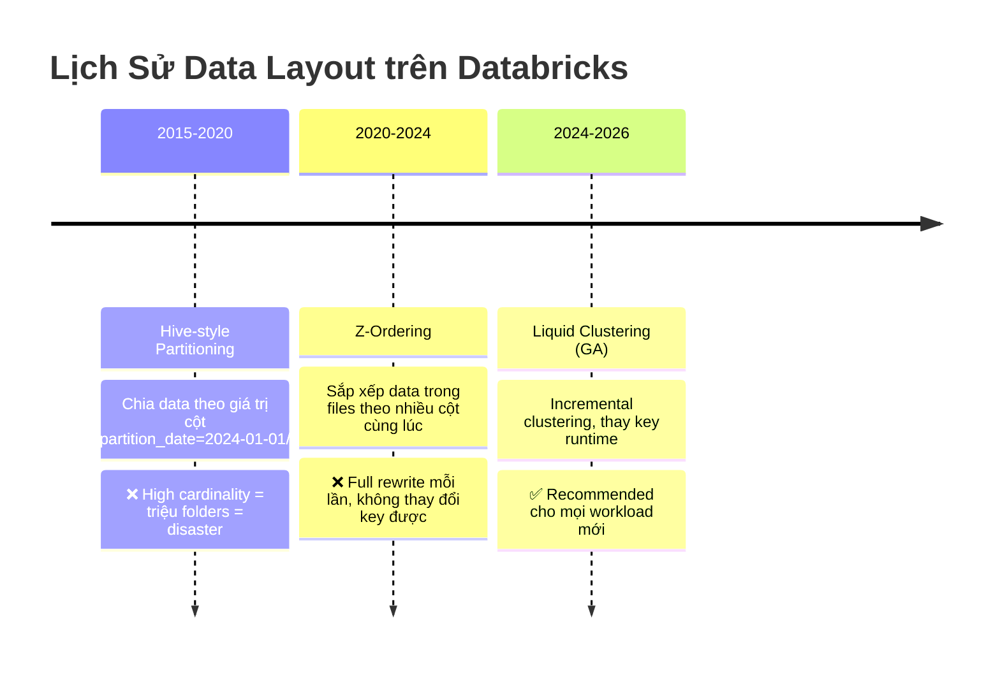

# §1 OPTIMIZATION & DATA LAYOUT — Liquid Clustering, Predictive Optimization

> **Exam Weight:** 10% (~4-5 câu) | **Difficulty:** Trung bình-Khó
> **Exam Guide Sub-topics:** Enable features that simplify data layout decisions and optimize query performance

---

## TL;DR

**Liquid Clustering** = cơ chế data layout thế hệ mới thay thế Partitioning + Z-Ordering. Cho phép thay đổi clustering key bất cứ lúc nào, chỉ cluster data mới (incremental), và tích hợp **Predictive Optimization** để tự động OPTIMIZE/VACUUM.

---

## Nền Tảng Lý Thuyết

### Data Layout là gì và tại sao quan trọng?

Khi bạn lưu 1 bảng Delta trên S3, data được chia thành nhiều **Parquet files**. Mỗi file chứa một phần dữ liệu. Khi bạn chạy query `SELECT * FROM orders WHERE customer_id = 123`, Spark phải:

1. **Không có layout:** Đọc TẤT CẢ files → filter → trả kết quả. Nếu bảng có 10,000 files, đọc hết 10,000 files chỉ để lấy 1 row → **RẤT CHẬM**.

2. **Có layout tốt:** Spark biết `customer_id = 123` nằm ở file #42 → chỉ đọc file #42 → **CỰC NHANH**.

**Data Layout = cách sắp xếp data vào files để query đọc ít files nhất có thể.**

### 3 Thế Hệ Data Layout



### Partitioning — Thế Hệ 1 (LEGACY)

**Cơ chế:** Chia data thành thư mục con dựa trên giá trị cột.

```text
orders/
├── region=US/
│   ├── part-001.parquet
│   └── part-002.parquet
├── region=EU/
│   └── part-001.parquet
└── region=APAC/
    └── part-001.parquet
```

**Ưu điểm:** Query `WHERE region = 'US'` → Spark chỉ đọc folder `region=US/` → nhanh.

**Nhược điểm chí tử:**
- **High-cardinality column** (ví dụ: `customer_id` có 10 triệu giá trị) → tạo 10 triệu folders → mỗi folder 1 file nhỏ → **Small Files Problem** → CHẬM.
- **Không thể thay đổi partition key** sau khi tạo bảng. Muốn đổi = tạo bảng mới + copy data.

### Z-Ordering — Thế Hệ 2 (LEGACY)

**Cơ chế:** Sắp xếp lại data TRONG mỗi file theo nhiều cột (space-filling curve). Spark dùng min/max stats để skip files.

```sql
OPTIMIZE orders ZORDER BY (customer_id);
-- Sau Z-Order: file #42 chứa customer_id 100-200
-- Query WHERE customer_id = 150 → chỉ đọc file #42
```

**Nhược điểm:**
- **Full rewrite:** Mỗi lần `OPTIMIZE ZORDER BY` = rewrite TẤT CẢ files. Bảng 10TB → rewrite 10TB → tốn thời gian + tiền.
- **Key cố định:** Một khi chọn `ZORDER BY (customer_id)`, không thể đổi sang `(region, event_time)` mà không rewrite toàn bộ.

### Liquid Clustering — Thế Hệ 3 (HIỆN TẠI ✅)

**Cơ chế:** Clustering thông minh — chỉ sắp xếp lại data MỚI (incremental), cho phép đổi key bất cứ lúc nào.

```sql
-- Tạo bảng với Liquid Clustering
CREATE TABLE orders (...)
CLUSTER BY (customer_id, purchase_date);

-- Data mới tự động được clustered khi OPTIMIZE
OPTIMIZE orders;  -- Chỉ cluster data CHƯA được cluster

-- Thay đổi key bất cứ lúc nào!
ALTER TABLE orders CLUSTER BY (region, event_time);
-- Data cũ GIỮ NGUYÊN (vẫn clustered theo key cũ)
-- Data mới sẽ clustered theo key mới
-- Dần dần, khi OPTIMIZE chạy, data cũ cũng được re-cluster
```

**Tại sao Liquid Clustering là winner?**

| Feature | Partitioning | Z-Ordering | Liquid Clustering |
|---------|-------------|-----------|------------------|
| Thay đổi key | ❌ Tạo bảng mới | ❌ Full rewrite | ✅ `ALTER TABLE` |
| Incremental | ❌ | ❌ Full rewrite | ✅ Chỉ data mới |
| High cardinality | ❌ Small files | ✅ | ✅ |
| Auto selection | ❌ | ❌ | ✅ Predictive Opt |
| **Status 2026** | **deprecated** | **legacy** | **recommended** |

### Predictive Optimization — AI tự chạy maintenance

**Cơ chế:** Databricks tự phân tích query patterns → tự chọn thời điểm chạy OPTIMIZE + VACUUM → bạn không cần schedule.

```sql
-- Bật Predictive Optimization cho catalog
ALTER CATALOG prod ENABLE PREDICTIVE OPTIMIZATION;

-- Databricks sẽ tự:
-- 1. Chọn lúc low-traffic để chạy OPTIMIZE
-- 2. Tự VACUUM files cũ
-- 3. Tự chọn clustering key tối ưu (nếu dùng Liquid Clustering)
```

**Tương tự trong đời thực:** Như mua ô tô có AutoPilot bảo dưỡng — xe tự đi thay nhớt, kiểm tra lốp, không cần bạn đặt lịch.

---

## So Sánh Với Open Source

| Databricks Feature | OSS Equivalent | Khác biệt |
|-------------------|---------------|-----------|
| Liquid Clustering | Z-Ordering (Delta OSS) | Incremental, đổi key runtime, auto-choose key |
| Predictive Optimization | Không có | AI tự chạy OPTIMIZE/VACUUM off-peak |
| OPTIMIZE | `OPTIMIZE` (Delta OSS) | Databricks version nhanh hơn nhờ Photon |
| Data Skipping | Parquet min/max stats | Delta + Liquid Clustering = skip 90-99% files |

---

## Cú Pháp / Keywords Cốt Lõi

### So Sánh Syntax 3 Cách (THUỘC LÒNG)

```sql
-- ❌ LEGACY: Partitioning
CREATE TABLE old_way (...) PARTITIONED BY (region);

-- ❌ LEGACY: Z-Ordering (phải chạy lại mỗi lần)
OPTIMIZE my_table ZORDER BY (customer_id);

-- ✅ HIỆN TẠI: Liquid Clustering
CREATE TABLE new_way (...) CLUSTER BY (customer_id, purchase_date);
ALTER TABLE new_way CLUSTER BY (region, event_time);  -- Đổi key runtime!
OPTIMIZE new_way;  -- Chỉ cluster data mới
```

### Kiểm tra Predictive Optimization

```sql
-- Xem lịch sử operations tự động
SELECT table_name, operation_type, operation_status, start_time
FROM system.storage.predictive_optimization_operations_history
ORDER BY start_time DESC;
```

---

## Use Case Trong Thực Tế

| Scenario | Solution | Giải thích |
|----------|----------|-----------|
| Bảng query bằng nhiều cột filter khác nhau | Liquid Clustering (multi-column) | Cluster theo các cột hay query nhất |
| `customer_id` có 10 triệu giá trị | Liquid Clustering (NOT Partitioning) | Partitioning = 10M folders = disaster |
| Query pattern thay đổi: tháng trước filter `region`, tháng này filter `event_time` | Liquid Clustering (`ALTER TABLE CLUSTER BY`) | Đổi key mà không rewrite data |
| Bảng cũ có Partition + Z-Order, vẫn chậm | **Migrate sang Liquid Clustering** | Drop partition, dùng CLUSTER BY |

> 🚨 **ExamTopics Q188:** Bảng partitioned by `purchase_date`, query filter `customer_id` chậm → Đáp án đúng: **ALTER TABLE CLUSTER BY (customer_id, purchase_date)** — Liquid Clustering thay thế cả partition lẫn Z-Order.

> 🚨 **ExamTopics Q187:** Bảng có Partition + Z-Order + Predictive Optimization nhưng filter thay đổi liên tục → Đáp án đúng: **Switch to Automatic Liquid Clustering** (đáp án D).

---

## Cạm Bẫy Trong Đề Thi (Exam Traps)

### Trap 1: Liquid Clustering + giữ partition cũ
- **Đáp án nhiễu:** "Alter table implementing liquid clustering on customer_id **while keeping the existing partitioning**" → **SAI**.
- **Đúng:** Liquid Clustering **thay thế** partition. Không dùng cả hai cùng lúc.
- **Logic:** Liquid Clustering tự quản lý data layout. Partition = redundant + conflict.

### Trap 2: Delta Caching = giải pháp cho data layout
- **Đáp án nhiễu:** "Enable delta caching for performance" → **SAI** cho data layout problem.
- **Đúng:** Caching giải quyết **read latency** (lần 2 đọc nhanh hơn). Data layout giải quyết **file skipping** (đọc ít files hơn).
- **Logic:** Nếu phải đọc 10,000 files, cache chỉ giúp lần 2. Layout giúp mọi lần.

### Trap 3: Nhầm Z-ORDER với Liquid Clustering
- **Đáp án nhiễu:** "Tweak Z-Order columns and run OPTIMIZE manually" → **SAI** cho dynamic queries.
- **Đúng:** Z-Order = cố định key, full rewrite. Liquid Clustering = flexible key, incremental.
- **Logic:** Nếu query pattern thay đổi, cần tool thay đổi được key → Liquid Clustering.

---

## 🔗 Tham Khảo

- **Deep Dive:** [[01_Databricks#5. DELTA LAKE 3.x ECOSYSTEM|01_Databricks.md — Section 5: Delta Lake 3.x]]
- **Deep Dive:** [[01_Databricks#14. PREDICTIVE OPTIMIZATION|01_Databricks.md — Section 14]]
- **Official Docs:** https://docs.databricks.com/en/delta/clustering.html
- **Predictive Optimization:** https://docs.databricks.com/en/optimizations/predictive-optimization.html
