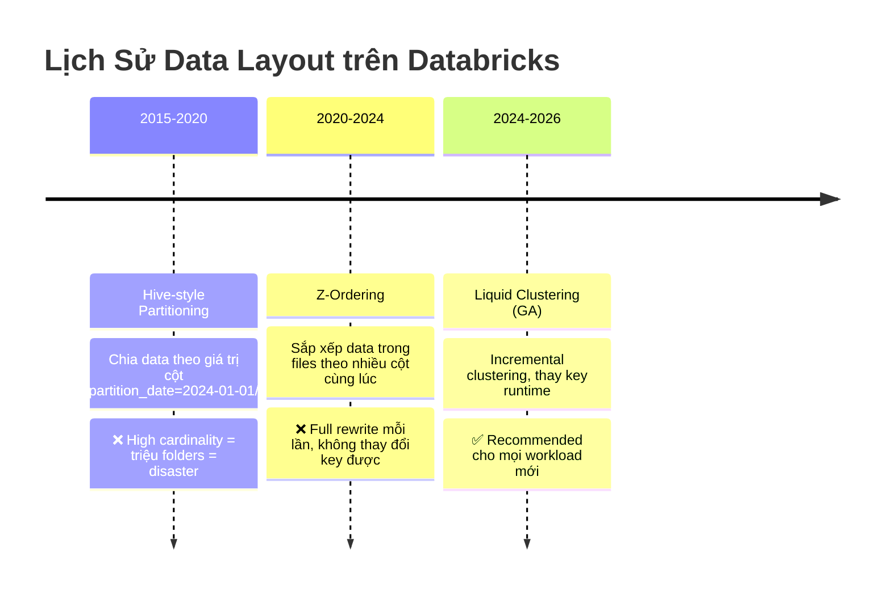

# §1 OPTIMIZATION & DATA LAYOUT — Liquid Clustering, Predictive Optimization

> **Exam Weight:** 10% (~4-5 câu) | **Difficulty:** Trung bình-Khó
> **Exam Guide Sub-topics:** Enable features that simplify data layout decisions and optimize query performance

---

## TL;DR

**Liquid Clustering** = cơ chế data layout thế hệ mới thay thế Partitioning + Z-Ordering. Cho phép thay đổi clustering key bất cứ lúc nào, chỉ cluster data mới (incremental), và tích hợp **Predictive Optimization** để tự động OPTIMIZE/VACUUM.

---

## Nền Tảng Lý Thuyết

### Data Layout là gì và tại sao quan trọng?

Khi bạn lưu 1 bảng Delta trên S3, data được chia thành nhiều **Parquet files**. Mỗi file chứa một phần dữ liệu. Khi bạn chạy query `SELECT * FROM orders WHERE customer_id = 123`, Spark phải:

1. **Không có layout:** Đọc TẤT CẢ files → filter → trả kết quả. Nếu bảng có 10,000 files, đọc hết 10,000 files chỉ để lấy 1 row → **RẤT CHẬM**.

2. **Có layout tốt:** Spark biết `customer_id = 123` nằm ở file #42 → chỉ đọc file #42 → **CỰC NHANH**.

**Data Layout = cách sắp xếp data vào files để query đọc ít files nhất có thể.**

### 3 Thế Hệ Data Layout



### Partitioning — Thế Hệ 1 (LEGACY)

**Cơ chế:** Chia data thành thư mục con dựa trên giá trị cột.

```text
orders/
├── region=US/
│   ├── part-001.parquet
│   └── part-002.parquet
├── region=EU/
│   └── part-001.parquet
└── region=APAC/
    └── part-001.parquet
```

**Ưu điểm:** Query `WHERE region = 'US'` → Spark chỉ đọc folder `region=US/` → nhanh.

**Nhược điểm chí tử:**
- **High-cardinality column** (ví dụ: `customer_id` có 10 triệu giá trị) → tạo 10 triệu folders → mỗi folder 1 file nhỏ → **Small Files Problem** → CHẬM.
- **Không thể thay đổi partition key** sau khi tạo bảng. Muốn đổi = tạo bảng mới + copy data.

### Z-Ordering — Thế Hệ 2 (LEGACY)

**Cơ chế:** Sắp xếp lại data TRONG mỗi file theo nhiều cột (space-filling curve). Spark dùng min/max stats để skip files.

```sql
OPTIMIZE orders ZORDER BY (customer_id);
-- Sau Z-Order: file #42 chứa customer_id 100-200
-- Query WHERE customer_id = 150 → chỉ đọc file #42
```

**Nhược điểm:**
- **Full rewrite:** Mỗi lần `OPTIMIZE ZORDER BY` = rewrite TẤT CẢ files. Bảng 10TB → rewrite 10TB → tốn thời gian + tiền.
- **Key cố định:** Một khi chọn `ZORDER BY (customer_id)`, không thể đổi sang `(region, event_time)` mà không rewrite toàn bộ.

### Liquid Clustering — Thế Hệ 3 (HIỆN TẠI ✅)

**Cơ chế:** Clustering thông minh — chỉ sắp xếp lại data MỚI (incremental), cho phép đổi key bất cứ lúc nào.

```sql
-- Tạo bảng với Liquid Clustering
CREATE TABLE orders (...)
CLUSTER BY (customer_id, purchase_date);

-- Data mới tự động được clustered khi OPTIMIZE
OPTIMIZE orders;  -- Chỉ cluster data CHƯA được cluster

-- Thay đổi key bất cứ lúc nào!
ALTER TABLE orders CLUSTER BY (region, event_time);
-- Data cũ GIỮ NGUYÊN (vẫn clustered theo key cũ)
-- Data mới sẽ clustered theo key mới
-- Dần dần, khi OPTIMIZE chạy, data cũ cũng được re-cluster
```

**Tại sao Liquid Clustering là winner?**

| Feature | Partitioning | Z-Ordering | Liquid Clustering |
|---------|-------------|-----------|------------------|
| Thay đổi key | ❌ Tạo bảng mới | ❌ Full rewrite | ✅ `ALTER TABLE` |
| Incremental | ❌ | ❌ Full rewrite | ✅ Chỉ data mới |
| High cardinality | ❌ Small files | ✅ | ✅ |
| Auto selection | ❌ | ❌ | ✅ Predictive Opt |
| **Status 2026** | **deprecated** | **legacy** | **recommended** |

### Predictive Optimization — AI tự chạy maintenance

**Cơ chế:** Databricks tự phân tích query patterns → tự chọn thời điểm chạy OPTIMIZE + VACUUM → bạn không cần schedule.

```sql
-- Bật Predictive Optimization cho catalog
ALTER CATALOG prod ENABLE PREDICTIVE OPTIMIZATION;

-- Databricks sẽ tự:
-- 1. Chọn lúc low-traffic để chạy OPTIMIZE
-- 2. Tự VACUUM files cũ
-- 3. Tự chọn clustering key tối ưu (nếu dùng Liquid Clustering)
```

**Tương tự trong đời thực:** Như mua ô tô có AutoPilot bảo dưỡng — xe tự đi thay nhớt, kiểm tra lốp, không cần bạn đặt lịch.

### Deletion Vectors — Xóa Dữ Liệu Nhanh Hơn

**Cơ chế:** Thông thường (không có Deletion Vectors), khi bạn chạy `DELETE` hoặc `UPDATE` thay đổi 1 row trong file Parquet 1GB, Spark phải **đọc toàn bộ 1GB -> bỏ row đó -> viết lại file 1GB mới**. Quá trình này rất mất thời gian (Write amplification).

Khi bật **Deletion Vectors**:
1. Databricks **KHÔNG** viết lại file Parquet ngay lập tức.
2. Nó tạo ra một file nhỏ (vector) đánh dấu "row X trong file Y đã bị xóa".
3. Lúc truy vấn (SELECT), Spark đọc file Parquet + file Vector để bỏ qua các dòng bị xóa (Logical delete).
4. Các file Parquet chỉ thực sự được viết lại và làm sạch khi chạy `OPTIMIZE` hoặc `REORG TABLE`.

**Ưu điểm:** Tăng tốc đáng kể các lệnh `DELETE`, `UPDATE`, và `MERGE` (thường dùng trong SCD Type 2 hoặc xóa dữ liệu GDPR).

---

## So Sánh Với Open Source

| Databricks Feature | OSS Equivalent | Khác biệt |
|-------------------|---------------|-----------|
| Liquid Clustering | Z-Ordering (Delta OSS) | Incremental, đổi key runtime, auto-choose key |
| Predictive Optimization | Không có | AI tự chạy OPTIMIZE/VACUUM off-peak |
| OPTIMIZE | `OPTIMIZE` (Delta OSS) | Databricks version nhanh hơn nhờ Photon |
| Data Skipping | Parquet min/max stats | Delta + Liquid Clustering = skip 90-99% files |

---

## Cú Pháp / Keywords Cốt Lõi

### So Sánh Syntax 3 Cách (THUỘC LÒNG)

```sql
-- ❌ LEGACY: Partitioning
CREATE TABLE old_way (...) PARTITIONED BY (region);

-- ❌ LEGACY: Z-Ordering (phải chạy lại mỗi lần)
OPTIMIZE my_table ZORDER BY (customer_id);

-- ✅ HIỆN TẠI: Liquid Clustering
CREATE TABLE new_way (...) CLUSTER BY (customer_id, purchase_date);
ALTER TABLE new_way CLUSTER BY (region, event_time);  -- Đổi key runtime!
OPTIMIZE new_way;  -- Chỉ cluster data mới
```

### Kiểm tra Predictive Optimization

```sql
-- Xem lịch sử operations tự động
SELECT table_name, operation_type, operation_status, start_time
FROM system.storage.predictive_optimization_operations_history
ORDER BY start_time DESC;
```

---

## Use Case Trong Thực Tế

| Scenario | Solution | Giải thích |
|----------|----------|-----------|
| Bảng query bằng nhiều cột filter khác nhau | Liquid Clustering (multi-column) | Cluster theo các cột hay query nhất |
| `customer_id` có 10 triệu giá trị | Liquid Clustering (NOT Partitioning) | Partitioning = 10M folders = disaster |
| Query pattern thay đổi: tháng trước filter `region`, tháng này filter `event_time` | Liquid Clustering (`ALTER TABLE CLUSTER BY`) | Đổi key mà không rewrite data |
| Bảng cũ có Partition + Z-Order, vẫn chậm | **Migrate sang Liquid Clustering** | Drop partition, dùng CLUSTER BY |

> 🚨 **ExamTopics Q188:** Bảng partitioned by `purchase_date`, query filter `customer_id` chậm → Đáp án đúng: **ALTER TABLE CLUSTER BY (customer_id, purchase_date)** — Liquid Clustering thay thế cả partition lẫn Z-Order.

> 🚨 **ExamTopics Q187:** Bảng có Partition + Z-Order + Predictive Optimization nhưng filter thay đổi liên tục → Đáp án đúng: **Switch to Automatic Liquid Clustering** (đáp án D).

---

## Khung Tư Duy Trước Khi Vào Trap

### 3 câu hỏi nên tự hỏi trước khi chọn chiến lược layout
- Query thường filter theo cột nào? Có thay đổi theo thời gian không?
- Cardinality của cột filter là thấp hay cao?
- Bài toán hiện tại là "đọc chậm do layout" hay "tính toán chậm do query/compute"?

### Quy tắc thực dụng
- Workload mới + query pattern động → ưu tiên Liquid Clustering.
- Đừng lạm dụng partitioning với cột high-cardinality.
- `OPTIMIZE` để compaction, `VACUUM` để dọn file cũ; hai lệnh không thay thế nhau.

### Cách nhớ ngắn
- Layout tốt giúp Spark "khỏi đọc file không cần thiết".
- Compute mạnh chỉ giúp xử lý nhanh hơn những gì đã đọc, không thay thế layout đúng.

## Giải Thích Sâu Các Chỗ Dễ Nhầm (Đối Chiếu Docs Mới)

### 1) Liquid Clustering là "recommended", không phải "mọi thứ khác vô dụng"
- Theo docs hiện tại, Liquid Clustering được khuyến nghị mạnh cho nhiều workload Delta mới, đặc biệt với query pattern thay đổi.
- Tuy nhiên, partitioning và Z-Ordering vẫn có ngữ cảnh hợp lý trong hệ thống kế thừa hoặc thiết kế đặc thù.
- Vì vậy tránh học theo kiểu "thấy partition là sai"; đúng hơn là "chọn cơ chế phù hợp pattern truy vấn + vận hành".

### 2) Đừng nhầm bản chất 3 kỹ thuật
- Partitioning: pruning theo thư mục/partition values.
- Z-ORDER: cải thiện locality + file skipping cho cột truy vấn thường xuyên.
- Liquid Clustering: hướng tiếp cận linh hoạt hơn để tổ chức dữ liệu theo key và thay đổi dần theo thời gian.
- Nắm bản chất này giúp bạn không chọn đáp án theo từ khóa bề mặt.

### 3) Predictive Optimization không thay thế tư duy thiết kế dữ liệu
- Tự động hóa maintenance là lợi thế lớn, nhưng không cứu được mô hình dữ liệu hoặc query logic thiết kế sai.
- Nếu bảng quá skew, key chọn sai, hoặc pipeline tạo small files quá mức, bạn vẫn cần xử lý ở tầng thiết kế.

### 4) Tối ưu hiệu năng cần phân tách 2 pha
- Pha 1: giảm data đọc không cần thiết (layout/pruning/stats).
- Pha 2: tăng tốc xử lý phần data còn lại (compute, plan, query rewrite).
- Sai lầm phổ biến là bỏ qua pha 1 và chỉ tăng phần cứng.

### 5) Cách viết an toàn theo docs
- Dùng cụm "ưu tiên cho workload mới" thay cho "deprecated toàn bộ".
- Dùng cụm "nên cân nhắc" thay cho "bắt buộc" nếu docs không ghi cứng.

---

## Cạm Bẫy Trong Đề Thi (Exam Traps) — Trích Từ ExamTopics

## Học Sâu Trước Khi Vào Trap

### 1) Mental Model: Performance = Read Less + Shuffle Less + Compute Right
- Data layout là công cụ để Spark đọc ít file hơn.
- Query tuning là công cụ để giảm shuffle/serialization cost.
- Compute sizing chỉ phát huy tốt khi hai lớp trên đã hợp lý.

### 2) Khi nào layout mới giải quyết được vấn đề?
- Dấu hiệu đúng: query filter thường xuyên trên vài cột rõ ràng, scan volume lớn bất thường.
- Dấu hiệu sai: bottleneck do UDF nặng hoặc join logic sai; lúc đó layout không phải thuốc chính.

### 3) Tư duy chọn clustering keys
- Ưu tiên cột xuất hiện đều trong điều kiện filter quan trọng.
- Tránh chọn key quá nhiễu theo thời gian nếu workload thay đổi liên tục.
- Đánh giá lại key sau một chu kỳ sử dụng thực tế thay vì cố định cứng từ đầu.

### 4) Vòng đời maintenance cần thuộc
- `OPTIMIZE` = compaction để giảm small files.
- `VACUUM` = dọn file cũ theo retention.
- Predictive Optimization = tự động hóa maintenance trong phạm vi hỗ trợ.

### 5) Checklist tự kiểm
- Bạn phân biệt được mục tiêu của Liquid Clustering vs Partitioning chưa?
- Bạn giải thích được vì sao high-cardinality thường không hợp partition truyền thống không?
- Bạn biết khi nào nên nghi ngờ query logic thay vì đổ lỗi layout chưa?


### Trap 1: Liquid Clustering vs Partitioning (Q187, Q188)
Đây là câu hỏi RẤT HAY XUẤT HIỆN:
- **Câu Q188:** Table partition theo `purchase_date`, nhưng query lại hay filter theo `customer_id` (high-cardinality), gây full partition scan. Cần optimize thế nào?
  → **Đáp án B**: Alter table implementing **liquid clustering by "customer_id" AND "purchase_date"**. (Đáp án nhiễu: "keep existing partitioning" → SAI, vì Liquid Clustering được sinh ra để *thay thế* hoàn toàn partitioning).
- **Câu Q187:** Bảng có Partition + Z-Order + Predictive Optimization bật. Nhưng query thay đổi filter liên tục, nên query vẫn chậm.
  → **Đáp án D**: Switch Data layout from Partition+Z-Ordering to **Automatic Liquid Clustering**. (Liquid Clustering sinh ra để giải quyết Dynamic Query Patterns, tự uốn nắn layout theo query).

### Trap 2: Thiết Kế Medallion Architecture (Q50, Q182, Q159)
Đề thi rất thích hỏi định nghĩa chính xác nhiệm vụ của từng lớp Bronze/Silver/Gold.
- **Câu Q182 (Bronze Định Nghĩa):** Tác vụ nào áp dụng cho Bronze layer?
  → **Đáp án A**: **Ingest raw data without transformations, preserving original schemas, and store in Delta format**. (Ghi nhớ 3 KEYWORDS: Không biến đổi, Giữ nguyên schema gốc, Lưu bằng chuẩn Delta).
- **Câu Q50 (Bronze So Với Raw):** Bronze tables liên quan đến raw data như thế nào?
  → **Đáp án D**: Bronze tables contain a **less refined view** of data than raw data. (Chứa góc nhìn thô sơ nhất - đây là cách diễn đạt lắt léo từ Databricks).
- **Câu Q159 (Silver Nhiệm Vụ):** Đâu là sự ghép cặp chuẩn xác giữa Layer và Dữ liệu?
  → **Đáp án C**: **Silver Layer - Cleansed master customer data**. (Lớp Silver là nơi chứa data đã "làm sạch" - cleansed và "lọc trùng" - deduplicated trước khi tổng hợp cho business ở lớp Gold).

### Trap 3: Delta Caching = giải pháp cho Data Layout?
- **Đáp án nhiễu:** "Enable delta caching for performance" để giải quyết filter chậm. → **SAI**.
- **Đúng:** Caching giải quyết **read latency** (đọc lại lần 2 nhanh hơn do lưu ở RAM/Disk). Data Layout (Liquid/Z-Order) giải quyết **file skipping** (không cần đọc các file không chứa data). Nếu layout sai, bạn cache 1 triệu file rác thì vẫn chậm.

### Trap 4: Compaction Keyword và File Format Hiểu Đúng (Q101, Q109)
- **Q101:** Muốn gộp nhiều file nhỏ thành file lớn để tăng performance → keyword đúng là **`OPTIMIZE`**.
- **Bẫy:** `VACUUM` không phải compaction; `VACUUM` dùng để dọn file cũ không còn tham chiếu.
- **Q109:** External table từ Parquet có lợi thế chính vì Parquet có **schema rõ ràng** (schema-aware), thuận lợi cho truy vấn và quản trị metadata.

---

## 🔗 Tham Khảo

- **Deep Dive:** [[01_Databricks#5. DELTA LAKE 3.x ECOSYSTEM|01_Databricks.md — Section 5: Delta Lake 3.x]]
- **Deep Dive:** [[01_Databricks#14. PREDICTIVE OPTIMIZATION|01_Databricks.md — Section 14]]
- **Official Docs:** https://docs.databricks.com/en/delta/clustering.html
- **Predictive Optimization:** https://docs.databricks.com/en/optimizations/predictive-optimization.html
