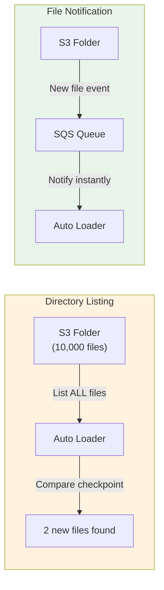

# §2 AUTO LOADER — Incremental File Ingestion (cloudFiles)

> **Exam Weight:** 30% (shared) | **Difficulty:** Trung bình
> **Exam Guide Sub-topics:** Classify valid Auto Loader sources, incremental use cases, syntax

---

## TL;DR

**Auto Loader** = cơ chế tự động phát hiện files MỚI trong cloud storage và ingest vào Delta Table. Dùng format `cloudFiles` với Structured Streaming. Giải quyết bài toán "chỉ đọc file mới, không đọc lại file cũ".

---

## Nền Tảng Lý Thuyết

### Bài Toán Incremental Ingestion

Hãy tưởng tượng bạn có 1 folder S3 nhận files từ hệ thống upstream:

```text
s3://raw-data/events/
├── events_20240101.json     ← đã ingest ngày 1
├── events_20240102.json     ← đã ingest ngày 2
├── events_20240103.json     ← MỚI, chưa ingest
└── events_20240104.json     ← MỚI, chưa ingest
```

**Không có Auto Loader:** Bạn phải tự viết logic:
1. Lưu danh sách files đã ingest vào database
2. List tất cả files trong folder
3. So sánh → tìm files mới
4. Đọc files mới
5. Cập nhật danh sách đã ingest

→ **Rất nhiều code**, dễ bug (miss file, đọc duplicate, crash giữa chừng).

**Có Auto Loader:** Databricks tự làm tất cả:
1. Auto Loader tự track files đã đọc (qua **checkpoint**)
2. Mỗi lần chạy, chỉ đọc files MỚI
3. Hỗ trợ retry nếu fail
4. Schema evolution tự động

### 2 Chế Độ Hoạt Động

**1. Directory Listing Mode** (mặc định)
- Cơ chế: Mỗi batch, Auto Loader **list toàn bộ directory** → so sánh với checkpoint → tìm files mới.
- Ưu điểm: Đơn giản, không cần setup gì thêm.
- Nhược điểm: Chậm nếu directory có >1 triệu files (phải list hết).

**2. File Notification Mode** (recommended cho production)
- Cơ chế: Databricks setup **cloud event notification** (AWS SQS, Azure EventGrid, GCP Pub/Sub). Khi file mới xuất hiện → cloud gửi notification → Auto Loader đọc file đó.
- Ưu điểm: Không cần list directory. Instant detection.
- Nhược điểm: Cần IAM permissions cho SQS/EventGrid setup.



### Schema Evolution & Rescued Data

**Schema Evolution:** Source thêm cột mới → Auto Loader tự detect + add cột vào bảng.

```text
Day 1: {"user_id": 1, "name": "Alice"}          → 2 columns
Day 2: {"user_id": 2, "name": "Bob", "age": 25} → 3 columns (age mới!)
Auto Loader tự thêm column "age" vào bảng Delta.
```

**Rescued Data:** File có data không match schema → thay vì fail, Auto Loader đẩy vào cột `_rescued_data`.

```text
Schema expects: user_id (INT), name (STRING)
File contains:  {"user_id": "abc", "name": "Bob"}  ← user_id sai type!
→ Row vẫn được ingest, "abc" nằm trong cột _rescued_data
→ Pipeline KHÔNG fail, bạn xử lý _rescued_data sau
```

---

## So Sánh Với Open Source

| Databricks Feature | OSS Equivalent | Khác biệt |
|-------------------|---------------|-----------|
| Auto Loader (`cloudFiles`) | Spark `readStream` + custom tracking | Auto Loader tự track files, schema evolve |
| File Notification mode | Custom S3 Event → SQS → Consumer | Databricks tự setup SQS/EventGrid |
| Directory Listing mode | `spark.readStream` + manual globbing | Auto Loader list + compare checkpoint |
| Schema Evolution | Manual `.option("mergeSchema")` | Tự infer + evolve, không cần config |
| Rescued Data Column | Không có | `_rescued_data` bắt bad data thay vì crash |

---

## Cú Pháp / Keywords Cốt Lõi

### Basic Auto Loader Syntax (THUỘC LÒNG)

```python
# Auto Loader — đọc JSON files mới từ S3
df = (spark.readStream                                 # ← Streaming read
    .format("cloudFiles")                              # ← BẮT BUỘC là "cloudFiles"
    .option("cloudFiles.format", "json")               # ← format file nguồn
    .option("cloudFiles.schemaLocation", "/checkpoint") # ← nơi lưu schema inferred
    .load("/mnt/raw/events/")                          # ← source path
)

# Write to Delta table
df.writeStream \
    .format("delta") \
    .option("checkpointLocation", "/checkpoint/bronze_events") \
    .trigger(availableNow=True) \
    .toTable("bronze.events")
```

### File Filtering — pathGlobFilter

```python
# Folder chứa lẫn .json, .csv, .png
# Chỉ muốn đọc .png files
df = (spark.readStream
    .format("cloudFiles")
    .option("cloudFiles.format", "binaryFile")
    .option("pathGlobFilter", "*.png")       # ← Filter file type
    .load("/mnt/images/")
)
```

> 🚨 **ExamTopics Q179:** Đề cho 4 đáp án code. Cách nhận diện đáp án đúng:
> 1. `readStream` (KHÔNG phải `readstream` — chữ S phải HOA)
> 2. `.option("pathGlobFilter", "*.png")` (KHÔNG phải `pathGlobfilter`)
> 3. `.load()` cuối cùng (KHÔNG phải `.append()`)

### 1. Schema Hints (Sửa Sai Schema Infer)

Khi Auto Loader infer schema sai (ví dụ string chứa số bị biến thành INT thay vì STRING), bạn ép kiểu bằng `schemaHints`:

```python
df = (spark.readStream
    .format("cloudFiles")
    .option("cloudFiles.schemaHints", "user_id STRING, event_time TIMESTAMP") # Ép kiểu cụ thể
    .load("/mnt/raw/")
)
```

### 2. Trigger Modes (Streaming vs Batch)

Dòng `.trigger()` quyết định cách pipeline tiêu thụ data:

- **`.trigger(processingTime="10 seconds")`**: Chạy liên tục (Always-on), mỗi batch cách nhau 10 giây. Tốn cluster 24/7.
- **`.trigger(once=True)`**: (Legacy) Chạy đúng 1 batch rồi xoá cluster. Nhược điểm là bị giới hạn số lượng files mỗi batch (có thể không xử lý hết backlog).
- **`.trigger(availableNow=True)`**: (Recommended) Tự động gom TẤT CẢ files mới có, chia thành nhiều micro-batches hợp lý để tránh OOM, xử lý xong toàn bộ thì DỪNG cluster. -> Sự kết hợp hoàn hảo giữa Batch processing và Streaming logic.

### 3. Schema Evolution + Rescued Data

```python
df = (spark.readStream
    .format("cloudFiles")
    .option("cloudFiles.format", "json")
    .option("cloudFiles.inferColumnTypes", "true")          # Tự infer kiểu dữ liệu
    .option("cloudFiles.schemaEvolutionMode", "addNewColumns") # Tự thêm column mới
    .option("rescuedDataColumn", "_rescued_data")            # Bắt bad data
    .load("/mnt/raw/")
)
```

### Auto Loader vs COPY INTO — Bảng So Sánh

| Feature | Auto Loader | COPY INTO |
|---------|------------|-----------|
| **Cơ chế** | Streaming (`readStream`) | Batch (SQL command) |
| **File tracking** | Checkpoint (tự động) | Idempotent (tự track) |
| **Schema evolution** | ✅ Tự infer + evolve | ❌ Schema cố định khi define |
| **Rescued data** | ✅ `_rescued_data` column | ❌ Fail nếu bad data |
| **Performance (>1M files)** | ✅ File Notification = O(new files) | ❌ List all = O(total files) |
| **Khi nào dùng** | **Mặc định — recommended** | Legacy, simple 1-shot batch |
| **2026 Status** | **Primary ingestion method** | Still supported |

---

## Use Case Trong Thực Tế

| Scenario | Tool đúng | Logic |
|----------|----------|-------|
| Files liên tục đổ vào S3, chỉ đọc mới | **Auto Loader** | Tự track qua checkpoint |
| Ingest 1 lần batch 100 CSV files | COPY INTO | Simple, 1-shot, no streaming |
| Source thêm columns mới không báo trước | **Auto Loader** | Schema evolution + rescued data |
| >1 triệu files trong directory | **Auto Loader** (File Notification) | Không list toàn bộ = fast |
| Source là database (PostgreSQL) | **Lakeflow Connect** | Auto Loader = files only |

> 🚨 **ExamTopics Q17:** "Identify new files since previous run, only ingest new files" → **Auto Loader** (đáp án D). KHÔNG phải Delta Lake (storage), Unity Catalog (governance), hay Databricks SQL (BI).

---

## Khung Tư Duy Trước Khi Vào Trap

### Chọn Auto Loader hay công cụ khác
- Nếu nguồn là file đổ liên tục và cần incremental ingestion ổn định → Auto Loader.
- Nếu chỉ nạp một lần, khối lượng vừa phải, không cần trạng thái streaming → COPY INTO.
- Nếu nguồn là database/API SaaS và cần connector quản trị tập trung → xem Lakeflow Connect.

### 4 thành phần bắt buộc cần thuộc
- `format("cloudFiles")`
- `cloudFiles.format`
- `cloudFiles.schemaLocation`
- checkpoint location ở phần `writeStream`

### Tư duy chống lỗi phổ biến
- Sai option/typo (`pathGlobFilter`) thường khiến pipeline chạy sai lặng lẽ.
- Thiếu checkpoint/schema location thường gây duplicate hoặc fail resume.

## Giải Thích Sâu Các Chỗ Dễ Nhầm (Đối Chiếu Docs Mới)

### 1) Auto Loader không phải "phép màu" thay mọi ingestion pattern
- Auto Loader rất mạnh cho file ingestion tăng dần, đặc biệt khi dữ liệu đến liên tục và cần trạng thái ingest đáng tin cậy.
- Nhưng nếu use case chỉ là batch SQL đơn giản, khối lượng nhỏ, ít thay đổi schema, thì giải pháp SQL-centric vẫn có thể hợp lý hơn.
- Tư duy đúng: chọn tool theo độ phức tạp pipeline và yêu cầu vận hành dài hạn.

### 2) Directory listing vs file notification: hiểu theo quy mô
- Directory listing dễ bắt đầu và đủ tốt cho quy mô vừa.
- File notification phát huy khi số lượng file lớn và bạn cần latency ổn định hơn.
- Không nên mặc định một mode cho mọi workload; docs luôn định hướng chọn theo scale + cloud setup.

### 3) Schema evolution cần policy rõ, không chỉ bật option
- Nếu chỉ bật tự thêm cột mà không có quy ước naming/type, silver layer sẽ nhanh chóng khó kiểm soát.
- Phương án bền vững: cho phép evolve có kiểm soát ở bronze, rồi chuẩn hóa schema chặt ở silver.

### 4) Checkpoint là "state identity" của stream
- Mỗi pipeline ingestion nên có checkpoint path ổn định và nhất quán theo vòng đời job.
- Thay đổi checkpoint path tùy tiện tương đương tạo stream mới, có thể dẫn tới đọc lại dữ liệu.

### 5) `availableNow` nên hiểu là chiến lược "incremental batch-like"
- Đây là cách chạy rất thực dụng: xử lý hết backlog hiện có rồi dừng, phù hợp với lịch orchestration.
- Đừng nhầm với continuous low-latency streaming chạy 24/7.

## Lakeflow Connect — Bổ Sung Trọng Điểm Thi

### 1) Khi nào nghĩ tới Lakeflow Connect thay vì Auto Loader?
- Auto Loader: nguồn là **file/object storage** và bạn cần incremental file ingestion.
- Lakeflow Connect: nguồn là **database/SaaS systems** và bạn muốn connector-managed ingestion.
- Quy tắc chọn nhanh: file → Auto Loader, database/SaaS → Lakeflow Connect.

### 2) Tư duy kiến trúc đúng cho exam
- Đề thường gài bằng cách đưa yêu cầu CDC/incremental từ nguồn hệ thống ứng dụng rồi đặt lựa chọn `cloudFiles`.
- Nếu nguồn không phải file path/object storage, chọn `cloudFiles` thường là sai hướng.
- Hãy đọc kỹ "source type" trước khi chọn tool.

### 3) Pipeline boundary nên phân tách
- Ingestion boundary: Lakeflow Connect hoặc file ingestion vào Bronze.
- Transformation boundary: Lakeflow Declarative Pipelines / SQL/PySpark sang Silver/Gold.
- Tách boundary rõ giúp vừa đúng kiến trúc vừa dễ trả lời scenario questions.

### 4) Checklist 15 giây khi gặp câu ingestion
- Nguồn là file hay hệ thống dữ liệu?
- Cần tracking file state hay connector-managed sync?
- Câu hỏi đang nhắm vào ingestion tool hay transform framework?

### 5) Lưu ý độ chính xác theo docs
- Lakeflow Connect connectors và khả dụng có thể khác theo cloud/region/workspace.
- Khi áp dụng thực tế, luôn đối chiếu docs connector hiện hành trước khi chốt thiết kế.

---

## Cạm Bẫy Trong Đề Thi (Exam Traps) — Trích Từ ExamTopics

## Học Sâu Trước Khi Vào Trap

### 1) Mental Model: Ingestion đáng tin = Discovery + State + Schema Control
- Discovery: tìm đúng file mới (listing/notification).
- State: nhớ file nào đã xử lý (checkpoint/RocksDB).
- Schema control: tránh fail khi source thay đổi field.

### 2) Bài toán thật sự Auto Loader giải quyết
- Không chỉ "đọc file" mà là "đọc file tăng dần, không trùng, có resume".
- Đây là lý do Auto Loader thường được ưu tiên hơn các pattern batch thuần khi nguồn liên tục cập nhật.

### 3) Tư duy production
- Chọn schema strategy ngay từ đầu: strict, evolve, hay rescue.
- Quy ước location rõ ràng: source path, schemaLocation, checkpointLocation.
- Theo dõi pipeline metrics để phát hiện backlog và ingestion lag.

### 4) Sai lầm hay gặp
- Trộn logic one-shot batch với streaming ingestion semantics.
- Bỏ qua typo option name khiến ingestion behavior lệch mà khó phát hiện.
- Đổi checkpoint path giữa các lần deploy làm mất trạng thái incremental.

### 5) Checklist tự kiểm
- Bạn đã thuộc 4 option cốt lõi cho Auto Loader chưa?
- Bạn có tiêu chí chọn `availableNow` vs `processingTime` không?
- Bạn có chiến lược xử lý schema drift rõ ràng chưa?


### Trap 1: Tại Sao Lại Là Auto Loader? (Q17)
- **Tình huống:** Nguồn source liên tục sinh file vào một shared directory. File cũ giữ nguyên. Yêu cầu của Pipeline là **chỉ nạp (ingest) những file mới sinh ra** từ lần chạy kế trước.
- **Đáp án chuẩn xác:** **Auto Loader** (Đáp án D). 
- **Tại sao?** Vì Auto Loader tự động sinh Checkpoint (RocksDB state) để đánh dấu file nào đã nạp. Lần chạy sau nó chỉ quét `delta` (lượng file mới) thay vì đọc lại toàn bộ thư mục. Unity Catalog dùng quản lý permissions chứ không có tác dụng ingest file.

### Trap 2: Lọc File Bằng Regex / Glob (Q179)
- **Câu hỏi:** Thư mục chung có `.csv`, `.json`, `.png`. Làm sao bắt Auto Loader chỉ lấy `.png` files?
- **Cú pháp đúng (Đáp án B):** 
    Sau khi định dạng `binaryFile` thì thêm option `.option("pathGlobFilter", "*.png")` và kết thúc bằng `.load()` (hoặc `.load(path)`).
- **Bẫy thi (Đáp án A, C, D):** 
    PySpark DataStreamReader **KHÔNG CÓ hàm** `.append("/*.png")` hay `.append()`. Đây là các phương án nhiễu thường gặp. Ngoài ra, đề đôi khi viết sai chính tả `pathGlobfilter`; khi viết code thực tế nên dùng đúng API key `pathGlobFilter`.

### Trap 3: Chọn Trigger Mode Hoàn Hảo (Q67)
- **Tình huống:** Kỹ sư cấu hình pipeline đọc file -> transform -> ghi đè. Mong muốn duy nhất là "process all of the available data in as many batches as required" (Chạy tất cả data tồn đọng hiện có, bằng bao nhiêu batch cũng được tuỳ cluster tính toán, cứ hết backlog thì thôi)
- **Đáp án đúng:** `.trigger(availableNow=True)` (Đáp án A).
- **Bẫy (Đáp án D):** `.trigger(once=True)` cũ kĩ, nó đọc ĐÚNG 1 micro-batch và dừng lại, rất dễ gây rớt data nếu lượng file mới tồn đọng quá lớn vượt giới hạn MaxFilesPerTrigger. `availableNow` ra đời để thay thế hoàn toàn cho `once`.

### Trap 4: COPY INTO Không Tăng Dòng? (Q103)
- **Tình huống:** Chạy `COPY INTO` mỗi ngày nhưng hôm nay row count không đổi.
- **Đáp án đúng:** File ngày đó **đã được copy trước đó** rồi; `COPY INTO` có cơ chế tracking để tránh ingest trùng.
- **Bẫy:** Không phải do thiếu `FORMAT_OPTIONS` trong case cơ bản Parquet.

### Trap 5: Auto Loader Workload Type + JSON Inference (Q122, Q123, Q125)
- **Q122:** Auto Loader gắn chặt với **streaming workloads** (Spark Structured Streaming API).
- **Q123:** Không khai báo schema/type hints cho JSON, nhiều cột sẽ bị infer thành `STRING` vì JSON là text-based và Auto Loader ưu tiên an toàn kiểu dữ liệu.
- **Q125:** Streaming hop chuẩn raw → bronze cần pattern `readStream ... writeStream ... checkpointLocation ... outputMode("append")`.

---

## 🔗 Tham Khảo

- **Deep Dive:** [[01_Databricks#11. AUTO LOADER|01_Databricks.md — Section 11: Auto Loader]]
- **Official Docs:** https://docs.databricks.com/en/ingestion/cloud-object-storage/auto-loader/index.html
- **Schema Evolution:** https://docs.databricks.com/en/ingestion/cloud-object-storage/auto-loader/schema.html
