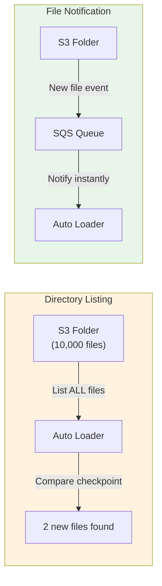

# §2 AUTO LOADER — Incremental File Ingestion (cloudFiles)

> **Exam Weight:** 30% (shared) | **Difficulty:** Trung bình
> **Exam Guide Sub-topics:** Classify valid Auto Loader sources, incremental use cases, syntax

---

## TL;DR

**Auto Loader** = cơ chế tự động phát hiện files MỚI trong cloud storage và ingest vào Delta Table. Dùng format `cloudFiles` với Structured Streaming. Giải quyết bài toán "chỉ đọc file mới, không đọc lại file cũ".

---

## Nền Tảng Lý Thuyết

### Bài Toán Incremental Ingestion

Hãy tưởng tượng bạn có 1 folder S3 nhận files từ hệ thống upstream:

```text
s3://raw-data/events/
├── events_20240101.json     ← đã ingest ngày 1
├── events_20240102.json     ← đã ingest ngày 2
├── events_20240103.json     ← MỚI, chưa ingest
└── events_20240104.json     ← MỚI, chưa ingest
```

**Không có Auto Loader:** Bạn phải tự viết logic:
1. Lưu danh sách files đã ingest vào database
2. List tất cả files trong folder
3. So sánh → tìm files mới
4. Đọc files mới
5. Cập nhật danh sách đã ingest

→ **Rất nhiều code**, dễ bug (miss file, đọc duplicate, crash giữa chừng).

**Có Auto Loader:** Databricks tự làm tất cả:
1. Auto Loader tự track files đã đọc (qua **checkpoint**)
2. Mỗi lần chạy, chỉ đọc files MỚI
3. Hỗ trợ retry nếu fail
4. Schema evolution tự động

### 2 Chế Độ Hoạt Động

**1. Directory Listing Mode** (mặc định)
- Cơ chế: Mỗi batch, Auto Loader **list toàn bộ directory** → so sánh với checkpoint → tìm files mới.
- Ưu điểm: Đơn giản, không cần setup gì thêm.
- Nhược điểm: Chậm nếu directory có >1 triệu files (phải list hết).

**2. File Notification Mode** (recommended cho production)
- Cơ chế: Databricks setup **cloud event notification** (AWS SQS, Azure EventGrid, GCP Pub/Sub). Khi file mới xuất hiện → cloud gửi notification → Auto Loader đọc file đó.
- Ưu điểm: Không cần list directory. Instant detection.
- Nhược điểm: Cần IAM permissions cho SQS/EventGrid setup.



### Schema Evolution & Rescued Data

**Schema Evolution:** Source thêm cột mới → Auto Loader tự detect + add cột vào bảng.

```text
Day 1: {"user_id": 1, "name": "Alice"}          → 2 columns
Day 2: {"user_id": 2, "name": "Bob", "age": 25} → 3 columns (age mới!)
Auto Loader tự thêm column "age" vào bảng Delta.
```

**Rescued Data:** File có data không match schema → thay vì fail, Auto Loader đẩy vào cột `_rescued_data`.

```text
Schema expects: user_id (INT), name (STRING)
File contains:  {"user_id": "abc", "name": "Bob"}  ← user_id sai type!
→ Row vẫn được ingest, "abc" nằm trong cột _rescued_data
→ Pipeline KHÔNG fail, bạn xử lý _rescued_data sau
```

---

## So Sánh Với Open Source

| Databricks Feature | OSS Equivalent | Khác biệt |
|-------------------|---------------|-----------|
| Auto Loader (`cloudFiles`) | Spark `readStream` + custom tracking | Auto Loader tự track files, schema evolve |
| File Notification mode | Custom S3 Event → SQS → Consumer | Databricks tự setup SQS/EventGrid |
| Directory Listing mode | `spark.readStream` + manual globbing | Auto Loader list + compare checkpoint |
| Schema Evolution | Manual `.option("mergeSchema")` | Tự infer + evolve, không cần config |
| Rescued Data Column | Không có | `_rescued_data` bắt bad data thay vì crash |

---

## Cú Pháp / Keywords Cốt Lõi

### Basic Auto Loader Syntax (THUỘC LÒNG)

```python
# Auto Loader — đọc JSON files mới từ S3
df = (spark.readStream                                 # ← Streaming read
    .format("cloudFiles")                              # ← BẮT BUỘC là "cloudFiles"
    .option("cloudFiles.format", "json")               # ← format file nguồn
    .option("cloudFiles.schemaLocation", "/checkpoint") # ← nơi lưu schema inferred
    .load("/mnt/raw/events/")                          # ← source path
)

# Write to Delta table
df.writeStream \
    .format("delta") \
    .option("checkpointLocation", "/checkpoint/bronze_events") \
    .trigger(availableNow=True) \
    .toTable("bronze.events")
```

### File Filtering — pathGlobFilter

```python
# Folder chứa lẫn .json, .csv, .png
# Chỉ muốn đọc .png files
df = (spark.readStream
    .format("cloudFiles")
    .option("cloudFiles.format", "binaryFile")
    .option("pathGlobFilter", "*.png")       # ← Filter file type
    .load("/mnt/images/")
)
```

> 🚨 **ExamTopics Q179:** Đề cho 4 đáp án code. Cách nhận diện đáp án đúng:
> 1. `readStream` (KHÔNG phải `readstream` — chữ S phải HOA)
> 2. `.option("pathGlobFilter", "*.png")` (KHÔNG phải `pathGlobfilter`)
> 3. `.load()` cuối cùng (KHÔNG phải `.append()`)

### Schema Evolution + Rescued Data

```python
df = (spark.readStream
    .format("cloudFiles")
    .option("cloudFiles.format", "json")
    .option("cloudFiles.inferColumnTypes", "true")          # Tự infer kiểu dữ liệu
    .option("cloudFiles.schemaEvolutionMode", "addNewColumns") # Tự thêm column mới
    .option("rescuedDataColumn", "_rescued_data")            # Bắt bad data
    .load("/mnt/raw/")
)
```

### Auto Loader vs COPY INTO — Bảng So Sánh

| Feature | Auto Loader | COPY INTO |
|---------|------------|-----------|
| **Cơ chế** | Streaming (`readStream`) | Batch (SQL command) |
| **File tracking** | Checkpoint (tự động) | Idempotent (tự track) |
| **Schema evolution** | ✅ Tự infer + evolve | ❌ Schema cố định khi define |
| **Rescued data** | ✅ `_rescued_data` column | ❌ Fail nếu bad data |
| **Performance (>1M files)** | ✅ File Notification = O(new files) | ❌ List all = O(total files) |
| **Khi nào dùng** | **Mặc định — recommended** | Legacy, simple 1-shot batch |
| **2026 Status** | **Primary ingestion method** | Still supported |

---

## Use Case Trong Thực Tế

| Scenario | Tool đúng | Logic |
|----------|----------|-------|
| Files liên tục đổ vào S3, chỉ đọc mới | **Auto Loader** | Tự track qua checkpoint |
| Ingest 1 lần batch 100 CSV files | COPY INTO | Simple, 1-shot, no streaming |
| Source thêm columns mới không báo trước | **Auto Loader** | Schema evolution + rescued data |
| >1 triệu files trong directory | **Auto Loader** (File Notification) | Không list toàn bộ = fast |
| Source là database (PostgreSQL) | **Lakeflow Connect** | Auto Loader = files only |

> 🚨 **ExamTopics Q17:** "Identify new files since previous run, only ingest new files" → **Auto Loader** (đáp án D). KHÔNG phải Delta Lake (storage), Unity Catalog (governance), hay Databricks SQL (BI).

---

## Cạm Bẫy Trong Đề Thi (Exam Traps)

### Trap 1: `readstream` vs `readStream` (Case-sensitive!)
- **Đáp án nhiễu:** `spark.readstream.format(...)` → **SAI** (chữ `s` thường).
- **Đúng:** `spark.readStream` (chữ `S` hoa).
- **Logic:** PySpark API dùng camelCase: `readStream`, `writeStream`, `toTable`.

### Trap 2: `.load()` vs `.append()`
- **Đáp án nhiễu:** `.append("/*.png")` → **SAI**. Không có method `.append()` trên DataStreamReader.
- **Đúng:** Luôn dùng `.load("/path/")` cho read, `.start()` hoặc `.toTable()` cho write.
- **Logic:** `load` = đọc data, `append` = mode write (khác context).

### Trap 3: Auto Loader ≠ governance tool
- **Đáp án nhiễu:** "Dùng Unity Catalog để track new files" → **SAI**.
- **Đúng:** Auto Loader = ingestion. Unity Catalog = governance (permissions, lineage).
- **Logic:** UC biết table nào ai truy cập. Auto Loader biết file nào đã đọc. Khác Layer.

---

## 🔗 Tham Khảo

- **Deep Dive:** [[01_Databricks#11. AUTO LOADER|01_Databricks.md — Section 11: Auto Loader]]
- **Official Docs:** https://docs.databricks.com/en/ingestion/cloud-object-storage/auto-loader/index.html
- **Schema Evolution:** https://docs.databricks.com/en/ingestion/cloud-object-storage/auto-loader/schema.html
