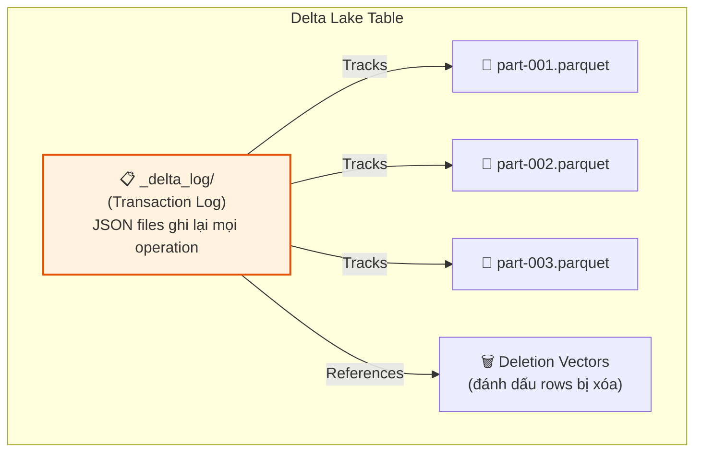
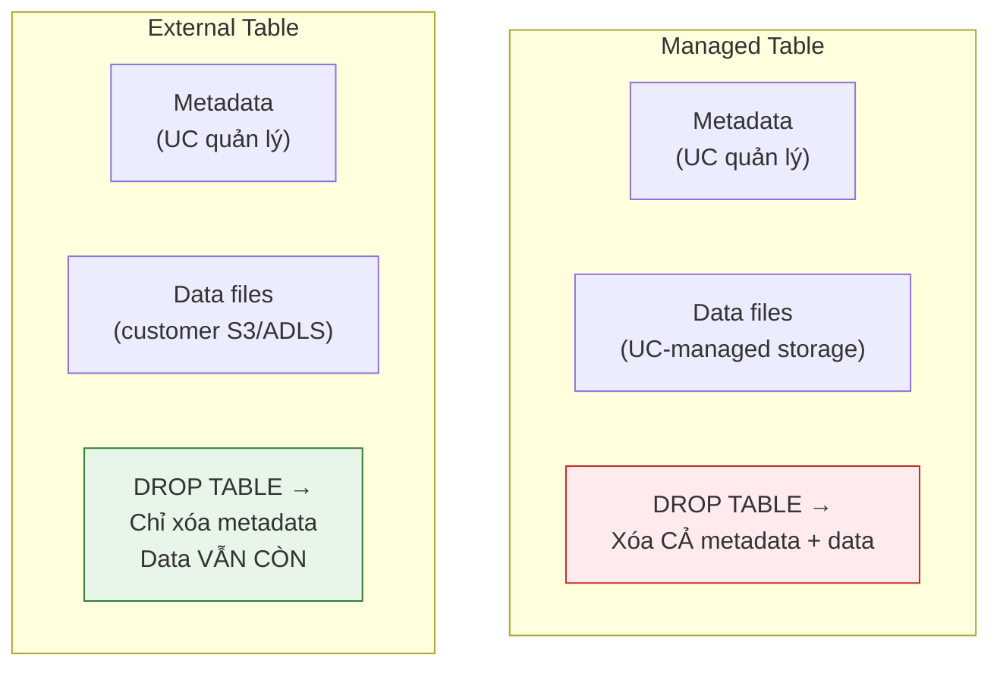

# §2 DELTA LAKE CORE — ACID, Transaction Log, Time Travel, VACUUM

> **Exam Weight:** 30% (shared) | **Difficulty:** Trung bình-Khó
> **Exam Guide Sub-topics:** ACID transactions, Transaction Log, Time Travel, VACUUM, Schema Enforcement/Evolution

---

## TL;DR

**Delta Lake** = open-source storage layer biến Parquet files thành bảng có ACID transactions, Time Travel, VACUUM (dọn files rác), và Schema Enforcement. Mọi thay đổi được ghi vào **Transaction Log** (`_delta_log/`).

---

## Nền Tảng Lý Thuyết

### Tại sao cần Delta Lake? — Parquet không đủ

**Parquet** là format file columnar, rất tốt cho analytics (đọc cột nhanh, nén tốt). Nhưng Parquet **KHÔNG CÓ:**
- **ACID Transactions:** 2 jobs write cùng lúc → data corruption.
- **Versioning:** Không time travel, không rollback.
- **Schema enforcement:** Ai cũng write bất kỳ schema nào.
- **UPDATE/DELETE:** Parquet = immutable. Muốn xóa 1 row = rewrite cả file.

**Delta Lake** thêm 1 layer lên trên Parquet:



### Transaction Log — "Cuốn Sổ Nhật Ký"

Transaction Log (`_delta_log/`) là **trái tim** của Delta Lake. Mỗi operation (INSERT, UPDATE, DELETE, MERGE) tạo 1 file JSON mới:

```text
_delta_log/
├── 00000000000000000000.json   ← Version 0: CREATE TABLE
├── 00000000000000000001.json   ← Version 1: INSERT 1000 rows
├── 00000000000000000002.json   ← Version 2: UPDATE 50 rows
├── 00000000000000000003.json   ← Version 3: DELETE 10 rows
├── 00000000000000000004.json   ← Version 4: OPTIMIZE (compact files)
└── 00000000000000000010.checkpoint.parquet  ← Checkpoint mỗi 10 versions
```

**Mỗi JSON file chứa:**
- Add: list files Parquet được thêm
- Remove: list files Parquet bị loại bỏ
- Metadata: schema changes, config updates

**ACID đạt được nhờ:** Mỗi write = 1 atomic JSON file. Nếu write fail giữa chừng → JSON file không hoàn chỉnh → Delta bỏ qua = data không bị corrupt.

### Time Travel — "Quay Ngược Thời Gian"

Vì Transaction Log lưu MỌI version, bạn có thể query bất kỳ version nào trong quá khứ:

```text
Version 0: CREATE TABLE students (id, name, grade)
Version 1: INSERT 100 students
Version 2: INSERT 50 more students → total 150
Version 3: UPDATE SET grade='A' WHERE id=5
Version 4: DELETE WHERE grade='F'
Version 5: UPDATE SET name='Bob' WHERE id=10

Nếu bạn phát hiện UPDATE ở version 5 sai:
→ Query version 4 để xem data TRƯỚC khi sai
→ Hoặc RESTORE về version 4
```

### VACUUM — "Dọn Rác"

Khi bạn UPDATE/DELETE, Delta **KHÔNG xóa** Parquet file cũ (vì Time Travel cần). Theo thời gian, files cũ chất đống → tốn storage.

**VACUUM = xóa Parquet files cũ hơn retention period (mặc định 7 ngày).**

```text
Trước VACUUM:
├── part-001.parquet  ← Current (version 5)
├── part-002.parquet  ← Current (version 5)
├── part-old-1.parquet  ← Old (version 1) → sẽ bị xóa
├── part-old-2.parquet  ← Old (version 2) → sẽ bị xóa
└── part-old-3.parquet  ← Old (version 3) → sẽ bị xóa

Sau VACUUM RETAIN 168 HOURS:
├── part-001.parquet  ← Giữ lại
├── part-002.parquet  ← Giữ lại
(old files đã bị xóa → Time Travel về version cũ KHÔNG ĐƯỢC NỮA)
```

### OPTIMIZE & Z-ORDER BY — Chống Phân Mảnh

Khi streaming ghi liên tục, Spark tạo ra hàng triệu file Parquet cực nhỏ (Small Files Problem). Điều này làm chậm query trầm trọng do IO overhead.

**`OPTIMIZE`**: Gộp các files nhỏ thành files lớn hơn (mặc định 1GB).
**`ZORDER BY`**: Đi kèm với `OPTIMIZE`, sắp xếp dữ liệu *bên trong* các Parquet files theo một nhóm cột để tăng tốc độ truy vấn (Data-skipping/Colocation). Khác với Partitioning, Z-Order thường dùng cho cột có High-Cardinality (nhiều giá trị khác biệt như `user_id`, `order_id`).

```sql
OPTIMIZE events ZORDER BY (user_id, event_time);
```

### Tạo & Ghi Đè Bảng: CRAS vs INSERT OVERWRITE vs Temp Views

- **CRAS (`CREATE OR REPLACE TABLE`)**: Thay thế HOÀN TOÀN bảng cũ, bao gồm cả schema (cấu trúc) và data. Đăng ký thẳng vào Unity Catalog.
- **`INSERT OVERWRITE`**: Chỉ ghi đè dữ liệu, KHÔNG ghi đè schema. Nếu schema mới khác cũ → Fail (trừ khi bật schema evolution). Nhanh hơn CRAS một chút vì không đụng tới metadata.
- **`CREATE OR REPLACE TEMP VIEW`**: Chỉ tạo khung nhìn TẠM THỜI gỡ gạc trên cluster hiện tại. Không tồn tại trong Unity Catalog. Mất đi khi tắt cluster. Rất hữu dụng cho intermediate CTEs trong pipeline.

### Schema Enforcement vs Schema Evolution

**Schema Enforcement** (mặc định BẬT): Nếu data write có schema khác table → **REJECT write**, báo lỗi.

```text
Table schema: (id INT, name STRING)
Write data:   (id INT, name STRING, age INT)  ← có column "age" thừa
→ AnalysisException: column "age" không tồn tại trong schema
```

**Schema Evolution**: Cho phép tự thêm columns mới.

```text
Bật schema evolution → column "age" được tự động thêm vào table
Table schema mới: (id INT, name STRING, age INT)
```

### Managed vs External Tables



---

## Cú Pháp / Keywords Cốt Lõi

### Time Travel (THUỘC LÒNG 2 syntax)

```sql
-- Cách 1: Theo VERSION number
SELECT * FROM students VERSION AS OF 3;

-- Cách 2: Theo TIMESTAMP
SELECT * FROM students TIMESTAMP AS OF '2024-04-22T14:32:47.000+00:00';

-- Xem lịch sử versions
DESCRIBE HISTORY students;
-- Output: version | timestamp | operation | userName

-- RESTORE: rollback table về version cũ (DESTRUCTIVE!)
RESTORE TABLE students TO VERSION AS OF 3;
```

> 🚨 **ExamTopics Q59:** "Query table BEFORE the UPDATE at version 5" → dùng **`VERSION AS OF 4`** (version TRƯỚC update). `VERSION AS OF 5` = data SAU update.

> 🚨 **ExamTopics Q70:** Analyst cần xem data 2 tuần trước → DE nên: **Identify version from transaction log, share version number for `VERSION AS OF` query** (đáp án B). KHÔNG dùng RESTORE (sẽ rollback production table!).

### VACUUM

```sql
-- Xóa old files, giữ lại 7 ngày (168 hours)
VACUUM students RETAIN 168 HOURS;

-- ⚠️ QUAN TRỌNG:
-- VACUUM xóa data files → Time Travel về version cũ hơn 7 ngày = FAIL
-- Default retention = 168 hours (7 ngày)
```

> 🚨 **ExamTopics Q52:** "Cannot time travel to version 3 days ago, data files deleted" → **VACUUM** was run (đáp án A). OPTIMIZE chỉ compact files, không xóa.

### Managed vs External Table

```sql
-- Managed: UC quản lý cả metadata + data
CREATE TABLE managed_orders (id INT, product STRING, amount DECIMAL);
DROP TABLE managed_orders;  -- Xóa CẢ DATA + METADATA

-- External: UC quản lý metadata, data ở ngoài
CREATE TABLE external_orders (id INT, product STRING, amount DECIMAL)
LOCATION 's3://my-bucket/external/orders/';
DROP TABLE external_orders;  -- Chỉ xóa METADATA, data S3 VẪN CÒN
```

### Schema Evolution

```python
# PySpark: bật merge schema
df.write.format("delta") \
    .option("mergeSchema", "true") \
    .mode("append") \
    .saveAsTable("my_table")
```

```sql
-- SQL: bật column mapping cho rename/drop columns
ALTER TABLE my_table SET TBLPROPERTIES ('delta.columnMapping.mode' = 'name');
```

---

## Khung Tư Duy Trước Khi Vào Trap

### Delta Lake nên được hiểu theo 3 lớp
- Lớp dữ liệu: Parquet files.
- Lớp metadata/transaction: `_delta_log`.
- Lớp vận hành: OPTIMIZE/VACUUM/time travel/schema rules.

### Khi gặp câu hỏi khôi phục dữ liệu
- Nếu chỉ cần "xem trạng thái cũ" → `VERSION AS OF` / `TIMESTAMP AS OF`.
- Nếu cần "đưa bảng quay lại trạng thái cũ" mới cân nhắc `RESTORE`.
- Luôn kiểm tra VACUUM retention trước khi kỳ vọng time travel.

### Lỗi tư duy thường gặp
- Nghĩ OPTIMIZE là dọn rác lịch sử (sai).
- Nghĩ VACUUM vô hại với time travel (sai).

## Giải Thích Sâu Các Chỗ Dễ Nhầm (Đối Chiếu Docs Mới)

### 1) Time Travel và RESTORE là hai mục tiêu khác nhau
- Time Travel (`VERSION AS OF` / `TIMESTAMP AS OF`) dùng để đọc lại trạng thái lịch sử mà không đổi trạng thái hiện tại của bảng.
- RESTORE dùng để đưa trạng thái bảng về một phiên bản trước đó theo mục tiêu vận hành.
- Vì vậy khi đề bài chỉ cần "điều tra" hoặc "so sánh dữ liệu", ưu tiên Time Travel trước; không nhảy ngay sang RESTORE.

### 2) VACUUM là quyết định vòng đời dữ liệu, không phải thao tác dọn dẹp vô thưởng vô phạt
- Sau khi file cũ bị dọn vượt ngưỡng retention, một số phiên bản lịch sử sẽ không còn đọc được đầy đủ.
- Đây là trade-off chính thức giữa chi phí lưu trữ và khả năng truy hồi lịch sử.
- Do đó retention cần thống nhất với nhu cầu audit/compliance ngay từ thiết kế.

### 3) Managed vs External cần hiểu theo ownership + lifecycle
- Managed table thường được Databricks/UC quản trị vòng đời dữ liệu ở mức cao hơn.
- External table giữ metadata trong UC nhưng vị trí dữ liệu do bạn chủ động kiểm soát.
- Tránh học theo một câu cực đoan; hãy map theo yêu cầu kiểm soát đường dẫn, chia sẻ liên hệ thống, và chính sách phục hồi.

### 4) Schema enforcement/evolution không đối nghịch, mà là hai chế độ phối hợp
- Bronze có thể nới lỏng hơn để tiếp nhận dữ liệu đầu vào đa dạng.
- Silver/Gold thường siết chặt để giữ hợp đồng dữ liệu cho downstream.
- Cách thiết kế này giúp vừa linh hoạt khi ingest vừa ổn định khi phục vụ BI/ML.

### 5) Deletion Vectors giúp giảm write amplification, nhưng không thay thế maintenance
- DV làm thao tác cập nhật/xóa hiệu quả hơn trong nhiều tình huống.
- Tuy nhiên để duy trì trạng thái lưu trữ và hiệu năng truy vấn dài hạn, bạn vẫn cần chiến lược optimize/maintenance phù hợp.

---

## Cạm Bẫy Trong Đề Thi (Exam Traps) — Trích Từ ExamTopics

## Học Sâu Trước Khi Vào Trap

### 1) Mental Model: Delta là giao kèo giữa Data Files và Transaction Log
- Parquet files lưu payload dữ liệu.
- `_delta_log` lưu lịch sử commit và trạng thái bảng theo version.
- Time travel, ACID, schema enforcement đều dựa vào tính nhất quán giữa hai lớp này.

### 2) Phân biệt "phân tích trạng thái cũ" và "khôi phục trạng thái cũ"
- Phân tích: query bằng `VERSION AS OF`/`TIMESTAMP AS OF`.
- Khôi phục: thao tác thay đổi trạng thái hiện tại (cần cẩn trọng cao).
- Đây là cặp bẫy exam rất hay ra vì nhiều người nhầm hành vi read-only với write-back.

### 3) Vòng đời file và retention
- `OPTIMIZE` tác động bố cục file để đọc nhanh hơn.
- `VACUUM` xóa file cũ vượt retention, ảnh hưởng khả năng time travel.
- Nắm rõ retention policy là điều kiện bắt buộc trước mọi quyết định rollback/phân tích lịch sử.

### 4) Schema governance trong thực tế
- Enforcement giúp chặn dữ liệu sai ngay lúc ghi.
- Evolution giúp mở rộng schema có kiểm soát.
- Không nên bật evolve mù quáng ở bảng serving nếu chưa có data contract.

### 5) Checklist tự kiểm
- Bạn mô tả được transaction log chứa gì và dùng để làm gì chưa?
- Bạn phân biệt được read lịch sử vs restore trạng thái hiện tại chưa?
- Bạn hiểu tác động của VACUUM lên time travel chưa?


### Trap 1: VACUUM Phá Hủy Time Travel (Q52)
- **Tình huống:** Kỹ sư cố gắng dùng Time travel để quay về bản snapshot 3 ngày trước nhưng thất bại vì báo lỗi "data files have been deleted". Lệnh nào đã gây ra cớ sự này?
- **Đáp án đúng:** Lệnh **VACUUM** (Đáp án A). VACUUM xóa sạch các file dữ liệu cũ không còn được tham chiếu trong state hiện tại.
- **Bẫy nhiễu:** Đừng chọn OPTIMIZE. OPTIMIZE chỉ gộp các file nhỏ thành file lớn (compact) nhưng không hề xóa vĩnh viễn các file cũ liền mạch (files cũ được đánh dấu là tombstone nhưng vẫn giữ lại để phục vụ Time Travel cho đến khi bị VACUUM càn quét).

### Trap 2: Xem Data TRƯỚC Khi Bị Lỗi (Q59)
- **Tình huống:** Lệnh `DESCRIBE HISTORY students` hiển thị transaction log. Bạn cần query bảng **ở trạng thái phiên bản ngay trước thời điểm xảy ra UPDATE** trong log đó.
- **Cú pháp hợp lệ (Đáp án B):** Dùng `SELECT * FROM students TIMESTAMP AS OF 'thời_gian_đó'`. Hoặc dùng `VERSION AS OF n-1` (tức là nếu log báo lỗi sinh ra version 5, thì bạn phải xem lại version 4).
- **Đáp án nhiễu:** `SELECT * FROM students@v4` (Cú pháp lạ, sai hoàn toàn) hoặc `FROM HISTORY VERSION AS OF 3` (Không có từ khóa `HISTORY` trong mệnh đề FROM).

### Trap 3: Phương Pháp Khôi Phục Snapshot (Q70)
- **Tình huống:** Ngân hàng cần "phân tích" (analyze) một snapshot dữ liệu từ 2 tuần trước. DE nên hỗ trợ Analyst bằng cách nào?
- **Cách làm đúng (Đáp án B):** Tìm chính xác version number tương ứng mốc 2 tuần trước trong Transaction log, sau đó chia sẻ version number cho Analyst để họ tự query read-only bằng cú pháp `VERSION AS OF`.
- **Bẫy cực nguy hiểm (Đáp án C):** Dùng lệnh `RESTORE`. Tại sao lại sai? Vì Analyst chỉ muốn XEM (query), nếu bạn gõ RESTORE thì bạn sẽ **quay ngược thời gian toàn bộ bảng gốc** (rollback production table trên hệ thống), hủy hoại dữ liệu mới thu thập được trong 2 tuần gần nhất. Truncate rồi reload (Đáp án A) cũng là một cách xử lý thảm họa.

### Trap 4: Managed Table DROP Behavior (Q107)
- Nếu `DROP TABLE` làm mất cả metadata và data files trên storage, đó là dấu hiệu bảng là **managed table**.
- External table khi DROP chỉ mất metadata, data files vẫn còn ở location ngoài.

### Trap 5: INSERT INTO để Append Record (Q100)
- Câu append một bản ghi mới vào Delta table: syntax đúng là **`INSERT INTO my_table VALUES (...)`**.
- `UPDATE ... VALUES (...)` là cú pháp sai ngữ cảnh vì UPDATE cần `SET` + điều kiện.

---

## 🔗 Tham Khảo

- **Deep Dive:** [[01_Databricks#5. DELTA LAKE 3.x ECOSYSTEM|01_Databricks.md — Section 5: Delta Lake 3.x]]
- **Official Docs:** https://docs.databricks.com/en/delta/index.html
- **Time Travel:** https://docs.databricks.com/en/delta/history.html
- **VACUUM:** https://docs.databricks.com/en/sql/language-manual/delta-vacuum.html
