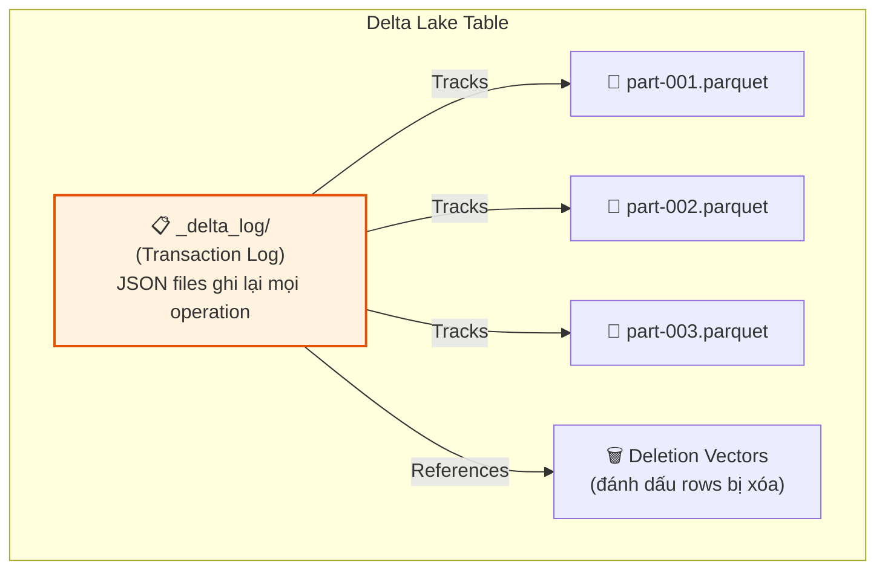
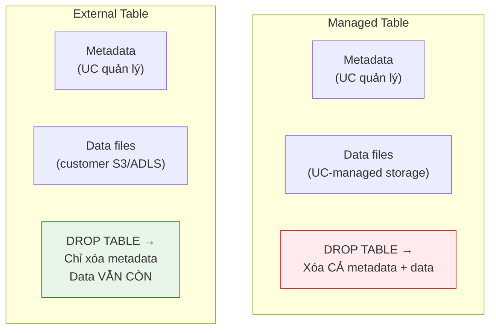

# §2 DELTA LAKE CORE — ACID, Transaction Log, Time Travel, VACUUM

> **Exam Weight:** 30% (shared) | **Difficulty:** Trung bình-Khó
> **Exam Guide Sub-topics:** ACID transactions, Transaction Log, Time Travel, VACUUM, Schema Enforcement/Evolution

---

## TL;DR

**Delta Lake** = open-source storage layer biến Parquet files thành bảng có ACID transactions, Time Travel, VACUUM (dọn files rác), và Schema Enforcement. Mọi thay đổi được ghi vào **Transaction Log** (`_delta_log/`).

---

## Nền Tảng Lý Thuyết

### Tại sao cần Delta Lake? — Parquet không đủ

**Parquet** là format file columnar, rất tốt cho analytics (đọc cột nhanh, nén tốt). Nhưng Parquet **KHÔNG CÓ:**
- **ACID Transactions:** 2 jobs write cùng lúc → data corruption.
- **Versioning:** Không time travel, không rollback.
- **Schema enforcement:** Ai cũng write bất kỳ schema nào.
- **UPDATE/DELETE:** Parquet = immutable. Muốn xóa 1 row = rewrite cả file.

**Delta Lake** thêm 1 layer lên trên Parquet:



### Transaction Log — "Cuốn Sổ Nhật Ký"

Transaction Log (`_delta_log/`) là **trái tim** của Delta Lake. Mỗi operation (INSERT, UPDATE, DELETE, MERGE) tạo 1 file JSON mới:

```text
_delta_log/
├── 00000000000000000000.json   ← Version 0: CREATE TABLE
├── 00000000000000000001.json   ← Version 1: INSERT 1000 rows
├── 00000000000000000002.json   ← Version 2: UPDATE 50 rows
├── 00000000000000000003.json   ← Version 3: DELETE 10 rows
├── 00000000000000000004.json   ← Version 4: OPTIMIZE (compact files)
└── 00000000000000000010.checkpoint.parquet  ← Checkpoint mỗi 10 versions
```

**Mỗi JSON file chứa:**
- Add: list files Parquet được thêm
- Remove: list files Parquet bị loại bỏ
- Metadata: schema changes, config updates

**ACID đạt được nhờ:** Mỗi write = 1 atomic JSON file. Nếu write fail giữa chừng → JSON file không hoàn chỉnh → Delta bỏ qua = data không bị corrupt.

### Time Travel — "Quay Ngược Thời Gian"

Vì Transaction Log lưu MỌI version, bạn có thể query bất kỳ version nào trong quá khứ:

```text
Version 0: CREATE TABLE students (id, name, grade)
Version 1: INSERT 100 students
Version 2: INSERT 50 more students → total 150
Version 3: UPDATE SET grade='A' WHERE id=5
Version 4: DELETE WHERE grade='F'
Version 5: UPDATE SET name='Bob' WHERE id=10

Nếu bạn phát hiện UPDATE ở version 5 sai:
→ Query version 4 để xem data TRƯỚC khi sai
→ Hoặc RESTORE về version 4
```

### VACUUM — "Dọn Rác"

Khi bạn UPDATE/DELETE, Delta **KHÔNG xóa** Parquet file cũ (vì Time Travel cần). Theo thời gian, files cũ chất đống → tốn storage.

**VACUUM = xóa Parquet files cũ hơn retention period (mặc định 7 ngày).**

```text
Trước VACUUM:
├── part-001.parquet  ← Current (version 5)
├── part-002.parquet  ← Current (version 5)
├── part-old-1.parquet  ← Old (version 1) → sẽ bị xóa
├── part-old-2.parquet  ← Old (version 2) → sẽ bị xóa
└── part-old-3.parquet  ← Old (version 3) → sẽ bị xóa

Sau VACUUM RETAIN 168 HOURS:
├── part-001.parquet  ← Giữ lại
├── part-002.parquet  ← Giữ lại
(old files đã bị xóa → Time Travel về version cũ KHÔNG ĐƯỢC NỮA)
```

### Schema Enforcement vs Schema Evolution

**Schema Enforcement** (mặc định BẬT): Nếu data write có schema khác table → **REJECT write**, báo lỗi.

```text
Table schema: (id INT, name STRING)
Write data:   (id INT, name STRING, age INT)  ← có column "age" thừa
→ AnalysisException: column "age" không tồn tại trong schema
```

**Schema Evolution**: Cho phép tự thêm columns mới.

```text
Bật schema evolution → column "age" được tự động thêm vào table
Table schema mới: (id INT, name STRING, age INT)
```

### Managed vs External Tables



---

## Cú Pháp / Keywords Cốt Lõi

### Time Travel (THUỘC LÒNG 2 syntax)

```sql
-- Cách 1: Theo VERSION number
SELECT * FROM students VERSION AS OF 3;

-- Cách 2: Theo TIMESTAMP
SELECT * FROM students TIMESTAMP AS OF '2024-04-22T14:32:47.000+00:00';

-- Xem lịch sử versions
DESCRIBE HISTORY students;
-- Output: version | timestamp | operation | userName

-- RESTORE: rollback table về version cũ (DESTRUCTIVE!)
RESTORE TABLE students TO VERSION AS OF 3;
```

> 🚨 **ExamTopics Q59:** "Query table BEFORE the UPDATE at version 5" → dùng **`VERSION AS OF 4`** (version TRƯỚC update). `VERSION AS OF 5` = data SAU update.

> 🚨 **ExamTopics Q70:** Analyst cần xem data 2 tuần trước → DE nên: **Identify version from transaction log, share version number for `VERSION AS OF` query** (đáp án B). KHÔNG dùng RESTORE (sẽ rollback production table!).

### VACUUM

```sql
-- Xóa old files, giữ lại 7 ngày (168 hours)
VACUUM students RETAIN 168 HOURS;

-- ⚠️ QUAN TRỌNG:
-- VACUUM xóa data files → Time Travel về version cũ hơn 7 ngày = FAIL
-- Default retention = 168 hours (7 ngày)
```

> 🚨 **ExamTopics Q52:** "Cannot time travel to version 3 days ago, data files deleted" → **VACUUM** was run (đáp án A). OPTIMIZE chỉ compact files, không xóa.

### Managed vs External Table

```sql
-- Managed: UC quản lý cả metadata + data
CREATE TABLE managed_orders (id INT, product STRING, amount DECIMAL);
DROP TABLE managed_orders;  -- Xóa CẢ DATA + METADATA

-- External: UC quản lý metadata, data ở ngoài
CREATE TABLE external_orders (id INT, product STRING, amount DECIMAL)
LOCATION 's3://my-bucket/external/orders/';
DROP TABLE external_orders;  -- Chỉ xóa METADATA, data S3 VẪN CÒN
```

### Schema Evolution

```python
# PySpark: bật merge schema
df.write.format("delta") \
    .option("mergeSchema", "true") \
    .mode("append") \
    .saveAsTable("my_table")
```

```sql
-- SQL: bật column mapping cho rename/drop columns
ALTER TABLE my_table SET TBLPROPERTIES ('delta.columnMapping.mode' = 'name');
```

---

## Cạm Bẫy Trong Đề Thi (Exam Traps)

### Trap 1: VACUUM ≠ OPTIMIZE
- **VACUUM** = xóa old data files → mất Time Travel cũ.
- **OPTIMIZE** = compact small files → merge nhiều files nhỏ thành ít files lớn. KHÔNG xóa data.
- Đề hỏi "why can't time travel?" → **VACUUM**, không phải OPTIMIZE.

### Trap 2: Time Travel syntax sai
- ❌ `SELECT * FROM students@v4` → SAI, không có syntax `@v`.
- ❌ `SELECT * FROM students FROM HISTORY VERSION AS OF 3` → SAI.
- ✅ Chỉ 2 cú pháp hợp lệ: `VERSION AS OF n` và `TIMESTAMP AS OF 'ts'`.

### Trap 3: VERSION AS OF n = state SAU commit n
- Nếu UPDATE ở version 5 bị sai, muốn xem data TRƯỚC update → dùng `VERSION AS OF 4`.
- `VERSION AS OF 5` = data ĐÃ BỊ UPDATE (sai).

### Trap 4: RESTORE vs SELECT VERSION AS OF
- `SELECT * FROM t VERSION AS OF 4` = **read-only**, table hiện tại KHÔNG đổi.
- `RESTORE TABLE t TO VERSION AS OF 4` = **destructive**, table hiện tại bị ROLLBACK.
- Q70: Analyst chỉ cần **query** → dùng SELECT, KHÔNG dùng RESTORE.

---

## 🔗 Tham Khảo

- **Deep Dive:** [[01_Databricks#5. DELTA LAKE 3.x ECOSYSTEM|01_Databricks.md — Section 5: Delta Lake 3.x]]
- **Official Docs:** https://docs.databricks.com/en/delta/index.html
- **Time Travel:** https://docs.databricks.com/en/delta/history.html
- **VACUUM:** https://docs.databricks.com/en/sql/language-manual/delta-vacuum.html
