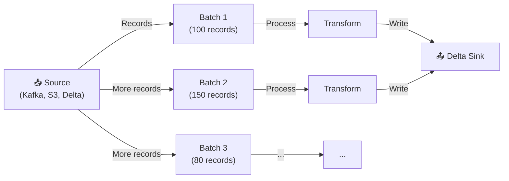

# §2 STRUCTURED STREAMING — Triggers, Watermark, Checkpointing

> **Exam Weight:** 30% (shared) | **Difficulty:** Trung bình
> **Exam Guide Sub-topics:** readStream/writeStream, Trigger modes, Checkpointing, Watermarking

---

## TL;DR

**Structured Streaming** = Spark engine xử lý data liên tục dưới dạng micro-batches. Kết hợp với Delta Lake để đạt exactly-once semantics. Keyword quan trọng nhất: **trigger modes** (đề thi hỏi rất nhiều).

---

## Nền Tảng Lý Thuyết

### Batch vs Streaming — Khác Nhau Cơ Bản

**Batch Processing** (truyền thống):
- Đọc data → xử lý → ghi kết quả → DỪNG.
- Ví dụ: ETL chạy 2AM mỗi đêm, xử lý data ngày hôm trước.
- Nhược điểm: Data cũ nhất = 24 giờ (chờ đến run tiếp theo).

**Streaming** (real-time):
- Đọc data liên tục → xử lý → ghi → lặp lại mãi mãi.
- Ví dụ: IoT sensors gửi data mỗi giây, hệ thống fraud detection.
- Ưu điểm: Data fresh (near real-time).

**Spark Structured Streaming = Streaming nhưng viết code như Batch:**

```python
# Batch code:
df = spark.read.format("json").load("/data/")

# Streaming code (gần giống!):
df = spark.readStream.format("json").load("/data/")
#         ^^^^^^^^^^
# Chỉ đổi read → readStream, Spark tự xử lý incremental
```

### Micro-Batch Architecture

Structured Streaming KHÔNG xử lý từng record 1. Thay vào đó, nó gom records thành **micro-batches** và xử lý mỗi batch:



### Trigger Modes — "Mỗi Batch Kích Hoạt Khi Nào?"

Đây là phần đề thi hỏi **NHIỀU NHẤT** về Streaming:

| Trigger | Hành vi | Ví dụ thực tế |
|---------|---------|--------------|
| `trigger(availableNow=True)` | Process ALL available data → chia nhiều batches nếu cần → **STOP** | Incremental ETL: "xử lý hết data mới rồi tắt" |
| `trigger(once=True)` | Process chỉ **1 micro-batch** → STOP | Legacy, thay thế bởi `availableNow` |
| `trigger(processingTime="30 seconds")` | Chạy mỗi 30 giây, liên tục | Real-time dashboard |
| Không set trigger | Chạy liên tục ASAP (batch xong là batch tiếp) | Lowest latency streaming |

**Khác biệt then chốt: `availableNow` vs `once`**

```text
Data có 10,000 records mới:

trigger(once=True):
  Batch 1: process 5,000 records → STOP
  → Còn 5,000 records CHƯA xử lý!

trigger(availableNow=True):
  Batch 1: process 5,000 records
  Batch 2: process 3,000 records
  Batch 3: process 2,000 records → HẾT data → STOP
  → ALL records đã xử lý!
```

### Checkpoint — "Bookmark Của Stream"

Checkpoint = nơi lưu **progress** (đã đọc đến đâu, offset nào). Như bookmark trong sách — nếu bạn dừng đọc, lần sau mở lại biết đọc từ đâu.

```text
Checkpoint chứa:
├── offsets/          ← Đã đọc đến offset nào
├── commits/          ← Batch nào đã commit thành công
├── state/            ← State cho aggregation/windowing
└── metadata           ← Config của query
```

**Tại sao checkpoint BẮT BUỘC?**
- Không có checkpoint → restart = đọc lại từ đầu = **duplicate data**.
- Có checkpoint → restart = đọc tiếp từ chỗ dừng = **exactly-once**.

### Watermark — "Chấp Nhận Trễ Bao Lâu"

Trong streaming, data có thể đến **trễ** (ví dụ: event lúc 10:00 nhưng đến hệ thống lúc 10:15).

**Watermark = ngưỡng chấp nhận late data.** Data trễ hơn watermark bị bỏ qua.

```python
# Watermark 1 giờ: chấp nhận data trễ tối đa 1 tiếng
stream_df = (spark.readStream.table("events")
    .withWatermark("event_time", "1 hour")
    .groupBy(window("event_time", "10 minutes"), "region")
    .count()
)

# event_time = 10:00, arrive at 10:30 → ✅ accepted (trễ 30 min < 1 hour)
# event_time = 10:00, arrive at 11:30 → ❌ dropped (trễ 1.5 hours > 1 hour)
```

---

## So Sánh Với Open Source

| Databricks Feature | OSS Equivalent | Khác biệt |
|-------------------|---------------|-----------|
| Structured Streaming | Apache Spark Structured Streaming | Tương tự, Databricks thêm optimizations |
| `trigger(availableNow=True)` | ❌ Không có | Databricks-specific, process all → stop |
| Delta as Sink | Parquet sink | Delta + checkpoint = exactly-once |
| Auto Loader source | Custom file source | `cloudFiles` format, file tracking |

---

## Cú Pháp / Keywords Cốt Lõi

### Complete Streaming Pattern

```python
# 1. READ streaming source
stream_df = (spark.readStream
    .format("delta")                    # Source format
    .table("bronze.events")             # Source table
)

# 2. TRANSFORM (giống hệt batch!)
clean_df = (stream_df
    .filter("user_id IS NOT NULL")
    .withColumn("event_date", to_date("event_time"))
)

# 3. WRITE to sink
query = (clean_df.writeStream
    .format("delta")                                        # Sink format
    .option("checkpointLocation", "/checkpoints/silver")    # BẮT BUỘC
    .trigger(availableNow=True)                             # Trigger mode
    .outputMode("append")                                   # Output mode
    .toTable("silver.events")                               # Target table
)
```

> 🚨 **ExamTopics Q67:** "Process ALL available data in as many batches as required" → **`trigger(availableNow=True)`** (đáp án A).
> - `trigger(once=True)` = chỉ 1 batch → CÓ THỂ KHÔNG HẾT data.
> - `trigger(processingTime="once")` → **SAI syntax** (processingTime nhận interval như "30 seconds").
> - `trigger(continuous="once")` → **SAI syntax**.

---

## Use Case Trong Thực Tế

### Use Case 1: Chạy backlog dữ liệu theo lịch đêm
- Mục tiêu: xử lý hết dữ liệu hiện có rồi dừng.
- Cấu hình gợi ý: `trigger(availableNow=True)` + checkpoint ổn định.

### Use Case 2: Đồng bộ gần realtime mỗi 5 giây
- Mục tiêu: cập nhật bảng đích đều theo chu kỳ.
- Cấu hình gợi ý: `trigger(processingTime="5 seconds")`.

### Use Case 3: Pipeline cần khả năng resume sau sự cố
- Mục tiêu: restart không ghi sai kết quả.
- Cấu hình gợi ý: checkpoint cố định + sink có tính idempotent.

## Ôn Nhanh 5 Phút

- `availableNow=True` = xử lý hết backlog.
- `once=True` = 1 micro-batch duy nhất.
- `processingTime="..."` = chạy theo chu kỳ.
- Checkpoint là bắt buộc cho production reliability.
- Không đổi đường dẫn checkpoint giữa các lần chạy cùng pipeline.

---

## Khung Tư Duy Trước Khi Vào Trap

### Câu streaming thường kiểm tra 3 trục
- Trigger semantics (khi nào chạy batch).
- State/recovery semantics (checkpoint, offset).
- Sink semantics (append/update/complete, idempotent behavior).

### Quy tắc ra quyết định
- Muốn xử lý backlog rồi dừng: `availableNow`.
- Muốn chạy định kỳ liên tục: `processingTime`.
- Muốn bền vững khi fail/restart: checkpoint cố định + sink phù hợp.

## Giải Thích Sâu Các Chỗ Dễ Nhầm (Đối Chiếu Docs Mới)

### 1) Streaming reliability đến từ "state + sink semantics", không chỉ trigger
- Nhiều người học trigger trước rồi nghĩ chỉ cần `availableNow` là đủ an toàn.
- Trên thực tế, tính đúng đắn phụ thuộc đồng thời vào checkpoint, idempotency sink, và thiết kế transform stateful/stateless.
- Trigger chỉ quyết định nhịp chạy, không tự bảo đảm chất lượng dữ liệu.

### 2) `AvailableNow` nên là lựa chọn ưu tiên cho incremental batch-like (khi phù hợp)
- Theo hướng dẫn hiện tại, `AvailableNow` thường là phương án thực tế hơn cho kịch bản xử lý backlog rồi dừng.
- Điều này giúp tránh kỳ vọng sai của `once` trong các khối dữ liệu lớn.
- Khi viết tài liệu học, nên nêu rõ "ưu tiên" thay vì tuyên bố loại bỏ toàn bộ lựa chọn khác.

### 3) Watermark là hợp đồng về độ trễ chấp nhận
- Nó không chỉ là một option kỹ thuật, mà là quyết định nghiệp vụ: chấp nhận mất độ đầy đủ để giữ latency/state size.
- Nếu đặt watermark quá ngắn, dữ liệu đến trễ có thể không được tính vào kết quả kỳ vọng.
- Nếu đặt quá dài, state tăng và chi phí vận hành cao hơn.

### 4) Checkpoint path là danh tính pipeline
- Cùng một job logic nhưng checkpoint khác nhau có thể tạo hành vi ingest khác nhau.
- Đây là nguồn lỗi rất hay gặp khi chuyển môi trường hoặc đổi đường dẫn storage thủ công.

### 5) Tách rõ 3 câu hỏi khi debug stream
- Câu 1: Dữ liệu có đến source đúng kỳ vọng không?
- Câu 2: Query stateful có bị ảnh hưởng bởi watermark/state growth không?
- Câu 3: Sink có đảm bảo ghi đúng semantics khi retry không?
- Trả lời đủ 3 câu hỏi này giúp tránh debug theo cảm tính.

---

## Cạm Bẫy Trong Đề Thi (Exam Traps)

## Học Sâu Trước Khi Vào Trap

### 1) Mental Model: Streaming Query = Source + Trigger + State + Sink
- Source quyết định dữ liệu vào.
- Trigger quyết định nhịp xử lý.
- State/checkpoint quyết định khả năng resume và tính nhất quán.
- Sink + output mode quyết định cách materialize kết quả.

### 2) Vì sao cùng là streaming nhưng hành vi khác nhau?
- Khác trigger thì latency/cost khác.
- Khác output mode thì semantics khác.
- Khác checkpoint strategy thì độ an toàn khi retry khác.

### 3) Tư duy thiết kế production
- Xác định SLA trước: near-real-time hay backlog-drain.
- Chọn trigger tương ứng, không chọn theo thói quen.
- Cố định checkpoint location và quản trị lifecycle rõ ràng.

### 4) Late data & watermark (nên hiểu bản chất)
- Watermark không phải "xóa data trễ" ngay lập tức; nó là ranh giới để quản trị state và tính toán window.
- Chọn watermark quá ngắn có thể làm mất sự kiện hợp lệ đến trễ.

### 5) Checklist tự kiểm
- Bạn phân biệt được `availableNow`, `once`, `processingTime` chưa?
- Bạn giải thích được vì sao checkpoint bắt buộc cho resilience chưa?
- Bạn chọn output mode đúng với kiểu truy vấn aggregate chưa?


### Trap 1: `availableNow=True` vs `once=True`
- **Đáp án nhiễu:** `trigger(once=True)` khi hỏi "process ALL available data" → **SAI**.
- **Đúng:** `trigger(availableNow=True)` = process TẤT CẢ, chia nhiều batches.
- **Cách nhớ:** `once` = 1 batch ONLY. `availableNow` = MANY batches until done.

### Trap 2: Syntax sai cho trigger
- ❌ `trigger(processingTime="once")` → processingTime cần interval: "30 seconds", "1 minute".
- ❌ `trigger(continuous="once")` → continuous cần interval: "1 second".
- ✅ `trigger(availableNow=True)` hoặc `trigger(processingTime="30 seconds")`.

### Trap 3: Checkpoint = optional?
- **Đáp án nhiễu:** "Checkpoint is optional for streaming" → **SAI** cho production.
- **Đúng:** Checkpoint **BẮT BUỘC** cho fault tolerance + exactly-once.
- **Logic:** No checkpoint = restart from beginning = duplicate data in sink.

### Trap 4: Trigger Theo Chu Kỳ Micro-batch (Q115)
- **Tình huống:** Muốn query chạy micro-batch đều đặn mỗi `5 seconds`.
- **Đáp án đúng:** `trigger(processingTime="5 seconds")`.
- **Bẫy:** `trigger(once=...)` hay `trigger(continuous=...)` không đúng với yêu cầu periodic micro-batch tiêu chuẩn.

### Trap 5: Exactly-once Reliability Components (Q118)
- Đề kiểu này thường kiểm tra cặp khái niệm **checkpointing + idempotent/replay-safe sinks** để đảm bảo retry không làm lệch kết quả cuối.
- Nếu checkpoint sai hoặc sink không idempotent, pipeline restart dễ ghi trùng.

---

## 🔗 Tham Khảo

- **Deep Dive:** [[01_Databricks#12. STRUCTURED STREAMING|01_Databricks.md — Section 12: Structured Streaming]]
- **Official Docs:** https://docs.databricks.com/en/structured-streaming/index.html
- **Triggers:** https://docs.databricks.com/en/structured-streaming/triggers.html
