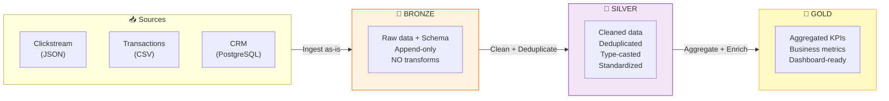

# §3 MEDALLION ARCHITECTURE — Bronze / Silver / Gold

> **Exam Weight:** 31% (shared) | **Difficulty:** Dễ
> **Exam Guide Sub-topics:** Three layers, purpose of each layer, correct operations per layer

---

## TL;DR

**Medallion Architecture** = pattern tổ chức data thành 3 tầng: **Bronze** (raw, chưa xử lý) → **Silver** (cleaned, deduplicated) → **Gold** (aggregated, business-ready). Mỗi tầng có mục đích riêng và operations riêng.

---

## Nền Tảng Lý Thuyết

### Tại sao cần Medallion? — Bài toán "Raw Data → Business Insight"

Data từ hệ thống nguồn (CRM, web logs, IoT) luôn ở dạng **"bẩn"**: null values, duplicates, wrong types, missing fields. Không thể đưa thẳng vào dashboard.

**Truyền thống:** Mỗi team tự clean data theo cách riêng → mỗi dashboard có số khác nhau → sếp tin ai?

**Medallion:** Standardize quy trình clean data thành 3 tầng rõ ràng. Mọi người dùng cùng Gold layer → single source of truth.



### Chi Tiết Từng Layer

**🥉 Bronze Layer — "Kho Nguyên Liệu"**

Tưởng tượng: nhà hàng nhận hàng → bỏ vào kho, không rửa, không cắt, không xử lý. Giữ nguyên hình dạng gốc.

| Thuộc tính | Chi tiết |
|-----------|---------|
| **Data** | Raw, as-is from source |
| **Schema** | Applied (cấu trúc cột) nhưng NOT enforced (giữ nguyên data) |
| **Operations** | Ingest only, append-only, NO transforms |
| **Quality** | Có thể có null, duplicate, wrong types |
| **Format** | Delta (always) |
| **Purpose** | Audit trail, reprocessing, debugging |

```sql
-- Bronze = raw data + schema, KHÔNG transform
CREATE TABLE bronze.raw_transactions AS
SELECT * FROM json.`/mnt/raw/transactions/`;
-- Giữ nguyên mọi thứ: null, duplicate, wrong types
```

**🥈 Silver Layer — "Bếp Sơ Chế"**

Tưởng tượng: rửa rau, cắt thịt, bỏ phần hư. Data sạch, đúng type, unique.

| Thuộc tính | Chi tiết |
|-----------|---------|
| **Data** | Clean, deduplicated, standardized |
| **Operations** | Type-cast, remove nulls, deduplicate, join reference data |
| **Quality** | High — data đã qua validation |
| **Granularity** | Entity-level (mỗi row = 1 transaction, 1 user) |
| **Purpose** | Reusable across teams, serve multiple Gold tables |

```sql
-- Silver = clean + deduplicate + type-cast
CREATE TABLE silver.clean_transactions AS
SELECT DISTINCT
    CAST(id AS INT) AS transaction_id,
    CAST(amount AS DECIMAL(10,2)) AS amount,
    CAST(ts AS TIMESTAMP) AS event_time,
    UPPER(TRIM(customer_id)) AS customer_id  -- standardize
FROM bronze.raw_transactions
WHERE id IS NOT NULL AND amount > 0;
```

**🥇 Gold Layer — "Món Ăn Thành Phẩm"**

Tưởng tượng: nấu xong, bày đẹp, sẵn sàng phục vụ khách (dashboard, report).

| Thuộc tính | Chi tiết |
|-----------|---------|
| **Data** | Aggregated, business-ready |
| **Operations** | GROUP BY, SUM, COUNT, business logic |
| **Quality** | Highest — ready for BI |
| **Granularity** | Metric-level (daily revenue, user count) |
| **Purpose** | Direct BI consumption |

```sql
-- Gold = aggregate + business metrics
CREATE TABLE gold.daily_revenue AS
SELECT
    DATE(event_time) AS report_date,
    region,
    SUM(amount) AS total_revenue,
    COUNT(*) AS num_transactions,
    AVG(amount) AS avg_order_value
FROM silver.clean_transactions
GROUP BY 1, 2;
```

### Layer Pairing — Đề Thi Hỏi Trực Tiếp

| Data example | Layer đúng | Tại sao |
|-------------|-----------|---------|
| Raw data from deposit account application | **Bronze** | Raw = chưa xử lý = Bronze |
| Cleansed master customer data | **Silver** | Cleaned + master reference = Silver |
| Summary of cash deposit by country/city | **Gold** | Aggregated = Gold |
| Deduplicated money transfer transaction | **Silver** | Deduplicated entity-level = Silver (NOT Gold) |

> 🚨 **ExamTopics Q159:** "Silver — Cleansed master customer data" → **ĐÚNG** (đáp án C).
> - "Bronze — Summary" → SAI (Bronze không aggregate).
> - "Gold — Deduplicated" → SAI (Gold = aggregated, dedup = Silver).

---

## So Sánh Với Open Source

| Concept | Truyền thống | Databricks Lakehouse |
|---------|-------------|---------------------|
| Raw Layer | Landing Zone / Staging | **Bronze** (Delta format) |
| Clean Layer | ODS / Data Mart staging | **Silver** (deduplicated, typed) |
| Business Layer | Data Mart / Cube | **Gold** (aggregated KPIs) |
| Storage | Separate DWH + Data Lake | Unified Delta Lake |

---

## Use Case Trong Thực Tế

### Use Case 1: Data từ nhiều nguồn chưa chuẩn
- Bronze: ingest nguyên trạng để giữ vết dữ liệu gốc.
- Silver: chuẩn hóa schema + deduplicate.
- Gold: tổng hợp chỉ số phục vụ dashboard.

### Use Case 2: Cần truy vết lỗi số liệu ở BI
- Kiểm tra Gold trước (logic business).
- Nếu lệch, truy về Silver (quality/transformation).
- Nếu vẫn sai, kiểm tra Bronze (raw ingestion).

### Use Case 3: Team mới cần học nhanh pipeline
- Dùng mapping Bronze/Silver/Gold như sơ đồ trách nhiệm.
- Tránh đưa business aggregation vào Silver.

## Ôn Nhanh 5 Phút

- Bronze = raw + append-first.
- Silver = clean + conform + dedup.
- Gold = aggregate + serving layer.
- Câu hỏi về "single source of truth" thường gắn Lakehouse.

---

## Khung Tư Duy Trước Khi Vào Trap

### Map nhu cầu nghiệp vụ vào layer
- Cần lưu nguyên trạng để truy vết: Bronze.
- Cần chuẩn hóa chất lượng để downstream dùng được: Silver.
- Cần KPI/BI consumption: Gold.

### Cách tránh trả lời sai theo cảm tính
- Đừng gắn "truthful" với Bronze chỉ vì là dữ liệu gốc.
- Đừng gắn "dedup" cho Gold khi chưa có aggregate logic.

## Giải Thích Sâu Các Chỗ Dễ Nhầm (Đối Chiếu Docs Mới)

### 1) Medallion là pattern khuyến nghị, không phải luật cứng
- Theo kiến trúc Lakehouse hiện đại, Bronze/Silver/Gold là mô hình rất hữu dụng để tách trách nhiệm dữ liệu.
- Nhưng tên lớp và mức chi tiết có thể điều chỉnh theo domain (ví dụ nhiều lớp silver con, hoặc serving layer riêng).
- Tư duy đúng: giữ nguyên nguyên lý trách nhiệm, linh hoạt implementation.

### 2) Bronze không đồng nghĩa "không bao giờ transform"
- Bronze ưu tiên giữ tính nguyên trạng và khả năng replay/audit.
- Tuy nhiên vẫn có thể có các xử lý tối thiểu phục vụ ingest ổn định (metadata ingest time, source file info, chuẩn hóa kỹ thuật cơ bản).
- Điều quan trọng là tránh đưa business logic nặng vào Bronze.

### 3) Silver là hợp đồng chất lượng cho toàn tổ chức
- Silver không chỉ là "bảng đã sạch" mà là lớp chuẩn hóa để nhiều nhóm downstream tái sử dụng.
- Nếu Silver thiếu chuẩn naming/type/key, Gold sẽ nhân bản logic làm sạch ở nhiều nơi và tạo drift.

### 4) Gold không luôn là aggregation đơn giản
- Gold có thể là bảng phục vụ phân tích theo use-case cụ thể, gồm cả semantic model hoặc feature-like outputs tùy bài toán.
- Ý chính vẫn là: dữ liệu đã được đóng gói theo nhu cầu tiêu thụ nghiệp vụ.

### 5) Cách học bền vững cho exam và production
- Với exam: map đúng tác vụ vào đúng layer.
- Với production: map đúng SLA, ownership, và data contract vào từng layer.
- Khi hai góc nhìn này đồng nhất, bạn vừa làm bài tốt vừa thiết kế pipeline thực tế vững.

---

## Cạm Bẫy Trong Đề Thi (Exam Traps)

## Học Sâu Trước Khi Vào Trap

### 1) Mental Model: Medallion là hợp đồng chất lượng theo lớp
- Bronze: hợp đồng về tính đầy đủ và khả năng truy vết.
- Silver: hợp đồng về độ sạch và chuẩn hóa kỹ thuật.
- Gold: hợp đồng về độ sẵn sàng cho nghiệp vụ/BI.

### 2) Vì sao kiến trúc này quan trọng trong vận hành?
- Dễ định vị lỗi theo layer thay vì đổ lỗi toàn pipeline.
- Dễ tách trách nhiệm giữa ingestion team, transformation team, analytics team.
- Dễ mở rộng khi thêm nguồn mới hoặc thêm sản phẩm dữ liệu.

### 3) Sai lầm phổ biến khi triển khai
- Làm business aggregation quá sớm ở Silver.
- "Dọn sạch" dữ liệu ngay ở Bronze khiến mất khả năng forensic/debug.
- Không giữ lineage rõ ràng giữa các lớp.

### 4) Cách chuyển yêu cầu business thành thiết kế layer
- Yêu cầu audit/raw replay → đẩy vào Bronze.
- Yêu cầu consistency/entity-level quality → đẩy vào Silver.
- Yêu cầu dashboard/KPI trực tiếp → đẩy vào Gold.

### 5) Checklist tự kiểm
- Bạn có định nghĩa rõ "done criteria" cho từng layer chưa?
- Bạn có quy tắc dữ liệu nào bắt buộc ở Silver chưa?
- Gold của bạn có tránh logic quá phức tạp không cần thiết chưa?


### Trap 1: Bronze ≠ Clean data
- **Đáp án nhiễu:** "Clean and standardize raw data by removing null values" ở Bronze → **SAI**.
- **Đúng:** Bronze = **raw data without transformations**, chỉ ingest + apply schema (ExamTopics Q182, đáp án A).
- **Logic:** Bronze = "chụp ảnh nguyên liệu thô". Cleaning = Silver's job.

### Trap 2: Gold ≠ Deduplicated data
- **Đáp án nhiễu:** "Gold layer = Deduplicated transactions" → **SAI**.
- **Đúng:** Deduplication = Silver layer. Gold = **aggregated** metrics.
- **Logic:** Silver = entity-level clean (mỗi row = 1 record đúng). Gold = business-level aggregate (SUM, AVG).

### Trap 3: Bronze "contains less data than raw"
- **Đáp án nhiễu:** "Bronze contains less data" hoặc "more truthful data" → **SAI**.
- **Đúng:** Bronze = raw data **with a schema applied** (same amount of data, organized).
- **ExamTopics Q50, đáp án C.**

### Trap 4: Lakehouse = single source of truth
- ExamTopics Q29: Khác DE team vs analyst team → Lakehouse giải quyết bằng **"Both teams use the same source of truth"** (đáp án B). Không phải "respond quicker" hay "report to same department."

### Trap 5: Gold vs Silver theo Mục Tiêu Dữ Liệu (Q119)
- Gold tables **có xu hướng chứa aggregations nhiều hơn** Silver tables.
- Silver vẫn giữ dữ liệu ở mức chi tiết và đã làm sạch để phục vụ nhiều downstream use cases.

### Trap 6: Silver vs Bronze - Quan Hệ Khối Lượng (Q124)
- Câu thi thường chốt theo logic: Silver áp dụng quality filters/dedup nên thường **ít dữ liệu hơn Bronze**.
- Dùng cặp nhớ: Bronze = ingest rộng; Silver = chuẩn hóa + loại bỏ rác.

### Trap 7: Chức Năng Cốt Lõi Của Silver Layer (Q183 - PDF bổ sung)
- **Đáp án đúng:** Silver layer dùng để **validate + clean + deduplicate** trước khi dữ liệu đi tiếp.
- **Cách chống nhầm:**
    - Bronze = ingest raw, không "làm đẹp".
    - Silver = chuẩn hóa dữ liệu ở mức kỹ thuật/chất lượng.
    - Gold = aggregate cho business analytics.

---

## 🔗 Tham Khảo

- **Deep Dive:** [[01_Databricks#8. LAKEFLOW DECLARATIVE PIPELINES|01_Databricks.md — Section 8]]
- **Official Docs:** https://docs.databricks.com/en/lakehouse/medallion.html
