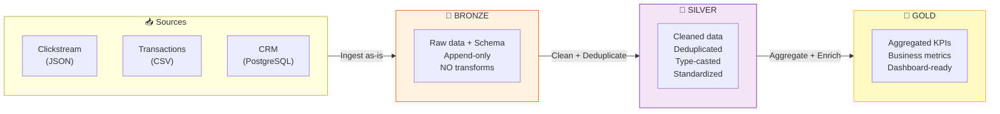

# §3 MEDALLION ARCHITECTURE — Bronze / Silver / Gold

> **Exam Weight:** 31% (shared) | **Difficulty:** Dễ
> **Exam Guide Sub-topics:** Three layers, purpose of each layer, correct operations per layer

---

## TL;DR

**Medallion Architecture** = pattern tổ chức data thành 3 tầng: **Bronze** (raw, chưa xử lý) → **Silver** (cleaned, deduplicated) → **Gold** (aggregated, business-ready). Mỗi tầng có mục đích riêng và operations riêng.

---

## Nền Tảng Lý Thuyết

### Tại sao cần Medallion? — Bài toán "Raw Data → Business Insight"

Data từ hệ thống nguồn (CRM, web logs, IoT) luôn ở dạng **"bẩn"**: null values, duplicates, wrong types, missing fields. Không thể đưa thẳng vào dashboard.

**Truyền thống:** Mỗi team tự clean data theo cách riêng → mỗi dashboard có số khác nhau → sếp tin ai?

**Medallion:** Standardize quy trình clean data thành 3 tầng rõ ràng. Mọi người dùng cùng Gold layer → single source of truth.



### Chi Tiết Từng Layer

**🥉 Bronze Layer — "Kho Nguyên Liệu"**

Tưởng tượng: nhà hàng nhận hàng → bỏ vào kho, không rửa, không cắt, không xử lý. Giữ nguyên hình dạng gốc.

| Thuộc tính | Chi tiết |
|-----------|---------|
| **Data** | Raw, as-is from source |
| **Schema** | Applied (cấu trúc cột) nhưng NOT enforced (giữ nguyên data) |
| **Operations** | Ingest only, append-only, NO transforms |
| **Quality** | Có thể có null, duplicate, wrong types |
| **Format** | Delta (always) |
| **Purpose** | Audit trail, reprocessing, debugging |

```sql
-- Bronze = raw data + schema, KHÔNG transform
CREATE TABLE bronze.raw_transactions AS
SELECT * FROM json.`/mnt/raw/transactions/`;
-- Giữ nguyên mọi thứ: null, duplicate, wrong types
```

**🥈 Silver Layer — "Bếp Sơ Chế"**

Tưởng tượng: rửa rau, cắt thịt, bỏ phần hư. Data sạch, đúng type, unique.

| Thuộc tính | Chi tiết |
|-----------|---------|
| **Data** | Clean, deduplicated, standardized |
| **Operations** | Type-cast, remove nulls, deduplicate, join reference data |
| **Quality** | High — data đã qua validation |
| **Granularity** | Entity-level (mỗi row = 1 transaction, 1 user) |
| **Purpose** | Reusable across teams, serve multiple Gold tables |

```sql
-- Silver = clean + deduplicate + type-cast
CREATE TABLE silver.clean_transactions AS
SELECT DISTINCT
    CAST(id AS INT) AS transaction_id,
    CAST(amount AS DECIMAL(10,2)) AS amount,
    CAST(ts AS TIMESTAMP) AS event_time,
    UPPER(TRIM(customer_id)) AS customer_id  -- standardize
FROM bronze.raw_transactions
WHERE id IS NOT NULL AND amount > 0;
```

**🥇 Gold Layer — "Món Ăn Thành Phẩm"**

Tưởng tượng: nấu xong, bày đẹp, sẵn sàng phục vụ khách (dashboard, report).

| Thuộc tính | Chi tiết |
|-----------|---------|
| **Data** | Aggregated, business-ready |
| **Operations** | GROUP BY, SUM, COUNT, business logic |
| **Quality** | Highest — ready for BI |
| **Granularity** | Metric-level (daily revenue, user count) |
| **Purpose** | Direct BI consumption |

```sql
-- Gold = aggregate + business metrics
CREATE TABLE gold.daily_revenue AS
SELECT
    DATE(event_time) AS report_date,
    region,
    SUM(amount) AS total_revenue,
    COUNT(*) AS num_transactions,
    AVG(amount) AS avg_order_value
FROM silver.clean_transactions
GROUP BY 1, 2;
```

### Layer Pairing — Đề Thi Hỏi Trực Tiếp

| Data example | Layer đúng | Tại sao |
|-------------|-----------|---------|
| Raw data from deposit account application | **Bronze** | Raw = chưa xử lý = Bronze |
| Cleansed master customer data | **Silver** | Cleaned + master reference = Silver |
| Summary of cash deposit by country/city | **Gold** | Aggregated = Gold |
| Deduplicated money transfer transaction | **Silver** | Deduplicated entity-level = Silver (NOT Gold) |

> 🚨 **ExamTopics Q159:** "Silver — Cleansed master customer data" → **ĐÚNG** (đáp án C).
> - "Bronze — Summary" → SAI (Bronze không aggregate).
> - "Gold — Deduplicated" → SAI (Gold = aggregated, dedup = Silver).

---

## So Sánh Với Open Source

| Concept | Truyền thống | Databricks Lakehouse |
|---------|-------------|---------------------|
| Raw Layer | Landing Zone / Staging | **Bronze** (Delta format) |
| Clean Layer | ODS / Data Mart staging | **Silver** (deduplicated, typed) |
| Business Layer | Data Mart / Cube | **Gold** (aggregated KPIs) |
| Storage | Separate DWH + Data Lake | Unified Delta Lake |

---

## Cạm Bẫy Trong Đề Thi (Exam Traps)

### Trap 1: Bronze ≠ Clean data
- **Đáp án nhiễu:** "Clean and standardize raw data by removing null values" ở Bronze → **SAI**.
- **Đúng:** Bronze = **raw data without transformations**, chỉ ingest + apply schema (ExamTopics Q182, đáp án A).
- **Logic:** Bronze = "chụp ảnh nguyên liệu thô". Cleaning = Silver's job.

### Trap 2: Gold ≠ Deduplicated data
- **Đáp án nhiễu:** "Gold layer = Deduplicated transactions" → **SAI**.
- **Đúng:** Deduplication = Silver layer. Gold = **aggregated** metrics.
- **Logic:** Silver = entity-level clean (mỗi row = 1 record đúng). Gold = business-level aggregate (SUM, AVG).

### Trap 3: Bronze "contains less data than raw"
- **Đáp án nhiễu:** "Bronze contains less data" hoặc "more truthful data" → **SAI**.
- **Đúng:** Bronze = raw data **with a schema applied** (same amount of data, organized).
- **ExamTopics Q50, đáp án C.**

### Trap 4: Lakehouse = single source of truth
- ExamTopics Q29: Khác DE team vs analyst team → Lakehouse giải quyết bằng **"Both teams use the same source of truth"** (đáp án B). Không phải "respond quicker" hay "report to same department."

---

## 🔗 Tham Khảo

- **Deep Dive:** [[01_Databricks#8. LAKEFLOW DECLARATIVE PIPELINES|01_Databricks.md — Section 8]]
- **Official Docs:** https://docs.databricks.com/en/lakehouse/medallion.html
