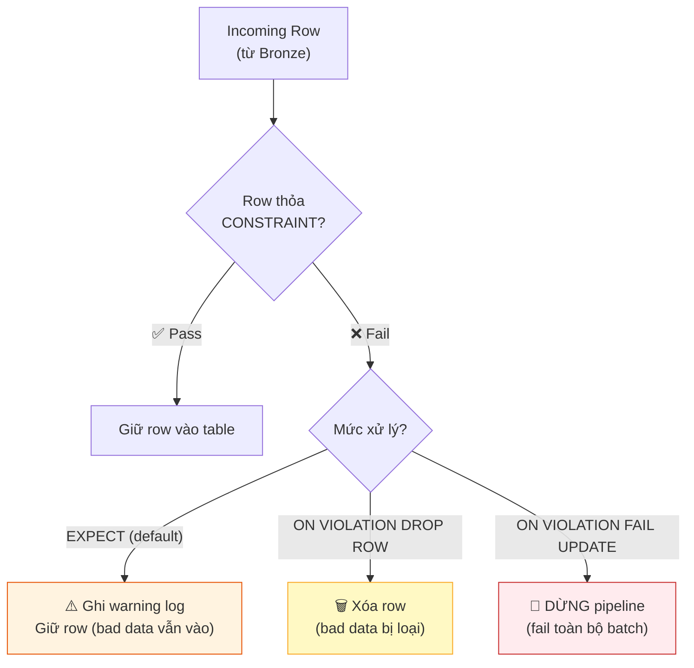

# §3 LAKEFLOW DECLARATIVE PIPELINES — DLT, Expectations, CDC

> **Exam Weight:** 31% (shared) | **Difficulty:** Trung bình-Khó
> **Exam Guide Sub-topics:** Lakeflow Spark Declarative Pipelines, Expectations (CONSTRAINT), STREAM function

---

## TL;DR

**Lakeflow Declarative Pipelines** (formerly Delta Live Tables / DLT) = framework declarative ETL. Bạn khai báo **"data PHẢI trông như thế nào"** (expectations), Databricks lo phần còn lại (checkpoint, retry, orchestration). Hỗ trợ **SQL + Python** trong cùng 1 pipeline.

---

## Nền Tảng Lý Thuyết

### Imperative vs Declarative ETL

**Imperative** (truyền thống — bạn viết CÁCH LÀM):
```python
# Bạn phải lo MỌI THỨ:
df = spark.readStream.format("delta").load(source)
df_clean = df.filter("id IS NOT NULL")
df_clean.writeStream \
    .option("checkpointLocation", "/checkpoint") \
    .trigger(availableNow=True) \
    .toTable("silver.events")
# Phải tự quản lý: checkpoint, retry logic, error handling, scheduling
```

**Declarative** (Lakeflow Pipelines — bạn khai báo KẾT QUẢ MONG MUỐN):
```python
@dp.table(comment="Cleaned events")
@dp.expect_or_drop("valid_id", "id IS NOT NULL")
def silver_events():
    return dp.read_stream("bronze_events")
# Databricks tự lo: checkpoint, retry, scheduling, error handling
```

**Tương tự trong đời thực:**
- Imperative = bạn tự lái xe từ A đến B (phải biết đường, đổ xăng, tránh kẹt xe).
- Declarative = bạn nói "đưa tôi đến B" cho taxi → lái xe lo hết.

### CONSTRAINT / Expectations — Data Quality Built-in

Expectations = rules kiểm tra chất lượng data **trên mỗi row**. 3 mức nghiêm ngặt:



| Mức | Syntax | Khi row vi phạm | Use case |
|-----|--------|----------------|----------|
| **Warn** | `EXPECT (condition)` | Log warning, **giữ row** | Monitor quality, non-critical |
| **Drop** | `EXPECT (...) ON VIOLATION DROP ROW` | **Xóa row** | Filter bad data, medium critical |
| **Fail** | `EXPECT (...) ON VIOLATION FAIL UPDATE` | **Dừng pipeline** | Critical data (e.g., PII required) |

### STREAM vs LIVE — 2 Loại Table Trong Pipeline

**LIVE TABLE** = batch table. Mỗi lần pipeline chạy, compute lại TẤT CẢ.
**STREAMING LIVE TABLE** = streaming table. Mỗi lần chạy, chỉ xử lý data MỚI.

```sql
-- LIVE TABLE (batch): compute lại hết mỗi lần
CREATE LIVE TABLE daily_summary AS
SELECT date, SUM(amount) FROM LIVE.silver_events GROUP BY date;

-- STREAMING LIVE TABLE: chỉ xử lý data mới
CREATE STREAMING LIVE TABLE silver_events AS
SELECT * FROM STREAM(LIVE.bronze_events) WHERE id IS NOT NULL;
--                   ^^^^^^^^^^^^^^^^
-- STREAM() = đọc incremental (chỉ rows mới)
-- LIVE. = reference table khác trong pipeline
```

**STREAM function cho biết gì?** Khi bạn thấy `STREAM(LIVE.table_name)`, nghĩa là:
1. Source (`table_name`) là streaming table.
2. Pipeline đọc nó incrementally (chỉ data mới từ lần chạy trước).

### SQL + Python Mixed Pipeline

Một Lakeflow Pipeline = tập hợp **nhiều notebooks**. Mỗi notebook có thể khác ngôn ngữ:

```text
Pipeline "e-commerce_etl":
├── Notebook 1 (Python): Bronze layer ingestion
├── Notebook 2 (Python): Silver layer transforms  
├── Notebook 3 (SQL):    Gold layer aggregations
└── Notebook 4 (SQL):    Gold layer reports
```

Databricks tự sắp xếp thứ tự chạy dựa trên **dependency** (thông qua `LIVE.` references).

---

## Cú Pháp / Keywords Cốt Lõi

### SQL Syntax (Đề thi dùng cả syntax CŨ "DLT" lẫn MỚI)

```sql
-- Bronze: Ingest raw data
CREATE STREAMING LIVE TABLE bronze_events
AS SELECT * FROM cloud_files("/mnt/raw/", "json");

-- Silver: Clean + validate
CREATE STREAMING LIVE TABLE silver_events (
    CONSTRAINT valid_id EXPECT (id IS NOT NULL) ON VIOLATION DROP ROW,
    CONSTRAINT valid_amount EXPECT (amount > 0) ON VIOLATION FAIL UPDATE
)
AS SELECT *
FROM STREAM(LIVE.bronze_events);

-- Gold: Aggregate
CREATE LIVE TABLE gold_daily_revenue
AS SELECT date, SUM(amount) AS total
FROM LIVE.silver_events
GROUP BY date;
```

### Python API (New — Spark 4.1+)

```python
import pyspark.pipelines as dp
from pyspark.sql.functions import *

@dp.table(comment="Raw events from files")
def bronze_events():
    return (spark.readStream
        .format("cloudFiles")
        .option("cloudFiles.format", "json")
        .load("/mnt/raw/events/"))

@dp.table(comment="Cleaned events")
@dp.expect_or_drop("valid_id", "id IS NOT NULL")
@dp.expect("valid_amount", "amount > 0")  # warn only
def silver_events():
    return dp.read_stream("bronze_events") \
        .withColumn("event_date", to_date("event_time"))
```

### Pipeline Configuration — What's Required?

> 🚨 **ExamTopics Q42:** "What MUST be specified creating new DLT pipeline?" → **"At least one notebook library"** (đáp án B).
> - Key-value config = optional.
> - Storage path = optional (dùng managed location).
> - Target database = optional.

---

## Use Case Trong Thực Tế

| Scenario | Feature |
|----------|---------|
| Data phải có location, pipeline dừng nếu thiếu | `EXPECT (location IS NOT NULL) ON VIOLATION FAIL UPDATE` |
| Filter bad emails nhưng pipeline không dừng | `EXPECT (email LIKE '%@%') ON VIOLATION DROP ROW` |
| Monitor quality nhưng giữ tất cả data | `EXPECT (amount > 0)` (warn only) |
| Mix Python DE + SQL analyst trong 1 pipeline | SQL + Python notebooks, Databricks auto-resolve deps |

---

## Cạm Bẫy Trong Đề Thi (Exam Traps)

### Trap 1: ON VIOLATION FAIL vs ON VIOLATION FAIL UPDATE
- **Đáp án nhiễu:** `ON VIOLATION FAIL` (thiếu UPDATE) → **SAI syntax**.
- **Đúng:** `ON VIOLATION FAIL UPDATE` (có UPDATE).
- **Cách nhớ:** 3 levels: EXPECT, EXPECT + DROP ROW, EXPECT + FAIL UPDATE.

### Trap 2: EXPECT (location = NULL)
- **Đáp án nhiễu:** `EXPECT (location = NULL)` → Logic sai: "expect location IS null" = ngược lại.
- **Đúng:** `EXPECT (location IS NOT NULL)` = "expect row has non-null location".
- **Logic:** EXPECT = "condition mà row PHẢI thỏa mãn". Condition = TRUE = row tốt.

### Trap 3: Pipeline phải dùng 1 ngôn ngữ
- **Đáp án nhiễu:** "Pipeline must be entirely in Python" → **SAI**.
- **Đúng:** Pipeline hỗ trợ **mixed SQL + Python** notebooks (ExamTopics Q26/Q65).
- **Logic:** Pipeline = set of notebooks. Mỗi notebook = 1 ngôn ngữ. Pipeline overall = mixed.

### Trap 4: STREAM function meaning
- ExamTopics Q34: Tại sao `STREAM(LIVE.customers)` → **"customers table is a streaming live table"** (đáp án C). STREAM = đọc incremental từ streaming source.

---

## 🔗 Tham Khảo

- **Deep Dive:** [[01_Databricks#8. LAKEFLOW DECLARATIVE PIPELINES|01_Databricks.md — Section 8]]
- **Official Docs:** https://docs.databricks.com/en/lakeflow/declarative-pipelines/index.html
- **Expectations:** https://docs.databricks.com/en/lakeflow/declarative-pipelines/expectations.html
