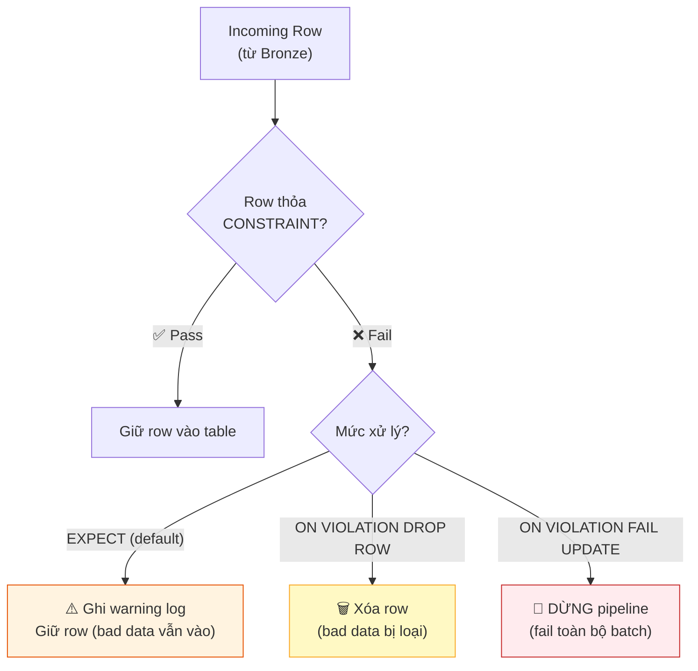

# §3 LAKEFLOW DECLARATIVE PIPELINES — DLT, Expectations, CDC

> **Exam Weight:** 31% (shared) | **Difficulty:** Trung bình-Khó
> **Exam Guide Sub-topics:** Lakeflow Spark Declarative Pipelines, Expectations (CONSTRAINT), STREAM function

---

## TL;DR

**Lakeflow Declarative Pipelines** (formerly Delta Live Tables / DLT) = framework declarative ETL. Bạn khai báo **"data PHẢI trông như thế nào"** (expectations), Databricks lo phần còn lại (checkpoint, retry, orchestration). Hỗ trợ **SQL + Python** trong cùng 1 pipeline.

---

## Nền Tảng Lý Thuyết

### Imperative vs Declarative ETL

**Imperative** (truyền thống — bạn viết CÁCH LÀM):
```python
# Bạn phải lo MỌI THỨ:
df = spark.readStream.format("delta").load(source)
df_clean = df.filter("id IS NOT NULL")
df_clean.writeStream \
    .option("checkpointLocation", "/checkpoint") \
    .trigger(availableNow=True) \
    .toTable("silver.events")
# Phải tự quản lý: checkpoint, retry logic, error handling, scheduling
```

**Declarative** (Lakeflow Pipelines — bạn khai báo KẾT QUẢ MONG MUỐN):
```python
@dp.table(comment="Cleaned events")
@dp.expect_or_drop("valid_id", "id IS NOT NULL")
def silver_events():
    return dp.read_stream("bronze_events")
# Databricks tự lo: checkpoint, retry, scheduling, error handling
```

**Tương tự trong đời thực:**
- Imperative = bạn tự lái xe từ A đến B (phải biết đường, đổ xăng, tránh kẹt xe).
- Declarative = bạn nói "đưa tôi đến B" cho taxi → lái xe lo hết.

### CONSTRAINT / Expectations — Data Quality Built-in

Expectations = rules kiểm tra chất lượng data **trên mỗi row**. 3 mức nghiêm ngặt:



| Mức | Syntax | Khi row vi phạm | Use case |
|-----|--------|----------------|----------|
| **Warn** | `EXPECT (condition)` | Log warning, **giữ row** | Monitor quality, non-critical |
| **Drop** | `EXPECT (...) ON VIOLATION DROP ROW` | **Xóa row** | Filter bad data, medium critical |
| **Fail** | `EXPECT (...) ON VIOLATION FAIL UPDATE` | **Dừng pipeline** | Critical data (e.g., PII required) |

### STREAM vs LIVE — 2 Loại Table Trong Pipeline

**LIVE TABLE** = batch table. Mỗi lần pipeline chạy, compute lại TẤT CẢ.
**STREAMING LIVE TABLE** = streaming table. Mỗi lần chạy, chỉ xử lý data MỚI.

```sql
-- LIVE TABLE (batch): compute lại hết mỗi lần
CREATE LIVE TABLE daily_summary AS
SELECT date, SUM(amount) FROM LIVE.silver_events GROUP BY date;

-- STREAMING LIVE TABLE: chỉ xử lý data mới
CREATE STREAMING LIVE TABLE silver_events AS
SELECT * FROM STREAM(LIVE.bronze_events) WHERE id IS NOT NULL;
--                   ^^^^^^^^^^^^^^^^
-- STREAM() = đọc incremental (chỉ rows mới)
-- LIVE. = reference table khác trong pipeline
```

**STREAM function cho biết gì?** Khi bạn thấy `STREAM(LIVE.table_name)`, nghĩa là:
1. Source (`table_name`) là streaming table.
2. Pipeline đọc nó incrementally (chỉ data mới từ lần chạy trước).

### CDC (Change Data Capture) / APPLY CHANGES INTO

DLT có khả năng tự động đồng bộ thay đổi (CDC - xử lý INSERT, UPDATE, DELETE) từ hệ thống nguồn thông qua API `APPLY CHANGES INTO`.

```sql
APPLY CHANGES INTO LIVE.customers_silver
FROM STREAM(LIVE.customers_bronze_cdc)
KEYS (customer_id)
APPLY AS DELETE WHEN operation = 'DELETE'
SEQUENCE BY commit_timestamp 
-- Thêm: STORED AS SCD TYPE 2 (nếu cần SCD Type 2)
```

**SCD Type 1 vs Type 2:**
- **SCD Type 1 (Mặc định)**: Ghi đè (Overwrite) thông tin cũ khi có UPDATE. Chỉ có trạng thái mới nhất tồn tại trong bảng.
- **SCD Type 2**: Giữ lại toàn bộ lịch sử thay đổi (Track history). DLT tự động tạo thêm các cột `__START_AT` và `__END_AT` cho bạn. Yêu cầu thêm mệnh đề `STORED AS SCD TYPE 2`.

**`SEQUENCE BY` là gì?** 
Do dữ liệu streaming đến không theo thứ tự tuyệt đối, `SEQUENCE BY` (thùng chứa cột thời gian/version) giúp DLT nhận biết thứ tự hợp lý. Nếu DLT nhận được UPDATE B cũ hơn (theo `SEQUENCE BY`) UPDATE A đã ghi, nó sẽ tự động bỏ qua UPDATE B.

### SQL + Python Mixed Pipeline

Một Lakeflow Pipeline = tập hợp **nhiều notebooks**. Mỗi notebook có thể khác ngôn ngữ:

```text
Pipeline "e-commerce_etl":
├── Notebook 1 (Python): Bronze layer ingestion
├── Notebook 2 (Python): Silver layer transforms  
├── Notebook 3 (SQL):    Gold layer aggregations
└── Notebook 4 (SQL):    Gold layer reports
```

Databricks tự sắp xếp thứ tự chạy dựa trên **dependency** (thông qua `LIVE.` references).

---

## Cú Pháp / Keywords Cốt Lõi

### SQL Syntax (Đề thi dùng cả syntax CŨ "DLT" lẫn MỚI)

```sql
-- Bronze: Ingest raw data
CREATE STREAMING LIVE TABLE bronze_events
AS SELECT * FROM cloud_files("/mnt/raw/", "json");

-- Silver: Clean + validate
CREATE STREAMING LIVE TABLE silver_events (
    CONSTRAINT valid_id EXPECT (id IS NOT NULL) ON VIOLATION DROP ROW,
    CONSTRAINT valid_amount EXPECT (amount > 0) ON VIOLATION FAIL UPDATE
)
AS SELECT *
FROM STREAM(LIVE.bronze_events);

-- Gold: Aggregate
CREATE LIVE TABLE gold_daily_revenue
AS SELECT date, SUM(amount) AS total
FROM LIVE.silver_events
GROUP BY date;
```

### Python API (New — Spark 4.1+)

```python
import pyspark.pipelines as dp
from pyspark.sql.functions import *

@dp.table(comment="Raw events from files")
def bronze_events():
    return (spark.readStream
        .format("cloudFiles")
        .option("cloudFiles.format", "json")
        .load("/mnt/raw/events/"))

@dp.table(comment="Cleaned events")
@dp.expect_or_drop("valid_id", "id IS NOT NULL")
@dp.expect("valid_amount", "amount > 0")  # warn only
def silver_events():
    return dp.read_stream("bronze_events") \
        .withColumn("event_date", to_date("event_time"))
```

### Pipeline Configuration — What's Required?

> 🚨 **ExamTopics Q42:** "What MUST be specified creating new DLT pipeline?" → **"At least one notebook library"** (đáp án B).
> - Key-value config = optional.
> - Storage path = optional (dùng managed location).
> - Target database = optional.

---

## Use Case Trong Thực Tế

| Scenario | Feature |
|----------|---------|
| Data phải có location, pipeline dừng nếu thiếu | `EXPECT (location IS NOT NULL) ON VIOLATION FAIL UPDATE` |
| Filter bad emails nhưng pipeline không dừng | `EXPECT (email LIKE '%@%') ON VIOLATION DROP ROW` |
| Monitor quality nhưng giữ tất cả data | `EXPECT (amount > 0)` (warn only) |
| Mix Python DE + SQL analyst trong 1 pipeline | SQL + Python notebooks, Databricks auto-resolve deps |

---

## Khung Tư Duy Trước Khi Vào Trap

### Cách hiểu DLT/Lakeflow cho người mới
- Bạn khai báo "muốn có dataset nào" thay vì tự điều phối từng bước retry/checkpoint.
- Mỗi table trong pipeline có vai trò rõ (streaming incremental hay materialized view).

### Quy trình trả lời câu hỏi exam về pipeline
- Xác định dữ liệu cần incremental hay full recompute.
- Xác định yêu cầu chất lượng: cảnh báo, drop row hay fail update.
- Xác định dependency: notebook/table nào là upstream trực tiếp.

### Cách nhớ nhanh
- Streaming table = dòng mới.
- Materialized view = kết quả tính lại theo logic khai báo.
- Expectations = quality gate ngay trong pipeline.

## Giải Thích Sâu Các Chỗ Dễ Nhầm (Đối Chiếu Docs Mới)

### 1) Tên sản phẩm và syntax có tiến hóa theo phiên bản
- Nhiều tài liệu cũ dùng tên DLT; tài liệu mới dùng Lakeflow Declarative Pipelines/SDP theo ngữ cảnh.
- Vì vậy khi đọc câu hỏi hoặc code mẫu, bạn cần nhận diện "ý nghĩa tương đương" thay vì bám cứng tên cũ/mới.

### 2) Declarative không có nghĩa là "không cần hiểu execution"
- Bạn không tự viết orchestration chi tiết, nhưng vẫn phải hiểu dependency graph, incremental semantics, và quality gates.
- Nếu không hiểu execution model, pipeline vẫn có thể đúng cú pháp nhưng sai hành vi.

### 3) Expectations là data contract trực tiếp trong pipeline
- `warn`, `drop`, `fail` không chỉ là kỹ thuật xử lý row lỗi.
- Đây là quyết định về mức chịu rủi ro dữ liệu của nghiệp vụ.
- Tư duy tốt: mỗi expectation nên có lý do nghiệp vụ rõ ràng, không thêm tùy hứng.

### 4) Streaming table vs materialized view: khác nhau ở chiến lược cập nhật
- Streaming table thiên về ingest/transform incremental.
- Materialized view phù hợp kết quả đã khai báo logic phục vụ truy vấn downstream.
- Hiểu sai cặp này thường dẫn tới chọn sai kiến trúc pipeline và chi phí vận hành.

### 5) Viết tài liệu an toàn theo docs mới
- Luôn ưu tiên syntax hiện tại trên docs chính thức.
- Nếu đề vẫn dùng syntax cũ, ghi rõ "legacy compatibility" để người học không nhầm đó là mặc định mới.

---

## Cạm Bẫy Trong Đề Thi (Exam Traps) — Trích Từ ExamTopics

## Học Sâu Trước Khi Vào Trap

### 1) Mental Model: Declarative ETL = mô tả trạng thái đích, không mô tả từng bước máy phải chạy
- Bạn khai báo dataset logic và dependency.
- Engine chịu trách nhiệm orchestration, retry, dependency ordering.

### 2) Khi nào chọn streaming table vs materialized view?
- Streaming table: incremental append-driven pipeline.
- Materialized view: phù hợp bước tổng hợp/logic cần tái tính theo dataset trạng thái.

### 3) Expectations strategy theo mức độ nghiêm trọng
- `WARN`: theo dõi mà không chặn luồng.
- `DROP ROW`: loại bản ghi xấu nhưng vẫn giữ pipeline chạy.
- `FAIL UPDATE`: dừng pipeline khi vi phạm rule quan trọng.

### 4) CDC và pipeline reliability
- Với CDC, thứ tự sequence và khóa business là trung tâm.
- Nếu sequence sai hoặc key sai, kết quả downstream sẽ lệch dù pipeline không fail.

### 5) Checklist tự kiểm
- Bạn có rule quality theo mức criticality rõ ràng chưa?
- Bạn có chọn đúng loại table theo hành vi dữ liệu chưa?
- Bạn có đọc được DAG dependency trước khi debug lỗi pipeline chưa?


### Trap 1: Cú Pháp Data Quality / FAIL UPDATE (Q63)
- **Tình huống:** DLT pipeline cần quản lý chi phí đi lại. Viết expectation thế nào để "nếu Cột location bị trống/miss thì DỪNG cả pipeline, không xử lý gì nữa"?
- **Đáp án theo exam key (Q63):** phương án có `ON VIOLATION FAIL UPDATE`.
- **Khi viết production code:** nên dùng điều kiện chuẩn SQL là `location IS NOT NULL` thay vì so sánh `!= NULL`.
- **Bẫy thi:** phương án `ON VIOLATION FAIL` (thiếu `UPDATE`) hoặc condition `location = NULL` đều không đúng.

### Trap 2: Đa Ngôn Ngữ Trong Pipeline (Q26, Q65)
- **Tình huống:** Pipeline Medallion hiện tại có Raw/Bronze/Silver được viết bằng Python, lớp Gold lại được viết bằng SQL. Khi chuyển nhà 100% sang framework DLT có được giữ nguyên hai ngôn ngữ không?
- **Đáp án đúng (Đáp án A):** Pipeline CÓ THỂ chứa các notebook/source hỗn hợp bằng SQL và Python song song. Nó cân được hết.
- **Bẫy (Đáp án B, D):** Đề thi dụ khị "Phải viết lại 100% bằng SQL" hoặc "Phải viết 100% bằng Python". Sai hoàn toàn, DLT là hệ sinh thái Mở (polyglot) gộp nhiều notebooks của các team lại.

### Trap 3: Ý Nghĩa Của Hàm STREAM() (Q34)
- **Tình huống:** Trong một block code có ghi `FROM STREAM(LIVE.customers)`. Vì sao lại tự nhiên có hàm bổ trợ `STREAM()` lồng vào query?
- **Đáp án đúng (Đáp án C):** Bảng `customers` đang đóng vai trò là một **streaming live table** (dữ liệu event vào liên tục không dứt). Việc bọc nó bằng hàm khai báo `STREAM()` giúp DLT hiểu phải chạy nó dưới dạng luồng xử lý incremental (chỉ nhặt dòng mới vi mô) thay vì scan chạy lại batch toàn bộ bảng.

### Trap 4: Yêu Cầu Tối Thiểu Tạo Pipeline Lần Đầu (Q42)
- **Tình huống:** Bạn muốn submit tạo mới một DLT Pipeline từ giao diện UI Web. Trường thông tin nào là BẮT BUỘC (MUST be specified) phải điền?
- **Đáp án đúng (Đáp án B):** Tuyệt đối phải cung cấp đường dẫn đến **At least one notebook library** (Ít nhất một file code/notebook chứa pipeline logic). Các config lặt vặt như Key-value configs, hay target database đều có thể bỏ trống (DLT sẽ tự gen đường dẫn default phía sau hậu trường).

### Trap 5: Monitoring Chất Lượng Dữ Liệu và Vị Trí Rơi Dòng (Q116, Q117)
- **Q116:** Muốn tự động theo dõi chất lượng dữ liệu trong pipeline thì chọn **Delta Live Tables / Lakeflow Declarative Pipelines** với Expectations.
- **Q117:** Muốn biết table nào đang drop records do quality rules → vào pipeline UI, click từng table và xem **data quality statistics**.

### Trap 6: Streaming Live Table Semantics (Q120, Q121)
- **Q120:** Dùng `CREATE STREAMING LIVE TABLE` khi dữ liệu cần xử lý **incremental**.
- **Q121:** Continuous mode trong production sẽ cập nhật định kỳ liên tục đến khi stop; compute chạy để phục vụ pipeline runtime.

### Trap 7: ON VIOLATION DROP ROW (Q126)
- Với `ON VIOLATION DROP ROW`, record vi phạm **không vào target dataset** và được ghi nhận invalid trong event log.
- **Bẫy:** `DROP ROW` không làm fail toàn job; muốn fail phải dùng `FAIL UPDATE`.

---

## 🔗 Tham Khảo

- **Deep Dive:** [[01_Databricks#8. LAKEFLOW DECLARATIVE PIPELINES|01_Databricks.md — Section 8]]
- **Official Docs:** https://docs.databricks.com/en/lakeflow/declarative-pipelines/index.html
- **Expectations:** https://docs.databricks.com/en/lakeflow/declarative-pipelines/expectations.html
