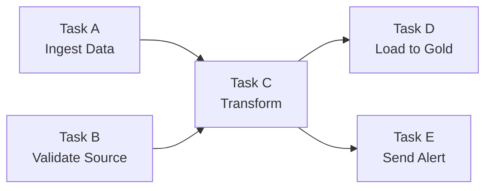

# §4 JOBS & WORKFLOWS — Task DAGs, Scheduling, Repair

> **Exam Weight:** 18% (shared) | **Difficulty:** Trung bình
> **Exam Guide Sub-topics:** Deploy workflows, repair failed tasks, rerun tasks, Cron syntax

---

## TL;DR

**Databricks Jobs (Lakeflow Jobs)** = hệ thống orchestration native. Tạo **multi-task DAG** với dependencies, schedule bằng **Cron syntax**, và **Repair** để retry task fail mà không chạy lại toàn bộ pipeline.

---

## Nền Tảng Lý Thuyết

### DAG — Directed Acyclic Graph là gì?

DAG = biểu đồ các **tasks** với **dependencies** (mũi tên chỉ thứ tự chạy):



- **Directed:** Mũi tên = thứ tự (A phải xong trước C).
- **Acyclic:** Không vòng lặp (C không quay lại A).
- **Graph:** Nhiều tasks, nhiều đường đi.

### Task Dependencies — "Depends On" Logic

**Bài toán:** Task C cần data từ Task A + validation từ Task B → C **depends on** A và B.

Trong Databricks Jobs UI, bạn set **"Depends On"** cho mỗi task:

| Task | Depends On | Meaning |
|------|-----------|---------|
| Task A (Ingest) | — | Chạy đầu tiên |
| Task B (Validate) | — | Chạy đầu tiên (parallel với A) |
| Task C (Transform) | A, B | Chạy SAU KHI A + B đều thành công |
| Task D (Load) | C | Chạy sau C |

### Repair vs Rerun — Khác Biệt Then Chốt

```text
Run 1:
  Task A ✅ (30 phút) → Task B ✅ (20 phút) → Task C ❌ (fail lúc 10 phút)

Option 1: RERUN toàn bộ
  Task A 🔄 (30 phút lại) → Task B 🔄 (20 phút lại) → Task C 🔄
  Total: 60+ phút → LÃNG PHÍ

Option 2: REPAIR (chỉ retry task fail + downstream)
  Task A ✅ (giữ kết quả cũ) → Task B ✅ (giữ kết quả cũ) → Task C 🔄 (retry)
  Total: ~10 phút → TIẾT KIỆM
```

**Cách nhớ:** Repair = sửa phần hỏng. Rerun = phá bỏ làm lại toàn bộ.

### Job Cluster vs All-Purpose Cluster

| Feature | Job Cluster | All-Purpose Cluster |
|---------|-----------|-------------------|
| **Tạo khi nào** | Tự tạo khi job chạy | Tạo bởi user, luôn sẵn |
| **Tắt khi nào** | Tự terminate khi job xong | User phải tắt thủ công |
| **Cost** | **Thấp** (pay-per-run) | **Cao** (chạy 24/7 nếu quên tắt) |
| **Use case** | Production ETL | Development, interactive |
| **Scaling** | Auto-configured | User-configured |

### Cluster Pool — Giảm Boot Time

**Bài toán:** Job có 5 tasks, mỗi task dùng cluster riêng → 5 lần boot (3-5 phút mỗi lần) = 15-25 phút chờ.

**Giải pháp:** Cluster Pool = tập VMs **pre-warmed** (đã boot sẵn). Task cần cluster → lấy VM từ pool (30 giây thay vì 5 phút).

```text
Không có Pool:  [Boot 5min] → [Run 2min] → [Boot 5min] → [Run 1min]
Có Pool:       [Get VM 30s] → [Run 2min] → [Get VM 30s] → [Run 1min]
```

---

## Cú Pháp / Keywords Cốt Lõi

### Cron Syntax cho Scheduling

```text
┌──── phút (0-59)
│ ┌──── giờ (0-23)
│ │ ┌──── ngày trong tháng (1-31)
│ │ │ ┌──── tháng (1-12)
│ │ │ │ ┌──── ngày trong tuần (0-7, 0 hoặc 7 = Chủ nhật)
│ │ │ │ │
* * * * *

Ví dụ:
0 6 * * *      = 6:00 AM mỗi ngày
0 */2 * * *    = Mỗi 2 giờ
30 8 * * 1-5   = 8:30 AM thứ 2-6
0 0 1 * *      = 00:00 ngày 1 mỗi tháng
```

> 🚨 **ExamTopics Q27:** "Represent schedule programmatically" → **Cron syntax** (đáp án D). Không phải DateType hay TimestampType.

### Scheduled vs Continuous Workflows

| Mode | Hành vi | Cluster |
|------|---------|---------|
| **Scheduled** | Chạy theo Cron → xong → tắt cluster | Tiết kiệm |
| **Continuous** | Chạy mãi mãi, restart nếu fail | Tốn hơn |

---

## Cạm Bẫy Trong Đề Thi (Exam Traps)

### Trap 1: Repair ≠ Rerun
- **Đáp án nhiễu:** "Rerun/Restart the pipeline" khi chỉ 1 task fail → **lãng phí**.
- **Đúng:** **Repair** = retry task fail + downstream (ExamTopics Q175, đáp án A).

### Trap 2: Dependency direction — đọc kỹ!
- "Need new task to run BEFORE original" → **"Add original task as dependency of new task"** = original phải xong trước new task... Wait, ngược:
- Đúng cách đọc Q128: **"Create new task, add original as dependency of new task"** = new task depends on original = original runs first. **NHƯNG** Q128 hỏi ngược: new task chạy TRƯỚC → **"Create new task, add it (new) as dependency of original"** = original depends on new = new runs first → **đáp án B**.
- **Cách nhớ:** "Depends On X" = "X runs first, I run after."

### Trap 3: Cluster Pool vs Autoscale
- Autoscale = thêm nodes khi load tăng → giải quyết **throughput**.
- Cluster Pool = pre-warmed VMs → giải quyết **startup time** (ExamTopics Q127, đáp án D).

---

## 🔗 Tham Khảo

- **Deep Dive:** [[01_Databricks#9. LAKEFLOW JOBS|01_Databricks.md — Section 9]]
- **Official Docs:** https://docs.databricks.com/en/jobs/index.html
