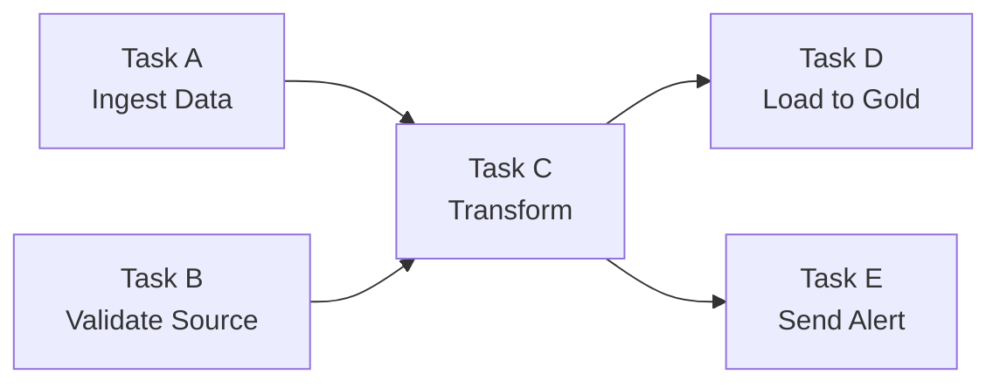

# §4 JOBS & WORKFLOWS — Task DAGs, Scheduling, Repair

> **Exam Weight:** 18% (shared) | **Difficulty:** Trung bình
> **Exam Guide Sub-topics:** Deploy workflows, repair failed tasks, rerun tasks, Cron syntax

---

## TL;DR

**Databricks Jobs (Lakeflow Jobs)** = hệ thống orchestration native. Tạo **multi-task DAG** với dependencies, schedule bằng **Cron syntax**, và **Repair** để retry task fail mà không chạy lại toàn bộ pipeline.

---

## Nền Tảng Lý Thuyết

### DAG — Directed Acyclic Graph là gì?

DAG = biểu đồ các **tasks** với **dependencies** (mũi tên chỉ thứ tự chạy):



- **Directed:** Mũi tên = thứ tự (A phải xong trước C).
- **Acyclic:** Không vòng lặp (C không quay lại A).
- **Graph:** Nhiều tasks, nhiều đường đi.

### Task Dependencies — "Depends On" Logic

**Bài toán:** Task C cần data từ Task A + validation từ Task B → C **depends on** A và B.

Trong Databricks Jobs UI, bạn set **"Depends On"** cho mỗi task:

| Task | Depends On | Meaning |
|------|-----------|---------|
| Task A (Ingest) | — | Chạy đầu tiên |
| Task B (Validate) | — | Chạy đầu tiên (parallel với A) |
| Task C (Transform) | A, B | Chạy SAU KHI A + B đều thành công |
| Task D (Load) | C | Chạy sau C |

### Repair vs Rerun — Khác Biệt Then Chốt

```text
Run 1:
  Task A ✅ (30 phút) → Task B ✅ (20 phút) → Task C ❌ (fail lúc 10 phút)

Option 1: RERUN toàn bộ
  Task A 🔄 (30 phút lại) → Task B 🔄 (20 phút lại) → Task C 🔄
  Total: 60+ phút → LÃNG PHÍ

Option 2: REPAIR (chỉ retry task fail + downstream)
  Task A ✅ (giữ kết quả cũ) → Task B ✅ (giữ kết quả cũ) → Task C 🔄 (retry)
  Total: ~10 phút → TIẾT KIỆM
```

**Cách nhớ:** Repair = sửa phần hỏng. Rerun = phá bỏ làm lại toàn bộ.

### Truyền Dữ Liệu Giữa Các Task (Task Values)

Nếu Task B chạy **sau** Task A và cần tham số động từ Task A (ví dụ lấy `record_count`), bạn có thể dùng **Task Values** thay vì tốn công lưu xuống bảng/file tạm.

```python
# Trong Task A (Người gửi)
dbutils.jobs.taskValues.set(key="processed_count", value=1500)

# Trong Task B (Người nhận, requires Task A as dependency)
count_from_a = dbutils.jobs.taskValues.get(
    taskKey="Task_A", 
    key="processed_count", 
    default=0
)
```
*Ghi chú: Task Values rất nhẹ, chủ yếu truyền string/int (thông báo trạng thái). KHÔNG dùng để truyền nguyên cục DataFrame.*

### Job Cluster vs All-Purpose Cluster

| Feature | Job Cluster | All-Purpose Cluster |
|---------|-----------|-------------------|
| **Tạo khi nào** | Tự tạo khi job chạy | Tạo bởi user, luôn sẵn |
| **Tắt khi nào** | Tự terminate khi job xong | User phải tắt thủ công |
| **Cost** | **Thấp** (pay-per-run) | **Cao** (chạy 24/7 nếu quên tắt) |
| **Use case** | Production ETL | Development, interactive |
| **Scaling** | Auto-configured | User-configured |

### Cluster Pool — Giảm Boot Time

**Bài toán:** Job có 5 tasks, mỗi task dùng cluster riêng → 5 lần boot (3-5 phút mỗi lần) = 15-25 phút chờ.

**Giải pháp:** Cluster Pool = tập VMs **pre-warmed** (đã boot sẵn). Task cần cluster → lấy VM từ pool (30 giây thay vì 5 phút).

```text
Không có Pool:  [Boot 5min] → [Run 2min] → [Boot 5min] → [Run 1min]
Có Pool:       [Get VM 30s] → [Run 2min] → [Get VM 30s] → [Run 1min]
```

### Cấu Hình Nâng Cao (Job Configurations)

Một Job chuẩn "Production" cần cấu hình thêm:
- **Retry Policies**: Giúp pipeline tự gượng dậy nếu gặp lỗi vặt (lỗi mạng, timeout). Cấu hình *Max retries* (vd: 3 lần) và *Min retry interval* (thời gian nghỉ giữa các lần thử).
- **Notifications**: Bắn thông báo (Email, Slack webhook, PagerDuty) khi task Start, Success, hoặc Fail.
- **Max Concurrent Runs**: Giới hạn số job chạy đồng thời. Nếu set = 1, nếu cữ chạy 8:00AM chưa xong mà đến giờ hẹn 9:00AM, cữ chạy 9:00AM sẽ bị xếp hàng (Skipped/Queued). Giúp tránh race conditions tranh chấp ghi dữ liệu.

### Serverless Compute cho Workflows

Thế hệ mới nhất để chạy jobs. Không cần cấu hình Cluster Size, Node type hay Cluster Pool. Databricks Serverless tự động khởi chạy và scale **chỉ trong vài giây**. Cực kỳ đơn giản (zero-config) nhưng giá DBU sẽ cao hơn Job Cluster Classic.

---

## Cú Pháp / Keywords Cốt Lõi

### Cron Syntax cho Scheduling

```text
┌──── phút (0-59)
│ ┌──── giờ (0-23)
│ │ ┌──── ngày trong tháng (1-31)
│ │ │ ┌──── tháng (1-12)
│ │ │ │ ┌──── ngày trong tuần (0-7, 0 hoặc 7 = Chủ nhật)
│ │ │ │ │
* * * * *

Ví dụ:
0 6 * * *      = 6:00 AM mỗi ngày
0 */2 * * *    = Mỗi 2 giờ
30 8 * * 1-5   = 8:30 AM thứ 2-6
0 0 1 * *      = 00:00 ngày 1 mỗi tháng
```

> 🚨 **ExamTopics Q27:** "Represent schedule programmatically" → **Cron syntax** (đáp án D). Không phải DateType hay TimestampType.

### Scheduled vs Continuous Workflows

| Mode | Hành vi | Cluster |
|------|---------|---------|
| **Scheduled** | Chạy theo Cron → xong → tắt cluster | Tiết kiệm |
| **Continuous** | Chạy mãi mãi, restart nếu fail | Tốn hơn |

---

## Use Case Trong Thực Tế

### Use Case 1: ETL sáng sớm theo lịch cố định
- Dùng Jobs + Cron cho run định kỳ.
- Ưu tiên job cluster để giảm chi phí idle.

### Use Case 2: Pipeline nhiều task phụ thuộc
- Dùng `Depends On` để dựng DAG rõ ràng.
- Khi fail, dùng `Repair` để chạy lại phần lỗi trước.

### Use Case 3: Điều tra run đang chậm
- Vào tab Runs và mở active run để xem execution logs theo task.

## Ôn Nhanh 5 Phút

- `Cron` = chuẩn khai báo lịch chạy.
- `Depends On` = chặn thứ tự thực thi theo dependency.
- `Repair` = rerun phần lỗi, không phải chạy lại toàn bộ.
- `Runs` tab = theo dõi run thực tế.

---

## Khung Tư Duy Trước Khi Vào Trap

### Câu Jobs thường kiểm tra gì?
- Dependency logic (`Depends On`).
- Scheduling semantics (Cron/scheduled vs continuous).
- Vận hành run thất bại (`Repair` vs full rerun).

### Cách trả lời chắc tay
- Nếu đề nhấn mạnh "task A phải xong rồi task B mới chạy" → dependency.
- Nếu đề nhấn mạnh "tiết kiệm chi phí" + lịch định kỳ → scheduled + compute ephemeral.
- Nếu đề nhấn mạnh "debug run hiện tại" → Runs tab.

## Giải Thích Sâu Các Chỗ Dễ Nhầm (Đối Chiếu Docs Mới)

### 1) DAG design là bài toán reliability, không chỉ là thứ tự chạy
- Người mới thường nghĩ DAG chỉ để "task nào trước task nào".
- Trong production, DAG còn thể hiện chiến lược retry, timeout, side-effects, và khả năng khôi phục.
- Thiết kế DAG tốt giúp giảm blast radius khi một task lỗi.

### 2) Repair nên hiểu đúng phạm vi
- Với multi-task job, repair cho phép rerun phần failed/skipped path thay vì đốt lại toàn pipeline.
- Đây là lợi thế vận hành quan trọng, nhưng cần đọc đúng điều kiện áp dụng trong docs hiện tại.

### 3) Scheduled vs continuous cần quyết định theo SLA dữ liệu
- Nếu mục tiêu là cập nhật theo nhịp nghiệp vụ (giờ/ngày), scheduled thường tối ưu hơn.
- Nếu yêu cầu near-real-time liên tục, continuous mới phù hợp.
- Sai lầm phổ biến: dùng continuous cho workload không cần realtime, gây tăng chi phí.

### 4) Task Values hữu ích cho metadata nhỏ, không phải kênh data transport
- Truyền cờ trạng thái, số đếm, hoặc tham số điều hướng là phù hợp.
- Truyền payload lớn qua cơ chế này sẽ khó kiểm soát và khó debug.

### 5) Serverless cho jobs: lợi ích lớn nhưng cần kiểm tra vùng khả dụng
- Docs nhấn mạnh ưu điểm zero-config và vận hành đơn giản.
- Tuy nhiên khả dụng thực tế còn phụ thuộc cloud/region/workspace policy.
- Viết tài liệu an toàn nên thêm câu "xác nhận availability trong workspace hiện tại".

## Playbook Luyện Câu UI-Vận Hành (Ăn Điểm Nhanh)

### Pattern 1: "Job đang chậm/lỗi, vào đâu trước?"
- Đáp án chuẩn thường là: **Runs tab → active run → task logs/stages**.
- Bẫy thường gặp: chọn nơi định nghĩa task thay vì nơi xem execution thực tế.

### Pattern 2: "Rerun thế nào để tiết kiệm?"
- Nếu multi-task và chỉ vài nhánh fail: nghĩ đến **Repair** trước full rerun.
- Nếu đề nói run lại toàn bộ có chủ đích (thay logic upstream): full rerun có thể hợp lý.

### Pattern 3: "Schedule semantics"
- Câu hỏi nhấn mạnh lịch định kỳ: map sang cron/scheduled workflows.
- Câu hỏi nhấn mạnh chạy liên tục và tự phục hồi: map sang continuous pattern.

### Pattern 4: "Chi phí vs độ đơn giản"
- Cần zero-ops: cân nhắc serverless (nếu available).
- Cần kiểm soát chi tiết/đặc thù: cân nhắc compute cấu hình chủ động.

### Mini Checklist 20 giây trước khi chọn đáp án
- Câu hỏi đang nói về **định nghĩa** job hay **quan sát run thực tế**?
- Cần tối ưu **thời gian khôi phục** hay **độ sạch chạy lại toàn bộ**?
- Có ràng buộc cloud/region/workspace capability nào không?

---

## Cạm Bẫy Trong Đề Thi (Exam Traps) — Trích Từ ExamTopics

## Học Sâu Trước Khi Vào Trap

### 1) Mental Model: Workflow = DAG + Scheduling + Recovery
- DAG quyết định thứ tự phụ thuộc.
- Scheduling quyết định khi nào hệ thống chạy.
- Recovery quyết định cách xử lý khi có task lỗi.

### 2) Thiết kế workflow bền vững
- Task nên idempotent để rerun an toàn.
- Tách task theo ranh giới nghiệp vụ rõ để repair nhanh.
- Tránh task "quá to" khiến debug khó và blast radius lớn.

### 3) Cost & runtime trade-off
- Scheduled jobs thường phù hợp batch economics.
- Chạy liên tục chỉ nên dùng khi SLA yêu cầu.
- Chọn cluster strategy theo tính chất từng task, không dùng một cấu hình cho mọi trường hợp.

### 4) Quan sát và điều tra sự cố
- Runs tab để xem execution runtime.
- Logs để tìm root cause theo task.
- Repair để khôi phục nhanh, giảm rerun không cần thiết.

### 5) Checklist tự kiểm
- Bạn mô hình dependency đủ chặt nhưng không vòng lặp chưa?
- Bạn có retry/recovery strategy rõ cho task quan trọng chưa?
- Bạn có theo dõi runtime trend để tối ưu lịch chạy chưa?


### Trap 1: Khắc Phục Workflow Thất Bại Lập Tức (Q175)
- **Tình huống:** Một workflow chỉ có 1 task duy nhất (single-task workflow) bị sập dọc đường do sai code. Kỹ sư đã vào code sửa chữa xong. Cần làm gì tiếp theo để tiết kiệm nguồn lực?
- **Đáp án đúng (Đáp án A):** **Repair the task** (Sửa chữa bản run đang hỏng). Nút Repair cho phép chạy lại đúng node/task bị lỗi cùng môi trường trước đó thay vì khởi động lại cả luồng job từ số 0.
- **Phân biệt:** Full rerun sẽ tốn thêm thời gian và tài nguyên vì phải chạy lại toàn bộ pipeline.

### Trap 2: Debug Notebook Chậm Nằm Trong Job UI (Q129)
- **Tình huống:** Một notebook trong Job chạy chậm, cần xem tiến trình thực thi thực tế để tìm nguyên nhân. Nên vào đâu?
- **Đáp án đúng (Đáp án C):** Vào tab **Runs**, sau đó click vào **active run** (Lượt chạy đang kích hoạt) để nhảy vào màn hình monitor live.
- **Bẫy thi:** Tab "Tasks" dùng để thay đổi CẤU HÌNH của task (ví dụ đổi cluster, đổi tham số biến đầu vào), chứ KHÔNG PHẢI nơi xem live log chạy ra sao.

### Trap 3: Đấu Nối 2 Tasks, Mới Và Cũ (Q128)
- **Tình huống:** Một task `ThườngLệ` chạy mỗi sáng. Giờ cần nạp master data xong thì task `ThườngLệ` mới được chạy, nên DE tạo thêm task `DữLiệuMới` và bắt **`DữLiệuMới` chạy TRƯỚC `ThườngLệ`**. Set Depends On cái nào?
- **Đáp án chuẩn (Đáp án B):** Mở setting task `ThườngLệ` cũ lên, sau đó **chọn thêm `DữLiệuMới` vào trường Depends On của nó** (add `DữLiệuMới` as a dependency of the original task).
- **Giải nghĩa ngược:** "Depends On Data = Phải đợi lấy Data xong mới chạy". Do đó, Thường Lệ *Depends on* Dữ liệu mới. Đừng bị cụm tiếng anh đánh lừa.

### Trap 4: Tổ Chức Workflow Bài Bản (Q135)
- **Tình huống:** Kỹ sư có nhiều đoạn code rời rạc (SQL dọn dẹp data, Python transform và join data). Muốn đóng gói chúng thành một quy trình chuẩn (structured process) có hẹn giờ chạy tự động. Xài tính năng gì?
- **Đúng (Đáp án C):** **Task workflows and job scheduling**. (Công cụ Jobs sinh ra để xâu chuỗi nhiều step SQL/Python lại với nhau thành 1 quy trình).
- **Bẫy:** Không chọn "Notebook version control" vì Version Control là Git Folders (chỉ quản lý lịch sử code chứ không hẹn giờ chạy code tự động được).

### Trap 5: Chọn Compute Cho ETL Batch Theo Lịch (Q193 - ảnh bổ sung)
- **Tình huống:** Daily ETL resource-intensive, workload thay đổi, cần auto scale và tiết kiệm chi phí.
- **Đáp án đúng:** **Job Cluster**.
- **Lý do:** Job Cluster được tạo theo run, autoscaling theo nhu cầu, chạy xong tự tắt nên phù hợp batch scheduling.

### Trap 6: Depends On Dùng Khi Nào? (Q41)
- **Đáp án đúng:** Dùng `Depends On` khi task mới chỉ được chạy **sau khi** task khác hoàn thành thành công.
- **Cách nhớ:** `Depends On` = "đợi task trước xong rồi mới chạy".

### Trap 7: Scheduled Workflow Có Tốn Cluster 24/7 Không? (Q60)
- **Ý đúng:** Scheduled workflow có thể tiết kiệm chi phí vì compute chỉ chạy lúc đến lịch và đủ lâu để hoàn thành run.
- **Bẫy:** Không cần cluster always-on cho lịch batch bình thường.

---

## 🔗 Tham Khảo

- **Deep Dive:** [[01_Databricks#9. LAKEFLOW JOBS|01_Databricks.md — Section 9]]
- **Official Docs:** https://docs.databricks.com/en/jobs/index.html
