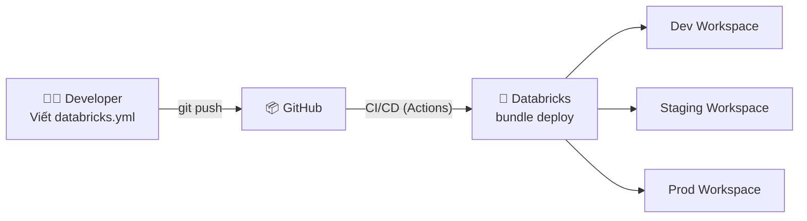

# §4 ASSET BUNDLES & CI/CD — Databricks Asset Bundles, Git Repos

> **Exam Weight:** 18% (shared) | **Difficulty:** Trung bình
> **Exam Guide Sub-topics:** DABs vs traditional, DAB structure, Git Repos limitations

---

## TL;DR

**Databricks Asset Bundles (DABs)** = IaC framework để define + deploy Databricks resources (Jobs, Pipelines, Clusters) bằng YAML config + CI/CD. Kết hợp **Git Repos** cho version control, nhưng **merge phải làm ngoài Repos** (GitHub/GitLab).

---

## Nền Tảng Lý Thuyết

### IaC — Infrastructure as Code là gì?

**Truyền thống:** DE tạo Job trong Databricks UI bằng tay → click, fill form, save. Vấn đề:
- Không có version control (ai đổi gì, lúc nào?)
- Không replicate được (tạo lại Job trên workspace khác = làm tay lại)
- Không có code review (không biết config đúng hay sai)

**IaC:** Define mọi resource bằng **config files** (YAML) → push to Git → CI/CD tự deploy.



### DAB vs Traditional Methods

| Feature | Manual UI | CLI + config.json | **DABs** | Terraform |
|---------|-----------|-------------------|---------|-----------|
| Version control | ❌ | ⚠️ | ✅ | ✅ |
| Multi-env (dev/stg/prod) | ❌ | ⚠️ | ✅ (targets) | ✅ |
| Databricks-native | ✅ | ✅ | ✅ | ❌ (external) |
| Complexity | Low | Medium | **Low-Medium** | High |
| **Đề thi recommend** | ❌ | ❌ | ✅ | ❌ |

### Git Repos (Git Folders) — Giới Hạn Quan Trọng

Databricks Repos cho phép **clone, pull, push, commit** trực tiếp trong UI. NHƯNG có 1 giới hạn:

```text
Operations TRONG Databricks Repos:
  ✅ Clone repository
  ✅ Pull latest changes
  ✅ Commit changes
  ✅ Push to remote
  ✅ Switch branch
  
Operations PHẢI LÀM NGOÀI (GitHub/GitLab):
  ❌ MERGE branches (Pull Request / Merge Request)
  ❌ Create/Delete branches
  ❌ Resolve merge conflicts
```

**Tại sao merge không được trong Repos?** Databricks Repos = lightweight Git client. Merge = complex operation (conflicts, reviews) → cần full Git tool (GitHub UI, GitLab UI).

---

## Cú Pháp / Keywords Cốt Lõi

### Project Structure

```text
my_project/
├── databricks.yml                # Main config — define bundle
├── src/
│   ├── bronze_ingestion.py       # Notebook for ingestion
│   ├── silver_transforms.sql     # SQL transforms
│   └── gold_aggregations.py      # Gold layer
├── resources/
│   ├── jobs.yml                  # Job definitions
│   └── pipelines.yml             # DLT pipeline definitions
└── tests/
    └── test_transforms.py        # Unit tests
```

### databricks.yml — Config File

```yaml
bundle:
  name: ecommerce_pipeline

# Multi-environment targets
targets:
  dev:
    mode: development
    default: true
    workspace:
      host: https://adb-dev.azuredatabricks.net
  staging:
    workspace:
      host: https://adb-staging.azuredatabricks.net
  prod:
    mode: production
    run_as:
      service_principal_name: "prod-etl-sp"
```

### CLI Commands

```bash
# Validate config before deploy
databricks bundle validate --target staging

# Deploy to specific environment
databricks bundle deploy --target prod

# Run a job
databricks bundle run daily_etl --target prod

# Clean up
databricks bundle destroy --target dev
```

---

## Cạm Bẫy Trong Đề Thi (Exam Traps)

### Trap 1: Merge trong Databricks Repos
- **Đáp án nhiễu:** "Merge can be done inside Repos" → **SAI**.
- **Đúng:** Merge **PHẢI** làm ngoài — GitHub/GitLab Pull Request (ExamTopics Q35, đáp án C).

### Trap 2: DABs vs legacy methods
- **Đáp án nhiễu:** "workflow_config.json + CLI/Terraform" → legacy.
- **Đúng:** **DABs + GitHub** = recommended modern approach (ExamTopics Q190, đáp án A).

---

## 🔗 Tham Khảo

- **Deep Dive:** [[01_Databricks#10. DECLARATIVE AUTOMATION BUNDLES|01_Databricks.md — Section 10]]
- **Official Docs:** https://docs.databricks.com/en/dev-tools/bundles/index.html
- **Git Repos:** https://docs.databricks.com/en/repos/index.html
