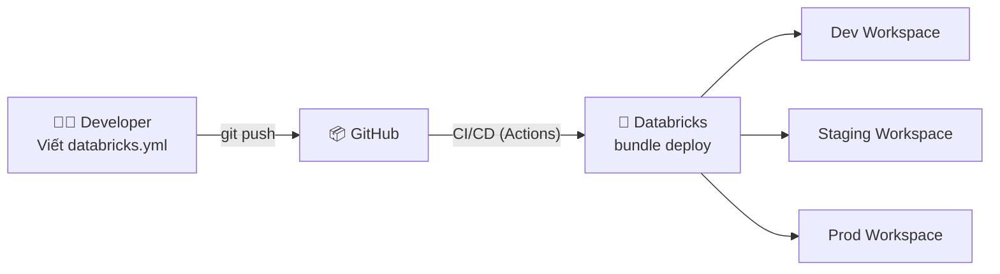

# §4 ASSET BUNDLES & CI/CD — Databricks Asset Bundles, Git Repos

> **Exam Weight:** 18% (shared) | **Difficulty:** Trung bình
> **Exam Guide Sub-topics:** DABs vs traditional, DAB structure, Git Repos limitations

---

## TL;DR

**Databricks Asset Bundles (DABs)** = IaC framework để define + deploy Databricks resources (Jobs, Pipelines, Clusters) bằng YAML config + CI/CD. Kết hợp **Git Repos** cho version control, nhưng **merge phải làm ngoài Repos** (GitHub/GitLab).

---

## Nền Tảng Lý Thuyết

### IaC — Infrastructure as Code là gì?

**Truyền thống:** DE tạo Job trong Databricks UI bằng tay → click, fill form, save. Vấn đề:
- Không có version control (ai đổi gì, lúc nào?)
- Không replicate được (tạo lại Job trên workspace khác = làm tay lại)
- Không có code review (không biết config đúng hay sai)

**IaC:** Define mọi resource bằng **config files** (YAML) → push to Git → CI/CD tự deploy.



### DAB vs Traditional Methods

| Feature | Manual UI | CLI + config.json | **DABs** | Terraform |
|---------|-----------|-------------------|---------|-----------|
| Version control | ❌ | ⚠️ | ✅ | ✅ |
| Multi-env (dev/stg/prod) | ❌ | ⚠️ | ✅ (targets) | ✅ |
| Databricks-native | ✅ | ✅ | ✅ | ❌ (external) |
| Complexity | Low | Medium | **Low-Medium** | High |
| **Đề thi recommend** | ❌ | ❌ | ✅ | ❌ |

### Git Repos (Git Folders) — Giới Hạn Quan Trọng

Databricks Repos cho phép **clone, pull, push, commit** trực tiếp trong UI. NHƯNG có 1 giới hạn:

```text
Operations TRONG Databricks Repos:
  ✅ Clone repository
  ✅ Pull latest changes
  ✅ Commit changes
  ✅ Push to remote
  ✅ Switch branch
  
Operations PHẢI LÀM NGOÀI (GitHub/GitLab):
  ❌ MERGE branches (Pull Request / Merge Request)
  ❌ Create/Delete branches
  ❌ Resolve merge conflicts
```

**Tại sao merge không được trong Repos?** Databricks Repos = lightweight Git client. Merge = complex operation (conflicts, reviews) → cần full Git tool (GitHub UI, GitLab UI).

---

## Cú Pháp / Keywords Cốt Lõi

### Project Structure

```text
my_project/
├── databricks.yml                # Main config — define bundle
├── src/
│   ├── bronze_ingestion.py       # Notebook for ingestion
│   ├── silver_transforms.sql     # SQL transforms
│   └── gold_aggregations.py      # Gold layer
├── resources/
│   ├── jobs.yml                  # Job definitions
│   └── pipelines.yml             # DLT pipeline definitions
└── tests/
    └── test_transforms.py        # Unit tests
```

### databricks.yml — Config File

```yaml
bundle:
  name: ecommerce_pipeline

# Multi-environment targets
targets:
  dev:
    mode: development
    default: true
    workspace:
      host: https://adb-dev.azuredatabricks.net
  staging:
    workspace:
      host: https://adb-staging.azuredatabricks.net
  prod:
    mode: production
    run_as:
      service_principal_name: "prod-etl-sp"
```

### Modular Configs: Includes & Variables

Khi file `databricks.yml` quá dài, bạn có thể tách nhỏ (modularize) bằng thẻ `include`. Bạn cũng có thể dùng biến tĩnh hoặc động bằng block `variables` và tham chiếu qua cú pháp `${var.tên_biến}` hoặc biến môi trường `${workspace.current_user.userName}`.

```yaml
# Định nghĩa biến
variables:
  default_cluster_id:
    description: "ID of the shared cluster"
    default: "1234-567890-abcd"

# Chia nhỏ config ra các file riêng biệt
include:
  - "resources/*.yml"  # Tự động load tất cả jobs/pipelines trong thư mục này
  - "pipelines/dlt.yml"

# Sử dụng biến
resources:
  jobs:
    my_job:
      job_cluster_key: ${var.default_cluster_id}
```
*Ghi đè biến lúc chạy: `databricks bundle deploy -t prod --var="default_cluster_id=9999-xxxx"`*

### Builds & Artifacts (Python Wheels)

DABs hỗ trợ tự động build code Python của team thành file package `.whl` (Wheel) rổi upload thẳng lên Workspace. Khai báo trong block `artifacts`:

```yaml
artifacts:
  my_python_lib:
    type: whl
    build: python setup.py bdist_wheel
    path: ./src/my_lib
```
Kỹ sư chỉ cần gõ `databricks bundle deploy`, CLI sẽ tự lo build phase, copy wheel lên Databricks volume, và gán cho Job sử dụng. Mọi thứ hoàn toàn tự động!

### CLI Commands

```bash
# Validate config before deploy
databricks bundle validate --target staging

# Deploy to specific environment
databricks bundle deploy --target prod

# Run a job
databricks bundle run daily_etl --target prod

# Clean up
databricks bundle destroy --target dev
```

---

## Use Case Trong Thực Tế

### Use Case 1: Một codebase, nhiều môi trường
- Dùng `targets` trong `databricks.yml` để tách `dev/staging/prod`.
- Giữ một chuẩn deploy duy nhất cho team.

### Use Case 2: Release lặp lại và có kiểm soát
- Bắt đầu bằng `bundle validate`, sau đó `bundle deploy`.
- Tích hợp CI để giảm lỗi cấu hình thủ công.

### Use Case 3: Team phối hợp qua Git
- Dùng Git cho review/approval.
- DAB dùng làm nguồn sự thật cho tài nguyên deploy.

## Ôn Nhanh 5 Phút

- DAB cốt lõi dựa trên `databricks.yml`.
- `validate` trước `deploy`.
- `targets` giúp tái sử dụng cấu hình nhiều môi trường.
- Git Repos trong Databricks không phải nơi merge conflict phức tạp.

---

## Khung Tư Duy Trước Khi Vào Trap

### Câu DAB thường xoay quanh 3 điểm
- Định nghĩa tài nguyên bằng YAML (`databricks.yml`).
- Triển khai có kiểm soát theo môi trường (`targets`).
- CI/CD flow chuẩn: validate → deploy → run.

### Mẹo chống chọn nhầm đáp án
- Nếu đề hỏi "cách triển khai chuẩn production" thì nghĩ DAB + Git.
- Nếu đề hỏi thao tác Git conflict thì tách khỏi UI Databricks Repos.

## Giải Thích Sâu Các Chỗ Dễ Nhầm (Đối Chiếu Docs Mới)

### 1) Tên gọi sản phẩm có thay đổi theo thời gian
- Trong tài liệu mới, bạn có thể gặp cách gọi "Databricks Asset Bundles" hoặc "Databricks Bundles/Declarative Automation" tùy ngữ cảnh phiên bản tài liệu.
- Điều quan trọng là bản chất: bundle là cơ chế khai báo + triển khai tài nguyên Databricks theo cấu hình có version control.

### 2) DAB không chỉ là file YAML, mà là contract deploy
- `databricks.yml` nên được xem như hợp đồng giữa dev và hệ thống triển khai.
- Khi đổi target/variable mà không có quy tắc, bạn sẽ tạo drift giữa môi trường dù pipeline vẫn chạy.

### 3) Git Folders capabilities cần đọc theo workspace hiện tại
- Các thao tác Git hỗ trợ trong Databricks có thể thay đổi theo rollout và thiết lập workspace.
- Vì vậy, đừng học theo câu tuyệt đối từ tài liệu cũ; luôn xác nhận thao tác hỗ trợ trong docs và môi trường đang dùng.

### 4) CI/CD chuẩn cho bundles
- Validate trước, deploy sau, rồi mới run/smoke-test.
- Nếu bỏ bước validate, lỗi cấu hình thường xuất hiện muộn ở môi trường cao hơn.

### 5) Principle quan trọng nhất: tái lập được
- Một hệ thống deploy tốt là hệ thống có thể tái tạo nhất quán qua dev/staging/prod.
- Đây là mục tiêu cốt lõi của bundles và cũng là tiêu chí chấm ngầm trong nhiều câu scenario exam.

## Guardrail: Tránh Sai Do Khác Biệt Workspace Rollout

### Checklist trước khi chọn đáp án/cách làm
- Feature Git/Bundles nào yêu cầu version CLI hoặc workspace capability cụ thể?
- Team đang dùng cloud nào và có giới hạn rollout nào?
- Quy trình merge/review hiện tại nằm ở Databricks UI hay Git provider?

### Nguyên tắc ôn thi hiệu quả
- Đừng học theo một ảnh chụp UI cũ.
- Học theo capability và command workflow cốt lõi (`validate → deploy → run`).

---

## Cạm Bẫy Trong Đề Thi (Exam Traps) — Trích Từ ExamTopics

## Học Sâu Trước Khi Vào Trap

### 1) Mental Model: DAB là hợp đồng deploy, không chỉ là file cấu hình
- DAB mô tả tài nguyên, artifact, biến môi trường và mục tiêu triển khai.
- Giá trị lớn nhất là reproducibility: cùng bundle, nhiều môi trường, hành vi nhất quán.

### 2) Vòng đời CI/CD nên thuộc
- Validate cấu hình.
- Deploy theo target.
- Run smoke check.
- Promote sang môi trường tiếp theo.

### 3) Tại sao exam hay hỏi DAB vs cách truyền thống?
- Vì đây là khác biệt giữa vận hành thủ công và vận hành có chuẩn hóa.
- Nếu bạn hiểu IaC mindset, câu chọn đáp án sẽ rất rõ.

### 4) Sai lầm phổ biến của người mới
- Hardcode giá trị môi trường vào một file duy nhất.
- Bỏ qua bước validate trước deploy.
- Nhầm DAB với script tự viết không có cấu trúc target.

### 5) Checklist tự kiểm
- Bạn có tách biến theo `dev/staging/prod` chưa?
- Bạn có sequence validate → deploy → run rõ ràng chưa?
- Bạn có biết giới hạn Git thao tác trực tiếp trong Databricks Repos chưa?


### Trap 1: Triển Khai Bài Bản Theo Phong Cách Databricks (Q190)
- **Tình huống:** Kỹ sư duy trì mã ETL trên GitHub và cần triển khai workflow production theo best practice.
- **Đáp án chuẩn xác (Đáp án A):** Tích hợp bằng **Databricks Asset Bundles (DAB) + GitHub Integration**.
- **Ngữ cảnh hiện tại:** DAB là chuẩn triển khai hiện đại cho DataOps/MLOps trên Databricks; cách làm tay qua UI chỉ phù hợp nhu cầu nhỏ, khó scale.

### Trap 2: Hạn Chế Còn Tồn Tại Của Databricks Repos / Git Folders (Q35)
- **Tình huống:** Bất kỳ thao tác Git nào sau đây BẮT BUỘC phải thực hiện bên ngoài Databricks Repos UI?
- **Đáp án đúng (Đáp án C):** Thao tác **Merge** nhánh (gộp branch hoặc giải quyết conflict).
- **Vì sao?:** Git Folders hỗ trợ các thao tác cơ bản, nhưng phần merge conflict phức tạp vẫn nên xử lý ở GitHub/GitLab rồi pull lại vào workspace.

### Trap 3: Bổ sung từ nguồn mới (PDF 100-126 / file (2))
- Bộ bổ sung không có câu mới trực tiếp về DAB beyond Q190/Q35.
- Điểm cần nhớ khi làm đề: phân biệt rõ **"deployment standard" (DAB)** với **"runtime compute choice" (Job Cluster/Serverless)** để tránh chọn nhầm domain câu hỏi.

### Trap 4: Asset Bundle Có Cấu Trúc Gì? (Q189 - PDF bổ sung)
- **Đáp án đúng (core idea):** DAB xoay quanh **YAML configuration (`databricks.yml`)** để mô tả artifacts, resources và environment configs.
- **Bẫy thường gặp:**
  - Không phải Docker image bắt buộc.
  - Không phải chỉ là file ZIP tài sản "trần" không metadata.
- **Cách hiểu cho người mới:** DAB = "manifest + cấu hình + tài nguyên" để CLI biết deploy cái gì, vào đâu, theo target nào.

---

## 🔗 Tham Khảo

- **Deep Dive:** [[01_Databricks#10. DECLARATIVE AUTOMATION BUNDLES|01_Databricks.md — Section 10]]
- **Official Docs:** https://docs.databricks.com/en/dev-tools/bundles/index.html
- **Git Repos:** https://docs.databricks.com/en/repos/index.html
