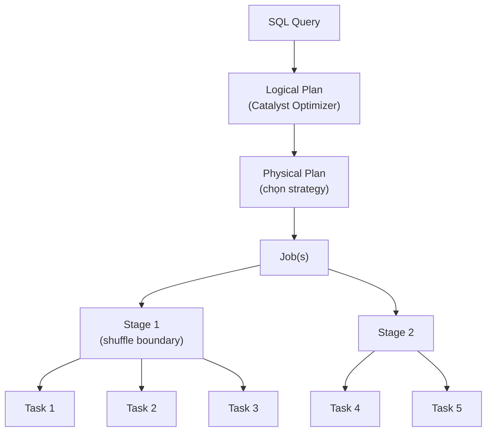

# §4 PERFORMANCE & SPARK UI — Troubleshooting, OOM, SQL Warehouses

> **Exam Weight:** 18% (shared) | **Difficulty:** Trung bình-Khó
> **Exam Guide Sub-topics:** Spark UI analysis, OOM, SQL Warehouse scaling, Alerts

---

## TL;DR

Đề thi kiểm tra khả năng đọc **Spark UI** để phát hiện performance issues, xử lý **OOM** errors, và cấu hình **SQL Warehouse** (scaling, Auto Stop, query scheduling). Cần biết **hành động đúng** cho mỗi triệu chứng.

---

## Nền Tảng Lý Thuyết

### Spark Job Execution — Hiểu Để Debug

Khi bạn chạy 1 Spark query, nó trải qua:



- **Job** = toàn bộ query
- **Stage** = nhóm tasks chạy parallel (chia bởi shuffle — dữ liệu phải di chuyển giữa nodes)
- **Task** = 1 partition data được xử lý bởi 1 core

### CPU Time vs Task Time — Spark UI Metrics

Spark UI hiển thị 2 metrics quan trọng:

| Metric | Meaning |
|--------|---------|
| **CPU Time** | Thời gian CPU thực sự tính toán |
| **Task Time** | Tổng thời gian task chạy (bao gồm wait, I/O, GC) |

```text
High CPU/Task ratio (e.g., 90%):
  CPU bận 90% thời gian → Cluster đang CPU-bound
  → Cần UPSIZE cluster hoặc tune executor/cores

Low CPU/Task ratio (e.g., 20%):
  CPU chỉ bận 20%, 80% idle/waiting
  → Data không phân bố đều (data skew)
  → Cần REPARTITION data
```

### Spark UI Deep Dive — Bắt Bệnh Từ UI

Spark UI là công cụ chẩn đoán quan trọng nhất:
- **Stages Tab:** Chú ý cột "Duration". Nếu có **Task Duration Variance quá mức** (hầu hết task xong trong 2s, nhưng có vài task tốn 2 phút) → Chắc chắn bị **Data Skew** (tập trung dữ liệu bất thường vào 1 key).
- **SQL / DataFrame Tab:** Hiển thị Visual DAG. Node `Exchange` đại diện cho **Shuffle** (di chuyển data qua network - tác vụ đắt đỏ nhất).
  - Tối ưu: Nếu thấy Sort-Merge Join (có Shuffle) giữa 1 bảng khổng lồ và 1 bảng nhỏ xíu → Hãy dùng **Broadcast Hash Join** (hint `/*+ BROADCAST(table_sm) */` hoặc hàm `broadcast(df)`). Nó copy bảng nhỏ vào mem của mọi node → triệt tiêu hoàn toàn Shuffle!
- **Storage Tab:** Kiểm tra RAM/Disk đang bị chiếm bởi RDDs/DataFrames đã cache.
  - **Caching:** `df.cache()` dùng cấp độ `MEMORY_AND_DISK`. Nếu muốn tinh chỉnh, dùng `df.persist(StorageLevel.MEMORY_ONLY)`. Chỉ cache khi bạn dùng DF đó *từ 2 lần trở lên*.

### Partitioning & AQE (Adaptive Query Execution)

- **`repartition(n)` vs `coalesce(n)`:**
  - `repartition()`: Tăng hoặc giảm phân vùng. **Chắc chắn gây ra Shuffle** toàn cluster. Tốn thời gian.
  - `coalesce()`: Chỉ dùng để **giảm** phân vùng (ví dụ trước khi ghi ra file để tránh small files). **KHÔNG gây Shuffle**. Rất tiết kiệm.
- **AQE (Bật mặc định):** AI tối ưu của Spark ở runtime. Tự động (1) Giảm số lượng shuffle partitions dư thừa (2) Đổi sang Broadcast Join nếu thấy bảng thực tế nhỏ (3) Chia cắt các phân vùng bị Skew (Skew Join Optimization).

### OOM — Out of Memory Error

```text
"java.lang.OutOfMemoryError: Java heap space"
```

**Nguyên nhân:** JVM hết memory vì:
1. Data quá lớn cho cluster size hiện tại
2. Broadcast join tải toàn bộ table nhỏ vào memory → table "nhỏ" thực ra không nhỏ
3. collect() hoặc toPandas() pull toàn bộ data về driver

**Giải pháp:**

| Action | Hiệu quả | Logic |
|--------|----------|-------|
| ✅ Narrow filters (ít data hơn) | Cao | Giảm data input → giảm memory |
| ✅ Upsize workers + auto shuffle | Cao | Thêm RAM + Spark tự optimize shuffle |
| ❌ Cache dataset | **KHÔNG** | Cache = **dùng THÊM** memory → OOM tệ hơn |
| ❌ Upsize driver + deactivate shuffle | **KHÔNG** | OOM thường ở worker, deactivate shuffle = xấu |
| ❌ Fix shuffle partitions = 50 | **KHÔNG** | 50 partitions quá ít cho big data |

### SQL Warehouse — Cluster Size vs Scaling Range

**2 khái niệm khác nhau:**

```text
Cluster Size (Small → Medium → Large → X-Large):
  = Specs MỖI cluster instance (CPU, RAM)
  → Tăng khi: HEAVY queries (full table scan, complex JOIN)

Scaling Range (Min=1, Max=10):
  = SỐ LƯỢNG cluster instances
  → Tăng khi: MANY concurrent queries (50 analysts cùng lúc)
```

### Auto Stop — Tắt Khi Idle

SQL Warehouse có Auto Stop: tự tắt sau X phút không có query → tiết kiệm $.

### SQL Alerts — Notification Cho Anomalies

Alerts = monitor query results + gửi notification khi threshold vượt:

```text
Query: "SELECT count(*) FROM logs WHERE value IS NULL"
Alert: Khi result > 100 → gửi notification
Destination: Webhook (Slack), Email, PagerDuty
```

**Alert Configuration Flow:**
```text
1. Tạo SQL Query (phải return 1 value hoặc 1 row)
2. Create Alert → chọn Query → set trigger condition (>, <, ==)
3. Set Alert Destination:
   • Email destination → nhập email
   • Webhook destination → nhập webhook URL (Slack, Teams, custom)
   • PagerDuty destination → nhập PagerDuty service key
4. Set refresh frequency (how often query runs to check condition)
```

**3 loại Alert Destination:**
| Destination | Use Case |
|------------|----------|
| **Email** | Notify individual users |
| **Webhook** | Notify team channel (Slack, Teams) |
| **PagerDuty** | Critical alerts → on-call rotation |

> 🚨 **ExamTopics Q131:** "Notify team via webhook when NULL > 100" → **"Alert with new webhook destination"** (đáp án C). Custom template = wrong (đó chỉ format email). Email destination = gửi cho 1 người.

### System Tables — Monitoring & Observability

Unity Catalog tự động log mọi thứ vào **System Tables** dùng để audit:
- **`system.access.audit`**: Ghi nhận toàn bộ User Actions (login, query chạy, cấp permissions, xóa tables). Thời gian lưu trữ phụ thuộc từng system table/chính sách hiện hành theo docs. Cực kỳ quan trọng để truy gốc nguyên nhân hoặc báo cáo Compliance. Chi tiết request nằm trong cột `request_params` (chuỗi JSON), thường dùng hàm JSON extraction để lấy trường cần phân tích.
- **`system.information_schema`**: Lấy thông tin cấu trúc Databases, Tables, Views, Columns trong workspace.
- **`system.billing.usage`**: Theo dõi tiêu thụ DBU.

---

## Cú Pháp / Keywords Cốt Lõi

### Query Refresh Schedule

```text
Databricks SQL → Query page → Schedule → Set refresh:
• Every 1 day / 12 hours / 1 hour / etc.
• Set end date for schedule (stops after that date)
• Schedule thuộc về QUERY, KHÔNG phải SQL endpoint
```

> 🚨 **ExamTopics Q55:** "Schedule query refresh daily" → **"From the query's page in DBSQL"** (đáp án C). KHÔNG phải từ SQL endpoint page.

> 🚨 **ExamTopics Q86:** "Stop query after 1 week" → **"Set refresh schedule to end on a certain date"** (đáp án C). KHÔNG phải limit DBUs hay limit users.

### SQL Warehouse Scaling — Size vs Range Cheatsheet

```text
■ SLOW single query (query phức tạp, join lớn):
  → Increase WAREHOUSE SIZE (S → M → L → XL)
  = vertical scaling = stronger compute per query

■ SLOW concurrent queries (nhiều user cùng lúc):
  → Increase SCALING RANGE (Max clusters: 1 → 5 → 10)
  = horizontal scaling = more parallel query slots
```

> 🚨 **ExamTopics Q130:** "Many users running small queries simultaneously, queries slow" → **Increase scaling range** (đáp án B). NOT warehouse size (đó cho single heavy queries).

### Jobs UI Navigation

> 🚨 **ExamTopics Q129:** "Why notebook running slowly in Job?" → **"Runs tab → click active run"** (đáp án C). Tasks tab hiện task definitions, KHÔNG hiện live execution.

---

## Khung Tư Duy Trước Khi Vào Trap

### Quy trình chẩn đoán hiệu năng theo thứ tự
- Bước 1: Xác định bottleneck thuộc compute, memory, hay IO/shuffle.
- Bước 2: Kiểm tra Spark UI (stages, skew, spill, task timeline).
- Bước 3: Chọn biện pháp tương ứng (query rewrite/config tuning/resize compute).

### Với SQL Warehouse, luôn tách 2 bài toán
- `Size`: giúp từng query nặng chạy tốt hơn.
- `Scaling range`: giúp nhiều người chạy song song ổn hơn.

### Cách nhớ chống nhầm
- OOM không tự hết nhờ cache.
- Concurrency issue không giải quyết bằng tăng size đơn lẻ.

## Giải Thích Sâu Các Chỗ Dễ Nhầm (Đối Chiếu Docs Mới)

### 1) Metrics trong Spark UI là tín hiệu, không phải phán quyết cuối cùng
- Ví dụ CPU/Task ratio cao hay thấp chỉ là dấu hiệu để đặt giả thuyết.
- Kết luận cuối cùng cần đối chiếu thêm stage timeline, skew, spill, shuffle volume, và query plan.
- Tránh suy luận một chiều vì mỗi workload có hình thái nghẽn khác nhau.

### 2) OOM troubleshooting cần theo cây quyết định
- Xác định OOM ở driver hay executor trước.
- Kiểm tra pattern query (collect/toPandas, skew join, wide transformations, cache misuse).
- Chỉ sau đó mới quyết định scale compute hay rewrite query.
- Cách làm này khớp tư duy vận hành theo docs: root cause trước, tuning sau.

### 3) Warehouse size và scaling range là hai trục độc lập
- Size xử lý "mỗi query nặng đến mức nào".
- Scaling range xử lý "bao nhiêu query chạy song song".
- Nhầm hai trục này là lý do phổ biến khiến tăng chi phí nhưng latency không cải thiện.

### 4) Alerting hiệu quả cần gắn với khả năng hành động
- Alert chỉ có giá trị khi team biết phải làm gì sau khi nhận.
- Vì vậy mỗi alert nên đi kèm threshold rõ, owner rõ, và destination phù hợp mức độ nghiêm trọng.

### 5) System tables retention nên ghi theo bảng cụ thể
- Không nên dùng một con số retention duy nhất cho tất cả bảng hệ thống.
- Tài liệu chuẩn cần ghi "xem retention theo từng system table" để tránh sai lệch theo cloud/edition/thời điểm cập nhật docs.

## Playbook Luyện Câu Spark UI/SQL Ops

### Pattern 1: Từ triệu chứng → tab cần mở
- Query chậm bất thường: mở SQL/DataFrame tab + physical plan.
- Một vài task rất lâu: mở Stages tab để soi skew/variance.
- Nghi memory pressure: đối chiếu executor metrics + spill + GC signals.

### Pattern 2: Không kết luận từ 1 metric đơn lẻ
- CPU time ratio chỉ để đặt giả thuyết.
- Luôn chốt bằng tổ hợp dấu hiệu: shuffle volume, skew, spill, stage timeline.

### Pattern 3: SQL Warehouse tuning
- Chậm vì query nặng đơn lẻ: xem tăng **size**.
- Chậm vì nhiều user đồng thời: xem tăng **scaling range**.
- Câu hỏi concurrency thường gài bẫy tăng size sai chỗ.

### Pattern 4: Alerts đúng mục đích
- Cần báo team theo ngưỡng query: nghĩ tới alert + destination (email/webhook/pager).
- Bẫy thường gặp: nhầm alerting ở query layer với cấu hình endpoint layer.

### Mini Checklist 20 giây
- Bottleneck là compute, memory hay IO/shuffle?
- Vấn đề là single-query latency hay concurrency?
- Hành động chọn có đúng layer (query/warehouse/ops alert) không?

---

## Cạm Bẫy Trong Đề Thi (Exam Traps) — Trích Từ ExamTopics

## Học Sâu Trước Khi Vào Trap

### 1) Mental Model: Performance tuning là quy trình chẩn đoán, không phải mẹo lẻ
- Xác định bottleneck đúng trước khi thay đổi cấu hình.
- Mỗi thay đổi cần gắn với một giả thuyết kỹ thuật cụ thể.

### 2) Điều gì nên nhìn trong Spark UI đầu tiên?
- Stage có thời gian cao bất thường.
- Shuffle read/write và spill metrics.
- Task skew (một số task chạy quá lâu so với phần còn lại).

### 3) SQL Warehouse: chọn đúng cần theo pattern tải
- Ít query nhưng nặng: cân nhắc size.
- Nhiều query nhỏ đồng thời: ưu tiên scaling range.
- Workload theo lịch: bật Auto Stop để tránh idle burn.

### 4) Tư duy tối ưu chi phí đúng
- Ưu tiên chỉnh query/layout trước khi tăng phần cứng.
- Chỉ scale lên khi đã xác nhận nghẽn thực sự ở tài nguyên.
- Theo dõi cost và latency cùng lúc, không tối ưu một chiều.

### 5) Checklist tự kiểm
- Bạn có phân loại được lỗi OOM vs CPU-bound vs concurrency chưa?
- Bạn có biết hành động ưu tiên cho từng loại chưa?
- Bạn có cơ chế theo dõi sau tối ưu để tránh regression chưa?


### Trap 1: OOM (Out Of Memory) - Java Heap Space (Q181)
- **Tình huống:** ETL pipeline chết ngang trôi do báo lỗi `java.lang.OutOfMemoryError: Java heap space`. Cần 2 hành động khắc phục?
- **2 Đáp án đúng:** 
  1. **Narrow the filters** (Thu hẹp điều kiện lọc ở WHERE để xử lý ít data hơn).
  2. **Upsize the worker nodes** (Nâng cấp con tính toán).
- **Bẫy thường gặp:** "Cache the dataset" không phải giải pháp gốc cho OOM. Caching dùng để tăng tốc đọc lặp lại, có thể làm áp lực bộ nhớ nặng hơn nếu dùng sai ngữ cảnh.

### Trap 2: Đọc Bệnh Bottleneck Qua Spark UI (Q178)
- **Tình huống:** Spark UI báo "High CPU time vs Task time" (Thời gian tiêu tốn cho CPU lớn bất thường so với thời gian thao tác I/O/Task). 
- **Giải thích:** CPU time cao bất thường cho thấy workload thiên về compute-bound; cluster có thể thiếu tài nguyên tính toán cho dạng tác vụ hiện tại.
- **Khắc phục đúng (Đáp án C):** Ưu tiên **tuning core/executor** và đánh giá nâng cấp cluster phù hợp. Chỉ repartition dữ liệu không tự động giải quyết nghẽn CPU.

### Trap 3: Tối Ưu SQL Warehouse - Range vs Size (Q130, Q90)
- **Tình huống (Q130):** Rất nhiều users (many members) đồng thời chạy các query NHỎ (small queries). Máy lag.
  → **Cách giải: Tăng SCALING RANGE (Đáp án B)** (Chìa khóa cho concurrency/song song). KHÔNG tăng cluster size vì mỗi query nhỏ xíu dùng ko hết máy to, cần "nhiều máy vừa" chứ không cần "một máy khổng lồ".
- **Tình huống (Q90):** Hẹn giờ refresh Dashboard tự động, muốn tối ưu chi phí (tiết kiệm tiền khi không query).
  → **Đáp án C:** Setup **Auto Stop** cho SQL Endpoint để tự tắt khi idle, giảm chi phí DBU.

### Trap 4: Lập Lịch Query Refresh Trong Databricks SQL (Q55, Q86)
- **Tình huống (Q55):** Sếp muốn hẹn lịch cho 1 query cứ mỗi ngày chạy lại 1 lần mà không cần click tay. Chỉnh ở đâu?
  → **Đáp án đúng (C):** **"Schedule query to refresh every 1 day from the query's page in Databricks SQL"**. Lịch refresh của Query (Refresh Schedule) được cấu hình ngay tại màn hình Editor của Query đó, không phải ở tab Databricks Jobs (nếu chỉ xài SQL lẻ) hay SQL endpoint's page.
- **Tình huống Tối Ưu Tiền (Q86):** Sếp chỉ muốn cái Schedule trên chạy đúng cường độ 1 phút 1 lần TRONG TUẦN ĐẦU TIÊN dự án release, sau 1 tuần thì thôi để đỡ hao tài. Làm sao?
 - **Tình huống Tối Ưu Tiền (Q86):** Chỉ muốn schedule chạy dày trong tuần đầu release, sau đó tự dừng để tránh chi phí dư thừa. Làm sao?
  → **Đáp án đúng (C):** Lúc set lịch, chọn **"End on a certain date"** (ngưng refresh vào 1 ngày cụ thể trong tương lai). Đề muốn kiểm tra kiến thức về tính năng "End Date" của Scheduler.

### Trap 5: Compute Pattern cho Daily ETL (Q193 - ảnh bổ sung)
- Nếu bài toán là ETL batch theo lịch, tài nguyên biến thiên và cần cost-efficiency, chọn **Job Cluster**.
- **Bẫy:** Chọn `Databricks SQL Serverless` vì thấy chữ "serverless" nghe tối ưu chi phí. SQL Serverless mạnh cho BI/SQL workloads, không phải default answer cho ETL batch jobs.

### Trap 6: Runtime Tăng Do Memory Spill - Làm Gì Trước? (Q186 - PDF bổ sung)
- **Tình huống:** Pipeline miss SLA, Spark bị memory spills, chi phí tăng.
- **Hướng xử lý đầu tiên (exam mindset):** ưu tiên **tuning execution config/query** trước khi scale phần cứng ồ ạt.
- **Thông điệp học dễ nhớ:**
  - Bước 1: xử lý nguyên nhân ở execution plan/shuffle.
  - Bước 2: nếu vẫn nghẽn mới cân nhắc tăng node type hoặc autoscaling.
  - Tránh tăng chi phí hạ tầng ngay từ đầu khi chưa tối ưu logic.

---

## 🔗 Tham Khảo

- **Deep Dive:** [[01_Databricks#23. WAR STORIES|01_Databricks.md — Section 23]]
- **Deep Dive:** [[01_Databricks#APPENDIX A: SPARK TUNING|01_Databricks.md — Appendix A]]
- **SQL Warehouses:** https://docs.databricks.com/en/compute/sql-warehouse/index.html
