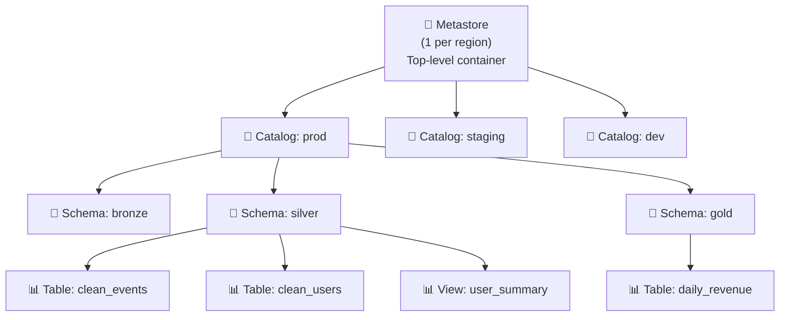

# §5 UNITY CATALOG — Governance, Permissions, Managed vs External

> **Exam Weight:** 11% (shared) | **Difficulty:** Trung bình
> **Exam Guide Sub-topics:** Three-level namespace, Permissions, Managed/External tables, Roles, Audit

---

## TL;DR

**Unity Catalog (UC)** = unified governance layer cho Databricks. Quản lý tables, views, volumes, permissions từ MỘT nơi. Dùng **three-level namespace** (`catalog.schema.table`) và cấp quyền bằng **GRANT/REVOKE** SQL.

---

## Nền Tảng Lý Thuyết

### Tại sao cần Governance?

**Không có governance:**
- Ai cũng truy cập mọi data → vi phạm GDPR, HIPAA
- Không biết data từ đâu đến, ai sửa → "data swamp"
- Mỗi team dùng Hive Metastore riêng → data silos

**Unity Catalog giải quyết:**
- **Centralized permissions:** 1 nơi quản lý ai xem gì
- **Data lineage:** Tự track data flow (table A → notebook B → table C)
- **Audit logs:** Ai truy cập gì, lúc nào
- **Unified namespace:** Mọi asset cùng 1 hệ thống tên

### Three-Level Namespace — "Hệ Thống Địa Chỉ"



```sql
-- Full qualified name: catalog.schema.table
SELECT * FROM prod.silver.clean_events;

-- Tương tự folder structure:
-- prod/silver/clean_events
```

**Tại sao 3 level?** Giống hệ thống thư mục: `Country/City/Street`. Giúp tổ chức + phân quyền theo level.

### Managed vs External Tables — PHẢI PHÂN BIỆT

**Managed Table:**
- UC quản lý CẢ metadata + data files.
- Data lưu ở **UC-managed storage** (bạn không control path).
- `DROP TABLE` = xóa object khỏi namespace; vòng đời dữ liệu vật lý và khả năng phục hồi phụ thuộc cơ chế managed-table lifecycle/retention theo docs hiện hành.

**External Table:**
- UC chỉ quản lý **metadata** (schema, permissions).
- Data lưu ở **customer-specified location** (S3, ADLS).
- `DROP TABLE` = **chỉ xóa metadata** → DATA VẪN CÒN ở S3.

**Khi nào dùng External?**
- Data đã tồn tại ở S3 trước khi dùng Databricks.
- Data cần share với tools khác (không qua Databricks).
- Data phải ở specific location (compliance requirement).

### Permission System — Principle of Least Privilege

UC dùng **GRANT/REVOKE** với các permission levels:

```text
USAGE     → Cho phép NHÌN THẤY object (catalog, schema) trong Data Explorer
SELECT    → Cho phép ĐỌC data từ table/view
MODIFY    → Cho phép INSERT/UPDATE/DELETE
CREATE    → Cho phép tạo objects mới trong schema
ALL PRIVILEGES → Mọi quyền
```

**Permission inheritance:**

```text
GRANT USAGE ON CATALOG prod → Nhìn thấy catalog prod
  └→ NHƯNG chưa thấy tables bên trong!
  
GRANT USAGE ON SCHEMA prod.silver → Nhìn thấy schema silver
  └→ NHƯNG chưa đọc được tables!
  
GRANT SELECT ON TABLE prod.silver.events → Đọc được table này
```

→ Phải GRANT qua nhiều layers: USAGE on catalog → USAGE on schema → SELECT on table.

### VIEW Security — Special Case

Khi user có SELECT trên VIEW, **KHÔNG cần** SELECT trên underlying table. UC tự enforce security qua VIEW.

```text
VIEW user_summary → đọc từ TABLE users (chứa PII)
User có SELECT trên VIEW → Có thể query VIEW
User KHÔNG cần SELECT trên TABLE users → PII được bảo vệ
```

---

## Cú Pháp / Keywords Cốt Lõi

### GRANT/REVOKE

```sql
-- Analysts chỉ đọc, không sửa
GRANT SELECT ON TABLE prod.silver.orders TO `data_analysts`;

-- DE team cần đọc + ghi
GRANT MODIFY ON SCHEMA prod.silver TO `data_engineers`;

-- Admin: mọi quyền
GRANT ALL PRIVILEGES ON SCHEMA prod.gold TO `etl_admin`;

-- Cấp USAGE để nhìn thấy
GRANT USAGE ON CATALOG prod TO `data_analysts`;
GRANT USAGE ON SCHEMA prod.silver TO `data_analysts`;

-- Thu hồi quyền
REVOKE SELECT ON TABLE prod.silver.orders FROM `temp_user`;
```

### Managed vs External — Syntax

```sql
-- Managed: không có LOCATION → UC quản lý data
CREATE TABLE prod.silver.orders (
    id INT, product STRING, amount DECIMAL
);
DROP TABLE prod.silver.orders;  -- ⚠️ XÓA CẢ DATA

-- External: có LOCATION → data ở customer storage
CREATE TABLE prod.bronze.raw_orders (
    id INT, product STRING, amount DECIMAL
) LOCATION 's3://my-bucket/raw_orders/';
DROP TABLE prod.bronze.raw_orders;  -- Chỉ xóa metadata, data S3 còn
```

### Data Explorer — Tìm Owner

> 🚨 **ExamTopics Q22:** "Identify table owner?" → **"Review Owner field"** (đáp án C). KHÔNG phải Permissions tab.

### Metastore Governance Rules

> 🚨 **ExamTopics Q89:** 2 đáp án đúng:
> - ✅ "1 metastore per account per **region**" (đáp án A)
> - ✅ "If metastore has no location, **catalog MUST have managed location**" (đáp án E)

**Location Fallback Hierarchy:**
```text
Managed Table cần lưu data ở đâu? UC tìm location theo thứ tự:
1. Schema có managed location?  → Dùng
2. Catalog có managed location? → Dùng
3. Metastore có managed location? → Dùng
4. Không ai có? → ❌ ERROR: cannot create managed table
```

**Rule quan trọng:** Nếu Metastore KHÔNG có location → **bắt buộc** Catalog hoặc Schema phải có managed location. Đây là cascading fallback, KHÔNG phải tất cả đều phải có.

### System Tables: Audit Logs & Lineage

Unity Catalog tự động ghi nhận mọi hoạt động vào System Tables (nằm trong `catalog: system`). 

**1. Audit Logs (`system.access.audit`)**
- Track mọi event kiểm toán: `login`, `createTable`, `readTable`, `grantPermission`, v.v.
- Thời gian lưu trữ: phụ thuộc loại system table và chính sách hiện hành theo docs.
- `request_params`: Là một cột chứa chuỗi JSON. Bắt buộc phải dùng hàm `get_json_object(request_params, '$.field_name')` để lấy thông tin chi tiết.

**2. Lineage (`system.access.table_lineage`)**
- Lineage (Data Flow graph) được Unity Catalog ghi nhận **TỰ ĐỘNG** mỗi khi chạy queries trên các bảng UC.
- Rất hữu dụng cho **Impact Analysis** (Nếu Xóa/Update cột A thì bảng/dashboard nào chết?) hoặc **Root Cause Analysis** (Dữ liệu rác này đến từ pipeline nào?).

---

## Khung Tư Duy Trước Khi Vào Trap

### Nguyên tắc quyền truy cập nên thuộc lòng
- Quyền đi theo tầng: Catalog → Schema → Table/View.
- Thiếu `USE CATALOG` hoặc `USE SCHEMA` thì thường không đi sâu hơn được.
- Luôn áp dụng least privilege trước, mở rộng dần khi có nhu cầu thật.

### Cách giải câu quyền nhanh trong exam
- Xác định người dùng cần "xem", "tạo", hay "sửa/xóa".
- Map sang quyền tối thiểu tương ứng (`SELECT`, `USAGE`, `CREATE TABLE`, `MODIFY`...).
- Loại ngay đáp án cấp quyền quá rộng như `ALL PRIVILEGES` nếu đề chỉ yêu cầu đọc.

### Nhóm khái niệm dễ nhầm
- Managed vs External table behavior khi DROP.
- Owner field vs permissions list trong Data Explorer.
- Metastore/catalog/schema managed location fallback.

## Giải Thích Sâu Các Chỗ Dễ Nhầm (Đối Chiếu Docs Mới)

### 1) Permission model cần đọc đúng tên quyền hiện hành
- Khi học Unity Catalog, nên dùng đúng thuật ngữ quyền trong docs hiện tại (ví dụ quyền sử dụng catalog/schema, quyền đọc, quyền sửa, quyền tạo object).
- Tránh gom quyền theo cách nói chung chung vì rất dễ chọn sai đáp án kiểu "quyền tối thiểu".

### 2) Least privilege là quy trình, không phải trạng thái một lần
- Cấp đủ quyền để user làm việc, quan sát log truy cập, rồi mở rộng có kiểm soát nếu cần.
- Nếu cấp rộng từ đầu cho tiện, bạn khó quay lại mô hình governance chặt khi hệ thống phình to.

### 3) Managed vs External nên quyết định theo ownership lifecycle
- Managed thuận tiện khi muốn nền tảng quản lý vòng đời nhiều hơn.
- External phù hợp khi bạn cần kiểm soát vị trí dữ liệu hoặc chia sẻ liên hệ thống ngoài Databricks.
- Không có mô hình "luôn đúng" cho mọi doanh nghiệp.

### 4) View-based access là kỹ thuật giảm bề mặt lộ dữ liệu
- Người dùng có thể được cấp quyền đọc view phục vụ nghiệp vụ mà không cần mở toàn bộ bảng gốc.
- Cách này giúp vừa đáp ứng nhu cầu phân tích vừa giữ boundary bảo mật.

### 5) Audit/lineage nên ghi chú theo khả dụng thực tế
- Thông tin retention và mức chi tiết log có thể khác nhau theo loại bảng hệ thống và môi trường.
- Tài liệu học nên nhấn mạnh: kiểm tra bảng hệ thống cụ thể trên docs mới trước khi chốt con số.

## Cách Xử Lý Khi Official Docs Khác Wording Exam Set

### Quy tắc ưu tiên nguồn (bắt buộc)
1. Official Databricks docs/exam guide để hiểu **bản chất sản phẩm**.
2. ExamTopics để luyện **mẫu bẫy câu chữ**.
3. Nếu mâu thuẫn: ghi chú rõ "exam-key theo bộ đề" và "production-truth theo docs".

### Với câu quyền trên VIEW
- Khi làm exam set: trả lời theo ngữ cảnh quyền tối thiểu mà đề đang kiểm tra.
- Khi làm production: thiết kế quyền theo UC privilege model hiện hành và policy nội bộ.
- Không áp dụng máy móc một câu đáp án vào mọi môi trường.

### Với câu retention/audit
- Tránh học thuộc một con số cố định cho mọi system table.
- Học theo nguyên tắc: tra retention theo **table cụ thể** trong docs hiện hành.

### Với câu managed/external lifecycle
- Đề thi thường kiểm tra hành vi logic ở mức khái niệm.
- Triển khai thật cần đối chiếu lifecycle/recovery policy hiện tại trước khi đưa ra quyết định dữ liệu.

---

## Cạm Bẫy Trong Đề Thi (Exam Traps) — Trích Từ ExamTopics

## Học Sâu Trước Khi Vào Trap

### 1) Mental Model: Governance = Hierarchy + Policy + Auditability
- Hierarchy: catalog → schema → table/view/function.
- Policy: quyền theo role/group, least privilege.
- Auditability: ai làm gì, trên dữ liệu nào, khi nào.

### 2) Thiết kế quyền cho team theo nguyên tắc tối thiểu
- Bắt đầu bằng `USAGE` để nhìn thấy namespace.
- Chỉ cấp `SELECT` cho nhóm đọc.
- Cấp `CREATE TABLE`/`MODIFY` khi có nhu cầu thao tác dữ liệu cụ thể.

### 3) Managed vs External nên hiểu theo lifecycle ownership
- Managed: lifecycle dữ liệu do UC/Databricks quản lý nhiều hơn.
- External: metadata trong UC, dữ liệu nằm ở external path do bạn kiểm soát.

### 4) View access và câu hỏi exam
- Câu hỏi quyền trên view thường gài bẫy bằng cụm "minimum permissions".
- Nên đọc kỹ ngữ cảnh exam set đang dùng để tránh áp dụng nhầm policy giữa các môi trường khác nhau.

### 5) Checklist tự kiểm
- Bạn có map đúng nhu cầu nghiệp vụ sang quyền tối thiểu chưa?
- Bạn có phân biệt được owner metadata với người được grant quyền chưa?
- Bạn có biết khi nào cần external table thay vì managed table chưa?


### Trap 1: Quyền Query vs Modify (Q197)
- **Tình huống:** Kỹ sư cần cấp quyền cho nhóm Data Analyst để họ có thể "query tables but not modify data" (chỉ đọc, không sửa). Chọn quyền nào?
- **Đúng (Đáp án C):** **SELECT**. Đây là quyền tối thiểu cực an toàn để đọc.
- **Bẫy:** "ALL PRIVILEGES" hay "MODIFY" đều là overkill và cấp quyền quá tay, vi phạm nguyên tắc "Least Privilege".

### Trap 2: Quyền Trên VIEW Ở Shared Cluster (Q61)
- **Tình huống:** Trên một **shared cluster**, DE cần truy cập vào một cái VIEW do team Sales tạo ra. Hỏi cần quyền tối thiểu gì?
- **Đúng (Đáp án A):** Cần **SELECT trên VIEW và SELECT trên bảng gốc (underlying table)** theo nội dung bộ câu hiện có.
- **Giải thích dễ nhớ:** trong exam set này, quyền truy cập VIEW được đánh giá cùng quyền đọc trên bảng nguồn.

### Trap 3: Phân Định Quyền Sở Hữu (Q22)
- **Tình huống:** Bị deny access vào bảng `new_table`. Muốn hỏi xin chủ sở hữu quyền nhưng không biết ai là chủ. Tìm thông tin này ở đâu?
- **Đúng (Đáp án C):** Xem mục **Owner field** trong trang thông tin bảng ở Data Explorer (Catalog Explorer).
- **Bẫy:** Tab "Permissions" chỉ liệt kê danh sách những người "đã được cấp quyền", không hẳn chỉ ra ông nào là Owner cầm trịch. Còn bảo "Không có cách nào" là sai.

### Trap 4: Luật Vị Trí Của Metastore (Q89, Q64)
- Đề thi hay rắc rối về Managed Location.
- **Luật 1 (Q89 Đáp án A):** Bạn có thể tạo hàng chục Metastore trong một Account Console, nhưng **Mỗi một Region (Khu vực Cloud) CHỈ ĐƯỢC PHÉP CÓ TỐI ĐA 1 Metastore hoạt động**.
- **Luật 2 (Q64 Đáp án A):** Khi nào nên tạo External Table? Khi bạn muốn table lưu data ở một đường dẫn S3/ADLS cụ thể do bạn tự quy định (pointing to specific path in external location), thay vì để UC dùng managed location mặc định.
- **Luật 2 (Q64 Đáp án A):** Nên tạo External Table khi cần lưu dữ liệu vào đường dẫn S3/ADLS cụ thể do bạn chủ động quản lý, thay vì managed location mặc định.

### Trap 5: Quản Lý External Tables Tập Trung (Q195)
- **Tình huống:** DE quản lý nhiều external tables trỏ ra nhiều nguồn. Làm sao quản lý phân quyền truy cập cho những bảng này một cách hiệu quả và bảo mật nhất?
- **Đúng (Đáp án D):** **Use Unity Catalog to manage access controls** cho từng external table riêng biệt.
- **Bẫy:** Đừng cấp quyền lỏng lẻo ở mức "Azure Blob Storage container level" (phần quyền quá to, ai cũng chui vào được thư mục cha) hay "Workspace level". UC sinh ra là để quản trị tập trung ở mức fine-grained (từng bảng một).

### Trap 6: Cấp Quyền Cho Nhóm Mới Vào Dự Án (Q85)
- **Tình huống:** Nhóm data mới tên `team` cần quyền xem danh sách các bảng (tables) đã tồn tại trong database `customers` để học hỏi. Cú pháp phân quyền nào đúng?
- **Đúng (Đáp án D):** `GRANT USAGE ON DATABASE customers TO team;` (Quyền USAGE trên database/schema cho phép user nhìn thấy metadata của các bảng bên trong).
- **Bẫy:** Lệnh `GRANT VIEW ON CATALOG` là **sai cú pháp** (không tồn tại thẻ quyền VIEW). Quyền `USAGE` mới là chìa khóa để "nhìn thấy" cấu trúc.

### Trap 7: Legacy HMS Default Location và DROP Behavior (Q106, Q107)
- **Q106:** `CREATE DATABASE` kiểu legacy HMS nếu không set location thường dùng root `dbfs:/user/hive/warehouse`.
- **Q107:** `DROP TABLE` mà mất cả metadata + data files → đó là dấu hiệu bảng **managed**.
- Dùng cặp nhớ nhanh: **managed = UC/HMS quản full lifecycle**, **external = chỉ metadata**.

### Trap 8: Cấp Quyền Tạo Bảng Theo Least Privilege (Q176 - PDF bổ sung)
- **Mục tiêu:** Group tạo được table trong schema, không cấp dư quyền.
- **Bộ quyền tối thiểu theo thứ tự:**
  1. `USE CATALOG` trên catalog cha
  2. `USE SCHEMA` trên schema đích
  3. `CREATE TABLE` trên schema đích
- **Bẫy:** `CREATE SCHEMA`/`CREATE CATALOG` là quyền cao hơn nhu cầu; không đúng nguyên tắc least privilege.

---

## 🔗 Tham Khảo

- **Deep Dive:** [[01_Databricks#6. UNITY CATALOG|01_Databricks.md — Section 6]]
- **Official Docs:** https://docs.databricks.com/en/data-governance/unity-catalog/index.html
- **Permissions:** https://docs.databricks.com/en/data-governance/unity-catalog/manage-privileges/index.html
