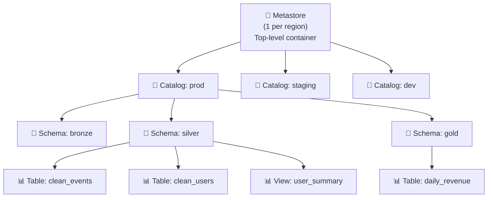

# §5 UNITY CATALOG — Governance, Permissions, Managed vs External

> **Exam Weight:** 11% (shared) | **Difficulty:** Trung bình
> **Exam Guide Sub-topics:** Three-level namespace, Permissions, Managed/External tables, Roles, Audit

---

## TL;DR

**Unity Catalog (UC)** = unified governance layer cho Databricks. Quản lý tables, views, volumes, permissions từ MỘT nơi. Dùng **three-level namespace** (`catalog.schema.table`) và cấp quyền bằng **GRANT/REVOKE** SQL.

---

## Nền Tảng Lý Thuyết

### Tại sao cần Governance?

**Không có governance:**
- Ai cũng truy cập mọi data → vi phạm GDPR, HIPAA
- Không biết data từ đâu đến, ai sửa → "data swamp"
- Mỗi team dùng Hive Metastore riêng → data silos

**Unity Catalog giải quyết:**
- **Centralized permissions:** 1 nơi quản lý ai xem gì
- **Data lineage:** Tự track data flow (table A → notebook B → table C)
- **Audit logs:** Ai truy cập gì, lúc nào
- **Unified namespace:** Mọi asset cùng 1 hệ thống tên

### Three-Level Namespace — "Hệ Thống Địa Chỉ"



```sql
-- Full qualified name: catalog.schema.table
SELECT * FROM prod.silver.clean_events;

-- Tương tự folder structure:
-- prod/silver/clean_events
```

**Tại sao 3 level?** Giống hệ thống thư mục: `Country/City/Street`. Giúp tổ chức + phân quyền theo level.

### Managed vs External Tables — PHẢI PHÂN BIỆT

**Managed Table:**
- UC quản lý CẢ metadata + data files.
- Data lưu ở **UC-managed storage** (bạn không control path).
- `DROP TABLE` = **xóa CẢ data + metadata** → DATA MẤT VĨNH VIỄN.

**External Table:**
- UC chỉ quản lý **metadata** (schema, permissions).
- Data lưu ở **customer-specified location** (S3, ADLS).
- `DROP TABLE` = **chỉ xóa metadata** → DATA VẪN CÒN ở S3.

**Khi nào dùng External?**
- Data đã tồn tại ở S3 trước khi dùng Databricks.
- Data cần share với tools khác (không qua Databricks).
- Data phải ở specific location (compliance requirement).

### Permission System — Principle of Least Privilege

UC dùng **GRANT/REVOKE** với các permission levels:

```text
USAGE     → Cho phép NHÌN THẤY object (catalog, schema) trong Data Explorer
SELECT    → Cho phép ĐỌC data từ table/view
MODIFY    → Cho phép INSERT/UPDATE/DELETE
CREATE    → Cho phép tạo objects mới trong schema
ALL PRIVILEGES → Mọi quyền
```

**Permission inheritance:**

```text
GRANT USAGE ON CATALOG prod → Nhìn thấy catalog prod
  └→ NHƯNG chưa thấy tables bên trong!
  
GRANT USAGE ON SCHEMA prod.silver → Nhìn thấy schema silver
  └→ NHƯNG chưa đọc được tables!
  
GRANT SELECT ON TABLE prod.silver.events → Đọc được table này
```

→ Phải GRANT qua nhiều layers: USAGE on catalog → USAGE on schema → SELECT on table.

### VIEW Security — Special Case

Khi user có SELECT trên VIEW, **KHÔNG cần** SELECT trên underlying table. UC tự enforce security qua VIEW.

```text
VIEW user_summary → đọc từ TABLE users (chứa PII)
User có SELECT trên VIEW → Có thể query VIEW
User KHÔNG cần SELECT trên TABLE users → PII được bảo vệ
```

---

## Cú Pháp / Keywords Cốt Lõi

### GRANT/REVOKE

```sql
-- Analysts chỉ đọc, không sửa
GRANT SELECT ON TABLE prod.silver.orders TO `data_analysts`;

-- DE team cần đọc + ghi
GRANT MODIFY ON SCHEMA prod.silver TO `data_engineers`;

-- Admin: mọi quyền
GRANT ALL PRIVILEGES ON SCHEMA prod.gold TO `etl_admin`;

-- Cấp USAGE để nhìn thấy
GRANT USAGE ON CATALOG prod TO `data_analysts`;
GRANT USAGE ON SCHEMA prod.silver TO `data_analysts`;

-- Thu hồi quyền
REVOKE SELECT ON TABLE prod.silver.orders FROM `temp_user`;
```

### Managed vs External — Syntax

```sql
-- Managed: không có LOCATION → UC quản lý data
CREATE TABLE prod.silver.orders (
    id INT, product STRING, amount DECIMAL
);
DROP TABLE prod.silver.orders;  -- ⚠️ XÓA CẢ DATA

-- External: có LOCATION → data ở customer storage
CREATE TABLE prod.bronze.raw_orders (
    id INT, product STRING, amount DECIMAL
) LOCATION 's3://my-bucket/raw_orders/';
DROP TABLE prod.bronze.raw_orders;  -- Chỉ xóa metadata, data S3 còn
```

### Data Explorer — Tìm Owner

> 🚨 **ExamTopics Q22:** "Identify table owner?" → **"Review Owner field"** (đáp án C). KHÔNG phải Permissions tab.

### Metastore Governance Rules

> 🚨 **ExamTopics Q89:** 2 đáp án đúng:
> - ✅ "1 metastore per account per **region**" (đáp án A)
> - ✅ "If metastore has no location, **catalog MUST have managed location**" (đáp án E)

**Location Fallback Hierarchy:**
```text
Managed Table cần lưu data ở đâu? UC tìm location theo thứ tự:
1. Schema có managed location?  → Dùng
2. Catalog có managed location? → Dùng
3. Metastore có managed location? → Dùng
4. Không ai có? → ❌ ERROR: cannot create managed table
```

**Rule quan trọng:** Nếu Metastore KHÔNG có location → **bắt buộc** Catalog hoặc Schema phải có managed location. Đây là cascading fallback, KHÔNG phải tất cả đều phải có.

---

## Cạm Bẫy Trong Đề Thi (Exam Traps)

### Trap 1: SELECT vs ALL PRIVILEGES
- "Analysts can query but NOT modify" = **SELECT** (đáp án C, Q197). ALL PRIVILEGES = overkill.

### Trap 2: VIEW permissions — Shared vs Single User
- **Shared Access Mode** (exam default): "Access VIEW on shared cluster" = chỉ cần **SELECT on VIEW** (đáp án B, Q61). UC enforces security boundary — owner đã có quyền trên underlying table.
- ⚠️ **Single User Mode**: cần SELECT trên cả VIEW + underlying table (vì bypasses UC security).
- **Cách nhớ:** Shared mode = VIEW bảo vệ PII. Single user = no guardrails.

### Trap 3: Owner field vs Permissions tab
- Owner → **Owner field** trong Data Explorer. Permissions tab chỉ hiện granted permissions.

### Trap 4: DROP Managed = mất data
- Managed: DROP = mất cả data + metadata → **DANGER**.
- External: DROP = chỉ mất metadata → data safe ở S3.

---

## 🔗 Tham Khảo

- **Deep Dive:** [[01_Databricks#6. UNITY CATALOG|01_Databricks.md — Section 6]]
- **Official Docs:** https://docs.databricks.com/en/data-governance/unity-catalog/index.html
- **Permissions:** https://docs.databricks.com/en/data-governance/unity-catalog/manage-privileges/index.html
