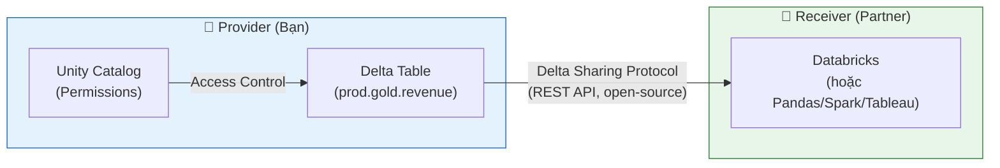

# §5 DELTA SHARING & LINEAGE — Cross-Platform Sharing, Data Discovery

> **Exam Weight:** 11% (shared) | **Difficulty:** Trung bình
> **Exam Guide Sub-topics:** Delta Sharing modes, Lineage, Lakehouse Federation, cross-cloud cost

---

## TL;DR

**Delta Sharing** = open protocol chia sẻ data giữa các platform mà không copy. **Lineage** = UC tự track data flow (table → notebook → table → dashboard). **Lakehouse Federation** = query external DBs trực tiếp mà không di chuyển data.

---

## Nền Tảng Lý Thuyết

### Delta Sharing — Tại Sao Cần?

**Truyền thống:** Muốn share data với partner:
1. Export data → CSV/Parquet
2. Upload lên shared storage (S3, email, FTP...)
3. Partner download + import
4. Vấn đề: data cũ ngay lập tức, không security, không audit

**Delta Sharing:** Share TRỰC TIẾP từ Delta table. Receiver đọc data qua REST API, không cần copy.



### 2 Modes — D2D vs D2External

| Mode | Setup | Receiver | Authentication |
|------|-------|----------|---------------|
| **Databricks-to-Databricks** | Sharing Identifier (UC metastore ID) | Databricks workspace | UC ↔ UC |
| **Databricks-to-External** | Activation Token (download file) | Pandas, Spark, Tableau, etc. | Token file |

**D2D (cả 2 bên dùng Databricks):**
```text
Provider → "Cho tôi sharing identifier của metastore bạn"
Receiver → "aws:us-west-2:xxxx-yyyy-zzzz"
Provider → Tạo RECIPIENT với identifier → Grant access
```

**D2External (receiver không dùng Databricks):**
```text
Provider → Tạo RECIPIENT → Download activation token file
Receiver → Cài Delta Sharing Python lib → Load token → Read data
```

### Cross-Cloud Cost — Cloudflare R2

**Bài toán:** Share data từ AWS (US) sang Azure (EU) → egress fee = **$0.09/GB**. Share 1TB/tháng = $90/tháng.

**Giải pháp:** Upload data lên **Cloudflare R2** (zero egress fee) → share từ R2.

```text
AWS S3 → Download = free
AWS S3 → Share cross-region/cross-cloud = $0.09/GB egress

Cloudflare R2 → Download = FREE (zero egress)
Cloudflare R2 → Share anywhere = FREE

Strategy: Move data to R2 → Share from R2 → Zero egress cost
```

### Unity Catalog Lineage — "Bản Đồ Dòng Chảy Data"

Lineage = tự động track:
- Notebook X đọc table A, ghi vào table B
- Dashboard Y đọc từ table B
- Table B phụ thuộc vào table A

```text
Lineage Graph Example:
[S3 raw files] → [Notebook: ingest.py] → [bronze.events]
                                           ↓
                [Notebook: transform.py] → [silver.events]
                                           ↓
                [Notebook: aggregate.py] → [gold.metrics] → [Dashboard: Revenue]
```

**Tại sao Lineage quan trọng?**
- **Impact analysis:** Nếu table A thay đổi schema → biết ngay tables B, C, D bị ảnh hưởng.
- **Debugging:** Pipeline fail → trace ngược xem data từ đâu đến.
- **Compliance:** Chứng minh data flow cho auditor.

### Lakehouse Federation — "Query-in-Place"

**Bài toán:** Data ở PostgreSQL + Azure Synapse + Databricks. Muốn query tất cả cùng lúc.

**Truyền thống:** ETL data từ PostgreSQL + Synapse → Databricks → query. Vấn đề: data duplication, tốn storage, phải maintain ETL.

**Lakehouse Federation:** Databricks query TRỰC TIẾP PostgreSQL + Synapse qua UC, không copy data:

```sql
-- Tạo foreign catalog pointing to external database
CREATE FOREIGN CATALOG postgres_prod
USING CONNECTION pg_connection;

-- Query PostgreSQL directly from Databricks!
SELECT c.name, o.total
FROM postgres_prod.public.customers c
JOIN prod.gold.orders o ON c.id = o.customer_id;
-- Postgres data ở Postgres, Databricks data ở Databricks
-- Không copy gì cả
```

---

## Cú Pháp / Keywords Cốt Lõi

### Delta Sharing — Provider Setup

```sql
-- Tạo share (collection of tables để chia sẻ)
CREATE SHARE revenue_share;
ALTER SHARE revenue_share ADD TABLE prod.gold.monthly_revenue;

-- D2D: Tạo recipient bằng sharing identifier
CREATE RECIPIENT partner_xyz
    USING ID 'aws:us-west-2:xxxx-metastore-id';

-- D2External: Tạo recipient (sẽ tạo activation token)
CREATE RECIPIENT external_partner;
-- → Download activation token file

-- Grant access
GRANT SELECT ON SHARE revenue_share TO RECIPIENT partner_xyz;
```

> 🚨 **ExamTopics Q171:** "First info for D2D setup?" → **"Sharing identifier of UC metastore"** (đáp án C).

> 🚨 **ExamTopics Q196:** "Minimize cross-cloud egress?" → **"Migrate to Cloudflare R2"** (đáp án A).

### Lineage Usage

> 🚨 **ExamTopics Q198:** "What can lineage show?" → **"ALL dependencies: notebooks, tables, AND reports"** (đáp án C). Không chỉ notebooks hoặc chỉ reports.

### Lakehouse Federation

> 🚨 **ExamTopics Q184:** "Combine PostgreSQL + Synapse without data duplication?" → **"Lakehouse Federation"** (đáp án B).

---

## Cạm Bẫy Trong Đề Thi (Exam Traps)

### Trap 1: Sharing Identifier vs Token vs Password
- D2D = **sharing identifier** (metastore ID). Không phải IP, cluster name, hay password.
- D2External = **activation token** (download file).

### Trap 2: Lineage tracks ALL dependencies
- **SAI:** "Lineage only tracks notebooks" hoặc "only reports."
- **Đúng:** Lineage tracks **notebooks + tables + views + dashboards/reports** (full chain, ExamTopics Q198).

### Trap 3: Cloudflare R2 for cross-cloud
- "Use Delta Sharing without config" → works nhưng **expensive egress**.
- **R2** = zero egress → cost-optimal cho cross-cloud sharing.

### Trap 4: Federation vs ETL
- "Export CSV and upload" = data duplication, maintenance burden.
- **Federation** = query-in-place, zero duplication (ExamTopics Q184).

---

## 🔗 Tham Khảo

- **Deep Dive:** [[01_Databricks#15. DELTA SHARING|01_Databricks.md — Section 15]]
- **Deep Dive:** [[01_Databricks#6. UNITY CATALOG|01_Databricks.md — Section 6]]
- **Delta Sharing:** https://docs.databricks.com/en/delta-sharing/index.html
- **Lineage:** https://docs.databricks.com/en/data-governance/unity-catalog/data-lineage.html
- **Federation:** https://docs.databricks.com/en/query-federation/index.html
