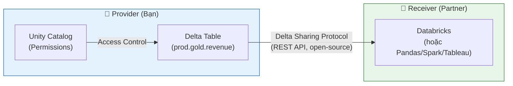

# §5 DELTA SHARING & LINEAGE — Cross-Platform Sharing, Data Discovery

> **Exam Weight:** 11% (shared) | **Difficulty:** Trung bình
> **Exam Guide Sub-topics:** Delta Sharing modes, Lineage, Lakehouse Federation, cross-cloud cost

---

## TL;DR

**Delta Sharing** = open protocol chia sẻ data giữa các platform mà không copy. **Lineage** = UC tự track data flow (table → notebook → table → dashboard). **Lakehouse Federation** = query external DBs trực tiếp mà không di chuyển data.

---

## Nền Tảng Lý Thuyết

### Delta Sharing — Tại Sao Cần?

**Truyền thống:** Muốn share data với partner:
1. Export data → CSV/Parquet
2. Upload lên shared storage (S3, email, FTP...)
3. Partner download + import
4. Vấn đề: data cũ ngay lập tức, không security, không audit

**Delta Sharing:** Share TRỰC TIẾP từ Delta table. Receiver đọc data qua REST API, không cần copy.



### 2 Modes — D2D vs D2External

| Mode | Setup | Receiver | Authentication |
|------|-------|----------|---------------|
| **Databricks-to-Databricks** | Sharing Identifier (UC metastore ID) | Databricks workspace | UC ↔ UC |
| **Databricks-to-External** | Activation Token (download file) | Pandas, Spark, Tableau, etc. | Token file |

**D2D (cả 2 bên dùng Databricks):**
```text
Provider → "Cho tôi sharing identifier của metastore bạn"
Receiver → "aws:us-west-2:xxxx-yyyy-zzzz"
Provider → Tạo RECIPIENT với identifier → Grant access
```

**D2External (receiver không dùng Databricks):**
```text
Provider → Tạo RECIPIENT → Download activation token file
Receiver → Cài Delta Sharing Python lib → Load token → Read data
```

### Delta Sharing Quy Tắc Quan Trọng (Exam Focus)
- **Read-oriented access**: Delta Sharing được thiết kế cho mô hình tiêu thụ dữ liệu chia sẻ có kiểm soát, trọng tâm là đọc. Nếu bên nhận cần chỉnh sửa, thông thường cần quy trình ghi ở hệ thống riêng của họ.
- **Cost Model (Ai trả tiền?)**:
    - Chi phí storage/compute phụ thuộc mode chia sẻ, vị trí compute của bên nhận, và kiến trúc cloud cụ thể.
    - Vì vậy không nên học theo một công thức cost duy nhất; cần đối chiếu matrix trên docs hiện hành.

### Cross-Cloud Cost — Cloudflare R2

**Bài toán:** Share data từ AWS (US) sang Azure (EU) → egress fee = **$0.09/GB**. Share 1TB/tháng = $90/tháng.

**Giải pháp:** Upload data lên **Cloudflare R2** (zero egress fee) → share từ R2.

```text
AWS S3 → Download = free
AWS S3 → Share cross-region/cross-cloud = $0.09/GB egress

Cloudflare R2 → Download = FREE (zero egress)
Cloudflare R2 → Share anywhere = FREE

Strategy: Move data to R2 → Share from R2 → Zero egress cost
```

### Unity Catalog Lineage — "Bản Đồ Dòng Chảy Data"

Lineage = tự động track:
- Notebook X đọc table A, ghi vào table B
- Dashboard Y đọc từ table B
- Table B phụ thuộc vào table A

```text
Lineage Graph Example:
[S3 raw files] → [Notebook: ingest.py] → [bronze.events]
                                           ↓
                [Notebook: transform.py] → [silver.events]
                                           ↓
                [Notebook: aggregate.py] → [gold.metrics] → [Dashboard: Revenue]
```

**Tại sao Lineage quan trọng?**
- **Impact analysis:** Nếu table A thay đổi schema → biết ngay tables B, C, D bị ảnh hưởng.
- **Debugging:** Pipeline fail → trace ngược xem data từ đâu đến.
- **Compliance:** Chứng minh data flow cho auditor.

### Lakehouse Federation — "Query-in-Place"

**Bài toán:** Data ở PostgreSQL + Azure Synapse + Databricks. Muốn query tất cả cùng lúc.

**Truyền thống:** ETL data từ PostgreSQL + Synapse → Databricks → query. Vấn đề: data duplication, tốn storage, phải maintain ETL.

**Lakehouse Federation:** Databricks query TRỰC TIẾP PostgreSQL + Synapse qua UC, không copy data:

```sql
-- Tạo foreign catalog pointing to external database
CREATE FOREIGN CATALOG postgres_prod
USING CONNECTION pg_connection;

-- Query PostgreSQL directly from Databricks!
SELECT c.name, o.total
FROM postgres_prod.public.customers c
JOIN prod.gold.orders o ON c.id = o.customer_id;
-- Postgres data ở Postgres, Databricks data ở Databricks
-- Không copy gì cả
```

**Lakehouse Federation Quy Tắc Quan Trọng:**
- **Read-focused query-in-place**: Federation ưu tiên truy vấn nguồn ngoài tại chỗ. Cơ chế ghi ngược phụ thuộc connector/capability cụ thể; cần kiểm tra tài liệu connector thay vì giả định chung.
- **Query Pushdown**: Chìa khóa hiệu năng. Thay vì Databricks kéo 1 triệu dòng từ Postgres về rồi mới filter, nó sẽ đẩy (pushdown) mệnh đề `WHERE` xuống cho bản thân database Postgres chạy trực tiếp. Postgres chỉ trả về 10 dòng kết quả → Tiết kiệm khổng lồ network bandwidth và compute memory.

---

## Cú Pháp / Keywords Cốt Lõi

### Delta Sharing — Provider Setup

```sql
-- Tạo share (collection of tables để chia sẻ)
CREATE SHARE revenue_share;
ALTER SHARE revenue_share ADD TABLE prod.gold.monthly_revenue;

-- D2D: Tạo recipient bằng sharing identifier
CREATE RECIPIENT partner_xyz
    USING ID 'aws:us-west-2:xxxx-metastore-id';

-- D2External: Tạo recipient (sẽ tạo activation token)
CREATE RECIPIENT external_partner;
-- → Download activation token file

-- Grant access
GRANT SELECT ON SHARE revenue_share TO RECIPIENT partner_xyz;
```

> 🚨 **ExamTopics Q171:** "First info for D2D setup?" → **"Sharing identifier of UC metastore"** (đáp án C).

> 🚨 **ExamTopics Q196:** "Minimize cross-cloud egress?" → **"Migrate to Cloudflare R2"** (đáp án A).

### Lineage Usage

> 🚨 **ExamTopics Q198:** "What can lineage show?" → **"ALL dependencies: notebooks, tables, AND reports"** (đáp án C). Không chỉ notebooks hoặc chỉ reports.

### Lakehouse Federation

> 🚨 **ExamTopics Q184:** "Combine PostgreSQL + Synapse without data duplication?" → **"Lakehouse Federation"** (đáp án B).

---

## Khung Tư Duy Trước Khi Vào Trap

### 3 câu hỏi cần trả lời khi làm bài Delta Sharing
- Ai là provider, ai là recipient?
- Bên nhận cần read-only hay quyền mở rộng?
- Bài toán đang là chia sẻ dữ liệu, lineage, hay federation query?

### Cách tách domain để tránh chọn nhầm đáp án
- Delta Sharing: cấp quyền truy cập dữ liệu chia sẻ có kiểm soát.
- Lineage: truy vết phụ thuộc upstream/downstream.
- Federation: query trực tiếp nguồn ngoài, hạn chế duplicate ETL.

### Gợi ý ghi nhớ
- D2D setup: luôn nghĩ tới sharing identifier.
- Cross-cloud cost: chú ý egress optimization.
- Câu có từ "only" thường là đáp án bẫy khi nói về lineage scope.

## Giải Thích Sâu Các Chỗ Dễ Nhầm (Đối Chiếu Docs Mới)

### 1) Delta Sharing cần phân biệt rõ "giao thức" và "mô hình vận hành"
- Giao thức giúp chia sẻ dữ liệu theo cách mở và có quản trị quyền.
- Nhưng chi phí thực tế và hiệu năng tiêu thụ còn phụ thuộc receiver là Databricks hay external client, cách truy cập, và kiến trúc hạ tầng.
- Vì vậy tránh học một công thức cost duy nhất cho mọi tình huống.

### 2) D2D vs D2External khác nhau ở đường đi quản trị
- D2D thường đơn giản hơn khi cả hai bên đều ở hệ sinh thái Databricks/UC.
- D2External cần quan tâm thêm vòng đời token, client compatibility, và quy trình xoay vòng thông tin truy cập.

### 3) Lineage không chỉ để "xem đẹp"
- Giá trị lớn nhất là impact analysis trước thay đổi và root-cause analysis khi sự cố dữ liệu xảy ra.
- Nếu team chỉ mở lineage khi có sự cố, lợi ích sẽ giảm mạnh.

### 4) Federation không phải thay thế toàn bộ ingestion
- Federation rất hợp cho truy vấn tại chỗ, giảm duplicate dữ liệu không cần thiết.
- Nhưng với workload yêu cầu hiệu năng cao, chuẩn hóa sâu, hoặc phục vụ rộng downstream, bạn vẫn có thể cần pipeline nạp dữ liệu chuyên biệt.

### 5) Cách viết tài liệu chính xác
- Dùng ngôn ngữ "thường/tuỳ mode" cho cost và hành vi.
- Chỉ khẳng định tuyệt đối khi docs ghi rõ ràng ở mức sản phẩm hoặc API.

## Cách Xử Lý Câu Chia Sẻ Dữ Liệu Khi Có Khác Biệt Nguồn

### 1) Phân biệt mục tiêu học
- Mục tiêu exam: chọn đáp án đúng theo wording của bộ đề.
- Mục tiêu production: quyết định theo docs hiện hành + kiến trúc thực tế.
- Hai mục tiêu này liên quan nhưng không luôn trùng 100% câu chữ.

### 2) Quy tắc xử lý câu cost
- Nếu đề cho giả định cost rõ ràng: bám giả định đề để chọn đáp án.
- Nếu không có giả định cụ thể: dùng nguyên tắc an toàn "cost phụ thuộc mode + compute location + cloud path".

### 3) Quy tắc xử lý câu quyền khi sharing/federation
- Nhìn từ khóa: sharing recipient, lineage scope, federation query-in-place.
- Tránh tự mở rộng ý nghĩa sang write paths nếu câu hỏi không mô tả rõ capability tương ứng.

### 4) Mẫu ghi nhớ 10 giây
- Sharing identifier = điểm neo cho D2D setup.
- Lineage = impact + root-cause map.
- Federation = query nguồn ngoài, giảm duplicate ETL không cần thiết.

---

## Cạm Bẫy Trong Đề Thi (Exam Traps) — Trích Từ ExamTopics

## Học Sâu Trước Khi Vào Trap

### 1) Mental Model: Chia sẻ dữ liệu an toàn = đúng đối tượng + đúng quyền + đúng kênh
- Delta Sharing giải bài toán truy cập dữ liệu chia sẻ có kiểm soát.
- Điểm mấu chốt là mô hình recipient và permission boundary.

### 2) Khi nào dùng Delta Sharing, khi nào dùng Federation?
- Delta Sharing: publish dữ liệu cho bên nhận tiêu thụ.
- Federation: query trực tiếp nguồn ngoài mà không copy toàn bộ.
- Hai thứ bổ trợ nhau nhưng không thay thế nhau.

### 3) Lineage cho vận hành production
- Trước khi đổi schema/logic, dùng lineage để impact analysis.
- Khi sự cố xảy ra, dùng lineage để rút ngắn root-cause path.

### 4) Cross-cloud economics
- Câu hỏi về sharing liên cloud thường đi kèm egress-cost trap.
- Nên nhìn cả kiến trúc kỹ thuật và mô hình chi phí truyền dữ liệu.

### 5) Checklist tự kiểm
- Bạn phân biệt được D2D setup key information chưa?
- Bạn có rule internal/external permission tách bạch chưa?
- Bạn có dùng lineage trước các thay đổi rủi ro cao chưa?


### Trap 1: Password Là Tối Kỵ Trong Delta Sharing (Q171, Q199)
- **Tình huống Setup D2D (Q171):** Cần chia sẻ Delta Sharing giữa 2 công ty đều đang xài Databricks (Databricks-to-Databricks). Kỹ sư cần xin thông tin gì đầu tiên từ đối tác để làm cầu nối?
- **Đúng (Đáp án C):** Phải xin **Sharing identifier của Unity Catalog metastore** bên kia. (Sharing ID bản chất là 1 đoạn mã string định danh). Tuyệt đối không xài Password hay IP Address.
- **Tình huống Chia Sẻ Asset (Q199):** Có share được Notebook cùng tác vụ với UC table không? 
- **Đúng (Đáp án B):** **Có thể**. Tính năng Delta Sharing mở rộng hỗ trợ share tập dữ liệu VÀ notebook cho đối tác. Permissions quản lý tập trung via Unity Catalog. Đừng bao giờ chọn các đáp án chắp vá như "Gửi code qua Email" hay "Đưa codebase qua Github".

### Trap 2: Tầm Vực Của Data Lineage (Q198)
- **Tình huống:** Cần hiểu sức mạnh Lineage graph của Databricks soi được tới đâu? 
- **Đúng (Đáp án C):** Nó vẽ ra một đồ thị móc xích liên kết **TẤT CẢ** các phụ thuộc (all dependencies) của bảng, từ gốc rễ ra đến tận các notebooks, bảng khác, views, và đích đến cuối cùng là các Reports/Dashboards.
- **Bẫy:** Nếu keyword ghi chữ "only" (chỉ visualize tới notebooks, hoặc only reports) thì loại ngay đáp án đó.

### Trap 3: Tối Ưu Chi Phí Mạng Xuyên Cloud (Q196)
- **Tình huống:** AWS Workspace muốn share data cực lớn cho Azure Workspace của đối tác. Làm sao giữ bảo mật mà **"minimize data transfer costs"** tức là tiền Cloud Egress Cost (phí đẩy mạng ra khỏi nhà tài trợ) phải gần bằng không?
- **Đáp án đúng (Đáp án A):** **Migrating the dataset to Cloudflare R2 object storage before sharing**.
- **Giải thích:** Cloudflare R2 được dùng để giảm mạnh chi phí egress trong kịch bản chia sẻ liên cloud.

### Trap 4: Chống Trùng Lặp Dữ Liệu Khi Join Đa Hệ Thống (Q184)
- **Tình huống:** Công ty muốn làm báo cáo gộp chung Data từ con PostgreSQL cục bộ On-premise với Cloud Azure Synapse, mà lười clone data sang kho, "tránh data duplication".
- **Đáp án đúng (Đáp án B):** Dùng **Lakehouse Federation** để query trực tiếp nguồn ngoài mà không cần ETL copy toàn bộ dữ liệu.

### Trap 5: Đối chiếu nguồn bổ sung (PDF 100-126, file (2), ảnh)
- Bộ câu bổ sung mới không xuất hiện câu Delta Sharing/Lineage hoàn toàn mới ngoài nhóm đã cover (`Q171`, `Q184`, `Q196`, `Q198`, `Q199`).
- Khi làm đề, giữ nguyên chiến lược: ưu tiên nhận diện keyword **sharing identifier**, **read-only sharing**, **full lineage dependencies**, và **cross-cloud egress**.

### Trap 6: Internal Full Access vs External Read-only (Q194 - PDF bổ sung)
- **Tình huống:** Cùng một bài toán sharing nhưng internal teams cần quyền đầy đủ hơn external partners.
- **Nguyên tắc đúng:** external recipients nên **read-only**, còn internal teams dùng quyền phù hợp nghiệp vụ nội bộ (có thể rộng hơn) theo governance policy.
- **Bẫy đề:** chọn phương án "mọi bên đều read/write" hoặc chỉ chia URL mà không mô hình hóa quyền rõ ràng.
- **Cách nhớ:** Delta Sharing thiên về controlled data access; permission model phải tách đối tượng internal vs external ngay từ thiết kế.

---

## 🔗 Tham Khảo

- **Deep Dive:** [[01_Databricks#15. DELTA SHARING|01_Databricks.md — Section 15]]
- **Deep Dive:** [[01_Databricks#6. UNITY CATALOG|01_Databricks.md — Section 6]]
- **Delta Sharing:** https://docs.databricks.com/en/delta-sharing/index.html
- **Lineage:** https://docs.databricks.com/en/data-governance/unity-catalog/data-lineage.html
- **Federation:** https://docs.databricks.com/en/query-federation/index.html
