# 🎯 Data Engineering Learning Roadmap

> **Từ một Senior DE đã đi qua hành trình này, viết cho bạn mới vào nghề**
>
> Roadmap này không chỉ nói "học gì" mà giải thích **TẠI SAO** học thứ đó và **LÀM SAO** để học hiệu quả nhất

---

## 📌 Lời Nói Đầu: Thực Tế Về Nghề DE

Trước khi đi vào roadmap, tôi muốn chia sẻ vài điều thực tế:

**1. DE không phải học hết mọi thứ**
- Bạn sẽ thấy 20+ tools trong repo này. Đừng hoảng.
- Thực tế: Senior DE chỉ master 5-7 tools, còn lại biết conceptually
- Focus vào fundamentals + 1 tool mỗi category

**2. 80% công việc là SQL + Python + Logic**
- Tools thay đổi, fundamentals không đổi
- Spark có thể bị Polars thay, nhưng distributed thinking thì không
- Đầu tư vào fundamentals = ROI cao nhất

**3. Projects > Tutorials**
- Tutorial = tưởng hiểu, thực ra không
- Project = bị stuck, phải google, phải debug = thực sự hiểu
- 1 project hoàn chỉnh > 10 tutorials

---

## 🗺️ Repository Này Có Gì (104 Files)

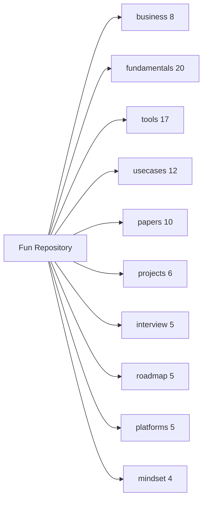

### 💼 business/ (8 files) - IMPACT TRƯỚC, TOOLS SAU ⭐⭐⭐

> **Đọc folder này TRƯỚC khi đọc bất kỳ folder nào khác!**

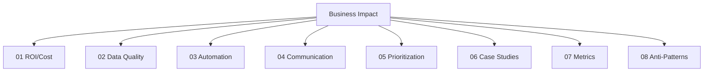

| # | File | Nội dung | Quan trọng |
|---|------|----------|------------|
| 01 | [01_ROI_Cost_Optimization](business/01_ROI_Cost_Optimization.md) | Tiết kiệm $$$, chứng minh giá trị | ⭐⭐⭐ |
| 02 | [02_Data_Quality_Trust](business/02_Data_Quality_Trust.md) | Data đúng = Trust = Adoption | ⭐⭐⭐ |
| 03 | [03_Automation_Business_Value](business/03_Automation_Business_Value.md) | Giải phóng người khác khỏi việc lặp | ⭐⭐⭐ |
| 04 | [04_Stakeholder_Communication](business/04_Stakeholder_Communication.md) | Nói chuyện với non-tech | ⭐⭐ |
| 05 | [05_Prioritization_Framework](business/05_Prioritization_Framework.md) | Làm gì trước, bỏ gì | ⭐⭐ |
| 06 | [06_Impact_Case_Studies](business/06_Impact_Case_Studies.md) | Ví dụ thực tế đã tạo impact | ⭐⭐ |
| 07 | [07_Metrics_That_Matter](business/07_Metrics_That_Matter.md) | Đo lường đúng thứ | ⭐⭐ |
| 08 | [08_Anti_Patterns_Value_Destruction](business/08_Anti_Patterns_Value_Destruction.md) | Những việc phá hủy giá trị - **ĐỌC TRƯỚC** | ⭐⭐⭐ |


### 📁 fundamentals/ (20 files) - Nền Tảng Bắt Buộc

| # | File | Nội dung | Khi nào học |
|---|------|----------|-------------|
| 01 | [01_Data_Modeling_Fundamentals](fundamentals/01_Data_Modeling_Fundamentals.md) | Star/Snowflake, Data Vault, Normalization | Y1 Q2 |
| 02 | [02_SQL_Mastery_Guide](fundamentals/02_SQL_Mastery_Guide.md) | Window functions, CTEs, Optimization | Y1 Q1 ⭐ |
| 03 | [03_Data_Warehousing_Concepts](fundamentals/03_Data_Warehousing_Concepts.md) | Kimball, Inmon, SCD Types | Y1 Q2 |
| 04 | [04_Data_Lakes_Lakehouses](fundamentals/04_Data_Lakes_Lakehouses.md) | Medallion pattern, Lake architecture | Y1 Q2 |
| 05 | [05_Distributed_Systems_Fundamentals](fundamentals/05_Distributed_Systems_Fundamentals.md) | CAP theorem, Partitioning, Replication | Y2 Q1 |
| 06 | [06_Data_Formats_Storage](fundamentals/06_Data_Formats_Storage.md) | Parquet, Avro, ORC, Compression | Y1 Q2 |
| 07 | [07_Batch_vs_Streaming](fundamentals/07_Batch_vs_Streaming.md) | Lambda/Kappa, Windowing, Watermarks | Y2 Q2 |
| 08 | [08_Data_Integration_APIs](fundamentals/08_Data_Integration_APIs.md) | ETL patterns, CDC, REST/GraphQL | Y1 Q1 |
| 09 | [09_Security_Governance](fundamentals/09_Security_Governance.md) | RBAC, Encryption, GDPR, Data Catalog | Y3 Q2 |
| 10 | [10_Cloud_Platforms](fundamentals/10_Cloud_Platforms.md) | AWS vs GCP vs Azure comparison | Y1 Q4 |
| 11 | [11_Testing_CICD](fundamentals/11_Testing_CICD.md) | Data testing, Pipeline CI/CD | Y1 Q4 |
| 12 | [12_Monitoring_Observability](fundamentals/12_Monitoring_Observability.md) | Pipeline monitoring, Alerting, SLAs | Y2 Q4 |
| 13 | [13_Python_Data_Engineering](fundamentals/13_Python_Data_Engineering.md) | DE patterns, APIs, File handling | Y1 Q1 ⭐ |
| 14 | [14_Git_Version_Control](fundamentals/14_Git_Version_Control.md) | Branching, PRs, Team workflows | Y1 Q1 ⭐ |
| 15 | [15_Clean_Code_Data_Engineering](fundamentals/15_Clean_Code_Data_Engineering.md) | Code quality, Patterns, Testing | Y1 Q1 |
| 16 | [16_DE_Environment_Setup](fundamentals/16_DE_Environment_Setup.md) | Docker, Dev environment, Tools | Y1 Q1 |
| 17 | [17_Cost_Optimization](fundamentals/17_Cost_Optimization.md) | Cloud cost strategies, FinOps | Y3 Q2 |
| 18 | [18_OOP_Design_Patterns](fundamentals/18_OOP_Design_Patterns.md) | 4 Pillars, SOLID, Factory/Strategy/Builder | Y1 Q1 ⭐ |
| 19 | [19_DSA_For_Data_Engineering](fundamentals/19_DSA_For_Data_Engineering.md) | Hash tables, Heaps, Bloom filters, Big-O | Y1 Q1 ⭐ |
| 20 | [20_Networking_Protocols](fundamentals/20_Networking_Protocols.md) | HTTP/REST, TCP, DNS, VPC, Connection pooling | Y1 Q3 |

### 🔧 tools/ (17 files) - SOTA Tools 2025

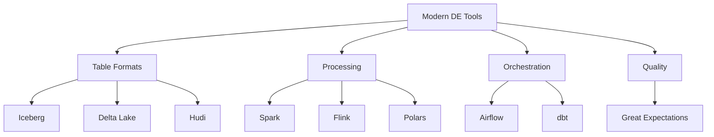

| # | File | Tool | Khi nào học |
|---|------|------|-------------|
| 00 | [00_SOTA_Overview_2025](tools/00_SOTA_Overview_2025.md) | Tool landscape overview | Y1 Start |
| 01 | [01_Apache_Iceberg_Complete_Guide](tools/01_Apache_Iceberg_Complete_Guide.md) | Table format, Time travel | Y2 Q3 ⭐ |
| 02 | [02_Delta_Lake_Complete_Guide](tools/02_Delta_Lake_Complete_Guide.md) | ACID, Change Data Feed | Y2 Q3 |
| 03 | [03_Apache_Hudi_Complete_Guide](tools/03_Apache_Hudi_Complete_Guide.md) | CoW, MoR, Incremental | Y2 Q3 |
| 04 | [04_Apache_Flink_Complete_Guide](tools/04_Apache_Flink_Complete_Guide.md) | Stream processing | Y2 Q2 |
| 05 | [05_Apache_Kafka_Complete_Guide](tools/05_Apache_Kafka_Complete_Guide.md) | Event streaming | Y2 Q2 ⭐ |
| 06 | [06_Apache_Spark_Complete_Guide](tools/06_Apache_Spark_Complete_Guide.md) | Distributed processing | Y2 Q1 ⭐ |
| 07 | [07_dbt_Complete_Guide](tools/07_dbt_Complete_Guide.md) | Transformation framework | Y1 Q4 ⭐ |
| 08 | [08_Apache_Airflow_Complete_Guide](tools/08_Apache_Airflow_Complete_Guide.md) | Orchestration | Y1 Q4 ⭐ |
| 09 | [09_Prefect_Dagster_Complete_Guide](tools/09_Prefect_Dagster_Complete_Guide.md) | Modern orchestration | Y2+ |
| 10 | [10_Data_Quality_Tools_Guide](tools/10_Data_Quality_Tools_Guide.md) | Great Expectations, Soda | Y3 Q2 |
| 11 | [11_Data_Catalogs_Guide](tools/11_Data_Catalogs_Guide.md) | DataHub, Unity Catalog | Y3 Q2 |
| 12 | [12_Polars_Complete_Guide](tools/12_Polars_Complete_Guide.md) | Fast DataFrame library | Y1 Q3 ⭐ |
| 13 | [13_DuckDB_Complete_Guide](tools/13_DuckDB_Complete_Guide.md) | In-process OLAP | Y1 Q3 ⭐ |
| 14 | [14_Trino_Presto_Complete_Guide](tools/14_Trino_Presto_Complete_Guide.md) | Query federation | Y2+ |
| 15 | [15_Fivetran_Airbyte_Guide](tools/15_Fivetran_Airbyte_Guide.md) | Data ingestion | Y1 Q4 |
| 16 | [16_Observability_Monitoring_Tools](tools/16_Observability_Monitoring_Tools.md) | OpenTelemetry, Metrics | Y2 Q4 |
| 17 | [17_Modern_Alternatives](tools/17_Modern_Alternatives.md) | Dagster, Mage.ai, etc | Y2+ |

### 🏢 usecases/ (12 files) - Real-world Case Studies

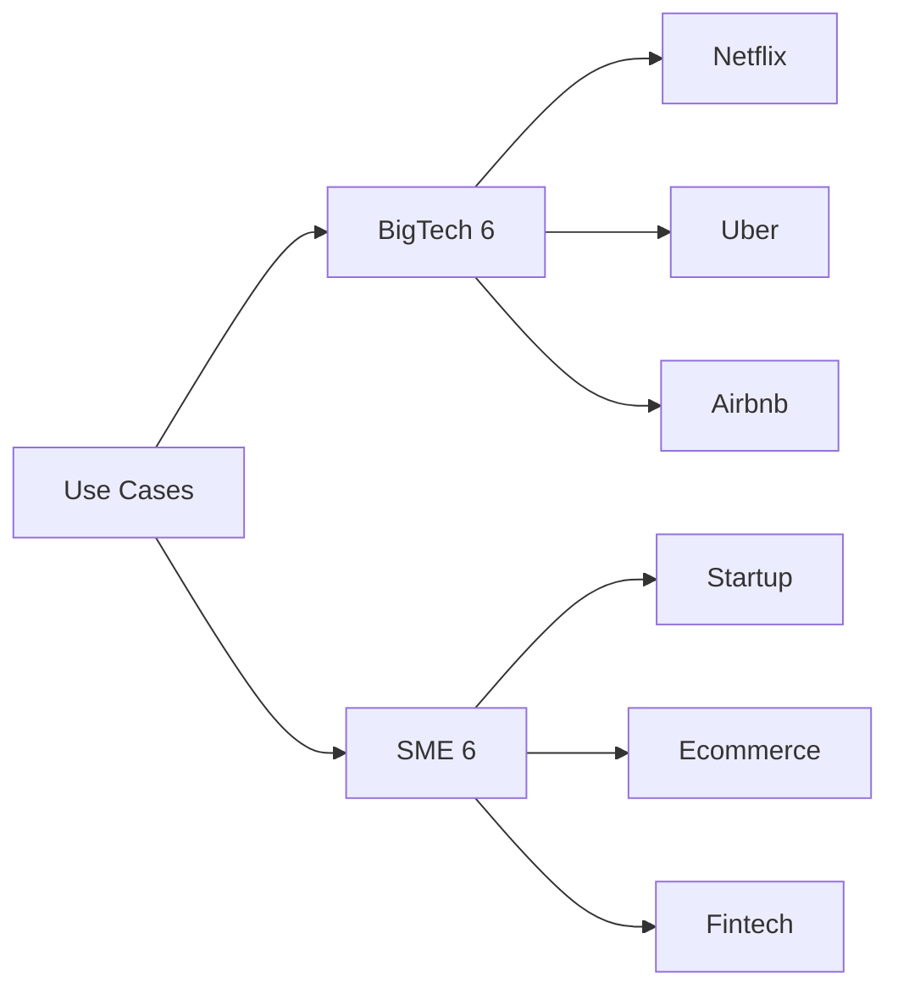

| # | File | Company/Type | What They Created |
|---|------|--------------|-------------------|
| 01 | [01_Netflix_Data_Platform](usecases/01_Netflix_Data_Platform.md) | Netflix | Iceberg, 100PB+ scale |
| 02 | [02_Uber_Data_Platform](usecases/02_Uber_Data_Platform.md) | Uber | Hudi, Real-time analytics |
| 03 | [03_Airbnb_Data_Platform](usecases/03_Airbnb_Data_Platform.md) | Airbnb | Airflow, Data quality |
| 04 | [04_LinkedIn_Data_Platform](usecases/04_LinkedIn_Data_Platform.md) | LinkedIn | Kafka, Data mesh |
| 05 | [05_Spotify_Data_Platform](usecases/05_Spotify_Data_Platform.md) | Spotify | GCP native, ML platform |
| 06 | [06_Meta_Data_Platform](usecases/06_Meta_Data_Platform.md) | Meta | Presto/Trino, Exabyte scale |
| 07 | [07_Startup_Data_Platform](usecases/07_Startup_Data_Platform.md) | Startup | $0-500/mo stack |
| 08 | [08_Ecommerce_SME_Platform](usecases/08_Ecommerce_SME_Platform.md) | E-commerce | Airbyte + BigQuery |
| 09 | [09_SaaS_Company_Platform](usecases/09_SaaS_Company_Platform.md) | SaaS | Fivetran + Snowflake |
| 10 | [10_Fintech_SME_Platform](usecases/10_Fintech_SME_Platform.md) | Fintech | Kafka + Spark |
| 11 | [11_Healthcare_SME_Platform](usecases/11_Healthcare_SME_Platform.md) | Healthcare | HIPAA compliant |
| 12 | [12_Manufacturing_SME_Platform](usecases/12_Manufacturing_SME_Platform.md) | Manufacturing | IoT + Time-series |

### 📄 papers/ (10 files) - Research Papers

| # | File | Topics Covered |
|---|------|----------------|
| 01 | [01_Distributed_Systems_Papers](papers/01_Distributed_Systems_Papers.md) | GFS, MapReduce, Bigtable, Dynamo |
| 02 | [02_Stream_Processing_Papers](papers/02_Stream_Processing_Papers.md) | Kafka, Flink, Dataflow Model |
| 03 | [03_Data_Warehouse_Papers](papers/03_Data_Warehouse_Papers.md) | Kimball, Dremel, Snowflake |
| 04 | [04_Table_Format_Papers](papers/04_Table_Format_Papers.md) | Iceberg, Delta Lake, Hudi |
| 05 | [05_Consensus_Papers](papers/05_Consensus_Papers.md) | Paxos, Raft, ZAB |
| 06 | [06_Database_Internals_Papers](papers/06_Database_Internals_Papers.md) | LSM-Tree, B-Tree, MVCC |
| 07 | [07_Data_Quality_Governance_Papers](papers/07_Data_Quality_Governance_Papers.md) | Data quality frameworks |
| 08 | [08_ML_Data_Papers](papers/08_ML_Data_Papers.md) | Feature stores, MLOps |
| 09 | [09_Query_Optimization_Papers](papers/09_Query_Optimization_Papers.md) | Calcite, Cascades, CBO |
| 10 | [10_Serialization_Format_Papers](papers/10_Serialization_Format_Papers.md) | Parquet, Arrow, Avro |

### 💼 projects/ (6 files) - Hands-on Projects

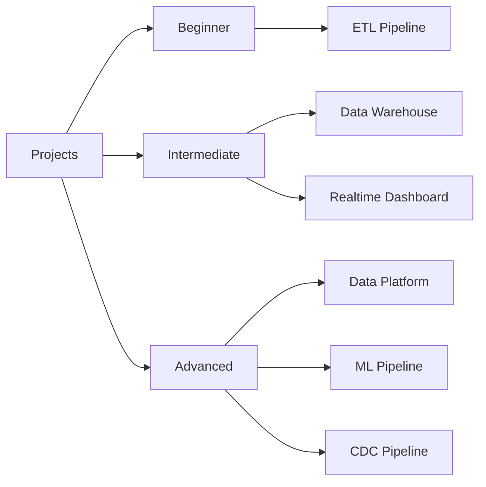

| # | File | Difficulty | Technologies |
|---|------|------------|--------------|
| 01 | [01_ETL_Pipeline](projects/01_ETL_Pipeline.md) | Beginner | Python, Polars, DuckDB |
| 02 | [02_Realtime_Dashboard](projects/02_Realtime_Dashboard.md) | Intermediate | Kafka, Flink, Streamlit |
| 03 | [03_Data_Warehouse](projects/03_Data_Warehouse.md) | Intermediate | Airflow, dbt, BigQuery |
| 04 | [04_Data_Platform](projects/04_Data_Platform.md) | Advanced | Kafka, Spark, Iceberg |
| 05 | [05_ML_Pipeline](projects/05_ML_Pipeline.md) | Advanced | Feature store, MLflow |
| 06 | [06_CDC_Pipeline](projects/06_CDC_Pipeline.md) | Advanced | Debezium, Kafka, Flink |

### 🎤 interview/ (5 files) - Interview Preparation

| # | File | Focus |
|---|------|-------|
| 01 | [01_Common_Interview_Questions](interview/01_Common_Interview_Questions.md) | Concepts, fundamentals |
| 02 | [02_SQL_Deep_Dive](interview/02_SQL_Deep_Dive.md) | Complex SQL, patterns |
| 03 | [03_System_Design](interview/03_System_Design.md) | Architecture, trade-offs |
| 04 | [04_Behavioral_Questions](interview/04_Behavioral_Questions.md) | STAR method, stories |
| 05 | [05_Coding_Test_DE](interview/05_Coding_Test_DE.md) | Python challenges |

### 📈 roadmap/ (5 files) - Career Guidance

| # | File | Focus |
|---|------|-------|
| 01 | [01_Career_Levels](roadmap/01_Career_Levels.md) | Junior → Staff expectations |
| 02 | [02_Skills_Matrix](roadmap/02_Skills_Matrix.md) | Skills by level |
| 03 | [03_Learning_Resources](roadmap/03_Learning_Resources.md) | Books, courses, podcasts |
| 04 | [04_Certification_Guide](roadmap/04_Certification_Guide.md) | AWS, GCP, Databricks certs |
| 05 | [05_Job_Search_Strategy](roadmap/05_Job_Search_Strategy.md) | Resume, networking, interviews |

### ☁️ platforms/ (5 files) - Cloud Platforms

| # | File | Platform | When to Use |
|---|------|----------|-------------|
| 01 | [01_Databricks](platforms/01_Databricks.md) | Databricks | Spark + Delta ecosystem |
| 02 | [02_Snowflake](platforms/02_Snowflake.md) | Snowflake | Cloud DWH, easy start |
| 03 | [03_BigQuery](platforms/03_BigQuery.md) | BigQuery | GCP, serverless |
| 04 | [04_Redshift](platforms/04_Redshift.md) | Redshift | AWS ecosystem |
| 05 | [05_Azure_Synapse](platforms/05_Azure_Synapse.md) | Synapse | Azure ecosystem |

### 🧠 mindset/ (4 files) - Soft Skills

| # | File | Focus |
|---|------|-------|
| 01 | [01_Design_Patterns](mindset/01_Design_Patterns.md) | DE design patterns |
| 02 | [02_Architectural_Thinking](mindset/02_Architectural_Thinking.md) | System thinking |
| 03 | [03_Problem_Solving](mindset/03_Problem_Solving.md) | Debug strategies |
| 04 | [04_Career_Growth](mindset/04_Career_Growth.md) | Senior → Staff path |

---

# 🔑 NGUYÊN TẮC HỌC

## Tại Sao Nhiều Người Học Không Hiệu Quả?

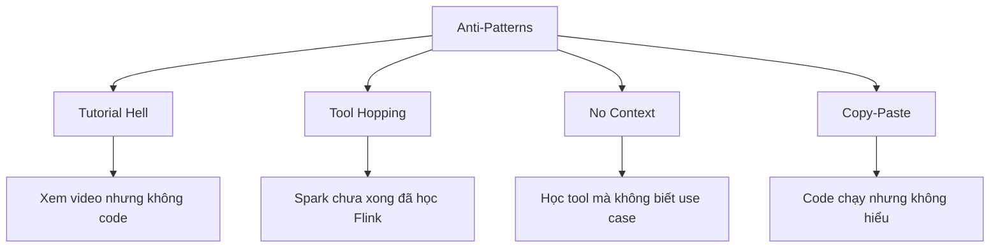

**Anti-pattern phổ biến:**
1. **Tutorial Hell**: Xem video liên tục, tưởng hiểu, thực ra không code được
2. **Tool Hopping**: Học Spark chưa xong đã nhảy sang Flink
3. **No Context**: Học tool mà không biết dùng trong scenario nào
4. **Copy-Paste**: Code chạy nhưng không hiểu tại sao

## Cách Học Đúng: Read → Code → Break → Build

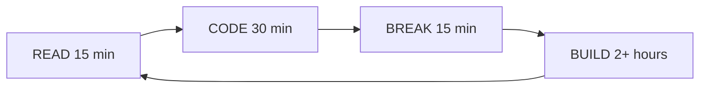

| Step | Time | Action | Example |
|------|------|--------|---------|
| READ | 15 min | Đọc guide, hiểu concept | [02_SQL_Mastery](fundamentals/02_SQL_Mastery_Guide.md) |
| CODE | 30 min | Gõ lại example | Không copy-paste |
| BREAK | 15 min | Cố tình làm sai | Bỏ PARTITION BY |
| BUILD | 2+ hours | Mini project | Tự viết sessionization |

**Ví dụ với SQL Window Functions:**
- READ: Đọc section Window Functions trong [02_SQL_Mastery_Guide](fundamentals/02_SQL_Mastery_Guide.md)
- CODE: Gõ lại query ví dụ
- BREAK: Bỏ PARTITION BY, xem kết quả khác thế nào
- BUILD: Viết query tính running total cho data của bạn

---

# 📅 YEAR 1: Nền Tảng Không Thể Thiếu

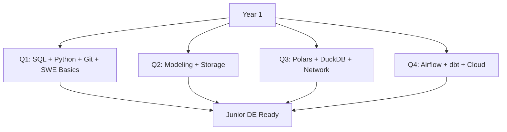

## Tại Sao Year 1 Quan Trọng Nhất?

> Nền tảng yếu → senior vẫn bị stuck ở những vấn đề cơ bản

Year 1 quyết định bạn có thể đi xa hay không. Tôi thấy nhiều người vội học Spark nhưng SQL còn yếu, kết quả là debug rất lâu vì không hiểu data.

**Files sử dụng trong Year 1:**
- fundamentals/: 13 files (01-08, 13-16, 18-20)
- tools/: 6 files (07, 08, 12, 13, 15, 00)
- projects/: 2 files (01, 03)

---

## Q1 (Tháng 1-3): SQL, Python, Git + SWE Foundations

### Tại Sao Ba Thứ Này Trước?

| Skill | % Công việc hàng ngày | Không có thì sao? |
|-------|----------------------|-------------------|
| SQL | 50-70% | Không query được data, không debug được |
| Python | 40-60% | Không viết được pipeline, script |
| Git | 100% | Không làm việc team được |
| OOP/DSA | Nền tảng | Code không scale, interview fail |

### Month 1: SQL - Ngôn Ngữ Chung Của Data

**File chính:** [02_SQL_Mastery_Guide](fundamentals/02_SQL_Mastery_Guide.md)

**Week 1: Basics (phải solid)**
- SELECT, WHERE, ORDER BY
- JOINs: INNER, LEFT, RIGHT
- GROUP BY, HAVING
- **Target**: Viết được query từ 3 tables

**Week 2: CTEs - Game Changer**
- WITH clause
- **Tại sao quan trọng?** Production code PHẢI dùng CTE để readable
- Practice: Refactor query phức tạp thành CTEs

**Week 3-4: Window Functions**
- ROW_NUMBER, RANK, DENSE_RANK
- LAG, LEAD (truy cập row trước/sau)
- SUM() OVER, AVG() OVER
- **Tại sao quan trọng?** Analytics calculations, interview favorite

**Real scenario**: Tính session cho user (30 phút không hoạt động = session mới)

```sql
-- Đây là pattern bạn PHẢI biết
WITH session_markers AS (
    SELECT 
        user_id,
        event_time,
        CASE WHEN event_time - LAG(event_time) 
             OVER (PARTITION BY user_id ORDER BY event_time) 
             > INTERVAL '30 minutes'
             THEN 1 ELSE 0 
        END as new_session
    FROM events
)
SELECT 
    user_id,
    event_time,
    SUM(new_session) OVER (PARTITION BY user_id ORDER BY event_time) + 1 as session_id
FROM session_markers;
```

**Interview prep:** [02_SQL_Deep_Dive](interview/02_SQL_Deep_Dive.md)

---

### Month 2: Python for DE

**File chính:** [13_Python_Data_Engineering](fundamentals/13_Python_Data_Engineering.md)

**Tại sao Python cho DE khác với Python thường?**

| General Python | Python for DE |
|----------------|---------------|
| OOP, design patterns | Scripts, automation |
| Web frameworks | File I/O, APIs |
| Application logic | Data processing |

**Week 1-2: Core Skills**
- File I/O: Read/write JSON, CSV, Parquet
- Error handling: try/except, logging
- **Practice**: Script đọc JSON từ API, save as Parquet

**Week 3-4: Production Patterns**
- Type hints (maintainability)
- Virtual environments (uv, poetry)
- Testing basics (pytest)

**Companion files:**
- [15_Clean_Code_Data_Engineering](fundamentals/15_Clean_Code_Data_Engineering.md)
- [18_OOP_Design_Patterns](fundamentals/18_OOP_Design_Patterns.md) — **Học song song với Python!**

> **⚠️ SWE Foundations:** Song song với Python, dành 30% thời gian cho:
> - [18_OOP_Design_Patterns](fundamentals/18_OOP_Design_Patterns.md): 4 Pillars, SOLID → Viết pipeline code sạch
> - [19_DSA_For_Data_Engineering](fundamentals/19_DSA_For_Data_Engineering.md): Hash tables, Big-O → Hiểu tại sao JOIN chậm/nhanh
> Không cần LeetCode Hard, nhưng cần hiểu đủ để viết code scale.

---

### Month 3: Git + Docker + Environment

**Files:**
- [14_Git_Version_Control](fundamentals/14_Git_Version_Control.md)
- [16_DE_Environment_Setup](fundamentals/16_DE_Environment_Setup.md)

**Tại sao DevOps skills quan trọng cho DE?**

| Problem | Solution |
|---------|----------|
| "Works on my machine" | Docker |
| Code conflicts | Git branching |
| Reproducibility | Docker Compose |

**Deliverables cuối Q1:**
- [ ] GitHub profile với 3+ repos
- [ ] SQL: 50+ queries, LeetCode 30 Easy + 15 Medium
- [ ] Python: 10 utility scripts
- [ ] Docker: Local dev environment setup
- [ ] OOP: Viết được pipeline dùng class, abstract base, dependency injection
- [ ] DSA: Hiểu Big-O, biết khi nào dùng dict/set/heap

---

## Q2 (Tháng 4-6): Data Modeling + Storage

### Tại Sao Modeling Trước Tools?

> Sai model → phải rebuild toàn bộ pipeline. Đây là sai lầm tốn kém nhất.

Tôi đã thấy teams mất cả tháng vì design schema sai ban đầu.

### Month 4: Data Modeling

**Files:**
- [01_Data_Modeling_Fundamentals](fundamentals/01_Data_Modeling_Fundamentals.md)
- [03_Data_Warehousing_Concepts](fundamentals/03_Data_Warehousing_Concepts.md)

**Concepts phải master:**

| Concept | Tại sao quan trọng? |
|---------|---------------------|
| Star Schema | 90% data warehouses dùng. Optimized cho analytics |
| Fact vs Dimension | Hiểu sai = query performance tệ |
| Grain | Quyết định level of detail, không sửa được sau |
| SCD Type 2 | Track historical changes, interview favorite |

**Practice:** Design star schema cho e-commerce (orders, products, customers)

---

### Month 5: Data Formats + Storage

**File:** [06_Data_Formats_Storage](fundamentals/06_Data_Formats_Storage.md)

**Khi nào dùng format nào?**

| Format | Use case | Tại sao? |
|--------|----------|----------|
| Parquet | Analytics, batch | Columnar, 10x smaller |
| Avro | Kafka, streaming | Row-based, schema evolution |
| JSON | APIs, configs | Human readable |
| CSV | Data exchange | Universal |

**Lakehouse concepts:**
- [04_Data_Lakes_Lakehouses](fundamentals/04_Data_Lakes_Lakehouses.md)
- Medallion pattern: Bronze (raw) → Silver (clean) → Gold (aggregated)

---

### Month 6: First Complete Project

**File:** [01_ETL_Pipeline](projects/01_ETL_Pipeline.md)

**Tại sao project này?**
- Apply tất cả Q1-Q2 skills
- End-to-end visibility
- Portfolio piece đầu tiên

**Architecture đơn giản:**
```
API → Python Extract → Parquet → DuckDB → Streamlit Dashboard
```

**Deliverables cuối Q2:**
- [ ] E-commerce star schema designed
- [ ] Understand Parquet vs Avro trade-offs
- [ ] First ETL project on GitHub

---

## Q3 (Tháng 7-9): Modern Local Tools

### Tại Sao Polars/DuckDB Trước Spark?

> 80% DE tasks không cần Spark. Học local tools trước = feedback loop nhanh hơn.

Spark là distributed system phức tạp. Bạn sẽ learn Spark concepts dễ hơn nếu đã hiểu DataFrame operations từ Polars.

> **Networking song song:** Trong Q3, dành thời gian đọc [20_Networking_Protocols](fundamentals/20_Networking_Protocols.md).
> Lý do: Bắt đầu connect tới APIs, external services → cần hiểu HTTP, status codes, retry, connection pooling.

### Month 7: Polars

**File:** [12_Polars_Complete_Guide](tools/12_Polars_Complete_Guide.md)

**Polars vs Pandas:**

| Aspect | Pandas | Polars |
|--------|--------|--------|
| Speed | Baseline | 10-100x faster |
| Memory | High | Low (lazy eval) |
| API | Legacy | Modern, consistent |

**Practice:** Rewrite Month 6 project với Polars

---

### Month 8: DuckDB

**File:** [13_DuckDB_Complete_Guide](tools/13_DuckDB_Complete_Guide.md)

**Tại sao DuckDB là game-changer?**

```sql
-- Query Parquet file directly, no loading needed
SELECT * FROM read_parquet('s3://bucket/data/*.parquet')
WHERE date > '2024-01-01';
```

- In-process: Không cần server
- Query files: Parquet, CSV, JSON directly
- SQL: Familiar syntax

---

### Month 9: Analytics Project

**Files needed:**
- [12_Polars_Complete_Guide](tools/12_Polars_Complete_Guide.md)
- [13_DuckDB_Complete_Guide](tools/13_DuckDB_Complete_Guide.md)

**Project:** Local data platform với multiple sources → Polars ETL → DuckDB → Dashboard

**Deliverables cuối Q3:**
- [ ] Polars fluent
- [ ] DuckDB as local warehouse
- [ ] Second portfolio project
- [ ] Networking basics: Hiểu HTTP status codes, retry logic, connection pooling

---

## Q4 (Tháng 10-12): Orchestration + Cloud

### Tại Sao Orchestration Cuối Year 1?

> Orchestration = schedule + monitor pipelines. Cần có pipelines trước đã.

### Month 10: Apache Airflow

**File:** [08_Apache_Airflow_Complete_Guide](tools/08_Apache_Airflow_Complete_Guide.md)

**Tại sao Airflow?**
- 70%+ companies dùng
- Python-based, extensible
- Large community

**Core concepts:**
- DAGs (Directed Acyclic Graph)
- Tasks, Operators
- TaskFlow API (modern syntax)

**Case study:** [03_Airbnb_Data_Platform](usecases/03_Airbnb_Data_Platform.md) - Họ tạo ra Airflow!

---

### Month 11: dbt

**File:** [07_dbt_Complete_Guide](tools/07_dbt_Complete_Guide.md)

**Tại sao dbt thay đổi cách DE làm việc?**

| Before dbt | With dbt |
|------------|----------|
| SQL files scattered | Organized project |
| No testing | Built-in tests |
| Manual documentation | Auto-generated docs |
| No lineage | Clear DAG |

**Key concepts:**
- Staging models
- Marts
- Incremental processing
- Testing

---

### Month 12: Cloud + Year 1 Capstone

**Files:**
- [10_Cloud_Platforms](fundamentals/10_Cloud_Platforms.md)
- Choose one: [03_BigQuery](platforms/03_BigQuery.md) or [02_Snowflake](platforms/02_Snowflake.md)

**Capstone Project:**
```
API Sources → Airflow → Cloud Storage → dbt → Data Warehouse → BI Dashboard
```

**File:** [03_Data_Warehouse](projects/03_Data_Warehouse.md)

**Deliverables cuối Year 1:**
- [ ] Airflow: 5+ DAGs
- [ ] dbt: Complete project với tests
- [ ] Cloud: One platform experience
- [ ] **Ready for Junior DE role**

**Level check:** [01_Career_Levels](roadmap/01_Career_Levels.md)

---

# 📅 YEAR 2: Scale Up

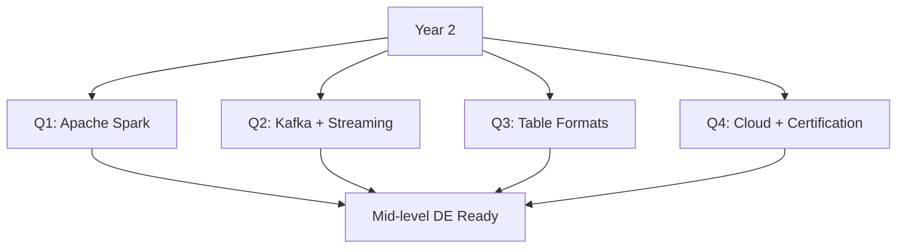

## Tại Sao Year 2 Focus Vào Distributed Systems?

> Junior → Mid-level = từ xử lý GBs → TBs

**Files sử dụng trong Year 2:**
- fundamentals/: 4 files (05, 07, 10, 12)
- tools/: 8 files (01-06, 09, 14)
- usecases/: 6 files (BigTech cases)
- papers/: 4 files (01-04)
- platforms/: 5 files
- roadmap/: 04 (Certification)

---

## Q1: Apache Spark

**File:** [06_Apache_Spark_Complete_Guide](tools/06_Apache_Spark_Complete_Guide.md)

**Khi nào cần Spark?**

| Data Size | Tool | Rationale |
|-----------|------|-----------|
| < 10GB | Polars/DuckDB | Local đủ rồi |
| 10-100GB | DuckDB MotherDuck | Cloud scale |
| > 100GB | Spark | Distributed required |

**Key concepts:**
- RDDs, DataFrames
- Partitioning
- Shuffle optimization
- Broadcast joins

**Papers background:** [01_Distributed_Systems_Papers](papers/01_Distributed_Systems_Papers.md)

---

## Q2: Kafka + Streaming

**Files:**
- [05_Apache_Kafka_Complete_Guide](tools/05_Apache_Kafka_Complete_Guide.md)
- [04_Apache_Flink_Complete_Guide](tools/04_Apache_Flink_Complete_Guide.md)
- [07_Batch_vs_Streaming](fundamentals/07_Batch_vs_Streaming.md)

**Tại sao streaming?**
- Real-time dashboards
- Fraud detection
- Recommendation systems

**Case study:** [04_LinkedIn_Data_Platform](usecases/04_LinkedIn_Data_Platform.md) - LinkedIn tạo ra Kafka!

---

## Q3: Table Formats (Iceberg/Delta)

**Files:**
- [01_Apache_Iceberg_Complete_Guide](tools/01_Apache_Iceberg_Complete_Guide.md)
- [02_Delta_Lake_Complete_Guide](tools/02_Delta_Lake_Complete_Guide.md)

**Tại sao table formats là trend?**

| Feature | Without | With Table Format |
|---------|---------|-------------------|
| ACID | No | Yes |
| Time travel | No | Yes |
| Schema evolution | Hard | Easy |

**Case studies:**
- [01_Netflix_Data_Platform](usecases/01_Netflix_Data_Platform.md) - Netflix tạo ra Iceberg!
- [02_Uber_Data_Platform](usecases/02_Uber_Data_Platform.md) - Uber tạo ra Hudi!

---

## Q4: Cloud Mastery + Certification

**Files:**
- Platform deep dive: [01_Databricks](platforms/01_Databricks.md) or [02_Snowflake](platforms/02_Snowflake.md)
- [04_Certification_Guide](roadmap/04_Certification_Guide.md)

**Certification recommendation:**
- AWS Data Engineer Associate
- OR GCP Professional Data Engineer
- OR Databricks DE Associate

**Deliverables cuối Year 2:**
- [ ] Spark project processing 100GB+
- [ ] Streaming pipeline với Kafka
- [ ] Table format experience
- [ ] 1 certification
- [ ] **Ready for Mid-level DE role**

---

# 📅 YEAR 3: Architecture + Leadership

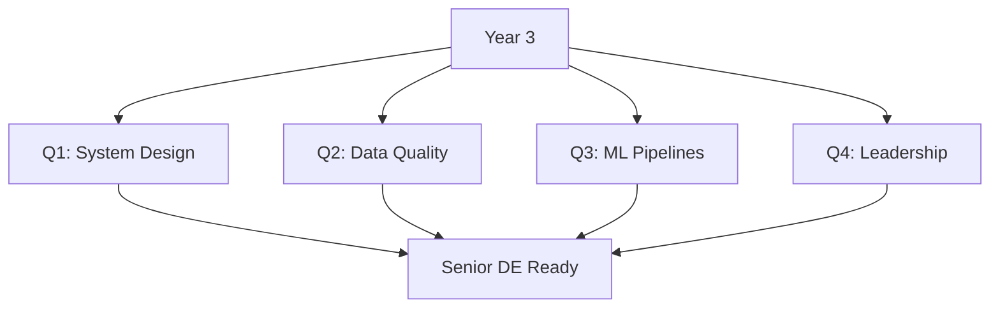

## Focus: Từ Implement → Design

**Files chính:**
- [03_System_Design](interview/03_System_Design.md)
- [02_Architectural_Thinking](mindset/02_Architectural_Thinking.md)

**Files sử dụng trong Year 3:**
- fundamentals/: 3 files (09, 12, 17)
- tools/: 3 files (10, 11, 16)
- mindset/: 4 files (all)
- papers/: 6 files (05-10)
- usecases/: all SME cases

### Q1: System Design

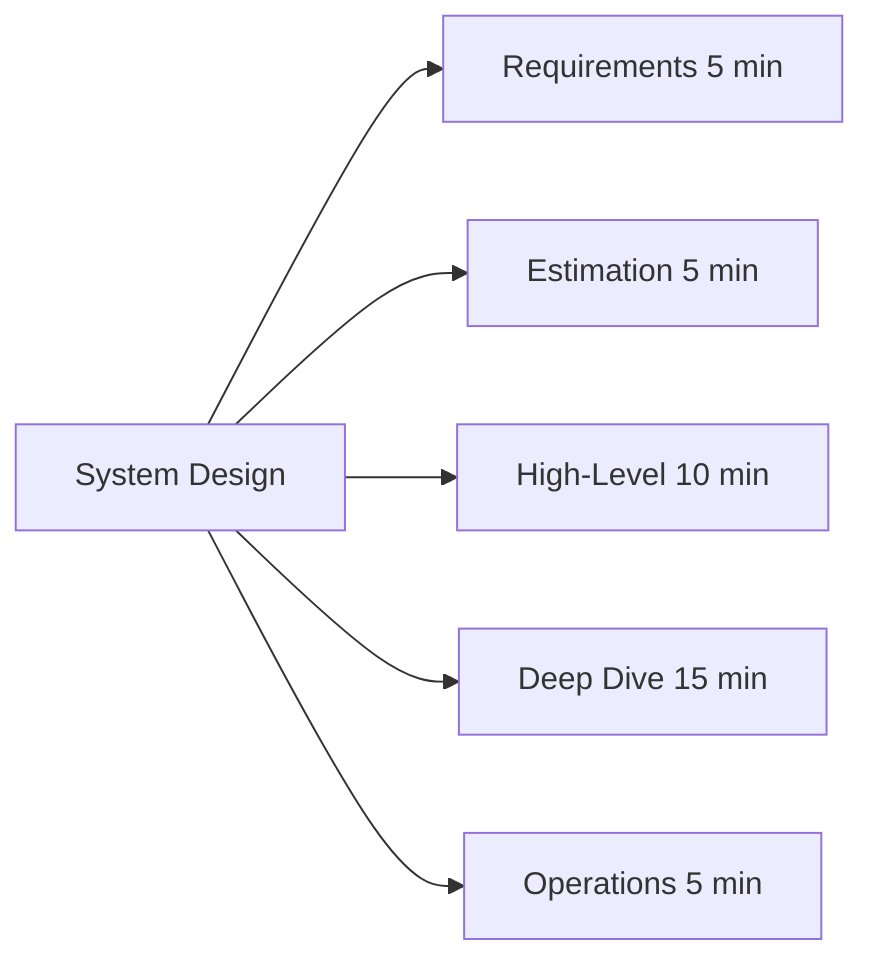

**Focus areas:**
- 5-step framework
- Practice với real scenarios
- Study BigTech: [01_Netflix](usecases/01_Netflix_Data_Platform.md), [02_Uber](usecases/02_Uber_Data_Platform.md), [03_Airbnb](usecases/03_Airbnb_Data_Platform.md)

**Practice resources:**
- [03_System_Design](interview/03_System_Design.md)
- [02_Architectural_Thinking](mindset/02_Architectural_Thinking.md)
- [03_Problem_Solving](mindset/03_Problem_Solving.md)

### Q2: Data Quality + Governance

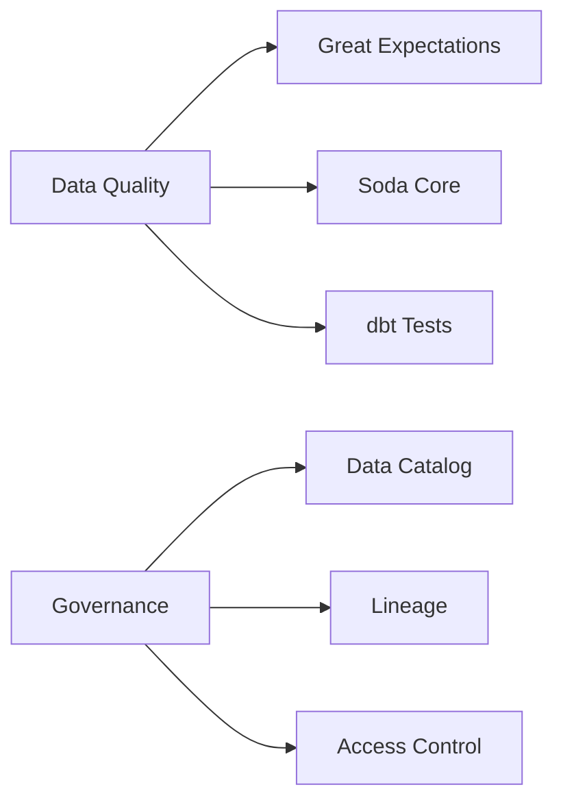

**Files:**
- [10_Data_Quality_Tools_Guide](tools/10_Data_Quality_Tools_Guide.md)
- [11_Data_Catalogs_Guide](tools/11_Data_Catalogs_Guide.md)
- [09_Security_Governance](fundamentals/09_Security_Governance.md)
- [07_Data_Quality_Governance_Papers](papers/07_Data_Quality_Governance_Papers.md)

### Q3: ML Pipelines

**Files:**
- [05_ML_Pipeline](projects/05_ML_Pipeline.md)
- [08_ML_Data_Papers](papers/08_ML_Data_Papers.md)

**Key concepts:**
- Feature stores
- MLflow / Kubeflow
- Model versioning
- Training pipelines

### Q4: Leadership

**Files:**
- [04_Career_Growth](mindset/04_Career_Growth.md)
- [01_Career_Levels](roadmap/01_Career_Levels.md)
- [02_Skills_Matrix](roadmap/02_Skills_Matrix.md)

**Activities:**
- Mentoring juniors
- Leading design reviews
- Cross-team collaboration

**Deliverables:**
- [ ] Design 5+ systems
- [ ] Lead 1 project
- [ ] Mentor 2+ juniors
- [ ] **Ready for Senior DE role**

---

# 📅 YEAR 4: Staff Engineer

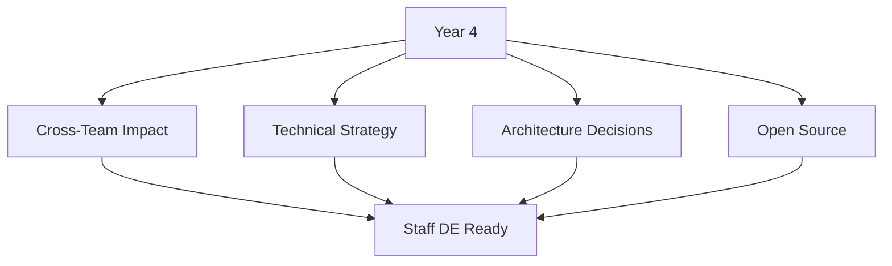

**Focus:** Org-wide impact, technical strategy

**Files:**
- All papers/ for deep knowledge (10 files)
- All usecases/ for patterns (12 files)
- [01_Design_Patterns](mindset/01_Design_Patterns.md)
- [02_Architectural_Thinking](mindset/02_Architectural_Thinking.md)

**Activities:**
- Cross-team projects
- Technical standards
- Architecture decisions (ADRs)
- Open source contributions

**Reading List:**
- Remaining papers not yet covered
- Staff Engineer book (Will Larson)
- System Design Interview Vol 2

---

# 🎤 INTERVIEW PREP

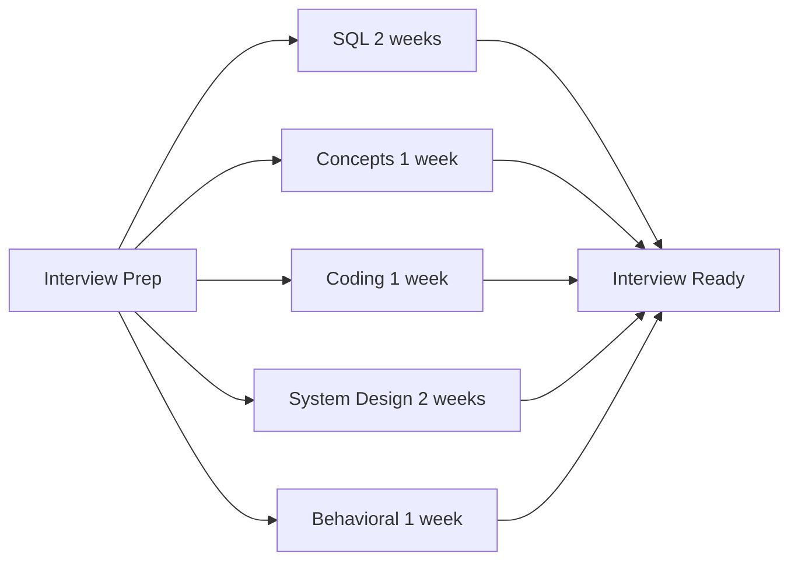

**Khi nào bắt đầu prep?** 3 tháng trước target date

**Files theo thứ tự:**

| Order | File | Time | Focus | Priority |
|-------|------|------|-------|----------|
| 1 | [02_SQL_Deep_Dive](interview/02_SQL_Deep_Dive.md) | 2 weeks | Window functions, patterns | ⭐⭐⭐ |
| 2 | [01_Common_Interview_Questions](interview/01_Common_Interview_Questions.md) | 1 week | Concepts | ⭐⭐⭐ |
| 3 | [05_Coding_Test_DE](interview/05_Coding_Test_DE.md) | 1 week | Python | ⭐⭐ |
| 4 | [03_System_Design](interview/03_System_Design.md) | 2 weeks | Architecture | ⭐⭐⭐ |
| 5 | [04_Behavioral_Questions](interview/04_Behavioral_Questions.md) | 1 week | STAR stories | ⭐⭐ |

**Additional prep resources:**
- [05_Job_Search_Strategy](roadmap/05_Job_Search_Strategy.md) - Resume, networking
- [04_Certification_Guide](roadmap/04_Certification_Guide.md) - Optional certs

---

# 📈 PROGRESS TRACKING

## Year 1 Checklist

**Q1: SQL + Python + Git**
- [ ] [02_SQL_Mastery_Guide](fundamentals/02_SQL_Mastery_Guide.md)
- [ ] [13_Python_Data_Engineering](fundamentals/13_Python_Data_Engineering.md)
- [ ] [14_Git_Version_Control](fundamentals/14_Git_Version_Control.md)
- [ ] [16_DE_Environment_Setup](fundamentals/16_DE_Environment_Setup.md)

**Q2: Modeling + Storage**
- [ ] [01_Data_Modeling_Fundamentals](fundamentals/01_Data_Modeling_Fundamentals.md)
- [ ] [03_Data_Warehousing_Concepts](fundamentals/03_Data_Warehousing_Concepts.md)
- [ ] [06_Data_Formats_Storage](fundamentals/06_Data_Formats_Storage.md)
- [ ] [01_ETL_Pipeline](projects/01_ETL_Pipeline.md) project

**Q3: Modern Tools**
- [ ] [12_Polars_Complete_Guide](tools/12_Polars_Complete_Guide.md)
- [ ] [13_DuckDB_Complete_Guide](tools/13_DuckDB_Complete_Guide.md)

**Q4: Orchestration + Cloud**
- [ ] [08_Apache_Airflow_Complete_Guide](tools/08_Apache_Airflow_Complete_Guide.md)
- [ ] [07_dbt_Complete_Guide](tools/07_dbt_Complete_Guide.md)
- [ ] [03_Data_Warehouse](projects/03_Data_Warehouse.md) capstone

---

## Year 2 Checklist

**Q1: Spark**
- [ ] [06_Apache_Spark_Complete_Guide](tools/06_Apache_Spark_Complete_Guide.md)
- [ ] [05_Distributed_Systems_Fundamentals](fundamentals/05_Distributed_Systems_Fundamentals.md)

**Q2: Streaming**
- [ ] [05_Apache_Kafka_Complete_Guide](tools/05_Apache_Kafka_Complete_Guide.md)
- [ ] [07_Batch_vs_Streaming](fundamentals/07_Batch_vs_Streaming.md)

**Q3: Table Formats**
- [ ] [01_Apache_Iceberg_Complete_Guide](tools/01_Apache_Iceberg_Complete_Guide.md)
- [ ] [02_Delta_Lake_Complete_Guide](tools/02_Delta_Lake_Complete_Guide.md)

**Q4: Cloud + Cert**
- [ ] Platform deep dive
- [ ] [04_Certification_Guide](roadmap/04_Certification_Guide.md)

---

## Year 3+ Checklist

- [ ] [03_System_Design](interview/03_System_Design.md)
- [ ] [10_Data_Quality_Tools_Guide](tools/10_Data_Quality_Tools_Guide.md)
- [ ] [04_Career_Growth](mindset/04_Career_Growth.md)
- [ ] All usecases/ files for patterns
- [ ] All papers/ files for deep knowledge

---

# 📚 RECOMMENDED READING ORDER

| Year | Book | Why Now |
|------|------|---------|
| 1 | Data Warehouse Toolkit (Ch 1-4) | Modeling foundation |
| 2 | DDIA (Part 1) | Distributed concepts |
| 2 | Fundamentals of DE | Modern practices |
| 3 | DDIA (Part 2) | Deep architecture |
| 4 | Staff Engineer | Career growth |

**Reference:** [03_Learning_Resources](roadmap/03_Learning_Resources.md)

---

# 🔑 TÓM TẮT

**Key Principles:**
1. Fundamentals first, tools second
2. Projects > tutorials
3. Depth > breadth
4. 1 tool per category, master it

**Success Metrics:**
- Year 1: Junior DE ready, 2 projects
- Year 2: Mid-level, 1 certification
- Year 3: Senior, lead projects
- Year 4: Staff, org-wide impact

**This roadmap uses 93 files across 9 folders.**
**Follow the order, don't skip fundamentals.**
**Build projects at every stage.**

---

# 🔧 SQL PATTERNS PHẢI BIẾT

> Từ kinh nghiệm phỏng vấn 100+ candidates, đây là những patterns nhiều người thiếu

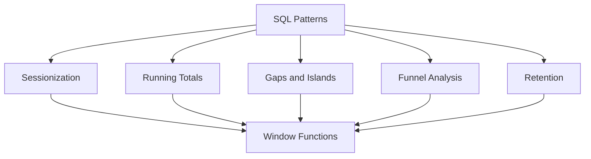

**Reference:** [02_SQL_Deep_Dive](interview/02_SQL_Deep_Dive.md) | [02_SQL_Mastery_Guide](fundamentals/02_SQL_Mastery_Guide.md)

## Pattern 1: Sessionization

**Scenario thực tế:** User X vào website, browse 5 trang, nghỉ 2 tiếng, quay lại browse 3 trang. Đó là 2 sessions.

**Tại sao DE cần biết?**
- Analytics: Tính session duration, pages per session
- Marketing: Attribution modeling
- Product: User behavior analysis

**Giải pháp:**

```sql
-- Step 1: Identify when a new session starts
-- "30 phút không hoạt động = session mới"
WITH session_markers AS (
    SELECT 
        user_id,
        event_time,
        event_type,
        -- So sánh với event trước đó
        LAG(event_time) OVER (
            PARTITION BY user_id 
            ORDER BY event_time
        ) as prev_event_time,
        -- Nếu gap > 30 min, đây là session mới
        CASE 
            WHEN event_time - LAG(event_time) OVER (
                PARTITION BY user_id ORDER BY event_time
            ) > INTERVAL '30 minutes'
            OR LAG(event_time) OVER (
                PARTITION BY user_id ORDER BY event_time
            ) IS NULL  -- First event
            THEN 1 
            ELSE 0 
        END as is_new_session
    FROM user_events
),

-- Step 2: Assign session IDs
sessions AS (
    SELECT 
        *,
        -- Running sum của new session markers = session ID
        SUM(is_new_session) OVER (
            PARTITION BY user_id 
            ORDER BY event_time
        ) as session_id
    FROM session_markers
)

-- Step 3: Calculate metrics
SELECT 
    user_id,
    session_id,
    MIN(event_time) as session_start,
    MAX(event_time) as session_end,
    COUNT(*) as events_count,
    MAX(event_time) - MIN(event_time) as session_duration
FROM sessions
GROUP BY user_id, session_id;
```

**Tại sao approach này?**
1. LAG() để access row trước
2. CASE để mark session boundaries
3. SUM() OVER để running total → session ID
4. Final GROUP BY để aggregate

**Practice file:** [02_SQL_Deep_Dive](interview/02_SQL_Deep_Dive.md)

---

## Pattern 2: Running Totals và Moving Averages

**Scenario:** Finance team cần biết cumulative revenue và 7-day moving average

```sql
SELECT 
    order_date,
    daily_revenue,
    
    -- Cumulative (running) total
    SUM(daily_revenue) OVER (
        ORDER BY order_date
        ROWS BETWEEN UNBOUNDED PRECEDING AND CURRENT ROW
    ) as cumulative_revenue,
    
    -- 7-day moving average
    AVG(daily_revenue) OVER (
        ORDER BY order_date
        ROWS BETWEEN 6 PRECEDING AND CURRENT ROW
    ) as moving_avg_7d,
    
    -- Week-over-week comparison
    daily_revenue - LAG(daily_revenue, 7) OVER (
        ORDER BY order_date
    ) as wow_change

FROM daily_revenue_summary
ORDER BY order_date;
```

**ROWS vs RANGE:**
- ROWS BETWEEN: Count rows literally (what you usually want)
- RANGE BETWEEN: Group by values (tricky with dates)

**Practice:** Tính 30-day rolling active users

---

## Pattern 3: Gaps and Islands

**Scenario:** Tìm user có login streak >= 3 ngày liên tiếp

**Insight quan trọng:** Date liên tiếp - row_number liên tiếp = constant

```sql
-- If dates are: 2024-01-01, 2024-01-02, 2024-01-03
-- Row numbers: 1, 2, 3
-- Date - row_num: 2024-01-00, 2024-01-00, 2024-01-00
-- Same value = same streak!

WITH user_streaks AS (
    SELECT 
        user_id,
        login_date,
        -- This creates a "group identifier" for consecutive dates
        login_date - (ROW_NUMBER() OVER (
            PARTITION BY user_id 
            ORDER BY login_date
        ) * INTERVAL '1 day') as streak_group
    FROM daily_logins
)

SELECT 
    user_id,
    MIN(login_date) as streak_start,
    MAX(login_date) as streak_end,
    COUNT(*) as streak_length
FROM user_streaks
GROUP BY user_id, streak_group
HAVING COUNT(*) >= 3
ORDER BY streak_length DESC;
```

**Tại sao pattern này powerful?**
- Không cần self-join (expensive)
- Single pass through data
- Works for any "consecutive" pattern

---

## Pattern 4: Funnel Analysis

**Scenario:** E-commerce funnel: View → Add to Cart → Checkout → Purchase

```sql
WITH user_funnel AS (
    SELECT 
        user_id,
        MAX(CASE WHEN event_type = 'page_view' THEN 1 ELSE 0 END) as viewed,
        MAX(CASE WHEN event_type = 'add_to_cart' THEN 1 ELSE 0 END) as added_to_cart,
        MAX(CASE WHEN event_type = 'checkout' THEN 1 ELSE 0 END) as checked_out,
        MAX(CASE WHEN event_type = 'purchase' THEN 1 ELSE 0 END) as purchased
    FROM events
    WHERE event_date = '2024-01-15'
    GROUP BY user_id
)

SELECT 
    SUM(viewed) as step_1_views,
    SUM(added_to_cart) as step_2_cart,
    SUM(checked_out) as step_3_checkout,
    SUM(purchased) as step_4_purchase,
    
    -- Conversion rates
    ROUND(100.0 * SUM(added_to_cart) / NULLIF(SUM(viewed), 0), 2) as view_to_cart_pct,
    ROUND(100.0 * SUM(checked_out) / NULLIF(SUM(added_to_cart), 0), 2) as cart_to_checkout_pct,
    ROUND(100.0 * SUM(purchased) / NULLIF(SUM(checked_out), 0), 2) as checkout_to_purchase_pct
FROM user_funnel;
```

**Tại sao MAX() không phải COUNT()?**
- MAX() trả về 1 nếu user có event đó
- Avoid double-counting nếu user add to cart 2 lần

---

## Pattern 5: Retention Analysis

**Scenario:** DAU, WAU, MAU và retention cohorts

```sql
-- Weekly retention: Of users who signed up week N, 
-- how many came back week N+1, N+2, etc?

WITH user_cohorts AS (
    SELECT 
        user_id,
        DATE_TRUNC('week', first_login) as cohort_week
    FROM users
),

weekly_activity AS (
    SELECT 
        user_id,
        DATE_TRUNC('week', activity_date) as activity_week
    FROM user_activity
    GROUP BY 1, 2
)

SELECT 
    c.cohort_week,
    COUNT(DISTINCT c.user_id) as cohort_size,
    COUNT(DISTINCT CASE 
        WHEN a.activity_week = c.cohort_week 
        THEN c.user_id 
    END) as week_0,
    COUNT(DISTINCT CASE 
        WHEN a.activity_week = c.cohort_week + INTERVAL '1 week' 
        THEN c.user_id 
    END) as week_1,
    COUNT(DISTINCT CASE 
        WHEN a.activity_week = c.cohort_week + INTERVAL '2 weeks' 
        THEN c.user_id 
    END) as week_2
    -- Add more weeks as needed
FROM user_cohorts c
LEFT JOIN weekly_activity a ON c.user_id = a.user_id
GROUP BY c.cohort_week
ORDER BY c.cohort_week;
```

---

# 🏗️ SYSTEM DESIGN FRAMEWORK

> Từ kinh nghiệm phỏng vấn Senior DE positions

## 5-Step Approach (40 phút interview)

### Step 1: Requirements (5 phút)

**Functional Requirements:**
- What data sources?
- What outputs/consumers?
- What transformations needed?

**Non-Functional Requirements:**
- Latency: Real-time (seconds) or batch (daily)?
- Throughput: Events/second? Data volume/day?
- Availability: 99.9%? 99.99%?

**Questions to ask:**
- "Is 5-minute latency acceptable or does it need to be real-time?"
- "How much data are we expecting? GBs or TBs per day?"
- "What happens if the pipeline fails? Need exactly-once?"

### Step 2: Estimation (5 phút)

**Template:**
```
Data Volume:
- 100M events/day
- Average event size: 1KB
- Daily data: 100GB
- Storage for 2 years: ~70TB

Throughput:
- 100M / 86400 = ~1200 events/second
- Peak 3x average = ~3600 QPS

Storage:
- Raw: 70TB
- Processed: ~20TB (compression)
- Total with replication: ~150TB
```

### Step 3: High-Level Design (10 phút)

**Draw the pipeline:**
```
Sources → Ingestion → Processing → Storage → Serving
```

**For each component, name specific technologies:**
- Ingestion: Kafka, Kinesis, Pub/Sub
- Processing: Spark, Flink, Beam
- Storage: S3/GCS + Iceberg/Delta
- Serving: Trino, Snowflake, BI tools

### Step 4: Deep Dive (15 phút)

**Pick 1-2 interesting components to detail:**

Example: Kafka partition strategy
- Why partition by user_id? Ordering within user
- How many partitions? Based on consumer count
- Retention? 7 days for replay

Example: Spark optimization
- Partition columns? date, region
- Broadcast joins for dimension tables
- Avoid shuffle? Pre-partition data

### Step 5: Operations (5 phút)

**What can go wrong and how to handle:**
- Data quality: Great Expectations, dbt tests
- Monitoring: Prometheus, Datadog
- Alerting: On-call rotation
- Disaster recovery: Multi-region, backups

---

## Example Design: Real-time Analytics Dashboard

**Requirements gathered:**
- 10M events/day from web + mobile
- Dashboard updates every 5 seconds
- 2 years historical data
- 99.9% availability

**High-level design:**
```
Web/Mobile Events
    ↓
Kafka (event streaming)
    ↓
┌─────────────────────────────┐
│ Flink (real-time aggregation)│
└─────────────────────────────┘
    ↓
Druid (real-time OLAP)
    ↓
Real-time Dashboard

--- Historical path ---
Kafka → Spark (hourly batch) → Iceberg → Trino → BI Dashboard
```

**Components rationale:**

| Component | Why this choice? | Alternative |
|-----------|------------------|-------------|
| Kafka | Proven, LinkedIn scale | Kinesis, Pub/Sub |
| Flink | True streaming, low latency | Spark Streaming |
| Druid | Real-time OLAP, sub-second queries | ClickHouse, Pinot |
| Iceberg | ACID, time travel, schema evolution | Delta Lake |
| Trino | Federation, query Iceberg directly | Snowflake |

**Trade-offs discussed:**
- Flink vs Spark Streaming: Flink lower latency, Spark unified batch/stream
- Druid vs ClickHouse: Druid more mature, ClickHouse faster ingestion
- Two paths (real-time + batch): Lambda architecture, more complex but reliable

**Reference files:**
- [05_Apache_Kafka_Complete_Guide](tools/05_Apache_Kafka_Complete_Guide.md)
- [04_Apache_Flink_Complete_Guide](tools/04_Apache_Flink_Complete_Guide.md)
- [01_Apache_Iceberg_Complete_Guide](tools/01_Apache_Iceberg_Complete_Guide.md)

---

# 🔨 PROJECT TEMPLATES CHI TIẾT

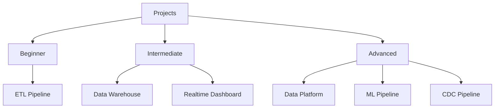

**All projects:** [projects/](projects/)

## Beginner Project: ETL Pipeline

**Reference:** [01_ETL_Pipeline](projects/01_ETL_Pipeline.md)

**Mục tiêu:** Build pipeline từ A-Z, có portfolio piece

### Project Structure

```
project/
├── src/
│   ├── extract/
│   │   └── api_client.py       # Fetch từ API
│   ├── transform/
│   │   └── clean.py            # Polars transforms
│   └── load/
│       └── database.py         # Load to DuckDB
├── tests/
│   └── test_transform.py       # Unit tests
├── docker-compose.yml          # Local environment
├── requirements.txt
└── README.md                   # Documentation
```

### Week-by-Week Plan

**Week 1: Setup**
- Docker environment
- Project structure
- API discovery
- Reference: [16_DE_Environment_Setup](fundamentals/16_DE_Environment_Setup.md)

**Week 2: Extract**
- API client với retry logic
- Error handling
- Save raw data to JSON
- Reference: [08_Data_Integration_APIs](fundamentals/08_Data_Integration_APIs.md)

**Week 3: Transform**
- Polars cleaning
- Business logic
- Save as Parquet
- Reference: [12_Polars_Complete_Guide](tools/12_Polars_Complete_Guide.md)

**Week 4: Load + Dashboard**
- Load to DuckDB
- Streamlit dashboard
- Documentation
- Reference: [13_DuckDB_Complete_Guide](tools/13_DuckDB_Complete_Guide.md)

### Code Example: API Client with Retry

```python
# src/extract/api_client.py
import httpx
from tenacity import retry, stop_after_attempt, wait_exponential
import logging

logger = logging.getLogger(__name__)

class APIClient:
    def __init__(self, base_url: str, api_key: str):
        self.base_url = base_url
        self.headers = {"Authorization": f"Bearer {api_key}"}
    
    @retry(
        stop=stop_after_attempt(3),
        wait=wait_exponential(multiplier=1, min=2, max=10)
    )
    def fetch(self, endpoint: str, params: dict = None) -> dict:
        """Fetch data với retry logic"""
        url = f"{self.base_url}/{endpoint}"
        logger.info(f"Fetching {url}")
        
        try:
            response = httpx.get(url, headers=self.headers, params=params)
            response.raise_for_status()
            return response.json()
        except httpx.HTTPError as e:
            logger.error(f"HTTP error: {e}")
            raise
```

**Tại sao cần retry logic?**
- APIs fail tạm thời (network, rate limits)
- Retry tự động = pipeline resilient
- Exponential backoff = không overwhelm server

---

## Intermediate Project: Data Warehouse

**Reference:** [03_Data_Warehouse](projects/03_Data_Warehouse.md)

### Architecture

```
Multiple Sources
    ↓
Airbyte (ingestion)
    ↓
Cloud Storage (raw)
    ↓
Airflow (orchestration)
    ↓
dbt (transformation)
    ↓
Data Warehouse (BigQuery/Snowflake)
    ↓
BI Dashboard (Metabase/Looker)
```

### dbt Project Structure

```
dbt_project/
├── models/
│   ├── staging/           # Source cleaning
│   │   ├── stg_orders.sql
│   │   └── stg_customers.sql
│   ├── intermediate/      # Business logic
│   │   └── int_order_items.sql
│   └── marts/             # Final tables
│       ├── fct_orders.sql
│       └── dim_customers.sql
├── tests/
│   └── generic/
│       └── custom_tests.sql
├── macros/
│   └── date_spine.sql
└── dbt_project.yml
```

### Staging Model Example

```sql
-- models/staging/stg_orders.sql

{{
    config(
        materialized='view',
        schema='staging'
    )
}}

WITH source AS (
    SELECT * FROM {{ source('raw', 'orders') }}
),

renamed AS (
    SELECT
        -- Keys
        order_id,
        customer_id,
        
        -- Timestamps (standardize timezone)
        TIMESTAMP(created_at, 'UTC') as order_created_at,
        
        -- Status (clean up values)
        LOWER(TRIM(status)) as order_status,
        
        -- Amounts (convert cents to dollars)
        total_cents / 100.0 as total_amount,
        
        -- Metadata
        CURRENT_TIMESTAMP() as _loaded_at
    FROM source
    WHERE order_id IS NOT NULL  -- Basic data quality
)

SELECT * FROM renamed
```

**Tại sao staging layer?**
- Clean raw data một lần, dùng nhiều nơi
- Isolate source changes
- Consistent naming convention

### Incremental Model Example

```sql
-- models/marts/fct_orders.sql

{{
    config(
        materialized='incremental',
        unique_key='order_id',
        partition_by={
            'field': 'order_date',
            'data_type': 'date',
            'granularity': 'day'
        }
    )
}}

WITH orders AS (
    SELECT * FROM {{ ref('stg_orders') }}
    
    -- Only process new/updated records
    WHERE order_created_at > (SELECT MAX(order_created_at) FROM {{ this }})
    
),

customers AS (
    SELECT * FROM {{ ref('dim_customers') }}
),

final AS (
    SELECT
        o.order_id,
        o.order_created_at,
        DATE(o.order_created_at) as order_date,
        o.customer_id,
        c.customer_segment,
        c.acquisition_channel,
        o.order_status,
        o.total_amount,
        o._loaded_at
    FROM orders o
    LEFT JOIN customers c ON o.customer_id = c.customer_id
)

SELECT * FROM final
```

**Tại sao incremental?**
- Full refresh tốn thời gian, tiền
- Incremental = chỉ process data mới
- unique_key = handle updates correctly

**Reference files:**
- [07_dbt_Complete_Guide](tools/07_dbt_Complete_Guide.md)
- [08_Apache_Airflow_Complete_Guide](tools/08_Apache_Airflow_Complete_Guide.md)

---

## Advanced Project: Real-time Platform

**Reference:** [04_Data_Platform](projects/04_Data_Platform.md)

### Architecture

```
Event Generator (Python)
    ↓
Kafka (event streaming)
    ↓
┌────────────────────────────┐
│ Flink (stream processing)  │
│ - Aggregations             │
│ - Windowing                │
│ - State management         │
└────────────────────────────┘
    ↓
┌────────────────────────────┐
│ Dual write:                │
│ - Druid (real-time OLAP)   │
│ - Iceberg (historical)     │
└────────────────────────────┘
    ↓
Grafana Dashboard (real-time)
REST API (historical queries)
```

### Kafka Producer Example

```python
# producer.py
from confluent_kafka import Producer
import json
import time
from datetime import datetime

config = {
    'bootstrap.servers': 'localhost:9092',
    'client.id': 'event-producer'
}

producer = Producer(config)

def delivery_report(err, msg):
    if err is not None:
        print(f'Delivery failed: {err}')
    else:
        print(f'Message delivered to {msg.topic()} [{msg.partition()}]')

def generate_event(user_id: int) -> dict:
    return {
        'user_id': user_id,
        'event_type': 'page_view',
        'timestamp': datetime.utcnow().isoformat(),
        'page': '/products',
        'session_id': f'session_{user_id}_{int(time.time())}'
    }

# Produce messages
for i in range(1000):
    event = generate_event(user_id=i % 100)
    
    producer.produce(
        topic='user-events',
        key=str(event['user_id']),  # Partition by user_id
        value=json.dumps(event),
        callback=delivery_report
    )
    
    # Flush every 100 messages
    if i % 100 == 0:
        producer.flush()

producer.flush()
```

**Tại sao partition by user_id?**
- Same user's events go to same partition
- Ordering guaranteed within partition
- Consumer can process user events in order

**Reference files:**
- [05_Apache_Kafka_Complete_Guide](tools/05_Apache_Kafka_Complete_Guide.md)
- [04_Apache_Flink_Complete_Guide](tools/04_Apache_Flink_Complete_Guide.md)
- [01_Apache_Iceberg_Complete_Guide](tools/01_Apache_Iceberg_Complete_Guide.md)

---

# 🔧 TROUBLESHOOTING GUIDE

> Các lỗi tôi thấy nhiều nhất ở DE juniors

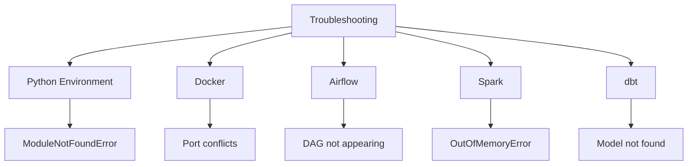

**Reference:** [03_Problem_Solving](mindset/03_Problem_Solving.md) | [16_DE_Environment_Setup](fundamentals/16_DE_Environment_Setup.md)

## Python Environment

| Problem | Symptoms | Solution |
|---------|----------|----------|
| ModuleNotFoundError | Import fails | Check venv activated: `which python` |
| Version conflicts | pip fails | Use uv: `uv sync` |
| "Works on my machine" | Colleague can't run | Use Docker |

**Best practice:** Luôn dùng virtual environment, never global Python

## Docker

| Problem | Symptoms | Solution |
|---------|----------|----------|
| Container exits immediately | Logs show error | `docker logs container_name` |
| Port already in use | Can't start | `lsof -i :8080` + kill process |
| Out of disk space | Build fails | `docker system prune -a` |

**Reference:** [16_DE_Environment_Setup](fundamentals/16_DE_Environment_Setup.md)

## Airflow

| Problem | Symptoms | Solution |
|---------|----------|----------|
| DAG not appearing | Not in UI | Check import errors: `airflow dags list-import-errors` |
| Task stuck in queued | No progress | Check executor, resources |
| Task failed | Red in UI | Click task → View Logs |

**Common mistake:** Forgot to import DAG hoặc syntax error trong file

**Reference:** [08_Apache_Airflow_Complete_Guide](tools/08_Apache_Airflow_Complete_Guide.md)

## Spark

| Problem | Symptoms | Solution |
|---------|----------|----------|
| OutOfMemoryError | Driver/Executor crash | Increase memory, check data skew |
| Job runs forever | Stage 0% | Check Spark UI for shuffle issues |
| Wrong results | Data doesn't match | Check null handling, partition logic |

**Debugging approach:**
1. Spark UI → Stages → Find slowest stage
2. Check shuffle read/write
3. Look for data skew (1 task takes 10 giờ, others 1 phút)

**Reference:** [06_Apache_Spark_Complete_Guide](tools/06_Apache_Spark_Complete_Guide.md)

## dbt

| Problem | Symptoms | Solution |
|---------|----------|----------|
| Model not found | ref() error | Check file location, dbt_project.yml |
| Test failed | dbt test error | Query warehouse directly to debug |
| Slow model | Takes hours | Consider incremental, partitioning |

**Reference:** [07_dbt_Complete_Guide](tools/07_dbt_Complete_Guide.md)

---

# 🏢 REAL-WORLD CASE STUDIES

> Học từ các companies đã scale

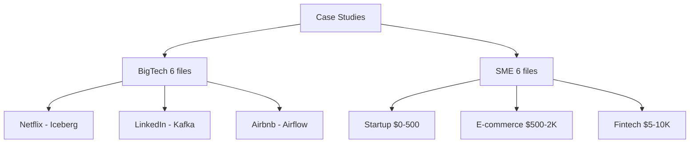

## BigTech: What They Created

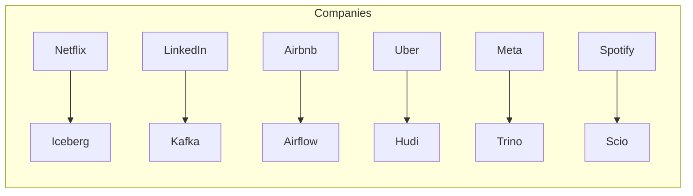

| Company | Created | Why Study? | File |
|---------|---------|------------|------|
| Netflix | Iceberg | Table format leader, 100PB+ | [01_Netflix](usecases/01_Netflix_Data_Platform.md) |
| LinkedIn | Kafka | Event streaming pioneer | [04_LinkedIn](usecases/04_LinkedIn_Data_Platform.md) |
| Airbnb | Airflow | Orchestration standard | [03_Airbnb](usecases/03_Airbnb_Data_Platform.md) |
| Uber | Hudi | Incremental processing | [02_Uber](usecases/02_Uber_Data_Platform.md) |
| Meta | Presto/Trino | Query federation | [06_Meta](usecases/06_Meta_Data_Platform.md) |
| Spotify | Scio/Beam | GCP native processing | [05_Spotify](usecases/05_Spotify_Data_Platform.md) |

**Khi nào đọc?** Sau khi học tool tương ứng để có context

## SME: Realistic Budgets

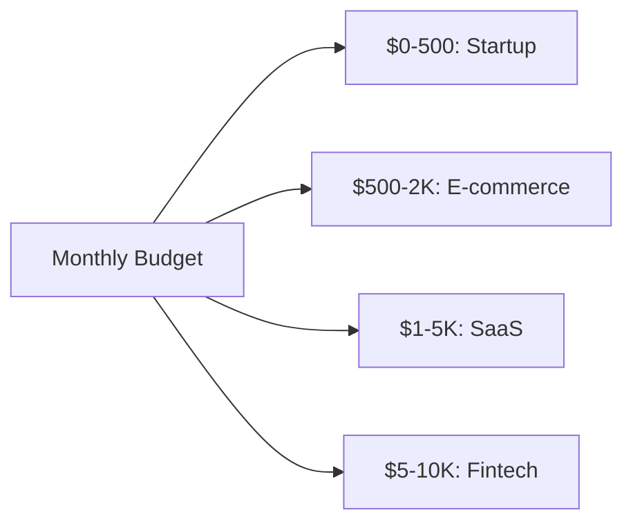

| Type | Monthly Budget | Stack | File |
|------|----------------|-------|------|
| Startup | $0-500 | Postgres + dbt + Metabase | [07_Startup](usecases/07_Startup_Data_Platform.md) |
| E-commerce | $500-2K | Airbyte + BigQuery + dbt | [08_Ecommerce](usecases/08_Ecommerce_SME_Platform.md) |
| SaaS | $1-5K | Fivetran + Snowflake + Looker | [09_SaaS](usecases/09_SaaS_Company_Platform.md) |
| Fintech | $5-10K | Kafka + Spark + Delta | [10_Fintech](usecases/10_Fintech_SME_Platform.md) |
| Healthcare | $3-8K | HIPAA-compliant stack | [11_Healthcare](usecases/11_Healthcare_SME_Platform.md) |
| Manufacturing | $2-5K | IoT + Time-series | [12_Manufacturing](usecases/12_Manufacturing_SME_Platform.md) |

**Tại sao học SME cases?**
- Phần lớn jobs ở SME, không phải FAANG
- Budget constraints = creative solutions
- More realistic cho early career

---

# 📖 GLOSSARY

> Terms bạn sẽ gặp thường xuyên

| Term | Meaning | Context |
|------|---------|---------|
| **ACID** | Atomicity, Consistency, Isolation, Durability | Database transactions |
| **CAP Theorem** | Consistency, Availability, Partition tolerance - pick 2 | Distributed systems |
| **CDC** | Change Data Capture | Capture database changes |
| **DAG** | Directed Acyclic Graph | Airflow, dbt deps |
| **ELT** | Extract, Load, Transform | Modern approach (transform in warehouse) |
| **ETL** | Extract, Transform, Load | Traditional approach |
| **Grain** | Level of detail in a fact table | "Daily" vs "Hourly" grain |
| **Idempotent** | Can run multiple times, same result | Safe to retry |
| **Lakehouse** | Data lake + warehouse features | Iceberg, Delta Lake |
| **Medallion** | Bronze/Silver/Gold layers | Data quality progression |
| **OLAP** | Online Analytical Processing | Analytics queries |
| **OLTP** | Online Transaction Processing | Application databases |
| **Partition** | Divide data into subsets | Performance, organization |
| **SCD** | Slowly Changing Dimension | Track historical changes |
| **Schema Evolution** | Modify schema without breaking | Table formats |
| **Time Travel** | Query historical data versions | Iceberg, Delta |
| **Watermark** | Track event time progress | Streaming late data |

**Reference files for deep dives:**
- [03_Data_Warehousing_Concepts](fundamentals/03_Data_Warehousing_Concepts.md)
- [05_Distributed_Systems_Fundamentals](fundamentals/05_Distributed_Systems_Fundamentals.md)
- [07_Batch_vs_Streaming](fundamentals/07_Batch_vs_Streaming.md)

---

# 📚 PAPERS READING GUIDE

> Khi nào đọc papers và đọc gì

```mermaid
flowchart LR
    Papers[Papers 10 files]
    Papers --> Y12[Year 1-2: Foundation]
    Papers --> Y23[Year 2-3: Modern]
    Papers --> Y34[Year 3-4: Advanced]
    
    Y12 --> GFS[GFS, MapReduce]
    Y23 --> Ice[Iceberg, Delta]
    Y34 --> Raft[Raft, LSM-Tree]
```

**All papers:** [papers/](papers/)

## Year 1-2: Foundational Papers

| Paper | Topic | File | Tại sao? |
|-------|-------|------|----------|
| GFS | Distributed storage | [01_Distributed_Systems](papers/01_Distributed_Systems_Papers.md) | Understand S3 origins |
| MapReduce | Distributed processing | Same | Spark's predecessor |
| Kafka | Event streaming | [02_Stream_Processing](papers/02_Stream_Processing_Papers.md) | Still relevant |

## Year 2-3: Modern Papers

| Paper | Topic | File | Tại sao? |
|-------|-------|------|----------|
| Iceberg | Table format | [04_Table_Format](papers/04_Table_Format_Papers.md) | Current trend |
| Delta Lake | ACID on lakes | Same | Databricks ecosystem |
| Dremel | Columnar processing | [03_Data_Warehouse](papers/03_Data_Warehouse_Papers.md) | BigQuery origins |

## Year 3-4: Advanced Papers

| Paper | Topic | File | Tại sao? |
|-------|-------|------|----------|
| Raft | Consensus | [05_Consensus](papers/05_Consensus_Papers.md) | Distributed systems |
| LSM-Tree | Storage engine | [06_Database_Internals](papers/06_Database_Internals_Papers.md) | RocksDB, LevelDB |
| Calcite | Query optimization | [09_Query_Optimization](papers/09_Query_Optimization_Papers.md) | SQL engines |

---

# 🎯 FINAL THOUGHTS

## Những Điều Tôi Ước Biết Sớm Hơn

1. **Fundamentals > Tools**: Tools thay đổi, SQL + distributed thinking thì không

2. **Projects make you learn**: Tutorial là ảo tưởng, project là thực tế

3. **Production experience > Side projects**: Nếu có thể, intern/work sớm

4. **Community matters**: Join Discord, Twitter, meetups

5. **Document your journey**: Blog, GitHub repos, LinkedIn posts

## Resources Beyond This Repo

| Type | Where | What |
|------|-------|------|
| Books | [03_Learning_Resources](roadmap/03_Learning_Resources.md) | DDIA, Kimball |
| Courses | Same | Zach Wilson, DataExpert.io |
| Podcasts | Same | Data Engineering Podcast |
| News | LinkedIn, Twitter | Follow data engineers |

## Success Metrics Summary

| Year | Target | Evidence |
|------|--------|----------|
| 1 | Junior ready | 2 projects, fundamentals solid |
| 2 | Mid-level | Spark project, streaming, 1 cert |
| 3 | Senior | Lead project, mentor juniors |
| 4 | Staff | Org-wide impact, strategy |

---

**Remember:**
- This is a marathon, not a sprint
- Build in public, share your progress
- Help others when you can
- Stay curious, keep learning

---

# 🎤 BEHAVIORAL INTERVIEW GUIDE

> Kỹ năng nhiều people skip nhưng rất quan trọng cho Senior+

## STAR Method

| Component | Description | Time |
|-----------|-------------|------|
| **S**ituation | Context, background | 2-3 sentences |
| **T**ask | Your responsibility | 1-2 sentences |
| **A**ction | What YOU did (key part) | 3-5 sentences |
| **R**esult | Outcome, metrics | 2-3 sentences |

## 7 Stories to Prepare

| # | Category | Example Situation |
|---|----------|-------------------|
| 1 | Technical challenge | Optimized slow pipeline |
| 2 | Cross-team collaboration | Worked với ML team |
| 3 | Conflict resolution | Disagreed với architect |
| 4 | Leadership | Led migration project |
| 5 | Failure and learning | Pipeline bug in prod |
| 6 | Under pressure | On-call incident |
| 7 | Initiative | Proposed new tool |

## Example Story: Technical Challenge

```markdown
## Story: Optimized ETL Pipeline 10x

**Situation**
Daily ETL pipeline was taking 6 hours to complete.
This was missing our 6 AM SLA, and analytics users 
complained about stale data every morning.

**Task**
I was asked to investigate the root cause and 
optimize the pipeline to complete within 1 hour.

**Action**
1. First, I profiled the pipeline using Spark UI
   and identified that 70% of time was spent in
   a single Spark job doing customer aggregation.
   
2. Analyzed the shuffle metrics and found severe
   data skew - one customer_id had 10M records
   while average was 1K records.
   
3. Implemented salting technique: appended random
   suffix to skewed keys, processed, then re-aggregated.
   
4. Also added broadcast hint for small dimension
   table (1GB) that was being shuffled unnecessarily.

**Result**
- Pipeline runtime reduced from 6 hours to 35 minutes
- SLA compliance improved from 60% to 99%
- The salting approach was adopted by 3 other teams
- Documented the pattern in our internal wiki
```

**Tại sao story này effective?**
- Quantifiable results (6h → 35m, 60% → 99%)
- Shows debugging skills (profiling, analysis)
- Demonstrates technical depth (salting, broadcast)
- Impact beyond immediate task (3 other teams)

**Reference:** [04_Behavioral_Questions](interview/04_Behavioral_Questions.md)

---

## Common Behavioral Questions

### "Tell me about a time you disagreed with a decision"

**Good structure:**
1. What was the disagreement? (Technical choice, prioritization?)
2. How did you express your concern? (Data-driven, not emotional)
3. What was the outcome? (Even if you didn't "win", show growth)

**Key signals interviewers look for:**
- Can advocate for your position
- Respects final decision
- Doesn't badmouth colleagues

### "Tell me about a failure"

**Good structure:**
1. What went wrong?
2. What was your role?
3. What did you learn?
4. How did it change your behavior?

**Key signals:**
- Takes ownership (không blame others)
- Specific learnings (không generic "I learned to communicate better")
- Changed behavior afterwards

### "How do you handle ambiguity?"

**Good structure:**
1. Specific example with unclear requirements
2. How you sought clarification
3. How you made progress despite ambiguity
4. Outcome

**Key signals:**
- Comfortable with uncertainty
- Proactive in seeking information
- Can make decisions with incomplete data

---

# 📅 WEEKLY SCHEDULE TEMPLATES

## Full-time Learning (40 hrs/week)

| Day | Morning (4h) | Afternoon (4h) |
|-----|--------------|----------------|
| Mon | Read guide (current topic) | Code examples, practice |
| Tue | Continue coding | Start project work |
| Wed | Read next section | Code, integrate into project |
| Thu | Deep dive on hard parts | Project work |
| Fri | Project work | Review, take notes |
| Sat | Practice problems | Case study reading |
| Sun | REST | Optional: blog, organize notes |

**Weekly rhythm:**
- Mon-Wed: Learn new concepts
- Thu-Fri: Apply to project
- Weekend: Reinforce, rest

## Part-time Learning (15 hrs/week)

| Day | Time | Focus |
|-----|------|-------|
| Mon | 2h (evening) | Read guide |
| Tue | 2h (evening) | Code examples |
| Wed | 2h (evening) | Continue coding |
| Thu | 2h (evening) | Project work |
| Fri | 2h (evening) | Project work |
| Sat | 3h | Bigger chunk of project |
| Sun | 2h | Review, notes |

**Tips for part-time:**
- Consistent time slot mỗi ngày
- Lower bar for "productivity" (2h productive > 0h)
- Weekend for bigger tasks
- Accept slower pace

---

## Monthly Review Template

```markdown
# Month [X] Review

## Goals set last month:
1. [Goal 1] - Status: ✅/❌/🔄
2. [Goal 2] - Status: ✅/❌/🔄
3. [Goal 3] - Status: ✅/❌/🔄

## What I learned:
- [Concept 1]
- [Concept 2]
- [Concept 3]

## What I struggled with:
- [Challenge 1] → How I addressed it
- [Challenge 2] → Still working on

## Projects progress:
- [Project 1]: [Status, next steps]

## Files completed:
- [x] fundamentals/XX_file.md
- [x] tools/YY_file.md
- [ ] Next: tools/ZZ_file.md

## Goals for next month:
1. 
2. 
3. 

## Adjustments to plan:
- [Any changes to roadmap based on experience]
```

---

# 📊 SKILL ASSESSMENT RUBRIC

> Tự đánh giá để biết mình đang ở đâu

## SQL Skills

| Level | Criteria | Self-test |
|-------|----------|-----------|
| **Beginner** | JOINs, GROUP BY, ORDER BY | Can write 3-table join in 10 min |
| **Intermediate** | Window functions, CTEs | Can solve sessionization problem |
| **Advanced** | Query optimization, EXPLAIN | Can diagnose slow query from plan |
| **Expert** | Cross-database, edge cases | Handle nulls, timezone, Unicode |

**Upgrade path:**
- Beginner → Intermediate: [02_SQL_Mastery_Guide](fundamentals/02_SQL_Mastery_Guide.md)
- Intermediate → Advanced: [02_SQL_Deep_Dive](interview/02_SQL_Deep_Dive.md)
- Advanced → Expert: Practice, production experience

## Python Skills

| Level | Criteria | Self-test |
|-------|----------|-----------|
| **Beginner** | Scripts, functions, basic I/O | Write API client in 1 hour |
| **Intermediate** | Classes, testing, clean code | 80% test coverage on project |
| **Advanced** | Performance, concurrency, packaging | Process 1GB file efficiently |
| **Expert** | Contribute to libraries | PR merged to major OSS project |

**Upgrade path:**
- Beginner → Intermediate: [13_Python_Data_Engineering](fundamentals/13_Python_Data_Engineering.md)
- Intermediate → Advanced: [15_Clean_Code_Data_Engineering](fundamentals/15_Clean_Code_Data_Engineering.md)
- Advanced → Expert: Contribute to Polars, Pandas, etc.

## System Design Skills

| Level | Criteria | Self-test |
|-------|----------|-----------|
| **Beginner** | Know component names | List 5 tools per category |
| **Intermediate** | Draw simple pipeline | Design ETL in 10 min |
| **Advanced** | Trade-off discussions | Explain Kafka vs Kinesis pros/cons |
| **Expert** | Novel architectures | Design for unusual constraints |

**Upgrade path:**
- Beginner → Intermediate: [10_Cloud_Platforms](fundamentals/10_Cloud_Platforms.md)
- Intermediate → Advanced: [03_System_Design](interview/03_System_Design.md)
- Advanced → Expert: Study usecases/, practice designs

---

# 💼 CAREER LEVEL COMPARISON

> Reference: [01_Career_Levels](roadmap/01_Career_Levels.md) | [02_Skills_Matrix](roadmap/02_Skills_Matrix.md)

```mermaid
flowchart LR
    J[Junior Y1]
    M[Mid-level Y2]
    S[Senior Y3]
    ST[Staff Y4+]
    
    J --> M --> S --> ST
    
    J --> JF[Tasks, Learning]
    M --> MF[Features, Delivering]
    S --> SF[Projects, Design]
    ST --> STF[Org-wide, Strategy]
```

## What Changes at Each Level

| Aspect | Junior | Mid | Senior | Staff |
|--------|--------|-----|--------|-------|
| **Scope** | Tasks | Features | Projects | Org-wide |
| **Autonomy** | Guided | Independent | Lead others | Set direction |
| **Focus** | Learning | Delivering | Multiplying | Strategy |
| **Time horizon** | Days | Weeks | Months | Years |
| **Primary skill** | Execution | Problem solving | Design | Influence |

## What You Should Be Doing

### Junior DE (Year 1)
- Complete assigned tasks
- Ask good questions
- Learn codebase, processes
- Document what you learn
- Accept code reviews gracefully

### Mid-level DE (Year 2)
- Own features end-to-end
- Proactively identify issues
- Help onboard new team members
- Start participating in design discussions
- Write clear documentation

### Senior DE (Year 3)
- Lead projects
- Make architecture decisions
- Mentor juniors
- Improve team processes
- Communicate with stakeholders

### Staff DE (Year 4+)
- Set technical direction
- Influence beyond your team
- Drive consensus
- Balance tech debt vs features
- Coach managers and seniors

**Reference:** [04_Career_Growth](mindset/04_Career_Growth.md)

---

# 📐 ARCHITECTURE DECISION TEMPLATE

> Khi bạn cần document một technical decision

```markdown
# ADR-001: [Decision Title]

## Status
Proposed / Accepted / Deprecated / Superseded by ADR-XXX

## Context
What is the issue that we're seeing that is motivating this decision?

## Decision
What is the change that we're proposing and/or doing?

## Consequences
What becomes easier or more difficult to do because of this change?

## Alternatives Considered

### Option A: [Name]
- Pros:
- Cons:
- Rejected because:

### Option B: [Name] (Chosen)
- Pros:
- Cons:
- Chosen because:

## References
- [Link to relevant docs]
- [Link to discussion thread]
```

**Example: Choosing Table Format**

```markdown
# ADR-002: Apache Iceberg for Data Lake Tables

## Status
Accepted

## Context
We need to add ACID transactions and time travel to our data lake.
Currently using raw Parquet files with no versioning.

## Decision
Use Apache Iceberg as our table format.

## Consequences
- Can do schema evolution without rewriting data
- Time travel for debugging and auditing
- Need to learn new tooling (pyiceberg, Spark Iceberg connector)
- Slight overhead for small tables

## Alternatives Considered

### Option A: Delta Lake
- Pros: Good Databricks integration, mature
- Cons: Less open-source friendly, Databricks-centric
- Rejected because: We use Spark OSS, not Databricks

### Option B: Apache Iceberg (Chosen)
- Pros: Truly open source, growing adoption, Netflix proven
- Cons: Newer ecosystem
- Chosen because: Aligns with multi-cloud strategy

### Option C: Apache Hudi
- Pros: Great for streaming upserts
- Cons: More complex, steeper learning curve
- Rejected because: Batch-first workload for now

## References
- [01_Apache_Iceberg_Complete_Guide](tools/01_Apache_Iceberg_Complete_Guide.md)
- [04_Table_Format_Papers](papers/04_Table_Format_Papers.md)
```

---

# 🔍 DEBUGGING METHODOLOGY

> Khi pipeline fails, how to approach

## Step 1: Reproduce
- Can you reproduce locally?
- With same data?
- With subset of data?

## Step 2: Isolate
- Which component failed?
- Which task in the DAG?
- Which transformation?

## Step 3: Gather information
- Check logs
- Check metrics
- Check data samples

## Step 4: Form hypothesis
- "I think X is causing Y because Z"
- Don't just try random things

## Step 5: Test hypothesis
- Make ONE change
- Observe result
- Confirm or reject

## Step 6: Fix and prevent
- Implement fix
- Add test to catch this
- Document in post-mortem

---

## Common DE Debugging Scenarios

### Scenario: Data mismatch between source and destination

**Checklist:**
1. Row counts: Source vs destination
2. NULL handling: How are nulls treated?
3. Timezone: Are timestamps consistent?
4. Data types: Integer overflow? Decimal precision?
5. Filtering: Did you accidentally filter data?
6. Deduplication: Is key unique?

### Scenario: Pipeline runs slow

**Checklist:**
1. Data volume: Did it increase?
2. Skew: Is one partition huge?
3. Shuffle: Too much shuffling?
4. Joins: Broadcast small tables?
5. File format: Reading CSV instead of Parquet?
6. Cluster: Enough resources?

### Scenario: Pipeline fails intermittently

**Checklist:**
1. Memory: OOM during peak?
2. Network: Connection timeouts?
3. API limits: Rate limiting?
4. Concurrency: Deadlocks?
5. External dependencies: Are they flaky?
6. Timing: Race conditions?

**Reference:** [03_Problem_Solving](mindset/03_Problem_Solving.md)

---

# 🌐 INDUSTRY-SPECIFIC CONSIDERATIONS

> DE không giống nhau ở mọi industry

## E-commerce

**Key patterns:**
- High seasonality (Black Friday, holiday)
- Real-time inventory
- Customer 360 view
- Recommendation systems

**Reference:** [08_Ecommerce_SME_Platform](usecases/08_Ecommerce_SME_Platform.md)

## Fintech

**Key patterns:**
- ACID requirements strict
- Audit trails
- Real-time fraud detection
- Regulatory compliance

**Reference:** [10_Fintech_SME_Platform](usecases/10_Fintech_SME_Platform.md)

## Healthcare

**Key patterns:**
- HIPAA compliance
- De-identification
- Patient matching
- EHR integration

**Reference:** [11_Healthcare_SME_Platform](usecases/11_Healthcare_SME_Platform.md)

## SaaS

**Key patterns:**
- Multi-tenant data
- Usage-based billing
- Product analytics
- Growth metrics

**Reference:** [09_SaaS_Company_Platform](usecases/09_SaaS_Company_Platform.md)

---

# 📝 FINAL CHECKLIST TỔNG HỢP

## Before Applying for Junior DE

- [ ] SQL: Window functions, CTEs, performance basics
- [ ] Python: Clean code, APIs, file handling
- [ ] Git: Branching, PRs, conflict resolution
- [ ] Data modeling: Star schema, dimension types
- [ ] One orchestrator: Airflow or Dagster or Prefect
- [ ] One transformation tool: dbt or custom Python
- [ ] One cloud platform: AWS or GCP or Azure basics
- [ ] 2+ projects trên GitHub

## Before Applying for Mid-level DE

All Junior + plus:
- [ ] Spark: DataFrames, partitioning, optimization
- [ ] Streaming: Kafka basics, at least 1 streaming project
- [ ] Table formats: Iceberg hoặc Delta Lake
- [ ] 1 certification
- [ ] Led 1 small project

## Before Applying for Senior DE

All Mid-level + plus:
- [ ] System design: Can whiteboard data platform
- [ ] Trade-offs: Explain pros/cons of major tools
- [ ] Data quality: Implemented testing, monitoring
- [ ] Mentoring: Helped juniors grow
- [ ] Cross-functional: Worked với analytics, ML teams

---

*Written from 8+ years of DE experience*
*Last Updated: February 2026*
*93 files across 9 folders at your disposal*

*Good luck on your journey! 🚀*
