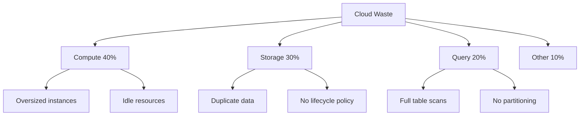

# ROI & Cost Optimization cho DE

> Cách nhanh nhất để chứng minh giá trị: Tiết kiệm tiền thật cho công ty

---

## Tại Sao Cost Optimization Là Impact Dễ Nhất?

```
✅ Đo được bằng $$$
✅ Sếp hiểu ngay không cần giải thích
✅ Không cần permission, chỉ cần refactor
✅ Có thể làm ngay tuần đầu tiên
```

**Thực tế:** Hầu hết công ty cloud bill có 30-50% waste. Bạn chỉ cần tìm và fix.

---

## Framework: Tìm Waste Ở Đâu?



---

## Action 1: Query Optimization (Tuần 1)

### Bước 1: Tìm query tốn tiền nhất

**BigQuery:**
```sql
SELECT
    user_email,
    query,
    total_bytes_processed / POW(10,12) as tb_scanned,
    total_bytes_processed / POW(10,12) * 5 as estimated_cost_usd
FROM `region-us`.INFORMATION_SCHEMA.JOBS_BY_PROJECT
WHERE creation_time > TIMESTAMP_SUB(CURRENT_TIMESTAMP(), INTERVAL 30 DAY)
    AND total_bytes_processed > 0
ORDER BY total_bytes_processed DESC
LIMIT 20;
```

**Snowflake:**
```sql
SELECT 
    user_name,
    query_text,
    bytes_scanned / POW(10,12) as tb_scanned,
    total_elapsed_time / 1000 / 60 as minutes,
    credits_used_cloud_services
FROM snowflake.account_usage.query_history
WHERE start_time > DATEADD(day, -30, CURRENT_TIMESTAMP())
ORDER BY bytes_scanned DESC
LIMIT 20;
```

### Bước 2: Patterns thường thấy và cách fix

| Pattern | Vấn đề | Fix | Tiết kiệm |
|---------|--------|-----|-----------|
| `SELECT *` | Scan toàn bộ columns | Chỉ select columns cần thiết | 50-80% |
| Không filter date | Scan toàn bộ table | Thêm `WHERE date >= ...` | 90%+ |
| Không partitioning | Full scan mỗi query | Partition by date | 90%+ |
| JOIN không cần thiết | Shuffle lớn | Denormalize hoặc pre-aggregate | 70% |

### Ví dụ thực tế:

**BEFORE:**
```sql
-- Scan 500GB mỗi lần chạy (~$2.50/query)
SELECT * 
FROM orders o
JOIN customers c ON o.customer_id = c.id
WHERE o.status = 'completed';
```

**AFTER:**
```sql
-- Scan 5GB (~$0.025/query) - Tiết kiệm 99%
SELECT 
    o.order_id,
    o.order_date,
    o.total_amount,
    c.customer_name
FROM orders o
JOIN customers c ON o.customer_id = c.id
WHERE o.status = 'completed'
    AND o.order_date >= DATE_SUB(CURRENT_DATE(), INTERVAL 30 DAY);
```

**Impact:** Query chạy 100 lần/ngày × $2.475 tiết kiệm = **$247.5/ngày = $7,425/tháng**

---

## Action 2: Storage Cleanup (Tuần 2)

### Bước 1: Tìm data không ai dùng

```sql
-- BigQuery: Tables chưa được query trong 90 ngày
SELECT
    table_schema,
    table_name,
    TIMESTAMP_DIFF(CURRENT_TIMESTAMP(), last_access_time, DAY) as days_since_access,
    total_physical_bytes / POW(10,9) as size_gb
FROM `region-us`.INFORMATION_SCHEMA.TABLE_STORAGE
WHERE last_access_time < TIMESTAMP_SUB(CURRENT_TIMESTAMP(), INTERVAL 90 DAY)
ORDER BY total_physical_bytes DESC
LIMIT 20;
```

### Bước 2: Actions

| Data Type | Action | Savings |
|-----------|--------|---------|
| Không ai dùng 90+ ngày | Delete hoặc archive to cold storage | 80-100% |
| Staging tables | Set TTL 7 ngày | Auto-cleanup |
| Duplicate tables | Consolidate | 50% |
| Raw data cũ | Move to Glacier/Archive | 80% |

### Lifecycle Policy Template

**AWS S3:**
```json
{
    "Rules": [
        {
            "ID": "Move-to-IA-after-30-days",
            "Status": "Enabled",
            "Filter": { "Prefix": "raw/" },
            "Transitions": [
                { "Days": 30, "StorageClass": "STANDARD_IA" },
                { "Days": 90, "StorageClass": "GLACIER" }
            ]
        }
    ]
}
```

**GCS:**
```json
{
    "lifecycle": {
        "rule": [
            {
                "action": { "type": "SetStorageClass", "storageClass": "NEARLINE" },
                "condition": { "age": 30, "matchesPrefix": ["raw/"] }
            },
            {
                "action": { "type": "SetStorageClass", "storageClass": "COLDLINE" },
                "condition": { "age": 90 }
            }
        ]
    }
}
```

---

## Action 3: Compute Right-Sizing (Tuần 3)

### Spark Jobs

```python
# Trước khi optimize, collect metrics
spark.conf.set("spark.sql.adaptive.enabled", "true")

# Check executor memory usage
df = spark.read.parquet("s3://bucket/data/")
df.explain(extended=True)  # Check physical plan

# Common issues:
# 1. Quá nhiều partitions nhỏ -> Coalesce
# 2. Quá ít partitions -> Repartition
# 3. Memory overhead cao -> Tune spark.executor.memoryOverhead
```

### Airflow Workers

```python
# Đừng set resources quá lớn "for safety"
# BAD: Mọi task đều 8GB RAM
default_args = {
    'executor_config': {
        'resources': {'memory': '8Gi', 'cpu': '2'}  # Waste!
    }
}

# GOOD: Right-size theo task type
LIGHT_RESOURCES = {'memory': '512Mi', 'cpu': '0.5'}
MEDIUM_RESOURCES = {'memory': '2Gi', 'cpu': '1'}
HEAVY_RESOURCES = {'memory': '8Gi', 'cpu': '2'}

@task(executor_config={'resources': LIGHT_RESOURCES})
def light_task(): ...

@task(executor_config={'resources': HEAVY_RESOURCES})
def heavy_task(): ...
```

---

## How to Present Cost Savings to Leadership

### Template Email

```
Subject: Data Infrastructure Cost Optimization - $X,XXX/month savings

Hi [Manager],

Over the past 2 weeks, I've analyzed our cloud spending and implemented 
optimizations that will save approximately $X,XXX per month.

Summary:
━━━━━━━━━━━━━━━━━━━━━━━━━━━━━━━━━━━━━━━
| Category        | Before   | After    | Savings  |
|-----------------|----------|----------|----------|
| BigQuery        | $5,000   | $2,000   | $3,000   |
| Storage         | $2,000   | $1,200   | $800     |
| Compute         | $3,000   | $2,500   | $500     |
━━━━━━━━━━━━━━━━━━━━━━━━━━━━━━━━━━━━━━━
| TOTAL           | $10,000  | $5,700   | $4,300   |

Changes made:
1. Optimized 15 expensive queries (attached list)
2. Implemented storage lifecycle policies
3. Right-sized Airflow workers

No functionality was removed. All dashboards and reports work as before.

Happy to walk through details if helpful.

Best,
[Your Name]
```

### Dashboard to Track Ongoing

Tạo dashboard tracking:
- Daily/Weekly/Monthly cloud spend
- Top 10 expensive queries
- Storage growth trend
- Cost per pipeline/team

---

## ROI Calculation Template

```
INVESTMENT:
- Your time: X hours × hourly rate = $Y

RETURN:
- Monthly savings: $Z
- Annual savings: $Z × 12

ROI = (Annual Return - Investment) / Investment × 100%

Example:
- 20 hours work × $50/hour = $1,000 investment
- $4,300/month savings = $51,600/year
- ROI = ($51,600 - $1,000) / $1,000 = 5,060%
```

---

## Quick Wins Checklist

**Week 1:**
- [ ] Run "expensive queries" analysis
- [ ] Fix top 5 queries
- [ ] Document savings

**Week 2:**
- [ ] Audit unused tables
- [ ] Implement lifecycle policies
- [ ] Delete/archive old data

**Week 3:**
- [ ] Review compute resources
- [ ] Right-size workers
- [ ] Present results to manager

**Ongoing:**
- [ ] Set up cost alerts
- [ ] Monthly cost review
- [ ] Track savings dashboard

---

## Resources

- [17_Cost_Optimization](../fundamentals/17_Cost_Optimization.md) - Technical details
- [Cloud Provider Cost Tools](https://cloud.google.com/billing/docs/reports) - Built-in tools

---

*Impact này có thể tạo trong tuần đầu tiên đi làm*
