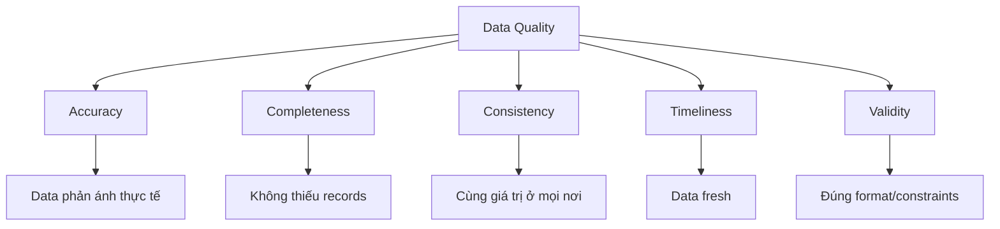

# Data Quality = Trust = Business Value

> Nếu data sai, không ai dùng. Không ai dùng = Zero impact.

---

## Tại Sao Data Quality Quan Trọng Hơn Feature Mới?

```
Pipeline hoàn hảo + Data sai = Vô dụng
Pipeline đơn giản + Data đúng = Có giá trị

Trust = f(Accuracy × Consistency × Timeliness)
```

**Thực tế đau lòng:**
- CEO nhìn dashboard thấy revenue âm → Mất trust mãi mãi
- Marketing chạy campaign dựa trên data sai → Đổ lỗi DE
- Một lần sai = mất 6 tháng rebuild trust

---

## Framework: Data Quality Dimensions



| Dimension | Ví dụ vi phạm | Hậu quả |
|-----------|---------------|---------|
| **Accuracy** | Revenue = -$500 | CEO mất trust |
| **Completeness** | Thiếu 10% orders | Báo cáo sai |
| **Consistency** | Sales = $1M ở dashboard A, $1.2M ở B | Confusion |
| **Timeliness** | Data delay 2 ngày | Quyết định dựa trên data cũ |
| **Validity** | Email = "not_an_email" | Downstream fail |

---

## Action 1: Implement Basic Tests (Day 1)

### dbt Tests - Bắt buộc phải có

```yaml
# models/staging/stg_orders.yml
version: 2

models:
  - name: stg_orders
    description: "Cleaned orders data"
    columns:
      - name: order_id
        tests:
          - unique        # Không duplicate
          - not_null      # Không null
      
      - name: order_date
        tests:
          - not_null
          - dbt_utils.accepted_range:
              min_value: "'2020-01-01'"
              max_value: "current_date"  # Không có ngày tương lai
      
      - name: total_amount
        tests:
          - not_null
          - dbt_utils.accepted_range:
              min_value: 0  # Không âm
              
      - name: customer_id
        tests:
          - not_null
          - relationships:  # Foreign key exists
              to: ref('stg_customers')
              field: customer_id
```

### Great Expectations - Production-grade

```python
import great_expectations as gx

# Tạo checkpoint
context = gx.get_context()

# Define expectations
expectation_suite = context.add_expectation_suite("orders_suite")

# Must-have expectations
validator.expect_column_values_to_not_be_null("order_id")
validator.expect_column_values_to_be_unique("order_id")
validator.expect_column_values_to_be_between("total_amount", min_value=0)
validator.expect_column_values_to_be_in_set("status", ["pending", "completed", "cancelled"])

# Row count expectation (catch missing data)
validator.expect_table_row_count_to_be_between(
    min_value=1000,  # Alert nếu quá ít
    max_value=1000000  # Alert nếu explosion
)

# Run and alert
result = context.run_checkpoint("orders_checkpoint")
if not result.success:
    send_slack_alert(result)
```

---

## Action 2: Monitor Critical Metrics (Week 1)

### SQL-based monitoring

```sql
-- Run daily, alert nếu fail

-- Test 1: Revenue không âm
SELECT COUNT(*) as negative_revenue_count
FROM orders
WHERE total_amount < 0;
-- Expected: 0

-- Test 2: Không có orders trong tương lai
SELECT COUNT(*) as future_orders
FROM orders
WHERE order_date > CURRENT_DATE();
-- Expected: 0

-- Test 3: Row count trong expected range
SELECT 
    DATE(order_date) as dt,
    COUNT(*) as order_count
FROM orders
WHERE order_date >= DATE_SUB(CURRENT_DATE(), INTERVAL 7 DAY)
GROUP BY 1;
-- Compare với historical average, alert nếu -50%

-- Test 4: Completeness - no null critical fields
SELECT 
    COUNT(*) as total_rows,
    SUM(CASE WHEN customer_id IS NULL THEN 1 ELSE 0 END) as null_customer,
    SUM(CASE WHEN total_amount IS NULL THEN 1 ELSE 0 END) as null_amount
FROM orders
WHERE order_date = CURRENT_DATE() - 1;
-- Expected: null counts = 0
```

### Airflow Data Quality DAG

```python
from airflow import DAG
from airflow.operators.python import PythonOperator
from airflow.providers.slack.operators.slack_webhook import SlackWebhookOperator

def check_data_quality():
    """Run all DQ checks and raise if failed"""
    checks = [
        ("Negative revenue", "SELECT COUNT(*) FROM orders WHERE total_amount < 0", 0),
        ("Future orders", "SELECT COUNT(*) FROM orders WHERE order_date > CURRENT_DATE()", 0),
        ("Null customer_id", "SELECT COUNT(*) FROM orders WHERE customer_id IS NULL", 0),
    ]
    
    failures = []
    for name, query, expected in checks:
        result = run_query(query)
        if result != expected:
            failures.append(f"❌ {name}: got {result}, expected {expected}")
    
    if failures:
        raise ValueError("\n".join(failures))
    
    return "✅ All DQ checks passed"

with DAG("data_quality_daily", schedule="0 6 * * *") as dag:
    
    check_dq = PythonOperator(
        task_id="check_data_quality",
        python_callable=check_data_quality,
    )
    
    alert_on_failure = SlackWebhookOperator(
        task_id="alert_slack",
        trigger_rule="one_failed",
        message="🚨 Data Quality Alert: Check failed! Investigate immediately.",
    )
    
    check_dq >> alert_on_failure
```

---

## Action 3: Build Trust Dashboard (Week 2)

### Metrics to show stakeholders

```sql
-- Data Freshness
SELECT 
    table_name,
    MAX(updated_at) as last_update,
    TIMESTAMP_DIFF(CURRENT_TIMESTAMP(), MAX(updated_at), HOUR) as hours_stale
FROM table_metadata
GROUP BY table_name;

-- DQ Score by table
SELECT 
    table_name,
    check_date,
    SUM(CASE WHEN passed THEN 1 ELSE 0 END) as passed_checks,
    COUNT(*) as total_checks,
    ROUND(100.0 * SUM(CASE WHEN passed THEN 1 ELSE 0 END) / COUNT(*), 1) as dq_score
FROM dq_check_results
WHERE check_date >= DATE_SUB(CURRENT_DATE(), INTERVAL 30 DAY)
GROUP BY 1, 2;
```

### Dashboard Layout

> **📊 DATA QUALITY DASHBOARD**
> 
> **Overall DQ Score:** 98.5% ✅ | **Last Updated:** 2 hours ago
> 
> **Table Health:**
> 
> | Table | Score | Freshness | Issues |
> |-------|-------|-----------|--------|
> | orders | 100% | 1h | None |
> | customers | 99% | 1h | 3 null emails |
> | products | 95% | 24h ⚠️ | Stale |
> 
> **Recent Issues:**
> - 2024-01-15: products table delay (resolved)
> - 2024-01-10: 5 duplicate orders detected (fixed)

---

## Action 4: Communicate Proactively

### Khi có issue - Template message

```
🚨 Data Quality Alert

What: [orders] table có 15 records với negative revenue
When: Detected at 6:05 AM, data from 2024-01-14
Impact: Dashboard X showing incorrect total
Status: Investigating

Root cause (updated 6:30 AM): 
- Source system bug in payment processor
- 15 refund records có sign sai

Resolution (updated 7:00 AM):
- Coordinated with Payment team
- They deployed fix at source
- Reprocessed affected data
- Dashboard now correct ✅

Prevention:
- Added DQ check to catch negative revenue
- Alert will fire if happens again
```

### Weekly DQ Report Template

```
📊 Weekly Data Quality Report (Jan 8-14)

Overall Score: 99.2% (↑0.3% from last week)

Highlights:
✅ Zero critical incidents
✅ All SLAs met
✅ New test coverage: +15 tests

Issues resolved:
• Duplicate detection improved
• products table freshness fixed

Improvements deployed:
• Added row count anomaly detection
• New Slack alerts for critical tables

Next week focus:
• Add schema change detection
• Improve customer table coverage
```

---

## Advanced: Schema Change Detection

```python
def detect_schema_changes(table_name: str) -> list:
    """Alert when schema changes unexpectedly"""
    
    current_schema = get_current_schema(table_name)
    expected_schema = load_expected_schema(table_name)
    
    changes = []
    
    # New columns
    new_cols = set(current_schema.keys()) - set(expected_schema.keys())
    if new_cols:
        changes.append(f"New columns: {new_cols}")
    
    # Dropped columns
    dropped_cols = set(expected_schema.keys()) - set(current_schema.keys())
    if dropped_cols:
        changes.append(f"Dropped columns: {dropped_cols}")
    
    # Type changes
    for col in current_schema:
        if col in expected_schema:
            if current_schema[col] != expected_schema[col]:
                changes.append(f"Type change {col}: {expected_schema[col]} → {current_schema[col]}")
    
    return changes
```

---

## ROI of Data Quality

```
Cost of BAD data quality:
- Wrong business decision based on bad data: $$$$$
- Time spent debugging: 2-4 hours per incident
- Trust lost: Months to rebuild
- Repeated questions from stakeholders: Constant interruption

Cost of GOOD data quality:
- Initial setup: 2-3 days
- Maintenance: 1-2 hours/week
- Peace of mind: Priceless

ROI = (Time saved debugging + Decisions improved) / Time invested
    = Very high
```

---

## Checklist

**Day 1:**
- [ ] Add not_null and unique tests to critical columns
- [ ] Set up basic alerting (Slack/email)

**Week 1:**
- [ ] Add range checks (no negative amounts, no future dates)
- [ ] Add row count checks
- [ ] Create DQ Airflow DAG

**Week 2:**
- [ ] Build Data Quality dashboard
- [ ] Set up weekly report
- [ ] Document SLAs

**Ongoing:**
- [ ] Expand test coverage
- [ ] Track DQ score over time
- [ ] Proactive communication

---

## Resources

- [10_Data_Quality_Tools_Guide](../tools/10_Data_Quality_Tools_Guide.md) - Tool details
- [07_dbt_Complete_Guide](../tools/07_dbt_Complete_Guide.md) - dbt testing

---

*Data đúng = Trust = Adoption = Impact*
