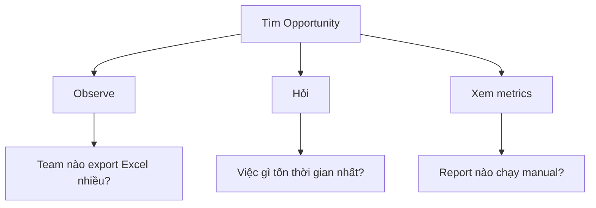

# Automation = Business Value

> Giải phóng người khác khỏi việc lặp lại = Bạn trở thành "hero"

---

## Tại Sao Automation Là Impact Lớn Nhất?

```
Tự động 1 task 30 phút/ngày cho 5 người:
= 2.5 giờ/ngày × 20 ngày = 50 giờ/tháng
= 1.25 FTE tiết kiệm

Bạn code 4 giờ → Giải phóng 50 giờ/tháng
ROI = 12.5x trong tháng đầu
```

**Thực tế:** Rất nhiều business teams đang làm việc "ngu ngốc" (manual, repetitive) mà không biết DE có thể automate.

---

## Framework: Tìm Automation Opportunities



### Câu hỏi để tìm opportunity

| Hỏi ai | Hỏi gì | Thường phát hiện |
|--------|--------|------------------|
| Marketing | "Bạn lấy data từ Facebook Ads như nào?" | Copy-paste CSV hàng ngày |
| Sales | "Bạn check pipeline data ở đâu?" | Export CRM → Excel → Manual tính |
| Finance | "Monthly close mất bao lâu?" | 3 ngày consolidate spreadsheets |
| Customer Success | "Bạn biết customer nào at-risk sao?" | Guess, không có data |

---

## Case Study 1: Marketing Data Automation

### Problem
Marketing team mỗi sáng:
1. Login Facebook Ads Manager
2. Download CSV
3. Login Google Ads
4. Download CSV
5. Open Excel, copy-paste cả 2
6. Calculate metrics manually
7. Paste vào slide

**Time:** 45 phút/ngày × 5 người = 3.75 giờ/ngày

### Solution

```python
# automated_marketing_report.py
from facebook_ads import FacebookAdsAPI
from google_ads import GoogleAdsAPI
import pandas as pd
from slack_sdk import WebClient

def fetch_facebook_data(date: str) -> pd.DataFrame:
    """Fetch Facebook Ads data via API"""
    api = FacebookAdsAPI(access_token=os.getenv("FB_TOKEN"))
    
    campaigns = api.get_campaigns(
        date_preset="yesterday",
        fields=["campaign_name", "spend", "impressions", "clicks", "conversions"]
    )
    
    return pd.DataFrame(campaigns)

def fetch_google_data(date: str) -> pd.DataFrame:
    """Fetch Google Ads data via API"""
    client = GoogleAdsAPI(credentials=load_credentials())
    
    query = """
        SELECT 
            campaign.name,
            metrics.cost_micros,
            metrics.impressions,
            metrics.clicks,
            metrics.conversions
        FROM campaign
        WHERE segments.date = '{date}'
    """.format(date=date)
    
    return client.query(query)

def combine_and_calculate(fb_df: pd.DataFrame, google_df: pd.DataFrame) -> pd.DataFrame:
    """Combine data and calculate metrics"""
    
    combined = pd.concat([
        fb_df.assign(source="Facebook"),
        google_df.assign(source="Google")
    ])
    
    # Calculate derived metrics
    combined["ctr"] = combined["clicks"] / combined["impressions"]
    combined["cpc"] = combined["spend"] / combined["clicks"]
    combined["cpa"] = combined["spend"] / combined["conversions"]
    
    return combined

def send_slack_report(df: pd.DataFrame):
    """Send daily summary to Slack"""
    
    summary = f"""
    📊 *Daily Marketing Report - {date.today()}*
    
    *Total Spend:* ${df['spend'].sum():,.2f}
    *Total Conversions:* {df['conversions'].sum():,}
    *Overall CPA:* ${df['spend'].sum() / df['conversions'].sum():.2f}
    
    *Top Campaign:* {df.loc[df['conversions'].idxmax(), 'campaign_name']}
    
    Full report: <dashboard_link|View Dashboard>
    """
    
    client = WebClient(token=os.getenv("SLACK_TOKEN"))
    client.chat_postMessage(channel="#marketing-data", text=summary)

# Airflow DAG
@dag(schedule="0 7 * * *")  # 7 AM daily
def marketing_daily_report():
    fb = fetch_facebook_data()
    google = fetch_google_data()
    combined = combine_and_calculate(fb, google)
    save_to_warehouse(combined)
    send_slack_report(combined)
```

### Impact
- **Before:** 3.75 hours/day manual work
- **After:** 0 hours (runs automatically at 7 AM)
- **Savings:** 75 hours/month = ~$3,750/month (@ $50/hour)
- **Bonus:** Marketing has data ready when they arrive

---

## Case Study 2: Sales Pipeline Automation

### Problem
Sales Ops mỗi Monday:
1. Export từ Salesforce
2. Export từ HubSpot
3. Reconcile khác biệt trong Excel
4. Calculate pipeline metrics
5. Create slide cho weekly meeting

**Time:** 4 giờ mỗi Monday

### Solution

```sql
-- dbt model: fct_sales_pipeline.sql

WITH salesforce_opps AS (
    SELECT 
        opp_id,
        account_name,
        amount,
        stage,
        close_date,
        owner_name,
        'Salesforce' as source
    FROM {{ ref('stg_salesforce_opportunities') }}
),

hubspot_deals AS (
    SELECT 
        deal_id as opp_id,
        company_name as account_name,
        amount,
        deal_stage as stage,
        expected_close as close_date,
        owner_email,
        'HubSpot' as source
    FROM {{ ref('stg_hubspot_deals') }}
),

combined AS (
    SELECT * FROM salesforce_opps
    UNION ALL
    SELECT * FROM hubspot_deals
),

-- Calculate pipeline metrics
pipeline_summary AS (
    SELECT
        DATE_TRUNC('week', close_date) as close_week,
        stage,
        COUNT(*) as deal_count,
        SUM(amount) as total_amount,
        AVG(amount) as avg_deal_size
    FROM combined
    WHERE close_date >= DATE_TRUNC('quarter', CURRENT_DATE())
    GROUP BY 1, 2
)

SELECT * FROM pipeline_summary
```

```python
# Auto-generate slides
from pptx import Presentation
from pptx.util import Inches

def generate_weekly_pipeline_slides():
    """Auto-create weekly pipeline presentation"""
    
    prs = Presentation()
    
    # Title slide
    slide = prs.slides.add_slide(prs.slide_layouts[0])
    slide.shapes.title.text = f"Sales Pipeline Update - Week of {get_monday()}"
    
    # Pipeline summary
    slide = prs.slides.add_slide(prs.slide_layouts[1])
    slide.shapes.title.text = "Pipeline Summary"
    
    pipeline_data = query_pipeline_summary()
    add_table(slide, pipeline_data)
    add_chart(slide, pipeline_data)
    
    # Save and upload
    filename = f"pipeline_{get_monday()}.pptx"
    prs.save(filename)
    upload_to_drive(filename, folder_id="sales_presentations")
    
    # Notify
    send_slack("#sales", f"📊 Weekly pipeline deck ready: {drive_link}")
```

### Impact
- **Before:** 4 hours every Monday (16 hours/month)
- **After:** Runs automatically Sunday night, slides ready Monday 6 AM
- **Savings:** 16 hours/month + better data accuracy

---

## Case Study 3: Customer Health Score

### Problem
Customer Success has no visibility into at-risk customers until they churn.

### Solution

```sql
-- dbt model: dim_customer_health.sql

WITH usage_metrics AS (
    SELECT 
        customer_id,
        -- Activity metrics
        COUNT(DISTINCT DATE(event_time)) as active_days_30d,
        COUNT(*) as total_events_30d,
        MAX(event_time) as last_active,
        
        -- Feature adoption
        COUNT(DISTINCT feature_used) as features_used,
        
        -- Trend
        COUNT(CASE WHEN event_time >= DATE_SUB(CURRENT_DATE(), INTERVAL 7 DAY) 
              THEN 1 END) as events_last_7d,
        COUNT(CASE WHEN event_time BETWEEN DATE_SUB(CURRENT_DATE(), INTERVAL 14 DAY)
              AND DATE_SUB(CURRENT_DATE(), INTERVAL 7 DAY) 
              THEN 1 END) as events_prev_7d
    FROM events
    WHERE event_time >= DATE_SUB(CURRENT_DATE(), INTERVAL 30 DAY)
    GROUP BY customer_id
),

support_metrics AS (
    SELECT
        customer_id,
        COUNT(*) as tickets_30d,
        AVG(resolution_time_hours) as avg_resolution_time,
        SUM(CASE WHEN sentiment = 'negative' THEN 1 ELSE 0 END) as negative_tickets
    FROM support_tickets
    WHERE created_at >= DATE_SUB(CURRENT_DATE(), INTERVAL 30 DAY)
    GROUP BY customer_id
),

billing AS (
    SELECT
        customer_id,
        mrr,
        contract_end_date,
        DATEDIFF(contract_end_date, CURRENT_DATE()) as days_until_renewal
    FROM subscriptions
    WHERE status = 'active'
)

SELECT
    c.customer_id,
    c.customer_name,
    c.csm_owner,
    
    -- Usage health (0-40 points)
    CASE 
        WHEN u.active_days_30d >= 20 THEN 40
        WHEN u.active_days_30d >= 10 THEN 30
        WHEN u.active_days_30d >= 5 THEN 20
        ELSE 10
    END as usage_score,
    
    -- Engagement trend (0-20 points)
    CASE
        WHEN u.events_last_7d > u.events_prev_7d * 1.1 THEN 20  -- Growing
        WHEN u.events_last_7d >= u.events_prev_7d * 0.9 THEN 15  -- Stable
        ELSE 5  -- Declining
    END as trend_score,
    
    -- Support health (0-20 points)
    CASE
        WHEN COALESCE(s.negative_tickets, 0) = 0 THEN 20
        WHEN s.negative_tickets <= 2 THEN 10
        ELSE 0
    END as support_score,
    
    -- Renewal proximity (0-20 points)
    CASE
        WHEN b.days_until_renewal > 90 THEN 20
        WHEN b.days_until_renewal > 30 THEN 10
        ELSE 0  -- Renewal coming up!
    END as renewal_score,
    
    -- Total health score
    (usage_score + trend_score + support_score + renewal_score) as health_score,
    
    -- Risk tier
    CASE 
        WHEN (usage_score + trend_score + support_score + renewal_score) >= 80 THEN 'Healthy'
        WHEN (usage_score + trend_score + support_score + renewal_score) >= 50 THEN 'At Risk'
        ELSE 'Critical'
    END as risk_tier

FROM customers c
LEFT JOIN usage_metrics u ON c.customer_id = u.customer_id
LEFT JOIN support_metrics s ON c.customer_id = s.customer_id
LEFT JOIN billing b ON c.customer_id = b.customer_id
```

### Impact
- **Before:** CS team surprised by churn, reactive
- **After:** Early warning system, proactive outreach to at-risk customers
- **Business impact:** 20% reduction in churn = Major revenue saved

---

## How to Pitch Automation to Stakeholders

### Template

```
Hi [Team Lead],

I noticed your team spends ~X hours/week on [manual task].

I can automate this so that [result] is ready automatically every [morning/Monday/etc].

Estimated effort: [X days] of my time
Estimated savings: [Y hours/week] for your team

Would you be interested? I can do a quick demo with sample data.

[Your name]
```

### Do's and Don'ts

| Do | Don't |
|----|-------|
| Start with THEIR pain | Start with technology |
| Show quick win first | Promise huge project |
| Deliver incrementally | Disappear for weeks |
| Ask for feedback | Assume you know best |
| Celebrate their win | Take all credit |

---

## Automation Backlog Template

| Priority | Team | Current Process | Automation Idea | Effort | Impact |
|----------|------|-----------------|-----------------|--------|--------|
| 🔴 High | Marketing | Manual CSV download daily | API integration | 2 days | 15 hrs/week |
| 🟠 Medium | Sales | Weekly Excel reconciliation | dbt pipeline | 3 days | 4 hrs/week |
| 🟡 Low | Finance | Monthly report compilation | Automated deck | 1 week | 8 hrs/month |

---

## Checklist

**Week 1:**
- [ ] Interview 2-3 teams about manual work
- [ ] Identify top 3 automation opportunities
- [ ] Pick easiest one (quick win)

**Week 2-3:**
- [ ] Build automation for quick win
- [ ] Test with stakeholder
- [ ] Deploy and document

**Week 4:**
- [ ] Celebrate win with stakeholder
- [ ] Start next automation
- [ ] Build reputation as "the person who makes things easier"

---

*Automation = Making other people's lives easier = Impact*
