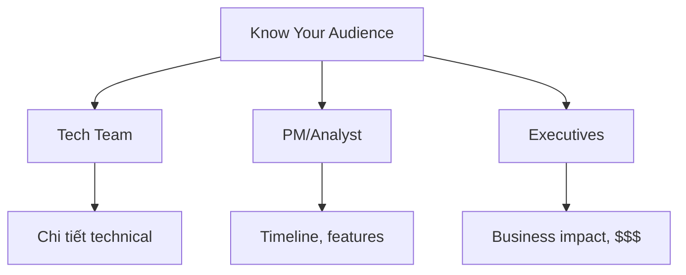

# Stakeholder Communication

> Kỹ năng quan trọng nhất của Senior DE: Nói chuyện với người không biết tech

---

## Tại Sao Communication Quan Trọng?

```
Good tech + bad communication = No one knows you did anything
Average tech + great communication = Everyone thinks you're amazing

Promotion = Technical skill × Communication skill
```

**Thực tế:**
- Sếp không biết Spark là gì
- VP không quan tâm query của bạn optimize 10x
- CEO chỉ muốn biết: "Số liệu đúng chưa? Bao giờ xong?"

---

## Framework: Know Your Audience



| Audience | Họ quan tâm | Họ KHÔNG quan tâm |
|----------|-------------|-------------------|
| **Tech (DE/SWE)** | Architecture, tradeoffs, performance | Business metrics |
| **PM/Analyst** | Timeline, data availability, features | Internal implementation |
| **Manager** | Progress, risks, resources | Code details |
| **VP/Director** | Impact, alignment with goals | How you did it |
| **C-level** | Money, customers, risk | Anything else |

---

## Template: Technical Update for Non-Tech People

### ❌ BAD (Too technical)

> "We migrated from a star schema to a more denormalized model with pre-aggregated fact tables, which reduced our Spark shuffle operations by 70% and decreased query latency from 45 seconds to 3 seconds using bloom filter joins."

**Executive reaction:** 😐🤷

### ✅ GOOD (Business focused)

> "Dashboard now loads in 3 seconds instead of 45 seconds. 
> Users can make faster decisions.
> Cloud cost reduced by $500/month."

**Executive reaction:** 👍

---

## Template: Status Update Email

```
Subject: [Project Name] Weekly Update - Week 3

Status: 🟢 On Track

━━━ Summary (read this only) ━━━
Dashboard redesign is 70% complete. 
Users will see faster load times (45s → 3s) starting Jan 20.

━━━ This Week ━━━
✅ Completed: Data migration (5 tables)
✅ Completed: Query optimization for slow reports
🔄 In progress: Testing with sample users

━━━ Next Week ━━━
• Complete testing
• Prepare documentation
• Plan rollout

━━━ Blockers ━━━
None currently.

━━━ Need Decision ━━━
Should we roll out to all users on Jan 20, or do phased rollout?
Recommendation: Phased (less risk)

---
Full details: [link to project doc]
```

**Note format:**
- Lead with summary (busy people only read first 2 lines)
- Clear status indicator (🟢🟡🔴)
- Action items at end (decision needed)

---

## Template: Incident Communication

### Real-time Update (Slack)

```
🔴 INCIDENT: Dashboard showing incorrect revenue

What: Revenue dashboard displaying -$50K (should be positive)
Impact: Finance team cannot close monthly report
Status: Investigating

Timeline:
• 9:00 AM - Issue reported by Finance
• 9:05 AM - Confirmed bug in data pipeline
• 9:15 AM - Root cause identified (currency conversion)
• 9:30 AM (ETA) - Fix deployed

I'll update every 15 minutes until resolved.
```

### Post-Incident Summary

```
📋 Incident Summary: Negative Revenue Display

Duration: 9:00 AM - 9:45 AM (45 minutes)
Impact: Finance team delayed by 1 hour
Root Cause: Currency conversion applied twice for EUR transactions

Timeline:
• 9:00 - Reported
• 9:05 - Acknowledged
• 9:15 - Root cause found
• 9:30 - Fix deployed
• 9:45 - Verified fixed

What happened:
A code change yesterday accidentally ran currency conversion twice.

Prevention:
✅ Added automated test for negative revenue
✅ Added alert if revenue drops >50% day-over-day
✅ Need: Code review checklist update (action: @DevLead)

Lessons learned:
Currency conversion logic should have explicit tests.
```

---

## Template: Project Proposal (1-Pager)

```
# Real-time Inventory Dashboard

## Problem
Warehouse team checks inventory manually 3x/day.
This causes:
- Stockouts (lost sales ~$10K/month)
- Overstock (excess inventory cost ~$5K/month)

## Proposed Solution
Build real-time inventory dashboard updating every 5 minutes.

## Expected Impact
- Reduce stockouts by 50%: Save ~$5K/month
- Reduce overstock by 30%: Save ~$1.5K/month
- Total: $6.5K/month savings

## Investment
- My time: 3 weeks
- Cloud cost: ~$200/month

## Timeline
- Week 1: Data pipeline
- Week 2: Dashboard
- Week 3: Testing & rollout

## Success Metrics
- Stockout incidents per month: 10 → 5
- Overstock $ amount: $50K → $35K

## Decision Needed
Approve to start next Monday?
```

---

## How to Explain Technical Concepts

### Pattern: Analogy + Impact

| Technical Concept | Bad Explanation | Good Explanation |
|-------------------|-----------------|------------------|
| Data pipeline | "ETL process that extracts, transforms, and loads data" | "Like a factory assembly line, but for data. Raw data comes in, cleaned data comes out." |
| Partitioning | "Dividing data into smaller chunks based on column values" | "Like organizing files into folders by month. Finding last month's data is much faster than searching everything." |
| Caching | "Storing frequently accessed data in memory" | "Like keeping commonly used documents on your desk instead of walking to the filing cabinet each time. Faster access." |
| Data quality | "Implementing validation rules and tests on data" | "Like spell-check for numbers. Catches errors before they reach the report." |

### Pattern: Before/After

```
Before: Report takes 5 minutes to load
After: Report loads in 3 seconds

What changed: [brief explanation if asked]
```

### Pattern: Impact First

```
❌ "We implemented Spark optimization with 70% less shuffle"
✅ "Report now runs in 3 seconds, saves team 2 hours/day"
```

---

## Difficult Conversations

### "When will it be done?"

```
❌ "I don't know, there are too many unknowns"
✅ "Based on current progress:
    - Best case: Jan 15
    - Most likely: Jan 20
    - If [risk] happens: Jan 30
    
    I'll update you if estimate changes."
```

### "Why is it taking so long?"

```
❌ "Because the codebase is a mess and..."
✅ "We discovered additional complexity in [X].
    Original estimate: 2 weeks
    Current estimate: 3 weeks
    
    We can speed up by [option] if timeline is critical."
```

### "Can you just add this small feature?"

```
❌ "That's scope creep!"
✅ "Happy to add that. Here's the tradeoff:
    - Add feature = delay launch by 1 week
    - Or: launch on time, add feature in v2
    
    Which would you prefer?"
```

### Saying No (Diplomatically)

```
❌ "We can't do that"
✅ "We can do that, but not this quarter given current priorities.
    Options:
    1. Do it in Q2
    2. Deprioritize [other thing] to do it now
    3. Temporary workaround: [suggestion]
    
    What works best for you?"
```

---

## Meeting Communication

### Before Meeting
- Send agenda in advance
- State what decision is needed

### During Meeting
- Start with conclusion/recommendation
- Have backup slides for details
- Time-box discussion

### After Meeting
- Send summary with decisions made
- List action items with owners

### Meeting Notes Template

```
Meeting: Data Pipeline Review
Date: Jan 15, 2024

Attendees: [names]

Decisions Made:
1. Approved phased rollout starting Jan 20
2. Budget approved for additional compute

Action Items:
- [ ] @You: Prepare rollout plan by Jan 17
- [ ] @Manager: Communicate to stakeholders by Jan 18

Next Steps:
Reconvene on Jan 22 to review rollout status.
```

---

## Building Relationships

### With Business Teams

| Do | Don't |
|----|-------|
| Visit their floor, understand their work | Stay in tech silo |
| Ask "what's painful for you?" | Wait for tickets |
| Celebrate their success with your work | Take all credit |
| Speak their language | Use jargon |

### With Your Manager

| Do | Don't |
|----|-------|
| Send weekly updates proactively | Wait to be asked |
| Flag risks early | Surprise with bad news |
| Propose solutions, not just problems | Dump problems |
| Ask for feedback | Assume you're doing great |

---

## Checklist

**Every Week:**
- [ ] Send status update to manager (even if nothing to report)
- [ ] Have 1 conversation with non-tech stakeholder

**Every Project:**
- [ ] Write 1-pager before starting
- [ ] Define success metrics upfront
- [ ] Celebrate win publicly when done

**Ongoing:**
- [ ] Document impact in your brag doc
- [ ] Practice explaining technical concepts simply

---

*Communication is the multiplier on all your technical work*
