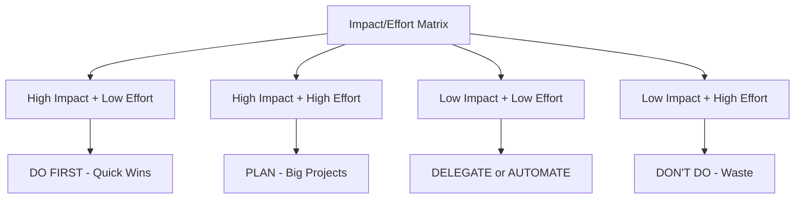

# Prioritization Framework cho DE

> Làm gì trước, bỏ gì, nói "không" thế nào

---

## Tại Sao Prioritization Quan Trọng?

```
Unlimited ideas + Limited time = Cần prioritize

Junior: Làm mọi thứ được assign
Mid: Đề xuất nên làm gì
Senior: Quyết định KHÔNG làm gì
Staff: Đặt priorities cho team
```

**Thực tế:** 80% impact đến từ 20% công việc. Skill là chọn đúng 20% đó.

---

## Framework: Impact vs Effort Matrix



### Rating Guide

**Impact (1-5):**
- 5: Saves >$10K/month OR affects company strategy
- 4: Saves $5-10K/month OR affects department
- 3: Saves $1-5K/month OR affects team
- 2: Saves <$1K/month OR affects few people
- 1: Nice to have, no clear $ impact

**Effort (1-5):**
- 5: >1 month, multiple people
- 4: 2-4 weeks, your full focus
- 3: 1-2 weeks
- 2: 2-5 days
- 1: <2 days

### Example Backlog

| Task | Impact | Effort | Score | Priority |
|------|--------|--------|-------|----------|
| Optimize top 5 expensive queries | 4 | 2 | 4/2=2.0 | 🔴 Do first |
| Build real-time dashboard | 5 | 4 | 5/4=1.25 | 🟠 Plan |
| Add tests to pipeline | 3 | 2 | 3/2=1.5 | 🟠 Do soon |
| Migrate to new tool | 2 | 5 | 2/5=0.4 | 🟡 Question it |
| Refactor old code | 2 | 3 | 2/3=0.67 | 🟡 Deprioritize |

---

## Framework: RICE Scoring

For larger projects/features:

```
RICE Score = (Reach × Impact × Confidence) / Effort

Reach: How many users/stakeholders affected? (per quarter)
Impact: How much does it help them? (0.25=minimal, 0.5=low, 1=medium, 2=high, 3=massive)
Confidence: How sure are you? (100%=high, 80%=medium, 50%=low)
Effort: Person-months
```

### Example

| Project | Reach | Impact | Confidence | Effort | Score |
|---------|-------|--------|------------|--------|-------|
| Dashboard speed optimization | 50 users | 2 (high) | 80% | 1 | 80 |
| New data source integration | 10 users | 3 (massive) | 50% | 2 | 7.5 |
| Code refactoring | 5 devs | 1 (medium) | 100% | 3 | 1.7 |

**Decision:** Dashboard speed optimization wins.

---

## How to Say No (And Still Get Promoted)

### Pattern: Yes, but...

```
Request: "Can you add this feature by Friday?"

❌ "No, I don't have time"

✅ "Yes, I can do that. 
    Currently I'm working on [X] which is due Friday.
    Options:
    1. Delay [X] to add this feature
    2. Do this feature next week after [X]
    3. Do a simpler version that takes 1 day instead of 3
    
    Which would you prefer?"
```

### Pattern: Explain Tradeoff

```
Request: "Can you help team Y with their data issue?"

✅ "Happy to help. 
    Currently prioritizing:
    1. Revenue dashboard (VP Sales waiting)
    2. Data quality fixes (Finance blocked)
    
    If I help Team Y, which of these should I delay?
    Or should Team Y wait until Tuesday?"
```

### Pattern: Redirect

```
Request: Ad-hoc analysis that's not your job

✅ "That's a great question for the Analytics team.
    @Analyst would be best person to help.
    
    I can make sure they have the data they need if that helps."
```

---

## Weekly Planning Template

### Friday Planning (30 min)

```
Next Week Priorities:

Must Do (Committed):
1. [Task 1] - Why: [commitment to whom]
2. [Task 2] - Why: [dependency for other team]

Should Do (High value):
3. [Task 3] - Why: [impact explanation]
4. [Task 4] - Why: [impact explanation]

Could Do (If time):
5. [Task 5]
6. [Task 6]

Won't Do This Week:
- [Task X] - Why: Lower priority than above
- [Task Y] - Why: Waiting for input from...

Blockers to clear:
- Need decision from [person] on [topic]
- Waiting for [resource]
```

### Daily Morning (5 min)

```
Today:
1. [ ] Top priority: [task]
2. [ ] Also important: [task]
3. [ ] If time: [task]

Blocked on:
- [item] - action: ping [person]
```

---

## Stakeholder Priority Conflicts

### Scenario: Two VPs want different things

```
VP Sales: "I need dashboard X by Friday"
VP Marketing: "I need data integration Y by Friday"

You can only do one by Friday.
```

### Solution: Escalate with recommendation

```
Hi [Manager],

I have conflicting priorities from VP Sales and VP Marketing.
Both need delivery by Friday, but I can only complete one.

My recommendation:
- Dashboard X (Sales) - Do first because: Revenue impact higher
- Data Integration Y (Marketing) - Deliver Monday instead

Reasons:
- Dashboard X: Blocks $1M deal closing Friday
- Data Integration Y: Campaign can use alternative data until Monday

Please confirm or redirect.
```

### Key principle:
- Don't choose yourself (you'll make enemies)
- Escalate with clear recommendation
- Let managers fight the political battle

---

## Time Audit

### Track where time actually goes

```
Week of Jan 15:

Planned vs Actual:
━━━━━━━━━━━━━━━━━━━━━━━━━━━━━━━━━━━
| Activity          | Planned | Actual |
|-------------------|---------|--------|
| Coding/Building   | 20h     | 12h    |
| Meetings          | 8h      | 14h    | ← Problem!
| Ad-hoc requests   | 2h      | 8h     | ← Problem!
| Code review       | 5h      | 4h     |
| Learning          | 5h      | 2h     |
━━━━━━━━━━━━━━━━━━━━━━━━━━━━━━━━━━━

Insights:
- Meetings eating coding time
- Too many interruptions

Actions:
- Block 4 hours "focus time" mornings
- Batch ad-hoc requests to 4 PM daily
- Decline optional meetings
```

---

## Technical Debt Prioritization

### Framework: Cost of Delay

```
Technical Debt Impact:
- Slows down every future feature?
- Causes outages?
- Increases cloud cost?
- Makes onboarding slow?

Score by weekly cost:
- High: >4 hours/week team time OR >$500/week
- Medium: 1-4 hours/week OR $100-500/week
- Low: <1 hour/week OR <$100/week
```

### Example

| Tech Debt | Weekly Cost | Fix Time | ROI (weeks to payback) |
|-----------|-------------|----------|------------------------|
| Slow test suite | 5 hr/week × 5 devs = 25 hrs | 40 hrs | 1.6 weeks |
| Manual deployment | 2 hr/week | 10 hrs | 5 weeks |
| Messy codebase | Hard to measure | Unknown | Don't do yet |

**Decision:** Fix slow test suite first (fastest payback).

---

## Checklist

**Daily:**
- [ ] Know your #1 priority for the day
- [ ] Protect focus time

**Weekly:**
- [ ] Review and adjust priorities
- [ ] Clear any blockers
- [ ] Communicate priorities to stakeholders

**Monthly:**
- [ ] Time audit: Where did time go?
- [ ] Review backlog: Still relevant?
- [ ] Celebrate wins, learn from misses

---

*Saying no to low-impact work is saying yes to high-impact work*
