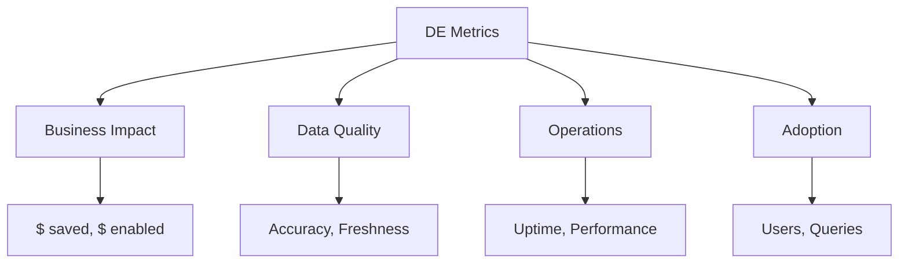

# Metrics That Matter

> Đo lường đúng thứ = Biết mình có impact hay không

---

## Tại Sao Metrics Quan Trọng?

```
Không có metrics = "Tôi nghĩ mình đang làm tốt"
Có metrics sai = Focus sai thứ
Có metrics đúng = Chứng minh giá trị, được promote

"What gets measured gets managed" - Peter Drucker
```

**Thực tế:**
- Nhiều DE chỉ track số pipelines chạy xong
- Không track business impact của pipelines đó
- Kết quả: Không biết mình có giá trị không

---

## Framework: Metrics Categories



---

## Tier 1: Business Impact Metrics (What C-level Cares)

### 1. Money Saved

```
Cloud Cost Reduction = Previous month cost - Current month cost

Example:
- January: $15,000
- February: $11,000
- Savings: $4,000 (26.7%)
```

**Track in dashboard:**
- Monthly cloud spend (trend)
- Spend by team/project
- Cost per pipeline/query

### 2. Money Enabled

```
Revenue Enabled = Revenue from decisions made with your data

Harder to measure, but examples:
- Campaign optimization saved $X in marketing spend
- Fraud detection prevented $X in losses  
- Pricing optimization increased revenue by $X
```

**Proxy metrics:**
- # of business decisions using data platform
- $ value of decisions (ask stakeholders)

### 3. Time Saved

```
Hours Saved = (Old process time - New process time) × Frequency × # People

Example: 
Dashboard automation:
- Old: 30 min/day × 5 people = 2.5 hours/day
- New: 0 (automated)
- Saved: 2.5 hours/day × 20 days = 50 hours/month
- Value: 50 hours × $50/hour = $2,500/month
```

**Track:**
- Automation inventory (what you automated)
- Hours saved per automation
- Cumulative hours saved

---

## Tier 2: Data Quality Metrics (What Stakeholders Care)

### 4. Data Accuracy

```
Accuracy Rate = 1 - (Data issues discovered / Total data points)

Target: >99.9%
```

**Measure via:**
```sql
-- DQ test pass rate
SELECT
    DATE(check_date) as date,
    SUM(CASE WHEN passed THEN 1 ELSE 0 END) as passed,
    COUNT(*) as total,
    ROUND(100.0 * SUM(CASE WHEN passed THEN 1 ELSE 0 END) / COUNT(*), 2) as pass_rate
FROM dq_check_results
GROUP BY 1
ORDER BY 1 DESC;
```

### 5. Data Freshness

```
Freshness = Time since last update

SLA example:
- Critical tables: <1 hour stale
- Standard tables: <4 hours stale
- Historical tables: <24 hours stale
```

**Track:**
```sql
SELECT
    table_name,
    MAX(updated_at) as last_update,
    TIMESTAMP_DIFF(CURRENT_TIMESTAMP(), MAX(updated_at), HOUR) as hours_stale,
    sla_hours,
    CASE 
        WHEN TIMESTAMP_DIFF(CURRENT_TIMESTAMP(), MAX(updated_at), HOUR) > sla_hours 
        THEN 'BREACHED'
        ELSE 'OK'
    END as sla_status
FROM table_metadata
JOIN table_slas USING (table_name)
GROUP BY 1;
```

### 6. Data Completeness

```
Completeness = 1 - (NULL or missing values / Total values)

Check critical fields:
- customer_id: 100% expected
- email: 95%+ expected (some missing OK)
- optional_field: N/A
```

---

## Tier 3: Operations Metrics (What Team Cares)

### 7. Pipeline Success Rate

```
Success Rate = Successful runs / Total runs

Target: >99%
```

**Airflow query:**
```sql
SELECT
    dag_id,
    DATE(execution_date) as date,
    SUM(CASE WHEN state = 'success' THEN 1 ELSE 0 END) as success,
    SUM(CASE WHEN state = 'failed' THEN 1 ELSE 0 END) as failed,
    ROUND(100.0 * SUM(CASE WHEN state = 'success' THEN 1 ELSE 0 END) / COUNT(*), 2) as success_rate
FROM dag_run
WHERE execution_date >= DATE_SUB(CURRENT_DATE(), INTERVAL 30 DAY)
GROUP BY 1, 2
ORDER BY success_rate ASC;  -- Show worst first
```

### 8. Pipeline Latency (SLA)

```
Latency = End time - Expected ready time

Example:
- Dashboard expects data by 6 AM
- Pipeline finishes at 5:30 AM
- Buffer: 30 minutes ✅
```

**Track:**
- % of SLAs met
- Average latency vs SLA
- Worst offenders

### 9. Mean Time to Recovery (MTTR)

```
MTTR = Σ (Recovery time - Incident start time) / # Incidents

Target: <1 hour for critical, <4 hours for standard
```

### 10. Change Failure Rate

```
Change Failure Rate = Failed deployments / Total deployments

Target: <15%
```

---

## Tier 4: Adoption Metrics (Platform Health)

### 11. Active Users

```
DAU (Daily Active Users) = Unique users querying per day
WAU (Weekly Active Users) = Unique users per week
```

**Track:**
```sql
SELECT
    DATE(query_start) as date,
    COUNT(DISTINCT user_email) as active_users,
    COUNT(*) as total_queries
FROM query_history
WHERE query_start >= DATE_SUB(CURRENT_DATE(), INTERVAL 30 DAY)
GROUP BY 1
ORDER BY 1;
```

### 12. Query Volume Growth

```
Growth = (This month queries - Last month queries) / Last month queries
```

### 13. Self-Service Ratio

```
Self-Service Ratio = Ad-hoc queries / Total queries

Higher = Better (users don't need DE help)
Target: >80%
```

### 14. Data Product Adoption

```
For each data product (table, dashboard, model):
- # users
- # queries
- Last accessed
```

---

## Metrics Dashboard Template

> **📊 DATA PLATFORM HEALTH DASHBOARD**
> 
> **BUSINESS IMPACT (This Month)**
> 
> | Cost Saved | Hours Saved | Decisions |
> |---|---|---|
> | $4,300<br>↓28% MoM | 120 hrs<br>↑20% MoM | 45<br>↑15% MoM |
> 
> **DATA QUALITY**
> 
> | Accuracy | Freshness | Completeness |
> |---|---|---|
> | 99.8% ✅ | 98% SLA ✅ | 99.5% ✅ |
> 
> **OPERATIONS**
> 
> | Pipeline Up | MTTR | Changes OK |
> |---|---|---|
> | 99.5% ✅ | 45 min ✅ | 92% ✅ |
> 
> **ADOPTION**
> 
> | Daily Users | Queries/Day | Self-Service |
> |---|---|---|
> | 45<br>↑5% MoM | 1,200<br>↑12% MoM | 85%<br>↑3% MoM |

---

## Brag Doc Template

Track your impact for performance reviews:

```markdown
# [Your Name] - 2024 Impact Log

## Q1 2024

### Cloud Cost Optimization
- **What:** Analyzed and optimized expensive queries
- **Impact:** $4,300/month savings (28% reduction)
- **Metrics:** Cloud bill: $15K → $10.7K

### Marketing Dashboard Automation
- **What:** Built automated daily marketing report
- **Impact:** 50 hours/month saved for Marketing team
- **Metrics:** Manual work: 2.5 hrs/day → 0

### Data Quality Implementation
- **What:** Implemented DQ tests for orders table
- **Impact:** Caught 3 data issues before stakeholders saw
- **Metrics:** DQ test coverage: 0% → 85%

## Running Totals
- **Total $ Saved:** $4,300/month = $51,600/year
- **Total Hours Saved:** 50 hrs/month = 600 hrs/year
- **Pipeline Uptime:** 99.5%
- **Incidents Prevented:** 3
```

---

## Metrics You Should NOT Track

| Bad Metric | Why It's Bad | Better Alternative |
|------------|--------------|-------------------|
| Lines of code | More code ≠ Better | Impact delivered |
| # of PRs | Quantity ≠ Quality | Business value of PRs |
| Hours worked | Effort ≠ Output | Results achieved |
| # of pipelines | More ≠ Better | Value per pipeline |
| Story points | Gaming-prone | Outcomes, not outputs |

---

## Checklist

**Setup (One-time):**
- [ ] Create metrics dashboard
- [ ] Start brag doc
- [ ] Set up automatic tracking

**Weekly:**
- [ ] Review key metrics
- [ ] Note achievements in brag doc
- [ ] Identify concerning trends

**Monthly:**
- [ ] Calculate business impact metrics
- [ ] Update brag doc with complete picture
- [ ] Share summary with manager

**Quarterly:**
- [ ] Compile impact for performance review
- [ ] Set goals for next quarter
- [ ] Celebrate wins!

---

*If you can't measure it, you can't prove it*
