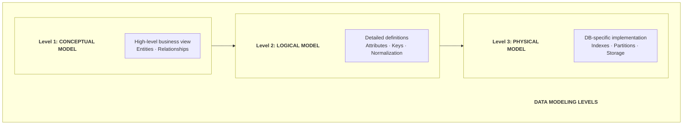
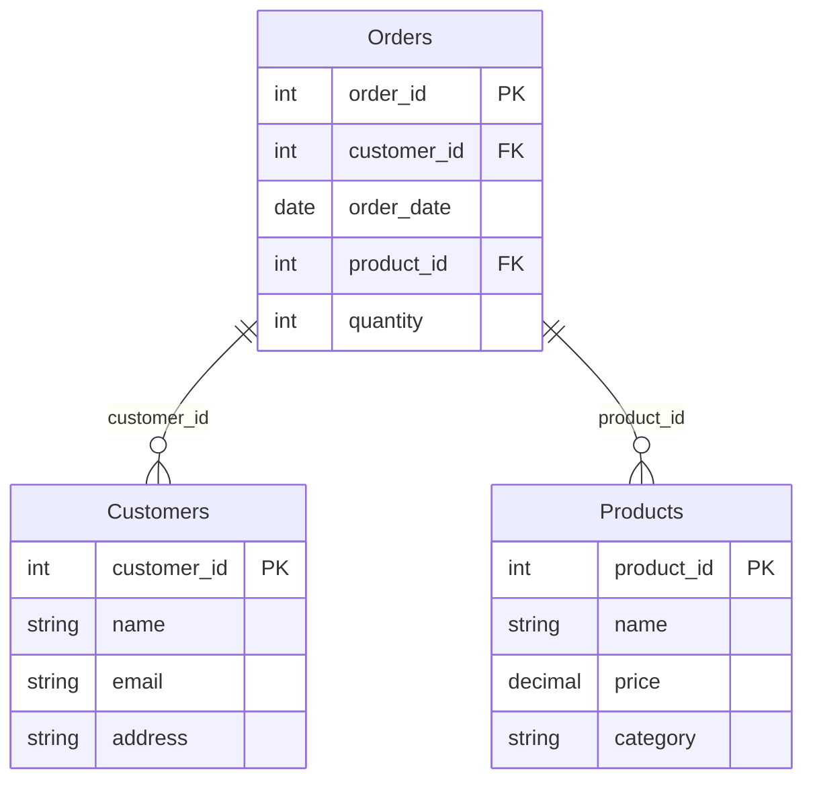
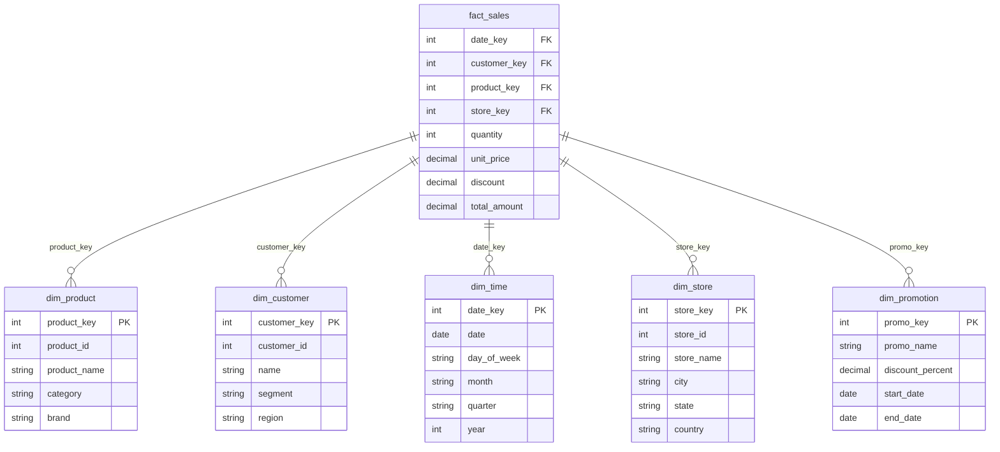
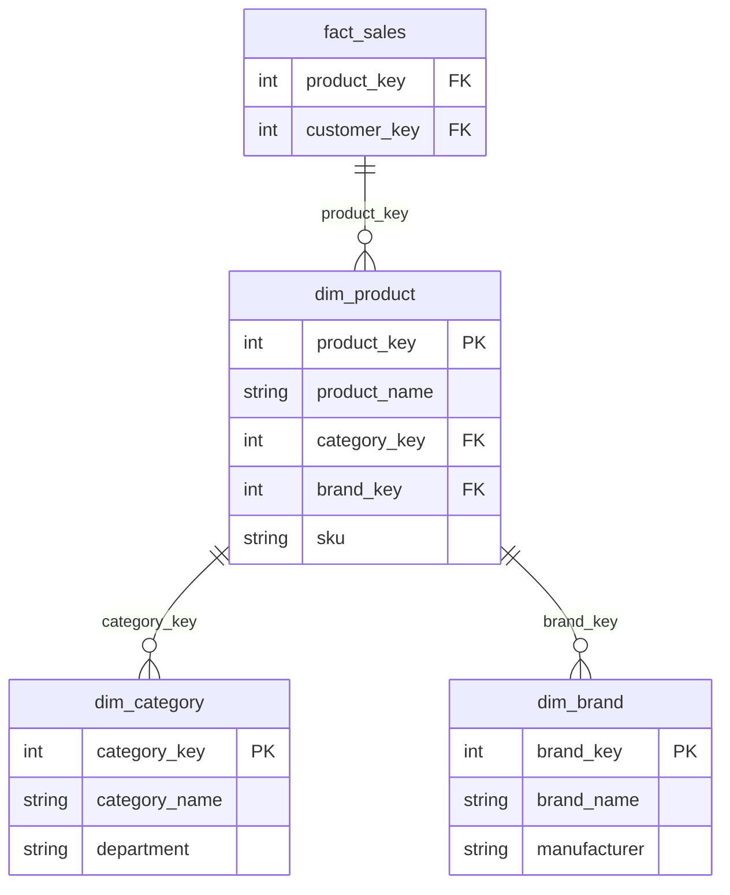
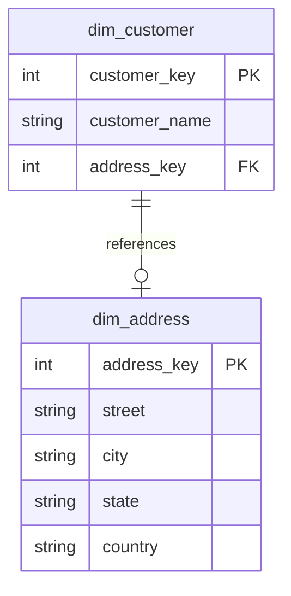
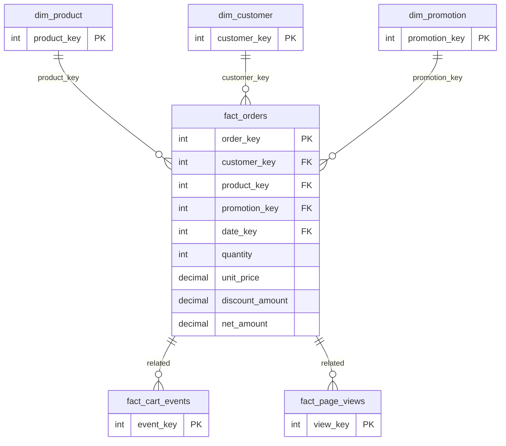
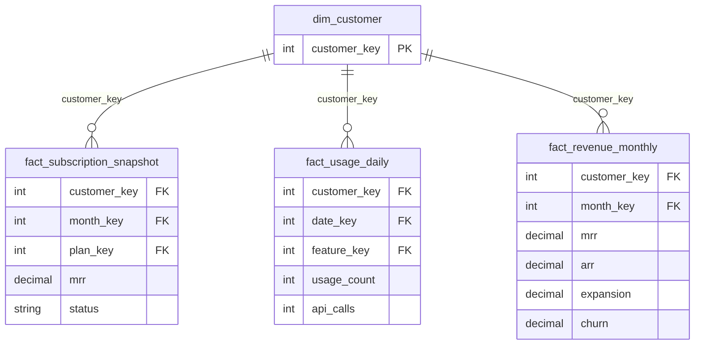
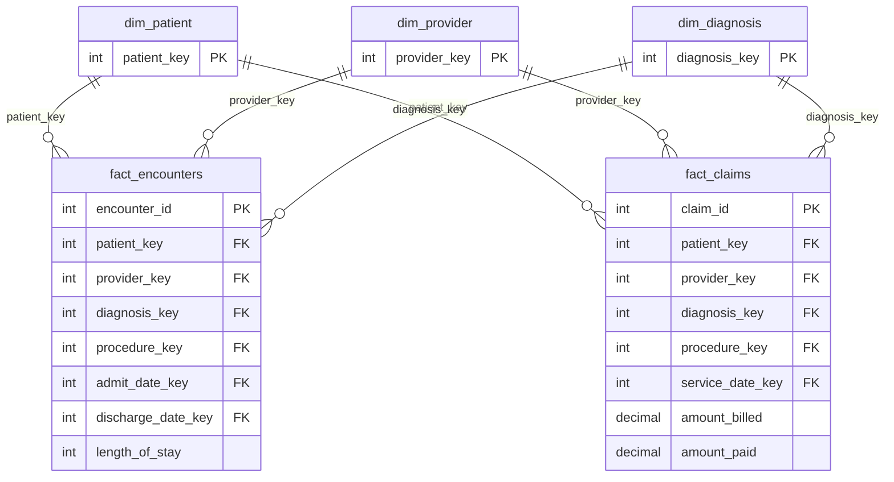

# Data Modeling Fundamentals - Complete Guide

## Dimensional Modeling, Data Vault, và các Pattern Thiết Kế Dữ Liệu

---

## PHẦN 1: TỔNG QUAN VỀ DATA MODELING

### 1.1 Data Modeling Là Gì?

Data Modeling là quá trình tạo ra một mô hình trực quan đại diện cho cách dữ liệu được tổ chức, lưu trữ và truy cập trong một hệ thống. Đây là nền tảng cốt lõi của Data Engineering.

**Tầm quan trọng:**
- Đảm bảo data integrity và consistency
- Tối ưu performance cho queries
- Tạo foundation cho analytics và reporting
- Documentation cho business logic
- Giảm data redundancy và storage costs

### 1.2 Các Cấp Độ Data Modeling



### 1.3 Lịch Sử Phát Triển

**Timeline:**

```d
1970  - E.F. Codd giới thiệu Relational Model
  |
1976  - Peter Chen giới thiệu ER (Entity-Relationship) Model
  |
1983  - Bill Inmon định nghĩa Data Warehouse concept
  |
1996  - Ralph Kimball xuất bản "The Data Warehouse Toolkit"
        Dimensional Modeling trở thành standard
  |
2000  - Dan Linstedt giới thiệu Data Vault 1.0
  |
2013  - Data Vault 2.0 ra đời
  |
2015  - Data Mesh concepts bắt đầu xuất hiện
  |
2020  - Lakehouse architecture kết hợp best of both worlds
  |
2025  - AI-assisted modeling, automated schema evolution
```

---

## PHẦN 2: NORMALIZATION (CHUẨN HÓA DỮ LIỆU)

### 2.1 Tại Sao Cần Normalization?

**Vấn đề với unnormalized data:**
- Data redundancy (lặp lại dữ liệu)
- Update anomalies (inconsistent updates)
- Insert anomalies (cannot insert partial data)
- Delete anomalies (unintended data loss)

**Ví dụ Unnormalized Data:**

| OrderID | CustomerName | CustomerEmail | Product | Price |
|---|---|---|---|---|
| 1001 | John Doe | john@email.com | Laptop | 1000 |
| 1001 | John Doe | john@email.com | Mouse | 50 |
| 1002 | Jane Smith | jane@email.com | Laptop | 1000 |
| 1003 | John Doe | john@NEW.com | Keyboard | 100 | ← Inconsistent!

Problems:
- Customer info repeated for each order
- Email inconsistency for John Doe
- Wasted storage

### 2.2 Các Normal Forms

**First Normal Form (1NF):**
- Loại bỏ repeating groups
- Mỗi cell chứa atomic value
- Có primary key

**BEFORE (Violates 1NF):**

| StudentID | Name | Courses |
|---|---|---|
| 1 | Alice | Math, Physics, Chem | ← Multiple values

**AFTER (1NF):**

| StudentID | Name | Course |
|---|---|---|
| 1 | Alice | Math |
| 1 | Alice | Physics |
| 1 | Alice | Chemistry |

**Second Normal Form (2NF):**
- Phải đạt 1NF
- Loại bỏ partial dependencies
- Non-key attributes phụ thuộc hoàn toàn vào primary key

**BEFORE (Violates 2NF):**
Composite Key: (StudentID, CourseID)

| StudentID | CourseID | StudentName | CourseName |
|---|---|---|---|
| 1 | C101 | Alice | Mathematics |

Problem: StudentName depends only on StudentID (partial dependency)

**AFTER (2NF):**

Table: Students

| StudentID | Name |
|---|---|
| 1 | Alice |

Table: Courses

| CourseID | CourseName |
|---|---|
| C101 | Mathematics |

Table: Enrollments

| StudentID | CourseID |
|---|---|
| 1 | C101 |

**Third Normal Form (3NF):**
- Phải đạt 2NF
- Loại bỏ transitive dependencies
- Non-key attributes không phụ thuộc vào non-key khác

**BEFORE (Violates 3NF):**

| EmployeeID | DepartmentID | DepartmentName |
|---|---|---|
| E001 | D01 | Engineering |

Problem: DepartmentName depends on DepartmentID (transitive)

**AFTER (3NF):**

Table: Employees

| EmployeeID | DepartmentID |
|---|---|
| E001 | D01 |

Table: Departments

| DepartmentID | Name |
|---|---|
| D01 | Engineering |

**Boyce-Codd Normal Form (BCNF):**
- Phải đạt 3NF
- Mọi determinant phải là candidate key

**Fourth Normal Form (4NF):**
- Phải đạt BCNF
- Loại bỏ multi-valued dependencies

**Fifth Normal Form (5NF):**
- Phải đạt 4NF
- Loại bỏ join dependencies

### 2.3 Denormalization

**Khi nào cần Denormalize:**
- Read-heavy workloads
- Analytics và reporting
- Reduce join complexity
- Improve query performance

**Trade-offs:**
- Faster reads vs slower writes
- More storage vs less computation
- Simpler queries vs complex updates

**NORMALIZED (OLTP optimized):**



DENORMALIZED (Analytics optimized):

| Orders_Denormalized | |
|---|---|
| order_id | |
| order_date | |
| customer_id | |
| customer_name | ← duplicated from Customers |
| customer_email | ← duplicated from Customers |
| product_id | |
| product_name | ← duplicated from Products |
| product_category | ← duplicated from Products |
| quantity | |
| unit_price | |
| total_amount | ← pre-calculated |
```

---

## PHẦN 3: DIMENSIONAL MODELING (KIMBALL)

### 3.1 Giới Thiệu Dimensional Modeling

Ralph Kimball phát triển Dimensional Modeling như một approach tối ưu cho analytics và reporting. Đây là standard trong Data Warehousing.

**Core Principles:**
- Focus on business process
- Usability over normalization
- Optimized for queries
- Understandable by business users

### 3.2 Star Schema

**Cấu trúc:**



**Fact Table:**
- Chứa measurements/metrics (quantitative data)
- Foreign keys đến dimension tables
- Usually very large (millions/billions of rows)
- Grain: most atomic level of data

**Dimension Tables:**
- Chứa descriptive attributes
- Context cho facts
- Usually smaller, wide tables
- Support filtering, grouping, labeling

### 3.3 Snowflake Schema

Snowflake Schema là Star Schema với dimensions được normalize.



**Star vs Snowflake:**

**Star Schema:**
- Simpler queries (fewer joins)
- Better query performance
- More storage space
- Easier for business users
- Recommended by Kimball

**Snowflake Schema:**
- Less storage space
- Easier maintenance
- More complex queries
- Better for slowly changing dimensions
- Trade-off: performance vs storage

### 3.4 Types of Fact Tables

**Transaction Fact Table:**
- One row per transaction
- Most common type
- Grain: individual event

```sql
-- Example: Sales transactions
CREATE TABLE fact_sales (
    sale_id BIGINT PRIMARY KEY,
    date_key INT,
    customer_key INT,
    product_key INT,
    store_key INT,
    quantity INT,
    unit_price DECIMAL(10,2),
    discount DECIMAL(10,2),
    total_amount DECIMAL(12,2)
);
```

**Periodic Snapshot Fact Table:**
- One row per period
- Captures state at regular intervals
- Grain: time period

```sql
-- Example: Monthly account balances
CREATE TABLE fact_account_monthly (
    month_key INT,
    account_key INT,
    opening_balance DECIMAL(15,2),
    deposits DECIMAL(15,2),
    withdrawals DECIMAL(15,2),
    closing_balance DECIMAL(15,2),
    avg_daily_balance DECIMAL(15,2),
    PRIMARY KEY (month_key, account_key)
);
```

**Accumulating Snapshot Fact Table:**
- One row per lifecycle
- Multiple date keys
- Updated as process progresses
- Grain: business process instance

```sql
-- Example: Order fulfillment
CREATE TABLE fact_order_fulfillment (
    order_key INT PRIMARY KEY,
    order_date_key INT,
    payment_date_key INT,
    ship_date_key INT,
    delivery_date_key INT,
    customer_key INT,
    product_key INT,
    order_amount DECIMAL(12,2),
    days_to_payment INT,
    days_to_ship INT,
    days_to_delivery INT
);
```

**Factless Fact Table:**
- No measurements
- Records events or coverage
- Used for tracking what happened or what's possible

```sql
-- Example: Student attendance (event tracking)
CREATE TABLE fact_attendance (
    date_key INT,
    student_key INT,
    class_key INT,
    teacher_key INT,
    PRIMARY KEY (date_key, student_key, class_key)
);

-- Example: Store-Product coverage (what's possible)
CREATE TABLE fact_store_product_coverage (
    date_key INT,
    store_key INT,
    product_key INT,
    PRIMARY KEY (date_key, store_key, product_key)
);
```

### 3.5 Types of Dimensions

**Conformed Dimensions:**
- Shared across multiple fact tables
- Single source of truth
- Enables cross-process analysis

```d
dim_customer (Conformed)
        |
        +-----> fact_sales
        |
        +-----> fact_returns
        |
        +-----> fact_web_clicks
        |
        +-----> fact_support_tickets
```

**Role-Playing Dimensions:**
- Same dimension used multiple times
- Different meaning in each context

```sql
-- Date dimension plays different roles
SELECT 
    od.date AS order_date,
    sd.date AS ship_date,
    dd.date AS delivery_date,
    f.order_amount
FROM fact_orders f
JOIN dim_date od ON f.order_date_key = od.date_key
JOIN dim_date sd ON f.ship_date_key = sd.date_key
JOIN dim_date dd ON f.delivery_date_key = dd.date_key;
```

**Junk Dimensions:**
- Collection of miscellaneous flags/indicators
- Reduces fact table width
- Avoids many small dimensions

```sql
-- Instead of multiple flag columns in fact table
CREATE TABLE dim_transaction_profile (
    profile_key INT PRIMARY KEY,
    is_online BOOLEAN,
    is_member BOOLEAN,
    payment_type VARCHAR(20),  -- 'cash', 'credit', 'debit'
    gift_wrap BOOLEAN,
    express_shipping BOOLEAN
);

-- Only 2^5 = 32 possible combinations
-- Much smaller than storing 5 FKs
```

**Degenerate Dimensions:**
- Dimension key without dimension table
- Usually transaction identifiers
- Stored directly in fact table

```sql
CREATE TABLE fact_sales (
    date_key INT,
    customer_key INT,
    product_key INT,
    invoice_number VARCHAR(20),  -- Degenerate dimension
    receipt_number VARCHAR(20),  -- Degenerate dimension
    quantity INT,
    amount DECIMAL(12,2)
);
```

**Outrigger Dimensions:**
- Dimension referenced by another dimension
- Creates snowflake within star



---

## PHẦN 4: SLOWLY CHANGING DIMENSIONS (SCD)

### 4.1 Tổng Quan SCD

Slowly Changing Dimensions xử lý việc dimension attributes thay đổi theo thời gian.

### 4.2 SCD Type 0 - Retain Original

- Không thay đổi, giữ giá trị ban đầu
- Use case: Original registration date, birth date

```sql
-- Customer birth date never changes
UPDATE dim_customer 
SET birth_date = '1990-01-01'  -- Never execute this!
WHERE customer_key = 123;
```

### 4.3 SCD Type 1 - Overwrite

- Ghi đè giá trị cũ
- Không giữ history
- Simple nhưng mất lịch sử

```sql
-- Before: Customer moved to new city
-- current_city = 'New York'

UPDATE dim_customer
SET current_city = 'Los Angeles',
    updated_at = CURRENT_TIMESTAMP
WHERE customer_key = 123;

-- After: current_city = 'Los Angeles'
-- History lost!
```

**Use cases:**
- Correcting errors
- Attributes không cần history
- Storage-constrained environments

### 4.4 SCD Type 2 - Add New Row

- Thêm row mới với version mới
- Giữ full history
- Most common approach

```sql
-- Dimension table structure
CREATE TABLE dim_customer (
    customer_key INT PRIMARY KEY,           -- Surrogate key
    customer_id VARCHAR(20),                -- Natural key
    customer_name VARCHAR(100),
    city VARCHAR(50),
    effective_date DATE,
    expiry_date DATE,
    is_current BOOLEAN,
    version INT
);

-- Initial record
INSERT INTO dim_customer VALUES 
(1001, 'C123', 'John Doe', 'New York', '2020-01-01', '9999-12-31', TRUE, 1);

-- When customer moves (Type 2 change):
-- Step 1: Expire current record
UPDATE dim_customer
SET expiry_date = '2024-06-30',
    is_current = FALSE
WHERE customer_key = 1001;

-- Step 2: Insert new record
INSERT INTO dim_customer VALUES 
(1002, 'C123', 'John Doe', 'Los Angeles', '2024-07-01', '9999-12-31', TRUE, 2);
```

**Querying SCD Type 2:**

```sql
-- Current view
SELECT * FROM dim_customer WHERE is_current = TRUE;

-- Point-in-time view
SELECT * FROM dim_customer 
WHERE effective_date <= '2023-01-15' 
  AND expiry_date > '2023-01-15';

-- Full history
SELECT * FROM dim_customer 
WHERE customer_id = 'C123'
ORDER BY version;
```

### 4.5 SCD Type 3 - Add New Column

- Thêm column cho previous value
- Limited history (chỉ giữ 1-2 versions)

```sql
CREATE TABLE dim_customer (
    customer_key INT PRIMARY KEY,
    customer_id VARCHAR(20),
    current_city VARCHAR(50),
    previous_city VARCHAR(50),
    city_change_date DATE
);

-- Update when city changes
UPDATE dim_customer
SET previous_city = current_city,
    current_city = 'Los Angeles',
    city_change_date = CURRENT_DATE
WHERE customer_key = 1001;
```

**Pros:**
- Simple structure
- No row explosion

**Cons:**
- Limited history
- Schema changes for each tracked attribute

### 4.6 SCD Type 4 - History Table

- Separate table cho history
- Current values in main table
- Full history in history table

```sql
-- Current dimension
CREATE TABLE dim_customer (
    customer_key INT PRIMARY KEY,
    customer_id VARCHAR(20),
    customer_name VARCHAR(100),
    city VARCHAR(50),
    updated_at TIMESTAMP
);

-- History table
CREATE TABLE dim_customer_history (
    history_id INT PRIMARY KEY,
    customer_key INT,
    customer_id VARCHAR(20),
    customer_name VARCHAR(100),
    city VARCHAR(50),
    valid_from TIMESTAMP,
    valid_to TIMESTAMP,
    change_type VARCHAR(20)
);

-- On update, insert into history first
INSERT INTO dim_customer_history
SELECT 
    nextval('history_seq'),
    customer_key,
    customer_id,
    customer_name,
    city,
    updated_at,
    CURRENT_TIMESTAMP,
    'UPDATE'
FROM dim_customer
WHERE customer_key = 1001;

-- Then update main table
UPDATE dim_customer
SET city = 'Los Angeles',
    updated_at = CURRENT_TIMESTAMP
WHERE customer_key = 1001;
```

### 4.7 SCD Type 6 - Hybrid (1+2+3)

Kết hợp Type 1, 2, và 3:
- Type 2: New rows for history
- Type 3: Previous value column
- Type 1: Update current value in all rows

```sql
CREATE TABLE dim_customer (
    customer_key INT PRIMARY KEY,           -- Surrogate key
    customer_id VARCHAR(20),                -- Natural key
    customer_name VARCHAR(100),
    historical_city VARCHAR(50),            -- Type 2: value at this version
    current_city VARCHAR(50),               -- Type 1: always current
    previous_city VARCHAR(50),              -- Type 3: previous value
    effective_date DATE,
    expiry_date DATE,
    is_current BOOLEAN
);

-- Initial state
-- customer_key=1001, historical_city='NYC', current_city='NYC', previous_city=NULL

-- After move to LA:
-- Row 1: customer_key=1001, historical_city='NYC', current_city='LA', previous_city='NYC'
-- Row 2: customer_key=1002, historical_city='LA', current_city='LA', previous_city='NYC'
```

### 4.8 SCD Implementation với SQL

```sql
-- Complete SCD Type 2 implementation with MERGE
MERGE INTO dim_customer target
USING staging_customer source
ON target.customer_id = source.customer_id AND target.is_current = TRUE
WHEN MATCHED AND (
    target.customer_name != source.customer_name OR
    target.city != source.city
) THEN UPDATE SET
    expiry_date = CURRENT_DATE - INTERVAL '1 day',
    is_current = FALSE
WHEN NOT MATCHED THEN INSERT (
    customer_key, customer_id, customer_name, city,
    effective_date, expiry_date, is_current
) VALUES (
    nextval('customer_key_seq'),
    source.customer_id,
    source.customer_name,
    source.city,
    CURRENT_DATE,
    '9999-12-31',
    TRUE
);

-- Insert new versions for updated records
INSERT INTO dim_customer
SELECT 
    nextval('customer_key_seq'),
    s.customer_id,
    s.customer_name,
    s.city,
    CURRENT_DATE,
    '9999-12-31',
    TRUE
FROM staging_customer s
JOIN dim_customer d ON s.customer_id = d.customer_id
WHERE d.is_current = FALSE 
  AND d.expiry_date = CURRENT_DATE - INTERVAL '1 day';
```

---

## PHẦN 5: DATA VAULT MODELING

### 5.1 Giới Thiệu Data Vault

Data Vault được phát triển bởi Dan Linstedt như một alternative cho Dimensional Modeling, đặc biệt phù hợp cho:
- Enterprise Data Warehouse
- Agile development
- Full auditability
- Handling change

### 5.2 Core Components

**Data Vault Architecture:**

```mermaid
flowchart LR
    subgraph SRC[" "]
        SRC_title["SOURCE SYSTEMS"]
        style SRC_title fill:none,stroke:none,color:#333,font-weight:bold
        ERP["ERP"]
        CRM["CRM"]
        Files["Files"]
        APIs["APIs"]
    end

    SRC -->|"Staging"| RV

    subgraph RV[" "]
        RV_title["RAW VAULT"]
        style RV_title fill:none,stroke:none,color:#333,font-weight:bold
        Hubs["Hubs<br>(Business Keys)"]
        Links["Links<br>(Relations)"]
        Sats["Satellites<br>(Context)"]
    end

    RV -->|"Transform"| BV

    subgraph BV[" "]
        BV_title["BUSINESS VAULT"]
        style BV_title fill:none,stroke:none,color:#333,font-weight:bold
        PIT["PIT Tables"]
        Bridge["Bridge Tables"]
        Calc["Calculated Attrs"]
    end

    BV --> IM["INFORMATION MART<br>(Star Schema)"]
```



**Hub:**
- Chứa unique business keys
- Không bao giờ thay đổi
- Core identity của business entity

```sql
CREATE TABLE hub_customer (
    hub_customer_hashkey CHAR(32) PRIMARY KEY,  -- MD5/SHA hash of business key
    load_date TIMESTAMP NOT NULL,
    record_source VARCHAR(100) NOT NULL,
    customer_id VARCHAR(50) NOT NULL            -- Business key
);

-- Example hash generation
-- hub_customer_hashkey = MD5('C12345')
```

**Link:**
- Represents relationships between Hubs
- Many-to-many capable
- Tracks relationship history

```sql
CREATE TABLE link_customer_order (
    link_customer_order_hashkey CHAR(32) PRIMARY KEY,
    hub_customer_hashkey CHAR(32) NOT NULL,
    hub_order_hashkey CHAR(32) NOT NULL,
    load_date TIMESTAMP NOT NULL,
    record_source VARCHAR(100) NOT NULL,
    FOREIGN KEY (hub_customer_hashkey) REFERENCES hub_customer(hub_customer_hashkey),
    FOREIGN KEY (hub_order_hashkey) REFERENCES hub_order(hub_order_hashkey)
);
```

**Satellite:**
- Chứa descriptive attributes
- Tracks history (SCD Type 2 built-in)
- Attached to Hubs or Links

```sql
CREATE TABLE sat_customer_details (
    hub_customer_hashkey CHAR(32) NOT NULL,
    load_date TIMESTAMP NOT NULL,
    load_end_date TIMESTAMP,
    record_source VARCHAR(100) NOT NULL,
    hash_diff CHAR(32) NOT NULL,               -- Hash of all attributes for change detection
    customer_name VARCHAR(100),
    email VARCHAR(100),
    phone VARCHAR(20),
    address VARCHAR(200),
    city VARCHAR(50),
    country VARCHAR(50),
    PRIMARY KEY (hub_customer_hashkey, load_date),
    FOREIGN KEY (hub_customer_hashkey) REFERENCES hub_customer(hub_customer_hashkey)
);
```

### 5.3 Data Vault 2.0 Enhancements

**Hash Keys:**
- Use MD5 or SHA-256 for consistent key generation
- Enables parallel loading
- Deterministic joins

```python
import hashlib

def generate_hash_key(*business_keys):
    """Generate consistent hash key from business keys"""
    concatenated = '|'.join(str(k).upper().strip() for k in business_keys)
    return hashlib.md5(concatenated.encode()).hexdigest()

# Example
customer_hash = generate_hash_key('C12345')
order_hash = generate_hash_key('ORD-2024-001')
link_hash = generate_hash_key('C12345', 'ORD-2024-001')
```

**Hash Diff:**
- Detect changes in satellite attributes
- Avoid comparing all columns

```python
def generate_hash_diff(*attributes):
    """Generate hash of all attributes for change detection"""
    concatenated = '|'.join(str(a) if a is not None else '' for a in attributes)
    return hashlib.md5(concatenated.encode()).hexdigest()

# Only insert new satellite record if hash_diff changed
current_hash_diff = generate_hash_diff(name, email, phone, address)
if current_hash_diff != previous_hash_diff:
    insert_new_satellite_record()
```

### 5.4 Complete Data Vault Example

```sql
-- HUBS
CREATE TABLE hub_customer (
    hub_customer_hk CHAR(32) PRIMARY KEY,
    load_dts TIMESTAMP NOT NULL,
    rec_src VARCHAR(100) NOT NULL,
    customer_bk VARCHAR(50) NOT NULL  -- Business Key
);

CREATE TABLE hub_product (
    hub_product_hk CHAR(32) PRIMARY KEY,
    load_dts TIMESTAMP NOT NULL,
    rec_src VARCHAR(100) NOT NULL,
    product_bk VARCHAR(50) NOT NULL
);

CREATE TABLE hub_order (
    hub_order_hk CHAR(32) PRIMARY KEY,
    load_dts TIMESTAMP NOT NULL,
    rec_src VARCHAR(100) NOT NULL,
    order_bk VARCHAR(50) NOT NULL
);

-- LINKS
CREATE TABLE lnk_order_customer (
    lnk_order_customer_hk CHAR(32) PRIMARY KEY,
    hub_order_hk CHAR(32) NOT NULL,
    hub_customer_hk CHAR(32) NOT NULL,
    load_dts TIMESTAMP NOT NULL,
    rec_src VARCHAR(100) NOT NULL
);

CREATE TABLE lnk_order_product (
    lnk_order_product_hk CHAR(32) PRIMARY KEY,
    hub_order_hk CHAR(32) NOT NULL,
    hub_product_hk CHAR(32) NOT NULL,
    load_dts TIMESTAMP NOT NULL,
    rec_src VARCHAR(100) NOT NULL
);

-- SATELLITES
CREATE TABLE sat_customer (
    hub_customer_hk CHAR(32) NOT NULL,
    load_dts TIMESTAMP NOT NULL,
    load_end_dts TIMESTAMP,
    rec_src VARCHAR(100) NOT NULL,
    hash_diff CHAR(32) NOT NULL,
    customer_name VARCHAR(100),
    email VARCHAR(100),
    segment VARCHAR(50),
    PRIMARY KEY (hub_customer_hk, load_dts)
);

CREATE TABLE sat_order (
    hub_order_hk CHAR(32) NOT NULL,
    load_dts TIMESTAMP NOT NULL,
    load_end_dts TIMESTAMP,
    rec_src VARCHAR(100) NOT NULL,
    hash_diff CHAR(32) NOT NULL,
    order_date DATE,
    status VARCHAR(20),
    total_amount DECIMAL(12,2),
    PRIMARY KEY (hub_order_hk, load_dts)
);

-- EFFECTIVITY SATELLITE (for Links)
CREATE TABLE sat_order_customer_eff (
    lnk_order_customer_hk CHAR(32) NOT NULL,
    load_dts TIMESTAMP NOT NULL,
    load_end_dts TIMESTAMP,
    rec_src VARCHAR(100) NOT NULL,
    is_active BOOLEAN DEFAULT TRUE,
    PRIMARY KEY (lnk_order_customer_hk, load_dts)
);
```

### 5.5 Point-In-Time (PIT) Tables

PIT tables simplify querying historical data:

```sql
-- PIT table for customer
CREATE TABLE pit_customer AS
WITH date_spine AS (
    SELECT DISTINCT load_dts::DATE as as_of_date
    FROM sat_customer
),
customer_pit AS (
    SELECT 
        ds.as_of_date,
        h.hub_customer_hk,
        h.customer_bk,
        (
            SELECT MAX(load_dts) 
            FROM sat_customer s 
            WHERE s.hub_customer_hk = h.hub_customer_hk 
              AND s.load_dts <= ds.as_of_date
        ) as sat_customer_load_dts
    FROM date_spine ds
    CROSS JOIN hub_customer h
)
SELECT * FROM customer_pit;

-- Query using PIT
SELECT 
    pit.as_of_date,
    pit.customer_bk,
    sat.customer_name,
    sat.email,
    sat.segment
FROM pit_customer pit
JOIN sat_customer sat 
    ON pit.hub_customer_hk = sat.hub_customer_hk 
   AND pit.sat_customer_load_dts = sat.load_dts
WHERE pit.as_of_date = '2024-01-15';
```

### 5.6 Bridge Tables

Bridge tables pre-join multiple hubs through links:

```sql
-- Bridge for Customer-Order relationship
CREATE TABLE bridge_customer_orders AS
SELECT 
    h_cust.hub_customer_hk,
    h_cust.customer_bk,
    h_ord.hub_order_hk,
    h_ord.order_bk,
    lnk.load_dts as relationship_start_date
FROM hub_customer h_cust
JOIN lnk_order_customer lnk ON h_cust.hub_customer_hk = lnk.hub_customer_hk
JOIN hub_order h_ord ON lnk.hub_order_hk = h_ord.hub_order_hk;
```

---

## PHẦN 6: ONE BIG TABLE (OBT) PATTERN

### 6.1 OBT Concept

One Big Table là pattern denormalize tất cả vào một table rộng, phổ biến trong modern analytics với columnar storage.

```d
Traditional Star Schema:
fact_sales + dim_customer + dim_product + dim_store + dim_date
= 5 tables, multiple joins

OBT Approach:
sales_obt (all columns from all tables)
= 1 table, no joins
```

### 6.2 When to Use OBT

**Good for:**
- Columnar databases (Snowflake, BigQuery, Redshift)
- Read-heavy analytics workloads
- Simple query patterns
- Self-service BI

**Not good for:**
- OLTP systems
- Frequently updated dimensions
- Storage-constrained environments
- Complex hierarchies

### 6.3 OBT Implementation

```sql
-- Create OBT from star schema
CREATE TABLE sales_obt AS
SELECT 
    -- Fact measures
    f.sale_id,
    f.quantity,
    f.unit_price,
    f.discount,
    f.total_amount,
    
    -- Date dimension
    d.date,
    d.day_of_week,
    d.day_name,
    d.week_of_year,
    d.month,
    d.month_name,
    d.quarter,
    d.year,
    d.is_weekend,
    d.is_holiday,
    
    -- Customer dimension
    c.customer_id,
    c.customer_name,
    c.customer_email,
    c.customer_segment,
    c.customer_region,
    c.customer_country,
    c.customer_since_date,
    c.lifetime_value,
    
    -- Product dimension
    p.product_id,
    p.product_name,
    p.product_category,
    p.product_subcategory,
    p.brand,
    p.supplier,
    p.unit_cost,
    
    -- Store dimension
    s.store_id,
    s.store_name,
    s.store_type,
    s.store_city,
    s.store_state,
    s.store_country,
    s.store_region,
    
    -- Calculated fields
    f.quantity * f.unit_price as gross_amount,
    f.total_amount - (f.quantity * p.unit_cost) as profit,
    
    -- Timestamp
    CURRENT_TIMESTAMP as etl_timestamp
    
FROM fact_sales f
JOIN dim_date d ON f.date_key = d.date_key
JOIN dim_customer c ON f.customer_key = c.customer_key
JOIN dim_product p ON f.product_key = p.product_key
JOIN dim_store s ON f.store_key = s.store_key;

-- Partition for performance
-- In BigQuery:
CREATE TABLE sales_obt
PARTITION BY date
CLUSTER BY customer_segment, product_category
AS SELECT ...;

-- In Snowflake (auto-clustering):
CREATE TABLE sales_obt
CLUSTER BY (date, customer_segment)
AS SELECT ...;
```

### 6.4 OBT Maintenance

```sql
-- Incremental update for OBT
MERGE INTO sales_obt target
USING (
    SELECT 
        f.sale_id,
        -- all columns...
    FROM fact_sales f
    JOIN dim_date d ON f.date_key = d.date_key
    -- other joins...
    WHERE f.updated_at > (SELECT MAX(etl_timestamp) FROM sales_obt)
) source
ON target.sale_id = source.sale_id
WHEN MATCHED THEN UPDATE SET
    quantity = source.quantity,
    -- other columns...
    etl_timestamp = CURRENT_TIMESTAMP
WHEN NOT MATCHED THEN INSERT (
    sale_id, quantity, -- other columns...
) VALUES (
    source.sale_id, source.quantity, -- other values...
);
```

---

## PHẦN 7: ACTIVITY SCHEMA

### 7.1 Activity Schema Concept

Activity Schema (by Ahmed Elsamadisi) là modern approach cho event data, tối ưu cho behavioral analytics.

**Core idea:**
- Single activity table
- Self-joining pattern
- Optimized for event sequences

### 7.2 Structure

```sql
-- Activity Stream table
CREATE TABLE activity_stream (
    activity_id BIGINT PRIMARY KEY,
    customer_id VARCHAR(50) NOT NULL,
    activity VARCHAR(100) NOT NULL,      -- 'page_view', 'purchase', 'signup'
    activity_ts TIMESTAMP NOT NULL,
    
    -- Feature columns (sparse, activity-specific)
    feature_1 VARCHAR(500),              -- page_url for page_view
    feature_2 VARCHAR(500),              -- product_id for purchase
    feature_3 VARCHAR(500),              -- amount for purchase
    
    -- Enrichment columns
    revenue_impact DECIMAL(12,2),
    
    -- Activity occurrence number
    activity_occurrence INT,             -- 1st, 2nd, 3rd time doing this
    
    -- Timestamps relative to customer
    ts_since_first_activity INTERVAL,
    ts_since_previous_activity INTERVAL
);

-- Entity table (customer in this case)
CREATE TABLE entity_customer (
    customer_id VARCHAR(50) PRIMARY KEY,
    first_activity_ts TIMESTAMP,
    last_activity_ts TIMESTAMP,
    total_activities INT,
    total_purchases INT,
    total_revenue DECIMAL(12,2)
);
```

### 7.3 Query Patterns

```sql
-- Customer journey analysis
SELECT 
    customer_id,
    activity,
    activity_ts,
    activity_occurrence,
    ts_since_previous_activity
FROM activity_stream
WHERE customer_id = 'C12345'
ORDER BY activity_ts;

-- Funnel analysis: Signup -> First Purchase
WITH signup AS (
    SELECT customer_id, activity_ts as signup_ts
    FROM activity_stream
    WHERE activity = 'signup'
      AND activity_occurrence = 1
),
first_purchase AS (
    SELECT customer_id, activity_ts as purchase_ts, feature_3::DECIMAL as amount
    FROM activity_stream
    WHERE activity = 'purchase'
      AND activity_occurrence = 1
)
SELECT 
    s.customer_id,
    s.signup_ts,
    fp.purchase_ts,
    fp.amount,
    fp.purchase_ts - s.signup_ts as time_to_first_purchase
FROM signup s
LEFT JOIN first_purchase fp ON s.customer_id = fp.customer_id;

-- Cohort retention
WITH cohorts AS (
    SELECT 
        customer_id,
        DATE_TRUNC('month', MIN(activity_ts)) as cohort_month
    FROM activity_stream
    GROUP BY customer_id
),
monthly_activity AS (
    SELECT 
        c.cohort_month,
        DATE_TRUNC('month', a.activity_ts) as activity_month,
        COUNT(DISTINCT a.customer_id) as active_customers
    FROM activity_stream a
    JOIN cohorts c ON a.customer_id = c.customer_id
    GROUP BY 1, 2
)
SELECT 
    cohort_month,
    activity_month,
    active_customers,
    active_customers::FLOAT / FIRST_VALUE(active_customers) 
        OVER (PARTITION BY cohort_month ORDER BY activity_month) as retention_rate
FROM monthly_activity
ORDER BY cohort_month, activity_month;
```

---

## PHẦN 8: MODERN DATA MODELING BEST PRACTICES

### 8.1 Naming Conventions

**Tables:**
- Use snake_case: `customer_orders`
- Prefix by type: `dim_`, `fact_`, `stg_`, `int_`
- Be descriptive: `dim_customer` not `dim_cust`

**Columns:**
- Use snake_case: `first_name`
- Use suffix for types: `_id`, `_key`, `_at`, `_date`, `_amount`
- Boolean prefix: `is_`, `has_`, `can_`

```sql
-- Good naming examples
dim_customer
fact_sales
stg_raw_orders
int_customer_orders

customer_id          -- natural key
customer_key         -- surrogate key
created_at           -- timestamp
order_date           -- date
total_amount         -- money
is_active           -- boolean
has_subscription    -- boolean
```

### 8.2 Documentation

```sql
-- Use COMMENT for documentation
CREATE TABLE dim_customer (
    customer_key INT PRIMARY KEY COMMENT 'Surrogate key for dimension',
    customer_id VARCHAR(50) COMMENT 'Natural business key from source system',
    customer_name VARCHAR(100) COMMENT 'Full name of customer',
    segment VARCHAR(50) COMMENT 'Market segment: Enterprise, SMB, Consumer',
    is_current BOOLEAN COMMENT 'TRUE if this is the current version (SCD Type 2)'
) COMMENT 'Customer dimension with SCD Type 2 history tracking';
```

### 8.3 Data Types

**Choose appropriate types:**
- Use DECIMAL for money, not FLOAT
- Use appropriate VARCHAR lengths
- Use DATE vs TIMESTAMP correctly
- Consider timezone handling

```sql
-- Money: Use DECIMAL
total_amount DECIMAL(18,2)   -- Good
total_amount FLOAT           -- Bad (precision issues)

-- IDs: Consider future growth
user_id BIGINT              -- Good for large scale
user_id INT                 -- OK for smaller systems
user_id VARCHAR(50)         -- Good for external/string IDs

-- Timestamps: Include timezone info
created_at TIMESTAMP WITH TIME ZONE   -- Good
created_at TIMESTAMP                   -- May cause confusion
```

### 8.4 Performance Considerations

**Partitioning:**
```sql
-- Partition by date for time-series data
CREATE TABLE fact_events
PARTITION BY RANGE (event_date) (
    PARTITION p_2024_q1 VALUES LESS THAN ('2024-04-01'),
    PARTITION p_2024_q2 VALUES LESS THAN ('2024-07-01'),
    PARTITION p_2024_q3 VALUES LESS THAN ('2024-10-01'),
    PARTITION p_2024_q4 VALUES LESS THAN ('2025-01-01')
);
```

**Clustering:**
```sql
-- Snowflake automatic clustering
ALTER TABLE fact_sales CLUSTER BY (date, customer_key);

-- BigQuery clustering
CREATE TABLE fact_sales
PARTITION BY date
CLUSTER BY customer_id, product_id
AS SELECT ...;
```

**Indexing (for OLTP):**
```sql
-- Composite index for common query patterns
CREATE INDEX idx_orders_customer_date 
ON orders (customer_id, order_date DESC);

-- Covering index
CREATE INDEX idx_orders_summary
ON orders (customer_id) INCLUDE (order_date, total_amount);
```

---

## PHẦN 9: MODELING FOR SPECIFIC USE CASES

### 9.1 E-Commerce



### 9.2 SaaS/Subscription



### 9.3 Healthcare



---

## PHẦN 10: TOOLS VÀ RESOURCES

### 10.1 Modeling Tools

**Open Source:**
- dbt (data build tool) - SQL-based transformations
- SQLMesh - Alternative to dbt
- Great Expectations - Data validation

**Commercial:**
- Erwin Data Modeler
- ER/Studio
- Lucidchart (diagramming)
- dbdiagram.io (free for basic)

### 10.2 Books

**Essential Reading:**
- "The Data Warehouse Toolkit" - Ralph Kimball (Dimensional Modeling bible)
- "Building the Data Warehouse" - Bill Inmon
- "Data Vault 2.0" - Dan Linstedt
- "Fundamentals of Data Engineering" - Joe Reis & Matt Housley

### 10.3 dbt for Data Modeling

```sql
-- models/staging/stg_orders.sql
{{ config(materialized='view') }}

SELECT
    order_id,
    customer_id,
    order_date,
    status,
    total_amount
FROM {{ source('raw', 'orders') }}
WHERE order_date >= '2020-01-01'

-- models/marts/dim_customer.sql
{{ config(
    materialized='table',
    unique_key='customer_key'
) }}

WITH customers AS (
    SELECT * FROM {{ ref('stg_customers') }}
),
customer_orders AS (
    SELECT 
        customer_id,
        MIN(order_date) as first_order_date,
        MAX(order_date) as last_order_date,
        COUNT(*) as total_orders,
        SUM(total_amount) as lifetime_value
    FROM {{ ref('stg_orders') }}
    GROUP BY customer_id
)
SELECT
    {{ dbt_utils.generate_surrogate_key(['c.customer_id']) }} as customer_key,
    c.customer_id,
    c.customer_name,
    c.email,
    c.segment,
    co.first_order_date,
    co.last_order_date,
    co.total_orders,
    co.lifetime_value
FROM customers c
LEFT JOIN customer_orders co ON c.customer_id = co.customer_id
```

---

## PHẦN 11: COMMON ANTI-PATTERNS

### 11.1 Things to Avoid

**1. Using Natural Keys as Primary Keys:**
```sql
-- Bad: Natural key can change
CREATE TABLE dim_product (
    sku VARCHAR(50) PRIMARY KEY,  -- SKU can be reassigned!
    product_name VARCHAR(100)
);

-- Good: Use surrogate key
CREATE TABLE dim_product (
    product_key INT PRIMARY KEY,  -- Surrogate key
    sku VARCHAR(50) UNIQUE,       -- Natural key as attribute
    product_name VARCHAR(100)
);
```

**2. Wide Fact Tables:**
```sql
-- Bad: Too many dimension attributes in fact
CREATE TABLE fact_sales (
    sale_id INT,
    customer_name VARCHAR(100),    -- Should be in dimension
    customer_email VARCHAR(100),   -- Should be in dimension
    product_name VARCHAR(100),     -- Should be in dimension
    -- ... many more
);

-- Good: Only keys and measures
CREATE TABLE fact_sales (
    sale_id INT,
    customer_key INT,  -- FK to dimension
    product_key INT,   -- FK to dimension
    quantity INT,
    amount DECIMAL(12,2)
);
```

**3. Missing Date Dimension:**
```sql
-- Bad: Storing dates directly in fact
CREATE TABLE fact_sales (
    sale_date DATE,  -- Can't easily filter by day of week, holiday, etc.
    amount DECIMAL
);

-- Good: Use date dimension
CREATE TABLE fact_sales (
    date_key INT,  -- FK to dim_date with all date attributes
    amount DECIMAL
);
```

**4. Incorrect Grain:**
```sql
-- Bad: Mixed grain (daily + monthly in same table)
CREATE TABLE fact_sales (
    date DATE,
    daily_sales DECIMAL,
    monthly_sales DECIMAL  -- Wrong grain!
);

-- Good: Separate tables for different grains
CREATE TABLE fact_sales_daily (
    date DATE,
    sales DECIMAL
);

CREATE TABLE fact_sales_monthly (
    month_start_date DATE,
    sales DECIMAL
);
```

---

*Document Version: 1.0*
*Last Updated: February 2026*
*Coverage: Normalization, Dimensional Modeling, Data Vault, SCD, OBT, Activity Schema*
