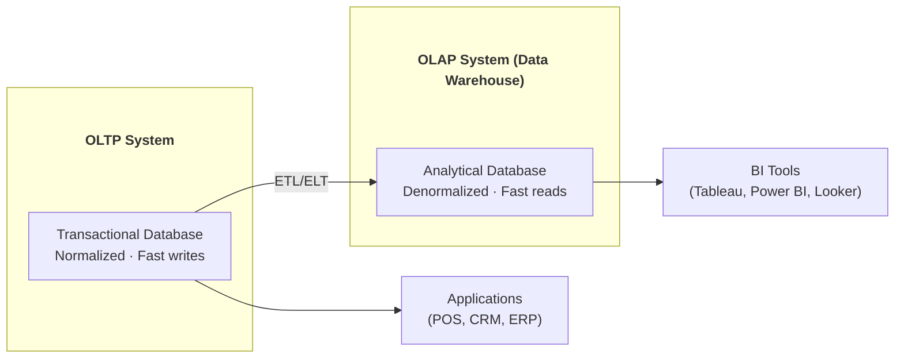
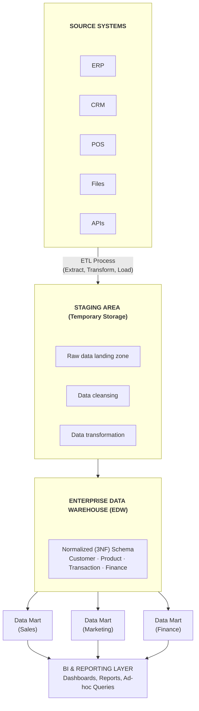
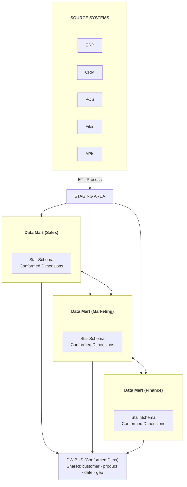
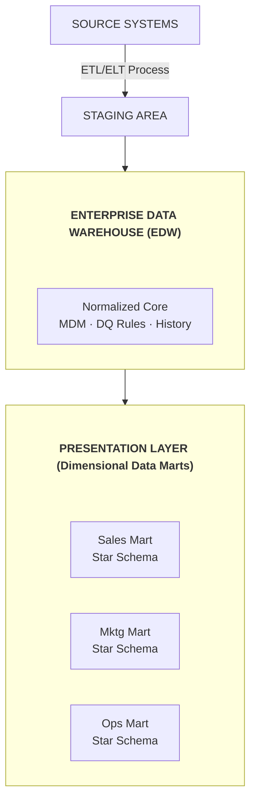
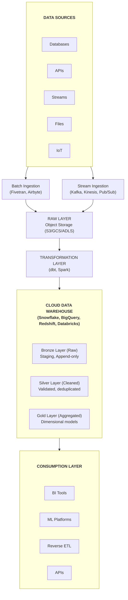
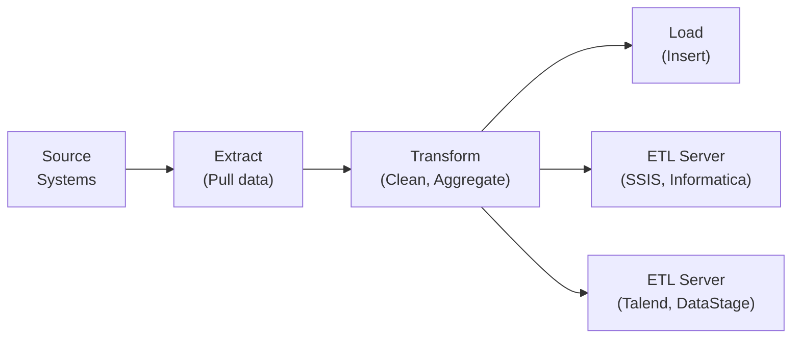
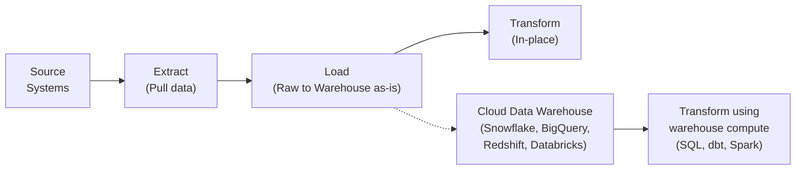
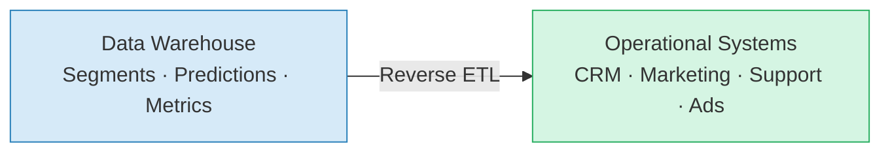
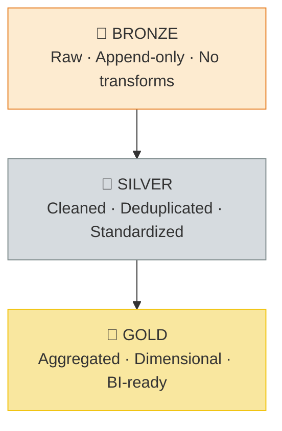
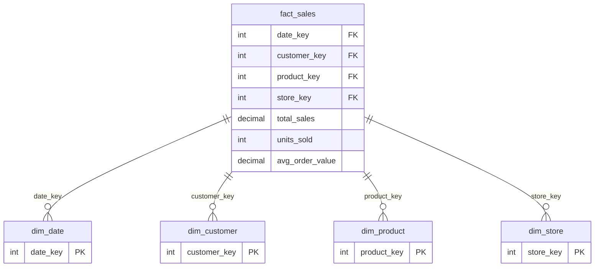

# Data Warehousing Concepts - Complete Guide

## Architecture, ETL/ELT, Data Marts, và Best Practices

---

## PHẦN 1: DATA WAREHOUSE FUNDAMENTALS

### 1.1 Data Warehouse Là Gì?

Data Warehouse (DWH) là một hệ thống lưu trữ dữ liệu được thiết kế đặc biệt cho việc phân tích và báo cáo, tách biệt khỏi hệ thống giao dịch (OLTP).

**Định nghĩa của Bill Inmon (Father of Data Warehousing):**
- **Subject-oriented** - Tổ chức theo chủ đề kinh doanh (khách hàng, sản phẩm, bán hàng)
- **Integrated** - Dữ liệu từ nhiều nguồn được chuẩn hóa
- **Time-variant** - Lưu trữ dữ liệu lịch sử
- **Non-volatile** - Dữ liệu không bị xóa hoặc sửa sau khi load

### 1.2 OLTP vs OLAP

**OLTP (Online Transaction Processing):**
- Xử lý giao dịch hàng ngày
- Insert, Update, Delete operations
- Normalized schema (3NF)
- Response time: milliseconds
- Data: Current state
- Users: Many concurrent users
- Examples: POS systems, Banking apps, E-commerce

**OLAP (Online Analytical Processing):**
- Phân tích và báo cáo
- Read-heavy (SELECT queries)
- Denormalized schema (Star/Snowflake)
- Response time: seconds to minutes
- Data: Historical, aggregated
- Users: Analysts, Data Scientists
- Examples: BI reports, Dashboards, Analytics



### 1.3 Lịch Sử Phát Triển

```
1980s  - Decision Support Systems (DSS) xuất hiện
   |
1988   - Barry Devlin và Paul Murphy định nghĩa "Data Warehouse" tại IBM
   |
1992   - Bill Inmon xuất bản "Building the Data Warehouse"
   |
1996   - Ralph Kimball xuất bản "The Data Warehouse Toolkit"
   |
2000s  - Enterprise Data Warehouses (Teradata, Oracle, IBM)
   |
2006   - Amazon Redshift development begins
   |
2010   - Cloud Data Warehouses emerge
   |
2012   - Snowflake founded
   |
2014   - Google BigQuery becomes popular
   |
2020   - Lakehouse architecture combines DWH + Data Lake
   |
2025   - AI-powered warehouses, real-time analytics
```

---

## PHẦN 2: DATA WAREHOUSE ARCHITECTURE

### 2.1 Inmon Architecture (Enterprise Data Warehouse)

Bill Inmon's approach - Top-down, enterprise-wide:



**Ưu điểm Inmon:**
- Single source of truth
- Data consistency across organization
- Flexible for future requirements
- Good for complex enterprise needs

**Nhược điểm Inmon:**
- High initial investment
- Longer time to first deliverable
- Requires enterprise-wide buy-in
- Complex to maintain

### 2.2 Kimball Architecture (Dimensional Modeling)

Ralph Kimball's approach - Bottom-up, departmental:



**Ưu điểm Kimball:**
- Faster time to value
- Easier to understand for business users
- Incremental development
- Optimized for queries

**Nhược điểm Kimball:**
- Potential data redundancy
- Integration challenges later
- May lead to inconsistencies if not managed well

### 2.3 Hybrid Architecture

Kết hợp cả hai approaches:



### 2.4 Modern Cloud Architecture



---

## PHẦN 3: ETL vs ELT

### 3.1 ETL (Extract, Transform, Load)

**Traditional approach - Transform before loading:**



**ETL Workflow Example:**

```python
# ETL Pipeline pseudo-code
def etl_pipeline():
    # 1. EXTRACT from source
    raw_data = extract_from_source(
        source_type='mysql',
        query='SELECT * FROM orders WHERE date > last_load_date'
    )
    
    # 2. TRANSFORM on ETL server
    cleaned_data = transform_data(raw_data)
    
    def transform_data(data):
        # Data cleansing
        data = remove_duplicates(data)
        data = handle_nulls(data)
        
        # Data standardization
        data['date'] = standardize_date_format(data['date'])
        data['amount'] = convert_currency(data['amount'], 'USD')
        
        # Aggregations
        summary = data.groupby(['region', 'product']).agg({
            'amount': 'sum',
            'quantity': 'sum'
        })
        
        return summary
    
    # 3. LOAD to data warehouse
    load_to_warehouse(
        data=cleaned_data,
        table='fact_sales',
        mode='append'
    )
```

**Ưu điểm ETL:**
- Less storage in target (only clean data)
- Transformation logic centralized
- Works well with on-premise systems
- Good for complex transformations

**Nhược điểm ETL:**
- ETL server can be bottleneck
- Raw data not preserved
- Longer development cycles
- Less flexible for ad-hoc needs

### 3.2 ELT (Extract, Load, Transform)

**Modern approach - Transform after loading:**



**ELT Workflow Example:**

```sql
-- ELT Pipeline in SQL/dbt

-- 1. EXTRACT & LOAD (handled by ingestion tools)
-- Data lands in raw schema
-- raw.orders, raw.customers, raw.products

-- 2. STAGING - Light transformations
CREATE OR REPLACE TABLE staging.stg_orders AS
SELECT 
    order_id,
    customer_id,
    order_date::DATE as order_date,
    NULLIF(total_amount, 0) as total_amount,
    UPPER(TRIM(status)) as status,
    _loaded_at as ingested_at
FROM raw.orders
WHERE order_date >= '2020-01-01';  -- Filter old data

-- 3. INTERMEDIATE - Business logic
CREATE OR REPLACE TABLE intermediate.int_order_items AS
SELECT 
    o.order_id,
    o.customer_id,
    oi.product_id,
    oi.quantity,
    oi.unit_price,
    oi.quantity * oi.unit_price as line_total,
    p.category,
    p.brand
FROM staging.stg_orders o
JOIN staging.stg_order_items oi ON o.order_id = oi.order_id
JOIN staging.stg_products p ON oi.product_id = p.product_id;

-- 4. MART - Final dimensional model
CREATE OR REPLACE TABLE marts.fact_sales AS
SELECT 
    MD5(o.order_id || '-' || oi.product_id) as sale_key,
    dc.customer_key,
    dp.product_key,
    dd.date_key,
    oi.quantity,
    oi.unit_price,
    oi.line_total,
    CURRENT_TIMESTAMP as etl_timestamp
FROM intermediate.int_order_items oi
JOIN staging.stg_orders o ON oi.order_id = o.order_id
JOIN marts.dim_customer dc ON o.customer_id = dc.customer_id
JOIN marts.dim_product dp ON oi.product_id = dp.product_id
JOIN marts.dim_date dd ON o.order_date = dd.date;
```

**Ưu điểm ELT:**
- Raw data preserved (can re-transform)
- Leverage cloud warehouse compute power
- Faster initial data availability
- More flexible for changing requirements
- Better for data science/exploration

**Nhược điểm ELT:**
- More storage required
- Transformation logic in SQL/warehouse
- May need more warehouse compute resources

### 3.3 ETL vs ELT Comparison

**When to use ETL:**
- On-premise systems with limited storage
- Highly sensitive data (transform before storing)
- Complex transformations not possible in SQL
- Legacy systems integration

**When to use ELT:**
- Cloud data warehouses
- Need raw data preservation
- Agile/iterative development
- Ad-hoc analysis requirements
- Modern data stack

### 3.4 Reverse ETL

**Push data from warehouse to operational systems:**



Tools: Census, Hightouch, Grouparoo

---

## PHẦN 4: DATA WAREHOUSE LAYERS

### 4.1 Landing/Raw Layer

**Purpose:** First landing zone for incoming data

**Characteristics:**
- Data stored as-is from source
- Append-only (no updates)
- Minimal or no transformation
- Preserves source structure

```sql
-- Example raw table structure
CREATE TABLE raw.orders (
    -- Source columns as-is
    id VARCHAR,
    customer_id VARCHAR,
    order_date VARCHAR,  -- Keep as string, transform later
    total VARCHAR,       -- Keep as string
    status VARCHAR,
    
    -- Metadata columns
    _source_file VARCHAR,
    _loaded_at TIMESTAMP DEFAULT CURRENT_TIMESTAMP,
    _row_hash VARCHAR  -- For change detection
);
```

### 4.2 Staging Layer

**Purpose:** Light transformations, data cleansing

**Characteristics:**
- Type casting and standardization
- Deduplication
- Basic validation
- Temporary or permanent

```sql
-- Example staging transformation
CREATE TABLE staging.stg_orders AS
SELECT 
    id::INT as order_id,
    customer_id::INT as customer_id,
    TRY_TO_DATE(order_date, 'YYYY-MM-DD') as order_date,
    TRY_TO_DECIMAL(total, 12, 2) as total_amount,
    UPPER(TRIM(status)) as status,
    _loaded_at
FROM raw.orders
WHERE id IS NOT NULL
QUALIFY ROW_NUMBER() OVER (PARTITION BY id ORDER BY _loaded_at DESC) = 1;
```

### 4.3 Integration/Curated Layer

**Purpose:** Business logic, entity resolution

**Characteristics:**
- Conformed data
- Master data integration
- Business rules applied
- Historical tracking (SCD)

```sql
-- Example integrated customer entity
CREATE TABLE curated.customer_master AS
WITH crm_customers AS (
    SELECT 
        customer_id,
        email,
        first_name,
        last_name,
        'CRM' as source
    FROM staging.stg_crm_customers
),
ecom_customers AS (
    SELECT 
        customer_id,
        email,
        first_name,
        last_name,
        'ECOM' as source
    FROM staging.stg_ecom_customers
)
-- Match customers across systems
SELECT 
    COALESCE(c.customer_id, e.customer_id) as customer_id,
    COALESCE(c.email, e.email) as email,
    COALESCE(c.first_name, e.first_name) as first_name,
    COALESCE(c.last_name, e.last_name) as last_name,
    CASE 
        WHEN c.customer_id IS NOT NULL AND e.customer_id IS NOT NULL THEN 'BOTH'
        WHEN c.customer_id IS NOT NULL THEN 'CRM_ONLY'
        ELSE 'ECOM_ONLY'
    END as source_systems
FROM crm_customers c
FULL OUTER JOIN ecom_customers e 
    ON LOWER(c.email) = LOWER(e.email);
```

### 4.4 Presentation/Marts Layer

**Purpose:** Business-ready data for consumption

**Characteristics:**
- Dimensional models (Star Schema)
- Optimized for queries
- Aggregated metrics
- Self-service ready

```sql
-- Example dimensional model in mart layer
CREATE TABLE marts.dim_customer AS
SELECT 
    ROW_NUMBER() OVER (ORDER BY customer_id) as customer_key,
    customer_id,
    email,
    first_name,
    last_name,
    CONCAT(first_name, ' ', last_name) as full_name,
    customer_segment,
    registration_date,
    first_order_date,
    last_order_date,
    total_orders,
    total_lifetime_value,
    CASE 
        WHEN last_order_date >= CURRENT_DATE - 30 THEN 'Active'
        WHEN last_order_date >= CURRENT_DATE - 90 THEN 'At Risk'
        ELSE 'Churned'
    END as customer_status
FROM curated.customer_master;

CREATE TABLE marts.fact_sales AS
SELECT 
    sale_key,
    date_key,
    customer_key,
    product_key,
    store_key,
    quantity,
    unit_price,
    discount_amount,
    net_amount,
    cost_amount,
    profit_amount
FROM curated.order_details od
JOIN marts.dim_customer dc ON od.customer_id = dc.customer_id
JOIN marts.dim_product dp ON od.product_id = dp.product_id
JOIN marts.dim_date dd ON od.order_date = dd.date
JOIN marts.dim_store ds ON od.store_id = ds.store_id;
```

### 4.5 Medallion Architecture (Bronze, Silver, Gold)

Modern naming convention, especially in Lakehouse:



---

## PHẦN 5: DATA MARTS

### 5.1 What is a Data Mart?

Data Mart là subset của Data Warehouse, phục vụ một department hoặc business function cụ thể.

**Types of Data Marts:**

**Dependent Data Mart:**
- Sourced from Enterprise Data Warehouse
- Consistent with EDW
- Subset of warehouse data

**Independent Data Mart:**
- Directly from source systems
- Can lead to silos
- Quicker to build but risky

**Hybrid Data Mart:**
- Combines EDW data with additional sources
- Flexible but needs governance

### 5.2 Common Data Marts

**Sales Data Mart:**



Metrics:
- Total Sales
- Units Sold
- Average Order Value
- Sales Growth
- Revenue by Region/Product/Time

**Marketing Data Mart:**

```
Dimensions:
- dim_campaign
- dim_channel
- dim_customer_segment
- dim_date
- dim_geography

Facts:
- fact_campaign_performance
  - Impressions
  - Clicks
  - Conversions
  - Spend
  - Revenue Attributed
  
- fact_customer_journey
  - Touchpoints
  - Attribution
  - Conversion events
```

**Finance Data Mart:**

```
Dimensions:
- dim_account
- dim_cost_center
- dim_date
- dim_entity
- dim_currency

Facts:
- fact_gl_transactions
  - Debits
  - Credits
  - Balance
  
- fact_budget_vs_actual
  - Budget Amount
  - Actual Amount
  - Variance
  
- fact_financial_snapshot
  - Assets
  - Liabilities
  - Revenue
  - Expenses
```

### 5.3 Data Mart Design Example

```sql
-- Finance Data Mart Example

-- Dimensions
CREATE TABLE finance.dim_account (
    account_key INT PRIMARY KEY,
    account_number VARCHAR(20),
    account_name VARCHAR(100),
    account_type VARCHAR(50),   -- Asset, Liability, Equity, Revenue, Expense
    account_category VARCHAR(50),
    parent_account_key INT,
    is_active BOOLEAN,
    effective_date DATE,
    expiry_date DATE
);

CREATE TABLE finance.dim_cost_center (
    cost_center_key INT PRIMARY KEY,
    cost_center_code VARCHAR(20),
    cost_center_name VARCHAR(100),
    department VARCHAR(100),
    division VARCHAR(100),
    is_active BOOLEAN
);

CREATE TABLE finance.dim_period (
    period_key INT PRIMARY KEY,
    period_date DATE,
    fiscal_year INT,
    fiscal_quarter INT,
    fiscal_month INT,
    fiscal_week INT,
    period_name VARCHAR(20),
    is_closed BOOLEAN
);

-- Facts
CREATE TABLE finance.fact_gl_balance (
    balance_key BIGINT PRIMARY KEY,
    period_key INT REFERENCES finance.dim_period(period_key),
    account_key INT REFERENCES finance.dim_account(account_key),
    cost_center_key INT REFERENCES finance.dim_cost_center(cost_center_key),
    opening_balance DECIMAL(18,2),
    debit_amount DECIMAL(18,2),
    credit_amount DECIMAL(18,2),
    closing_balance DECIMAL(18,2),
    currency_code CHAR(3),
    load_timestamp TIMESTAMP
);

-- Aggregate table for common queries
CREATE TABLE finance.agg_monthly_pl AS
SELECT 
    p.fiscal_year,
    p.fiscal_month,
    a.account_type,
    a.account_category,
    SUM(f.closing_balance) as total_balance
FROM finance.fact_gl_balance f
JOIN finance.dim_period p ON f.period_key = p.period_key
JOIN finance.dim_account a ON f.account_key = a.account_key
WHERE a.account_type IN ('Revenue', 'Expense')
GROUP BY p.fiscal_year, p.fiscal_month, a.account_type, a.account_category;
```

---

## PHẦN 6: LOADING PATTERNS

### 6.1 Full Load

Load toàn bộ data mỗi lần:

```sql
-- Truncate and reload
TRUNCATE TABLE target_table;

INSERT INTO target_table
SELECT * FROM source_table;
```

**Pros:**
- Simple to implement
- No complex logic needed
- Ensures complete data refresh

**Cons:**
- Slow for large tables
- Resource intensive
- Loses track of deletes (if source deletes)

### 6.2 Incremental Load

Load chỉ data mới hoặc thay đổi:

```sql
-- Using watermark (timestamp)
INSERT INTO target_table
SELECT *
FROM source_table
WHERE updated_at > (
    SELECT COALESCE(MAX(updated_at), '1900-01-01') 
    FROM target_table
);

-- Using change data capture (CDC)
MERGE INTO target_table t
USING cdc_changes c
ON t.id = c.id
WHEN MATCHED AND c.operation = 'UPDATE' THEN
    UPDATE SET 
        column1 = c.column1,
        updated_at = c.updated_at
WHEN MATCHED AND c.operation = 'DELETE' THEN
    DELETE
WHEN NOT MATCHED AND c.operation = 'INSERT' THEN
    INSERT (id, column1, updated_at)
    VALUES (c.id, c.column1, c.updated_at);
```

**Pros:**
- Faster for large tables
- Less resource usage
- Tracks changes

**Cons:**
- More complex logic
- Need reliable watermark column
- Handle deletes separately

### 6.3 Snapshot Load

Capture point-in-time snapshots:

```sql
-- Daily snapshot
INSERT INTO account_balance_snapshot (
    snapshot_date,
    account_id,
    balance,
    currency
)
SELECT 
    CURRENT_DATE as snapshot_date,
    account_id,
    current_balance,
    currency
FROM source_accounts;

-- Query historical state
SELECT * 
FROM account_balance_snapshot
WHERE snapshot_date = '2024-06-15';
```

### 6.4 Hybrid Approach

```sql
-- SCD Type 2 with merge
MERGE INTO dim_customer t
USING (
    SELECT 
        customer_id,
        customer_name,
        email,
        segment,
        MD5(customer_name || email || segment) as hash_value
    FROM staging.stg_customers
) s
ON t.customer_id = s.customer_id AND t.is_current = TRUE

-- Close expired record
WHEN MATCHED AND t.hash_value != s.hash_value THEN
    UPDATE SET 
        is_current = FALSE,
        effective_end_date = CURRENT_DATE - 1

-- No match means new customer
WHEN NOT MATCHED THEN
    INSERT (customer_key, customer_id, customer_name, email, segment,
            hash_value, effective_start_date, effective_end_date, is_current)
    VALUES (
        seq_customer_key.nextval,
        s.customer_id,
        s.customer_name,
        s.email,
        s.segment,
        s.hash_value,
        CURRENT_DATE,
        '9999-12-31',
        TRUE
    );

-- Insert new version of changed records
INSERT INTO dim_customer
SELECT 
    seq_customer_key.nextval,
    s.customer_id,
    s.customer_name,
    s.email,
    s.segment,
    s.hash_value,
    CURRENT_DATE,
    '9999-12-31',
    TRUE
FROM staging.stg_customers s
JOIN dim_customer t 
    ON s.customer_id = t.customer_id 
    AND t.is_current = FALSE
    AND t.effective_end_date = CURRENT_DATE - 1;
```

---

## PHẦN 7: DATA WAREHOUSE TECHNOLOGIES

### 7.1 On-Premise Solutions

**Teradata:**
- Enterprise-grade MPP architecture
- Shared-nothing architecture
- Strong for large-scale analytics
- High cost, high performance

**Oracle Exadata:**
- Integrated hardware/software
- Optimized for Oracle workloads
- Smart scan technology

**Microsoft SQL Server (with PDW/APS):**
- Parallel Data Warehouse
- Good Windows integration
- SSIS for ETL

### 7.2 Cloud Data Warehouses

**Amazon Redshift:**
- Columnar storage
- MPP architecture
- Tight AWS integration
- Spectrum for data lake queries
- Serverless option available

```sql
-- Redshift example
CREATE TABLE sales (
    sale_id BIGINT ENCODE az64,
    sale_date DATE ENCODE az64,
    customer_id INT ENCODE az64,
    amount DECIMAL(12,2) ENCODE az64
)
DISTKEY (customer_id)
SORTKEY (sale_date)
;
```

**Google BigQuery:**
- Serverless architecture
- Separated storage and compute
- Slot-based pricing
- Nested/repeated fields support
- ML built-in (BigQuery ML)

```sql
-- BigQuery example
CREATE TABLE project.dataset.sales
PARTITION BY sale_date
CLUSTER BY customer_id
AS
SELECT * FROM project.dataset.raw_sales;
```

**Snowflake:**
- Multi-cluster shared data architecture
- Automatic scaling
- Time travel built-in
- Data sharing capabilities
- Zero-copy cloning

```sql
-- Snowflake example
CREATE TABLE sales
CLUSTER BY (sale_date, customer_id)
AS
SELECT * FROM raw.sales;

-- Time travel
SELECT * FROM sales AT(TIMESTAMP => '2024-01-15 10:00:00');

-- Clone for development
CREATE TABLE sales_dev CLONE sales;
```

**Databricks SQL Warehouse:**
- Unity Catalog for governance
- Delta Lake format
- Photon query engine
- Serverless compute

### 7.3 Feature Comparison

**Snowflake:**
- Strengths: Ease of use, data sharing, auto-scaling
- Storage: Separated from compute
- Pricing: Per-second compute + storage
- Best for: Multi-cloud, data sharing needs

**BigQuery:**
- Strengths: Serverless, ML integration, nested data
- Storage: Separated from compute
- Pricing: Per-query or flat-rate
- Best for: GCP users, ad-hoc analytics

**Redshift:**
- Strengths: AWS integration, mature ecosystem
- Storage: Coupled (Serverless is separated)
- Pricing: Per-node or serverless
- Best for: AWS users, predictable workloads

**Databricks:**
- Strengths: Unified analytics, ML platform, Delta Lake
- Storage: Object storage (data lake)
- Pricing: DBU-based
- Best for: Data science heavy, streaming + batch

---

## PHẦN 8: PERFORMANCE OPTIMIZATION

### 8.1 Table Design

**Partitioning:**

```sql
-- BigQuery partitioning
CREATE TABLE sales
PARTITION BY DATE(sale_date)
OPTIONS (
    partition_expiration_days=365,
    require_partition_filter=true
);

-- Snowflake micro-partitions (automatic, but can cluster)
CREATE TABLE sales
CLUSTER BY (sale_date, region);

-- Redshift distribution and sort
CREATE TABLE sales
DISTKEY (customer_id)
SORTKEY (sale_date);
```

**Clustering:**

```sql
-- BigQuery clustering
CREATE TABLE sales
PARTITION BY DATE(sale_date)
CLUSTER BY customer_id, product_category;

-- Benefits queries filtering on cluster columns
SELECT SUM(amount)
FROM sales
WHERE sale_date = '2024-01-15'
  AND customer_id = 12345;  -- Uses clustering
```

### 8.2 Query Optimization

**Use partition pruning:**

```sql
-- Good: Partition filter included
SELECT * FROM sales
WHERE sale_date BETWEEN '2024-01-01' AND '2024-03-31';

-- Bad: No partition filter
SELECT * FROM sales
WHERE YEAR(sale_date) = 2024;  -- Function prevents pruning
```

**Avoid SELECT *:**

```sql
-- Bad
SELECT * FROM large_table;

-- Good
SELECT column1, column2, column3 FROM large_table;
```

**Use approximate functions for large datasets:**

```sql
-- Exact (slower)
SELECT COUNT(DISTINCT user_id) FROM events;

-- Approximate (faster)
SELECT APPROX_COUNT_DISTINCT(user_id) FROM events;

-- BigQuery
SELECT APPROX_QUANTILES(amount, 100)[OFFSET(50)] as median FROM sales;
```

### 8.3 Materialized Views

```sql
-- Create materialized view for common aggregations
CREATE MATERIALIZED VIEW mv_daily_sales AS
SELECT 
    DATE(sale_date) as sale_date,
    region,
    product_category,
    COUNT(*) as transaction_count,
    SUM(amount) as total_amount,
    AVG(amount) as avg_amount
FROM sales
GROUP BY DATE(sale_date), region, product_category;

-- Query automatically uses materialized view
SELECT sale_date, SUM(total_amount)
FROM mv_daily_sales
WHERE region = 'APAC'
GROUP BY sale_date;
```

### 8.4 Caching Strategies

**Result caching:**

```sql
-- Snowflake: Automatic result cache (24 hours)
-- Same query returns cached result
SELECT SUM(amount) FROM sales WHERE sale_date = '2024-01-15';

-- BigQuery: Cached results for identical queries
SELECT SUM(amount) FROM sales WHERE sale_date = '2024-01-15';

-- Disable cache for testing
-- BigQuery
SELECT SUM(amount) FROM sales WHERE sale_date = '2024-01-15'
OPTIONS (use_query_cache=false);
```

---

## PHẦN 9: DATA WAREHOUSE GOVERNANCE

### 9.1 Data Quality

```sql
-- Data quality checks
CREATE TABLE dq_results AS
SELECT 
    'sales' as table_name,
    'null_check' as check_type,
    'customer_id' as column_name,
    COUNT(*) as total_rows,
    COUNT(customer_id) as non_null_rows,
    COUNT(*) - COUNT(customer_id) as null_count,
    ROUND(COUNT(customer_id)::NUMERIC / COUNT(*) * 100, 2) as completeness_pct
FROM sales

UNION ALL

SELECT 
    'sales' as table_name,
    'uniqueness_check' as check_type,
    'sale_id' as column_name,
    COUNT(*) as total_rows,
    COUNT(DISTINCT sale_id) as distinct_rows,
    COUNT(*) - COUNT(DISTINCT sale_id) as duplicate_count,
    ROUND(COUNT(DISTINCT sale_id)::NUMERIC / COUNT(*) * 100, 2) as uniqueness_pct
FROM sales;
```

### 9.2 Documentation

```yaml
# dbt schema.yml example
version: 2

models:
  - name: fact_sales
    description: "Fact table containing all sales transactions"
    columns:
      - name: sale_key
        description: "Surrogate key for the sale"
        tests:
          - unique
          - not_null
      - name: customer_key
        description: "Foreign key to dim_customer"
        tests:
          - relationships:
              to: ref('dim_customer')
              field: customer_key
      - name: amount
        description: "Transaction amount in USD"
        tests:
          - not_null
          - accepted_values:
              values: ['>0']
```

### 9.3 Access Control

```sql
-- Role-based access control
CREATE ROLE analyst;
CREATE ROLE engineer;
CREATE ROLE admin;

-- Grant permissions
GRANT USAGE ON SCHEMA marts TO analyst;
GRANT SELECT ON ALL TABLES IN SCHEMA marts TO analyst;

GRANT ALL ON SCHEMA staging TO engineer;
GRANT ALL ON SCHEMA curated TO engineer;

GRANT ALL ON DATABASE warehouse TO admin;

-- Row-level security (Snowflake)
CREATE ROW ACCESS POLICY region_policy AS (region VARCHAR)
RETURNS BOOLEAN ->
    CASE 
        WHEN CURRENT_ROLE() = 'ADMIN' THEN TRUE
        WHEN CURRENT_ROLE() = 'APAC_ANALYST' AND region = 'APAC' THEN TRUE
        WHEN CURRENT_ROLE() = 'EMEA_ANALYST' AND region = 'EMEA' THEN TRUE
        ELSE FALSE
    END;

ALTER TABLE sales ADD ROW ACCESS POLICY region_policy ON (region);
```

---

## PHẦN 10: BEST PRACTICES

### 10.1 Design Principles

- **Start with business requirements** - Understand what questions need answering
- **Design for query patterns** - Optimize for how data will be used
- **Build incrementally** - Start with one domain, expand gradually
- **Document everything** - Schema, lineage, business logic
- **Test early and often** - Data quality checks at every layer

### 10.2 Naming Conventions

```
Schemas:
- raw_*         : Landing zone for raw data
- staging_*     : Staging area
- curated_*     : Cleaned and integrated
- marts_*       : Business-ready marts
- analytics_*   : Ad-hoc analytics tables

Tables:
- dim_*         : Dimension tables
- fact_*        : Fact tables
- stg_*         : Staging tables
- int_*         : Intermediate tables
- agg_*         : Aggregate tables
- rpt_*         : Report tables

Columns:
- *_key         : Surrogate keys
- *_id          : Natural/business keys
- *_at          : Timestamps
- *_date        : Dates
- *_amount      : Money values
- is_*          : Boolean flags
```

### 10.3 Checklist for DWH Projects

- [ ] Business requirements documented
- [ ] Source systems identified
- [ ] Data profiling completed
- [ ] Dimensional model designed
- [ ] ETL/ELT approach selected
- [ ] Technology stack chosen
- [ ] Naming conventions established
- [ ] Data quality rules defined
- [ ] Access control planned
- [ ] Documentation template created
- [ ] Monitoring and alerting set up
- [ ] Disaster recovery planned

---

*Document Version: 1.0*
*Last Updated: February 2026*
*Coverage: DWH Architecture, ETL/ELT, Data Marts, Performance, Governance*
