# Data Lakes & Lakehouses - Complete Guide

## Architecture, Zones, và Modern Lakehouse Patterns

---

## PHẦN 1: DATA LAKE FUNDAMENTALS

### 1.1 Data Lake Là Gì?

Data Lake là một hệ thống lưu trữ tập trung chứa dữ liệu ở dạng raw, native format. Khác với Data Warehouse, Data Lake lưu trữ mọi loại data mà không cần schema định trước.

**Core Characteristics:**
- **Store everything** - Structured, semi-structured, unstructured data
- **Schema-on-read** - Define schema when reading, not when writing
- **Low-cost storage** - Object storage (S3, GCS, ADLS)
- **Flexibility** - Support many processing engines
- **Raw data preservation** - Keep original data intact

### 1.2 Data Lake vs Data Warehouse

**Data Warehouse:**
- Schema-on-write (define first)
- Structured data only
- SQL-based queries
- Optimized for BI/reporting
- Higher cost per TB
- Strong consistency

**Data Lake:**
- Schema-on-read (define later)
- All data types
- Multiple processing engines
- Supports ML/AI workloads
- Low cost per TB
- Eventually consistent

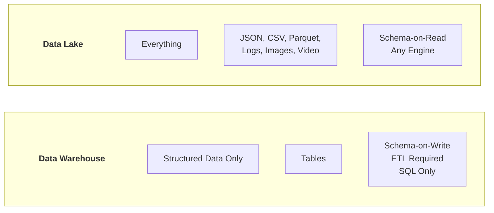

### 1.3 Lịch Sử Phát Triển

```
2006  - Hadoop project started at Yahoo
   |
2008  - Hadoop becomes Apache top-level project
   |
2010  - James Dixon (Pentaho) coins "Data Lake" term
   |
2012  - Data Lakes gain popularity with Hadoop
   |
2014  - Cloud object storage becomes viable (S3 cost drops)
   |
2016  - Data Lake challenges emerge ("Data Swamp")
   |
2017  - Delta Lake development begins at Databricks
   |
2019  - Lakehouse concept introduced
   |
2020  - Apache Iceberg, Delta Lake, Hudi gain traction
   |
2023  - Open Table Formats become standard
   |
2025  - Lakehouse is the dominant architecture
```

---

## PHẦN 2: DATA LAKE ARCHITECTURE

### 2.1 Traditional Data Lake Architecture

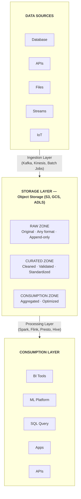

### 2.2 Zone Architecture (Layers)

**Landing Zone (Bronze):**

```
Purpose: Raw data as received from sources
Characteristics:
- No transformations
- Original format preserved
- Append-only writes
- Full historical data
- Serves as backup

Example structure:
s3://data-lake/landing/
├── database/
│   └── table_name/
│       └── date=2024-01-15/
│           └── file_001.json
├── api/
│   └── source_name/
│       └── endpoint/
│           └── 2024-01-15_extract.json
├── files/
│   └── vendor_files/
│       └── 2024-01-15/
│           └── data.csv
└── streaming/
    └── topic_name/
        └── partition=0/
            └── offset=12345.avro
```

**Raw Zone (Bronze - Processed):**

```
Purpose: Lightly processed raw data in optimized format
Characteristics:
- Converted to efficient format (Parquet, Delta)
- Partitioned for performance
- Schema captured
- Still append-only

Example transformation:
- JSON → Parquet
- CSV → Delta Lake
- Add metadata columns (_loaded_at, _source)
```

**Curated Zone (Silver):**

```
Purpose: Cleaned, validated, business entities
Characteristics:
- Data quality applied
- Deduplicated
- Standardized formats
- Business entities formed
- Slowly Changing Dimensions applied

Example:
- raw.orders → curated.orders (cleaned)
- Multiple sources → curated.customer_master (integrated)
```

**Consumption Zone (Gold):**

```
Purpose: Business-ready, aggregated data
Characteristics:
- Dimensional models
- Pre-computed aggregations
- Optimized for queries
- Self-service ready
- Powers dashboards and reports

Example:
- curated.orders + curated.customers → consumption.fact_sales
- Aggregated metrics for KPI dashboards
```

### 2.3 Modern Data Lake Stack

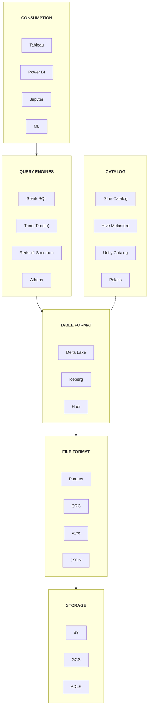

---

## PHẦN 3: LAKEHOUSE ARCHITECTURE

### 3.1 Lakehouse Là Gì?

Lakehouse kết hợp ưu điểm của cả Data Lake và Data Warehouse:
- **From Data Lake:** Low-cost storage, flexibility, all data types
- **From Data Warehouse:** ACID transactions, governance, performance

**Key Features:**
- ACID transactions trên object storage
- Schema enforcement và evolution
- BI tool support (direct SQL queries)
- Unified batch và streaming
- Open formats (not proprietary)

### 3.2 Lakehouse Architecture

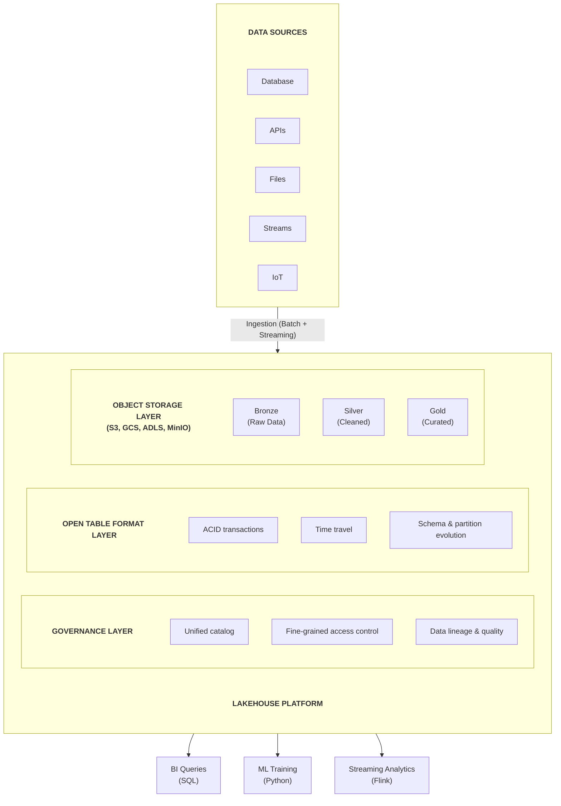

### 3.3 Medallion Architecture in Lakehouse

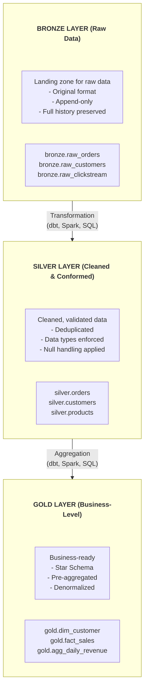

### 3.4 Lakehouse Implementation với Delta Lake

```python
from pyspark.sql import SparkSession
from delta.tables import DeltaTable

spark = SparkSession.builder \
    .appName("LakehouseExample") \
    .config("spark.sql.extensions", "io.delta.sql.DeltaSparkSessionExtension") \
    .config("spark.sql.catalog.spark_catalog", "org.apache.spark.sql.delta.catalog.DeltaCatalog") \
    .getOrCreate()

# Bronze Layer - Raw ingestion
raw_orders = spark.read.json("s3://raw-data/orders/")
raw_orders.write \
    .format("delta") \
    .mode("append") \
    .partitionBy("order_date") \
    .save("s3://lakehouse/bronze/orders/")

# Silver Layer - Cleaning and validation
bronze_orders = spark.read.format("delta").load("s3://lakehouse/bronze/orders/")

silver_orders = bronze_orders \
    .dropDuplicates(["order_id"]) \
    .filter("order_id IS NOT NULL") \
    .withColumn("order_date", col("order_date").cast("date")) \
    .withColumn("total_amount", col("total_amount").cast("decimal(12,2)")) \
    .withColumn("processed_at", current_timestamp())

# Merge for upsert pattern
if DeltaTable.isDeltaTable(spark, "s3://lakehouse/silver/orders/"):
    silver_table = DeltaTable.forPath(spark, "s3://lakehouse/silver/orders/")
    
    silver_table.alias("target") \
        .merge(silver_orders.alias("source"), "target.order_id = source.order_id") \
        .whenMatchedUpdateAll() \
        .whenNotMatchedInsertAll() \
        .execute()
else:
    silver_orders.write \
        .format("delta") \
        .mode("overwrite") \
        .save("s3://lakehouse/silver/orders/")

# Gold Layer - Dimensional model
silver_orders = spark.read.format("delta").load("s3://lakehouse/silver/orders/")
silver_customers = spark.read.format("delta").load("s3://lakehouse/silver/customers/")
silver_products = spark.read.format("delta").load("s3://lakehouse/silver/products/")

fact_sales = silver_orders \
    .join(silver_customers, "customer_id") \
    .join(silver_products, "product_id") \
    .select(
        "order_id",
        "order_date",
        "customer_key",
        "product_key",
        "quantity",
        "unit_price",
        "total_amount"
    )

fact_sales.write \
    .format("delta") \
    .mode("overwrite") \
    .partitionBy("order_date") \
    .save("s3://lakehouse/gold/fact_sales/")
```

### 3.5 Lakehouse với SQL (dbt)

```sql
-- models/bronze/bronze_orders.sql
{{ config(
    materialized='incremental',
    file_format='delta',
    unique_key='order_id',
    incremental_strategy='merge'
) }}

SELECT 
    *,
    current_timestamp() as _loaded_at,
    '{{ invocation_id }}' as _batch_id
FROM {{ source('raw', 'orders') }}

WHERE _ingested_at > (SELECT max(_loaded_at) FROM {{ this }})


-- models/silver/silver_orders.sql
{{ config(
    materialized='incremental',
    file_format='delta',
    unique_key='order_id',
    incremental_strategy='merge'
) }}

WITH source AS (
    SELECT * FROM {{ ref('bronze_orders') }}
),

cleaned AS (
    SELECT 
        order_id,
        customer_id,
        CAST(order_date AS DATE) as order_date,
        CAST(total_amount AS DECIMAL(12,2)) as total_amount,
        UPPER(TRIM(status)) as status,
        _loaded_at
    FROM source
    WHERE order_id IS NOT NULL
    QUALIFY ROW_NUMBER() OVER (PARTITION BY order_id ORDER BY _loaded_at DESC) = 1
)

SELECT * FROM cleaned

-- models/gold/fact_sales.sql
{{ config(
    materialized='table',
    file_format='delta',
    partition_by=['order_date']
) }}

SELECT 
    {{ dbt_utils.generate_surrogate_key(['o.order_id', 'oi.product_id']) }} as sale_key,
    dc.customer_key,
    dp.product_key,
    dd.date_key,
    o.order_id,
    oi.quantity,
    oi.unit_price,
    oi.quantity * oi.unit_price as line_amount
FROM {{ ref('silver_orders') }} o
JOIN {{ ref('silver_order_items') }} oi ON o.order_id = oi.order_id
JOIN {{ ref('dim_customer') }} dc ON o.customer_id = dc.customer_id AND dc.is_current = true
JOIN {{ ref('dim_product') }} dp ON oi.product_id = dp.product_id
JOIN {{ ref('dim_date') }} dd ON o.order_date = dd.date
```

---

## PHẦN 4: DATA LAKE STORAGE

### 4.1 Object Storage Concepts

**S3 (AWS):**
```
s3://bucket-name/prefix/key
   |           |      |
   Bucket    Folder  Object (file)

Features:
- 11 9's durability (99.999999999%)
- Virtually unlimited storage
- Pay per GB stored + requests
- Versioning support
- Lifecycle policies
```

**GCS (Google Cloud):**
```
gs://bucket-name/prefix/key

Features:
- Similar to S3
- Strong consistency
- Simpler pricing tiers
- Good BigQuery integration
```

**ADLS Gen2 (Azure):**
```
abfss://container@account.dfs.core.windows.net/path

Features:
- Hierarchical namespace
- POSIX-like permissions
- Good Databricks integration
- Azure AD integration
```

### 4.2 Storage Layout Patterns

**Hive-Style Partitioning:**
```
s3://lakehouse/orders/
├── year=2024/
│   ├── month=01/
│   │   ├── day=15/
│   │   │   ├── part-00000.parquet
│   │   │   └── part-00001.parquet
│   │   └── day=16/
│   │       └── part-00000.parquet
│   └── month=02/
└── year=2023/
```

**Date-based Partitioning:**
```
s3://lakehouse/orders/
├── order_date=2024-01-15/
│   ├── part-00000.parquet
│   └── part-00001.parquet
├── order_date=2024-01-16/
└── order_date=2024-01-17/
```

**Hourly Partitioning (for streaming):**
```
s3://lakehouse/events/
├── date=2024-01-15/
│   ├── hour=00/
│   ├── hour=01/
│   └── hour=23/
└── date=2024-01-16/
```

### 4.3 File Sizing Best Practices

**Optimal file sizes:**
- Target: 128 MB - 1 GB per file
- Too small: "Small file problem" - slow reads, high overhead
- Too large: Difficult to parallelize, long processing

**Compaction:**

```python
# Delta Lake compaction
spark.sql("""
    OPTIMIZE lakehouse.silver.orders
    WHERE order_date >= '2024-01-01'
""")

# With Z-ordering for query optimization
spark.sql("""
    OPTIMIZE lakehouse.gold.fact_sales
    ZORDER BY (customer_key, product_key)
""")
```

```sql
-- Iceberg compaction
CALL catalog.system.rewrite_data_files(
    table => 'lakehouse.silver.orders',
    options => map('target-file-size-bytes', '134217728')  -- 128 MB
);
```

---

## PHẦN 5: DATA LAKE GOVERNANCE

### 5.1 Catalog Management

**AWS Glue Catalog:**
```python
import boto3

glue = boto3.client('glue')

# Create database
glue.create_database(
    DatabaseInput={
        'Name': 'lakehouse_silver',
        'Description': 'Silver layer tables'
    }
)

# Create table
glue.create_table(
    DatabaseName='lakehouse_silver',
    TableInput={
        'Name': 'orders',
        'StorageDescriptor': {
            'Columns': [
                {'Name': 'order_id', 'Type': 'string'},
                {'Name': 'customer_id', 'Type': 'string'},
                {'Name': 'total_amount', 'Type': 'decimal(12,2)'},
            ],
            'Location': 's3://lakehouse/silver/orders/',
            'InputFormat': 'org.apache.hadoop.hive.ql.io.parquet.MapredParquetInputFormat',
            'OutputFormat': 'org.apache.hadoop.hive.ql.io.parquet.MapredParquetOutputFormat',
            'SerdeInfo': {
                'SerializationLibrary': 'org.apache.hadoop.hive.ql.io.parquet.serde.ParquetHiveSerDe'
            }
        },
        'PartitionKeys': [
            {'Name': 'order_date', 'Type': 'date'}
        ],
        'TableType': 'EXTERNAL_TABLE'
    }
)
```

**Unity Catalog (Databricks):**
```sql
-- Create catalog
CREATE CATALOG lakehouse;

-- Create schemas for each layer
CREATE SCHEMA lakehouse.bronze;
CREATE SCHEMA lakehouse.silver;
CREATE SCHEMA lakehouse.gold;

-- Register table
CREATE TABLE lakehouse.silver.orders (
    order_id STRING,
    customer_id STRING,
    order_date DATE,
    total_amount DECIMAL(12,2)
)
USING delta
LOCATION 's3://lakehouse/silver/orders/';

-- Grant access
GRANT SELECT ON TABLE lakehouse.silver.orders TO analysts;
```

### 5.2 Access Control

**S3 Bucket Policies:**
```json
{
    "Version": "2012-10-17",
    "Statement": [
        {
            "Effect": "Allow",
            "Principal": {"AWS": "arn:aws:iam::123456789:role/DataAnalyst"},
            "Action": ["s3:GetObject"],
            "Resource": [
                "arn:aws:s3:::lakehouse/gold/*",
                "arn:aws:s3:::lakehouse/silver/*"
            ]
        },
        {
            "Effect": "Deny",
            "Principal": {"AWS": "arn:aws:iam::123456789:role/DataAnalyst"},
            "Action": ["s3:*"],
            "Resource": ["arn:aws:s3:::lakehouse/bronze/*"]
        }
    ]
}
```

**Lake Formation (AWS):**
```python
import boto3

lf = boto3.client('lakeformation')

# Grant select permission on table
lf.grant_permissions(
    Principal={'DataLakePrincipalIdentifier': 'arn:aws:iam::123456789:role/Analyst'},
    Resource={
        'Table': {
            'DatabaseName': 'lakehouse_gold',
            'Name': 'fact_sales'
        }
    },
    Permissions=['SELECT']
)

# Column-level security
lf.grant_permissions(
    Principal={'DataLakePrincipalIdentifier': 'arn:aws:iam::123456789:role/Analyst'},
    Resource={
        'TableWithColumns': {
            'DatabaseName': 'lakehouse_gold',
            'Name': 'dim_customer',
            'ColumnNames': ['customer_key', 'customer_name', 'segment']
            # Exclude sensitive columns like email, phone
        }
    },
    Permissions=['SELECT']
)
```

### 5.3 Data Quality in Data Lake

```python
from great_expectations.data_context import get_context

context = get_context()

# Create expectation suite for silver layer
suite = context.add_expectation_suite("silver_orders_suite")

# Add expectations
context.add_or_update_expectation(
    expectation_suite_name="silver_orders_suite",
    expectation_configuration={
        "expectation_type": "expect_column_values_to_not_be_null",
        "kwargs": {"column": "order_id"}
    }
)

context.add_or_update_expectation(
    expectation_suite_name="silver_orders_suite",
    expectation_configuration={
        "expectation_type": "expect_column_values_to_be_unique",
        "kwargs": {"column": "order_id"}
    }
)

context.add_or_update_expectation(
    expectation_suite_name="silver_orders_suite",
    expectation_configuration={
        "expectation_type": "expect_column_values_to_be_between",
        "kwargs": {
            "column": "total_amount",
            "min_value": 0,
            "max_value": 1000000
        }
    }
)

# Run validation
results = context.run_checkpoint(checkpoint_name="silver_orders_checkpoint")
```

---

## PHẦN 6: DATA LAKE CHALLENGES

### 6.1 Data Swamp Problem

**Symptoms của Data Swamp:**
- No data catalog or documentation
- Unknown data quality
- No data lineage
- Abandoned datasets
- Duplicate data
- No access controls
- Query performance issues

**Solutions:**

```
Data Swamp Prevention Checklist:
□ Implement data catalog from day 1
□ Document all datasets with metadata
□ Apply data quality checks at ingestion
□ Implement access controls
□ Set up data retention policies
□ Track data lineage
□ Monitor storage growth
□ Regular cleanup of unused data
```

### 6.2 Small File Problem

**Impact:**
- Slow query performance
- High metadata overhead
- Increased API costs

**Solutions:**

```python
# Approach 1: Batch ingestion with target file size
spark.conf.set("spark.sql.files.maxPartitionBytes", "128m")

# Approach 2: Periodic compaction
spark.sql("""
    OPTIMIZE lakehouse.bronze.events
    WHERE event_date >= date_sub(current_date(), 7)
""")

# Approach 3: Auto-compaction (Delta Lake)
spark.sql("""
    ALTER TABLE lakehouse.bronze.events
    SET TBLPROPERTIES (
        'delta.autoOptimize.optimizeWrite' = 'true',
        'delta.autoOptimize.autoCompact' = 'true'
    )
""")
```

### 6.3 Schema Evolution Challenges

**Handling schema changes:**

```python
# Delta Lake - Schema evolution
spark.sql("""
    ALTER TABLE lakehouse.silver.orders
    SET TBLPROPERTIES ('delta.columnMapping.mode' = 'name')
""")

# Add new column
spark.sql("""
    ALTER TABLE lakehouse.silver.orders
    ADD COLUMN shipping_address STRING
""")

# Merge with schema evolution
new_data.write \
    .format("delta") \
    .mode("append") \
    .option("mergeSchema", "true") \
    .save("s3://lakehouse/silver/orders/")
```

```sql
-- Iceberg - Schema evolution
ALTER TABLE lakehouse.silver.orders
ADD COLUMN shipping_address STRING;

ALTER TABLE lakehouse.silver.orders
RENAME COLUMN shipping_address TO delivery_address;

ALTER TABLE lakehouse.silver.orders
ALTER COLUMN customer_id TYPE BIGINT;
```

---

## PHẦN 7: LAKEHOUSE PLATFORMS

### 7.1 Databricks Lakehouse

```
Components:
- Delta Lake (table format)
- Unity Catalog (governance)
- Photon (query engine)
- MLflow (ML platform)
- Databricks SQL (BI queries)

Architecture:

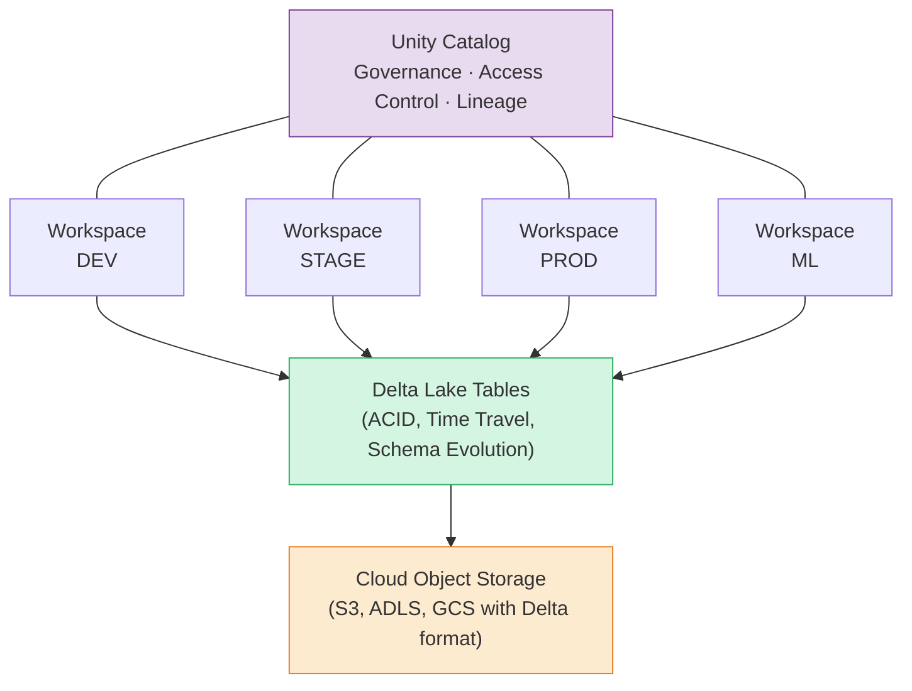
```

### 7.2 Snowflake + Iceberg

```
Components:
- Snowflake (compute + some storage)
- Apache Iceberg (table format)
- External catalog (Polaris, Nessie)

Architecture:

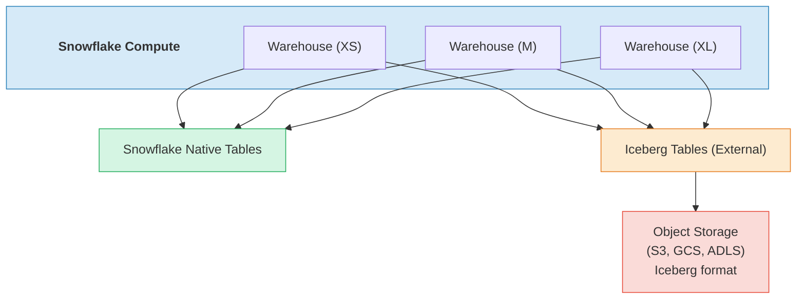
```

### 7.3 AWS Lake Formation + Athena

```
Components:
- S3 (storage)
- Glue Catalog (metadata)
- Lake Formation (governance)
- Athena (query engine)
- Iceberg/Hudi support

Architecture:

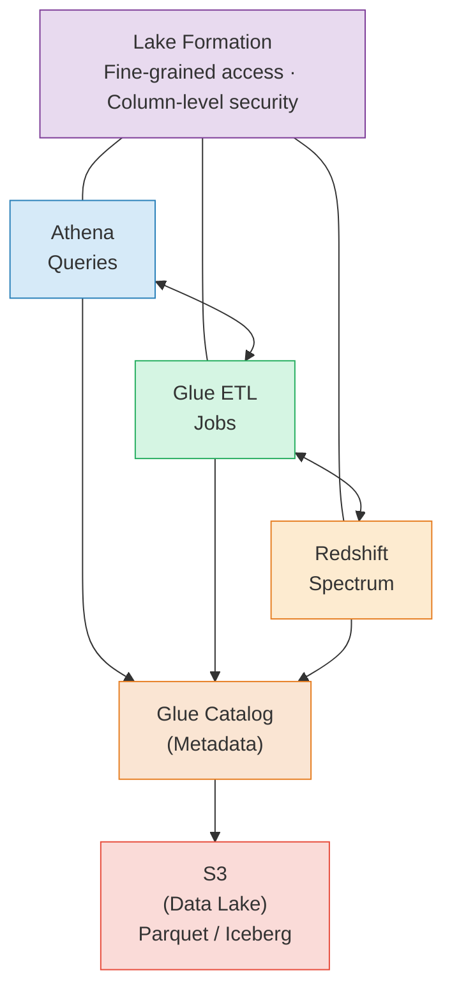
```

### 7.4 Open Source Lakehouse

```
Components:
- MinIO (S3-compatible storage)
- Apache Spark (processing)
- Apache Iceberg/Delta Lake (table format)
- Trino/Presto (query engine)
- Hive Metastore / Nessie (catalog)
- Apache Superset (BI)

Architecture:

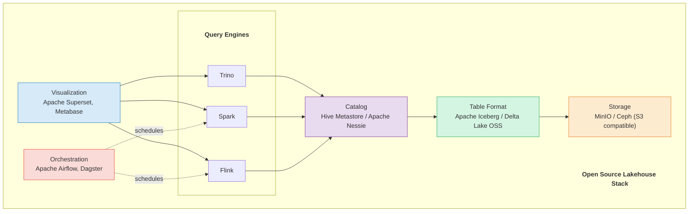
```

---

## PHẦN 8: BEST PRACTICES

### 8.1 Design Principles

**1. Immutability:**
- Append-only trong Bronze layer
- Use versioning (Delta Lake time travel)
- Never delete raw data prematurely

**2. Schema Management:**
- Define and enforce schemas early
- Document schema changes
- Use schema evolution features

**3. Partitioning Strategy:**
- Partition by query patterns
- Avoid over-partitioning
- Consider partition pruning

**4. Data Quality:**
- Validate at each layer
- Implement data contracts
- Monitor quality metrics

### 8.2 Naming Conventions

```
Storage paths:
s3://company-lakehouse-{env}/
├── bronze/
│   └── source_system/table_name/
├── silver/
│   └── domain/entity/
└── gold/
    └── domain/
        ├── dim_*/
        └── fact_*/

Database/Schema naming:
- bronze_* or raw_*
- silver_* or cleaned_*
- gold_* or marts_*

Table naming:
- Bronze: source system table name
- Silver: business entity name
- Gold: dim_*, fact_*, agg_*
```

### 8.3 Performance Optimization

```
Checklist:
□ Use columnar formats (Parquet, Delta, Iceberg)
□ Partition by frequently filtered columns
□ Target 128MB - 1GB file sizes
□ Run regular compaction
□ Use Z-ordering/clustering for common query patterns
□ Enable caching where appropriate
□ Monitor and tune query patterns
□ Use approximate queries for exploration
```

### 8.4 Cost Optimization

```
Storage:
□ Use lifecycle policies (move to cheaper tiers)
□ Delete unused/temporary data
□ Compress data appropriately
□ Deduplicate before storing

Compute:
□ Right-size clusters
□ Use auto-scaling
□ Schedule batch jobs during off-peak
□ Cache intermediate results
□ Partition pruning in queries

Data Transfer:
□ Keep compute and storage in same region
□ Batch API calls
□ Use compression for transfers
```

---

## PHẦN 9: MIGRATION STRATEGIES

### 9.1 From Data Warehouse to Lakehouse

```
Phase 1: Parallel Run
- Set up Lakehouse alongside DWH
- Replicate DWH data to Lakehouse Bronze
- Build Silver/Gold layers
- Validate data matches

Phase 2: Gradual Migration
- Move non-critical workloads first
- Migrate reporting queries to Lakehouse
- Train teams on new tools
- Monitor performance

Phase 3: Cutover
- Migrate remaining workloads
- Decommission DWH
- Optimize Lakehouse
```

### 9.2 From Hadoop to Cloud Lakehouse

```
Assessment:
- Inventory all datasets and pipelines
- Identify dependencies
- Assess data volumes and growth
- Evaluate query patterns

Migration:
- Set up cloud infrastructure
- Migrate data using distcp or cloud tools
- Convert to open table formats
- Migrate processing jobs (Spark)
- Update catalogs and metadata

Validation:
- Compare row counts
- Validate aggregates match
- Test all queries
- Performance benchmarking
```

---

## PHẦN 10: OPEN TABLE FORMATS DEEP DIVE

### 10.1 Delta Lake

**Architecture:**

```
Delta Lake layer on top of Parquet:

data/
├── _delta_log/                    # Transaction log
│   ├── 00000000000000000000.json  # Version 0
│   ├── 00000000000000000001.json  # Version 1
│   ├── 00000000000000000002.json  # Version 2
│   └── 00000000000000000010.checkpoint.parquet  # Checkpoint
├── part-00000-....parquet         # Data files
├── part-00001-....parquet
└── part-00002-....parquet
```

```python
from delta import DeltaTable
from pyspark.sql import SparkSession

spark = SparkSession.builder \
    .config("spark.jars.packages", "io.delta:delta-spark_2.12:3.1.0") \
    .config("spark.sql.extensions", "io.delta.sql.DeltaSparkSessionExtension") \
    .config("spark.sql.catalog.spark_catalog", 
            "org.apache.spark.sql.delta.catalog.DeltaCatalog") \
    .getOrCreate()

# Write Delta table
df.write.format("delta").mode("overwrite").save("/data/sales")

# Read Delta table
df = spark.read.format("delta").load("/data/sales")

# Time travel
df_v0 = spark.read.format("delta") \
    .option("versionAsOf", 0).load("/data/sales")
df_ts = spark.read.format("delta") \
    .option("timestampAsOf", "2026-01-15").load("/data/sales")

# MERGE (Upsert)
delta_table = DeltaTable.forPath(spark, "/data/sales")

delta_table.alias("target") \
    .merge(
        updates_df.alias("source"),
        "target.order_id = source.order_id"
    ) \
    .whenMatchedUpdateAll() \
    .whenNotMatchedInsertAll() \
    .execute()

# Schema evolution
df_new_cols.write.format("delta") \
    .mode("append") \
    .option("mergeSchema", "true") \
    .save("/data/sales")

# Optimize
spark.sql("OPTIMIZE sales")
spark.sql("OPTIMIZE sales ZORDER BY (customer_id)")

# Vacuum (clean old files)
delta_table.vacuum(168)  # Retain 168 hours (7 days)
```

**Delta Lake Transaction Log:**

```python
# Reading transaction log
import json

# Each JSON file in _delta_log contains:
# - add: Files added (path, size, stats, partitionValues)
# - remove: Files removed
# - metaData: Schema changes
# - commitInfo: Who, when, what operation

# Example log entry:
log_entry = {
    "add": {
        "path": "part-00000-abc123.parquet",
        "partitionValues": {"year": "2025", "month": "12"},
        "size": 134217728,
        "modificationTime": 1706140800000,
        "dataChange": True,
        "stats": '{"numRecords":1000000,"minValues":{"amount":0.01},"maxValues":{"amount":99999.99}}'
    }
}

# Checkpoint files created every 10 commits (configurable)
# Aggregates all log entries for faster reads
```

### 10.2 Apache Iceberg

**Architecture:**

```
Iceberg metadata hierarchy:

metadata/
├── v1.metadata.json              # Metadata file (current)
├── v2.metadata.json              # Previous version
├── snap-123456789.avro           # Manifest list
├── 001-manifest.avro             # Manifest file
└── 002-manifest.avro             # Manifest file

data/
├── year=2025/month=01/
│   ├── 00001-data.parquet
│   └── 00002-data.parquet
└── year=2025/month=02/
    └── 00003-data.parquet

Hierarchy:
  Catalog → Metadata File → Snapshot → Manifest List 
  → Manifest Files → Data Files
```

```python
from pyspark.sql import SparkSession

spark = SparkSession.builder \
    .config("spark.jars.packages", 
            "org.apache.iceberg:iceberg-spark-runtime-3.5_2.12:1.5.0") \
    .config("spark.sql.catalog.my_catalog", 
            "org.apache.iceberg.spark.SparkCatalog") \
    .config("spark.sql.catalog.my_catalog.type", "hadoop") \
    .config("spark.sql.catalog.my_catalog.warehouse", "/warehouse") \
    .getOrCreate()

# Create Iceberg table
spark.sql("""
    CREATE TABLE my_catalog.db.sales (
        order_id BIGINT,
        customer_id BIGINT,
        amount DECIMAL(12,2),
        order_date DATE
    )
    USING iceberg
    PARTITIONED BY (year(order_date), month(order_date))
""")

# Write data
df.writeTo("my_catalog.db.sales").append()

# Upsert (MERGE INTO)
spark.sql("""
    MERGE INTO my_catalog.db.sales t
    USING updates s
    ON t.order_id = s.order_id
    WHEN MATCHED THEN UPDATE SET *
    WHEN NOT MATCHED THEN INSERT *
""")

# Time travel
spark.sql("SELECT * FROM my_catalog.db.sales VERSION AS OF 123456789")
spark.sql("SELECT * FROM my_catalog.db.sales.snapshots")
spark.sql("SELECT * FROM my_catalog.db.sales.history")

# Partition evolution (no rewrite needed!)
spark.sql("ALTER TABLE my_catalog.db.sales ADD PARTITION FIELD bucket(16, customer_id)")

# Schema evolution
spark.sql("ALTER TABLE my_catalog.db.sales ADD COLUMN region STRING AFTER customer_id")

# Expire snapshots
spark.sql("CALL my_catalog.system.expire_snapshots('db.sales', TIMESTAMP '2026-01-01')")

# Compact files
spark.sql("""
    CALL my_catalog.system.rewrite_data_files(
        table => 'db.sales',
        strategy => 'sort',
        sort_order => 'customer_id ASC, order_date DESC'
    )
""")
```

### 10.3 Apache Hudi

```python
# Hudi: Hadoop Upserts Deletes and Incrementals

# Write Hudi table (Copy-on-Write)
df.write.format("hudi") \
    .option("hoodie.table.name", "sales") \
    .option("hoodie.datasource.write.recordkey.field", "order_id") \
    .option("hoodie.datasource.write.precombine.field", "updated_at") \
    .option("hoodie.datasource.write.partitionpath.field", "order_date") \
    .option("hoodie.datasource.write.operation", "upsert") \
    .mode("append") \
    .save("/data/hudi/sales")

# Read Hudi table
df = spark.read.format("hudi").load("/data/hudi/sales")

# Incremental query (only changes since last sync)
df_incremental = spark.read.format("hudi") \
    .option("hoodie.datasource.query.type", "incremental") \
    .option("hoodie.datasource.read.begin.instanttime", "20260115100000") \
    .load("/data/hudi/sales")

# Hudi Table Types:
# 1. Copy-on-Write (COW): Parquet-only, write-heavy rewrites
# 2. Merge-on-Read (MOR): Parquet + log files, faster writes
```

### 10.4 Table Format Comparison

| Feature | Delta Lake | Iceberg | Hudi |
|---------|-----------|---------|------|
| ACID Transactions | ✅ | ✅ | ✅ |
| Time Travel | ✅ | ✅ | ✅ |
| Schema Evolution | ✅ | ✅ (best) | ✅ |
| Partition Evolution | Limited | ✅ Native | Limited |
| Hidden Partitioning | ❌ | ✅ | ❌ |
| Merge (Upsert) | ✅ | ✅ | ✅ (best) |
| Incremental Read | Change Data Feed | Incremental Scan | ✅ Native |
| File Format | Parquet | Parquet/ORC/Avro | Parquet |
| Catalog | Unity Catalog | REST/Hive/Glue | Hive |
| Best Engine | Spark/Databricks | Spark/Trino/Flink | Spark |
| Open Source | Yes (Linux Found.) | Yes (Apache) | Yes (Apache) |
| Governance | Unity Catalog | Polaris/Nessie | Limited |

---

## PHẦN 11: DATA MESH AND DATA PRODUCTS

### 11.1 Data Mesh Principles

```
Data Mesh (Zhamak Dehghani, 2019):

4 Principles:
1. DOMAIN-ORIENTED OWNERSHIP
   - Each domain owns its data
   - Domain teams build data products
   - Decentralized data architecture

2. DATA AS A PRODUCT
   - Data has SLAs, documentation
   - Discoverable, addressable
   - Self-describing, interoperable

3. SELF-SERVE DATA PLATFORM
   - Platform provides tooling
   - Domains use platform independently
   - Reduce cognitive load

4. FEDERATED COMPUTATIONAL GOVERNANCE
   - Global standards, local autonomy
   - Automated policy enforcement
   - Interoperability standards
```

### 11.2 Data Products on Lakehouse

```python
# Data Product contract definition
data_product_spec = {
    "name": "customer_360",
    "domain": "customer",
    "owner": "customer-team@company.com",
    "description": "Unified customer view combining CRM, web, and purchase data",
    "version": "2.1.0",
    "sla": {
        "freshness": "1 hour",
        "availability": "99.9%",
        "completeness": ">99%",
    },
    "schema": {
        "format": "delta",
        "location": "s3://lakehouse/gold/customer/customer_360/",
        "partition_by": ["region"],
    },
    "access": {
        "classification": "internal",
        "pii_columns": ["email", "phone", "address"],
        "approved_consumers": ["marketing", "analytics", "ml-platform"],
    },
    "lineage": {
        "sources": [
            "bronze.crm.customers",
            "bronze.web.events",
            "bronze.pos.transactions",
        ],
        "transformations": ["silver.customer.unified", "gold.customer.customer_360"],
    },
    "quality_checks": [
        {"rule": "customer_id IS NOT NULL", "severity": "critical"},
        {"rule": "email LIKE '%@%'", "severity": "warning"},
        {"rule": "COUNT(*) > 0", "severity": "critical"},
    ],
}
```

### 11.3 Data Contracts

```yaml
# data_contract.yaml
apiVersion: v1
kind: DataContract
metadata:
  name: customer_360
  version: 2.1.0
  owner: customer-domain-team
  
schema:
  type: delta
  fields:
    - name: customer_id
      type: string
      required: true
      description: Unique customer identifier
      pii: false
    - name: email
      type: string
      required: true
      pii: true
      masking: hash
    - name: lifetime_value
      type: decimal(12,2)
      required: false
      description: Customer LTV calculated monthly
    - name: segment
      type: string
      required: true
      enum: [premium, standard, basic, churned]
      
quality:
  freshness: 
    max_delay: 1h
  completeness:
    min_percentage: 99.0
  uniqueness:
    columns: [customer_id]
  validity:
    - column: email
      pattern: "^[a-zA-Z0-9+_.-]+@[a-zA-Z0-9.-]+$"

consumers:
  - name: marketing-dashboard
    usage: reporting
  - name: ml-churn-model
    usage: training
```

---

## PHẦN 12: DATA LAKE SECURITY IN DEPTH

### 12.1 Encryption Strategies

```
Encryption Layers:

1. ENCRYPTION AT REST
   ┌─────────────────────────────────────────────┐
   │  Server-Side Encryption (SSE)               │
   │  ├── SSE-S3: Amazon-managed keys            │
   │  ├── SSE-KMS: AWS KMS managed keys          │
   │  └── SSE-C: Customer-provided keys          │
   │                                              │
   │  Client-Side Encryption (CSE)               │
   │  └── Data encrypted before upload           │
   └─────────────────────────────────────────────┘

2. ENCRYPTION IN TRANSIT
   ┌─────────────────────────────────────────────┐
   │  TLS 1.2+ for all API calls                 │
   │  VPC endpoints (no public internet)         │
   │  Private links between services             │
   └─────────────────────────────────────────────┘

3. COLUMN-LEVEL ENCRYPTION
   ┌─────────────────────────────────────────────┐
   │  Parquet column encryption (modular)        │
   │  Different keys per column                  │
   │  Encrypt PII, leave analytics columns open  │
   └─────────────────────────────────────────────┘
```

```python
# Parquet modular encryption (Apache Parquet 1.12+)
from pyarrow import parquet as pq
from pyarrow.parquet.encryption import (
    CryptoFactory,
    KmsConnectionConfig,
    WrappingDecryptionKeyRetrieval,
)

# Encryption config per column
encryption_config = pq.EncryptionConfiguration(
    footer_key="footer_key_id",
    column_keys={
        "column_key_1": ["ssn", "email", "phone"],
        "column_key_2": ["salary", "account_number"],
    },
    encryption_algorithm="AES_GCM_V1",
    plaintext_footer=False,
)

# KMS client for key management
kms_config = KmsConnectionConfig(
    kms_instance_url="https://kms.us-east-1.amazonaws.com",
    key_access_token="<iam-role-token>",
)
```

### 12.2 Network Security

```
Network Isolation Architecture:

┌──────────────────────────────────────────────────┐
│                   VPC                             │
│  ┌──────────────────┐  ┌──────────────────┐      │
│  │  Private Subnet  │  │  Private Subnet  │      │
│  │  (Compute)       │  │  (Storage)       │      │
│  │                  │  │                  │      │
│  │  ┌────────────┐  │  │  ┌────────────┐  │      │
│  │  │ Spark      │  │  │  │ S3 Bucket  │  │      │
│  │  │ Cluster    │──┼──┼──│ (Data Lake)│  │      │
│  │  └────────────┘  │  │  └────────────┘  │      │
│  │                  │  │                  │      │
│  │  ┌────────────┐  │  │  ┌────────────┐  │      │
│  │  │ Airflow    │  │  │  │ Metastore  │  │      │
│  │  │ Workers    │──┼──┼──│ (Catalog)  │  │      │
│  │  └────────────┘  │  │  └────────────┘  │      │
│  └──────────────────┘  └──────────────────┘      │
│          │                                        │
│  ┌───────┴──────────────────────────────┐        │
│  │  VPC Endpoints                       │        │
│  │  ├── S3 Gateway Endpoint             │        │
│  │  ├── Glue Interface Endpoint         │        │
│  │  ├── KMS Interface Endpoint          │        │
│  │  └── STS Interface Endpoint          │        │
│  └──────────────────────────────────────┘        │
└──────────────────────────────────────────────────┘
```

### 12.3 Access Control Patterns

```python
# Fine-grained access control with Unity Catalog (Databricks)
# SQL-based permissions

# Grant table-level access
# GRANT SELECT ON TABLE catalog.schema.table TO `data-analysts`

# Column-level masking
# CREATE FUNCTION mask_email(email STRING)
#   RETURNS STRING
#   RETURN CASE 
#     WHEN is_member('pii-readers') THEN email
#     ELSE regexp_replace(email, '(.)(.*?)(@.*)', '$1***$3')
#   END;
# ALTER TABLE customers ALTER COLUMN email SET MASK mask_email

# Row-level security
# CREATE FUNCTION region_filter(region STRING)
#   RETURNS BOOLEAN
#   RETURN CASE
#     WHEN is_member('global-access') THEN TRUE
#     WHEN is_member('us-team') AND region = 'US' THEN TRUE
#     WHEN is_member('eu-team') AND region = 'EU' THEN TRUE
#     ELSE FALSE
#   END;
# ALTER TABLE sales SET ROW FILTER region_filter ON (region)

# AWS Lake Formation approach
import boto3

lf_client = boto3.client('lakeformation')

# Grant column-level access
lf_client.grant_permissions(
    Principal={'DataLakePrincipalIdentifier': 'arn:aws:iam::123456789:role/analyst'},
    Resource={
        'TableWithColumns': {
            'DatabaseName': 'sales_db',
            'Name': 'transactions',
            'ColumnNames': ['order_id', 'amount', 'order_date'],
            # 'ColumnWildcard': {'ExcludedColumnNames': ['ssn', 'email']}
        }
    },
    Permissions=['SELECT'],
)
```

### 12.4 Audit and Compliance

```python
# Audit logging framework
import json
from datetime import datetime

class DataLakeAuditor:
    """Track all data access and modifications for compliance."""
    
    def __init__(self, audit_table_path: str):
        self.audit_path = audit_table_path
    
    def log_access(self, user: str, table: str, operation: str,
                   columns: list, row_count: int, purpose: str):
        audit_record = {
            "timestamp": datetime.utcnow().isoformat(),
            "user": user,
            "table": table,
            "operation": operation,  # SELECT, INSERT, UPDATE, DELETE
            "columns_accessed": columns,
            "row_count": row_count,
            "purpose": purpose,
            "source_ip": self._get_source_ip(),
            "session_id": self._get_session_id(),
        }
        
        # Write to immutable audit log (append-only Delta table)
        spark.createDataFrame([audit_record]) \
            .write.format("delta") \
            .mode("append") \
            .save(self.audit_path)
    
    def generate_compliance_report(self, regulation: str,
                                    start_date: str, end_date: str):
        """Generate compliance report (GDPR, CCPA, HIPAA)."""
        audit_df = spark.read.format("delta").load(self.audit_path)
        
        if regulation == "GDPR":
            # Track PII access
            pii_access = audit_df.filter(
                (audit_df.timestamp.between(start_date, end_date)) &
                (audit_df.columns_accessed.contains("email") |
                 audit_df.columns_accessed.contains("phone") |
                 audit_df.columns_accessed.contains("address"))
            )
            return pii_access.groupBy("user", "table", "purpose").count()
        
        elif regulation == "CCPA":
            # Track consumer data access
            return audit_df.filter(
                audit_df.table.contains("customer")
            ).groupBy("operation").count()

# GDPR Right to Erasure implementation
def gdpr_delete_customer(customer_id: str, tables: list):
    """Delete customer data across all tables (Right to Erasure)."""
    deletion_log = []
    
    for table_path in tables:
        delta_table = DeltaTable.forPath(spark, table_path)
        
        # Count records before deletion
        before_count = delta_table.toDF() \
            .filter(f"customer_id = '{customer_id}'").count()
        
        # Delete records
        delta_table.delete(f"customer_id = '{customer_id}'")
        
        deletion_log.append({
            "table": table_path,
            "records_deleted": before_count,
            "timestamp": datetime.utcnow().isoformat(),
        })
    
    # Vacuum to physically remove data files
    for table_path in tables:
        DeltaTable.forPath(spark, table_path).vacuum(0)
    
    return deletion_log
```

---

## PHẦN 13: COST OPTIMIZATION

### 13.1 Storage Tiering

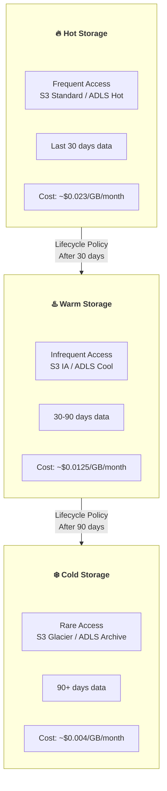

```python
# S3 Lifecycle Policy for automated tiering
import boto3

s3 = boto3.client('s3')

lifecycle_config = {
    'Rules': [
        {
            'ID': 'bronze-tier-data',
            'Filter': {'Prefix': 'bronze/'},
            'Status': 'Enabled',
            'Transitions': [
                {'Days': 30, 'StorageClass': 'STANDARD_IA'},
                {'Days': 90, 'StorageClass': 'GLACIER'},
                {'Days': 365, 'StorageClass': 'DEEP_ARCHIVE'},
            ],
            'Expiration': {'Days': 730},  # Delete after 2 years
        },
        {
            'ID': 'silver-tier-data',
            'Filter': {'Prefix': 'silver/'},
            'Status': 'Enabled',
            'Transitions': [
                {'Days': 90, 'StorageClass': 'STANDARD_IA'},
                {'Days': 180, 'StorageClass': 'GLACIER'},
            ],
        },
        {
            'ID': 'gold-tier-data',
            'Filter': {'Prefix': 'gold/'},
            'Status': 'Enabled',
            'Transitions': [
                {'Days': 180, 'StorageClass': 'STANDARD_IA'},
            ],
            # Gold data rarely moved to Glacier (frequent reads)
        },
    ],
}

s3.put_bucket_lifecycle_configuration(
    Bucket='my-data-lake',
    LifecycleConfiguration=lifecycle_config,
)
```

### 13.2 Compute Cost Optimization

```python
# Spot Instance strategy for batch workloads
from pyspark.sql import SparkSession

# EMR cluster config with spot instances
emr_config = {
    "Name": "DataLakeBatchJob",
    "Instances": {
        "InstanceGroups": [
            {
                "Name": "Master",
                "Market": "ON_DEMAND",  # Master always on-demand
                "InstanceRole": "MASTER",
                "InstanceType": "m5.2xlarge",
                "InstanceCount": 1,
            },
            {
                "Name": "CoreOnDemand",
                "Market": "ON_DEMAND",
                "InstanceRole": "CORE",
                "InstanceType": "r5.2xlarge",
                "InstanceCount": 2,  # Minimum stable cores
            },
            {
                "Name": "TaskSpot",
                "Market": "SPOT",
                "BidPrice": "0.50",
                "InstanceRole": "TASK",
                "InstanceType": "r5.4xlarge",
                "InstanceCount": 10,  # Scale with spot
            },
        ],
    },
}

# Databricks cluster autoscaling policy
cluster_config = {
    "autoscale": {
        "min_workers": 2,
        "max_workers": 20,
    },
    "aws_attributes": {
        "first_on_demand": 3,  # First 3 nodes on-demand
        "availability": "SPOT_WITH_FALLBACK",
        "spot_bid_price_percent": 100,
    },
    "spark_conf": {
        "spark.dynamicAllocation.enabled": "true",
        "spark.dynamicAllocation.minExecutors": "2",
        "spark.dynamicAllocation.maxExecutors": "50",
        "spark.dynamicAllocation.executorIdleTimeout": "60s",
    },
}
```

### 13.3 Data Compaction and Small File Problem

```python
from delta import DeltaTable

# Problem: Many small files = slow reads, high API costs
# Solution: Regular compaction

class DataLakeCompactor:
    """Automated compaction for Delta Lake tables."""
    
    def __init__(self, spark, target_file_size_mb: int = 128):
        self.spark = spark
        self.target_size = target_file_size_mb * 1024 * 1024  # Bytes
    
    def analyze_table(self, table_path: str) -> dict:
        """Analyze file distribution."""
        delta_table = DeltaTable.forPath(self.spark, table_path)
        detail = delta_table.detail().collect()[0]
        
        # Get file statistics
        files_df = self.spark.read.format("delta") \
            .load(table_path) \
            .inputFiles()
        
        # File size analysis from Delta log
        history = delta_table.history().collect()
        
        return {
            "total_files": detail.numFiles,
            "total_size_gb": detail.sizeInBytes / (1024**3),
            "avg_file_size_mb": (detail.sizeInBytes / detail.numFiles) / (1024**2)
                if detail.numFiles > 0 else 0,
            "partitions": detail.numPartitions if hasattr(detail, 'numPartitions') else 'N/A',
        }
    
    def compact_table(self, table_path: str, zorder_columns: list = None):
        """Run compaction (OPTIMIZE)."""
        if zorder_columns:
            zorder_clause = f"ZORDER BY ({', '.join(zorder_columns)})"
        else:
            zorder_clause = ""
        
        self.spark.sql(f"OPTIMIZE delta.`{table_path}` {zorder_clause}")
        
        # Clean up old files
        delta_table = DeltaTable.forPath(self.spark, table_path)
        delta_table.vacuum(168)  # 7-day retention
    
    def auto_compact_check(self, table_path: str) -> bool:
        """Check if compaction is needed."""
        stats = self.analyze_table(table_path)
        
        # Compact if avg file size < 64MB or too many files
        if stats["avg_file_size_mb"] < 64:
            return True
        if stats["total_files"] > 10000:
            return True
        return False

# Iceberg compaction
# CALL catalog.system.rewrite_data_files(
#     table => 'db.table_name',
#     strategy => 'binpack',
#     options => map('target-file-size-bytes', '134217728',
#                     'min-file-size-bytes', '67108864',
#                     'max-file-size-bytes', '201326592')
# )
```

### 13.4 Cost Monitoring Dashboard

```python
# Cost tracking for data lake operations
from dataclasses import dataclass
from typing import Optional

@dataclass
class CostMetric:
    service: str
    category: str  # storage, compute, api, network
    amount_usd: float
    period: str
    details: Optional[dict] = None

class DataLakeCostTracker:
    """Track and alert on data lake costs."""
    
    def __init__(self):
        self.thresholds = {
            "storage_monthly": 10000,
            "compute_daily": 500,
            "api_daily": 100,
        }
    
    def get_s3_costs(self, bucket: str, period: str) -> list:
        """Get S3 storage costs breakdown."""
        ce_client = boto3.client('ce')
        
        response = ce_client.get_cost_and_usage(
            TimePeriod={'Start': '2026-01-01', 'End': '2026-02-01'},
            Granularity='DAILY',
            Metrics=['UnblendedCost'],
            Filter={
                'And': [
                    {'Dimensions': {'Key': 'SERVICE', 'Values': ['Amazon Simple Storage Service']}},
                    {'Tags': {'Key': 'DataLakeBucket', 'Values': [bucket]}},
                ]
            },
            GroupBy=[{'Type': 'DIMENSION', 'Key': 'USAGE_TYPE'}],
        )
        
        return response['ResultsByTime']
    
    def generate_cost_report(self) -> dict:
        """Generate comprehensive cost report."""
        return {
            "storage": {
                "hot_tier_gb": 5000,
                "warm_tier_gb": 15000,
                "cold_tier_gb": 50000,
                "estimated_monthly": 5000 * 0.023 + 15000 * 0.0125 + 50000 * 0.004,
            },
            "compute": {
                "spark_cluster_hours": 720,
                "avg_cost_per_hour": 2.5,
                "estimated_monthly": 720 * 2.5,
            },
            "api_calls": {
                "s3_get_requests_millions": 50,
                "s3_put_requests_millions": 5,
                "estimated_monthly": 50 * 0.4 + 5 * 5,
            },
            "recommendations": [
                "Enable S3 Intelligent-Tiering for bronze layer",
                "Compact small files in silver layer (avg 12MB → target 128MB)",
                "Switch batch jobs to Spot instances (save ~60%)",
                "Enable Delta Lake OPTIMIZE auto-compaction",
            ],
        }
```

---

## PHẦN 14: REAL-WORLD PATTERNS AND CASE STUDIES

### 14.1 Multi-Region Data Lake

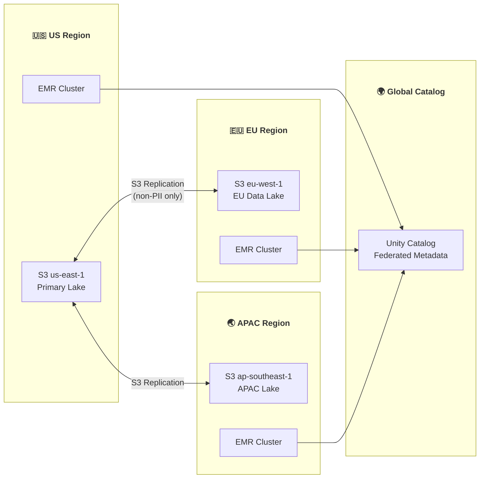

```python
# Multi-region data lake configuration
class MultiRegionLake:
    """Handle data residency requirements across regions."""
    
    REGION_CONFIG = {
        "us": {
            "bucket": "s3://datalake-us-east-1",
            "catalog": "us_catalog",
            "residency": ["US"],  # Data can stay in US
        },
        "eu": {
            "bucket": "s3://datalake-eu-west-1",
            "catalog": "eu_catalog",
            "residency": ["EU"],  # GDPR: EU data stays in EU
        },
        "apac": {
            "bucket": "s3://datalake-ap-southeast-1",
            "catalog": "apac_catalog",
            "residency": ["SG", "JP", "AU"],
        },
    }
    
    def route_data(self, record: dict) -> str:
        """Route data to correct region based on residency rules."""
        user_region = record.get("user_country", "US")
        
        if user_region in ["DE", "FR", "IT", "ES", "NL", "BE"]:
            return "eu"
        elif user_region in ["SG", "JP", "AU", "IN"]:
            return "apac"
        else:
            return "us"
    
    def replicate_non_pii(self, source_region: str, target_region: str):
        """Replicate aggregated (non-PII) data across regions."""
        source = self.REGION_CONFIG[source_region]
        target = self.REGION_CONFIG[target_region]
        
        # Read aggregated data (no PII)
        agg_df = spark.read.format("delta") \
            .load(f"{source['bucket']}/gold/aggregated/")
        
        # Write to target region
        agg_df.write.format("delta") \
            .mode("overwrite") \
            .save(f"{target['bucket']}/gold/aggregated/")
```

### 14.2 Streaming Lakehouse Pattern

```python
from pyspark.sql import SparkSession
from pyspark.sql.functions import *
from delta.tables import DeltaTable

spark = SparkSession.builder \
    .config("spark.sql.streaming.schemaInference", "true") \
    .getOrCreate()

# Bronze: Raw streaming ingestion
bronze_stream = spark.readStream \
    .format("kafka") \
    .option("kafka.bootstrap.servers", "broker:9092") \
    .option("subscribe", "events") \
    .option("startingOffsets", "latest") \
    .load() \
    .select(
        col("key").cast("string"),
        col("value").cast("string"),
        col("timestamp"),
        col("topic"),
        col("partition"),
        col("offset"),
    )

bronze_stream.writeStream \
    .format("delta") \
    .outputMode("append") \
    .option("checkpointLocation", "/checkpoints/bronze_events") \
    .trigger(processingTime="1 minute") \
    .toTable("bronze.events")

# Silver: Cleaned and deduplicated stream
silver_stream = spark.readStream \
    .format("delta") \
    .table("bronze.events") \
    .select(
        from_json(col("value"), event_schema).alias("data"),
        col("timestamp").alias("kafka_timestamp"),
    ) \
    .select("data.*", "kafka_timestamp") \
    .withWatermark("event_time", "10 minutes") \
    .dropDuplicates(["event_id"])

silver_stream.writeStream \
    .format("delta") \
    .outputMode("append") \
    .option("checkpointLocation", "/checkpoints/silver_events") \
    .trigger(processingTime="5 minutes") \
    .toTable("silver.events")

# Gold: Real-time aggregations with foreachBatch
def upsert_to_gold(batch_df, batch_id):
    """Merge streaming micro-batch into gold table."""
    # Aggregate the micro-batch
    agg_df = batch_df.groupBy(
        window("event_time", "1 hour").alias("window"),
        "event_type",
        "region",
    ).agg(
        count("*").alias("event_count"),
        sum("revenue").alias("total_revenue"),
        approx_count_distinct("user_id").alias("unique_users"),
    ).select(
        col("window.start").alias("window_start"),
        col("window.end").alias("window_end"),
        "event_type", "region",
        "event_count", "total_revenue", "unique_users",
    )
    
    # Upsert into gold table
    gold_table = DeltaTable.forName(spark, "gold.hourly_metrics")
    
    gold_table.alias("t").merge(
        agg_df.alias("s"),
        """t.window_start = s.window_start 
           AND t.event_type = s.event_type 
           AND t.region = s.region"""
    ).whenMatchedUpdate(set={
        "event_count": "t.event_count + s.event_count",
        "total_revenue": "t.total_revenue + s.total_revenue",
        "unique_users": "s.unique_users",  # Approximate, take latest
    }).whenNotMatchedInsertAll().execute()

spark.readStream \
    .format("delta") \
    .table("silver.events") \
    .writeStream \
    .foreachBatch(upsert_to_gold) \
    .option("checkpointLocation", "/checkpoints/gold_metrics") \
    .trigger(processingTime="15 minutes") \
    .start()
```

### 14.3 Migration from Data Warehouse to Lakehouse

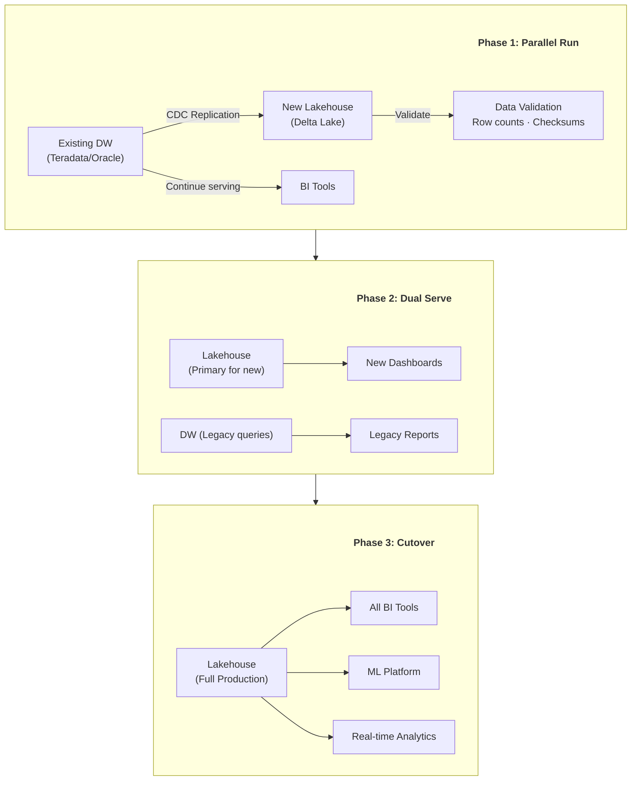

```python
# Migration validation framework
class MigrationValidator:
    """Validate data warehouse to lakehouse migration."""
    
    def __init__(self, source_conn, target_spark):
        self.source = source_conn  # JDBC to DW
        self.target = target_spark  # Spark session
    
    def validate_table(self, source_table: str, target_table: str) -> dict:
        """Run comprehensive validation between source and target."""
        results = {
            "table": source_table,
            "checks": [],
            "passed": True,
        }
        
        # 1. Row count check
        source_count = self._get_source_count(source_table)
        target_count = self.target.table(target_table).count()
        count_match = abs(source_count - target_count) / max(source_count, 1) < 0.001
        results["checks"].append({
            "check": "row_count",
            "source": source_count,
            "target": target_count,
            "passed": count_match,
        })
        
        # 2. Column checksum
        numeric_cols = self._get_numeric_columns(target_table)
        for col_name in numeric_cols:
            source_sum = self._get_source_sum(source_table, col_name)
            target_sum = self.target.table(target_table) \
                .agg({col_name: "sum"}).collect()[0][0]
            
            # Allow 0.01% tolerance for floating point
            tolerance = abs(source_sum) * 0.0001
            sum_match = abs(source_sum - (target_sum or 0)) <= tolerance
            results["checks"].append({
                "check": f"checksum_{col_name}",
                "source": source_sum,
                "target": target_sum,
                "passed": sum_match,
            })
            if not sum_match:
                results["passed"] = False
        
        # 3. Null distribution check
        for col_name in self._get_all_columns(target_table):
            source_nulls = self._get_source_null_count(source_table, col_name)
            target_nulls = self.target.table(target_table) \
                .filter(f"{col_name} IS NULL").count()
            null_match = source_nulls == target_nulls
            results["checks"].append({
                "check": f"null_count_{col_name}",
                "source": source_nulls,
                "target": target_nulls,
                "passed": null_match,
            })
        
        return results
    
    def generate_report(self, tables: list) -> str:
        """Generate full migration validation report."""
        all_results = []
        for source_t, target_t in tables:
            result = self.validate_table(source_t, target_t)
            all_results.append(result)
        
        passed = sum(1 for r in all_results if r["passed"])
        total = len(all_results)
        
        report = f"Migration Validation: {passed}/{total} tables passed\n"
        for r in all_results:
            status = "✅" if r["passed"] else "❌"
            failed_checks = [c for c in r["checks"] if not c["passed"]]
            report += f"{status} {r['table']}: {len(r['checks']) - len(failed_checks)}/{len(r['checks'])} checks passed\n"
            for fc in failed_checks:
                report += f"   ❌ {fc['check']}: source={fc['source']}, target={fc['target']}\n"
        
        return report
```

---

## PHẦN 15: RESOURCES

### 12.1 Essential Reading

| Resource | Type | Focus |
|----------|------|-------|
| Delta Lake: High-Performance ACID | Paper | Delta internals |
| Apache Iceberg: Netflix Experience | Blog | Iceberg at scale |
| Lakehouse: A New Generation | Paper | Lakehouse concept |
| Data Mesh (Zhamak Dehghani) | Book | Data architecture |
| Designing Data-Intensive Applications | Book | Distributed systems |
| Building Evolutionary Architectures | Book | Architecture patterns |

### 12.2 Tools Ecosystem

| Tool | Category | Description |
|------|----------|-------------|
| Delta Lake | Table Format | Databricks-backed, ACID on Parquet |
| Apache Iceberg | Table Format | Netflix-backed, partition evolution |
| Apache Hudi | Table Format | Uber-backed, incremental processing |
| Unity Catalog | Governance | Databricks unified catalog |
| Apache Polaris | Catalog | Open source Iceberg catalog |
| Project Nessie | Catalog | Git-like data catalog |
| LakeFS | Versioning | Git for data lakes |
| Great Expectations | Quality | Data validation framework |
| dbt | Transformation | SQL transformation tool |
| Apache Airflow | Orchestration | Workflow scheduler |

---

*Document Version: 2.0*
*Last Updated: February 2026*
*Coverage: Data Lake Architecture, Lakehouse, Medallion Pattern, Open Table Formats, Data Mesh, Data Products*
