# Distributed Systems Fundamentals - Complete Guide

## CAP Theorem, Consistency Models, Partitioning, Replication

---

## PHẦN 1: INTRODUCTION TO DISTRIBUTED SYSTEMS

### 1.1 Distributed System Là Gì?

Distributed System là một tập hợp các máy tính độc lập, giao tiếp qua network, phối hợp để thực hiện một nhiệm vụ chung. Với người dùng, hệ thống hoạt động như một đơn vị thống nhất.

**Tại sao cần Distributed Systems:**
- **Scalability** - Xử lý lượng data và request lớn
- **Reliability** - Hệ thống vẫn hoạt động khi có failures
- **Performance** - Xử lý song song, giảm latency
- **Geographic distribution** - Data gần người dùng
- **Cost efficiency** - Commodity hardware thay vì mainframe

### 1.2 Challenges của Distributed Systems

```
The 8 Fallacies of Distributed Computing (Peter Deutsch):

1. The network is reliable
   Reality: Networks fail, packets drop, connections timeout

2. Latency is zero
   Reality: Network calls take time (ms to seconds)

3. Bandwidth is infinite
   Reality: Limited, especially cross-datacenter

4. The network is secure
   Reality: Need encryption, authentication

5. Topology doesn't change
   Reality: Nodes added/removed, network reconfigured

6. There is one administrator
   Reality: Multiple teams, organizations

7. Transport cost is zero
   Reality: Data transfer costs money and time

8. The network is homogeneous
   Reality: Different protocols, hardware, versions
```

### 1.3 Distributed Systems in Data Engineering

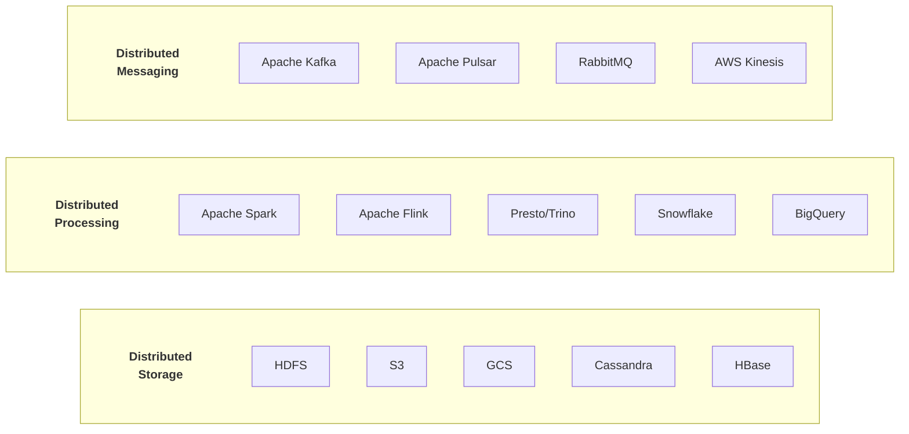

---

## PHẦN 2: CAP THEOREM

### 2.1 CAP Theorem Explained

CAP Theorem (Brewer's Theorem) nói rằng một distributed system chỉ có thể đảm bảo tối đa 2 trong 3 thuộc tính:

```
                          C
                         /\
                        /  \
                       /    \
                      / CA   \
                     /  systems\
                    /    (rare) \
                   +--------------+
                  /                \
                 / CP              AP \
                / systems        systems\
               /                        \
              +------------+-------------+
             P                           A

C = Consistency
A = Availability  
P = Partition Tolerance
```

**Consistency (C):**
- Mọi read đều nhận được giá trị mới nhất
- Tất cả nodes thấy cùng data tại cùng thời điểm
- Linearizability - operations appear atomic

**Availability (A):**
- Mọi request đều nhận được response (không bị timeout)
- Hệ thống luôn sẵn sàng phục vụ
- No downtime cho reads và writes

**Partition Tolerance (P):**
- Hệ thống tiếp tục hoạt động dù có network partition
- Messages có thể bị mất hoặc delay giữa nodes
- Must handle network failures gracefully

### 2.2 Tại Sao Phải Chọn?

**Network Partitions là Inevitable:**
- Networks fail (cables cut, switches crash)
- In distributed systems, P is non-negotiable
- Real choice: CP or AP when partition occurs

**Trade-off Scenarios:**

**CP System (Choose Consistency):**

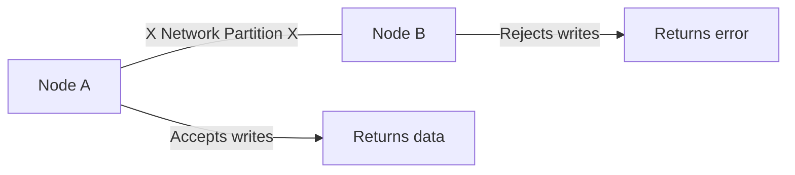

> "I'd rather give you an error than wrong data"

**AP System (Choose Availability):**

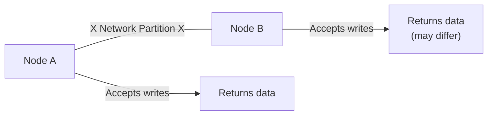

> "I'd rather give you potentially stale data than an error"

### 2.3 System Classification

**CP Systems (Consistency + Partition Tolerance):**
- MongoDB (with majority write concern)
- HBase
- Redis Cluster (in certain configs)
- ZooKeeper
- etcd
- Google Spanner (uses TrueTime)

**AP Systems (Availability + Partition Tolerance):**
- Cassandra
- DynamoDB
- CouchDB
- Riak
- Amazon S3 (eventually consistent reads)

**CA Systems (Consistency + Availability):**
- Only possible without partitions
- Single-node databases (PostgreSQL, MySQL)
- In practice, not achievable in distributed systems

### 2.4 PACELC Theorem

Extension of CAP - what happens when there's NO partition:

```
PACELC: When there is a Partition (P), choose Availability (A) or Consistency (C);
        Else (E), when system is running normally, choose Latency (L) or Consistency (C)

                    Partition?
                   /         \
                 Yes          No
                /               \
        Choose A or C      Choose L or C
        
Systems:
- DynamoDB: PA/EL (favor availability and latency)
- Cassandra: PA/EL
- MongoDB: PC/EC (favor consistency)
- HBase: PC/EC
- Spanner: PC/EC (but low latency due to TrueTime)
```

---

## PHẦN 3: CONSISTENCY MODELS

### 3.1 Consistency Spectrum

```
Strong <-----------------------------------------> Weak
Linearizability  Sequential  Causal  Eventual  Read-your-writes
       |             |          |        |           |
       v             v          v        v           v
   Highest        High      Medium     Low       Pragmatic
   Latency       Latency   Latency   Latency     Balance
   
   Strongest                                    Most Available
   Guarantees                                   System
```

### 3.2 Strong Consistency (Linearizability)

- Mọi operation xuất hiện xảy ra tại một thời điểm cụ thể
- Reads luôn trả về giá trị của write gần nhất
- Operations có global ordering

```
Example:
Time  -->
Client A:  ----[Write X=1]--------
Client B:  --------[Read X]-------
                      |
                      v
                   Returns 1 (guaranteed)

Implementation:
- Single leader replication with sync writes
- Consensus protocols (Paxos, Raft)
- Very expensive (high latency)
```

### 3.3 Sequential Consistency

- Operations từ một client xuất hiện theo thứ tự
- Global order exists but clients may see different orders

```
Example:
Client A: Write X=1, Write X=2
Client B: Read X

Possible outcomes:
- Client B sees: 1, then 2 (respects A's order)
- Client B sees: 2 only (missed 1, but still valid)
- Client B CANNOT see: 2, then 1 (violates A's order)
```

### 3.4 Causal Consistency

- Causally related operations có thứ tự
- Concurrent operations có thể thấy theo thứ tự khác nhau

```
Example:
Client A: Write X=1
Client B: (sees X=1) Write Y=2

Causal relationship: Y=2 depends on X=1

Any client that sees Y=2 MUST have seen X=1 first
(Causality preserved)

But concurrent writes to unrelated keys can appear in any order
```

### 3.5 Eventual Consistency

- Nếu không có writes mới, cuối cùng tất cả reads sẽ trả về cùng giá trị
- No ordering guarantees
- Highest availability

```
Example:
Time  -->
Write X=1  ----+
               |
Node A:  [1]---[1]---[1]---[1]
Node B:  [old]-[old]-[1]---[1]
Node C:  [old]-[old]-[old]-[1]
                            |
                       Eventually consistent
                       
Common in:
- DNS
- CDN caches
- DynamoDB (default reads)
- Cassandra (lower consistency levels)
```

### 3.6 Read-Your-Writes Consistency

- Client luôn thấy writes của chính mình
- Important for user experience

```
Example:
User updates profile photo:
1. Upload new photo (write)
2. Refresh page (read)
3. Should see new photo, not old one

Implementation:
- Sticky sessions (route to same replica)
- Read from leader for recent writes
- Version vectors/timestamps
```

### 3.7 Tunable Consistency (Cassandra Example)

```
Cassandra cho phép tune consistency per-query:

Consistency Levels:
- ONE: Read/write từ 1 replica
- QUORUM: Majority of replicas (N/2 + 1)
- ALL: All replicas must respond
- LOCAL_QUORUM: Quorum within local datacenter

Formula for Strong Consistency:
R + W > N

Where:
- R = Read consistency level
- W = Write consistency level
- N = Replication factor

Example (N=3):
- W=QUORUM (2), R=QUORUM (2): 2+2=4 > 3 ✓ Strong
- W=ONE (1), R=ALL (3): 1+3=4 > 3 ✓ Strong
- W=ONE (1), R=ONE (1): 1+1=2 < 3 ✗ Eventual
```

---

## PHẦN 4: DATA PARTITIONING (SHARDING)

### 4.1 Why Partition?

- **Scale horizontally** - Distribute load across machines
- **Improve performance** - Parallel processing
- **Manage large datasets** - Break into manageable chunks

### 4.2 Partitioning Strategies

**Range Partitioning:**

```
Partition by value ranges:

Partition 1: A-F     [Alice, Bob, Carol, David, Eve, Frank]
Partition 2: G-M     [George, Henry, Ivan, John, Kevin, Larry]
Partition 3: N-S     [Nancy, Oscar, Peter, Quinn, Robert, Steve]
Partition 4: T-Z     [Tom, Uma, Victor, William, Xavier, Yara, Zack]

Pros:
- Range queries efficient
- Easy to understand

Cons:
- Hot spots if data skewed (e.g., many names start with 'S')
- Uneven distribution
```

**Hash Partitioning:**

```
Partition = hash(key) % num_partitions

Example with 4 partitions:
- hash("Alice") % 4 = 2  → Partition 2
- hash("Bob") % 4 = 0    → Partition 0
- hash("Carol") % 4 = 1  → Partition 1

Pros:
- Even distribution (good hash function)
- No hot spots

Cons:
- Range queries require scatter-gather
- Adding partitions requires redistribution
```

**Consistent Hashing:**

```
Ring-based approach for dynamic scaling:

          0°
          |
    +-----------+
   /      |      \
  /   P1  |  P2   \
270° -----+------ 90°
  \   P4  |  P3   /
   \      |      /
    +-----------+
          |
        180°

Keys hashed to ring position, assigned to next partition clockwise

Adding new partition:
- Only affects adjacent partitions
- Minimal data movement

Used in:
- Cassandra
- DynamoDB
- Riak
```

**Directory-Based Partitioning:**

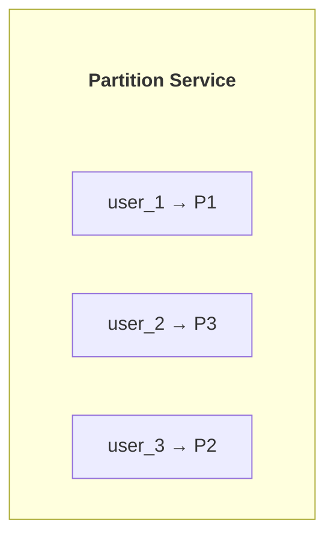

Pros:
- Flexible mapping
- Easy to rebalance

Cons:
- Single point of failure
- Additional lookup latency

### 4.3 Partition Keys

**Choosing Good Partition Keys:**

```
Goals:
- Even data distribution
- Query patterns match partition key
- Avoid hot partitions

Bad partition keys:
- Boolean values (only 2 partitions!)
- Low cardinality fields
- Monotonically increasing IDs (all go to last partition)
- Time-based without additional key (all recent data in one partition)

Good partition keys:
- User ID (high cardinality, even distribution)
- Order ID (unique, well-distributed)
- Composite keys (region + date for time-series)
```

**Composite Partition Keys:**

```sql
-- Cassandra example
CREATE TABLE events (
    tenant_id UUID,
    event_date DATE,
    event_id UUID,
    event_data TEXT,
    PRIMARY KEY ((tenant_id, event_date), event_id)
);

-- Partition key: (tenant_id, event_date)
-- Clustering key: event_id

-- Distributes data by tenant and date
-- Queries within partition are efficient
```

### 4.4 Hot Spot Mitigation

```
Problem: Celebrity/VIP partition gets all traffic

Solutions:

1. Add random suffix:
   Original: user_123
   Modified: user_123_0, user_123_1, ..., user_123_9
   
   Read requires scatter-gather across 10 partitions

2. Separate hot keys:
   Detect hot keys dynamically
   Route to dedicated partition/cache

3. Time-based suffix:
   key_2024-01-15-10 (hour-based)
   Spreads time-series data
```

---

## PHẦN 5: REPLICATION

### 5.1 Why Replicate?

- **High availability** - System continues if nodes fail
- **Fault tolerance** - Data not lost with node failure
- **Reduced latency** - Read from geographically close replica
- **Increased read throughput** - Distribute reads across replicas

### 5.2 Replication Strategies

**Single Leader (Master-Slave):**

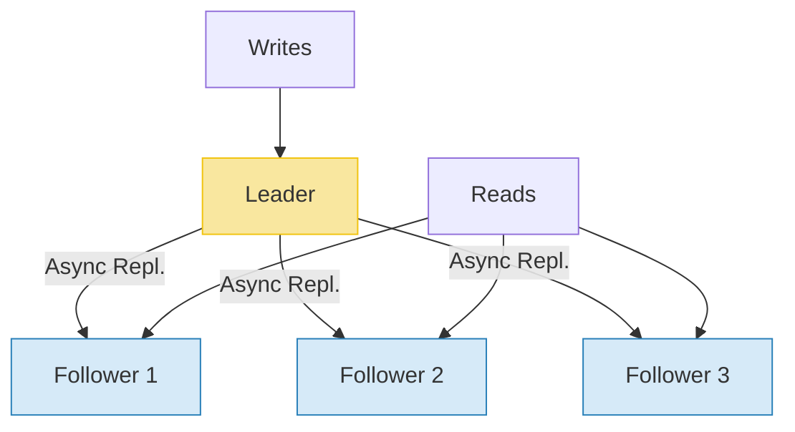

```
Pros:
- Simple, easy to understand
- Strong consistency possible (sync replication)
- Read scaling

Cons:
- Leader is bottleneck for writes
- Failover complexity
- Async replication = potential data loss
```

**Multi-Leader:**

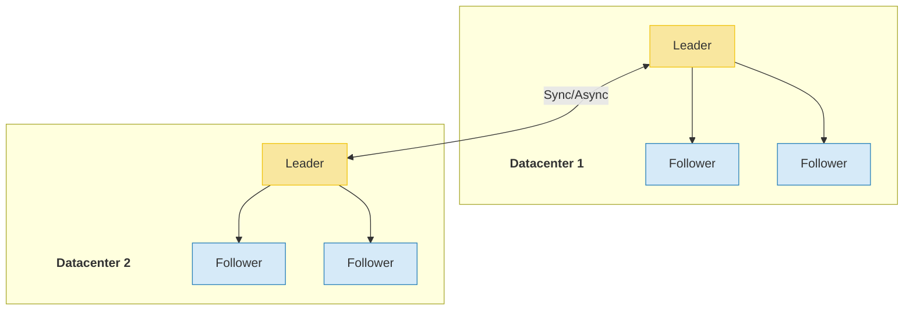

```
Use cases:
- Multi-datacenter operation
- Offline-capable clients
- Collaborative editing

Challenges:
- Write conflicts
- Conflict resolution strategies needed
```

**Leaderless:**

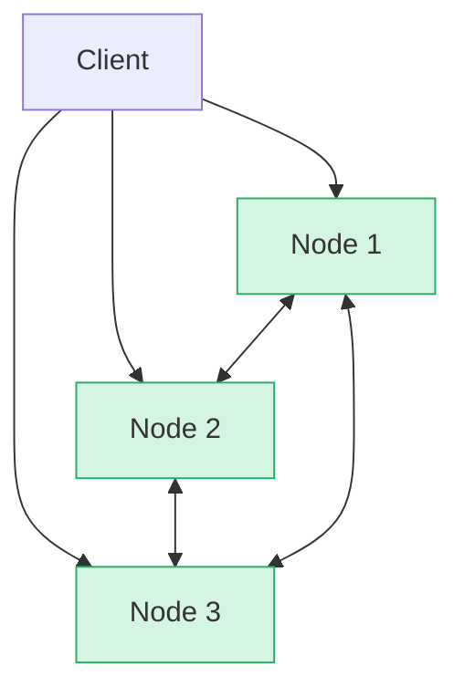

```
All nodes accept reads and writes.
Write to W nodes, Read from R nodes
Quorum: W + R > N for consistency

Used in:
- Cassandra
- DynamoDB
- Riak
```

### 5.3 Synchronous vs Asynchronous Replication

**Synchronous:**

```
Client     Leader     Follower1    Follower2
   |         |            |            |
   |--Write->|            |            |
   |         |---Sync---->|            |
   |         |<---ACK-----|            |
   |         |---Sync--------------->  |
   |         |<---ACK----------------- |
   |<--OK----|            |            |

Pros:
- Guaranteed durability
- No data loss on leader failure

Cons:
- High latency
- Write blocked if any follower slow/down
```

**Asynchronous:**

```
Client     Leader     Follower1    Follower2
   |         |            |            |
   |--Write->|            |            |
   |<--OK----|            |            |
   |         |---Async--->|            |
   |         |---Async-------------->  |

Pros:
- Low latency
- High availability

Cons:
- Potential data loss
- Replication lag
```

**Semi-Synchronous:**

```
Wait for at least 1 follower:

Client     Leader     Follower1    Follower2
   |         |            |            |
   |--Write->|            |            |
   |         |---Sync---->|            |
   |         |<---ACK-----|            |
   |<--OK----|            |            |
   |         |---Async-------------->  |

Used in MySQL, PostgreSQL
Balance between durability and latency
```

### 5.4 Handling Replication Lag

**Read-after-write consistency:**

```python
# Approach 1: Read from leader for recent writes
def read_user_profile(user_id, last_write_time):
    if time.now() - last_write_time < 60:  # Within 1 minute
        return read_from_leader(user_id)
    else:
        return read_from_follower(user_id)

# Approach 2: Wait for replication
def write_with_read_consistency(data):
    version = write_to_leader(data)
    wait_for_replication(version, timeout=5)
    return version
```

**Monotonic reads:**

```python
# Track version seen by user
def read_with_monotonic(user_id, user_session):
    min_version = user_session.get('last_seen_version', 0)
    
    for follower in get_followers():
        if follower.version >= min_version:
            result = follower.read(user_id)
            user_session['last_seen_version'] = result.version
            return result
    
    # Fallback to leader
    return read_from_leader(user_id)
```

---

## PHẦN 6: CONSENSUS PROTOCOLS

### 6.1 Why Consensus?

Distributed nodes need to agree on:
- Leader election
- Transaction commits
- Replicated state machine
- Configuration changes

### 6.2 Paxos

**Classic consensus algorithm (complex but foundational):**

```
Roles:
- Proposer: Initiates proposals
- Acceptor: Votes on proposals  
- Learner: Learns decided values

Two phases:

Phase 1 (Prepare):
Proposer                    Acceptors
    |----Prepare(n)-------->|
    |                       |
    |<---Promise(n, prev)---|

Phase 2 (Accept):
Proposer                    Acceptors
    |----Accept(n, v)------>|
    |                       |
    |<---Accepted(n, v)-----|

Majority required for each phase
```

### 6.3 Raft

**Easier to understand consensus:**

```
States: Follower, Candidate, Leader

Election:
1. Followers wait for heartbeat
2. Timeout → become Candidate
3. Request votes from others
4. Majority → become Leader
5. Leader sends heartbeats

Log Replication:
1. Leader receives write
2. Appends to log
3. Replicates to followers
4. Majority ACK → committed
5. Apply to state machine

Term: Logical clock, increments with each election
```

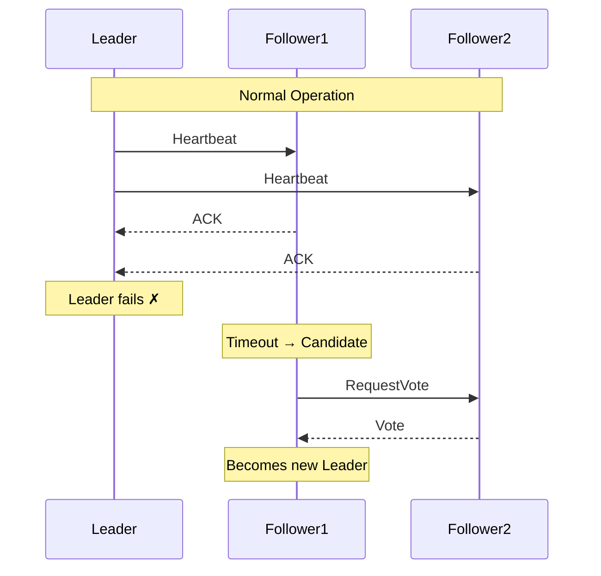

### 6.4 Consensus in Practice

**ZooKeeper (ZAB):**
- Leader-based consensus
- Used for: Coordination, configuration, leader election
- Clients: Kafka, HBase, Hadoop

**etcd (Raft):**
- Distributed key-value store
- Used for: Kubernetes, service discovery

**Kafka (KRaft):**
- Replacing ZooKeeper dependency
- Built on Raft protocol
- Controller quorum for metadata

---

## PHẦN 7: DISTRIBUTED TRANSACTIONS

### 7.1 Two-Phase Commit (2PC)

```
Phase 1 - Prepare:
Coordinator              Participants
    |                    P1    P2    P3
    |----Prepare-------->|     |     |
    |----Prepare-------------->|     |
    |----Prepare------------------>  |
    |                    |     |     |
    |<---Vote YES--------|     |     |
    |<---Vote YES-------------|     |
    |<---Vote YES------------------|

Phase 2 - Commit:
Coordinator              Participants
    |                    P1    P2    P3
    |----Commit--------->|     |     |
    |----Commit-------------->|     |
    |----Commit------------------->  |
    |                    |     |     |
    |<---ACK-------------|     |     |
    |<---ACK------------------|     |
    |<---ACK----------------------|

If any vote NO → ABORT all
```

**Problems with 2PC:**
- Blocking: Participants wait for coordinator
- Coordinator failure = stuck transactions
- Single point of failure

### 7.2 Three-Phase Commit (3PC)

```
Adds Pre-Commit phase:
1. Prepare (can abort)
2. Pre-Commit (uncertain, can timeout)
3. Commit (decided)

Reduces blocking but more complex
Not commonly used in practice
```

### 7.3 Saga Pattern

**For long-running distributed transactions:**

```
Saga: Sequence of local transactions with compensating actions

T1 --> T2 --> T3 --> T4 --> T5 (success)
  \     \     \     \
   C1    C2    C3    C4 (compensating transactions if failure)

Example - Order Processing:
T1: Create Order
T2: Reserve Inventory
T3: Process Payment
T4: Ship Order

If T3 fails:
C2: Release Inventory
C1: Cancel Order

**Choreography (events):**

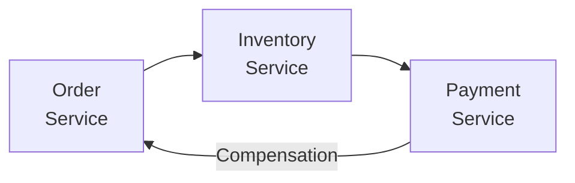

**Orchestration (central coordinator):**

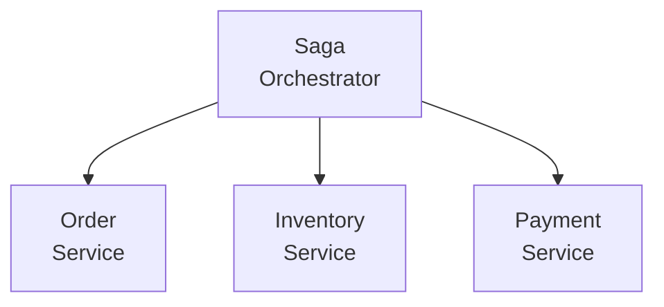

### 7.4 Eventual Consistency Patterns

**Outbox Pattern:**

```
Same database transaction:
1. Write business data
2. Write event to outbox table

Separate process:
3. Read from outbox
4. Publish to message queue
5. Mark as processed

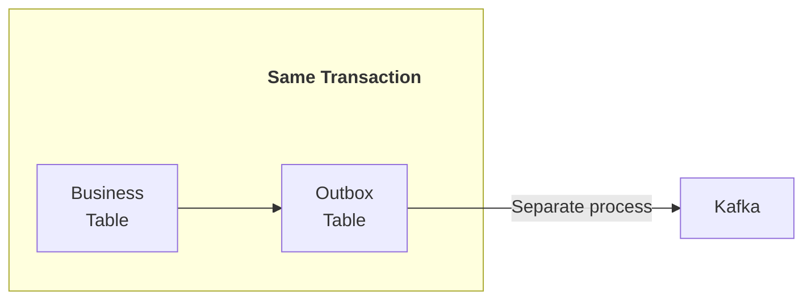

Guarantees at-least-once delivery
```

**Change Data Capture (CDC):**

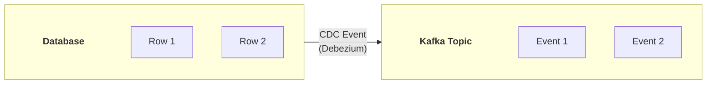

Captures all changes to database
Events delivered to downstream systems

---

## PHẦN 8: DISTRIBUTED SYSTEM PATTERNS

### 8.1 Leader Election

```python
# Using ZooKeeper for leader election
from kazoo.client import KazooClient

zk = KazooClient(hosts='zk1:2181,zk2:2181,zk3:2181')
zk.start()

# Create ephemeral sequential node
election_path = "/election"
node_path = zk.create(
    f"{election_path}/candidate_",
    ephemeral=True,
    sequence=True
)

def check_leader():
    children = sorted(zk.get_children(election_path))
    my_node = node_path.split("/")[-1]
    
    if children[0] == my_node:
        print("I am the leader!")
        return True
    else:
        # Watch node before me
        watch_node = children[children.index(my_node) - 1]
        zk.exists(f"{election_path}/{watch_node}", watch=on_node_change)
        return False

def on_node_change(event):
    check_leader()
```

### 8.2 Distributed Locking

```python
# Redis distributed lock (Redlock algorithm simplified)
import redis
import time
import uuid

class DistributedLock:
    def __init__(self, redis_client, lock_name, ttl=10):
        self.redis = redis_client
        self.lock_name = lock_name
        self.ttl = ttl
        self.lock_value = str(uuid.uuid4())
    
    def acquire(self, timeout=30):
        start = time.time()
        while time.time() - start < timeout:
            # SET NX with expiry
            if self.redis.set(
                self.lock_name, 
                self.lock_value, 
                nx=True, 
                ex=self.ttl
            ):
                return True
            time.sleep(0.1)
        return False
    
    def release(self):
        # Only release if we own the lock
        script = """
        if redis.call("get", KEYS[1]) == ARGV[1] then
            return redis.call("del", KEYS[1])
        else
            return 0
        end
        """
        self.redis.eval(script, 1, self.lock_name, self.lock_value)

# Usage
lock = DistributedLock(redis_client, "my-resource-lock")
if lock.acquire():
    try:
        # Critical section
        process_resource()
    finally:
        lock.release()
```

### 8.3 Circuit Breaker

```python
import time
from enum import Enum

class CircuitState(Enum):
    CLOSED = "closed"      # Normal operation
    OPEN = "open"          # Failing, reject requests
    HALF_OPEN = "half_open"  # Testing if service recovered

class CircuitBreaker:
    def __init__(self, failure_threshold=5, recovery_timeout=30):
        self.failure_threshold = failure_threshold
        self.recovery_timeout = recovery_timeout
        self.failures = 0
        self.last_failure_time = None
        self.state = CircuitState.CLOSED
    
    def call(self, func, *args, **kwargs):
        if self.state == CircuitState.OPEN:
            if time.time() - self.last_failure_time > self.recovery_timeout:
                self.state = CircuitState.HALF_OPEN
            else:
                raise Exception("Circuit breaker is OPEN")
        
        try:
            result = func(*args, **kwargs)
            self._on_success()
            return result
        except Exception as e:
            self._on_failure()
            raise
    
    def _on_success(self):
        self.failures = 0
        self.state = CircuitState.CLOSED
    
    def _on_failure(self):
        self.failures += 1
        self.last_failure_time = time.time()
        if self.failures >= self.failure_threshold:
            self.state = CircuitState.OPEN

# Usage
breaker = CircuitBreaker(failure_threshold=5, recovery_timeout=60)

def call_external_service():
    return breaker.call(external_api.fetch_data)
```

### 8.4 Retry with Exponential Backoff

```python
import time
import random

def retry_with_backoff(
    func, 
    max_retries=5, 
    base_delay=1, 
    max_delay=60,
    jitter=True
):
    for attempt in range(max_retries):
        try:
            return func()
        except Exception as e:
            if attempt == max_retries - 1:
                raise
            
            # Calculate delay with exponential backoff
            delay = min(base_delay * (2 ** attempt), max_delay)
            
            # Add jitter to prevent thundering herd
            if jitter:
                delay = delay * (0.5 + random.random())
            
            print(f"Attempt {attempt + 1} failed, retrying in {delay:.2f}s")
            time.sleep(delay)

# Usage
result = retry_with_backoff(lambda: api_client.fetch_data())
```

---

## PHẦN 9: CLOCKS AND TIME

### 9.1 The Problem with Time

```
Physical clocks are not reliable in distributed systems:

Node A clock: 10:00:00.000
Node B clock: 10:00:00.150  (150ms drift)

Event order can appear wrong:
- Event 1 on Node A at 10:00:00.100
- Event 2 on Node B at 10:00:00.050 (but actually happened after!)

Problems:
- Clock skew between nodes
- Clock drift over time
- NTP synchronization is not perfect
- Leap seconds
```

### 9.2 Logical Clocks

**Lamport Timestamps:**

```
Rules:
1. Before event: increment counter
2. Before send: increment, attach to message
3. On receive: counter = max(local, received) + 1

Example:
Node A: [1] --> [2] --> [3] --> [4]
              send          receive
                |              ^
                v              |
Node B:       [1] --> [2] --> [5]
             receive        send

Event with lower timestamp happened-before higher
But same timestamp doesn't mean concurrent!
```

**Vector Clocks:**

```
Each node maintains vector of counters:

3 nodes: [A_count, B_count, C_count]

Node A: [1,0,0] --> [2,0,0] --> [3,0,0] --> [4,2,0]
                    send                   receive
                      |                      ^
                      v                      |
Node B:           [1,1,0] --> [1,2,0] --> send
                  receive

Comparing vectors:
- [2,2,0] > [1,1,0] : 2>1, 2>1, 0>=0
- [2,1,0] || [1,2,0] : concurrent (neither dominates)

Detects causality AND concurrency
```

### 9.3 Hybrid Logical Clocks (HLC)

```
Combines physical and logical time:

HLC = (physical_time, logical_counter)

When physical_time advances: reset logical_counter
When events happen same physical_time: increment logical_counter

Benefits:
- Bounded difference from physical time
- Captures causality
- Used in CockroachDB, MongoDB
```

### 9.4 Google TrueTime

```
Google Spanner's approach:

TrueTime API returns interval: [earliest, latest]
Represents uncertainty in current time

API:
- TT.now() → TTInterval
- TT.after(t) → true if definitely after t
- TT.before(t) → true if definitely before t

Usage in Spanner:
1. Acquire locks
2. Assign timestamp = TT.now().latest
3. Wait until TT.after(timestamp)
4. Commit (now safe that timestamp is in past)

Requires GPS + atomic clocks in datacenters
Trade-off: Wait time = uncertainty interval
```

---

## PHẦN 10: DISTRIBUTED SYSTEMS FOR DATA ENGINEERING

### 10.1 Apache Kafka Architecture

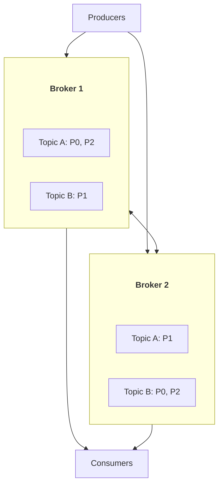

Partitions distributed across brokers
Replication for fault tolerance
Consumer groups for parallel processing

### 10.2 Apache Spark Architecture

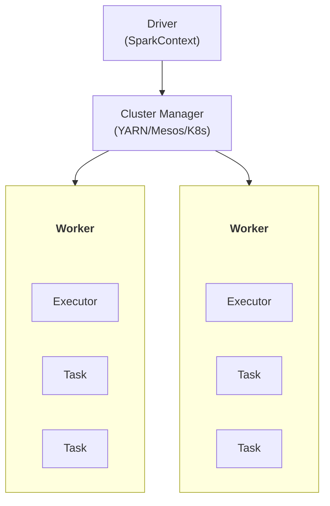

RDD/DataFrame partitioned across executors
Shuffle operations redistribute data
Fault tolerance via RDD lineage

### 10.3 Apache Flink Architecture

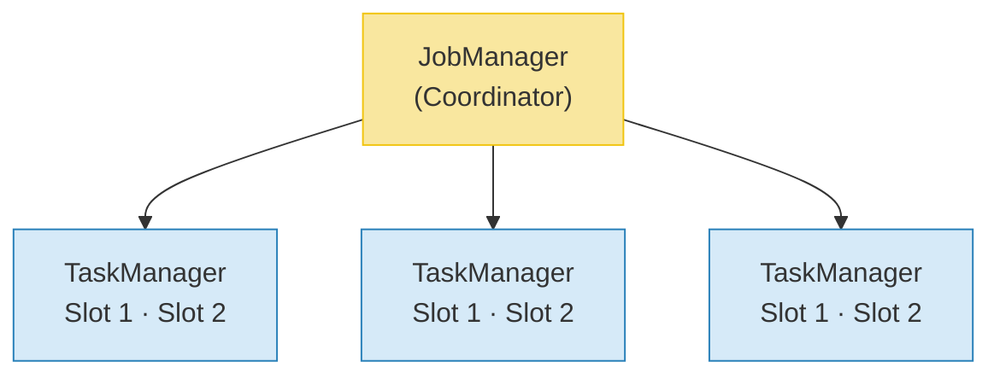

```
Checkpointing for exactly-once
Savepoints for versioned state
Event time processing
```

---

## PHẦN 11: BEST PRACTICES

### 11.1 Design Principles

**Design for Failure:**
- Assume any component can fail
- Implement timeouts everywhere
- Use circuit breakers
- Have fallback strategies

**Idempotency:**
- Same operation multiple times = same result
- Essential for retry logic
- Use idempotency keys

**Observability:**
- Distributed tracing (Jaeger, Zipkin)
- Centralized logging
- Metrics and alerting

### 11.2 Testing Distributed Systems

```
Types of testing:

1. Unit tests with mocked dependencies
2. Integration tests with containers
3. Chaos engineering (Netflix Chaos Monkey)
4. Load testing (Locust, k6)

Chaos experiments:
- Kill random nodes
- Inject network latency
- Partition network
- Fill disk
- CPU stress
```

### 11.3 Monitoring Checklist

```
□ Request latency (p50, p95, p99)
□ Error rates
□ Throughput (requests/second)
□ Saturation (resource utilization)
□ Replication lag
□ Queue depths
□ Connection pool utilization
□ Disk space
□ Memory usage
□ GC pauses
```

---

*Document Version: 1.0*
*Last Updated: February 2026*
*Coverage: CAP, Consistency, Partitioning, Replication, Consensus, Distributed Transactions*
