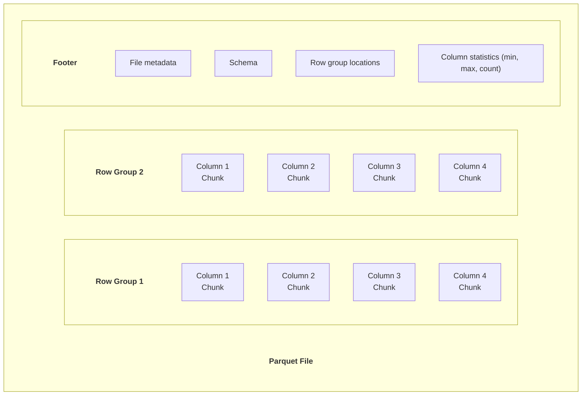
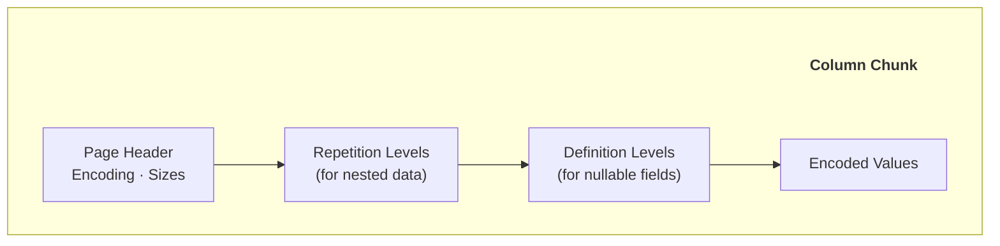
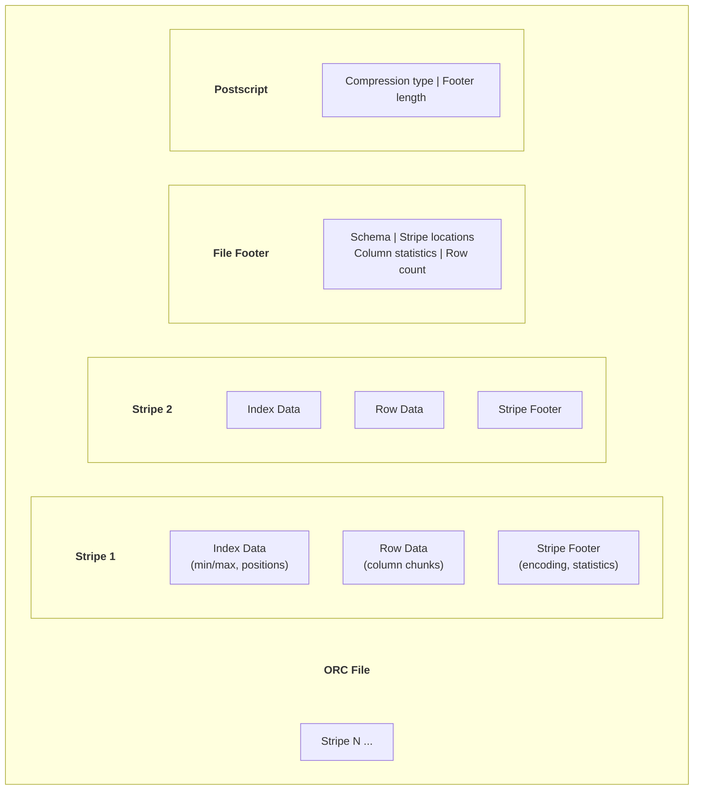
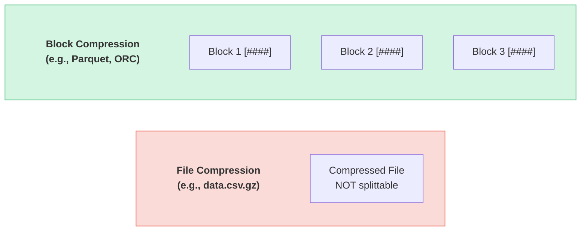

# Data Formats & Storage - Complete Guide

## Parquet, Avro, ORC, JSON, Compression, và Storage Patterns

---

## PHẦN 1: DATA FORMAT FUNDAMENTALS

### 1.1 Tại Sao Data Format Quan Trọng?

Lựa chọn data format ảnh hưởng đến:
- **Storage cost** - Compression efficiency
- **Query performance** - Read patterns
- **Schema evolution** - Adding/removing fields
- **Interoperability** - Tool support
- **Processing speed** - Serialization/deserialization

### 1.2 Row-Oriented vs Column-Oriented

```
ROW-ORIENTED (Row Store):

| ID | Name  | Age | Salary |
|----|-------|-----|--------|
| 1  | Alice | 30  | 50000  |
| 2  | Bob   | 25  | 45000  |
| 3  | Carol | 35  | 60000  |

Storage layout:
[1, Alice, 30, 50000, 2, Bob, 25, 45000, 3, Carol, 35, 60000]

Good for:
- OLTP transactions
- Full row reads/writes
- Random access by primary key

Examples: MySQL, PostgreSQL, JSON, CSV


COLUMN-ORIENTED (Column Store):

| ID | Name  | Age | Salary |
|----|-------|-----|--------|
| 1  | Alice | 30  | 50000  |
| 2  | Bob   | 25  | 45000  |
| 3  | Carol | 35  | 60000  |

  |      |       |       |
  v      v       v       v
[1,2,3] [Alice,Bob,Carol] [30,25,35] [50000,45000,60000]

Storage layout:
Column 1: [1, 2, 3]
Column 2: [Alice, Bob, Carol]
Column 3: [30, 25, 35]
Column 4: [50000, 45000, 60000]

Good for:
- OLAP analytics
- Aggregate queries (SUM, AVG, COUNT)
- Reading subset of columns
- Compression (similar values together)

Examples: Parquet, ORC, BigQuery, Redshift
```

### 1.3 Format Comparison Overview

| Feature | CSV | JSON | Parquet | ORC |
|---|---|---|---|---|
| Schema | No | Yes* | Yes | Yes |
| Self-describing | No | Yes | Yes | Yes |
| Compression | Poor | Poor | Excellent | Excellent |
| Analytics | Poor | Poor | Excellent | Excellent |
| Splittable | Yes | Yes* | Yes | Yes |
| Human readable | Yes | Yes | No | No |
| Write speed | Fast | Fast | Slower | Slower |
| Read all columns | Fast | Fast | Slow | Slow |
| Read few columns | Slow | Slow | Fast | Fast |

\* JSON Lines is splittable, nested JSON is not

---

## PHẦN 2: APACHE PARQUET

### 2.1 Parquet Overview

Parquet là columnar storage format được thiết kế cho big data, hỗ trợ:
- Efficient compression
- Nested data structures
- Predicate pushdown
- Column pruning

### 2.2 Parquet File Structure



### 2.3 Column Chunk Structure



### 2.4 Parquet với Python

```python
import pyarrow as pa
import pyarrow.parquet as pq
import pandas as pd

# Create DataFrame
df = pd.DataFrame({
    'id': range(1000000),
    'name': ['user_' + str(i) for i in range(1000000)],
    'value': [i * 1.5 for i in range(1000000)],
    'category': ['A', 'B', 'C', 'D'] * 250000
})

# Write to Parquet
pq.write_table(
    pa.Table.from_pandas(df),
    'data.parquet',
    compression='snappy',           # Compression algorithm
    row_group_size=100000,          # Rows per row group
    use_dictionary=True,            # Dictionary encoding
    write_statistics=True           # Min/max statistics
)

# Read specific columns only (column pruning)
table = pq.read_table(
    'data.parquet',
    columns=['id', 'value']         # Only read these columns
)

# Read with row filtering (predicate pushdown)
table = pq.read_table(
    'data.parquet',
    filters=[('category', '=', 'A')]  # Push filter to storage
)

# Read partitioned dataset
dataset = pq.ParquetDataset(
    'data/',
    filters=[('year', '=', 2024), ('month', '>=', 6)]
)
df = dataset.read().to_pandas()
```

### 2.5 Parquet với Spark

```python
from pyspark.sql import SparkSession

spark = SparkSession.builder.appName("ParquetExample").getOrCreate()

# Read Parquet
df = spark.read.parquet("s3://bucket/data/")

# Write with partitioning
df.write \
    .mode("overwrite") \
    .partitionBy("year", "month") \
    .parquet("s3://bucket/output/")

# Optimize file size
df.repartition(100) \
    .write \
    .option("maxRecordsPerFile", 1000000) \
    .parquet("s3://bucket/optimized/")

# Read with column pruning and predicate pushdown
df = spark.read.parquet("s3://bucket/data/") \
    .select("id", "value") \
    .filter("category = 'A'")

# This is efficient - Spark only reads needed columns and rows
```

### 2.6 Parquet Best Practices

```
Row Group Sizing:
- Default: 128MB (good for most cases)
- Larger: Better compression, worse parallelism
- Smaller: More overhead, better parallelism
- Recommendation: 50-250MB

File Sizing:
- Target: 128MB - 1GB per file
- Too small: Many files = slow listing, high overhead
- Too large: Difficult to parallelize

Compression:
- Snappy: Fast, moderate compression (default choice)
- GZIP: Better compression, slower
- LZ4: Fastest, least compression
- ZSTD: Good balance, getting more popular

Data Types:
- Use appropriate types (INT vs STRING)
- Lower cardinality = better dictionary encoding
- Consider precision for decimals
```

---

## PHẦN 3: APACHE ORC

### 3.1 ORC Overview

ORC (Optimized Row Columnar) được phát triển cho Hive ecosystem:
- Stripe-based storage
- Built-in indexes
- ACID support (với Hive)
- Predicate pushdown
- Column pruning

### 3.2 ORC File Structure



### 3.3 ORC với Spark/Hive

```sql
-- Hive: Create ORC table
CREATE TABLE sales (
    sale_id BIGINT,
    customer_id INT,
    product_id INT,
    sale_date DATE,
    amount DECIMAL(10,2)
)
STORED AS ORC
TBLPROPERTIES (
    'orc.compress' = 'ZLIB',
    'orc.stripe.size' = '268435456',  -- 256MB
    'orc.bloom.filter.columns' = 'customer_id,product_id'
);

-- Insert with sorting for better compression
INSERT INTO sales
SELECT * FROM staging_sales
DISTRIBUTE BY sale_date
SORT BY customer_id;
```

```python
# Spark: Read/Write ORC
df = spark.read.orc("s3://bucket/data/")

df.write \
    .mode("overwrite") \
    .option("compression", "zlib") \
    .orc("s3://bucket/output/")

# With bloom filters
df.write \
    .option("orc.bloom.filter.columns", "customer_id") \
    .option("orc.bloom.filter.fpp", "0.05") \
    .orc("s3://bucket/output/")
```

### 3.4 Parquet vs ORC

```
Parquet:
- Better ecosystem support (Spark, Presto, Arrow)
- More portable across tools
- Nested data support (Dremel encoding)
- Default choice for most use cases

ORC:
- Better for Hive ecosystem
- ACID transaction support
- Built-in bloom filters
- Better predicate pushdown (historically)
- Slightly better compression in some cases

Recommendation:
- Use Parquet as default
- Use ORC if heavily invested in Hive/Presto
- Both are excellent columnar formats
```

---

## PHẦN 4: APACHE AVRO

### 4.1 Avro Overview

Avro là row-based format với rich schema support:
- Schema evolution (backward/forward compatibility)
- Compact binary encoding
- Dynamic typing
- Popular for streaming (Kafka)

### 4.2 Avro Schema

```json
{
  "type": "record",
  "name": "User",
  "namespace": "com.example",
  "doc": "A user record",
  "fields": [
    {
      "name": "id",
      "type": "long",
      "doc": "Unique user identifier"
    },
    {
      "name": "name",
      "type": "string"
    },
    {
      "name": "email",
      "type": ["null", "string"],
      "default": null
    },
    {
      "name": "created_at",
      "type": {
        "type": "long",
        "logicalType": "timestamp-millis"
      }
    },
    {
      "name": "tags",
      "type": {
        "type": "array",
        "items": "string"
      },
      "default": []
    },
    {
      "name": "preferences",
      "type": {
        "type": "map",
        "values": "string"
      },
      "default": {}
    }
  ]
}
```

### 4.3 Schema Evolution Rules

```
BACKWARD COMPATIBLE (new schema can read old data):
- Add fields with defaults
- Remove fields

Example:
Old: {id, name}
New: {id, name, email (default: null)}  ✓

FORWARD COMPATIBLE (old schema can read new data):
- Remove fields
- Add fields with defaults

FULL COMPATIBLE (both directions):
- Add optional fields with defaults
- Most restrictive but safest

BREAKING CHANGES:
- Rename field ✗
- Change type ✗
- Remove field without default ✗
- Add required field ✗
```

### 4.4 Avro với Python

```python
from fastavro import writer, reader, parse_schema
import io

# Define schema
schema = {
    "type": "record",
    "name": "User",
    "fields": [
        {"name": "id", "type": "long"},
        {"name": "name", "type": "string"},
        {"name": "email", "type": ["null", "string"], "default": None}
    ]
}
parsed_schema = parse_schema(schema)

# Write Avro
records = [
    {"id": 1, "name": "Alice", "email": "alice@example.com"},
    {"id": 2, "name": "Bob", "email": None}
]

with open('users.avro', 'wb') as f:
    writer(f, parsed_schema, records)

# Read Avro
with open('users.avro', 'rb') as f:
    for record in reader(f):
        print(record)

# Write to bytes (for Kafka)
buffer = io.BytesIO()
writer(buffer, parsed_schema, records)
avro_bytes = buffer.getvalue()
```

### 4.5 Avro với Kafka

```python
from confluent_kafka import Producer, Consumer
from confluent_kafka.schema_registry import SchemaRegistryClient
from confluent_kafka.schema_registry.avro import AvroSerializer, AvroDeserializer

# Schema Registry client
schema_registry = SchemaRegistryClient({'url': 'http://localhost:8081'})

# Avro schema
schema_str = """
{
  "type": "record",
  "name": "Order",
  "fields": [
    {"name": "order_id", "type": "string"},
    {"name": "customer_id", "type": "string"},
    {"name": "amount", "type": "double"},
    {"name": "timestamp", "type": "long"}
  ]
}
"""

# Producer with Avro serialization
avro_serializer = AvroSerializer(schema_registry, schema_str)

producer = Producer({'bootstrap.servers': 'localhost:9092'})

def delivery_report(err, msg):
    if err:
        print(f'Delivery failed: {err}')
    else:
        print(f'Delivered to {msg.topic()}')

order = {
    "order_id": "ORD-123",
    "customer_id": "CUST-456",
    "amount": 99.99,
    "timestamp": 1704067200000
}

producer.produce(
    topic='orders',
    key=order['order_id'],
    value=avro_serializer(order, None),
    callback=delivery_report
)
producer.flush()

# Consumer with Avro deserialization
avro_deserializer = AvroDeserializer(schema_registry, schema_str)

consumer = Consumer({
    'bootstrap.servers': 'localhost:9092',
    'group.id': 'order-processor',
    'auto.offset.reset': 'earliest'
})
consumer.subscribe(['orders'])

while True:
    msg = consumer.poll(1.0)
    if msg is None:
        continue
    order = avro_deserializer(msg.value(), None)
    print(f"Received order: {order}")
```

---

## PHẦN 5: JSON VÀ OTHER TEXT FORMATS

### 5.1 JSON

**Pros:**
- Human readable
- Universal support
- Self-describing
- Flexible schema

**Cons:**
- Verbose (large file sizes)
- Poor compression
- No native types (dates, decimals)
- Parsing overhead

```python
import json
import jsonlines

# Standard JSON (one file = one document)
data = [{"id": 1, "name": "Alice"}, {"id": 2, "name": "Bob"}]
with open('data.json', 'w') as f:
    json.dump(data, f)

# JSON Lines (one line = one document) - BETTER FOR BIG DATA
with jsonlines.open('data.jsonl', 'w') as writer:
    for record in data:
        writer.write(record)

# Read JSON Lines (streamable)
with jsonlines.open('data.jsonl') as reader:
    for record in reader:
        process(record)
```

### 5.2 CSV

**Pros:**
- Universal support
- Human readable
- Simple
- Excel compatible

**Cons:**
- No schema
- Escape character issues
- No nested data
- Poor type handling

```python
import csv
import pandas as pd

# Write CSV
with open('data.csv', 'w', newline='') as f:
    writer = csv.DictWriter(f, fieldnames=['id', 'name', 'value'])
    writer.writeheader()
    writer.writerows([
        {'id': 1, 'name': 'Alice', 'value': 100.5},
        {'id': 2, 'name': 'Bob', 'value': 200.0}
    ])

# Read with proper types
df = pd.read_csv(
    'data.csv',
    dtype={'id': 'int64', 'name': 'str'},
    parse_dates=['date_column']
)
```

### 5.3 XML

Legacy format, still used in:
- Enterprise systems
- Configuration files
- SOAP APIs

```python
import xml.etree.ElementTree as ET

# Parse XML
tree = ET.parse('data.xml')
root = tree.getroot()

for item in root.findall('.//record'):
    id_val = item.find('id').text
    name = item.find('name').text
```

### 5.4 Format Recommendations

```
Use Case → Recommended Format

Streaming/Messaging:
→ Avro (with Schema Registry)
→ JSON (if schema evolution not critical)
→ Protocol Buffers (for gRPC)

Analytics/Data Lake:
→ Parquet (default choice)
→ ORC (Hive ecosystem)
→ Delta Lake/Iceberg (for ACID)

Data Exchange:
→ JSON (REST APIs)
→ CSV (simple exports)
→ Parquet (large datasets)

Configuration:
→ YAML
→ JSON
→ TOML
```

---

## PHẦN 6: COMPRESSION

### 6.1 Compression Overview

```
Compression algorithms comparison:

Algorithm   Compression Ratio   Speed      CPU Usage
---------------------------------------------------------
None        1.0x               Fastest    None
LZ4         2-3x               Very Fast  Low
Snappy      2-3x               Very Fast  Low
ZSTD        3-5x               Fast       Medium
GZIP        4-6x               Slow       High
BZIP2       5-7x               Very Slow  Very High

Typical use cases:
- Hot data (frequent access): LZ4, Snappy
- Warm data: ZSTD (good balance)
- Cold data (archive): GZIP, BZIP2
```

### 6.2 Compression trong Parquet

```python
import pyarrow.parquet as pq

# Different compression options
compressions = ['snappy', 'gzip', 'lz4', 'zstd', 'none']

for compression in compressions:
    pq.write_table(
        table,
        f'data_{compression}.parquet',
        compression=compression
    )

# Per-column compression
pq.write_table(
    table,
    'data.parquet',
    compression={
        'col_a': 'snappy',      # Frequently queried
        'col_b': 'zstd',        # Text data
        'col_c': 'lz4'          # Numeric data
    }
)
```

### 6.3 Compression trong Spark

```python
# Configure compression globally
spark.conf.set("spark.sql.parquet.compression.codec", "snappy")
spark.conf.set("spark.sql.orc.compression.codec", "zlib")

# Per-write compression
df.write \
    .option("compression", "gzip") \
    .parquet("output/")

# For text files
df.write \
    .option("compression", "gzip") \
    .csv("output/")
```

### 6.4 Block vs File Compression



```
Block compression: Each block compressed separately,
can read individual blocks, splittable (can parallelize)

RULE: Use block compression for big data (Parquet, ORC)
      Avoid file compression (gzip) for large files
```

### 6.5 Dictionary Encoding

```
Low cardinality columns benefit from dictionary encoding:

Original data:
["Electronics", "Clothing", "Electronics", "Food", "Electronics", 
 "Clothing", "Electronics", "Food", "Clothing", "Electronics"]

Dictionary encoded:
Dictionary: {0: "Electronics", 1: "Clothing", 2: "Food"}
Data: [0, 1, 0, 2, 0, 1, 0, 2, 1, 0]

Benefits:
- Much smaller storage
- Faster filtering (compare integers)
- Automatic in Parquet for low cardinality

Threshold: Usually 0.5-1.0 ratio (unique/total)
If >1.0, dictionary encoding is disabled
```

---

## PHẦN 7: ENCODING TECHNIQUES

### 7.1 Run-Length Encoding (RLE)

```
Consecutive repeated values:

Original: [1, 1, 1, 1, 2, 2, 3, 3, 3, 3, 3]
RLE:      [(1, 4), (2, 2), (3, 5)]  = (value, count)

Great for:
- Sorted data
- Boolean columns
- Status flags
- Low cardinality after sorting
```

### 7.2 Bit Packing

```
Store integers with minimum bits:

Values: [0, 3, 2, 1, 3, 2, 0, 1]  (max = 3, needs 2 bits)

Standard int32: 32 bits × 8 = 256 bits
Bit packed:     2 bits × 8 = 16 bits

Savings: 240 bits (93.75% reduction)
```

### 7.3 Delta Encoding

```
Store differences instead of absolute values:

Original:    [1000, 1002, 1005, 1003, 1008]
First value: 1000
Deltas:      [0, 2, 3, -2, 5]

Great for:
- Timestamps (monotonically increasing)
- Sequential IDs
- Time series data
```

### 7.4 Encoding trong Parquet

```
Parquet automatically chooses encoding:

- PLAIN: Default, no encoding
- RLE_DICTIONARY: Dictionary + RLE
- DELTA_BINARY_PACKED: For integers
- DELTA_LENGTH_BYTE_ARRAY: For strings
- DELTA_BYTE_ARRAY: For byte arrays

Best practices:
1. Sort data before writing (improves RLE)
2. Use appropriate data types
3. Low cardinality columns benefit most
4. Numeric data compresses well
```

---

## PHẦN 8: STORAGE PATTERNS

### 8.1 Partitioning

```
Partition by commonly filtered columns:

s3://bucket/sales/
├── year=2024/
│   ├── month=01/
│   │   ├── day=01/
│   │   │   └── part-00000.parquet
│   │   └── day=02/
│   └── month=02/
└── year=2023/

Query optimization:
SELECT * FROM sales WHERE year=2024 AND month=01
→ Only reads year=2024/month=01/ directory
→ Skips all other partitions (partition pruning)
```

**Choosing Partition Keys:**

```
Good partition keys:
- Date/time columns (year, month, day)
- Geographic regions
- Tenant/customer ID (multi-tenant)
- Low to medium cardinality (10-1000 values)

Bad partition keys:
- High cardinality (user_id = millions of partitions)
- Too granular (milliseconds = too many folders)
- Rarely filtered columns
```

### 8.2 Bucketing (Clustering)

```
Distribute data within partitions:

# Spark bucketing
df.write \
    .bucketBy(16, "customer_id") \
    .sortBy("order_date") \
    .parquet("output/")

Benefits:
- Optimizes joins on bucket column
- Reduces shuffle
- Consistent file distribution

Bucketing vs Partitioning:
- Partitioning: Separate folders for each value
- Bucketing: Fixed number of files, hash distribution
```

### 8.3 Z-Ordering

```
Multi-dimensional clustering:

Traditional partitioning (one dimension):

| A1 | A2 | A3 | A4 |
|----|----|----|----|  <- Only by column A

Z-ordering (multi-dimensional):

| A1,B1 | A2,B1 | A1,B2 | A2,B2 |
|-------|-------|-------|-------|
| A3,B1 | A4,B1 | A3,B2 | A4,B2 |

Queries filtering on EITHER column benefit
```

```sql
-- Delta Lake Z-order
OPTIMIZE sales
ZORDER BY (customer_id, product_id)

-- Iceberg sorting
ALTER TABLE sales
WRITE ORDERED BY customer_id, product_id
```

### 8.4 File Organization

```
Optimal file sizes: 128MB - 1GB

Problems with small files:
- High metadata overhead
- Slow file listing
- Poor parallelism efficiency
- Many small reads

Problems with large files:
- Poor parallelism (can't split)
- Memory pressure
- Long retry on failure

Compaction strategies:
1. Periodic compaction job
2. Auto-optimize on write
3. Target file size settings
```

```python
# Spark: Control output files
df.coalesce(10).write.parquet("output/")      # Reduce to 10 files
df.repartition(100).write.parquet("output/")  # Increase to 100 files

# Target file size
df.write \
    .option("maxRecordsPerFile", 1000000) \
    .parquet("output/")
```

---

## PHẦN 9: DATA TYPE BEST PRACTICES

### 9.1 Choosing Appropriate Types

```
Numeric Types:
- INT8/INT16/INT32: Use smallest that fits
- INT64: For IDs, timestamps
- FLOAT: Approximate, fast
- DOUBLE: More precision
- DECIMAL: Exact (use for money!)

String Types:
- STRING/UTF8: Variable length text
- BINARY: Raw bytes

Temporal Types:
- DATE: Year-month-day only
- TIMESTAMP: With time, prefer UTC
- TIMESTAMP_NTZ: Without timezone (careful!)
- TIME: Time only (rarely used)

Boolean:
- Use for true/false, compresses well

Complex Types:
- ARRAY: Lists of same type
- MAP: Key-value pairs
- STRUCT: Nested objects
```

### 9.2 Common Mistakes

```
Mistake 1: Using STRING for everything
Bad:  {"id": "12345", "amount": "99.99", "date": "2024-01-15"}
Good: {"id": 12345, "amount": 99.99, "date": "2024-01-15"}
→ Use proper types for better compression and type safety

Mistake 2: FLOAT for money
Bad:  0.1 + 0.2 = 0.30000000000000004
Good: Use DECIMAL(18,2) for exact precision

Mistake 3: Storing timestamps without timezone
Bad:  "2024-01-15 10:00:00" (which timezone?)
Good: "2024-01-15T10:00:00Z" (UTC) or with explicit offset

Mistake 4: Over-precise decimals
Bad:  DECIMAL(38,18) for currency (waste of space)
Good: DECIMAL(12,2) sufficient for most currency
```

### 9.3 Null Handling

```python
# Parquet handles nulls efficiently
# NULL values take minimal space (1 bit per value)

# When writing, preserve null semantics
df = pd.DataFrame({
    'value': [1.0, None, 3.0, None, 5.0]
})

# DON'T: Fill nulls with sentinel values
df['value'] = df['value'].fillna(-999)  # Bad practice

# DO: Keep nulls and handle in queries
df.to_parquet('data.parquet')  # Nulls stored efficiently
```

---

## PHẦN 10: TOOLS VÀ COMMANDS

### 10.1 Parquet Tools

```bash
# parquet-tools (Java-based)
parquet-tools schema file.parquet
parquet-tools meta file.parquet
parquet-tools head file.parquet
parquet-tools rowcount file.parquet

# parquet-cli (Python-based)
pip install parquet-cli
parq file.parquet --schema
parq file.parquet --head 10
parq file.parquet --count
```

### 10.2 Python Inspection

```python
import pyarrow.parquet as pq

# Read metadata without loading data
parquet_file = pq.ParquetFile('data.parquet')

# Schema
print(parquet_file.schema_arrow)

# Metadata
metadata = parquet_file.metadata
print(f"Rows: {metadata.num_rows}")
print(f"Row groups: {metadata.num_row_groups}")
print(f"Columns: {metadata.num_columns}")

# Column statistics
for i in range(metadata.num_row_groups):
    row_group = metadata.row_group(i)
    for j in range(row_group.num_columns):
        col = row_group.column(j)
        print(f"Column {j}: min={col.statistics.min}, max={col.statistics.max}")
```

### 10.3 Spark Inspection

```python
# Read Parquet metadata
df = spark.read.parquet("data.parquet")
df.printSchema()

# File details
from pyspark.sql.functions import input_file_name
df.select(input_file_name()).distinct().show()

# Partition info
spark.sql("DESCRIBE EXTENDED table_name").show(100, False)

# Analyze table statistics
spark.sql("ANALYZE TABLE table_name COMPUTE STATISTICS")
spark.sql("ANALYZE TABLE table_name COMPUTE STATISTICS FOR COLUMNS col1, col2")
```

---

## PHẦN 11: BEST PRACTICES SUMMARY

### 11.1 Format Selection Decision Tree

```
Is it streaming/messaging?
├── Yes → Avro (with Schema Registry)
│         └── Or JSON if simple
└── No
    ├── Is it for analytics/data warehouse?
    │   ├── Yes → Parquet (default)
    │   │         └── Or ORC for Hive
    │   └── No
    │       ├── Is it for data exchange?
    │       │   ├── Yes → JSON (APIs) or CSV (simple)
    │       │   └── No → Based on use case
    │       └── Is schema evolution critical?
    │           ├── Yes → Avro
    │           └── No → Parquet
```

### 11.2 Storage Checklist

```
□ Use columnar format (Parquet/ORC) for analytics
□ Choose appropriate compression (Snappy for speed, ZSTD for size)
□ Partition by commonly filtered columns
□ Target 128MB-1GB file sizes
□ Use proper data types (not strings for everything)
□ Enable statistics for predicate pushdown
□ Consider Z-ordering for multi-column queries
□ Implement regular compaction for small files
□ Document schema and changes
□ Test read performance with typical queries
```

---

## PHẦN 12: ADVANCED PARQUET DEEP DIVE

### 12.1 Nested Data Structures

Parquet hỗ trợ nested data sử dụng Dremel encoding (từ Google Dremel paper):

```
REPETITION và DEFINITION LEVELS:

Repetition Level (R): Which repeated field in the path is repeated
Definition Level (D): How many optional fields in the path are defined

Ví dụ schema:
message Document {
  required string doc_id;
  optional group links {
    repeated string backward;
    repeated string forward;
  }
  repeated group name {
    repeated group language {
      required string code;
      optional string country;
    }
    optional string url;
  }
}
```

```python
import pyarrow as pa
import pyarrow.parquet as pq

# Nested schema definition
schema = pa.schema([
    ('user_id', pa.int64()),
    ('profile', pa.struct([
        ('name', pa.string()),
        ('email', pa.string()),
        ('age', pa.int32()),
    ])),
    ('addresses', pa.list_(pa.struct([
        ('street', pa.string()),
        ('city', pa.string()),
        ('state', pa.string()),
        ('zip', pa.string()),
    ]))),
    ('tags', pa.list_(pa.string())),
    ('metadata', pa.map_(pa.string(), pa.string())),
])

# Create nested data
data = {
    'user_id': [1, 2],
    'profile': [
        {'name': 'Alice', 'email': 'alice@example.com', 'age': 30},
        {'name': 'Bob', 'email': 'bob@example.com', 'age': 25},
    ],
    'addresses': [
        [
            {'street': '123 Main St', 'city': 'NYC', 'state': 'NY', 'zip': '10001'},
            {'street': '456 Oak Ave', 'city': 'LA', 'state': 'CA', 'zip': '90001'},
        ],
        [
            {'street': '789 Pine Rd', 'city': 'Chicago', 'state': 'IL', 'zip': '60601'},
        ],
    ],
    'tags': [['premium', 'active'], ['new']],
    'metadata': [
        {'source': 'web', 'campaign': 'summer'}, 
        {'source': 'mobile'},
    ],
}

table = pa.table(data, schema=schema)
pq.write_table(table, 'nested_data.parquet')

# Read and query nested data
table = pq.read_table('nested_data.parquet')
print(table.schema)

# Access nested fields
print(table.column('profile').combine_chunks().to_pylist())
print(table.column('addresses').combine_chunks().to_pylist())
```

### 12.2 Predicate Pushdown Deep Dive

```python
import pyarrow.parquet as pq
import pyarrow.compute as pc

# Parquet stores statistics per row group:
#   - min/max values per column
#   - null count per column
#   - distinct count (optional)

# Reading with row group filtering
parquet_file = pq.ParquetFile('sales.parquet')

# Check row group metadata
for i in range(parquet_file.metadata.num_row_groups):
    rg = parquet_file.metadata.row_group(i)
    for j in range(rg.num_columns):
        col = rg.column(j)
        print(f"Row Group {i}, Column {col.path_in_schema}:")
        print(f"  num_values: {col.num_values}")
        print(f"  compression: {col.compression}")
        if col.is_stats_set:
            stats = col.statistics
            print(f"  min: {stats.min}")
            print(f"  max: {stats.max}")
            print(f"  null_count: {stats.null_count}")
            print(f"  num_values: {stats.num_values}")
            print(f"  has_min_max: {stats.has_min_max}")

# Filter pushdown — only reads relevant row groups
filters = [
    ('year', '=', 2025),
    ('region', 'in', ['US', 'EU']),
    ('amount', '>', 1000),
]

table = pq.read_table(
    'sales.parquet',
    filters=filters,
    columns=['order_id', 'amount', 'region'],  # Column projection
)
```

### 12.3 Parquet Page Index (Column Index)

```
PAGE INDEX (Column Index):
Introduced in Parquet format v2.

Without Page Index:
  - Must read entire column chunk to find rows
  - Statistics only at row group level

With Page Index:
  - Statistics at page level (min/max per page)
  - Can skip individual pages within column chunk
  - Much finer-grained filtering

Row Group
├── Column Chunk (sales_amount)
│   ├── Page 0: min=10,   max=500    ← SKIP (filter > 1000)
│   ├── Page 1: min=200,  max=5000   ← READ
│   ├── Page 2: min=50,   max=800    ← SKIP
│   └── Page 3: min=1000, max=10000  ← READ
```

```python
# Enable page index in Parquet writing
pq.write_table(
    table,
    'sales_indexed.parquet',
    write_statistics=True,
    write_page_index=True,
    data_page_size=8192,       # Smaller pages = finer filtering
)
```

### 12.4 Bloom Filters in Parquet

```python
# Bloom filters for equality predicates on high-cardinality columns
# Available in Parquet format spec, support varies by reader

# Writing with bloom filter (PySpark)
df.write \
    .option("parquet.bloom.filter.enabled#user_id", "true") \
    .option("parquet.bloom.filter.expected.ndv#user_id", "1000000") \
    .option("parquet.bloom.filter.fpp#user_id", "0.01") \
    .parquet("output/")

# Bloom filter properties:
#   - Probabilistic: may false positive, never false negative
#   - Space efficient: ~10 bits per element
#   - Useful for: WHERE user_id = 'abc123' (point lookups)
#   - NOT useful for: range queries, aggregations
```

---

## PHẦN 13: ADVANCED STORAGE OPTIMIZATION

### 13.1 Small File Problem

```
PROBLEM: Too many small files degrades performance

Causes:
- Streaming ingestion (micro-batches)
- Over-partitioning
- Frequent append operations
- Failed/retried writes

Impact:
- Metadata overhead (file listings)
- Network overhead (many opens)
- Poor compression (less data per file)
- Slow queries (many seeks)

Solutions:
- Compaction (merge small files)
- Repartition before write
- Proper partition strategy
- Auto-optimize features
```

```python
# PySpark — Repartition before write
df.repartition(10).write \
    .mode("overwrite") \
    .partitionBy("year", "month") \
    .parquet("output/")

# Coalesce (avoid shuffle, preferred for reducing partitions)
df.coalesce(5).write.parquet("output/")

# Target file size
df.write \
    .option("maxRecordsPerFile", 1000000) \
    .parquet("output/")
```

```sql
-- Delta Lake Auto-Optimize
ALTER TABLE sales SET TBLPROPERTIES (
    'delta.autoOptimize.optimizeWrite' = 'true',
    'delta.autoOptimize.autoCompact' = 'true',
    'delta.targetFileSize' = '134217728'   -- 128 MB
);

-- Manual OPTIMIZE
OPTIMIZE sales;
OPTIMIZE sales WHERE year = 2025;
OPTIMIZE sales ZORDER BY (customer_id, product_id);

-- Iceberg Compaction
CALL catalog.system.rewrite_data_files(
    table => 'db.sales',
    strategy => 'binpack',
    options => map('target-file-size-bytes', '134217728')
);

-- Iceberg Sort Order
ALTER TABLE sales WRITE ORDERED BY customer_id, order_date;
```

### 13.2 File Size Optimization

```python
# Optimal file size analysis
import os
import pyarrow.parquet as pq
from pathlib import Path

def analyze_parquet_directory(directory):
    """Analyze Parquet file sizes and suggest optimizations."""
    files = list(Path(directory).rglob("*.parquet"))
    
    sizes = []
    row_counts = []
    
    for f in files:
        size_mb = os.path.getsize(f) / (1024 * 1024)
        sizes.append(size_mb)
        
        pf = pq.ParquetFile(f)
        rows = pf.metadata.num_rows
        row_counts.append(rows)
    
    print(f"Files: {len(files)}")
    print(f"Total size: {sum(sizes):.1f} MB")
    print(f"Avg file size: {sum(sizes)/len(sizes):.1f} MB")
    print(f"Min file size: {min(sizes):.1f} MB")
    print(f"Max file size: {max(sizes):.1f} MB")
    print(f"Total rows: {sum(row_counts):,}")
    
    # Recommendations
    small_files = [s for s in sizes if s < 10]
    large_files = [s for s in sizes if s > 1024]
    
    if small_files:
        print(f"\n⚠️  {len(small_files)} files < 10 MB (need compaction)")
    if large_files:
        print(f"\n⚠️  {len(large_files)} files > 1 GB (consider splitting)")
    
    optimal = [s for s in sizes if 64 <= s <= 512]
    print(f"\n✅ {len(optimal)} files in optimal range (64-512 MB)")

analyze_parquet_directory("/data/warehouse/sales/")
```

### 13.3 Partition Pruning Strategies

```python
# Partition pruning eliminates reading unnecessary partitions

# GOOD: Partition by frequently filtered column
# /data/sales/year=2025/month=01/day=15/data.parquet
# Query: WHERE year = 2025 AND month = 1
# Result: Only reads 1 partition instead of all

# BAD: Over-partitioning
# /data/sales/year=2025/month=01/day=15/hour=10/minute=30/
# Result: Thousands of tiny files

# RULE OF THUMB:
# - Each partition should have >100 MB of data
# - Max ~10,000 partitions per table
# - Partition by: date (year/month/day), region, category
# - Don't partition by: user_id, transaction_id (too many values)
```

```sql
-- Hive-style partitioning in Spark
CREATE TABLE sales (
    order_id BIGINT,
    customer_id BIGINT,
    amount DECIMAL(12,2),
    product_category STRING
)
USING PARQUET
PARTITIONED BY (year INT, month INT)
LOCATION '/data/warehouse/sales';

-- Dynamic partition insert
INSERT INTO sales PARTITION (year, month)
SELECT 
    order_id, customer_id, amount, product_category,
    YEAR(order_date) AS year,
    MONTH(order_date) AS month
FROM staging.orders;

-- Hidden partitioning (Iceberg)
ALTER TABLE sales ADD PARTITION FIELD year(order_date);
ALTER TABLE sales ADD PARTITION FIELD month(order_date);
ALTER TABLE sales ADD PARTITION FIELD bucket(16, customer_id);
-- Queries don't need to know partition columns!
```

### 13.4 Data Skipping with Statistics

```python
# Data skipping uses min/max statistics to skip irrelevant data

# Statistics stored at different levels:
#   1. File level   — skip entire files
#   2. Row group    — skip row groups within file
#   3. Page level   — skip pages within column chunk

# Maximize data skipping effectiveness:
# 1. Sort data before writing
df_sorted = df.sort("customer_id", "order_date")
df_sorted.write.parquet("output/")
# Now min/max ranges are tight → more skipping

# 2. Z-order for multi-column queries
# Delta Lake
# OPTIMIZE sales ZORDER BY (customer_id, product_id);

# 3. Hilbert curve ordering (Delta Lake)
# Better than Z-order for >2 columns
# OPTIMIZE sales ZORDER BY (col1, col2, col3);  -- uses Hilbert internally
```

---

## PHẦN 14: FORMAT EVOLUTION AND FUTURE

### 14.1 Apache Arrow (In-Memory Format)

```
Arrow is a columnar IN-MEMORY format:

Parquet (on disk) ←→ Arrow (in memory) ←→ Compute engines

Benefits:
- Zero-copy reads between processes
- Standardized memory layout
- Language-agnostic (C, Java, Python, Rust, Go)
- IPC (Inter-Process Communication)
- Flight (RPC framework for Arrow data)
```

```python
import pyarrow as pa
import pyarrow.flight as flight

# Arrow Table in memory
table = pa.table({
    'id': [1, 2, 3],
    'name': ['Alice', 'Bob', 'Carol'],
    'score': [95.5, 87.3, 92.1],
})

# Zero-copy conversion
pandas_df = table.to_pandas()          # Arrow → Pandas
arrow_table = pa.Table.from_pandas(pandas_df)  # Pandas → Arrow

# IPC (share between processes)
sink = pa.BufferOutputStream()
writer = pa.ipc.new_stream(sink, table.schema)
writer.write_table(table)
writer.close()

buf = sink.getvalue()
reader = pa.ipc.open_stream(buf)
result = reader.read_all()

# Arrow Flight (network transfer)
# Client sends SQL query, server returns Arrow RecordBatch stream
# 10-100x faster than serializing to CSV/JSON
```

### 14.2 Lance Format

```
Lance: Modern columnar format for ML workloads

Features:
- Random access (O(1) row lookup)
- Vector search support (ANN)
- Versioning built-in
- Fragment-based updates (fast appends)
- Encodings optimized for ML data types
- Compatible with Arrow ecosystem
```

```python
import lancedb
import pyarrow as pa

# Create LanceDB database
db = lancedb.connect("./my_lance_db")

# Create table with embeddings
data = [
    {"id": 1, "text": "hello world", "vector": [0.1, 0.2, 0.3]},
    {"id": 2, "text": "data engineering", "vector": [0.4, 0.5, 0.6]},
]
table = db.create_table("embeddings", data)

# Vector search
results = table.search([0.1, 0.2, 0.3]).limit(5).to_list()

# SQL-like filtering
results = table.search([0.1, 0.2, 0.3]) \
    .where("id > 0") \
    .limit(10) \
    .to_list()
```

### 14.3 Format Selection Matrix

| Use Case | Recommended Format | Reason |
|----------|-------------------|--------|
| Data Warehouse queries | Parquet | Column pruning, predicate pushdown |
| Hive ecosystem | ORC | Native Hive support, ACID |
| Event streaming | Avro | Schema evolution, compact |
| API responses | JSON | Human readable, flexible |
| Flat file exchange | CSV | Universal compatibility |
| ML embeddings | Lance | Vector search, versioning |
| In-memory processing | Arrow | Zero-copy, IPC |
| Log files | JSON / Parquet | JSON for write, Parquet for analysis |
| Time series | Parquet (sorted) | Predicate pushdown on timestamp |
| Graph data | Parquet + metadata | Adjacency lists in columnar |

---

## PHẦN 15: RESOURCES

### 15.1 Essential Reading

| Resource | Type | Topic |
|----------|------|-------|
| Dremel Paper (Google) | Paper | Columnar nested data |
| Apache Parquet Format Spec | Spec | Official format docs |
| Apache ORC Spec | Spec | ORC internals |
| Apache Avro Spec | Spec | Schema evolution |
| The Parquet Format and Performance Optimization | Blog | Tuning guide |
| Delta Lake: High-Performance ACID Table Storage | Paper | Delta internals |

### 15.2 Tools Reference

| Tool | Purpose |
|------|---------|
| parquet-tools | CLI inspection |
| PyArrow | Python Parquet/Arrow |
| fastparquet | Alternative Python lib |
| parquet-mr | Java implementation |
| DuckDB | In-process analytics |
| DataFusion | Rust query engine |
| Polars | Fast DataFrame library |
| lance | ML-optimized format |

---

## 💡 Nhận định từ thực tế (Senior Advice)

1. **Parquet là Mặc định (Default Choice):** 
   Vào năm 2025, nếu không có yêu cầu gì đặc biệt, **100% Data Analytics ở dạng Parquet**. Đừng dùng CSV/JSON lưu file lớn trên S3 vì chi phí quét (scan cost) ở Athena/BigQuery sẽ làm sếp bạn hoảng sợ, còn máy tính thì hết RAM khi đọc bằng Pandas. 
2. **ORC đã thoái trào:**
   ORC từng là vua thời Hadoop/Hive. Nhưng hiện tại Spark, DuckDB, Polars và ecosystem modern data phần lớn tối ưu cho Parquet tốt hơn. Nếu bạn bắt đầu dự án mới, hãy khuyên team bỏ ORC.
3. **Khi nào dùng Avro?**
   Avro là định dạng hiếm hoi bạn nên dùng cho **Streaming (Kafka)** (chứ không phải Analytics/Lake). Tại sao? Vì Avro nén rất nhẹ cho tin nhắn từng dòng (row-oriented) cực nhanh, và hệ thống Schema Registry của Kafka hiểu Avro rất rõ để chặn schema gãy (schema drift) ngay tại cổng.

---

*Document Version: 2.0*
*Last Updated: February 2026*
*Coverage: Parquet, ORC, Avro, JSON, Compression, Encoding, Storage Patterns, Advanced Optimization, Arrow, Lance*
