# Batch vs Streaming Processing - Complete Guide

## Processing Paradigms, Lambda/Kappa Architectures, và Real-time Data Engineering

---

## PHẦN 1: PROCESSING PARADIGMS

### 1.1 Định Nghĩa

**Batch Processing:**
- Xử lý data đã được thu thập trong một khoảng thời gian
- Process "at rest" data
- Scheduled execution (hourly, daily, weekly)
- High throughput, high latency
- Examples: Spark, Hive, MapReduce

**Stream Processing:**
- Xử lý data ngay khi nó arrive
- Process "in motion" data
- Continuous execution
- Lower throughput, low latency
- Examples: Kafka Streams, Flink, Spark Streaming

### 1.2 So Sánh Chi Tiết

```
Characteristic          Batch                   Streaming
------------------------------------------------------------
Latency                 High (minutes-hours)    Low (ms-seconds)
Throughput              Very High               Medium-High
Data size               Bounded (finite)        Unbounded (infinite)
Processing time         Known end               Never ends
State management        Simple                  Complex
Fault tolerance         Easy (rerun job)        Hard (checkpointing)
Cost                    Pay per run             Pay continuously
Complexity              Lower                   Higher
Use cases               Reports, ML training    Real-time analytics,
                        Data warehouse          Alerting, Fraud
```

### 1.3 Visual Comparison

```
BATCH PROCESSING:

Time:  T0                           T1                          T2
       |                            |                           |
Data:  [Event][Event][Event]...[Event][Event][Event]...[Event][Event]
       |____________Batch 1_________|__________Batch 2__________|
                    |                           |
                    v                           v
              Process Batch 1             Process Batch 2
                    |                           |
                    v                           v
              Output at T1               Output at T2


STREAM PROCESSING:

Time:  T0    T1    T2    T3    T4    T5    T6    T7
       |     |     |     |     |     |     |     |
Data:  E1    E2    E3    E4    E5    E6    E7    E8
       |     |     |     |     |     |     |     |
       v     v     v     v     v     v     v     v
     [Process][Process][Process][Process][Process]...
       |     |     |     |     |     |
       v     v     v     v     v     v
      O1    O2    O3    O4    O5    O6   (Output immediately)
```

---

## PHẦN 2: BATCH PROCESSING DEEP DIVE

### 2.1 Batch Processing Patterns

**Pattern 1: Full Load (Overwrite)**

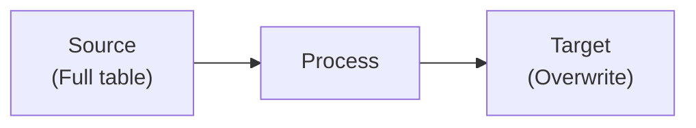

- Simple, no state management
- Good for small tables
- Problem: Expensive for large tables

**Pattern 2: Incremental Load**

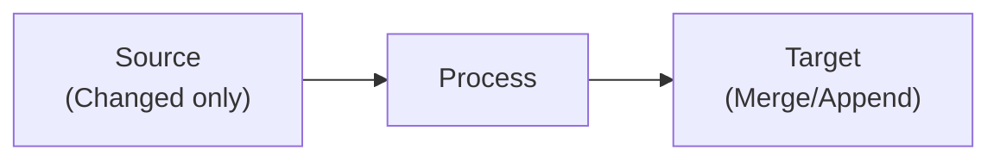

- Filter by: modified_at > last_run_time
- Efficient for large tables
- Need reliable change tracking

**Pattern 3: Snapshot with Delta**

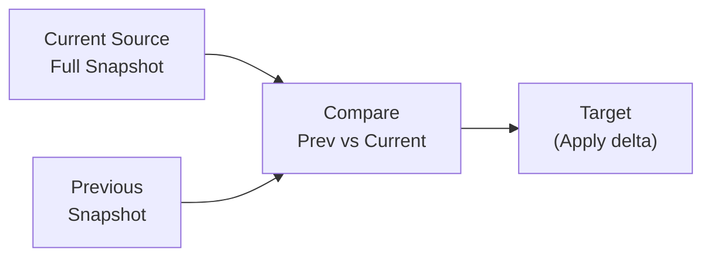

### 2.2 Spark Batch Processing

```python
from pyspark.sql import SparkSession
from pyspark.sql.functions import *

spark = SparkSession.builder \
    .appName("BatchJob") \
    .getOrCreate()

# Read source data
source_df = spark.read \
    .format("parquet") \
    .load("s3://bucket/source/")

# Transform
transformed_df = source_df \
    .filter(col("event_date") >= "2024-01-01") \
    .groupBy("customer_id") \
    .agg(
        sum("amount").alias("total_amount"),
        count("*").alias("transaction_count")
    )

# Write to target (overwrite partition)
transformed_df.write \
    .mode("overwrite") \
    .partitionBy("event_date") \
    .parquet("s3://bucket/target/")
```

### 2.3 Incremental Processing với Watermarks

```python
# Track last processed timestamp
def get_last_watermark():
    try:
        return spark.read.text("s3://bucket/watermark").first()[0]
    except:
        return "1970-01-01 00:00:00"

def update_watermark(new_watermark):
    spark.createDataFrame([(new_watermark,)], ["watermark"]) \
        .write.mode("overwrite") \
        .text("s3://bucket/watermark")

# Incremental load
last_watermark = get_last_watermark()

new_data = spark.read.parquet("s3://bucket/source/") \
    .filter(col("updated_at") > last_watermark)

# Process and write
new_data.write.mode("append").parquet("s3://bucket/target/")

# Update watermark
max_watermark = new_data.agg(max("updated_at")).first()[0]
update_watermark(str(max_watermark))
```

---

## PHẦN 3: STREAM PROCESSING DEEP DIVE

### 3.1 Stream Processing Concepts

```
Core Concepts:

1. EVENT TIME vs PROCESSING TIME
   
   Event Time:     When event actually occurred
   Processing Time: When event is processed
   
   Event Time:    [10:00:00] [10:00:01] [10:00:02]
                      |          |          |
   Network delay:     5s         2s         8s
                      |          |          |
   Processing Time: [10:00:05] [10:00:03] [10:00:10]
   
   → Processing order may differ from event order
   → Use event time for accurate results


2. WATERMARKS
   
   "All events with timestamp <= watermark have arrived"
   
   Time:     10:00  10:01  10:02  10:03  10:04
   Events:     E1     E2     E3   (late)   E4
   Watermark:  ---|-----|-----|-----|-----|
                       10:00  10:01  10:02
   
   → Late events (after watermark) may be dropped or handled


3. WINDOWS
   
   Tumbling Window:
   |----W1----|----W2----|----W3----|
   [E1,E2,E3] [E4,E5,E6] [E7,E8,E9]
   
   Sliding Window (overlap):
   |----W1----|
        |----W2----|
             |----W3----|
   [E1,E2,E3,E4] [E3,E4,E5,E6] ...
   
   Session Window (gap-based):
   |--Session1--|   |--Session2--|
   [E1,E2,E3]       [E4,E5]
           gap >5min
```

### 3.2 Flink Stream Processing

```java
// Flink DataStream API
DataStream<Event> events = env
    .addSource(new FlinkKafkaConsumer<>("events", ...))
    .assignTimestampsAndWatermarks(
        WatermarkStrategy
            .<Event>forBoundedOutOfOrderness(Duration.ofSeconds(5))
            .withTimestampAssigner((event, timestamp) -> event.getTimestamp())
    );

// Tumbling window aggregation
DataStream<Result> windowedCounts = events
    .keyBy(event -> event.getUserId())
    .window(TumblingEventTimeWindows.of(Time.minutes(5)))
    .aggregate(new CountAggregate());

// Session window
DataStream<Result> sessions = events
    .keyBy(event -> event.getUserId())
    .window(EventTimeSessionWindows.withGap(Time.minutes(30)))
    .process(new SessionWindowFunction());

// Handle late data
DataStream<Result> withLateData = events
    .keyBy(event -> event.getUserId())
    .window(TumblingEventTimeWindows.of(Time.hours(1)))
    .allowedLateness(Time.minutes(10))
    .sideOutputLateData(lateOutputTag)
    .process(new WindowProcessor());
```

### 3.3 Spark Structured Streaming

```python
from pyspark.sql import SparkSession
from pyspark.sql.functions import *

spark = SparkSession.builder \
    .appName("StructuredStreaming") \
    .getOrCreate()

# Read from Kafka
df = spark.readStream \
    .format("kafka") \
    .option("kafka.bootstrap.servers", "localhost:9092") \
    .option("subscribe", "events") \
    .load()

# Parse JSON events
events = df.select(
    from_json(col("value").cast("string"), schema).alias("event")
).select("event.*")

# Windowed aggregation with watermark
windowed = events \
    .withWatermark("event_time", "10 minutes") \
    .groupBy(
        window(col("event_time"), "5 minutes"),
        col("user_id")
    ) \
    .agg(
        sum("amount").alias("total_amount"),
        count("*").alias("event_count")
    )

# Write to sink
query = windowed.writeStream \
    .format("parquet") \
    .option("path", "s3://bucket/output/") \
    .option("checkpointLocation", "s3://bucket/checkpoint/") \
    .outputMode("append") \
    .trigger(processingTime="1 minute") \
    .start()

query.awaitTermination()
```

### 3.4 Kafka Streams

```java
// Kafka Streams API
StreamsBuilder builder = new StreamsBuilder();

KStream<String, Event> events = builder.stream("events");

// Windowed count
KTable<Windowed<String>, Long> windowedCounts = events
    .groupByKey()
    .windowedBy(TimeWindows.of(Duration.ofMinutes(5)))
    .count();

// Join streams
KStream<String, EnrichedEvent> enriched = events
    .join(
        builder.table("users"),
        (event, user) -> new EnrichedEvent(event, user),
        Joined.with(Serdes.String(), eventSerde, userSerde)
    );

// Write to output topic
enriched.to("enriched-events");

KafkaStreams streams = new KafkaStreams(builder.build(), config);
streams.start();
```

---

## PHẦN 4: LAMBDA ARCHITECTURE

### 4.1 Lambda Architecture Overview

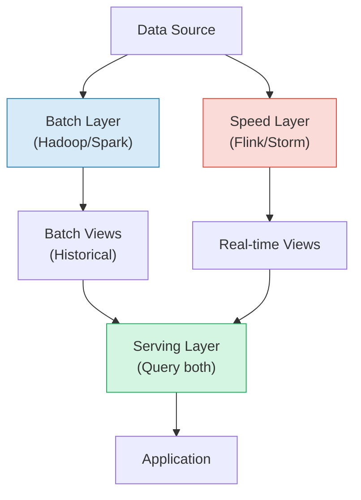


Components:

1. BATCH LAYER
   - Stores master dataset (immutable, append-only)
   - Computes batch views
   - Runs periodically (hourly, daily)
   - Complete, accurate results
   - High latency

2. SPEED LAYER
   - Processes real-time stream
   - Computes real-time views
   - Lower accuracy (approximations)
   - Low latency
   - Views are transient

3. SERVING LAYER
   - Merges batch + speed results
   - Serves queries
   - Example: batch_view + speed_view = complete_view
```

### 4.2 Lambda Implementation Example

```python
# BATCH LAYER (runs daily)
# ---------------------------------------------
def batch_layer():
    # Read all historical data
    all_events = spark.read.parquet("s3://datalake/events/")
    
    # Compute complete aggregations
    daily_stats = all_events \
        .groupBy("date", "product_id") \
        .agg(
            sum("quantity").alias("total_quantity"),
            sum("revenue").alias("total_revenue")
        )
    
    # Write batch view
    daily_stats.write \
        .mode("overwrite") \
        .parquet("s3://datalake/batch_views/daily_stats/")


# SPEED LAYER (runs continuously)
# ---------------------------------------------
def speed_layer():
    # Read from Kafka stream
    stream = spark.readStream \
        .format("kafka") \
        .option("subscribe", "sales-events") \
        .load()
    
    events = parse_events(stream)
    
    # Compute real-time increments (since last batch)
    # Only events after last batch run
    realtime_stats = events \
        .withWatermark("event_time", "5 minutes") \
        .groupBy(
            window("event_time", "1 hour"),
            "product_id"
        ) \
        .agg(
            sum("quantity").alias("quantity_delta"),
            sum("revenue").alias("revenue_delta")
        )
    
    # Write to speed view (Redis, Cassandra)
    realtime_stats.writeStream \
        .foreachBatch(write_to_redis) \
        .outputMode("update") \
        .start()


# SERVING LAYER
# ---------------------------------------------
def query_merged_view(product_id, date):
    # Get batch view (complete until yesterday)
    batch_result = get_batch_view(product_id, date)
    
    # Get speed view (today's increments)
    speed_result = get_speed_view(product_id, date)
    
    # Merge results
    return {
        "total_quantity": batch_result.quantity + speed_result.quantity_delta,
        "total_revenue": batch_result.revenue + speed_result.revenue_delta
    }
```

### 4.3 Lambda Pros and Cons

```
PROS:
+ Fault tolerant (batch can recompute everything)
+ Handles late data (batch will correct)
+ Accurate results (batch layer)
+ Low latency (speed layer)

CONS:
- Code duplication (two codebases)
- Complexity (maintain two systems)
- Synchronization issues
- Higher cost (run both)
- Merge logic complexity
```

---

## PHẦN 5: KAPPA ARCHITECTURE

### 5.1 Kappa Architecture Overview

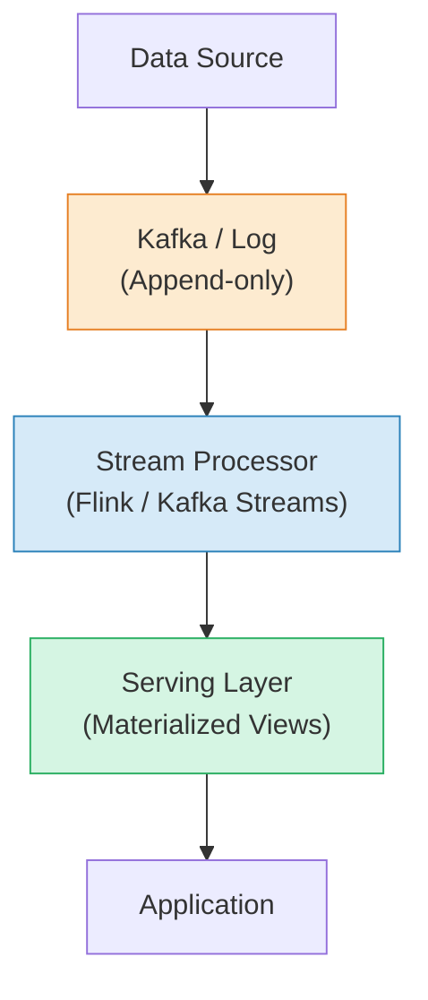

```
Key Principles:
1. Everything is a stream
2. One codebase for all processing
3. Replay from log for reprocessing
4. State managed by stream processor
```

### 5.2 Kappa Implementation

```python
# Single stream processing job handles everything
# ---------------------------------------------

from pyspark.sql import SparkSession
from pyspark.sql.functions import *

def kappa_pipeline():
    spark = SparkSession.builder \
        .appName("KappaArchitecture") \
        .getOrCreate()
    
    # Read from Kafka (can replay from beginning)
    stream = spark.readStream \
        .format("kafka") \
        .option("subscribe", "events") \
        .option("startingOffsets", "earliest")  # Can replay
        .load()
    
    events = stream.select(
        from_json(col("value").cast("string"), schema).alias("data")
    ).select("data.*")
    
    # Stateful aggregation
    stats = events \
        .withWatermark("event_time", "1 hour") \
        .groupBy(
            window("event_time", "1 day"),
            "product_id"
        ) \
        .agg(
            sum("quantity").alias("total_quantity"),
            sum("revenue").alias("total_revenue")
        )
    
    # Write to serving layer
    stats.writeStream \
        .format("iceberg") \
        .option("path", "s3://warehouse/daily_stats") \
        .option("checkpointLocation", "s3://checkpoint/daily_stats") \
        .outputMode("update") \
        .start()


# For reprocessing:
# 1. Deploy new version of job with new consumer group
# 2. Replay from Kafka beginning
# 3. Write to new output table
# 4. Switch serving layer to new table
# 5. Shut down old job
```

### 5.3 Kappa Pros and Cons

```
PROS:
+ Single codebase (simpler)
+ Unified processing logic
+ Lower maintenance
+ Stream-native approach

CONS:
- Requires log retention (expensive)
- Replay can be slow for large datasets
- Complex state management
- Need proper exactly-once semantics
- Not suitable for all use cases (ML training)
```

### 5.4 Lambda vs Kappa Decision

```
Choose Lambda when:
- Need batch processing for ML/AI
- Very large historical reprocessing
- Different accuracy requirements
- Legacy batch systems exist

Choose Kappa when:
- Stream-first architecture
- Can retain logs long enough
- Simpler is better
- Team skilled in streaming

Hybrid approach:
- Use Kappa for main pipeline
- Occasional batch jobs for:
  - ML training
  - Data quality checks
  - Historical corrections
```

---

## PHẦN 6: EXACTLY-ONCE SEMANTICS

### 6.1 Delivery Guarantees

```
AT-MOST-ONCE:
- Fire and forget
- May lose messages
- Fastest, simplest
- Use case: Metrics that can be lost

Producer -> [Message] -> Consumer (maybe lost)

AT-LEAST-ONCE:
- Retry on failure
- May have duplicates
- Most common
- Use case: Logs, events

Producer -> [Message] -> Consumer
         <- [ACK]     <-
If no ACK, resend -> [Duplicate possible]

EXACTLY-ONCE:
- No loss, no duplicates
- Most complex
- Use case: Financial transactions

Methods:
1. Idempotent writes
2. Transactional processing
3. Deduplication
```

### 6.2 Implementing Exactly-Once

```python
# Method 1: Idempotent writes
# ---------------------------------------------
# Same operation applied multiple times = same result

def idempotent_upsert(record):
    """
    Use MERGE/UPSERT instead of INSERT
    Record has unique ID
    """
    spark.sql("""
        MERGE INTO target t
        USING source s
        ON t.id = s.id
        WHEN MATCHED THEN UPDATE SET *
        WHEN NOT MATCHED THEN INSERT *
    """)


# Method 2: Deduplication with window
# ---------------------------------------------
deduplicated = events \
    .withWatermark("event_time", "1 hour") \
    .dropDuplicates(["event_id", "event_time"])


# Method 3: Transactional writes (Kafka)
# ---------------------------------------------
# Kafka producer settings
producer = KafkaProducer(
    enable_idempotence=True,
    transactional_id="my-transactional-producer"
)

producer.init_transactions()
producer.begin_transaction()
try:
    producer.send("topic", value=message)
    producer.send_offsets_to_transaction(offsets, consumer_group)
    producer.commit_transaction()
except:
    producer.abort_transaction()
```

### 6.3 Checkpointing

```python
# Flink Checkpointing
# ---------------------------------------------
env = StreamExecutionEnvironment.get_execution_environment()

# Enable checkpointing
env.enable_checkpointing(60000)  # Every 60 seconds

# Checkpoint configuration
config = env.get_checkpoint_config()
config.set_checkpointing_mode(CheckpointingMode.EXACTLY_ONCE)
config.set_min_pause_between_checkpoints(30000)
config.set_checkpoint_timeout(300000)
config.set_max_concurrent_checkpoints(1)
config.enable_externalized_checkpoints(
    ExternalizedCheckpointCleanup.RETAIN_ON_CANCELLATION
)

# Checkpoint storage
env.get_checkpoint_config().set_checkpoint_storage(
    "s3://bucket/checkpoints"
)


# Spark Structured Streaming Checkpointing
# ---------------------------------------------
query = df.writeStream \
    .format("parquet") \
    .option("checkpointLocation", "s3://bucket/checkpoint/") \
    .start()

# Checkpoint contains:
# - Offsets consumed from source
# - State data for aggregations
# - Commit log for output
```

---

## PHẦN 7: MICRO-BATCH VS CONTINUOUS

### 7.1 Micro-batch Processing

```
Micro-batch: Process small batches continuously

Time:     |--Batch1--|--Batch2--|--Batch3--|--Batch4--|
Events:   [E1,E2,E3] [E4,E5,E6] [E7,E8,E9] [...]
          |          |          |
          v          v          v
Process:  [Batch]    [Batch]    [Batch]
          |          |          |
Latency:  ~1-5s      ~1-5s      ~1-5s

Examples: Spark Structured Streaming, Flink (batch mode)

Characteristics:
- Simple to understand
- Good throughput
- Higher latency (batch interval)
- Easier fault recovery
```

### 7.2 Continuous Processing

```
Continuous: Process each event as it arrives

Time:     --|E1|--|E2|--|E3|--|E4|--|E5|--|
             |     |     |     |     |
             v     v     v     v     v
Process:   [Proc][Proc][Proc][Proc][Proc]
             |     |     |     |     |
Latency:   ~1ms  ~1ms  ~1ms  ~1ms  ~1ms

Examples: Flink, Kafka Streams

Characteristics:
- Ultra-low latency
- Per-event processing
- More complex
- Higher resource usage
```

### 7.3 Spark Trigger Options

```python
# Micro-batch with fixed interval
query = df.writeStream \
    .trigger(processingTime="10 seconds") \
    .start()

# Process available data then stop
query = df.writeStream \
    .trigger(once=True) \
    .start()

# Continuous processing (experimental)
query = df.writeStream \
    .trigger(continuous="1 second") \
    .start()

# Available now (for testing)
query = df.writeStream \
    .trigger(availableNow=True) \
    .start()
```

---

## PHẦN 8: STATE MANAGEMENT

### 8.1 Stateless vs Stateful Processing

```
STATELESS:
- Each event processed independently
- No memory between events
- Simple, easy to scale
- Examples: filter, map, parse

Event -> [Transform] -> Output
(no state needed)


STATEFUL:
- Need information from previous events
- Maintain state between events
- Complex, harder to scale
- Examples: aggregations, joins, windows

Event -> [Process with State] -> Output
              ^      |
              |      v
            [State Store]
```

### 8.2 State Store Options

**Embedded State (In-Memory):**

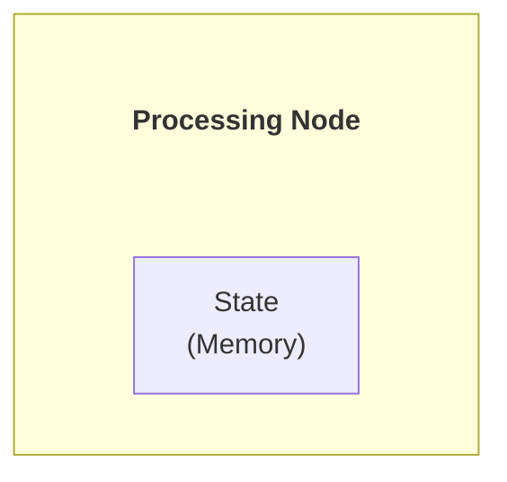

- Fast access
- Limited by memory
- Lost on failure (need checkpoint)

**External State Store:**

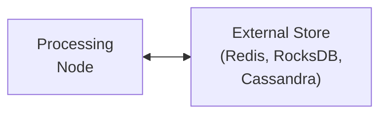

- Larger state capacity
- Survives failures
- Network latency
- More complex

**Flink RocksDB State:**
- Embedded RocksDB
- Disk-based (larger than memory)
- Checkpointed to remote storage
- Good balance

### 8.3 State Management Code

```python
# Flink Stateful Processing
# ---------------------------------------------
class StatefulCounter(KeyedProcessFunction):
    def open(self, runtime_context):
        # Initialize state
        self.count = runtime_context.get_state(
            ValueStateDescriptor("count", Types.LONG())
        )
    
    def process_element(self, value, ctx):
        # Get current state
        current = self.count.value() or 0
        
        # Update state
        self.count.update(current + 1)
        
        # Emit result
        yield (ctx.get_current_key(), self.count.value())


# Kafka Streams State Store
# ---------------------------------------------
StoreBuilder<KeyValueStore<String, Long>> countStore =
    Stores.keyValueStoreBuilder(
        Stores.persistentKeyValueStore("counts"),
        Serdes.String(),
        Serdes.Long()
    ).withLoggingEnabled(Collections.emptyMap());  // Enable changelog

builder.addStateStore(countStore);

// Access in processor
public void process(Record<String, Event> record) {
    KeyValueStore<String, Long> store = 
        context.getStateStore("counts");
    Long count = store.get(record.key());
    store.put(record.key(), count + 1);
}
```

### 8.4 State TTL (Time-To-Live)

```python
# Clean up old state to prevent memory issues

# Flink State TTL
state_ttl_config = StateTtlConfig \
    .new_builder(Time.hours(24)) \
    .set_update_type(StateTtlConfig.UpdateType.OnCreateAndWrite) \
    .set_state_visibility(
        StateTtlConfig.StateVisibility.NeverReturnExpired
    ) \
    .clean_up_in_rocksdb_compact_filter(1000) \
    .build()

state_descriptor = ValueStateDescriptor("my-state", Types.LONG())
state_descriptor.enable_time_to_live(state_ttl_config)


# Spark state cleanup
windowed_df = events \
    .withWatermark("event_time", "24 hours") \
    .groupBy(
        window("event_time", "1 hour"),
        "user_id"
    ) \
    .agg(count("*"))

# State older than watermark - 24 hours is cleaned up
```

---

## PHẦN 9: BACKPRESSURE HANDLING

### 9.1 What is Backpressure?

```
Backpressure: Downstream can't keep up with upstream

Normal flow:
Producer(1000/s) -> Processor(1000/s) -> Sink(1000/s) ✓

Backpressure:
Producer(1000/s) -> Processor(500/s) -> Sink(500/s) ✗
                          |
                    Buffer fills up
                          |
                    Options:
                    1. Drop events
                    2. Buffer (memory pressure)
                    3. Slow down producer
```

### 9.2 Backpressure Strategies

```
1. BUFFERING
   - Queue messages
   - Risk: Memory overflow
   - Good for: Short bursts

2. DROPPING
   - Discard events
   - Risk: Data loss
   - Good for: Metrics, non-critical

3. SAMPLING
   - Process subset
   - Risk: Incomplete data
   - Good for: Monitoring

4. FLOW CONTROL
   - Slow down producer
   - Risk: End-to-end latency
   - Good for: Most cases (preferred)

5. SCALING
   - Add more consumers
   - Risk: Cost, complexity
   - Good for: Sustained high load
```

### 9.3 Implementing Backpressure

```python
# Kafka consumer with backpressure
# ---------------------------------------------
consumer = KafkaConsumer(
    'topic',
    max_poll_records=100,         # Limit batch size
    fetch_max_bytes=1048576,      # Limit fetch size
    max_partition_fetch_bytes=1048576
)

# Manual flow control
while True:
    records = consumer.poll(timeout_ms=1000)
    
    if len(records) > threshold:
        # Slow down
        time.sleep(0.5)
    
    process(records)
    consumer.commit()


# Flink automatic backpressure
# ---------------------------------------------
# Flink handles backpressure automatically:
# 1. Network buffers fill up
# 2. Upstream tasks block on send
# 3. Eventually reaches source
# 4. Source reads slower

# Monitor backpressure in Flink UI:
# - Task shows "HIGH" backpressure = downstream bottleneck


# Spark Structured Streaming rate limiting
# ---------------------------------------------
df = spark.readStream \
    .format("kafka") \
    .option("maxOffsetsPerTrigger", 100000) \
    .load()

# Only read 100k records per trigger
```

---

## PHẦN 10: USE CASES VÀ PATTERNS

### 10.1 Common Stream Processing Use Cases

```
1. REAL-TIME ANALYTICS
   - Dashboard updates
   - Live metrics
   - Session analysis
   
2. FRAUD DETECTION
   - Transaction monitoring
   - Anomaly detection
   - Rule-based alerts
   
3. IoT DATA PROCESSING
   - Sensor data ingestion
   - Device monitoring
   - Predictive maintenance
   
4. LOG PROCESSING
   - Centralized logging
   - Error detection
   - Security monitoring
   
5. RECOMMENDATIONS
   - Real-time personalization
   - Click stream analysis
   - A/B testing
```

### 10.2 Event-Driven Patterns

**PATTERN 1: Event Sourcing**

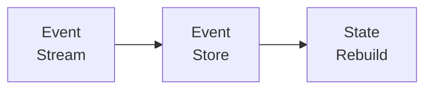

All changes as events, state derived from events

**PATTERN 2: CQRS (Command Query Responsibility Segregation)**

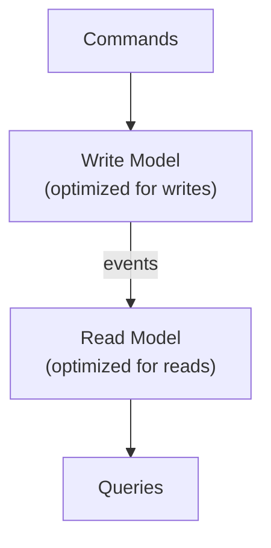

**PATTERN 3: Saga Pattern (Distributed Transactions)**

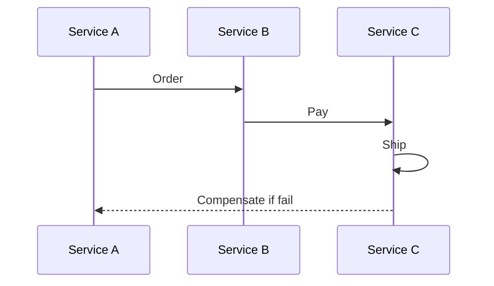

Events coordinate distributed transaction

**PATTERN 4: Stream-Table Duality**

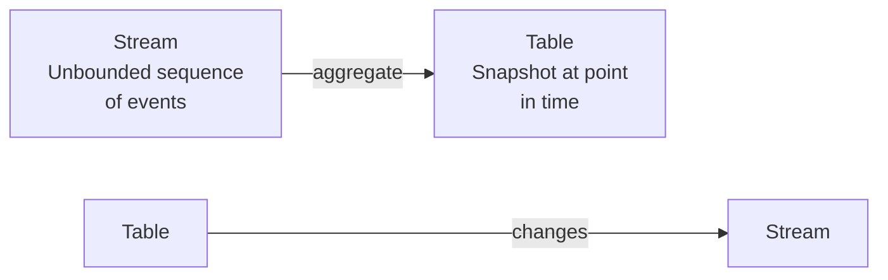

### 10.3 Complete Example: Real-time Dashboard

```python
from pyspark.sql import SparkSession
from pyspark.sql.functions import *

spark = SparkSession.builder \
    .appName("RealTimeDashboard") \
    .getOrCreate()

# Read from Kafka
events = spark.readStream \
    .format("kafka") \
    .option("kafka.bootstrap.servers", "localhost:9092") \
    .option("subscribe", "page-views") \
    .load() \
    .select(
        from_json(col("value").cast("string"), schema).alias("data")
    ).select("data.*")

# Real-time metrics

# 1. Active users (5-minute window)
active_users = events \
    .withWatermark("event_time", "10 minutes") \
    .groupBy(window("event_time", "5 minutes")) \
    .agg(countDistinct("user_id").alias("active_users"))

# 2. Page view counts
page_views = events \
    .withWatermark("event_time", "10 minutes") \
    .groupBy(
        window("event_time", "1 minute"),
        "page_url"
    ) \
    .count()

# 3. Write to dashboard (Redis/Kafka)
active_users.writeStream \
    .foreachBatch(lambda df, epoch_id: 
        df.foreach(lambda row: 
            redis.set(f"active_users:{row.window}", row.active_users)
        )
    ) \
    .outputMode("update") \
    .start()

page_views.writeStream \
    .format("kafka") \
    .option("kafka.bootstrap.servers", "localhost:9092") \
    .option("topic", "dashboard-metrics") \
    .outputMode("update") \
    .start()
```

---

## PHẦN 11: BEST PRACTICES

### 11.1 Design Principles

```
1. DESIGN FOR FAILURE
   - Idempotent operations
   - Checkpointing
   - Dead letter queues
   - Retry with backoff

2. SCHEMA MANAGEMENT
   - Use Schema Registry
   - Backward compatible changes
   - Version schemas
   - Validate at ingestion

3. MONITORING
   - Lag monitoring
   - Processing latency
   - Error rates
   - Resource utilization

4. TESTING
   - Unit test processors
   - Integration tests
   - Chaos engineering
   - Load testing
```

### 11.2 Operational Checklist

```
□ Define SLAs (latency, throughput)
□ Set up proper partitioning
□ Configure checkpointing
□ Enable exactly-once if needed
□ Implement dead letter queue
□ Set up alerting for lag
□ Plan for reprocessing
□ Document recovery procedures
□ Test failure scenarios
□ Monitor resource usage
```

### 11.3 Performance Tuning

```
1. PARALLELISM
   - Match partitions to consumers
   - Scale out processors
   - Avoid data skew

2. BATCHING
   - Batch writes to sinks
   - Micro-batch intervals
   - Buffer settings

3. SERIALIZATION
   - Use binary formats (Avro, Protobuf)
   - Avoid JSON for high volume
   - Consider compression

4. STATE MANAGEMENT
   - Choose appropriate state backend
   - Enable incremental checkpoints
   - Set state TTL
   - Monitor state size

5. RESOURCE ALLOCATION
   - Memory for state
   - CPU for processing
   - Network for shuffles
   - Disk for checkpoints
```

---

## PHẦN 12: WINDOWING IN DEPTH

### 12.1 Window Types

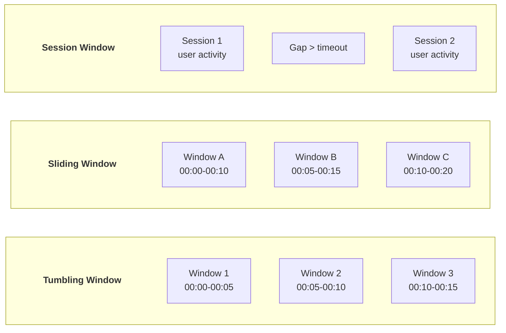

### 12.2 Window Implementation Examples

```python
# Spark Structured Streaming — Window Operations
from pyspark.sql.functions import *

# Tumbling window: Fixed, non-overlapping
tumbling = events_df \
    .withWatermark("event_time", "10 minutes") \
    .groupBy(
        window("event_time", "5 minutes"),  # 5-min tumbling
        "region"
    ) \
    .agg(
        count("*").alias("event_count"),
        sum("amount").alias("total_amount"),
        approx_count_distinct("user_id").alias("unique_users"),
    )

# Sliding window: Overlapping windows
sliding = events_df \
    .withWatermark("event_time", "10 minutes") \
    .groupBy(
        window("event_time", "10 minutes", "5 minutes"),  # 10-min window, 5-min slide
        "event_type"
    ) \
    .agg(
        avg("latency_ms").alias("avg_latency"),
        expr("percentile_approx(latency_ms, 0.99)").alias("p99_latency"),
    )

# Session window (Spark 3.2+)
session = events_df \
    .withWatermark("event_time", "30 minutes") \
    .groupBy(
        session_window("event_time", "15 minutes"),  # 15-min gap
        "user_id"
    ) \
    .agg(
        count("*").alias("events_in_session"),
        min("event_time").alias("session_start"),
        max("event_time").alias("session_end"),
        collect_list("page_url").alias("pages_visited"),
    )
```

```java
// Flink — Window Operations
import org.apache.flink.streaming.api.windowing.assigners.*;
import org.apache.flink.streaming.api.windowing.time.Time;

// Tumbling event-time window
DataStream<Result> tumbling = events
    .keyBy(event -> event.getRegion())
    .window(TumblingEventTimeWindows.of(Time.minutes(5)))
    .aggregate(new CountAggregator());

// Sliding window
DataStream<Result> sliding = events
    .keyBy(event -> event.getRegion())
    .window(SlidingEventTimeWindows.of(
        Time.minutes(10),   // window size
        Time.minutes(5)))   // slide interval
    .aggregate(new AvgLatencyAggregator());

// Session window with dynamic gap
DataStream<Result> session = events
    .keyBy(event -> event.getUserId())
    .window(EventTimeSessionWindows.withDynamicGap(
        new SessionWindowTimeGapExtractor<Event>() {
            @Override
            public long extract(Event event) {
                // Premium users get longer session timeout
                return event.isPremium() ? 30 * 60 * 1000 : 15 * 60 * 1000;
            }
        }))
    .process(new SessionAnalyzer());

// Global window with custom trigger
DataStream<Result> globalWin = events
    .keyBy(event -> event.getCategory())
    .window(GlobalWindows.create())
    .trigger(CountTrigger.of(1000))  // Fire every 1000 elements
    .aggregate(new BatchAggregator());
```

### 12.3 Late Data Handling

```python
# Watermarks and late data strategies

# Strategy 1: Drop late data (default)
df.withWatermark("event_time", "10 minutes")
# Events arriving > 10 min late are dropped

# Strategy 2: Generous watermark with update mode
late_tolerant = events_df \
    .withWatermark("event_time", "1 hour") \
    .groupBy(window("event_time", "5 minutes"), "region") \
    .agg(count("*").alias("count"))

late_tolerant.writeStream \
    .outputMode("update")  # Emit updated rows, not just new
    .format("delta") \
    .start()

# Strategy 3: Side output for late data (Flink)
# OutputTag<Event> lateTag = new OutputTag<>("late-events");
# 
# SingleOutputStreamOperator<Result> result = events
#     .keyBy(e -> e.getKey())
#     .window(TumblingEventTimeWindows.of(Time.minutes(5)))
#     .allowedLateness(Time.hours(1))
#     .sideOutputLateData(lateTag)
#     .aggregate(new MyAggregator());
# 
# DataStream<Event> lateEvents = result.getSideOutput(lateTag);
# lateEvents.addSink(new LateDataSink());  # Handle separately

# Strategy 4: Multi-layer watermarks
class MultiLayerWatermark:
    """Handle late data with multiple processing layers."""
    
    def __init__(self):
        self.layers = {
            "realtime": {"watermark": "5 minutes", "output": "dashboard"},
            "nearline": {"watermark": "1 hour", "output": "reports"},
            "batch": {"watermark": "24 hours", "output": "data_warehouse"},
        }
    
    def process(self, events_df):
        streams = {}
        for layer, config in self.layers.items():
            streams[layer] = events_df \
                .withWatermark("event_time", config["watermark"]) \
                .groupBy(
                    window("event_time", "5 minutes"),
                    "metric_name"
                ) \
                .agg(
                    sum("value").alias("total"),
                    count("*").alias("count"),
                )
        return streams
```

---

## PHẦN 13: COMPLEX EVENT PROCESSING (CEP)

### 13.1 Pattern Matching

```python
# Complex Event Processing patterns
from dataclasses import dataclass
from typing import List, Optional
from datetime import timedelta

@dataclass
class Event:
    event_id: str
    user_id: str
    event_type: str
    timestamp: float
    attributes: dict

class CEPEngine:
    """Simple Complex Event Processing engine."""
    
    def __init__(self):
        self.patterns = []
        self.state = {}  # Per-key state
    
    def add_pattern(self, name: str, pattern: list,
                    within: timedelta, action: callable):
        """Register a pattern to detect.
        
        pattern: list of event types in sequence
        within: time window for pattern completion
        action: callback when pattern matches
        """
        self.patterns.append({
            "name": name,
            "sequence": pattern,
            "within": within,
            "action": action,
        })
    
    def process_event(self, event: Event):
        """Process incoming event against all patterns."""
        key = event.user_id
        
        if key not in self.state:
            self.state[key] = {}
        
        for pattern in self.patterns:
            pname = pattern["name"]
            if pname not in self.state[key]:
                self.state[key][pname] = {"matched": [], "start_time": None}
            
            state = self.state[key][pname]
            expected_idx = len(state["matched"])
            
            if expected_idx < len(pattern["sequence"]):
                expected_type = pattern["sequence"][expected_idx]
                
                if event.event_type == expected_type:
                    if expected_idx == 0:
                        state["start_time"] = event.timestamp
                    
                    # Check if within time window
                    elapsed = event.timestamp - state["start_time"]
                    if elapsed <= pattern["within"].total_seconds():
                        state["matched"].append(event)
                        
                        # Pattern complete?
                        if len(state["matched"]) == len(pattern["sequence"]):
                            pattern["action"](key, state["matched"])
                            # Reset state
                            self.state[key][pname] = {
                                "matched": [], "start_time": None
                            }
                    else:
                        # Timeout — reset
                        self.state[key][pname] = {
                            "matched": [], "start_time": None
                        }

# Usage: Fraud Detection
cep = CEPEngine()

def alert_fraud(user_id, events):
    print(f"🚨 FRAUD ALERT: User {user_id}")
    print(f"   Pattern: {[e.event_type for e in events]}")
    print(f"   Duration: {events[-1].timestamp - events[0].timestamp}s")

# Detect: login → failed_payment → retry → large_purchase within 5 minutes
cep.add_pattern(
    name="suspicious_purchase",
    pattern=["login", "failed_payment", "retry_payment", "large_purchase"],
    within=timedelta(minutes=5),
    action=alert_fraud,
)

# Detect: 3 failed logins within 1 minute
cep.add_pattern(
    name="brute_force",
    pattern=["failed_login", "failed_login", "failed_login"],
    within=timedelta(minutes=1),
    action=lambda uid, evts: print(f"🔒 Account locked: {uid}"),
)
```

### 13.2 Flink CEP Library

```java
// Apache Flink CEP — Pattern API
import org.apache.flink.cep.CEP;
import org.apache.flink.cep.PatternStream;
import org.apache.flink.cep.pattern.Pattern;
import org.apache.flink.cep.pattern.conditions.SimpleCondition;

// Define pattern: high_temp → critical_temp within 10 seconds
Pattern<SensorEvent, ?> alertPattern = Pattern
    .<SensorEvent>begin("high_temp")
    .where(new SimpleCondition<SensorEvent>() {
        @Override
        public boolean filter(SensorEvent event) {
            return event.getTemperature() > 80;
        }
    })
    .next("critical_temp")  // Must be immediately next event
    .where(new SimpleCondition<SensorEvent>() {
        @Override
        public boolean filter(SensorEvent event) {
            return event.getTemperature() > 100;
        }
    })
    .within(Time.seconds(10));

// Apply pattern to stream
PatternStream<SensorEvent> patternStream = CEP.pattern(
    sensorEvents.keyBy(SensorEvent::getSensorId),
    alertPattern
);

// Extract matches
DataStream<Alert> alerts = patternStream.select(
    (Map<String, List<SensorEvent>> pattern) -> {
        SensorEvent high = pattern.get("high_temp").get(0);
        SensorEvent critical = pattern.get("critical_temp").get(0);
        return new Alert(
            high.getSensorId(),
            "CRITICAL_TEMPERATURE",
            critical.getTemperature()
        );
    }
);

// More complex pattern: A followed by B (not C) followed by D
Pattern<Event, ?> complexPattern = Pattern
    .<Event>begin("start").where(isTypeA())
    .followedBy("middle").where(isTypeB())
    .notNext("forbidden").where(isTypeC())  
    .followedBy("end").where(isTypeD())
    .within(Time.minutes(5));
```

---

## PHẦN 14: STREAM PROCESSING TESTING

### 14.1 Unit Testing Stream Logic

```python
# Testing stream processing logic without infrastructure
import pytest
from unittest.mock import MagicMock, patch
from datetime import datetime

class StreamProcessor:
    """Example stream processor to test."""
    
    def __init__(self):
        self.metrics = {"processed": 0, "errors": 0, "late": 0}
    
    def parse_event(self, raw: str) -> dict:
        """Parse raw event JSON."""
        import json
        try:
            event = json.loads(raw)
            required = ["event_id", "timestamp", "event_type"]
            if not all(k in event for k in required):
                raise ValueError(f"Missing required fields")
            return event
        except (json.JSONDecodeError, ValueError) as e:
            self.metrics["errors"] += 1
            return None
    
    def is_late(self, event: dict, watermark: datetime) -> bool:
        """Check if event is late relative to watermark."""
        event_time = datetime.fromisoformat(event["timestamp"])
        return event_time < watermark
    
    def enrich(self, event: dict, lookup: dict) -> dict:
        """Enrich event with dimension data."""
        user_id = event.get("user_id")
        if user_id and user_id in lookup:
            event["user_name"] = lookup[user_id]["name"]
            event["user_segment"] = lookup[user_id]["segment"]
        return event

class TestStreamProcessor:
    """Unit tests for stream processing logic."""
    
    def setup_method(self):
        self.processor = StreamProcessor()
    
    def test_parse_valid_event(self):
        raw = '{"event_id": "1", "timestamp": "2026-01-15T10:00:00", "event_type": "click"}'
        result = self.processor.parse_event(raw)
        assert result is not None
        assert result["event_id"] == "1"
        assert result["event_type"] == "click"
    
    def test_parse_invalid_json(self):
        result = self.processor.parse_event("not json")
        assert result is None
        assert self.processor.metrics["errors"] == 1
    
    def test_parse_missing_fields(self):
        raw = '{"event_id": "1"}'
        result = self.processor.parse_event(raw)
        assert result is None
    
    def test_late_event_detection(self):
        event = {"timestamp": "2026-01-15T09:00:00"}
        watermark = datetime(2026, 1, 15, 10, 0, 0)
        assert self.processor.is_late(event, watermark) is True
    
    def test_on_time_event(self):
        event = {"timestamp": "2026-01-15T10:30:00"}
        watermark = datetime(2026, 1, 15, 10, 0, 0)
        assert self.processor.is_late(event, watermark) is False
    
    def test_enrichment(self):
        event = {"user_id": "u1", "event_type": "purchase"}
        lookup = {"u1": {"name": "Alice", "segment": "premium"}}
        result = self.processor.enrich(event, lookup)
        assert result["user_name"] == "Alice"
        assert result["user_segment"] == "premium"
    
    def test_enrichment_missing_user(self):
        event = {"user_id": "u999", "event_type": "purchase"}
        lookup = {"u1": {"name": "Alice", "segment": "premium"}}
        result = self.processor.enrich(event, lookup)
        assert "user_name" not in result
```

### 14.2 Integration Testing with Testcontainers

```python
# Integration tests using testcontainers
from testcontainers.kafka import KafkaContainer
from testcontainers.compose import DockerCompose
import json
import time

class TestKafkaStreamIntegration:
    """Integration test with real Kafka."""
    
    @classmethod
    def setup_class(cls):
        cls.kafka = KafkaContainer("confluentinc/cp-kafka:7.5.0")
        cls.kafka.start()
        cls.bootstrap = cls.kafka.get_bootstrap_server()
    
    @classmethod
    def teardown_class(cls):
        cls.kafka.stop()
    
    def test_end_to_end_pipeline(self):
        from confluent_kafka import Producer, Consumer
        
        # Produce test events
        producer = Producer({"bootstrap.servers": self.bootstrap})
        
        test_events = [
            {"event_id": f"e{i}", "user_id": "u1",
             "event_type": "click", "timestamp": "2026-01-15T10:00:00",
             "amount": 10.0 * i}
            for i in range(100)
        ]
        
        for event in test_events:
            producer.produce(
                "test-events",
                key=event["user_id"],
                value=json.dumps(event),
            )
        producer.flush()
        
        # Consume and verify
        consumer = Consumer({
            "bootstrap.servers": self.bootstrap,
            "group.id": "test-group",
            "auto.offset.reset": "earliest",
        })
        consumer.subscribe(["test-events"])
        
        received = []
        deadline = time.time() + 30  # 30s timeout
        
        while len(received) < 100 and time.time() < deadline:
            msg = consumer.poll(1.0)
            if msg and not msg.error():
                received.append(json.loads(msg.value()))
        
        assert len(received) == 100
        assert sum(e["amount"] for e in received) == sum(
            10.0 * i for i in range(100)
        )
        
        consumer.close()
```

### 14.3 Performance Testing

```python
# Benchmark stream processing throughput
import time
import statistics
from concurrent.futures import ThreadPoolExecutor

class StreamBenchmark:
    """Benchmark stream processing performance."""
    
    def __init__(self, processor, num_events: int = 100_000):
        self.processor = processor
        self.num_events = num_events
    
    def generate_events(self, count: int):
        """Generate synthetic test events."""
        import json
        from datetime import datetime, timedelta
        
        base_time = datetime(2026, 1, 15, 10, 0, 0)
        events = []
        for i in range(count):
            event = {
                "event_id": f"bench-{i}",
                "user_id": f"user-{i % 1000}",
                "event_type": ["click", "view", "purchase"][i % 3],
                "timestamp": (base_time + timedelta(seconds=i)).isoformat(),
                "amount": round(10.0 + (i % 100), 2),
                "region": ["US", "EU", "APAC"][i % 3],
            }
            events.append(json.dumps(event))
        return events
    
    def run_throughput_test(self) -> dict:
        """Measure events per second."""
        events = self.generate_events(self.num_events)
        
        start = time.perf_counter()
        for event in events:
            self.processor.parse_event(event)
        elapsed = time.perf_counter() - start
        
        return {
            "total_events": self.num_events,
            "elapsed_seconds": round(elapsed, 3),
            "events_per_second": round(self.num_events / elapsed),
            "avg_latency_us": round((elapsed / self.num_events) * 1_000_000, 2),
        }
    
    def run_latency_test(self, sample_size: int = 10_000) -> dict:
        """Measure per-event latency distribution."""
        events = self.generate_events(sample_size)
        latencies = []
        
        for event in events:
            start = time.perf_counter_ns()
            self.processor.parse_event(event)
            elapsed_ns = time.perf_counter_ns() - start
            latencies.append(elapsed_ns / 1000)  # Convert to microseconds
        
        latencies.sort()
        return {
            "sample_size": sample_size,
            "avg_us": round(statistics.mean(latencies), 2),
            "median_us": round(statistics.median(latencies), 2),
            "p95_us": round(latencies[int(0.95 * len(latencies))], 2),
            "p99_us": round(latencies[int(0.99 * len(latencies))], 2),
            "max_us": round(max(latencies), 2),
        }
```

---

## PHẦN 15: PRODUCTION OPERATIONS

### 15.1 Monitoring Stream Applications

```python
# Prometheus metrics for stream processing
from prometheus_client import Counter, Histogram, Gauge, start_http_server

class StreamMetrics:
    """Production metrics for stream processing."""
    
    def __init__(self):
        # Throughput
        self.events_processed = Counter(
            'stream_events_processed_total',
            'Total events processed',
            ['pipeline', 'event_type', 'status']
        )
        
        # Latency
        self.processing_latency = Histogram(
            'stream_processing_latency_seconds',
            'Event processing latency',
            ['pipeline'],
            buckets=[0.001, 0.005, 0.01, 0.05, 0.1, 0.5, 1.0, 5.0]
        )
        
        # Event time lag
        self.event_time_lag = Gauge(
            'stream_event_time_lag_seconds',
            'Lag between event time and processing time',
            ['pipeline']
        )
        
        # Consumer lag
        self.consumer_lag = Gauge(
            'stream_consumer_lag_records',
            'Kafka consumer lag in records',
            ['topic', 'partition']
        )
        
        # State size
        self.state_size_bytes = Gauge(
            'stream_state_size_bytes',
            'Size of stateful operator state',
            ['operator']
        )
        
        # Checkpoint duration
        self.checkpoint_duration = Histogram(
            'stream_checkpoint_duration_seconds',
            'Time to complete checkpoint',
            ['pipeline'],
            buckets=[1, 5, 10, 30, 60, 120, 300]
        )
    
    def record_event(self, pipeline: str, event_type: str,
                     status: str, latency: float, event_time_lag: float):
        self.events_processed.labels(pipeline, event_type, status).inc()
        self.processing_latency.labels(pipeline).observe(latency)
        self.event_time_lag.labels(pipeline).set(event_time_lag)
```

### 15.2 Alerting Rules

```yaml
# Prometheus alerting rules for streaming
groups:
  - name: stream_processing_alerts
    rules:
      - alert: HighConsumerLag
        expr: stream_consumer_lag_records > 100000
        for: 5m
        labels:
          severity: warning
        annotations:
          summary: "Consumer lag exceeds 100K records"
          description: "Topic {{ $labels.topic }} partition {{ $labels.partition }}"
      
      - alert: ProcessingLatencyHigh
        expr: histogram_quantile(0.99, stream_processing_latency_seconds_bucket) > 1.0
        for: 5m
        labels:
          severity: critical
        annotations:
          summary: "P99 processing latency > 1 second"
      
      - alert: EventTimeLagHigh
        expr: stream_event_time_lag_seconds > 600
        for: 10m
        labels:
          severity: warning
        annotations:
          summary: "Event time lag > 10 minutes"
      
      - alert: CheckpointFailing
        expr: increase(stream_checkpoint_duration_seconds_count[30m]) == 0
        for: 30m
        labels:
          severity: critical
        annotations:
          summary: "No successful checkpoint in 30 minutes"
      
      - alert: HighErrorRate
        expr: |
          rate(stream_events_processed_total{status="error"}[5m])
          / rate(stream_events_processed_total[5m]) > 0.05
        for: 5m
        labels:
          severity: critical
        annotations:
          summary: "Error rate exceeds 5%"
```

### 15.3 Graceful Shutdown and Recovery

```python
import signal
import sys
from threading import Event

class GracefulStreamProcessor:
    """Stream processor with graceful shutdown support."""
    
    def __init__(self):
        self.shutdown_event = Event()
        self.checkpoint_complete = Event()
        signal.signal(signal.SIGTERM, self._handle_signal)
        signal.signal(signal.SIGINT, self._handle_signal)
    
    def _handle_signal(self, signum, frame):
        print(f"Received signal {signum}, initiating graceful shutdown...")
        self.shutdown_event.set()
    
    def run(self):
        """Main processing loop."""
        consumer = self._create_consumer()
        
        try:
            while not self.shutdown_event.is_set():
                messages = consumer.poll(timeout_ms=1000, max_records=500)
                
                for tp, records in messages.items():
                    for record in records:
                        self._process_record(record)
                
                # Periodic checkpoint
                if self._should_checkpoint():
                    self._do_checkpoint(consumer)
            
            # Graceful shutdown: final checkpoint
            print("Processing remaining messages...")
            self._do_checkpoint(consumer)
            self.checkpoint_complete.set()
            print("Graceful shutdown complete.")
            
        except Exception as e:
            print(f"Fatal error: {e}")
            self._do_emergency_checkpoint(consumer)
            raise
        finally:
            consumer.close()
    
    def _do_checkpoint(self, consumer):
        """Save processing state and commit offsets."""
        consumer.commit()
        self._save_state_snapshot()
        print("Checkpoint completed successfully.")
    
    def _do_emergency_checkpoint(self, consumer):
        """Best-effort checkpoint during error."""
        try:
            consumer.commit()
            self._save_state_snapshot()
        except Exception:
            print("Emergency checkpoint failed, will replay from last checkpoint.")

# Recovery strategies
class RecoveryStrategy:
    """Strategies for recovering from stream processing failures."""
    
    @staticmethod
    def replay_from_checkpoint(checkpoint_path: str):
        """Resume from last successful checkpoint."""
        # Load state snapshot
        # Seek consumers to checkpointed offsets
        # Resume processing
        pass
    
    @staticmethod
    def replay_from_timestamp(topic: str, timestamp: int):
        """Replay events from specific timestamp."""
        consumer = KafkaConsumer(
            topic,
            bootstrap_servers="broker:9092",
            auto_offset_reset="none",
        )
        
        partitions = consumer.partitions_for_topic(topic)
        tp_timestamps = {
            TopicPartition(topic, p): timestamp 
            for p in partitions
        }
        offsets = consumer.offsets_for_times(tp_timestamps)
        
        for tp, offset_and_ts in offsets.items():
            if offset_and_ts:
                consumer.seek(tp, offset_and_ts.offset)
        
        return consumer
    
    @staticmethod
    def dead_letter_queue_reprocess(dlq_topic: str, main_topic: str):
        """Reprocess events from dead letter queue."""
        # Read from DLQ
        # Fix data issues
        # Re-produce to main topic
        pass
```

---

## PHẦN 16: RESOURCES

### 16.1 Essential Reading

| Resource | Type | Focus |
|----------|------|-------|
| Streaming Systems (Akidau et al.) | Book | Comprehensive stream processing |
| Designing Data-Intensive Applications (Ch. 11) | Book | Stream processing concepts |
| The Dataflow Model (Google, 2015) | Paper | Windowing & triggers |
| Apache Flink Documentation | Docs | Flink internals |
| Kafka: The Definitive Guide | Book | Kafka deep dive |
| Making Sense of Stream Processing | Book | Event sourcing patterns |

### 16.2 Tools Comparison

| Tool | Latency | Throughput | State Mgmt | Best For |
|------|---------|-----------|------------|----------|
| Apache Flink | ms | Very High | Built-in (RocksDB) | Complex stateful processing |
| Spark Streaming | seconds | High | Delta/custom | Batch + stream unified |
| Kafka Streams | ms | High | RocksDB | Kafka-native apps |
| Apache Storm | ms | Medium | External | Legacy real-time |
| Apache Beam | varies | varies | Runner-dependent | Portable pipelines |
| Materialize | ms | Medium | Built-in | SQL streaming |
| Rising Wave | ms | High | Built-in | Cloud-native SQL streaming |

---

*Document Version: 2.0*
*Last Updated: February 2026*
*Coverage: Batch/Stream Processing, Lambda/Kappa, Windowing, CEP, State Management, Testing, Production Operations*
