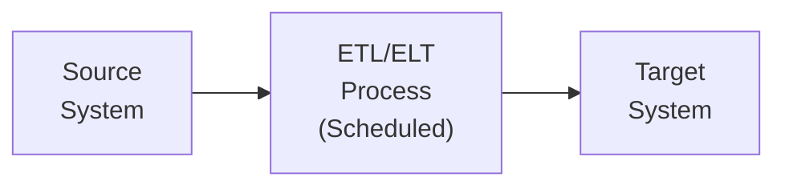
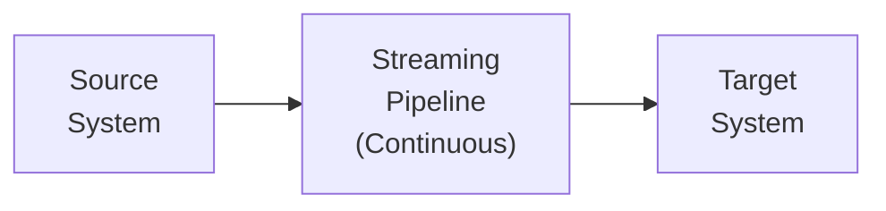
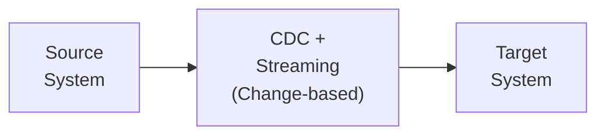
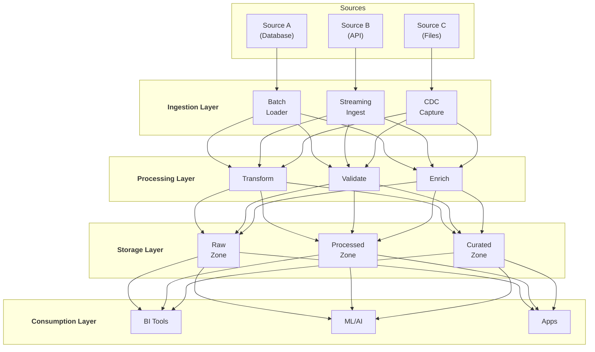
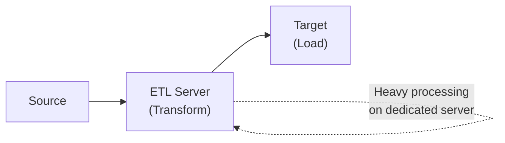
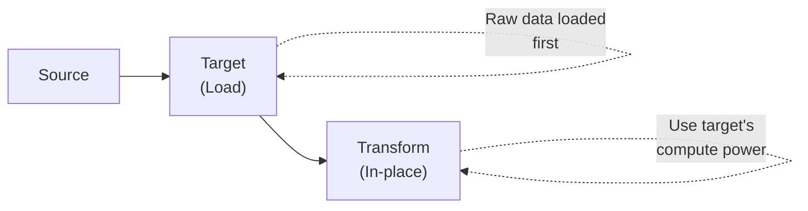
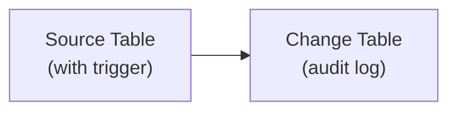
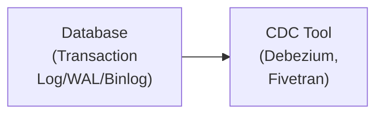
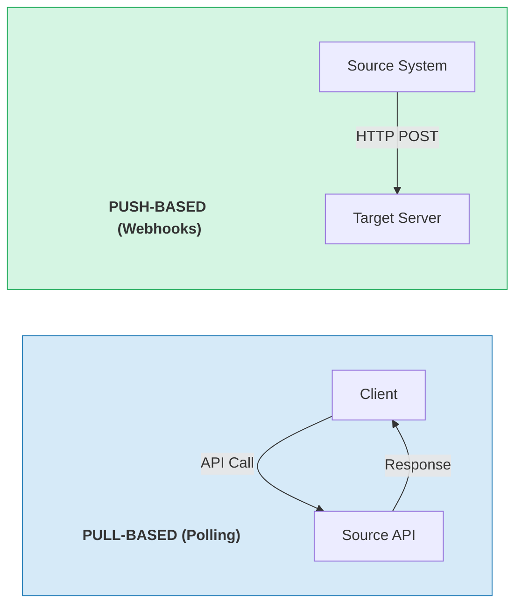
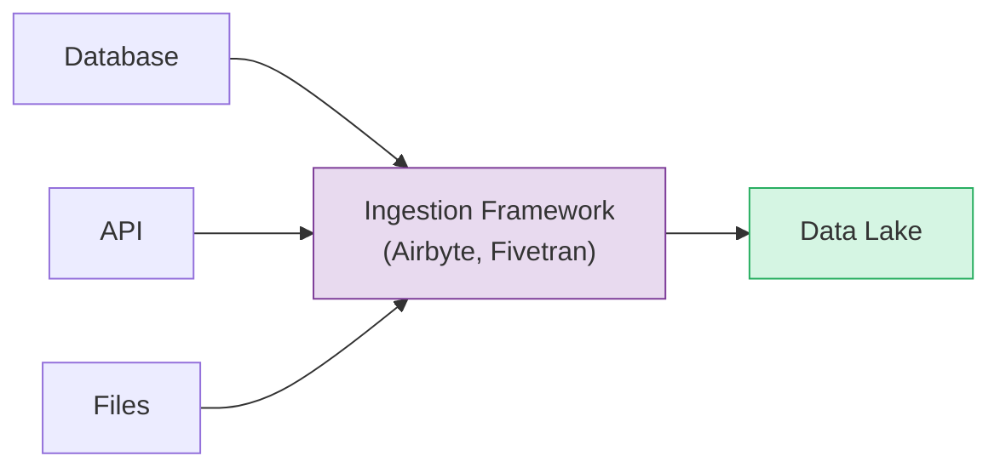

# Data Integration & APIs - Complete Guide

## ETL Patterns, CDC, REST APIs, Data Ingestion, và Integration Architecture

---

## PHẦN 1: DATA INTEGRATION FUNDAMENTALS

### 1.1 Data Integration Là Gì?

Data Integration là quá trình kết hợp data từ nhiều sources khác nhau thành một unified view:

- Combining operational databases
- Aggregating external data sources
- Synchronizing systems
- Building unified data platforms

### 1.2 Integration Patterns Overview

**BATCH INTEGRATION:**



- Periodic extraction
- Full/incremental loads
- High latency (minutes to hours)


**REAL-TIME INTEGRATION:**



- Continuous extraction
- Event-driven
- Low latency (seconds to milliseconds)


**HYBRID INTEGRATION:**



- Capture changes only
- Near real-time
- Efficient for large tables

### 1.3 Integration Architecture



---

## PHẦN 2: ETL vs ELT

### 2.1 ETL (Extract, Transform, Load)

```
Traditional ETL:



Characteristics:
- Transform before loading
- Requires staging area
- Good for data quality
- Limited by ETL server capacity
```

### 2.2 ELT (Extract, Load, Transform)

```
Modern ELT:



Characteristics:
- Load raw data first
- Transform using target's power
- Better for cloud data warehouses
- Scales with compute resources
```

### 2.3 ETL vs ELT Comparison

```
Aspect              ETL                     ELT
---------------------------------------------------------
Transform timing    Before load             After load
Compute location    ETL server              Target system
Best for            On-premises, OLTP       Cloud DW, Big Data
Data volume         Smaller volumes         Large volumes
Flexibility         Less flexible           More flexible
Cost                Fixed capacity          Pay-per-query
Raw data            Not preserved           Preserved
Iteration           Slow (re-extract)       Fast (re-transform)
```

### 2.4 ETL Code Examples

```python
# Traditional ETL with Python
# ---------------------------------------------
import pandas as pd
from sqlalchemy import create_engine

def extract(source_conn):
    """Extract from source"""
    query = """
        SELECT customer_id, order_date, amount
        FROM orders
        WHERE order_date >= '2024-01-01'
    """
    return pd.read_sql(query, source_conn)

def transform(df):
    """Transform data"""
    # Clean data
    df = df.dropna()
    
    # Type conversion
    df['order_date'] = pd.to_datetime(df['order_date'])
    df['amount'] = df['amount'].astype(float)
    
    # Aggregation
    df_agg = df.groupby(['customer_id', df['order_date'].dt.to_period('M')]) \
               .agg({'amount': 'sum'}) \
               .reset_index()
    
    return df_agg

def load(df, target_conn):
    """Load to target"""
    df.to_sql('monthly_sales', target_conn, 
              if_exists='append', index=False)

# Execute ETL
source_conn = create_engine('postgresql://source_db')
target_conn = create_engine('postgresql://target_db')

raw_data = extract(source_conn)
transformed_data = transform(raw_data)
load(transformed_data, target_conn)
```

```sql
-- ELT with SQL (BigQuery example)
-- ---------------------------------------------

-- Step 1: Extract & Load (raw data)
LOAD DATA INTO raw.orders
FROM 'gs://bucket/orders/*.parquet';

-- Step 2: Transform in-place
CREATE OR REPLACE TABLE processed.monthly_sales AS
SELECT 
    customer_id,
    DATE_TRUNC(order_date, MONTH) as month,
    SUM(amount) as total_amount,
    COUNT(*) as order_count
FROM raw.orders
WHERE order_date >= '2024-01-01'
    AND amount IS NOT NULL
GROUP BY customer_id, DATE_TRUNC(order_date, MONTH);
```

---

## PHẦN 3: CHANGE DATA CAPTURE (CDC)

### 3.1 CDC Overview

```
Change Data Capture: Capture và replicate data changes

Traditional (Full Load):
Every sync: Copy entire table
Table: 1M rows -> Transfer 1M rows (inefficient)

CDC (Change Capture):
Every sync: Copy only changes
Table: 1M rows, 100 changed -> Transfer 100 rows (efficient)


CDC captures:
- INSERT: New rows
- UPDATE: Modified rows  
- DELETE: Removed rows
```

### 3.2 CDC Methods

```
1. TIMESTAMP-BASED CDC

| id | data | updated_at    |
|----|------|---------------|
| 1  | A    | 2024-01-15... |
| 2  | B    | 2024-01-16... | ← New/Modified

Query: SELECT * FROM table WHERE updated_at > last_sync_time

Pros: Simple, works everywhere
Cons: Cannot detect deletes, needs timestamp column


2. VERSION/SEQUENCE-BASED CDC

| id | data | version |
|----|------|---------|
| 1  | A    | 5       |
| 2  | B    | 6       | ← version > last_sync_version

Query: SELECT * FROM table WHERE version > last_sync_version

Pros: Simple, reliable
Cons: Cannot detect deletes, needs version column


3. TRIGGER-BASED CDC



Trigger captures all DML and logs to change table

Pros: Captures deletes, accurate
Cons: Performance overhead, requires DB access


4. LOG-BASED CDC



Read database transaction logs directly

Pros: Minimal overhead, captures all changes, deletes included
Cons: Database-specific, more complex setup
```

### 3.3 Debezium CDC

```yaml
# Debezium Connector Configuration (Kafka Connect)
{
  "name": "mysql-connector",
  "config": {
    "connector.class": "io.debezium.connector.mysql.MySqlConnector",
    "database.hostname": "mysql-server",
    "database.port": "3306",
    "database.user": "debezium",
    "database.password": "password",
    "database.server.id": "184054",
    "database.server.name": "myserver",
    "database.include.list": "inventory",
    "table.include.list": "inventory.customers,inventory.orders",
    "database.history.kafka.bootstrap.servers": "kafka:9092",
    "database.history.kafka.topic": "schema-changes.inventory"
  }
}
```

```json
// Debezium Change Event
{
  "before": {
    "id": 1,
    "name": "Alice",
    "email": "alice@old.com"
  },
  "after": {
    "id": 1,
    "name": "Alice",
    "email": "alice@new.com"
  },
  "source": {
    "version": "2.0.0",
    "connector": "mysql",
    "name": "myserver",
    "ts_ms": 1704067200000,
    "db": "inventory",
    "table": "customers"
  },
  "op": "u",  // c=create, u=update, d=delete, r=read
  "ts_ms": 1704067200000
}
```

### 3.4 CDC với Python

```python
# Consuming Debezium CDC events
from confluent_kafka import Consumer
import json

consumer = Consumer({
    'bootstrap.servers': 'localhost:9092',
    'group.id': 'cdc-processor',
    'auto.offset.reset': 'earliest'
})

consumer.subscribe(['myserver.inventory.customers'])

def process_cdc_event(event):
    op = event.get('op')
    before = event.get('before')
    after = event.get('after')
    
    if op == 'c':  # Create
        insert_record(after)
    elif op == 'u':  # Update
        update_record(after)
    elif op == 'd':  # Delete
        delete_record(before['id'])

while True:
    msg = consumer.poll(1.0)
    if msg is None:
        continue
    
    if msg.error():
        print(f"Error: {msg.error()}")
        continue
    
    event = json.loads(msg.value())
    process_cdc_event(event)
```

### 3.5 CDC với Spark

```python
# Read CDC stream and apply to Delta Lake
from pyspark.sql import SparkSession
from pyspark.sql.functions import *
from delta.tables import DeltaTable

spark = SparkSession.builder \
    .appName("CDC-Processor") \
    .config("spark.sql.extensions", "io.delta.sql.DeltaSparkSessionExtension") \
    .getOrCreate()

# Read CDC events from Kafka
cdc_stream = spark.readStream \
    .format("kafka") \
    .option("kafka.bootstrap.servers", "localhost:9092") \
    .option("subscribe", "myserver.inventory.customers") \
    .load()

# Parse CDC events
parsed = cdc_stream.select(
    from_json(col("value").cast("string"), schema).alias("data")
).select("data.*")

# Apply CDC to Delta table
def apply_cdc_batch(batch_df, batch_id):
    if batch_df.isEmpty():
        return
    
    # Get Delta table
    delta_table = DeltaTable.forPath(spark, "/delta/customers")
    
    # Separate operations
    inserts = batch_df.filter(col("op") == "c").select("after.*")
    updates = batch_df.filter(col("op") == "u").select("after.*")
    deletes = batch_df.filter(col("op") == "d").select("before.id")
    
    # Apply inserts/updates with MERGE
    if inserts.count() > 0 or updates.count() > 0:
        upserts = inserts.union(updates)
        delta_table.alias("target").merge(
            upserts.alias("source"),
            "target.id = source.id"
        ).whenMatchedUpdateAll() \
         .whenNotMatchedInsertAll() \
         .execute()
    
    # Apply deletes
    if deletes.count() > 0:
        delta_table.delete(
            col("id").isin([r.id for r in deletes.collect()])
        )

# Write stream
parsed.writeStream \
    .foreachBatch(apply_cdc_batch) \
    .option("checkpointLocation", "/checkpoint/cdc") \
    .start() \
    .awaitTermination()
```

---

## PHẦN 4: REST APIs

### 4.1 API Integration Patterns



```
Pull: Client initiates · Simple · Rate limits · Potential gaps
Push: Source pushes on change · Real-time · Needs endpoint
```

### 4.2 API Data Extraction

```python
import requests
import time
from datetime import datetime, timedelta

class APIExtractor:
    def __init__(self, base_url, api_key):
        self.base_url = base_url
        self.headers = {"Authorization": f"Bearer {api_key}"}
        self.session = requests.Session()
    
    def extract_with_pagination(self, endpoint, params=None):
        """Extract data with pagination"""
        all_data = []
        page = 1
        
        while True:
            response = self.session.get(
                f"{self.base_url}/{endpoint}",
                headers=self.headers,
                params={**(params or {}), "page": page, "per_page": 100}
            )
            
            # Handle rate limits
            if response.status_code == 429:
                retry_after = int(response.headers.get('Retry-After', 60))
                time.sleep(retry_after)
                continue
            
            response.raise_for_status()
            data = response.json()
            
            if not data.get('items'):
                break
            
            all_data.extend(data['items'])
            
            # Check for more pages
            if not data.get('has_more', False):
                break
            
            page += 1
        
        return all_data
    
    def extract_incremental(self, endpoint, last_modified):
        """Extract only changed records since last sync"""
        params = {
            "modified_since": last_modified.isoformat(),
            "sort": "modified_at",
            "order": "asc"
        }
        return self.extract_with_pagination(endpoint, params)
    
    def extract_with_cursor(self, endpoint):
        """Extract using cursor-based pagination"""
        all_data = []
        cursor = None
        
        while True:
            params = {"limit": 100}
            if cursor:
                params["cursor"] = cursor
            
            response = self.session.get(
                f"{self.base_url}/{endpoint}",
                headers=self.headers,
                params=params
            )
            response.raise_for_status()
            data = response.json()
            
            all_data.extend(data['items'])
            
            cursor = data.get('next_cursor')
            if not cursor:
                break
        
        return all_data


# Usage
extractor = APIExtractor("https://api.example.com/v1", "api_key")
orders = extractor.extract_incremental("orders", datetime.now() - timedelta(days=1))
```

### 4.3 Rate Limiting Strategies

```python
import time
from functools import wraps

class RateLimiter:
    """Token bucket rate limiter"""
    
    def __init__(self, calls_per_second):
        self.calls_per_second = calls_per_second
        self.tokens = calls_per_second
        self.last_update = time.time()
    
    def acquire(self):
        now = time.time()
        elapsed = now - self.last_update
        self.tokens = min(
            self.calls_per_second,
            self.tokens + elapsed * self.calls_per_second
        )
        self.last_update = now
        
        if self.tokens < 1:
            sleep_time = (1 - self.tokens) / self.calls_per_second
            time.sleep(sleep_time)
            self.tokens = 0
        else:
            self.tokens -= 1


def rate_limited(calls_per_second):
    """Decorator for rate limiting"""
    limiter = RateLimiter(calls_per_second)
    
    def decorator(func):
        @wraps(func)
        def wrapper(*args, **kwargs):
            limiter.acquire()
            return func(*args, **kwargs)
        return wrapper
    return decorator


@rate_limited(10)  # 10 calls per second
def call_api(endpoint):
    return requests.get(f"https://api.example.com/{endpoint}")


# Exponential backoff for retries
def retry_with_backoff(func, max_retries=5, base_delay=1):
    for attempt in range(max_retries):
        try:
            return func()
        except requests.exceptions.RequestException as e:
            if attempt == max_retries - 1:
                raise
            delay = base_delay * (2 ** attempt)
            time.sleep(delay)
```

### 4.4 Webhook Handler

```python
from flask import Flask, request, jsonify
import hmac
import hashlib

app = Flask(__name__)
WEBHOOK_SECRET = "your_secret_key"

def verify_signature(payload, signature):
    """Verify webhook signature"""
    expected = hmac.new(
        WEBHOOK_SECRET.encode(),
        payload,
        hashlib.sha256
    ).hexdigest()
    return hmac.compare_digest(f"sha256={expected}", signature)

@app.route('/webhook/orders', methods=['POST'])
def handle_order_webhook():
    # Verify signature
    signature = request.headers.get('X-Signature')
    if not verify_signature(request.data, signature):
        return jsonify({"error": "Invalid signature"}), 401
    
    event = request.json
    event_type = event.get('type')
    
    if event_type == 'order.created':
        process_new_order(event['data'])
    elif event_type == 'order.updated':
        process_order_update(event['data'])
    elif event_type == 'order.cancelled':
        process_order_cancellation(event['data'])
    
    return jsonify({"status": "received"}), 200

def process_new_order(order_data):
    # Send to Kafka for processing
    producer.send('orders', value=order_data)
```

---

## PHẦN 5: DATA INGESTION PATTERNS

### 5.1 Ingestion Architecture



```
Ingestion Framework Responsibilities:
- Source connectors
- Scheduling
- Error handling
- Schema detection
- Incremental sync
- Monitoring
```

### 5.2 File Ingestion

```python
import boto3
from pathlib import Path
import hashlib

class FileIngestion:
    def __init__(self, s3_client, bucket):
        self.s3 = s3_client
        self.bucket = bucket
    
    def ingest_file(self, local_path, destination_prefix):
        """Ingest file with deduplication"""
        file_path = Path(local_path)
        
        # Calculate checksum
        checksum = self._calculate_checksum(file_path)
        
        # Generate destination key
        dest_key = f"{destination_prefix}/{file_path.name}"
        
        # Check if already exists
        if self._file_exists(dest_key, checksum):
            return {"status": "skipped", "reason": "duplicate"}
        
        # Upload with metadata
        self.s3.upload_file(
            str(file_path),
            self.bucket,
            dest_key,
            ExtraArgs={
                'Metadata': {
                    'checksum': checksum,
                    'source': str(file_path),
                    'ingested_at': datetime.now().isoformat()
                }
            }
        )
        
        return {"status": "success", "key": dest_key}
    
    def _calculate_checksum(self, file_path):
        hash_md5 = hashlib.md5()
        with open(file_path, "rb") as f:
            for chunk in iter(lambda: f.read(4096), b""):
                hash_md5.update(chunk)
        return hash_md5.hexdigest()
    
    def _file_exists(self, key, checksum):
        try:
            response = self.s3.head_object(Bucket=self.bucket, Key=key)
            return response['Metadata'].get('checksum') == checksum
        except:
            return False
    
    def ingest_directory(self, local_dir, destination_prefix, pattern="*"):
        """Ingest all files matching pattern"""
        results = []
        for file_path in Path(local_dir).glob(pattern):
            if file_path.is_file():
                result = self.ingest_file(file_path, destination_prefix)
                results.append({
                    "file": str(file_path),
                    **result
                })
        return results
```

### 5.3 Database Ingestion

```python
from sqlalchemy import create_engine, text
import pandas as pd

class DatabaseIngestion:
    def __init__(self, connection_string, target_path):
        self.engine = create_engine(connection_string)
        self.target_path = target_path
    
    def full_load(self, table_name, partition_column=None):
        """Full table extraction"""
        query = f"SELECT * FROM {table_name}"
        
        df = pd.read_sql(query, self.engine)
        
        output_path = f"{self.target_path}/{table_name}"
        if partition_column:
            # Partitioned write
            for partition_value, group_df in df.groupby(partition_column):
                partition_path = f"{output_path}/{partition_column}={partition_value}"
                group_df.to_parquet(f"{partition_path}/data.parquet")
        else:
            df.to_parquet(f"{output_path}/data.parquet")
        
        return {"rows": len(df), "path": output_path}
    
    def incremental_load(self, table_name, watermark_column, last_watermark):
        """Incremental extraction based on watermark"""
        query = f"""
            SELECT * FROM {table_name}
            WHERE {watermark_column} > :last_watermark
            ORDER BY {watermark_column}
        """
        
        df = pd.read_sql(
            text(query),
            self.engine,
            params={"last_watermark": last_watermark}
        )
        
        if len(df) == 0:
            return {"rows": 0, "new_watermark": last_watermark}
        
        # Get new watermark
        new_watermark = df[watermark_column].max()
        
        # Append to target
        timestamp = datetime.now().strftime("%Y%m%d_%H%M%S")
        output_path = f"{self.target_path}/{table_name}/incremental/{timestamp}"
        df.to_parquet(f"{output_path}/data.parquet")
        
        return {
            "rows": len(df),
            "new_watermark": new_watermark,
            "path": output_path
        }
    
    def chunked_load(self, table_name, chunk_size=100000):
        """Load large table in chunks"""
        query = f"SELECT * FROM {table_name}"
        
        chunk_num = 0
        for chunk_df in pd.read_sql(query, self.engine, chunksize=chunk_size):
            output_path = f"{self.target_path}/{table_name}/chunk_{chunk_num:05d}.parquet"
            chunk_df.to_parquet(output_path)
            chunk_num += 1
            yield {"chunk": chunk_num, "rows": len(chunk_df)}
```

### 5.4 Streaming Ingestion

```python
from confluent_kafka import Consumer
import json

class StreamIngestion:
    def __init__(self, kafka_config, topics):
        self.consumer = Consumer({
            **kafka_config,
            'enable.auto.commit': False
        })
        self.consumer.subscribe(topics)
        self.buffer = []
        self.buffer_size = 1000
    
    def run(self, process_func, commit_interval=100):
        """Run continuous ingestion"""
        messages_since_commit = 0
        
        try:
            while True:
                msg = self.consumer.poll(1.0)
                
                if msg is None:
                    if self.buffer:
                        self._flush_buffer(process_func)
                    continue
                
                if msg.error():
                    self._handle_error(msg.error())
                    continue
                
                # Add to buffer
                event = json.loads(msg.value())
                self.buffer.append(event)
                
                # Flush if buffer full
                if len(self.buffer) >= self.buffer_size:
                    self._flush_buffer(process_func)
                    messages_since_commit += len(self.buffer)
                
                # Commit periodically
                if messages_since_commit >= commit_interval:
                    self.consumer.commit()
                    messages_since_commit = 0
        
        finally:
            self.consumer.close()
    
    def _flush_buffer(self, process_func):
        if self.buffer:
            process_func(self.buffer)
            self.buffer = []
    
    def _handle_error(self, error):
        print(f"Consumer error: {error}")


# Usage
def write_to_datalake(events):
    df = pd.DataFrame(events)
    timestamp = datetime.now().strftime("%Y%m%d_%H%M%S")
    df.to_parquet(f"s3://datalake/events/batch_{timestamp}.parquet")

ingestion = StreamIngestion(
    kafka_config={'bootstrap.servers': 'localhost:9092', 'group.id': 'ingestion'},
    topics=['events']
)
ingestion.run(write_to_datalake)
```

---

## PHẦN 6: DATA CONNECTORS

### 6.1 Popular Integration Tools

```
MANAGED/SAAS:
- Fivetran: Fully managed, 150+ connectors
- Stitch: Simple, affordable
- Airbyte: Open-source option
- Matillion: ETL + Transformation

SELF-HOSTED:
- Airbyte: Docker/Kubernetes deployment
- Singer (Meltano): ETL framework
- Apache NiFi: Data flow automation
- Debezium: CDC for databases

CLOUD NATIVE:
- AWS Glue Connectors
- Azure Data Factory
- Google Cloud Data Fusion
```

### 6.2 Airbyte Configuration

```yaml
# Source configuration (Postgres)
sourceDefinitionId: "postgres"
connectionConfiguration:
  host: "db.example.com"
  port: 5432
  database: "mydb"
  username: "airbyte"
  password: "${POSTGRES_PASSWORD}"
  ssl_mode:
    mode: "require"
  replication_method:
    method: "CDC"
    plugin: "pgoutput"
    publication: "airbyte_publication"
    replication_slot: "airbyte_slot"

# Destination configuration (BigQuery)
destinationDefinitionId: "bigquery"
connectionConfiguration:
  project_id: "my-project"
  dataset_id: "raw_data"
  dataset_location: "US"
  loading_method:
    method: "GCS Staging"
    gcs_bucket_name: "airbyte-staging"
    gcs_bucket_path: "sync"
    keep_files_in_gcs-bucket: "Delete all sync files"

# Connection configuration
syncCatalog:
  streams:
    - stream:
        name: "orders"
        namespace: "public"
      config:
        syncMode: "incremental"
        destinationSyncMode: "append_dedup"
        cursorField: ["updated_at"]
        primaryKey: [["id"]]
```

### 6.3 Custom Connector Pattern

```python
from abc import ABC, abstractmethod
from dataclasses import dataclass
from typing import Iterator, Dict, Any, Optional

@dataclass
class Record:
    stream: str
    data: Dict[str, Any]
    emitted_at: int

class SourceConnector(ABC):
    @abstractmethod
    def check_connection(self) -> tuple[bool, Optional[str]]:
        """Test connectivity"""
        pass
    
    @abstractmethod
    def discover(self) -> Dict[str, Any]:
        """Discover available streams and schema"""
        pass
    
    @abstractmethod
    def read(self, stream: str, state: Optional[Dict] = None) -> Iterator[Record]:
        """Read records from stream"""
        pass


class PostgresConnector(SourceConnector):
    def __init__(self, config: Dict):
        self.config = config
        self.engine = create_engine(
            f"postgresql://{config['user']}:{config['password']}"
            f"@{config['host']}:{config['port']}/{config['database']}"
        )
    
    def check_connection(self):
        try:
            with self.engine.connect() as conn:
                conn.execute(text("SELECT 1"))
            return True, None
        except Exception as e:
            return False, str(e)
    
    def discover(self):
        tables = {}
        with self.engine.connect() as conn:
            result = conn.execute(text("""
                SELECT table_name, column_name, data_type
                FROM information_schema.columns
                WHERE table_schema = 'public'
            """))
            
            for row in result:
                if row.table_name not in tables:
                    tables[row.table_name] = {"columns": []}
                tables[row.table_name]["columns"].append({
                    "name": row.column_name,
                    "type": row.data_type
                })
        
        return tables
    
    def read(self, stream: str, state: Optional[Dict] = None) -> Iterator[Record]:
        cursor_field = self.config.get('cursor_field', 'updated_at')
        cursor_value = state.get(cursor_field) if state else None
        
        query = f"SELECT * FROM {stream}"
        if cursor_value:
            query += f" WHERE {cursor_field} > :cursor"
        query += f" ORDER BY {cursor_field}"
        
        with self.engine.connect() as conn:
            result = conn.execute(
                text(query),
                {"cursor": cursor_value} if cursor_value else {}
            )
            
            for row in result:
                yield Record(
                    stream=stream,
                    data=dict(row._mapping),
                    emitted_at=int(time.time() * 1000)
                )
```

---

## PHẦN 7: DATA VALIDATION & QUALITY

### 7.1 Ingestion Validation

```python
from pydantic import BaseModel, validator, ValidationError
from typing import List, Optional
from datetime import datetime

class OrderRecord(BaseModel):
    order_id: str
    customer_id: str
    order_date: datetime
    amount: float
    status: str
    
    @validator('order_id')
    def order_id_format(cls, v):
        if not v.startswith('ORD-'):
            raise ValueError('order_id must start with ORD-')
        return v
    
    @validator('amount')
    def amount_positive(cls, v):
        if v <= 0:
            raise ValueError('amount must be positive')
        return v
    
    @validator('status')
    def status_valid(cls, v):
        valid_statuses = ['pending', 'confirmed', 'shipped', 'delivered', 'cancelled']
        if v not in valid_statuses:
            raise ValueError(f'status must be one of {valid_statuses}')
        return v


def validate_records(records: List[dict]) -> tuple[List[dict], List[dict]]:
    """Validate records and separate valid/invalid"""
    valid_records = []
    invalid_records = []
    
    for record in records:
        try:
            validated = OrderRecord(**record)
            valid_records.append(validated.dict())
        except ValidationError as e:
            invalid_records.append({
                "record": record,
                "errors": e.errors()
            })
    
    return valid_records, invalid_records


# Dead letter queue pattern
def process_with_dlq(records, process_func, dlq_path):
    valid, invalid = validate_records(records)
    
    # Process valid records
    if valid:
        process_func(valid)
    
    # Send invalid to DLQ
    if invalid:
        df = pd.DataFrame(invalid)
        timestamp = datetime.now().strftime("%Y%m%d_%H%M%S")
        df.to_json(f"{dlq_path}/errors_{timestamp}.json", orient='records')
```

### 7.2 Schema Evolution Handling

```python
from typing import Dict, Any

def merge_schemas(old_schema: Dict, new_schema: Dict) -> Dict:
    """Merge schemas handling additions/removals"""
    merged = old_schema.copy()
    
    for field, field_type in new_schema.items():
        if field not in merged:
            # New field - make nullable
            merged[field] = {"type": field_type, "nullable": True}
        elif merged[field] != field_type:
            # Type change - check compatibility
            if is_compatible_type_change(merged[field], field_type):
                merged[field] = field_type
            else:
                raise SchemaEvolutionError(
                    f"Incompatible type change for {field}: "
                    f"{merged[field]} -> {field_type}"
                )
    
    return merged


def is_compatible_type_change(old_type, new_type):
    """Check if type change is compatible"""
    compatible_changes = {
        ('int', 'long'),
        ('float', 'double'),
        ('int', 'float'),
        ('int', 'double'),
    }
    return (old_type, new_type) in compatible_changes


# Handle schema evolution in ingestion
def ingest_with_schema_evolution(records, existing_schema_path, output_path):
    # Infer schema from new records
    new_schema = infer_schema(records)
    
    # Load existing schema
    try:
        existing_schema = load_schema(existing_schema_path)
    except FileNotFoundError:
        existing_schema = {}
    
    # Merge schemas
    merged_schema = merge_schemas(existing_schema, new_schema)
    
    # Apply schema to records (add nulls for missing fields)
    normalized_records = normalize_to_schema(records, merged_schema)
    
    # Save updated schema
    save_schema(merged_schema, existing_schema_path)
    
    # Write data
    write_parquet(normalized_records, output_path, merged_schema)
```

---

## PHẦN 8: ORCHESTRATING INTEGRATIONS

### 8.1 Airflow DAG cho Integration

```python
from airflow import DAG
from airflow.operators.python import PythonOperator
from airflow.providers.http.operators.http import SimpleHttpOperator
from airflow.providers.postgres.operators.postgres import PostgresOperator
from datetime import datetime, timedelta

default_args = {
    'owner': 'data-team',
    'depends_on_past': False,
    'email_on_failure': True,
    'email': ['alerts@company.com'],
    'retries': 3,
    'retry_delay': timedelta(minutes=5),
}

with DAG(
    'data_integration_pipeline',
    default_args=default_args,
    description='Multi-source data integration',
    schedule_interval='@hourly',
    start_date=datetime(2024, 1, 1),
    catchup=False,
) as dag:
    
    # Task 1: Extract from API
    extract_api = PythonOperator(
        task_id='extract_from_api',
        python_callable=extract_api_data,
        op_kwargs={
            'endpoint': 'orders',
            'output_path': '/tmp/api_data'
        }
    )
    
    # Task 2: Extract from Database
    extract_db = PostgresOperator(
        task_id='extract_from_db',
        postgres_conn_id='source_postgres',
        sql="""
            COPY (
                SELECT * FROM customers 
                WHERE updated_at > '{{ prev_execution_date }}'
            ) TO STDOUT WITH CSV HEADER
        """,
    )
    
    # Task 3: Validate data
    validate = PythonOperator(
        task_id='validate_data',
        python_callable=validate_and_clean,
        op_kwargs={
            'input_paths': ['/tmp/api_data', '/tmp/db_data'],
            'output_path': '/tmp/validated'
        }
    )
    
    # Task 4: Load to Data Lake
    load = PythonOperator(
        task_id='load_to_datalake',
        python_callable=load_to_s3,
        op_kwargs={
            'input_path': '/tmp/validated',
            'bucket': 'datalake',
            'prefix': 'raw/{{ ds }}'
        }
    )
    
    # Task 5: Trigger downstream
    trigger_transform = TriggerDagRunOperator(
        task_id='trigger_transform',
        trigger_dag_id='data_transformation_pipeline',
    )
    
    # Dependencies
    [extract_api, extract_db] >> validate >> load >> trigger_transform
```

### 8.2 Error Handling Pattern

```python
from airflow.exceptions import AirflowFailException
from airflow.models import Variable

def extract_with_retry(**context):
    """Extract with error handling and retry logic"""
    max_retries = 3
    retry_count = context.get('task_instance').try_number
    
    try:
        # Attempt extraction
        data = extract_from_source()
        
        # Validate minimum records
        if len(data) < Variable.get('min_expected_records', 100):
            raise AirflowFailException(
                f"Too few records: {len(data)}. Expected at least "
                f"{Variable.get('min_expected_records', 100)}"
            )
        
        return data
        
    except ConnectionError as e:
        if retry_count < max_retries:
            raise  # Will be retried
        else:
            # Send to dead letter queue and continue
            send_to_dlq(context['task_instance'].task_id, str(e))
            return []  # Empty result
    
    except ValidationError as e:
        # Data quality issue - alert but don't fail
        send_alert(f"Validation error: {e}")
        return partial_data


def send_to_dlq(task_id, error_message):
    """Send failed extraction info to dead letter queue"""
    dlq_record = {
        "task_id": task_id,
        "error": error_message,
        "timestamp": datetime.now().isoformat(),
        "dag_run_id": "{{ run_id }}"
    }
    # Write to DLQ table or S3
    save_to_dlq(dlq_record)
```

---

## PHẦN 9: BEST PRACTICES

### 9.1 Integration Design Principles

```
1. IDEMPOTENCY
   - Same operation can run multiple times safely
   - Use upserts, not inserts
   - Deduplicate on unique keys

2. INCREMENTAL OVER FULL
   - Prefer incremental loads
   - Track watermarks reliably
   - Fall back to full load when needed

3. SCHEMA MANAGEMENT
   - Version schemas
   - Handle evolution gracefully
   - Validate at ingestion

4. ERROR HANDLING
   - Dead letter queues for bad records
   - Retry with exponential backoff
   - Alert on anomalies

5. MONITORING
   - Track record counts
   - Monitor latency
   - Alert on failures
```

### 9.2 Performance Optimization

```
1. PARALLELIZATION
   - Partition source reads
   - Parallel API calls (respect limits)
   - Distributed processing

2. BATCHING
   - Batch API requests
   - Bulk database operations
   - Buffer before write

3. COMPRESSION
   - Compress in transit
   - Use efficient formats
   - Enable storage compression

4. CACHING
   - Cache lookup data
   - Cache API responses
   - Use CDN for files

5. CONNECTION POOLING
   - Reuse database connections
   - HTTP session reuse
   - Connection limits
```

### 9.3 Security Checklist

```
□ Encrypt data in transit (TLS/SSL)
□ Encrypt data at rest
□ Use secure credential storage (Vault, Secrets Manager)
□ Rotate API keys regularly
□ Implement least privilege access
□ Audit access logs
□ Mask/redact PII in logs
□ Validate webhook signatures
□ Use VPC/private endpoints
□ Regular security scans
```

---

*Document Version: 1.0*
*Last Updated: February 2026*
*Coverage: ETL/ELT, CDC, REST APIs, Data Ingestion, Integration Patterns*
