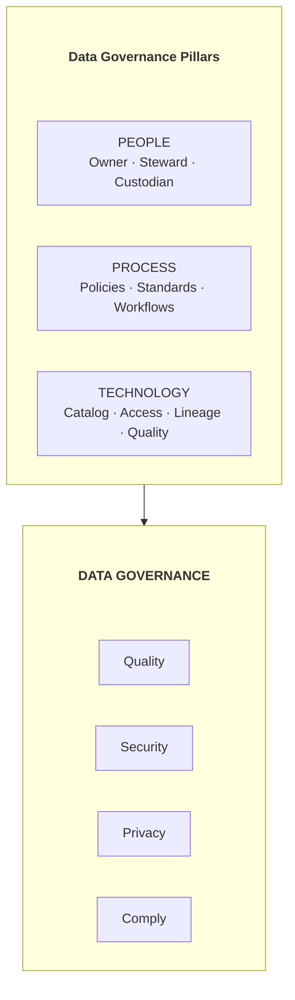
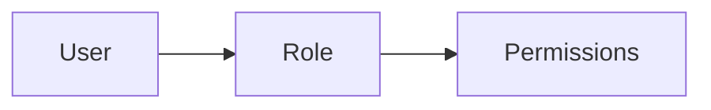
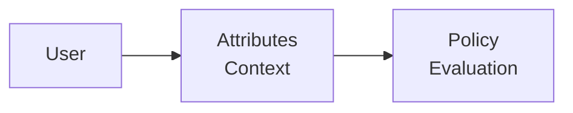
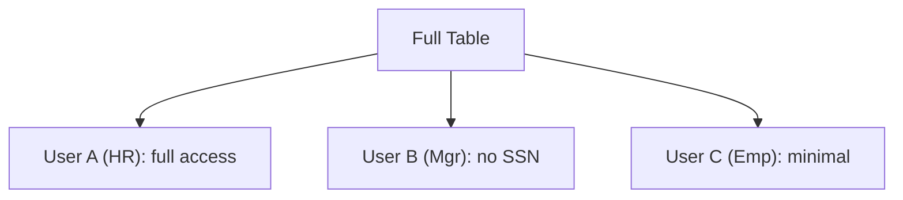
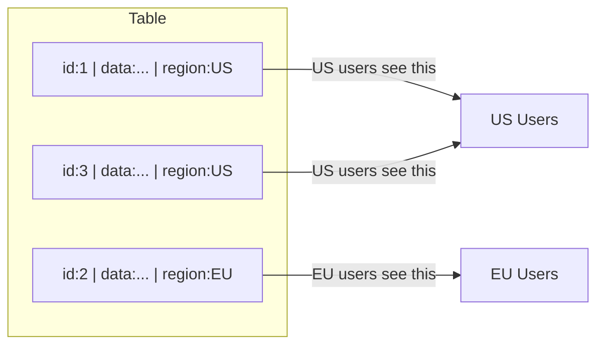
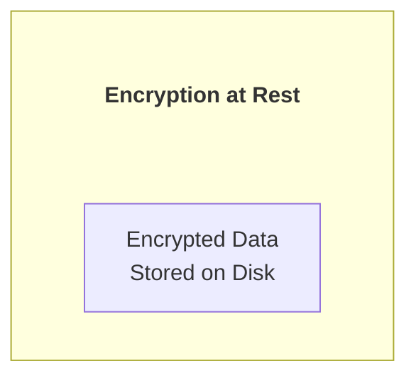
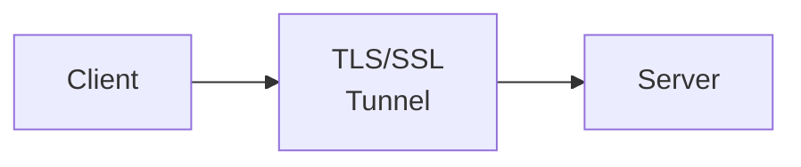
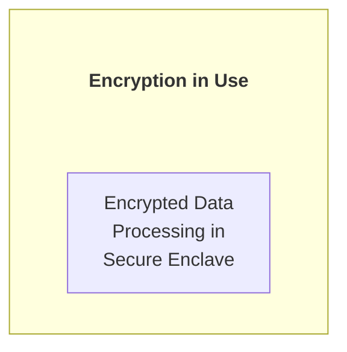
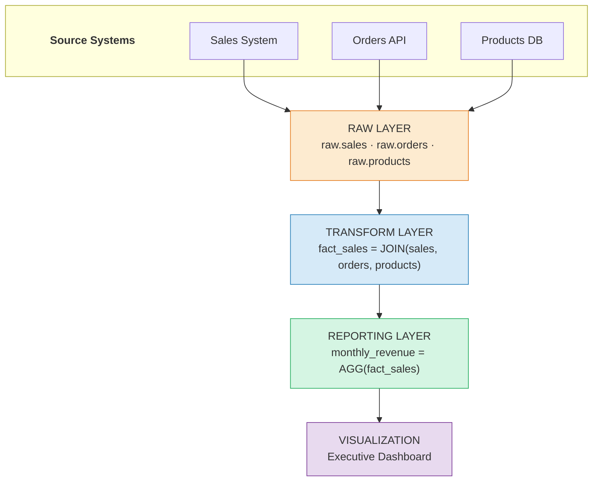
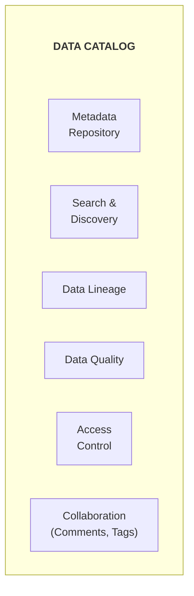

# Data Security & Governance - Complete Guide

## Access Control, Encryption, Compliance, Data Lineage, và Privacy

---

## PHẦN 1: DATA GOVERNANCE FUNDAMENTALS

### 1.1 Data Governance Là Gì?

Data Governance là framework để quản lý:
- Data quality (chất lượng dữ liệu)
- Data security (bảo mật)
- Data privacy (quyền riêng tư)
- Data compliance (tuân thủ pháp luật)
- Data lifecycle (vòng đời dữ liệu)

### 1.2 Governance Framework



### 1.3 Roles và Responsibilities

```
DATA OWNER (Business Role):
- Accountable for data quality
- Defines access policies
- Approves data usage
- Usually: Department Head, VP

DATA STEWARD:
- Day-to-day data management
- Implements policies
- Resolves data issues
- Usually: Analyst, SME

DATA CUSTODIAN (Technical Role):
- Physical data storage
- Backup and recovery
- Technical security
- Usually: DBA, Data Engineer

DATA CONSUMER:
- Uses data for analysis
- Follows policies
- Reports issues
- Usually: Analyst, Scientist
```

---

## PHẦN 2: ACCESS CONTROL

### 2.1 Access Control Models

**RBAC (Role-Based Access Control):**



Example:
User: alice
Role: analyst
Permissions: SELECT on sales_data, SELECT on customer_dim

**ABAC (Attribute-Based Access Control):**



Example:
User: alice
Attributes: department=sales, region=US
Policy: IF department=sales AND data.region=user.region THEN allow

**Column-Level Security:**



**Row-Level Security:**



### 2.2 Implementing RBAC

```sql
-- PostgreSQL RBAC
-- Create roles
CREATE ROLE data_reader;
CREATE ROLE data_analyst;
CREATE ROLE data_engineer;
CREATE ROLE data_admin;

-- Grant permissions to roles
GRANT USAGE ON SCHEMA analytics TO data_reader;
GRANT SELECT ON ALL TABLES IN SCHEMA analytics TO data_reader;

GRANT data_reader TO data_analyst;
GRANT INSERT, UPDATE ON analytics.reports TO data_analyst;

GRANT data_analyst TO data_engineer;
GRANT CREATE ON SCHEMA analytics TO data_engineer;
GRANT ALL ON ALL TABLES IN SCHEMA analytics TO data_engineer;

GRANT data_engineer TO data_admin;
GRANT ALL PRIVILEGES ON DATABASE warehouse TO data_admin;

-- Assign roles to users
GRANT data_analyst TO alice;
GRANT data_engineer TO bob;
```

```python
# Snowflake RBAC
snowflake_rbac = """
-- Create roles hierarchy
CREATE ROLE data_reader;
CREATE ROLE data_analyst;
CREATE ROLE data_engineer;
CREATE ROLE data_admin;

-- Build hierarchy
GRANT ROLE data_reader TO ROLE data_analyst;
GRANT ROLE data_analyst TO ROLE data_engineer;
GRANT ROLE data_engineer TO ROLE data_admin;

-- Grant warehouse access
GRANT USAGE ON WAREHOUSE compute_wh TO ROLE data_reader;

-- Grant database access
GRANT USAGE ON DATABASE analytics TO ROLE data_reader;
GRANT USAGE ON ALL SCHEMAS IN DATABASE analytics TO ROLE data_reader;
GRANT SELECT ON ALL TABLES IN SCHEMA analytics.public TO ROLE data_reader;

-- Future grants (for new objects)
GRANT SELECT ON FUTURE TABLES IN SCHEMA analytics.public TO ROLE data_reader;

-- Assign to users
GRANT ROLE data_analyst TO USER alice;
"""
```

### 2.3 Row-Level Security

```sql
-- PostgreSQL Row-Level Security
-- Enable RLS on table
ALTER TABLE sales ENABLE ROW LEVEL SECURITY;

-- Create policy
CREATE POLICY region_isolation ON sales
    USING (region = current_setting('app.current_region'));

-- Apply for users
ALTER TABLE sales FORCE ROW LEVEL SECURITY;

-- Set context for session
SET app.current_region = 'US';

-- Now queries automatically filter by region
SELECT * FROM sales;  -- Only sees US data


-- Snowflake Row Access Policy
CREATE OR REPLACE ROW ACCESS POLICY region_policy AS (region STRING)
RETURNS BOOLEAN ->
    CASE 
        WHEN CURRENT_ROLE() = 'DATA_ADMIN' THEN TRUE
        WHEN region = CURRENT_USER_REGION() THEN TRUE
        ELSE FALSE
    END;

ALTER TABLE sales ADD ROW ACCESS POLICY region_policy ON (region);
```

### 2.4 Column-Level Security

```sql
-- Snowflake Column Masking
CREATE OR REPLACE MASKING POLICY ssn_mask AS (val STRING)
RETURNS STRING ->
    CASE 
        WHEN CURRENT_ROLE() IN ('HR_ADMIN', 'DATA_ADMIN') THEN val
        ELSE '***-**-' || SUBSTR(val, 8, 4)  -- Show last 4 digits
    END;

ALTER TABLE employees MODIFY COLUMN ssn 
    SET MASKING POLICY ssn_mask;


-- Dynamic Data Masking (SQL Server)
ALTER TABLE employees
ALTER COLUMN ssn ADD MASKED WITH (FUNCTION = 'partial(0,"XXX-XX-",4)');

ALTER TABLE employees
ALTER COLUMN email ADD MASKED WITH (FUNCTION = 'email()');

ALTER TABLE employees
ALTER COLUMN salary ADD MASKED WITH (FUNCTION = 'default()');
```

---

## PHẦN 3: DATA ENCRYPTION

### 3.1 Encryption Types

**ENCRYPTION AT REST:**



- Full disk encryption
- Database TDE (Transparent Data Encryption)
- Column-level encryption
- File-level encryption

**ENCRYPTION IN TRANSIT:**



- TLS for network traffic
- HTTPS for APIs
- VPN for internal networks

**ENCRYPTION IN USE (Advanced):**



- Homomorphic encryption
- Secure enclaves (Intel SGX)
- Confidential computing

### 3.2 Encryption Implementation

```python
# Python Encryption with Fernet (AES-128)
from cryptography.fernet import Fernet
import base64
from cryptography.hazmat.primitives import hashes
from cryptography.hazmat.primitives.kdf.pbkdf2 import PBKDF2HMAC

class DataEncryption:
    def __init__(self, password: str, salt: bytes = None):
        self.salt = salt or os.urandom(16)
        self.key = self._derive_key(password)
        self.fernet = Fernet(self.key)
    
    def _derive_key(self, password: str) -> bytes:
        kdf = PBKDF2HMAC(
            algorithm=hashes.SHA256(),
            length=32,
            salt=self.salt,
            iterations=480000,
        )
        return base64.urlsafe_b64encode(kdf.derive(password.encode()))
    
    def encrypt(self, data: str) -> str:
        return self.fernet.encrypt(data.encode()).decode()
    
    def decrypt(self, encrypted_data: str) -> str:
        return self.fernet.decrypt(encrypted_data.encode()).decode()


# Usage for PII columns
encryptor = DataEncryption("secure_password")

# Encrypt sensitive data before storage
df['ssn_encrypted'] = df['ssn'].apply(encryptor.encrypt)
df['email_encrypted'] = df['email'].apply(encryptor.encrypt)

# Store encrypted, drop original
df = df.drop(columns=['ssn', 'email'])
df.to_parquet('customers_encrypted.parquet')
```

### 3.3 Key Management

```python
# AWS KMS Integration
import boto3
from base64 import b64encode, b64decode

class KMSEncryption:
    def __init__(self, key_id: str):
        self.kms = boto3.client('kms')
        self.key_id = key_id
    
    def encrypt(self, plaintext: str) -> str:
        response = self.kms.encrypt(
            KeyId=self.key_id,
            Plaintext=plaintext.encode()
        )
        return b64encode(response['CiphertextBlob']).decode()
    
    def decrypt(self, ciphertext: str) -> str:
        response = self.kms.decrypt(
            KeyId=self.key_id,
            CiphertextBlob=b64decode(ciphertext)
        )
        return response['Plaintext'].decode()
    
    def generate_data_key(self):
        """Generate data key for envelope encryption"""
        response = self.kms.generate_data_key(
            KeyId=self.key_id,
            KeySpec='AES_256'
        )
        return {
            'plaintext_key': response['Plaintext'],
            'encrypted_key': response['CiphertextBlob']
        }


# Envelope Encryption Pattern
class EnvelopeEncryption:
    """
    1. Generate data key from KMS
    2. Encrypt data with data key (local, fast)
    3. Encrypt data key with master key (KMS)
    4. Store encrypted data + encrypted key
    """
    def __init__(self, kms_key_id: str):
        self.kms = KMSEncryption(kms_key_id)
    
    def encrypt_data(self, data: bytes) -> dict:
        # Get data key
        keys = self.kms.generate_data_key()
        
        # Encrypt data locally with data key
        fernet = Fernet(base64.urlsafe_b64encode(keys['plaintext_key'][:32]))
        encrypted_data = fernet.encrypt(data)
        
        return {
            'encrypted_data': encrypted_data,
            'encrypted_key': keys['encrypted_key']
        }
```

### 3.4 Database Encryption

```sql
-- PostgreSQL TDE (pgcrypto extension)
CREATE EXTENSION pgcrypto;

-- Encrypt sensitive columns
INSERT INTO customers (name, ssn_encrypted)
VALUES (
    'John Doe',
    pgp_sym_encrypt('123-45-6789', 'encryption_key')
);

-- Decrypt when reading
SELECT 
    name,
    pgp_sym_decrypt(ssn_encrypted::bytea, 'encryption_key') as ssn
FROM customers;


-- SQL Server TDE
USE master;
CREATE MASTER KEY ENCRYPTION BY PASSWORD = 'StrongPassword123!';

CREATE CERTIFICATE TDE_Certificate WITH SUBJECT = 'TDE Certificate';

USE MyDatabase;
CREATE DATABASE ENCRYPTION KEY
WITH ALGORITHM = AES_256
ENCRYPTION BY SERVER CERTIFICATE TDE_Certificate;

ALTER DATABASE MyDatabase SET ENCRYPTION ON;
```

---

## PHẦN 4: DATA PRIVACY

### 4.1 Privacy Techniques

```
1. ANONYMIZATION (Irreversible)
Original:  John Smith, 123-45-6789, john@email.com
Anonymized: User_12345, ***, ***

Cannot be reversed - data subject cannot be identified

2. PSEUDONYMIZATION (Reversible)
Original:  John Smith, 123-45-6789
Pseudonym: Token_ABC123, Token_DEF456

Mapping stored separately - can be reversed with key

3. DATA MASKING
Original:  123-45-6789
Masked:    XXX-XX-6789

Partial hiding - some info preserved

4. GENERALIZATION
Original:  Age 32, ZIP 10001
Generalized: Age 30-40, ZIP 100**

Range/category instead of exact value

5. DATA AGGREGATION
Original:  Individual salaries
Aggregated: Average salary by department

Individual records not exposed
```

### 4.2 Implementing Privacy

```python
import hashlib
from faker import Faker

class DataPrivacy:
    def __init__(self, salt: str):
        self.salt = salt
        self.faker = Faker()
        self.pseudonym_map = {}
    
    def anonymize_email(self, email: str) -> str:
        """One-way hash - cannot recover original"""
        return hashlib.sha256(
            (email + self.salt).encode()
        ).hexdigest()[:16] + "@anonymized.com"
    
    def pseudonymize_name(self, name: str) -> str:
        """Reversible mapping"""
        if name not in self.pseudonym_map:
            self.pseudonym_map[name] = self.faker.uuid4()
        return self.pseudonym_map[name]
    
    def mask_ssn(self, ssn: str) -> str:
        """Partial masking"""
        return "XXX-XX-" + ssn[-4:]
    
    def generalize_age(self, age: int, bucket_size: int = 10) -> str:
        """Age generalization"""
        lower = (age // bucket_size) * bucket_size
        upper = lower + bucket_size - 1
        return f"{lower}-{upper}"
    
    def generalize_location(self, zipcode: str, precision: int = 3) -> str:
        """Location generalization"""
        return zipcode[:precision] + "**"
    
    def apply_k_anonymity(self, df, quasi_identifiers, k=5):
        """
        k-anonymity: Each record is indistinguishable 
        from at least k-1 other records
        """
        # Group by quasi-identifiers
        groups = df.groupby(quasi_identifiers).size()
        
        # Filter groups with less than k records
        valid_groups = groups[groups >= k].index
        
        return df[df.set_index(quasi_identifiers).index.isin(valid_groups)]


# Usage
privacy = DataPrivacy(salt="secret_salt_123")

df['email_anon'] = df['email'].apply(privacy.anonymize_email)
df['name_pseudo'] = df['name'].apply(privacy.pseudonymize_name)
df['ssn_masked'] = df['ssn'].apply(privacy.mask_ssn)
df['age_group'] = df['age'].apply(privacy.generalize_age)
df['zip_general'] = df['zipcode'].apply(privacy.generalize_location)
```

### 4.3 PII Detection

```python
import re
from typing import List, Dict

class PIIDetector:
    PATTERNS = {
        'email': r'[a-zA-Z0-9._%+-]+@[a-zA-Z0-9.-]+\.[a-zA-Z]{2,}',
        'ssn': r'\b\d{3}-\d{2}-\d{4}\b',
        'phone': r'\b\d{3}[-.]?\d{3}[-.]?\d{4}\b',
        'credit_card': r'\b\d{4}[-\s]?\d{4}[-\s]?\d{4}[-\s]?\d{4}\b',
        'ip_address': r'\b\d{1,3}\.\d{1,3}\.\d{1,3}\.\d{1,3}\b',
    }
    
    COLUMN_NAME_INDICATORS = [
        'name', 'email', 'phone', 'address', 'ssn', 'social',
        'dob', 'birth', 'salary', 'income', 'password', 'secret'
    ]
    
    def scan_column_names(self, columns: List[str]) -> Dict[str, str]:
        """Detect PII from column names"""
        pii_columns = {}
        for col in columns:
            col_lower = col.lower()
            for indicator in self.COLUMN_NAME_INDICATORS:
                if indicator in col_lower:
                    pii_columns[col] = indicator
                    break
        return pii_columns
    
    def scan_data(self, text: str) -> Dict[str, List[str]]:
        """Detect PII patterns in text"""
        findings = {}
        for pii_type, pattern in self.PATTERNS.items():
            matches = re.findall(pattern, text)
            if matches:
                findings[pii_type] = matches
        return findings
    
    def scan_dataframe(self, df) -> Dict[str, Dict]:
        """Scan entire dataframe for PII"""
        report = {
            'column_name_findings': self.scan_column_names(df.columns.tolist()),
            'data_findings': {}
        }
        
        for col in df.columns:
            # Sample data for scanning
            sample = df[col].dropna().astype(str).head(1000)
            sample_text = ' '.join(sample)
            
            findings = self.scan_data(sample_text)
            if findings:
                report['data_findings'][col] = findings
        
        return report


# Usage
detector = PIIDetector()
pii_report = detector.scan_dataframe(df)
print(pii_report)
```

---

## PHẦN 5: COMPLIANCE

### 5.1 Major Regulations

```
GDPR (General Data Protection Regulation) - EU:
- Right to be forgotten (data deletion)
- Data portability
- Consent management
- Data breach notification (72 hours)
- Privacy by design
- DPO (Data Protection Officer) required

CCPA (California Consumer Privacy Act):
- Right to know what data is collected
- Right to delete
- Right to opt-out of sale
- Non-discrimination

HIPAA (Health Insurance Portability and Accountability Act):
- Protected Health Information (PHI)
- Minimum necessary standard
- Business Associate Agreements
- Audit controls

SOC 2:
- Security
- Availability
- Processing Integrity
- Confidentiality
- Privacy

PCI DSS (Payment Card Industry):
- Cardholder data protection
- Encryption requirements
- Access control
- Regular testing
```

### 5.2 GDPR Implementation

```python
from datetime import datetime, timedelta

class GDPRCompliance:
    def __init__(self, db_connection):
        self.db = db_connection
    
    def right_to_access(self, user_id: str) -> dict:
        """Export all user data"""
        user_data = {}
        
        tables = ['users', 'orders', 'activities', 'preferences']
        for table in tables:
            query = f"SELECT * FROM {table} WHERE user_id = %s"
            user_data[table] = self.db.execute(query, (user_id,))
        
        return {
            'user_id': user_id,
            'export_date': datetime.now().isoformat(),
            'data': user_data
        }
    
    def right_to_erasure(self, user_id: str) -> dict:
        """Delete all user data (Right to be forgotten)"""
        deleted = {}
        
        # Order matters - foreign key constraints
        tables = ['activities', 'orders', 'preferences', 'users']
        
        for table in tables:
            query = f"DELETE FROM {table} WHERE user_id = %s"
            result = self.db.execute(query, (user_id,))
            deleted[table] = result.rowcount
        
        # Log deletion for audit
        self.log_deletion(user_id, deleted)
        
        return deleted
    
    def right_to_rectification(self, user_id: str, updates: dict):
        """Update incorrect data"""
        for field, value in updates.items():
            query = f"UPDATE users SET {field} = %s WHERE user_id = %s"
            self.db.execute(query, (value, user_id))
        
        self.log_rectification(user_id, updates)
    
    def data_portability(self, user_id: str, format: str = 'json') -> bytes:
        """Export data in portable format"""
        data = self.right_to_access(user_id)
        
        if format == 'json':
            return json.dumps(data, indent=2).encode()
        elif format == 'csv':
            return self.to_csv(data)
    
    def consent_management(self, user_id: str, consents: dict):
        """Record user consents"""
        for purpose, granted in consents.items():
            query = """
                INSERT INTO consents (user_id, purpose, granted, timestamp)
                VALUES (%s, %s, %s, %s)
                ON CONFLICT (user_id, purpose) 
                DO UPDATE SET granted = %s, timestamp = %s
            """
            now = datetime.now()
            self.db.execute(query, (user_id, purpose, granted, now, granted, now))
    
    def data_retention_cleanup(self, retention_days: int = 365):
        """Delete data older than retention period"""
        cutoff = datetime.now() - timedelta(days=retention_days)
        
        # Archive first
        query = """
            INSERT INTO archived_data
            SELECT * FROM activities WHERE created_at < %s
        """
        self.db.execute(query, (cutoff,))
        
        # Then delete
        query = "DELETE FROM activities WHERE created_at < %s"
        result = self.db.execute(query, (cutoff,))
        
        return result.rowcount
```

### 5.3 Audit Logging

```python
from datetime import datetime
import json

class AuditLogger:
    def __init__(self, log_storage):
        self.storage = log_storage
    
    def log_event(
        self,
        event_type: str,
        actor: str,
        resource: str,
        action: str,
        details: dict = None,
        status: str = 'success'
    ):
        event = {
            'timestamp': datetime.utcnow().isoformat(),
            'event_type': event_type,
            'actor': actor,
            'resource': resource,
            'action': action,
            'details': details or {},
            'status': status,
            'source_ip': self.get_source_ip(),
            'session_id': self.get_session_id()
        }
        
        # Immutable storage (append-only)
        self.storage.append(event)
    
    def log_data_access(self, user: str, table: str, query: str, row_count: int):
        self.log_event(
            event_type='DATA_ACCESS',
            actor=user,
            resource=table,
            action='SELECT',
            details={
                'query_hash': hash(query),
                'row_count': row_count
            }
        )
    
    def log_data_modification(self, user: str, table: str, operation: str, affected_rows: int):
        self.log_event(
            event_type='DATA_MODIFICATION',
            actor=user,
            resource=table,
            action=operation,
            details={'affected_rows': affected_rows}
        )
    
    def log_access_denied(self, user: str, resource: str, reason: str):
        self.log_event(
            event_type='ACCESS_DENIED',
            actor=user,
            resource=resource,
            action='ACCESS_ATTEMPT',
            details={'reason': reason},
            status='denied'
        )


# SQL-based audit table
CREATE TABLE audit_log (
    id BIGSERIAL PRIMARY KEY,
    timestamp TIMESTAMP NOT NULL DEFAULT NOW(),
    event_type VARCHAR(50) NOT NULL,
    actor VARCHAR(100) NOT NULL,
    resource VARCHAR(200) NOT NULL,
    action VARCHAR(50) NOT NULL,
    details JSONB,
    status VARCHAR(20) NOT NULL,
    source_ip INET,
    session_id VARCHAR(100)
);

-- Immutable (no update/delete permissions)
REVOKE UPDATE, DELETE ON audit_log FROM PUBLIC;
```

---

## PHẦN 6: DATA LINEAGE

### 6.1 Lineage Concepts



### 6.2 Lineage Implementation

```python
from dataclasses import dataclass
from typing import List, Optional
from datetime import datetime

@dataclass
class LineageNode:
    id: str
    name: str
    type: str  # 'source', 'transform', 'target'
    metadata: dict

@dataclass 
class LineageEdge:
    source_id: str
    target_id: str
    transformation: Optional[str]
    timestamp: datetime

class DataLineage:
    def __init__(self):
        self.nodes = {}
        self.edges = []
    
    def add_node(self, node: LineageNode):
        self.nodes[node.id] = node
    
    def add_edge(self, source_id: str, target_id: str, transformation: str = None):
        edge = LineageEdge(
            source_id=source_id,
            target_id=target_id,
            transformation=transformation,
            timestamp=datetime.now()
        )
        self.edges.append(edge)
    
    def get_upstream(self, node_id: str, depth: int = None) -> List[LineageNode]:
        """Get all upstream dependencies"""
        upstream = []
        current_level = [node_id]
        visited = set()
        current_depth = 0
        
        while current_level and (depth is None or current_depth < depth):
            next_level = []
            for nid in current_level:
                for edge in self.edges:
                    if edge.target_id == nid and edge.source_id not in visited:
                        visited.add(edge.source_id)
                        next_level.append(edge.source_id)
                        upstream.append(self.nodes[edge.source_id])
            current_level = next_level
            current_depth += 1
        
        return upstream
    
    def get_downstream(self, node_id: str, depth: int = None) -> List[LineageNode]:
        """Get all downstream dependents"""
        downstream = []
        current_level = [node_id]
        visited = set()
        current_depth = 0
        
        while current_level and (depth is None or current_depth < depth):
            next_level = []
            for nid in current_level:
                for edge in self.edges:
                    if edge.source_id == nid and edge.target_id not in visited:
                        visited.add(edge.target_id)
                        next_level.append(edge.target_id)
                        downstream.append(self.nodes[edge.target_id])
            current_level = next_level
            current_depth += 1
        
        return downstream
    
    def impact_analysis(self, node_id: str) -> dict:
        """Analyze impact of changes to a node"""
        downstream = self.get_downstream(node_id)
        return {
            'affected_nodes': len(downstream),
            'affected_reports': [n for n in downstream if n.type == 'report'],
            'affected_tables': [n for n in downstream if n.type == 'table'],
            'affected_pipelines': [n for n in downstream if n.type == 'pipeline']
        }


# Usage
lineage = DataLineage()

# Add nodes
lineage.add_node(LineageNode('sales_db', 'Sales Database', 'source', {}))
lineage.add_node(LineageNode('raw_sales', 'Raw Sales Table', 'table', {}))
lineage.add_node(LineageNode('fact_sales', 'Fact Sales', 'table', {}))
lineage.add_node(LineageNode('sales_report', 'Sales Report', 'report', {}))

# Add edges
lineage.add_edge('sales_db', 'raw_sales', 'EXTRACT')
lineage.add_edge('raw_sales', 'fact_sales', 'TRANSFORM: clean + aggregate')
lineage.add_edge('fact_sales', 'sales_report', 'AGGREGATE BY month')

# Query lineage
upstream = lineage.get_upstream('sales_report')
impact = lineage.impact_analysis('raw_sales')
```

### 6.3 Column-Level Lineage

```python
class ColumnLineage:
    def __init__(self):
        self.column_mappings = []
    
    def add_mapping(
        self,
        source_table: str,
        source_column: str,
        target_table: str,
        target_column: str,
        transformation: str = None
    ):
        self.column_mappings.append({
            'source_table': source_table,
            'source_column': source_column,
            'target_table': target_table,
            'target_column': target_column,
            'transformation': transformation
        })
    
    def trace_column(self, table: str, column: str) -> List[dict]:
        """Trace a column back to its sources"""
        sources = []
        queue = [(table, column)]
        visited = set()
        
        while queue:
            current_table, current_column = queue.pop(0)
            key = (current_table, current_column)
            
            if key in visited:
                continue
            visited.add(key)
            
            for mapping in self.column_mappings:
                if (mapping['target_table'] == current_table and 
                    mapping['target_column'] == current_column):
                    sources.append(mapping)
                    queue.append((mapping['source_table'], mapping['source_column']))
        
        return sources


# Parse SQL for lineage
import sqlparse

def extract_lineage_from_sql(sql: str) -> dict:
    """Extract basic lineage from SQL"""
    parsed = sqlparse.parse(sql)[0]
    
    lineage = {
        'target_table': None,
        'source_tables': [],
        'columns': []
    }
    
    # Find target table (INSERT INTO or CREATE TABLE)
    # Find source tables (FROM, JOIN)
    # This is simplified - production would need full SQL parser
    
    return lineage
```

---

## PHẦN 7: DATA CATALOG

### 7.1 Data Catalog Components



Metadata Types:
- Technical: Schema, data types, partitions
- Business: Descriptions, owners, tags
- Operational: Freshness, quality scores
- Usage: Access patterns, popularity

### 7.2 OpenMetadata Integration

```python
from metadata.ingestion.api.source import Source
from metadata.generated.schema.entity.data.table import Table

# OpenMetadata API
class DataCatalogAPI:
    def __init__(self, server_url: str, auth_token: str):
        self.base_url = server_url
        self.headers = {'Authorization': f'Bearer {auth_token}'}
    
    def register_table(self, table_metadata: dict):
        """Register a table in the catalog"""
        response = requests.post(
            f"{self.base_url}/api/v1/tables",
            headers=self.headers,
            json=table_metadata
        )
        return response.json()
    
    def add_description(self, table_fqn: str, description: str):
        """Add/update table description"""
        response = requests.patch(
            f"{self.base_url}/api/v1/tables/name/{table_fqn}",
            headers=self.headers,
            json={"description": description}
        )
        return response.json()
    
    def add_tags(self, table_fqn: str, tags: List[str]):
        """Add tags to a table"""
        for tag in tags:
            response = requests.put(
                f"{self.base_url}/api/v1/tables/name/{table_fqn}/tags/{tag}",
                headers=self.headers
            )
    
    def add_owner(self, table_fqn: str, owner_id: str):
        """Set table owner"""
        response = requests.patch(
            f"{self.base_url}/api/v1/tables/name/{table_fqn}",
            headers=self.headers,
            json={"owner": {"id": owner_id, "type": "user"}}
        )
    
    def search(self, query: str, filters: dict = None) -> List[dict]:
        """Search the catalog"""
        params = {"q": query}
        if filters:
            params.update(filters)
        
        response = requests.get(
            f"{self.base_url}/api/v1/search/query",
            headers=self.headers,
            params=params
        )
        return response.json()['hits']


# Auto-register tables
catalog = DataCatalogAPI("http://localhost:8585", "token")

for table in spark.catalog.listTables():
    schema = spark.table(table.name).schema
    
    catalog.register_table({
        "name": table.name,
        "database": table.database,
        "columns": [
            {"name": field.name, "dataType": str(field.dataType)}
            for field in schema.fields
        ]
    })
```

---

## PHẦN 8: SECURITY BEST PRACTICES

### 8.1 Security Checklist

```
INFRASTRUCTURE:
□ Network isolation (VPC, subnets)
□ Firewall rules (least privilege)
□ Private endpoints for cloud services
□ VPN for remote access
□ DDoS protection

AUTHENTICATION:
□ Multi-factor authentication (MFA)
□ Service account rotation
□ SSO integration
□ API key management
□ Session management

AUTHORIZATION:
□ Role-based access control
□ Row-level security
□ Column-level masking
□ Regular access reviews
□ Separation of duties

DATA PROTECTION:
□ Encryption at rest
□ Encryption in transit
□ Key management
□ Data classification
□ PII handling procedures

MONITORING:
□ Audit logging
□ Access monitoring
□ Anomaly detection
□ Alert configuration
□ Incident response plan

COMPLIANCE:
□ Data retention policies
□ Privacy impact assessments
□ Consent management
□ Breach notification procedures
□ Regular audits
```

### 8.2 Secure Pipeline Design

```python
class SecurePipeline:
    """Pipeline with security best practices"""
    
    def __init__(self, config: dict):
        self.config = config
        self.secrets = self._load_secrets()
        self.audit = AuditLogger()
    
    def _load_secrets(self):
        """Load secrets from secure storage"""
        # Use AWS Secrets Manager, HashiCorp Vault, etc.
        client = boto3.client('secretsmanager')
        response = client.get_secret_value(
            SecretId=self.config['secrets_id']
        )
        return json.loads(response['SecretString'])
    
    def connect_secure(self, connection_name: str):
        """Establish secure connection"""
        creds = self.secrets[connection_name]
        
        # Log connection attempt
        self.audit.log_event(
            event_type='CONNECTION',
            actor=self.config['service_account'],
            resource=connection_name,
            action='CONNECT'
        )
        
        return create_engine(
            f"postgresql://{creds['user']}:{creds['password']}"
            f"@{creds['host']}:{creds['port']}/{creds['database']}",
            connect_args={
                'sslmode': 'verify-full',
                'sslrootcert': '/path/to/ca.crt'
            }
        )
    
    def extract_with_audit(self, query: str, table: str):
        """Extract data with audit logging"""
        start_time = datetime.now()
        
        df = pd.read_sql(query, self.connection)
        
        self.audit.log_data_access(
            user=self.config['service_account'],
            table=table,
            query=query,
            row_count=len(df)
        )
        
        return df
    
    def apply_privacy_rules(self, df: pd.DataFrame) -> pd.DataFrame:
        """Apply privacy rules based on data classification"""
        privacy = DataPrivacy(salt=self.secrets['privacy_salt'])
        
        for col in df.columns:
            classification = self.config['classifications'].get(col)
            
            if classification == 'PII':
                df[col] = df[col].apply(privacy.anonymize)
            elif classification == 'SENSITIVE':
                df[col] = df[col].apply(privacy.mask)
        
        return df
    
    def write_encrypted(self, df: pd.DataFrame, path: str):
        """Write with encryption"""
        # Encrypt sensitive columns
        encryption = KMSEncryption(self.config['kms_key'])
        
        for col in self.config['encrypt_columns']:
            df[col] = df[col].apply(encryption.encrypt)
        
        # Write to encrypted storage
        df.to_parquet(
            path,
            storage_options={
                'ServerSideEncryption': 'aws:kms',
                'SSEKMSKeyId': self.config['kms_key']
            }
        )
```

---

*Document Version: 1.0*
*Last Updated: February 2026*
*Coverage: Access Control, Encryption, Privacy, Compliance, Lineage, Governance*
