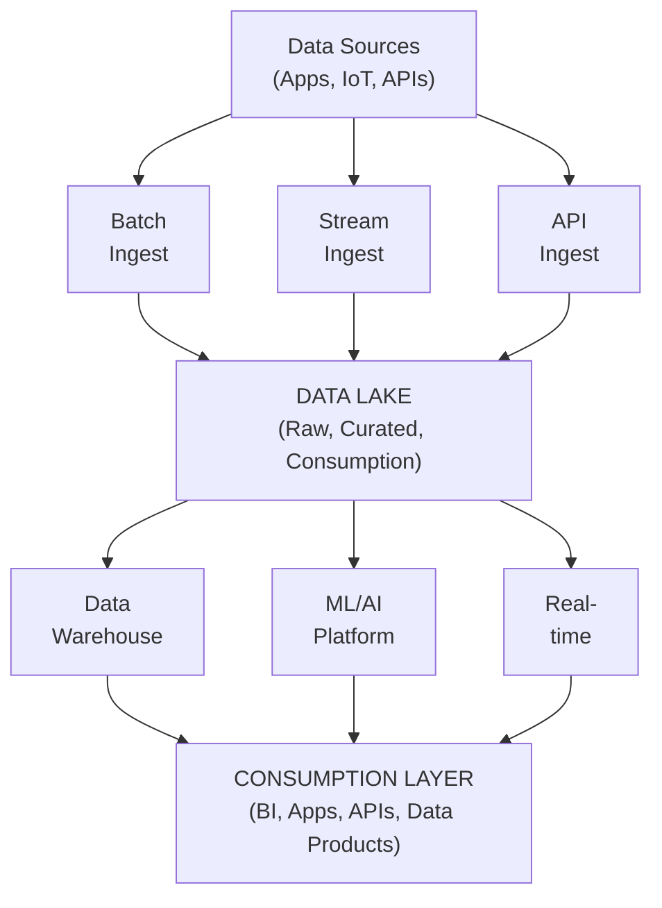

# Cloud Data Platforms - Complete Guide

## AWS, GCP, Azure Data Services Comparison và Best Practices

---

## PHẦN 1: CLOUD DATA PLATFORM OVERVIEW

### 1.1 Why Cloud for Data?

Cloud platforms provide:
- **Scalability**: Scale up/down on demand
- **Cost efficiency**: Pay-per-use model
- **Managed services**: Less operational overhead
- **Global availability**: Multi-region deployment
- **Innovation**: Latest tools and services
- **Security**: Enterprise-grade security

### 1.2 Cloud Platform Comparison

| Category | AWS | GCP | Azure |
|---|---|---|---|
| Market Position | Leader (32%) | Strong in ML/Data (10%) | Enterprise (23%) |
| Strengths | Broadest services, ecosystem | BigQuery, ML/AI, Analytics | Microsoft ecosystem, Hybrid |
| Data Services | Mature, Complete | Innovative, Simple | Integrated Synapse |

### 1.3 Modern Cloud Data Architecture



---

## PHẦN 2: AWS DATA SERVICES

### 2.1 AWS Data Stack Overview

```
AWS Data Services Map:

INGESTION:
- Kinesis Data Streams (real-time streaming)
- Kinesis Firehose (streaming to storage)
- AWS DMS (database migration)
- AWS DataSync (file transfer)
- AWS Glue (ETL)

STORAGE:
- S3 (object storage - data lake foundation)
- S3 Glacier (archive storage)
- EBS (block storage)
- EFS (file storage)

PROCESSING:
- EMR (Spark, Hadoop managed)
- Glue (serverless ETL)
- Lambda (serverless compute)
- Batch (batch computing)

DATA WAREHOUSE:
- Redshift (MPP data warehouse)
- Redshift Serverless
- Redshift Spectrum (query S3)

ANALYTICS:
- Athena (serverless query on S3)
- QuickSight (BI visualization)
- OpenSearch (log analytics)

ML/AI:
- SageMaker (ML platform)
- Comprehend (NLP)
- Rekognition (Computer Vision)

GOVERNANCE:
- Lake Formation (data lake management)
- Glue Data Catalog (metadata)
- IAM (access control)
```

### 2.2 AWS S3 - Data Lake Foundation

```python
import boto3
from botocore.config import Config

# S3 Client setup
s3 = boto3.client('s3', config=Config(
    retries={'max_attempts': 10, 'mode': 'adaptive'}
))

# Create data lake structure
def setup_data_lake(bucket_name: str):
    """Setup data lake with proper structure"""
    
    # Create bucket with encryption
    s3.create_bucket(
        Bucket=bucket_name,
        CreateBucketConfiguration={'LocationConstraint': 'us-west-2'}
    )
    
    # Enable versioning
    s3.put_bucket_versioning(
        Bucket=bucket_name,
        VersioningConfiguration={'Status': 'Enabled'}
    )
    
    # Enable encryption
    s3.put_bucket_encryption(
        Bucket=bucket_name,
        ServerSideEncryptionConfiguration={
            'Rules': [{
                'ApplyServerSideEncryptionByDefault': {
                    'SSEAlgorithm': 'aws:kms',
                    'KMSMasterKeyID': 'alias/data-lake-key'
                },
                'BucketKeyEnabled': True
            }]
        }
    )
    
    # Setup lifecycle rules
    s3.put_bucket_lifecycle_configuration(
        Bucket=bucket_name,
        LifecycleConfiguration={
            'Rules': [
                {
                    'ID': 'TransitionToIA',
                    'Status': 'Enabled',
                    'Filter': {'Prefix': 'raw/'},
                    'Transitions': [
                        {'Days': 30, 'StorageClass': 'STANDARD_IA'},
                        {'Days': 90, 'StorageClass': 'GLACIER'}
                    ]
                },
                {
                    'ID': 'DeleteOldVersions',
                    'Status': 'Enabled',
                    'NoncurrentVersionExpiration': {'NoncurrentDays': 30}
                }
            ]
        }
    )

# S3 Data Lake Layout
"""
s3://data-lake-bucket/
├── raw/                        # Raw data (immutable)
│   ├── source=salesforce/
│   │   └── year=2024/month=01/
│   └── source=postgres/
│       └── table=orders/
├── processed/                  # Cleaned, standardized
│   ├── domain=sales/
│   └── domain=customers/
├── curated/                    # Business-ready
│   ├── fact_sales/
│   └── dim_customers/
└── sandbox/                    # Exploration
    └── user=analyst1/
"""
```

### 2.3 AWS Redshift

```python
import redshift_connector

# Redshift connection
conn = redshift_connector.connect(
    host='cluster.region.redshift.amazonaws.com',
    database='warehouse',
    user='admin',
    password='password',
    port=5439
)

# Create tables with distribution
create_table_sql = """
-- Fact table with KEY distribution
CREATE TABLE fact_sales (
    sale_id BIGINT IDENTITY(1,1),
    customer_id BIGINT NOT NULL,
    product_id BIGINT NOT NULL,
    sale_date DATE NOT NULL SORTKEY,
    amount DECIMAL(18,2),
    quantity INT
)
DISTSTYLE KEY
DISTKEY (customer_id);

-- Dimension table with ALL distribution (small, frequently joined)
CREATE TABLE dim_customer (
    customer_id BIGINT PRIMARY KEY,
    name VARCHAR(200),
    segment VARCHAR(50),
    region VARCHAR(50)
)
DISTSTYLE ALL;

-- Large dimension with KEY distribution
CREATE TABLE dim_product (
    product_id BIGINT PRIMARY KEY DISTKEY,
    name VARCHAR(200),
    category VARCHAR(100) SORTKEY,
    price DECIMAL(10,2)
);
"""

# Query S3 with Spectrum
spectrum_query = """
-- Create external schema
CREATE EXTERNAL SCHEMA spectrum_schema
FROM DATA CATALOG
DATABASE 'glue_database'
IAM_ROLE 'arn:aws:iam::account:role/RedshiftSpectrumRole';

-- Query S3 data directly
SELECT 
    date_trunc('month', sale_date) as month,
    SUM(amount) as revenue
FROM spectrum_schema.raw_sales
WHERE year = 2024
GROUP BY 1;
"""

# COPY command for loading
copy_command = """
COPY fact_sales
FROM 's3://bucket/processed/sales/'
IAM_ROLE 'arn:aws:iam::account:role/RedshiftLoadRole'
FORMAT PARQUET;
"""
```

### 2.4 AWS Glue

```python
import sys
from awsglue.transforms import *
from awsglue.utils import getResolvedOptions
from pyspark.context import SparkContext
from awsglue.context import GlueContext
from awsglue.job import Job

# Glue Job
args = getResolvedOptions(sys.argv, ['JOB_NAME'])
sc = SparkContext()
glueContext = GlueContext(sc)
spark = glueContext.spark_session
job = Job(glueContext)
job.init(args['JOB_NAME'], args)

# Read from Glue Catalog
source_df = glueContext.create_dynamic_frame.from_catalog(
    database="raw_database",
    table_name="orders"
)

# Transform
from awsglue.dynamicframe import DynamicFrame

# Apply mapping
mapped_df = ApplyMapping.apply(
    frame=source_df,
    mappings=[
        ("order_id", "string", "order_id", "long"),
        ("customer_id", "string", "customer_id", "long"),
        ("amount", "string", "amount", "decimal(18,2)"),
        ("order_date", "string", "order_date", "date")
    ]
)

# Filter
filtered_df = Filter.apply(
    frame=mapped_df,
    f=lambda x: x["amount"] is not None and x["amount"] > 0
)

# Write to S3 as Parquet
glueContext.write_dynamic_frame.from_options(
    frame=filtered_df,
    connection_type="s3",
    connection_options={
        "path": "s3://bucket/processed/orders/",
        "partitionKeys": ["year", "month"]
    },
    format="parquet"
)

# Update Glue Catalog
glueContext.write_dynamic_frame.from_catalog(
    frame=filtered_df,
    database="processed_database",
    table_name="orders"
)

job.commit()
```

### 2.5 AWS Athena

```sql
-- Create external table in Athena
CREATE EXTERNAL TABLE IF NOT EXISTS sales (
    sale_id BIGINT,
    customer_id BIGINT,
    product_id BIGINT,
    amount DECIMAL(18,2),
    sale_date DATE
)
PARTITIONED BY (year INT, month INT)
STORED AS PARQUET
LOCATION 's3://bucket/processed/sales/'
TBLPROPERTIES ('parquet.compression'='SNAPPY');

-- Add partitions
MSCK REPAIR TABLE sales;

-- Or manually
ALTER TABLE sales ADD PARTITION (year=2024, month=1)
LOCATION 's3://bucket/processed/sales/year=2024/month=1/';

-- Query with partition pruning
SELECT 
    SUM(amount) as total_revenue,
    COUNT(*) as num_sales
FROM sales
WHERE year = 2024 AND month BETWEEN 1 AND 6;

-- CTAS for materialized views
CREATE TABLE monthly_summary
WITH (
    format = 'PARQUET',
    external_location = 's3://bucket/curated/monthly_summary/',
    partitioned_by = ARRAY['year']
) AS
SELECT 
    year,
    month,
    SUM(amount) as revenue,
    COUNT(DISTINCT customer_id) as unique_customers
FROM sales
GROUP BY year, month;
```

---

## PHẦN 3: GCP DATA SERVICES

### 3.1 GCP Data Stack Overview

```
GCP Data Services Map:

INGESTION:
- Pub/Sub (messaging/streaming)
- Dataflow (streaming/batch ETL)
- Cloud Data Fusion (visual ETL)
- Transfer Service (data migration)

STORAGE:
- Cloud Storage (GCS - object storage)
- BigLake (unified storage)
- Bigtable (wide-column NoSQL)

PROCESSING:
- Dataflow (Apache Beam managed)
- Dataproc (Spark/Hadoop managed)
- Cloud Functions (serverless)

DATA WAREHOUSE:
- BigQuery (serverless DW)
- BigQuery ML (ML in SQL)
- BigQuery BI Engine (fast BI)

ANALYTICS:
- Looker (BI platform)
- Data Studio (dashboards)
- Vertex AI (ML platform)

GOVERNANCE:
- Data Catalog (metadata)
- Dataplex (data fabric)
- IAM + VPC Service Controls
```

### 3.2 BigQuery - Flagship Analytics

```python
from google.cloud import bigquery

client = bigquery.Client()

# Create dataset
dataset_id = f"{client.project}.analytics"
dataset = bigquery.Dataset(dataset_id)
dataset.location = "US"
dataset = client.create_dataset(dataset, exists_ok=True)

# Create table with partitioning and clustering
schema = [
    bigquery.SchemaField("sale_id", "INT64"),
    bigquery.SchemaField("customer_id", "INT64"),
    bigquery.SchemaField("product_id", "INT64"),
    bigquery.SchemaField("sale_date", "DATE"),
    bigquery.SchemaField("amount", "NUMERIC"),
    bigquery.SchemaField("region", "STRING"),
]

table = bigquery.Table(f"{dataset_id}.fact_sales", schema=schema)
table.time_partitioning = bigquery.TimePartitioning(
    type_=bigquery.TimePartitioningType.DAY,
    field="sale_date"
)
table.clustering_fields = ["region", "customer_id"]

table = client.create_table(table, exists_ok=True)

# Load data from GCS
job_config = bigquery.LoadJobConfig(
    source_format=bigquery.SourceFormat.PARQUET,
    write_disposition=bigquery.WriteDisposition.WRITE_APPEND,
)

uri = "gs://bucket/processed/sales/*.parquet"
load_job = client.load_table_from_uri(uri, table, job_config=job_config)
load_job.result()

# Query with cost control
query = """
SELECT 
    DATE_TRUNC(sale_date, MONTH) as month,
    region,
    SUM(amount) as revenue,
    COUNT(*) as num_sales
FROM `project.analytics.fact_sales`
WHERE sale_date BETWEEN '2024-01-01' AND '2024-06-30'
GROUP BY 1, 2
ORDER BY 1, 2
"""

# Dry run to estimate cost
job_config = bigquery.QueryJobConfig(dry_run=True, use_query_cache=False)
dry_run_job = client.query(query, job_config=job_config)
print(f"Query will process {dry_run_job.total_bytes_processed / 1e9:.2f} GB")

# Execute query
query_job = client.query(query)
df = query_job.to_dataframe()
```

```sql
-- BigQuery SQL features

-- Partitioned table
CREATE TABLE analytics.sales
PARTITION BY DATE(sale_date)
CLUSTER BY customer_id, product_id
AS
SELECT * FROM staging.raw_sales;

-- External table (query GCS directly)
CREATE EXTERNAL TABLE analytics.external_logs
OPTIONS (
    format = 'PARQUET',
    uris = ['gs://bucket/logs/*.parquet']
);

-- Materialized view
CREATE MATERIALIZED VIEW analytics.daily_summary
PARTITION BY sale_date
CLUSTER BY region
AS
SELECT 
    sale_date,
    region,
    SUM(amount) as revenue,
    COUNT(*) as transactions
FROM analytics.sales
GROUP BY 1, 2;

-- BigQuery ML
CREATE OR REPLACE MODEL analytics.customer_ltv
OPTIONS(
    model_type='BOOSTED_TREE_REGRESSOR',
    input_label_cols=['lifetime_value']
) AS
SELECT 
    customer_id,
    total_purchases,
    avg_order_value,
    days_since_first_purchase,
    lifetime_value
FROM analytics.customer_features;

-- Predict
SELECT 
    customer_id,
    predicted_lifetime_value
FROM ML.PREDICT(MODEL analytics.customer_ltv,
    (SELECT * FROM analytics.new_customers));
```

### 3.3 Dataflow (Apache Beam)

```python
import apache_beam as beam
from apache_beam.options.pipeline_options import PipelineOptions

# Dataflow pipeline
options = PipelineOptions([
    '--project=my-project',
    '--region=us-central1',
    '--runner=DataflowRunner',
    '--temp_location=gs://bucket/temp/',
    '--staging_location=gs://bucket/staging/',
    '--job_name=sales-etl',
    '--max_num_workers=10'
])

class ParseSale(beam.DoFn):
    def process(self, element):
        import json
        record = json.loads(element)
        yield {
            'sale_id': record['id'],
            'customer_id': record['customer']['id'],
            'amount': float(record['total']),
            'sale_date': record['date']
        }

class FilterValid(beam.DoFn):
    def process(self, element):
        if element['amount'] > 0:
            yield element

with beam.Pipeline(options=options) as p:
    # Read from Pub/Sub
    raw = (p 
        | 'ReadPubSub' >> beam.io.ReadFromPubSub(
            subscription='projects/project/subscriptions/sales-sub'
        )
        | 'Parse' >> beam.ParDo(ParseSale())
        | 'Filter' >> beam.ParDo(FilterValid())
    )
    
    # Write to BigQuery
    raw | 'WriteBQ' >> beam.io.WriteToBigQuery(
        'project:analytics.sales',
        schema='sale_id:INT64,customer_id:INT64,amount:FLOAT,sale_date:DATE',
        write_disposition=beam.io.BigQueryDisposition.WRITE_APPEND,
        create_disposition=beam.io.BigQueryDisposition.CREATE_IF_NEEDED
    )
    
    # Write to GCS for backup
    raw | 'ToJson' >> beam.Map(json.dumps) \
        | 'WriteGCS' >> beam.io.WriteToText(
            'gs://bucket/backup/sales',
            file_name_suffix='.json'
        )
```

### 3.4 Dataproc (Managed Spark)

```python
from google.cloud import dataproc_v1

# Create cluster
cluster_client = dataproc_v1.ClusterControllerClient(
    client_options={"api_endpoint": "us-central1-dataproc.googleapis.com:443"}
)

cluster_config = {
    "project_id": "my-project",
    "cluster_name": "spark-cluster",
    "config": {
        "master_config": {
            "num_instances": 1,
            "machine_type_uri": "n1-standard-4",
            "disk_config": {"boot_disk_size_gb": 500}
        },
        "worker_config": {
            "num_instances": 2,
            "machine_type_uri": "n1-standard-4",
            "disk_config": {"boot_disk_size_gb": 500}
        },
        "software_config": {
            "image_version": "2.0-debian10",
            "optional_components": ["JUPYTER", "DOCKER"]
        },
        "gce_cluster_config": {
            "subnetwork_uri": "regions/us-central1/subnetworks/default"
        }
    }
}

operation = cluster_client.create_cluster(
    request={
        "project_id": "my-project",
        "region": "us-central1",
        "cluster": cluster_config
    }
)
cluster = operation.result()

# Submit Spark job
job_client = dataproc_v1.JobControllerClient(
    client_options={"api_endpoint": "us-central1-dataproc.googleapis.com:443"}
)

job = {
    "placement": {"cluster_name": "spark-cluster"},
    "pyspark_job": {
        "main_python_file_uri": "gs://bucket/jobs/etl_job.py",
        "python_file_uris": ["gs://bucket/libs/utils.py"],
        "args": ["--date", "2024-01-01"],
        "properties": {
            "spark.executor.memory": "4g",
            "spark.executor.cores": "2"
        }
    }
}

operation = job_client.submit_job_as_operation(
    request={
        "project_id": "my-project",
        "region": "us-central1",
        "job": job
    }
)
response = operation.result()
```

---

## PHẦN 4: AZURE DATA SERVICES

### 4.1 Azure Data Stack Overview

```
Azure Data Services Map:

INGESTION:
- Event Hubs (streaming ingestion)
- IoT Hub (IoT data)
- Data Factory (ETL/ELT orchestration)
- Azure Stream Analytics

STORAGE:
- Azure Data Lake Storage Gen2 (ADLS)
- Azure Blob Storage
- Azure Files

PROCESSING:
- Azure Databricks (Spark managed)
- HDInsight (Hadoop ecosystem)
- Azure Functions (serverless)

DATA WAREHOUSE:
- Azure Synapse Analytics (unified)
  - Dedicated SQL Pool
  - Serverless SQL Pool
  - Spark Pool

ANALYTICS:
- Power BI (BI platform)
- Azure Analysis Services
- Azure Purview (governance)

GOVERNANCE:
- Purview (data catalog + lineage)
- Azure Active Directory
- Key Vault (secrets)
```

### 4.2 Azure Synapse Analytics

```python
from azure.synapse.artifacts import ArtifactsClient
from azure.identity import DefaultAzureCredential

# Synapse connection
credential = DefaultAzureCredential()
client = ArtifactsClient(
    credential=credential,
    endpoint="https://workspace.dev.azuresynapse.net"
)

# SQL queries via pyodbc
import pyodbc

conn = pyodbc.connect(
    'DRIVER={ODBC Driver 17 for SQL Server};'
    'SERVER=workspace.sql.azuresynapse.net;'
    'DATABASE=sqlpool;'
    'UID=admin;PWD=password;'
    'Authentication=ActiveDirectoryPassword;'
)

# Create table in Dedicated SQL Pool
create_table = """
CREATE TABLE dbo.fact_sales
WITH (
    DISTRIBUTION = HASH(customer_id),
    CLUSTERED COLUMNSTORE INDEX,
    PARTITION (sale_date RANGE RIGHT FOR VALUES 
        ('2024-01-01', '2024-04-01', '2024-07-01', '2024-10-01'))
)
AS
SELECT 
    sale_id,
    customer_id,
    product_id,
    sale_date,
    amount
FROM staging.raw_sales;
"""

# Query external data with OPENROWSET
query_external = """
SELECT 
    result.filepath(1) as year,
    result.filepath(2) as month,
    COUNT(*) as record_count
FROM OPENROWSET(
    BULK 'https://storage.blob.core.windows.net/datalake/sales/year=*/month=*/*.parquet',
    FORMAT = 'PARQUET'
) AS result
GROUP BY result.filepath(1), result.filepath(2);
"""

# Create external table
create_external = """
CREATE EXTERNAL DATA SOURCE DataLake
WITH (
    LOCATION = 'abfss://datalake@storage.dfs.core.windows.net'
);

CREATE EXTERNAL FILE FORMAT ParquetFormat
WITH (
    FORMAT_TYPE = PARQUET,
    DATA_COMPRESSION = 'org.apache.hadoop.io.compress.SnappyCodec'
);

CREATE EXTERNAL TABLE dbo.external_sales (
    sale_id BIGINT,
    customer_id BIGINT,
    amount DECIMAL(18,2),
    sale_date DATE
)
WITH (
    LOCATION = '/processed/sales/',
    DATA_SOURCE = DataLake,
    FILE_FORMAT = ParquetFormat
);
"""
```

### 4.3 Azure Data Factory

```python
from azure.identity import DefaultAzureCredential
from azure.mgmt.datafactory import DataFactoryManagementClient
from azure.mgmt.datafactory.models import *

credential = DefaultAzureCredential()
adf_client = DataFactoryManagementClient(credential, subscription_id)

# Create linked service (connection)
storage_linked_service = LinkedServiceResource(
    properties=AzureBlobStorageLinkedService(
        connection_string=SecureString(
            value="DefaultEndpointsProtocol=https;..."
        )
    )
)

adf_client.linked_services.create_or_update(
    resource_group, factory_name, "AzureStorageLinkedService",
    storage_linked_service
)

# Create dataset
dataset = DatasetResource(
    properties=ParquetDataset(
        linked_service_name=LinkedServiceReference(
            reference_name="AzureStorageLinkedService"
        ),
        location=AzureBlobStorageLocation(
            container="datalake",
            folder_path="processed/sales"
        )
    )
)

adf_client.datasets.create_or_update(
    resource_group, factory_name, "SalesDataset", dataset
)

# Create pipeline
pipeline = PipelineResource(
    activities=[
        CopyActivity(
            name="CopySalesData",
            inputs=[DatasetReference(reference_name="SourceDataset")],
            outputs=[DatasetReference(reference_name="SalesDataset")],
            source=ParquetSource(),
            sink=ParquetSink()
        ),
        DatabricksNotebookActivity(
            name="TransformData",
            notebook_path="/Shared/transform_sales",
            linked_service_name=LinkedServiceReference(
                reference_name="DatabricksLinkedService"
            ),
            depends_on=[
                ActivityDependency(
                    activity="CopySalesData",
                    dependency_conditions=["Succeeded"]
                )
            ]
        )
    ]
)

adf_client.pipelines.create_or_update(
    resource_group, factory_name, "SalesPipeline", pipeline
)

# Trigger pipeline
run_response = adf_client.pipelines.create_run(
    resource_group, factory_name, "SalesPipeline"
)
```

### 4.4 Azure Databricks

```python
# Databricks notebook for Azure

# Mount ADLS Gen2
configs = {
    "fs.azure.account.auth.type": "OAuth",
    "fs.azure.account.oauth.provider.type": 
        "org.apache.hadoop.fs.azurebfs.oauth2.ClientCredsTokenProvider",
    "fs.azure.account.oauth2.client.id": dbutils.secrets.get("scope", "client-id"),
    "fs.azure.account.oauth2.client.secret": dbutils.secrets.get("scope", "client-secret"),
    "fs.azure.account.oauth2.client.endpoint": 
        "https://login.microsoftonline.com/{tenant}/oauth2/token"
}

dbutils.fs.mount(
    source="abfss://datalake@storage.dfs.core.windows.net/",
    mount_point="/mnt/datalake",
    extra_configs=configs
)

# Read data
df = spark.read.parquet("/mnt/datalake/raw/sales/")

# Transform
from pyspark.sql.functions import *

processed = df \
    .filter(col("amount") > 0) \
    .withColumn("year", year("sale_date")) \
    .withColumn("month", month("sale_date"))

# Write as Delta table
processed.write \
    .format("delta") \
    .mode("overwrite") \
    .partitionBy("year", "month") \
    .save("/mnt/datalake/processed/sales_delta")

# Create Delta table in metastore
spark.sql("""
    CREATE TABLE IF NOT EXISTS sales_delta
    USING DELTA
    LOCATION '/mnt/datalake/processed/sales_delta'
""")

# Query with SQL
spark.sql("""
    SELECT year, month, SUM(amount) as revenue
    FROM sales_delta
    WHERE year = 2024
    GROUP BY year, month
    ORDER BY year, month
""").show()
```

---

## PHẦN 5: CROSS-CLOUD COMPARISON

### 5.1 Service Mapping

```
Data Warehouse:
- AWS: Redshift
- GCP: BigQuery
- Azure: Synapse Dedicated SQL Pool

Serverless Query:
- AWS: Athena
- GCP: BigQuery
- Azure: Synapse Serverless SQL

Object Storage:
- AWS: S3
- GCP: Cloud Storage
- Azure: ADLS Gen2

Stream Processing:
- AWS: Kinesis
- GCP: Pub/Sub + Dataflow
- Azure: Event Hubs + Stream Analytics

ETL/Orchestration:
- AWS: Glue + Step Functions
- GCP: Dataflow + Cloud Composer
- Azure: Data Factory + Synapse Pipelines

Managed Spark:
- AWS: EMR
- GCP: Dataproc
- Azure: Databricks / HDInsight

Data Catalog:
- AWS: Glue Data Catalog + Lake Formation
- GCP: Data Catalog + Dataplex
- Azure: Purview

BI Tools:
- AWS: QuickSight
- GCP: Looker
- Azure: Power BI
```

### 5.2 Pricing Comparison

```
STORAGE (per GB/month):
- AWS S3 Standard: $0.023
- GCP Cloud Storage Standard: $0.020
- Azure Blob Hot: $0.0184

DATA WAREHOUSE (per TB scanned):
- AWS Redshift: Compute-based pricing
- GCP BigQuery: $5.00 per TB (on-demand)
- Azure Synapse Serverless: $5.00 per TB

COMPUTE (per hour, similar specs):
- AWS EMR (m5.xlarge): ~$0.192
- GCP Dataproc (n1-standard-4): ~$0.19
- Azure HDInsight (D4 v3): ~$0.22

Notes:
- Committed use discounts available (30-70% off)
- Reserved capacity cheaper than on-demand
- Egress costs vary significantly
- Always use pricing calculator for accurate estimates
```

### 5.3 Feature Comparison

```
Serverless Data Warehouse:

BigQuery (GCP):
+ True serverless (no cluster management)
+ Fastest at scale
+ Built-in ML (BQML)
+ Simple pricing (per TB scanned)
- Less control over performance

Redshift Serverless (AWS):
+ PostgreSQL compatible
+ Integration with AWS ecosystem
+ Good for variable workloads
- Newer, less mature

Synapse Serverless (Azure):
+ Query external data easily
+ T-SQL compatible
+ Good Power BI integration
- Limited compared to dedicated pool


Stream Processing:

Kinesis (AWS):
+ Tightly integrated with AWS
+ Simple for basic use cases
- Less flexible than Kafka
- Sharding complexity

Pub/Sub + Dataflow (GCP):
+ True serverless
+ Apache Beam portability
+ Global scale
- Learning curve

Event Hubs + Stream Analytics (Azure):
+ Good Azure integration
+ SQL-like query language
+ Kafka compatible mode
- Less flexible transformations
```

---

## PHẦN 6: MULTI-CLOUD STRATEGIES

### 6.1 When to Go Multi-Cloud

```
Reasons FOR Multi-Cloud:
- Avoid vendor lock-in
- Leverage best-of-breed services
- Regulatory requirements (data residency)
- M&A with different cloud footprints
- Disaster recovery

Reasons AGAINST Multi-Cloud:
- Increased complexity
- Higher operational costs
- Integration challenges
- Skill fragmentation
- Data transfer costs

Hybrid Approach:
- Primary cloud for main workloads
- Secondary cloud for specific services
- Example: AWS for infra + BigQuery for analytics
```

### 6.2 Cross-Cloud Data Patterns

```python
# Cross-cloud data transfer example

# AWS S3 to GCP BigQuery
from google.cloud import bigquery_datatransfer

transfer_client = bigquery_datatransfer.DataTransferServiceClient()

# Create S3 to BigQuery transfer
transfer_config = {
    "destination_dataset_id": "imported_data",
    "display_name": "S3 Import",
    "data_source_id": "amazon_s3",
    "params": {
        "destination_table_name_template": "sales_{run_date}",
        "data_path": "s3://bucket/sales/",
        "access_key_id": "ACCESS_KEY",
        "secret_access_key": "SECRET_KEY",
        "file_format": "PARQUET"
    },
    "schedule": "every 24 hours"
}

parent = f"projects/{project_id}/locations/us"
response = transfer_client.create_transfer_config(
    parent=parent,
    transfer_config=transfer_config
)


# Using Apache Iceberg for cross-cloud compatibility
from pyiceberg.catalog import load_catalog

# Configure Iceberg with multiple cloud storage
catalog = load_catalog(
    "my_catalog",
    **{
        "type": "rest",
        "uri": "http://iceberg-rest-catalog:8181",
        "s3.endpoint": "s3.amazonaws.com",
        "gcs.project-id": "my-gcp-project"
    }
)

# Write once, read anywhere
table = catalog.load_table("db.sales")
# Can be read from AWS, GCP, or Azure
```

### 6.3 Portable Data Formats

```python
# Apache Iceberg for cloud portability
from pyspark.sql import SparkSession

spark = SparkSession.builder \
    .config("spark.sql.extensions", 
            "org.apache.iceberg.spark.extensions.IcebergSparkSessionExtensions") \
    .config("spark.sql.catalog.iceberg", 
            "org.apache.iceberg.spark.SparkCatalog") \
    .config("spark.sql.catalog.iceberg.type", "hadoop") \
    .config("spark.sql.catalog.iceberg.warehouse", "s3://bucket/iceberg/") \
    .getOrCreate()

# Create portable table
spark.sql("""
    CREATE TABLE iceberg.sales (
        sale_id BIGINT,
        customer_id BIGINT,
        amount DECIMAL(18,2),
        sale_date DATE
    )
    USING iceberg
    PARTITIONED BY (months(sale_date))
""")

# Same table can be read by:
# - AWS EMR
# - GCP Dataproc
# - Azure Databricks
# - Any Iceberg-compatible engine
```

---

## PHẦN 7: BEST PRACTICES

### 7.1 Cloud Data Architecture Principles

```
1. DESIGN FOR SCALE
   - Start with scalable services
   - Partition data appropriately
   - Use managed services when possible

2. OPTIMIZE FOR COST
   - Use appropriate storage tiers
   - Leverage spot/preemptible instances
   - Monitor and set budgets
   - Shutdown unused resources

3. ENSURE SECURITY
   - Encrypt at rest and in transit
   - Implement least privilege
   - Use private endpoints
   - Audit and monitor access

4. BUILD FOR RESILIENCE
   - Multi-AZ deployments
   - Backup strategies
   - Disaster recovery plans
   - Test failover regularly

5. ENABLE GOVERNANCE
   - Data catalog
   - Lineage tracking
   - Quality monitoring
   - Compliance controls
```

### 7.2 Cost Optimization Checklist

```
STORAGE:
□ Use appropriate storage class/tier
□ Implement lifecycle policies
□ Compress data (Parquet, ORC)
□ Delete unused data
□ Monitor storage growth

COMPUTE:
□ Right-size instances
□ Use auto-scaling
□ Leverage spot/preemptible (70% savings)
□ Schedule non-prod shutdown
□ Use serverless where appropriate

QUERY:
□ Partition tables properly
□ Use columnar formats
□ Implement caching
□ Optimize query patterns
□ Monitor query costs

NETWORK:
□ Minimize cross-region transfer
□ Use VPC endpoints
□ Compress data in transit
□ Consider data locality
□ Batch transfers when possible
```

### 7.3 Migration Strategy

```
MIGRATION PHASES:

Phase 1: ASSESS
- Inventory current data assets
- Map dependencies
- Identify migration candidates
- Estimate costs

Phase 2: PLAN
- Choose target architecture
- Design migration approach
- Create timeline
- Identify risks

Phase 3: PILOT
- Migrate non-critical workloads
- Validate functionality
- Measure performance
- Refine approach

Phase 4: MIGRATE
- Execute migration waves
- Maintain parallel running
- Validate data quality
- Monitor performance

Phase 5: OPTIMIZE
- Fine-tune configurations
- Implement cost controls
- Enable advanced features
- Decommission old systems
```

---

*Document Version: 1.0*
*Last Updated: February 2026*
*Coverage: AWS, GCP, Azure Data Services, Multi-cloud Strategies*
