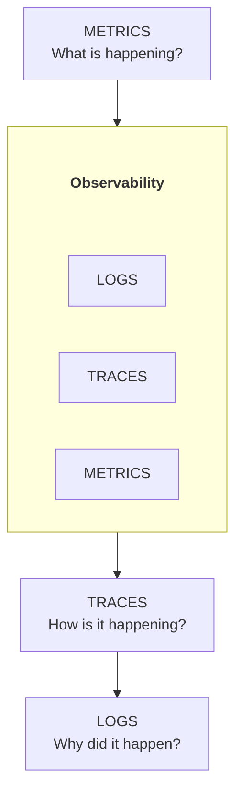
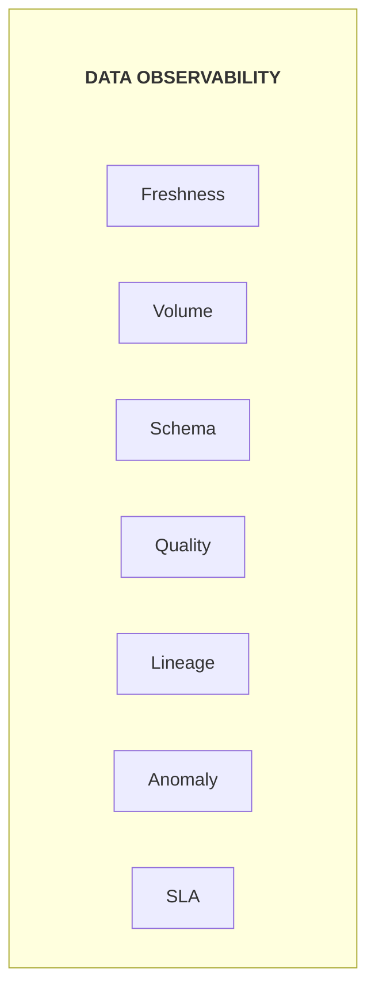
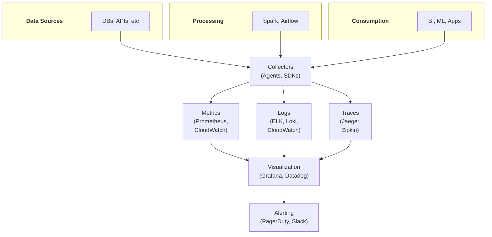

# Monitoring & Observability - Complete Guide

## Pipeline Monitoring, Alerting, Debugging, và Operational Excellence

---

## PHẦN 1: OBSERVABILITY FUNDAMENTALS

### 1.1 What is Data Observability?

Data Observability mở rộng từ software observability để monitor:
- **Data quality**: Accuracy, completeness, consistency
- **Data freshness**: Is data arriving on time?
- **Data volume**: Expected amounts of data
- **Schema**: Structure changes
- **Lineage**: Data flow and dependencies

### 1.2 Three Pillars of Observability

**TRADITIONAL SOFTWARE OBSERVABILITY:**



**DATA OBSERVABILITY EXTENSIONS:**



### 1.3 Observability Architecture



---

## PHẦN 2: METRICS

### 2.1 Key Data Pipeline Metrics

```
PIPELINE HEALTH METRICS:
- Pipeline success rate
- Pipeline duration
- Task failure rate
- Retry count
- Queue depth

DATA QUALITY METRICS:
- Null rate per column
- Duplicate count
- Constraint violations
- Quality score (composite)

FRESHNESS METRICS:
- Time since last update
- SLA breach count
- Processing lag
- End-to-end latency

VOLUME METRICS:
- Row count per run
- Byte size processed
- Records per second
- Growth rate

RESOURCE METRICS:
- CPU utilization
- Memory usage
- Disk I/O
- Network throughput
```

### 2.2 Prometheus Metrics Implementation

```python
from prometheus_client import Counter, Gauge, Histogram, Summary
from prometheus_client import start_http_server
import time

# Define metrics
PIPELINE_RUNS = Counter(
    'data_pipeline_runs_total',
    'Total number of pipeline runs',
    ['pipeline_name', 'status']
)

PIPELINE_DURATION = Histogram(
    'data_pipeline_duration_seconds',
    'Pipeline execution duration',
    ['pipeline_name'],
    buckets=[60, 300, 600, 1800, 3600, 7200]
)

ROWS_PROCESSED = Counter(
    'data_pipeline_rows_processed_total',
    'Total rows processed',
    ['pipeline_name', 'table_name']
)

DATA_FRESHNESS = Gauge(
    'data_freshness_seconds',
    'Seconds since last data update',
    ['table_name']
)

QUALITY_SCORE = Gauge(
    'data_quality_score',
    'Data quality score (0-1)',
    ['table_name']
)

NULL_RATE = Gauge(
    'data_null_rate',
    'Null rate per column',
    ['table_name', 'column_name']
)


class PipelineMonitor:
    def __init__(self, pipeline_name: str):
        self.pipeline_name = pipeline_name
        self.start_time = None
    
    def start(self):
        self.start_time = time.time()
    
    def success(self, rows_processed: int = 0, table_name: str = "default"):
        duration = time.time() - self.start_time
        
        PIPELINE_RUNS.labels(
            pipeline_name=self.pipeline_name,
            status='success'
        ).inc()
        
        PIPELINE_DURATION.labels(
            pipeline_name=self.pipeline_name
        ).observe(duration)
        
        ROWS_PROCESSED.labels(
            pipeline_name=self.pipeline_name,
            table_name=table_name
        ).inc(rows_processed)
    
    def failure(self, error: str = None):
        PIPELINE_RUNS.labels(
            pipeline_name=self.pipeline_name,
            status='failure'
        ).inc()
    
    @staticmethod
    def record_freshness(table_name: str, last_update_time: float):
        freshness = time.time() - last_update_time
        DATA_FRESHNESS.labels(table_name=table_name).set(freshness)
    
    @staticmethod
    def record_quality(table_name: str, score: float):
        QUALITY_SCORE.labels(table_name=table_name).set(score)
    
    @staticmethod
    def record_null_rate(table_name: str, column_name: str, rate: float):
        NULL_RATE.labels(
            table_name=table_name,
            column_name=column_name
        ).set(rate)


# Usage
if __name__ == '__main__':
    # Start Prometheus HTTP server
    start_http_server(8000)
    
    monitor = PipelineMonitor("sales_pipeline")
    
    try:
        monitor.start()
        
        # Run pipeline
        result = run_pipeline()
        
        monitor.success(
            rows_processed=result['row_count'],
            table_name='fact_sales'
        )
        
        # Record quality metrics
        monitor.record_freshness('fact_sales', result['max_timestamp'])
        monitor.record_quality('fact_sales', result['quality_score'])
        
    except Exception as e:
        monitor.failure(str(e))
        raise
```

### 2.3 CloudWatch Metrics (AWS)

```python
import boto3
from datetime import datetime

class CloudWatchMetrics:
    def __init__(self, namespace: str = "DataPlatform"):
        self.client = boto3.client('cloudwatch')
        self.namespace = namespace
    
    def put_metric(self, metric_name: str, value: float, 
                   dimensions: list = None, unit: str = 'Count'):
        self.client.put_metric_data(
            Namespace=self.namespace,
            MetricData=[{
                'MetricName': metric_name,
                'Value': value,
                'Unit': unit,
                'Timestamp': datetime.utcnow(),
                'Dimensions': dimensions or []
            }]
        )
    
    def record_pipeline_run(self, pipeline_name: str, 
                           duration_seconds: float,
                           rows_processed: int,
                           success: bool):
        dimensions = [{'Name': 'Pipeline', 'Value': pipeline_name}]
        
        # Duration metric
        self.put_metric(
            'PipelineDuration',
            duration_seconds,
            dimensions,
            'Seconds'
        )
        
        # Row count metric
        self.put_metric(
            'RowsProcessed',
            rows_processed,
            dimensions,
            'Count'
        )
        
        # Success/Failure metric
        self.put_metric(
            'PipelineSuccess' if success else 'PipelineFailure',
            1,
            dimensions,
            'Count'
        )
    
    def record_data_quality(self, table_name: str, metrics: dict):
        dimensions = [{'Name': 'Table', 'Value': table_name}]
        
        for metric_name, value in metrics.items():
            self.put_metric(metric_name, value, dimensions, 'None')


# CloudWatch Alarm setup
def create_pipeline_alarms(pipeline_name: str):
    client = boto3.client('cloudwatch')
    
    # Alarm for pipeline failures
    client.put_metric_alarm(
        AlarmName=f'{pipeline_name}-failure-alarm',
        ComparisonOperator='GreaterThanThreshold',
        EvaluationPeriods=1,
        MetricName='PipelineFailure',
        Namespace='DataPlatform',
        Period=300,
        Statistic='Sum',
        Threshold=0,
        ActionsEnabled=True,
        AlarmActions=['arn:aws:sns:region:account:alert-topic'],
        Dimensions=[{'Name': 'Pipeline', 'Value': pipeline_name}]
    )
    
    # Alarm for duration anomaly
    client.put_metric_alarm(
        AlarmName=f'{pipeline_name}-duration-alarm',
        ComparisonOperator='GreaterThanThreshold',
        EvaluationPeriods=1,
        MetricName='PipelineDuration',
        Namespace='DataPlatform',
        Period=300,
        Statistic='Maximum',
        Threshold=3600,  # 1 hour
        ActionsEnabled=True,
        AlarmActions=['arn:aws:sns:region:account:alert-topic'],
        Dimensions=[{'Name': 'Pipeline', 'Value': pipeline_name}]
    )
```

---

## PHẦN 3: LOGGING

### 3.1 Structured Logging

```python
import logging
import json
from datetime import datetime
from typing import Any, Dict
import traceback

class StructuredLogger:
    def __init__(self, name: str, context: Dict[str, Any] = None):
        self.logger = logging.getLogger(name)
        self.context = context or {}
    
    def _format_message(self, level: str, message: str, 
                        extra: Dict[str, Any] = None) -> str:
        log_entry = {
            "timestamp": datetime.utcnow().isoformat(),
            "level": level,
            "logger": self.logger.name,
            "message": message,
            **self.context,
            **(extra or {})
        }
        return json.dumps(log_entry)
    
    def info(self, message: str, **kwargs):
        self.logger.info(self._format_message("INFO", message, kwargs))
    
    def warning(self, message: str, **kwargs):
        self.logger.warning(self._format_message("WARNING", message, kwargs))
    
    def error(self, message: str, exception: Exception = None, **kwargs):
        extra = kwargs.copy()
        if exception:
            extra["exception"] = str(exception)
            extra["traceback"] = traceback.format_exc()
        self.logger.error(self._format_message("ERROR", message, extra))
    
    def metric(self, metric_name: str, value: float, **kwargs):
        """Log a metric as a structured log"""
        extra = {
            "metric_name": metric_name,
            "metric_value": value,
            **kwargs
        }
        self.logger.info(self._format_message("METRIC", f"{metric_name}={value}", extra))
    
    def with_context(self, **kwargs) -> 'StructuredLogger':
        """Create a new logger with additional context"""
        new_context = {**self.context, **kwargs}
        return StructuredLogger(self.logger.name, new_context)


# Usage
logger = StructuredLogger("sales_pipeline", context={
    "environment": "production",
    "version": "1.2.3"
})

# Add run-specific context
run_logger = logger.with_context(
    run_id="run-123",
    dag_id="sales_daily"
)

run_logger.info("Pipeline started", table="fact_sales")

try:
    result = process_data()
    run_logger.metric("rows_processed", result['row_count'], table="fact_sales")
    run_logger.info("Pipeline completed successfully")
except Exception as e:
    run_logger.error("Pipeline failed", exception=e, step="transform")
    raise
```

### 3.2 Centralized Logging với ELK

```python
from elasticsearch import Elasticsearch
from datetime import datetime
import logging

class ElasticsearchHandler(logging.Handler):
    def __init__(self, es_host: str, index_prefix: str = "logs"):
        super().__init__()
        self.es = Elasticsearch([es_host])
        self.index_prefix = index_prefix
    
    def emit(self, record):
        try:
            # Create index name with date
            index_name = f"{self.index_prefix}-{datetime.utcnow().strftime('%Y.%m.%d')}"
            
            # Parse structured log if JSON
            try:
                doc = json.loads(self.format(record))
            except json.JSONDecodeError:
                doc = {
                    "message": self.format(record),
                    "level": record.levelname
                }
            
            doc["@timestamp"] = datetime.utcnow().isoformat()
            
            self.es.index(index=index_name, document=doc)
            
        except Exception as e:
            self.handleError(record)


# Configure logging
def setup_logging():
    root_logger = logging.getLogger()
    root_logger.setLevel(logging.INFO)
    
    # Console handler
    console = logging.StreamHandler()
    console.setFormatter(logging.Formatter('%(message)s'))
    root_logger.addHandler(console)
    
    # Elasticsearch handler
    es_handler = ElasticsearchHandler(
        es_host="http://elasticsearch:9200",
        index_prefix="data-pipeline"
    )
    root_logger.addHandler(es_handler)


# Kibana query examples for data pipeline logs:
"""
# Find all pipeline failures
level: "ERROR" AND logger: "*_pipeline"

# Find slow pipelines
metric_name: "duration" AND metric_value: > 3600

# Find specific run
run_id: "run-123"

# Find data quality issues
message: "quality" AND metric_value: < 0.9
"""
```

### 3.3 Log Aggregation Queries

```python
# Loki/LogQL queries for Grafana

# Pipeline errors in last hour
loki_queries = {
    "errors_last_hour": '''
        {job="data-pipeline"} |= "ERROR" 
        | json 
        | level = "ERROR"
    ''',
    
    "pipeline_duration": '''
        {job="data-pipeline"} 
        | json 
        | metric_name = "duration"
        | line_format "{{.pipeline}} {{.metric_value}}"
    ''',
    
    "failed_tasks": '''
        {job="airflow"} 
        | json 
        | state = "failed"
        | line_format "{{.dag_id}}/{{.task_id}}"
    ''',
    
    "data_quality_issues": '''
        {job="data-pipeline"} 
        | json 
        | message =~ "quality.*fail"
    '''
}
```

---

## PHẦN 4: ALERTING

### 4.1 Alert Strategy

```
ALERT SEVERITY LEVELS:

P1 (Critical):
- Production pipeline down
- Data corruption detected
- SLA breach imminent
- Action: Page on-call, immediate response

P2 (High):
- Pipeline failing repeatedly
- Significant data quality drop
- Resource exhaustion
- Action: Alert team, respond within 1 hour

P3 (Medium):
- Single pipeline failure
- Minor quality degradation
- Performance degradation
- Action: Notify team, respond within 4 hours

P4 (Low):
- Warnings/informational
- Non-critical anomalies
- Action: Log for review, batch notifications


ALERT FATIGUE PREVENTION:
- Group related alerts
- Use proper thresholds
- Implement alert deduplication
- Regular alert review/cleanup
- Actionable alerts only
```

### 4.2 Alerting Implementation

```python
from dataclasses import dataclass
from enum import Enum
from typing import List, Optional
import requests

class Severity(Enum):
    CRITICAL = "critical"
    HIGH = "high"
    MEDIUM = "medium"
    LOW = "low"

@dataclass
class Alert:
    name: str
    message: str
    severity: Severity
    source: str
    details: dict = None
    runbook_url: Optional[str] = None

class AlertManager:
    def __init__(self, config: dict):
        self.config = config
        self.slack_webhook = config.get('slack_webhook')
        self.pagerduty_key = config.get('pagerduty_key')
    
    def send(self, alert: Alert):
        """Route alert based on severity"""
        if alert.severity == Severity.CRITICAL:
            self._page_oncall(alert)
            self._send_slack(alert, channel="#critical-alerts")
        elif alert.severity == Severity.HIGH:
            self._send_slack(alert, channel="#data-alerts")
            self._create_incident(alert)
        elif alert.severity == Severity.MEDIUM:
            self._send_slack(alert, channel="#data-alerts")
        else:
            self._send_slack(alert, channel="#data-info")
    
    def _send_slack(self, alert: Alert, channel: str):
        emoji = {
            Severity.CRITICAL: "🔴",
            Severity.HIGH: "🟠",
            Severity.MEDIUM: "🟡",
            Severity.LOW: "🔵"
        }
        
        blocks = [
            {
                "type": "header",
                "text": {
                    "type": "plain_text",
                    "text": f"{emoji[alert.severity]} {alert.name}"
                }
            },
            {
                "type": "section",
                "text": {
                    "type": "mrkdwn",
                    "text": alert.message
                }
            },
            {
                "type": "context",
                "elements": [
                    {
                        "type": "mrkdwn",
                        "text": f"*Source:* {alert.source} | *Severity:* {alert.severity.value}"
                    }
                ]
            }
        ]
        
        if alert.runbook_url:
            blocks.append({
                "type": "actions",
                "elements": [{
                    "type": "button",
                    "text": {"type": "plain_text", "text": "📖 Runbook"},
                    "url": alert.runbook_url
                }]
            })
        
        requests.post(self.slack_webhook, json={
            "channel": channel,
            "blocks": blocks
        })
    
    def _page_oncall(self, alert: Alert):
        """Send PagerDuty alert"""
        requests.post(
            "https://events.pagerduty.com/v2/enqueue",
            json={
                "routing_key": self.pagerduty_key,
                "event_action": "trigger",
                "payload": {
                    "summary": f"[{alert.severity.value.upper()}] {alert.name}",
                    "source": alert.source,
                    "severity": "critical",
                    "custom_details": alert.details or {}
                }
            }
        )


# Alert rules
class DataAlertRules:
    def __init__(self, alert_manager: AlertManager):
        self.alert_manager = alert_manager
    
    def check_pipeline_failure(self, pipeline_name: str, 
                               consecutive_failures: int):
        if consecutive_failures >= 3:
            self.alert_manager.send(Alert(
                name=f"Pipeline {pipeline_name} Failing",
                message=f"Pipeline has failed {consecutive_failures} times consecutively",
                severity=Severity.CRITICAL if consecutive_failures >= 5 else Severity.HIGH,
                source=pipeline_name,
                details={"consecutive_failures": consecutive_failures},
                runbook_url=f"https://runbooks.company.com/pipeline/{pipeline_name}"
            ))
    
    def check_data_freshness(self, table_name: str, 
                             hours_since_update: float,
                             sla_hours: float):
        if hours_since_update > sla_hours:
            severity = Severity.CRITICAL if hours_since_update > sla_hours * 2 else Severity.HIGH
            self.alert_manager.send(Alert(
                name=f"Data Freshness SLA Breach: {table_name}",
                message=f"Table {table_name} has not been updated for {hours_since_update:.1f} hours (SLA: {sla_hours}h)",
                severity=severity,
                source=table_name,
                details={
                    "hours_since_update": hours_since_update,
                    "sla_hours": sla_hours
                }
            ))
    
    def check_data_quality(self, table_name: str, 
                          quality_score: float,
                          threshold: float = 0.95):
        if quality_score < threshold:
            severity = Severity.CRITICAL if quality_score < 0.8 else Severity.MEDIUM
            self.alert_manager.send(Alert(
                name=f"Data Quality Degradation: {table_name}",
                message=f"Quality score dropped to {quality_score:.2%} (threshold: {threshold:.2%})",
                severity=severity,
                source=table_name,
                details={
                    "quality_score": quality_score,
                    "threshold": threshold
                }
            ))
    
    def check_volume_anomaly(self, table_name: str,
                            current_count: int,
                            expected_count: int,
                            threshold_pct: float = 0.5):
        deviation = abs(current_count - expected_count) / expected_count
        if deviation > threshold_pct:
            self.alert_manager.send(Alert(
                name=f"Volume Anomaly: {table_name}",
                message=f"Row count {current_count:,} differs from expected {expected_count:,} by {deviation:.1%}",
                severity=Severity.MEDIUM,
                source=table_name,
                details={
                    "current_count": current_count,
                    "expected_count": expected_count,
                    "deviation_pct": deviation
                }
            ))
```

### 4.3 Grafana Alerting

```yaml
# Grafana alert rules (provisioning)
apiVersion: 1

groups:
  - name: data_pipeline_alerts
    folder: Data Platform
    interval: 1m
    rules:
      - uid: pipeline-failure-alert
        title: Pipeline Failure Rate High
        condition: C
        data:
          - refId: A
            relativeTimeRange:
              from: 300
              to: 0
            datasourceUid: prometheus
            model:
              expr: sum(rate(data_pipeline_runs_total{status="failure"}[5m])) by (pipeline_name)
          - refId: B
            datasourceUid: __expr__
            model:
              expression: A
              type: reduce
              reducer: last
          - refId: C
            datasourceUid: __expr__
            model:
              expression: B > 0.1
              type: threshold
        noDataState: NoData
        execErrState: Error
        for: 5m
        annotations:
          summary: "Pipeline {{ $labels.pipeline_name }} has high failure rate"
          description: "Failure rate is {{ $values.B.Value }}"
        labels:
          severity: high
          team: data-engineering

      - uid: data-freshness-alert
        title: Data Freshness SLA Breach
        condition: C
        data:
          - refId: A
            datasourceUid: prometheus
            model:
              expr: data_freshness_seconds
          - refId: B
            datasourceUid: __expr__
            model:
              expression: A
              type: reduce
              reducer: last
          - refId: C
            datasourceUid: __expr__
            model:
              expression: B > 3600  # 1 hour
              type: threshold
        for: 10m
        annotations:
          summary: "Table {{ $labels.table_name }} data is stale"
          description: "Data freshness is {{ $values.B.Value }} seconds"
        labels:
          severity: critical
          team: data-engineering
```

---

## PHẦN 5: DASHBOARDS

### 5.1 Data Platform Dashboard

```python
# Grafana dashboard as code (using grafanalib)
from grafanalib.core import *

dashboard = Dashboard(
    title="Data Platform Overview",
    uid="data-platform-overview",
    tags=["data", "platform"],
    rows=[
        Row(panels=[
            SingleStat(
                title="Active Pipelines",
                dataSource="prometheus",
                targets=[Target(
                    expr='count(data_pipeline_runs_total{status="success"})',
                )],
                valueName="current"
            ),
            SingleStat(
                title="Failed Pipelines (24h)",
                dataSource="prometheus",
                targets=[Target(
                    expr='sum(increase(data_pipeline_runs_total{status="failure"}[24h]))',
                )],
                thresholds="1,5",
                colors=["green", "orange", "red"]
            ),
            SingleStat(
                title="Data Quality Score",
                dataSource="prometheus",
                targets=[Target(
                    expr='avg(data_quality_score)',
                )],
                format="percent",
                thresholds="0.9,0.95",
                colors=["red", "orange", "green"]
            ),
            SingleStat(
                title="SLA Compliance",
                dataSource="prometheus",
                targets=[Target(
                    expr='sum(data_freshness_seconds < 3600) / count(data_freshness_seconds) * 100',
                )],
                format="percent"
            ),
        ]),
        Row(title="Pipeline Performance", panels=[
            Graph(
                title="Pipeline Duration",
                dataSource="prometheus",
                targets=[Target(
                    expr='histogram_quantile(0.95, sum(rate(data_pipeline_duration_seconds_bucket[1h])) by (le, pipeline_name))',
                    legendFormat="{{ pipeline_name }}"
                )],
                yAxes=YAxes(left=YAxis(format="s"))
            ),
            Graph(
                title="Rows Processed",
                dataSource="prometheus",
                targets=[Target(
                    expr='sum(rate(data_pipeline_rows_processed_total[1h])) by (pipeline_name)',
                    legendFormat="{{ pipeline_name }}"
                )],
            ),
        ]),
        Row(title="Data Quality", panels=[
            Graph(
                title="Quality Score Trend",
                dataSource="prometheus",
                targets=[Target(
                    expr='data_quality_score',
                    legendFormat="{{ table_name }}"
                )],
                yAxes=YAxes(left=YAxis(format="percent", max=1))
            ),
            Graph(
                title="Null Rates",
                dataSource="prometheus",
                targets=[Target(
                    expr='data_null_rate',
                    legendFormat="{{ table_name }}.{{ column_name }}"
                )],
            ),
        ]),
        Row(title="Data Freshness", panels=[
            Graph(
                title="Time Since Last Update",
                dataSource="prometheus",
                targets=[Target(
                    expr='data_freshness_seconds / 3600',
                    legendFormat="{{ table_name }}"
                )],
                yAxes=YAxes(left=YAxis(format="h", label="Hours"))
            ),
            Table(
                title="Freshness Status",
                dataSource="prometheus",
                targets=[Target(
                    expr='data_freshness_seconds',
                )],
            ),
        ]),
    ]
)
```

### 5.2 SLA Dashboard

```sql
-- SQL queries for SLA dashboard (e.g., in Looker/Metabase)

-- Pipeline SLA compliance
WITH pipeline_runs AS (
    SELECT 
        pipeline_name,
        DATE(run_start_time) as run_date,
        run_start_time,
        run_end_time,
        status,
        EXTRACT(EPOCH FROM (run_end_time - run_start_time)) as duration_seconds,
        sla_minutes * 60 as sla_seconds
    FROM pipeline_history
    WHERE run_start_time >= CURRENT_DATE - INTERVAL '30 days'
)
SELECT 
    pipeline_name,
    COUNT(*) as total_runs,
    SUM(CASE WHEN status = 'success' THEN 1 ELSE 0 END) as successful_runs,
    SUM(CASE WHEN status = 'success' AND duration_seconds <= sla_seconds THEN 1 ELSE 0 END) as sla_met,
    ROUND(100.0 * SUM(CASE WHEN status = 'success' THEN 1 ELSE 0 END) / COUNT(*), 2) as success_rate,
    ROUND(100.0 * SUM(CASE WHEN status = 'success' AND duration_seconds <= sla_seconds THEN 1 ELSE 0 END) / COUNT(*), 2) as sla_compliance
FROM pipeline_runs
GROUP BY pipeline_name
ORDER BY sla_compliance ASC;

-- Data freshness SLA
SELECT 
    table_name,
    sla_hours,
    last_update_time,
    EXTRACT(EPOCH FROM (NOW() - last_update_time)) / 3600 as hours_since_update,
    CASE 
        WHEN EXTRACT(EPOCH FROM (NOW() - last_update_time)) / 3600 <= sla_hours THEN 'COMPLIANT'
        ELSE 'BREACH'
    END as sla_status
FROM data_freshness_tracking
ORDER BY 
    CASE WHEN EXTRACT(EPOCH FROM (NOW() - last_update_time)) / 3600 > sla_hours THEN 0 ELSE 1 END,
    hours_since_update DESC;
```

---

## PHẦN 6: DEBUGGING DATA ISSUES

### 6.1 Common Data Issues

```
ISSUE CATEGORIES:

1. MISSING DATA
   Symptoms: Row count lower than expected, NULL values
   Causes: Source issues, filter bugs, failed extracts
   Debug: Check source counts, compare with history
   
2. DUPLICATE DATA
   Symptoms: Higher row count, PK violations
   Causes: Retry logic, missing dedup, source duplicates
   Debug: Check for duplicate keys, trace source
   
3. INCORRECT DATA
   Symptoms: Wrong values, calculation errors
   Causes: Logic bugs, type conversions, timezone issues
   Debug: Trace specific records, compare with source
   
4. SCHEMA CHANGES
   Symptoms: Pipeline failures, type errors
   Causes: Upstream schema evolution
   Debug: Compare current vs expected schema
   
5. TIMING ISSUES
   Symptoms: Stale data, missing recent records
   Causes: Late data, timezone issues, scheduling
   Debug: Check watermarks, source timestamps
```

### 6.2 Debugging Toolkit

```python
from dataclasses import dataclass
from typing import List, Dict, Any
import pandas as pd

@dataclass
class DataIssue:
    issue_type: str
    table: str
    description: str
    sample_records: List[Dict]
    suggested_actions: List[str]

class DataDebugger:
    def __init__(self, spark_session=None):
        self.spark = spark_session
    
    def compare_counts(self, source_df, target_df, 
                      keys: List[str]) -> Dict[str, int]:
        """Compare record counts between source and target"""
        source_count = source_df.count()
        target_count = target_df.count()
        
        # Find missing in target
        missing = source_df.join(
            target_df.select(keys),
            on=keys,
            how='left_anti'
        )
        
        # Find extra in target
        extra = target_df.join(
            source_df.select(keys),
            on=keys,
            how='left_anti'
        )
        
        return {
            "source_count": source_count,
            "target_count": target_count,
            "difference": source_count - target_count,
            "missing_in_target": missing.count(),
            "extra_in_target": extra.count()
        }
    
    def find_duplicates(self, df, keys: List[str]) -> Any:
        """Find duplicate records by key columns"""
        from pyspark.sql.functions import count, col
        
        duplicates = df.groupBy(keys) \
            .agg(count("*").alias("count")) \
            .filter(col("count") > 1)
        
        return duplicates
    
    def check_null_distribution(self, df) -> Dict[str, float]:
        """Get null percentage for each column"""
        total = df.count()
        null_stats = {}
        
        for col_name in df.columns:
            null_count = df.filter(df[col_name].isNull()).count()
            null_stats[col_name] = null_count / total if total > 0 else 0
        
        return null_stats
    
    def compare_distributions(self, df1, df2, 
                             column: str) -> Dict[str, Any]:
        """Compare value distributions between two dataframes"""
        dist1 = df1.groupBy(column).count().toPandas()
        dist2 = df2.groupBy(column).count().toPandas()
        
        merged = pd.merge(
            dist1, dist2,
            on=column,
            how='outer',
            suffixes=('_source', '_target')
        ).fillna(0)
        
        merged['diff'] = merged['count_source'] - merged['count_target']
        
        return {
            "comparison": merged.to_dict('records'),
            "only_in_source": merged[merged['count_target'] == 0][column].tolist(),
            "only_in_target": merged[merged['count_source'] == 0][column].tolist()
        }
    
    def trace_record(self, record_key: Dict[str, Any],
                    pipeline_stages: List[str]) -> List[Dict]:
        """Trace a single record through pipeline stages"""
        trace = []
        
        for stage in pipeline_stages:
            # Query each stage table/location
            stage_df = self.spark.read.parquet(f"/data/{stage}/")
            
            filter_expr = " AND ".join([
                f"{k} = '{v}'" for k, v in record_key.items()
            ])
            
            records = stage_df.filter(filter_expr).collect()
            
            trace.append({
                "stage": stage,
                "found": len(records) > 0,
                "record": records[0].asDict() if records else None
            })
        
        return trace
    
    def detect_schema_changes(self, current_df, 
                             expected_schema: Dict) -> List[Dict]:
        """Detect schema differences"""
        changes = []
        
        current_schema = {
            field.name: str(field.dataType) 
            for field in current_df.schema.fields
        }
        
        # Missing columns
        for col, dtype in expected_schema.items():
            if col not in current_schema:
                changes.append({
                    "type": "missing_column",
                    "column": col,
                    "expected_type": dtype
                })
            elif current_schema[col] != dtype:
                changes.append({
                    "type": "type_change",
                    "column": col,
                    "expected_type": dtype,
                    "actual_type": current_schema[col]
                })
        
        # Extra columns
        for col in current_schema:
            if col not in expected_schema:
                changes.append({
                    "type": "extra_column",
                    "column": col,
                    "actual_type": current_schema[col]
                })
        
        return changes


# Usage
debugger = DataDebugger(spark)

# Compare counts
comparison = debugger.compare_counts(source_df, target_df, ['order_id'])
if comparison['missing_in_target'] > 0:
    print(f"WARNING: {comparison['missing_in_target']} records missing in target")

# Find duplicates
duplicates = debugger.find_duplicates(target_df, ['order_id'])
if duplicates.count() > 0:
    print("Duplicate records found:")
    duplicates.show()

# Trace problematic record
trace = debugger.trace_record(
    {'order_id': '12345'},
    ['raw_orders', 'cleaned_orders', 'fact_orders']
)
for step in trace:
    status = "✓" if step['found'] else "✗"
    print(f"{status} {step['stage']}: {step['record']}")
```

### 6.3 Runbook Template

```markdown
# Runbook: Pipeline Failure - [Pipeline Name]

## Overview
- **Pipeline**: sales_daily_pipeline
- **Schedule**: Daily at 2:00 AM UTC
- **SLA**: Complete by 5:00 AM UTC
- **Owner**: data-engineering@company.com

## Quick Diagnostics

### 1. Check Pipeline Status
```bash
airflow dags list-runs -d sales_daily_pipeline -s running,failed
```

### 2. Check Logs
```bash
# Airflow logs
airflow tasks logs sales_daily_pipeline [task_id] [execution_date]

# Spark logs (if applicable)
kubectl logs -n spark job/[job-name]
```

### 3. Common Issues

#### Issue: Source Database Unavailable
**Symptoms**: Connection timeout errors
**Solution**:
1. Check source database status
2. Verify network connectivity
3. Contact source system team if down
4. Consider skipping run if non-critical

#### Issue: Data Quality Check Failed
**Symptoms**: Quality gate exceptions
**Solution**:
1. Check which quality checks failed
2. Analyze sample of failing records
3. Determine if source issue or pipeline bug
4. If source issue, notify data owners
5. If pipeline bug, fix and rerun

#### Issue: Out of Memory
**Symptoms**: OOM errors, executor failures
**Solution**:
1. Check data volume for anomalies
2. Increase executor memory if justified
3. Review for data skew
4. Consider partitioning strategy

### 4. Recovery Steps

#### Rerun from failure point
```bash
airflow tasks clear sales_daily_pipeline -t [failed_task] -s [execution_date]
```

#### Full rerun
```bash
airflow dags trigger sales_daily_pipeline
```

#### Backfill missing dates
```bash
airflow dags backfill sales_daily_pipeline -s 2024-01-01 -e 2024-01-05
```

### 5. Escalation
- **Level 1**: On-call data engineer
- **Level 2**: Data platform team lead
- **Level 3**: Engineering manager

### 6. Post-Incident
- Document root cause
- Update runbook if new scenario
- Create ticket for permanent fix
- Review monitoring/alerting gaps
```

---

## PHẦN 7: BEST PRACTICES

### 7.1 Observability Checklist

```
METRICS:
□ Pipeline success/failure rate
□ Pipeline duration (p50, p95, p99)
□ Rows processed
□ Data freshness per table
□ Quality scores
□ Resource utilization

LOGGING:
□ Structured JSON logs
□ Correlation IDs for tracing
□ Log levels properly used
□ Sensitive data redacted
□ Logs centralized

ALERTING:
□ Severity levels defined
□ Runbooks linked to alerts
□ On-call rotation set up
□ Alert deduplication
□ Regular alert review

DASHBOARDS:
□ Overview dashboard
□ Pipeline-specific views
□ SLA compliance tracking
□ Quality trend views
□ Cost monitoring
```

### 7.2 Operational Maturity Model

```
LEVEL 1 - REACTIVE:
- Manual monitoring
- Alert on failures only
- No runbooks
- Firefighting mode

LEVEL 2 - PROACTIVE:
- Basic dashboards
- Threshold-based alerts
- Some documentation
- Regular reviews

LEVEL 3 - MATURE:
- Comprehensive metrics
- Anomaly detection
- Automated remediation
- SLA tracking
- Complete runbooks

LEVEL 4 - OPTIMIZING:
- Predictive alerting
- Self-healing pipelines
- Continuous improvement
- Cost optimization
- Full observability
```

### 7.3 SRE for Data

```
KEY SRE PRACTICES FOR DATA:

1. SLIs (Service Level Indicators):
   - Pipeline completion time
   - Data freshness
   - Quality score
   - Availability

2. SLOs (Service Level Objectives):
   - 99.5% pipeline success rate
   - Data fresh within 1 hour
   - Quality score > 95%

3. Error Budgets:
   - Track SLO violations
   - Prioritize reliability vs features
   - Freeze changes when exhausted

4. Incident Management:
   - Clear escalation paths
   - Post-mortems for major incidents
   - Track MTTR/MTTD

5. Capacity Planning:
   - Monitor resource trends
   - Plan for data growth
   - Regular capacity reviews
```

---

*Document Version: 1.0*
*Last Updated: February 2026*
*Coverage: Metrics, Logging, Alerting, Dashboards, Debugging, SRE Practices*
