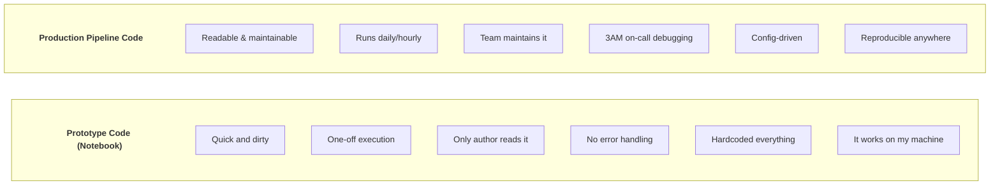
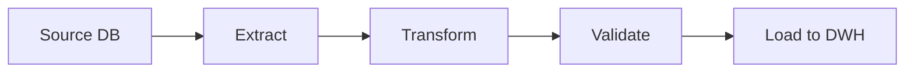

# Clean Code for Data Engineering - Complete Guide

## Python, SQL, Scala & dbt Standards — Từ Code Review đến Production-Ready Pipelines

---

## 📋 Mục Lục

1. [Tại Sao Clean Code Quan Trọng Cho DE](#phần-1-tại-sao-clean-code-quan-trọng-cho-de)
2. [Python Clean Code](#phần-2-python-clean-code-cho-data-engineering)
3. [SQL Clean Code](#phần-3-sql-clean-code)
4. [Scala/Java cho Spark](#phần-4-scalajava-cho-spark-jobs)
5. [dbt Style Guide](#phần-5-dbt-style-guide)
6. [Code Review Checklist](#phần-6-code-review-checklist-cho-de)
7. [Linting & Formatting Tools](#phần-7-linting--formatting-tools)
8. [Refactoring Patterns](#phần-8-refactoring-patterns-cho-pipelines)
9. [Anti-Patterns Catalog](#phần-9-anti-patterns-catalog)
10. [Documentation Standards](#phần-10-documentation-standards)
11. [Secrets & Config Management](#phần-11-secrets--configuration-management)
12. [Error Handling Patterns](#phần-12-error-handling-patterns)
13. [Logging Standards](#phần-13-logging-standards)
14. [Naming Conventions Master Reference](#phần-14-naming-conventions-master-reference)

---

## PHẦN 1: TẠI SAO CLEAN CODE QUAN TRỌNG CHO DE

### 1.1 Data Engineering ≠ Notebook Prototyping



> "You write code once, but it gets read hundreds of times."
> "The person debugging your pipeline at 3AM might be YOU in 6 months."

### 1.2 Cost of Bad Code in Data Pipelines

```
Bad Code Impact:

1. SILENT DATA CORRUPTION
   - Wrong JOIN → duplicate rows nobody notices for weeks
   - Missing NULL handling → wrong aggregations in dashboard
   - Hardcoded timezone → off-by-one-day errors

2. OPERATIONAL NIGHTMARE
   - No logging → "pipeline failed" with zero context
   - No retry logic → manual restart every failure
   - God functions → can't test individual components

3. TEAM VELOCITY
   - New engineer needs weeks to understand pipeline
   - Fear of changing anything ("don't touch it, it works")
   - Same bugs keep recurring

4. BUSINESS IMPACT
   - Wrong data → wrong decisions → lost revenue
   - Pipeline downtime → SLA violations
   - Compliance failures → legal risk
```

### 1.3 Clean Code Principles Applied to DE

| Principle | Data Engineering Application |
|---|---|
| Single Responsibility | One function = one transformation, One DAG = one data product |
| DRY (Don't Repeat) | Shared transforms across pipelines, Reusable connectors & utilities |
| KISS (Keep It Simple) | Simple SQL > complex Python, dbt model > custom Spark job |
| YAGNI (You Ain't Gonna Need It) | Don't build "generic framework" day 1, Start simple, refactor when needed |
| Fail Fast | Validate data at entry point, Raise exceptions, don't swallow errors |
| Explicit > Implicit | No magic numbers, no implicit configs, Type hints everywhere |

---

## PHẦN 2: PYTHON CLEAN CODE CHO DATA ENGINEERING

### 2.1 Naming Conventions

```python
# ============================================================
# VARIABLES: snake_case, descriptive, no abbreviations
# ============================================================

# ❌ BAD
df = pd.read_csv('data.csv')
df2 = df[df['s'] == 'A']
res = df2.groupby('c')['a'].sum()
x = get_data()
tmp = process(x)

# ✅ GOOD
raw_orders = pd.read_csv('orders_2024.csv')
active_orders = raw_orders[raw_orders['status'] == 'active']
revenue_by_category = active_orders.groupby('category')['amount'].sum()
customer_events = extract_customer_events(source_config)
enriched_events = enrich_with_user_profile(customer_events)


# ============================================================
# CONSTANTS: UPPER_SNAKE_CASE, defined at module level
# ============================================================

# ❌ BAD
batch = 1000
retry = 3
timeout = 30

# ✅ GOOD
BATCH_SIZE = 1_000
MAX_RETRY_ATTEMPTS = 3
API_TIMEOUT_SECONDS = 30
DEFAULT_PARTITION_COLUMNS = ["year", "month", "day"]
VALID_ORDER_STATUSES = frozenset({"pending", "confirmed", "shipped", "delivered"})


# ============================================================
# FUNCTIONS: verb + noun, clear intent
# ============================================================

# ❌ BAD
def data(src):        # What data? What does it do?
def process(df):      # Process how?
def do_stuff(x):      # ...
def handle(event):    # Handle how?

# ✅ GOOD
def extract_orders_from_postgres(connection_config: dict) -> pd.DataFrame:
def deduplicate_events_by_timestamp(events: pl.DataFrame) -> pl.DataFrame:
def validate_schema_against_contract(df: pd.DataFrame, contract: dict) -> bool:
def load_partitioned_to_s3(df: pd.DataFrame, s3_path: str, partition_cols: list) -> None:


# ============================================================
# CLASSES: PascalCase, noun, role-specific
# ============================================================

# ❌ BAD
class Helper:         # Helper for what?
class Manager:        # Manages what?
class DataClass:      # Too generic

# ✅ GOOD
class PostgresExtractor:
class SchemaValidator:
class S3ParquetWriter:
class OrderTransformPipeline:


# ============================================================
# BOOLEANS: is_, has_, should_, can_
# ============================================================

# ❌ BAD
active = True
data = False
check = True

# ✅ GOOD
is_active = True
has_valid_schema = False
should_retry = True
can_process_batch = True
is_idempotent = True
```

### 2.2 Function Design

```python
# ============================================================
# RULE 1: Functions should do ONE thing
# ============================================================

# ❌ BAD: God function doing everything
def process_orders(date: str):
    # Extract (50 lines)
    conn = psycopg2.connect(...)
    df = pd.read_sql(f"SELECT * FROM orders WHERE date = '{date}'", conn)
    conn.close()
    
    # Transform (100 lines)
    df['amount'] = df['amount'].fillna(0)
    df['status'] = df['status'].map({'A': 'active', 'I': 'inactive'})
    df = df.drop_duplicates(subset=['order_id'])
    df['total'] = df['amount'] * df['quantity']
    # ... 80 more lines of transforms
    
    # Validate (30 lines)
    assert df['amount'].min() >= 0
    assert df['order_id'].is_unique
    
    # Load (20 lines)
    engine = create_engine(...)
    df.to_sql('dim_orders', engine, if_exists='replace')
    
    # Send notification
    requests.post(slack_webhook, json={'text': f'Done: {len(df)} orders'})


# ✅ GOOD: Single responsibility, composable
def extract_orders(
    connection_config: dict,
    process_date: str
) -> pd.DataFrame:
    """Extract orders from source database for a specific date."""
    query = """
        SELECT order_id, customer_id, amount, quantity, status, created_at
        FROM orders 
        WHERE DATE(created_at) = %(date)s
    """
    with get_db_connection(connection_config) as conn:
        return pd.read_sql(query, conn, params={"date": process_date})


def clean_orders(raw_orders: pd.DataFrame) -> pd.DataFrame:
    """Apply cleaning rules: fill nulls, map statuses, deduplicate."""
    return (
        raw_orders
        .assign(
            amount=lambda df: df["amount"].fillna(0),
            status=lambda df: df["status"].map(STATUS_MAPPING),
        )
        .drop_duplicates(subset=["order_id"], keep="last")
    )


def enrich_orders(cleaned_orders: pd.DataFrame) -> pd.DataFrame:
    """Add computed columns: total, margin, category."""
    return cleaned_orders.assign(
        total=lambda df: df["amount"] * df["quantity"],
        margin=lambda df: df["total"] * MARGIN_RATE,
    )


def validate_orders(orders: pd.DataFrame) -> pd.DataFrame:
    """Validate business rules. Raises ValueError if validation fails."""
    if orders["amount"].min() < 0:
        raise ValueError(f"Negative amounts found: {orders[orders['amount'] < 0]}")
    
    duplicates = orders[orders["order_id"].duplicated()]
    if not duplicates.empty:
        raise ValueError(f"Duplicate order_ids: {duplicates['order_id'].tolist()}")
    
    return orders


def run_orders_pipeline(config: PipelineConfig) -> PipelineResult:
    """Orchestrate the full orders pipeline."""
    raw = extract_orders(config.source, config.process_date)
    cleaned = clean_orders(raw)
    enriched = enrich_orders(cleaned)
    validated = validate_orders(enriched)
    rows_loaded = load_to_warehouse(validated, config.destination)
    
    return PipelineResult(
        records_processed=rows_loaded,
        process_date=config.process_date,
        status="success"
    )


# ============================================================
# RULE 2: Max 3-4 parameters, use dataclasses for complex configs
# ============================================================

# ❌ BAD: Too many parameters
def load_data(host, port, db, user, password, table, schema, 
              batch_size, timeout, retry, ssl, compress):
    pass

# ✅ GOOD: Group related parameters
from dataclasses import dataclass

@dataclass(frozen=True)
class DatabaseConfig:
    host: str
    port: int = 5432
    database: str = "analytics"
    user: str = "reader"
    password: str = ""  # From env/secrets manager
    ssl: bool = True

@dataclass(frozen=True)
class LoadConfig:
    table: str
    schema: str = "public"
    batch_size: int = 10_000
    timeout_seconds: int = 300
    max_retries: int = 3

def load_data(db_config: DatabaseConfig, load_config: LoadConfig) -> int:
    """Load data with grouped configuration."""
    pass


# ============================================================
# RULE 3: Return early, avoid deep nesting
# ============================================================

# ❌ BAD: Arrow anti-pattern
def process_record(record):
    if record is not None:
        if record.get('type') == 'order':
            if record.get('amount') is not None:
                if record['amount'] > 0:
                    if record.get('customer_id'):
                        # Finally do something
                        return transform(record)
    return None

# ✅ GOOD: Guard clauses, return early
def process_record(record: dict | None) -> dict | None:
    """Process a single order record with validation."""
    if record is None:
        return None
    if record.get("type") != "order":
        return None
    if not record.get("amount") or record["amount"] <= 0:
        return None
    if not record.get("customer_id"):
        return None
    
    return transform(record)
```

### 2.3 Type Hints — Everywhere

```python
from typing import Any
from datetime import datetime, date
from pathlib import Path
from collections.abc import Iterator, Sequence
from dataclasses import dataclass

import pandas as pd
import polars as pl


# ============================================================
# ALWAYS type hint function signatures
# ============================================================

# ❌ BAD: No types — reader must guess everything
def get_data(source, start, end, cols):
    pass

def transform(df, rules):
    pass

# ✅ GOOD: Self-documenting with types
def extract_events(
    source_table: str,
    start_date: date,
    end_date: date,
    columns: list[str] | None = None,
) -> pd.DataFrame:
    """Extract events from source within date range."""
    pass


def apply_transform_rules(
    raw_df: pd.DataFrame,
    rules: dict[str, Any],
) -> pd.DataFrame:
    """Apply transformation rules to raw dataframe."""
    pass


# ============================================================
# Type aliases for complex types
# ============================================================

# Define domain-specific types
ColumnName = str
PartitionSpec = dict[str, str]  # {"year": "2024", "month": "01"}
RecordBatch = list[dict[str, Any]]
TransformFn = callable[[pd.DataFrame], pd.DataFrame]

def write_partitioned(
    data: pd.DataFrame,
    base_path: Path,
    partition_spec: PartitionSpec,
    transform: TransformFn | None = None,
) -> int:
    """Write data to partitioned storage."""
    if transform:
        data = transform(data)
    # ... write logic
    return len(data)


# ============================================================
# Dataclasses > raw dicts for structured data
# ============================================================

# ❌ BAD: Dict everywhere — no validation, no autocomplete
config = {
    "source": "postgres",
    "table": "orders",
    "batch_size": 1000,
    "start_date": "2024-01-01",  # Is this string or date? Who knows
}

# ✅ GOOD: Dataclass with validation
@dataclass(frozen=True)
class ExtractionConfig:
    """Configuration for data extraction."""
    source_type: str
    table_name: str
    batch_size: int = 1_000
    start_date: date = date.today()
    
    def __post_init__(self):
        if self.batch_size <= 0:
            raise ValueError(f"batch_size must be positive, got {self.batch_size}")
        if self.source_type not in ("postgres", "mysql", "api"):
            raise ValueError(f"Unknown source_type: {self.source_type}")


# ============================================================
# Use Enum for fixed choices
# ============================================================

from enum import Enum, auto

class PipelineStatus(Enum):
    PENDING = auto()
    RUNNING = auto()
    SUCCESS = auto()
    FAILED = auto()
    SKIPPED = auto()

class DataQuality(Enum):
    HIGH = "high"       # >99% completeness
    MEDIUM = "medium"   # 95-99% completeness
    LOW = "low"         # <95% completeness

def update_pipeline_status(
    pipeline_id: str, 
    status: PipelineStatus,
    quality: DataQuality | None = None,
) -> None:
    """Update pipeline run status in metadata store."""
    pass
```

### 2.4 Docstrings — Google Style

```python
def compute_customer_lifetime_value(
    transactions: pd.DataFrame,
    reference_date: date,
    discount_rate: float = 0.1,
) -> pd.DataFrame:
    """Compute Customer Lifetime Value (CLV) per customer.
    
    Uses the BG/NBD model to predict future transactions and
    Gamma-Gamma model for monetary value estimation.
    
    Args:
        transactions: DataFrame with columns:
            - customer_id (str): Unique customer identifier
            - transaction_date (date): Date of transaction
            - amount (float): Transaction amount in USD
        reference_date: Date to compute CLV from
        discount_rate: Annual discount rate for NPV calculation.
            Default 0.1 (10%).
    
    Returns:
        DataFrame with columns:
            - customer_id (str)
            - predicted_purchases_12m (float)
            - predicted_clv (float)
            - clv_segment (str): "high", "medium", "low"
    
    Raises:
        ValueError: If transactions DataFrame is empty or missing required columns
        ValueError: If discount_rate is not between 0 and 1
    
    Example:
        >>> txns = pd.DataFrame({
        ...     'customer_id': ['A', 'A', 'B'],
        ...     'transaction_date': ['2024-01-01', '2024-02-01', '2024-01-15'],
        ...     'amount': [100.0, 150.0, 200.0]
        ... })
        >>> clv = compute_customer_lifetime_value(txns, date(2024, 3, 1))
        >>> clv.columns.tolist()
        ['customer_id', 'predicted_purchases_12m', 'predicted_clv', 'clv_segment']
    
    Note:
        This function requires at least 2 transactions per customer
        for reliable predictions. Customers with fewer transactions
        will have clv_segment = "insufficient_data".
    """
    pass
```

### 2.5 Pandas Method Chaining (Fluent Style)

```python
# ============================================================
# ❌ BAD: Mutation everywhere, hard to follow
# ============================================================

df = pd.read_csv('orders.csv')
df['date'] = pd.to_datetime(df['date'])
df = df[df['status'] != 'cancelled']
df = df.drop_duplicates(subset=['order_id'])
df['amount'] = df['amount'].fillna(0)
df['year'] = df['date'].dt.year
df['month'] = df['date'].dt.month
result = df.groupby(['year', 'month'])['amount'].sum().reset_index()
result.columns = ['year', 'month', 'total_revenue']
result = result.sort_values('year')


# ============================================================
# ✅ GOOD: Method chaining — clear data flow, no mutation
# ============================================================

monthly_revenue = (
    pd.read_csv("orders.csv")
    .assign(date=lambda df: pd.to_datetime(df["date"]))
    .query("status != 'cancelled'")
    .drop_duplicates(subset=["order_id"], keep="last")
    .assign(
        amount=lambda df: df["amount"].fillna(0),
        year=lambda df: df["date"].dt.year,
        month=lambda df: df["date"].dt.month,
    )
    .groupby(["year", "month"], as_index=False)
    .agg(total_revenue=("amount", "sum"))
    .sort_values(["year", "month"])
)


# ============================================================
# ✅ GOOD: pipe() for custom transforms in chain
# ============================================================

def remove_test_accounts(df: pd.DataFrame) -> pd.DataFrame:
    """Remove internal test accounts from dataset."""
    test_domains = {"@test.com", "@internal.com", "@example.com"}
    mask = df["email"].apply(
        lambda e: not any(e.endswith(d) for d in test_domains)
    )
    return df[mask]


def add_cohort_week(df: pd.DataFrame) -> pd.DataFrame:
    """Add cohort_week based on first purchase date."""
    first_purchase = (
        df.groupby("customer_id")["order_date"]
        .transform("min")
    )
    return df.assign(
        cohort_week=first_purchase.dt.isocalendar().week
    )


clean_orders = (
    raw_orders
    .pipe(remove_test_accounts)
    .pipe(add_cohort_week)
    .pipe(validate_required_columns, required=["order_id", "amount"])
)
```

### 2.6 Polars Clean Patterns

```python
import polars as pl

# ============================================================
# Polars: Prefer expressions over apply()
# ============================================================

# ❌ BAD: Using apply (slow, defeats purpose of Polars)
result = df.with_columns(
    pl.col("name").apply(lambda x: x.strip().lower()).alias("clean_name")
)

# ✅ GOOD: Native expressions (vectorized, fast)
result = df.with_columns(
    pl.col("name").str.strip_chars().str.to_lowercase().alias("clean_name")
)


# ============================================================
# Polars: Chain expressions clearly
# ============================================================

daily_metrics = (
    events
    .filter(
        pl.col("event_type").is_in(["view", "purchase", "add_to_cart"])
    )
    .with_columns(
        pl.col("timestamp").cast(pl.Date).alias("event_date"),
        pl.col("amount").fill_null(0).alias("amount"),
    )
    .group_by(["event_date", "event_type"])
    .agg(
        pl.col("user_id").n_unique().alias("unique_users"),
        pl.col("event_id").count().alias("total_events"),
        pl.col("amount").sum().alias("total_amount"),
        pl.col("amount").mean().round(2).alias("avg_amount"),
    )
    .sort(["event_date", "event_type"])
)


# ============================================================
# Polars: Use lazy evaluation for large datasets
# ============================================================

# ✅ GOOD: Lazy — Polars optimizes the query plan
result = (
    pl.scan_parquet("data/events/*.parquet")
    .filter(pl.col("date") >= pl.lit("2024-01-01"))
    .select(["user_id", "event_type", "amount"])
    .group_by("user_id")
    .agg(
        pl.col("amount").sum().alias("total_spend"),
        pl.col("event_type").count().alias("total_events"),
    )
    .filter(pl.col("total_spend") > 100)
    .sort("total_spend", descending=True)
    .collect()  # Execute the optimized plan
)
```

---

## PHẦN 3: SQL CLEAN CODE

### 3.1 SQL Style Guide (SQLFluff Compatible)

```sql
-- ============================================================
-- RULE 1: Keyword UPPERCASE, identifiers lowercase
-- ============================================================

-- ❌ BAD
select o.id, c.name, sum(o.amount)
from orders o join customers c on o.customer_id = c.id
where o.status = 'active' group by o.id, c.name having sum(o.amount) > 100;

-- ✅ GOOD
SELECT
    o.id                AS order_id,
    c.name              AS customer_name,
    SUM(o.amount)       AS total_amount
FROM orders AS o
INNER JOIN customers AS c
    ON o.customer_id = c.id
WHERE o.status = 'active'
GROUP BY
    o.id,
    c.name
HAVING SUM(o.amount) > 100
ORDER BY total_amount DESC
;


-- ============================================================
-- RULE 2: One column per line, trailing commas (dbt convention)
-- ============================================================

-- ❌ BAD: Hard to diff, hard to comment out columns
SELECT order_id, customer_id, amount, status, created_at, updated_at

-- ✅ GOOD: Easy to diff, comment, reorder
SELECT
    order_id,
    customer_id,
    amount,
    status,
    created_at,
    updated_at


-- ============================================================
-- RULE 3: Explicit JOIN types, never implicit
-- ============================================================

-- ❌ BAD: Implicit join (WHERE clause join)
SELECT *
FROM orders o, customers c
WHERE o.customer_id = c.id;

-- ✅ GOOD: Explicit JOIN
SELECT
    o.order_id,
    c.customer_name
FROM orders AS o
INNER JOIN customers AS c
    ON o.customer_id = c.id;


-- ============================================================
-- RULE 4: Always alias with AS keyword
-- ============================================================

-- ❌ BAD: No AS keyword, ambiguous
SELECT o.id order_id, c.name customer_name
FROM orders o
JOIN customers c ON o.customer_id = c.id;

-- ✅ GOOD: Explicit AS
SELECT
    o.id    AS order_id,
    c.name  AS customer_name
FROM orders AS o
INNER JOIN customers AS c
    ON o.customer_id = c.id;
```

### 3.2 CTE Over Subqueries

```sql
-- ============================================================
-- ❌ BAD: Nested subqueries — unreadable
-- ============================================================

SELECT *
FROM (
    SELECT 
        customer_id,
        total_orders,
        total_revenue,
        CASE 
            WHEN total_revenue > 10000 THEN 'platinum'
            WHEN total_revenue > 5000 THEN 'gold'
            ELSE 'silver'
        END AS tier
    FROM (
        SELECT
            customer_id,
            COUNT(DISTINCT order_id) AS total_orders,
            SUM(amount) AS total_revenue
        FROM (
            SELECT *
            FROM orders
            WHERE status != 'cancelled'
                AND created_at >= '2024-01-01'
        ) valid_orders
        GROUP BY customer_id
    ) customer_metrics
) tiered_customers
WHERE tier = 'platinum';


-- ============================================================
-- ✅ GOOD: CTEs — readable, testable, self-documenting
-- ============================================================

WITH valid_orders AS (
    -- Filter out cancelled orders in the analysis period
    SELECT
        order_id,
        customer_id,
        amount,
        created_at
    FROM orders
    WHERE status != 'cancelled'
        AND created_at >= '2024-01-01'
),

customer_metrics AS (
    -- Aggregate order metrics per customer
    SELECT
        customer_id,
        COUNT(DISTINCT order_id) AS total_orders,
        SUM(amount)              AS total_revenue,
        MIN(created_at)          AS first_order_date,
        MAX(created_at)          AS last_order_date
    FROM valid_orders
    GROUP BY customer_id
),

tiered_customers AS (
    -- Assign customer tier based on revenue
    SELECT
        customer_id,
        total_orders,
        total_revenue,
        first_order_date,
        last_order_date,
        CASE
            WHEN total_revenue > 10000 THEN 'platinum'
            WHEN total_revenue > 5000  THEN 'gold'
            WHEN total_revenue > 1000  THEN 'silver'
            ELSE 'bronze'
        END AS customer_tier
    FROM customer_metrics
)

SELECT *
FROM tiered_customers
WHERE customer_tier = 'platinum'
ORDER BY total_revenue DESC
;


-- ============================================================
-- CTE Best Practices
-- ============================================================

-- 1. Name CTEs as "what" they contain, not "how"
--    ❌ joined_and_filtered
--    ✅ active_premium_customers

-- 2. One CTE = one logical step
--    ❌ CTE that filters + joins + aggregates
--    ✅ Separate filter CTE → join CTE → aggregate CTE

-- 3. Comment each CTE explaining business logic
--    ✅ -- Customers with at least 3 orders in last 90 days

-- 4. Keep CTE count reasonable (5-8 max)
--    If > 8, consider breaking into separate models (dbt)
```

### 3.3 SQL Naming Conventions

```sql
-- ============================================================
-- TABLE NAMING: prefix + domain + entity
-- ============================================================

-- Raw/Staging tables (source mirror)
stg_stripe__payments          -- stg_{source}__{entity}
stg_shopify__orders
stg_salesforce__contacts

-- Intermediate tables (business logic)
int_orders__pivoted           -- int_{entity}__{verb}
int_payments__unioned
int_customers__grouped

-- Fact tables (events/transactions)
fct_orders                    -- fct_{event/transaction}
fct_page_views
fct_subscription_events

-- Dimension tables (entities)
dim_customers                 -- dim_{entity}
dim_products
dim_dates

-- Metrics/Marts tables
mrt_monthly_revenue           -- mrt_{grain}_{metric}
mrt_weekly_retention
mrt_daily_active_users

-- Snapshots
snp_customers                 -- snp_{entity}


-- ============================================================
-- COLUMN NAMING: consistent, unambiguous
-- ============================================================

-- IDs: {entity}_id
customer_id                   -- NOT: id, cust_id, customerId
order_id                      -- NOT: order_no, orderID
product_id

-- Timestamps: {event}_at
created_at                    -- NOT: create_date, creation_ts
updated_at                    -- NOT: modified, last_update
deleted_at
shipped_at
first_ordered_at

-- Dates: {event}_date
order_date                    -- NOT: dt, order_dt
birth_date

-- Booleans: is_{adjective} or has_{noun}
is_active                     -- NOT: active, status
is_deleted                    -- NOT: deleted
has_subscription              -- NOT: subscription
is_first_order

-- Counts: {noun}_count
order_count                   -- NOT: num_orders, orders_cnt, cnt
item_count

-- Amounts/Values: {noun}_{unit} or {noun}_amount
revenue_amount                -- NOT: rev, revenue (ambiguous)
total_amount_usd              -- Include currency!
discount_percentage
weight_kg

-- Ratios: {noun}_rate or {noun}_ratio
conversion_rate
churn_rate
click_through_rate
```

### 3.4 SQL Performance Patterns

```sql
-- ============================================================
-- RULE 1: SELECT specific columns, NEVER SELECT *
-- ============================================================

-- ❌ BAD: Reads all columns from disk (Parquet/columnar waste)
SELECT * FROM orders;

-- ✅ GOOD: Only columns needed
SELECT
    order_id,
    customer_id,
    amount,
    created_at
FROM orders;


-- ============================================================
-- RULE 2: Filter early, join late
-- ============================================================

-- ❌ BAD: Join first, then filter (processes too much data)
SELECT
    o.order_id,
    c.name
FROM orders AS o
INNER JOIN customers AS c ON o.customer_id = c.id
WHERE o.created_at >= '2024-01-01'
    AND c.country = 'US';

-- ✅ GOOD: Filter in CTEs before joining
WITH recent_orders AS (
    SELECT order_id, customer_id, amount
    FROM orders
    WHERE created_at >= '2024-01-01'
),

us_customers AS (
    SELECT id, name
    FROM customers
    WHERE country = 'US'
)

SELECT
    ro.order_id,
    uc.name
FROM recent_orders AS ro
INNER JOIN us_customers AS uc
    ON ro.customer_id = uc.id;


-- ============================================================
-- RULE 3: Use EXISTS instead of IN for subqueries
-- ============================================================

-- ❌ Slower for large subquery results
SELECT *
FROM orders
WHERE customer_id IN (
    SELECT customer_id FROM premium_customers
);

-- ✅ EXISTS is often faster (short-circuits)
SELECT o.*
FROM orders AS o
WHERE EXISTS (
    SELECT 1
    FROM premium_customers AS pc
    WHERE pc.customer_id = o.customer_id
);


-- ============================================================
-- RULE 4: Avoid functions on indexed columns in WHERE
-- ============================================================

-- ❌ BAD: Function on column → no index usage
SELECT * FROM orders
WHERE YEAR(created_at) = 2024;

SELECT * FROM orders
WHERE LOWER(status) = 'active';

-- ✅ GOOD: Compare directly
SELECT * FROM orders
WHERE created_at >= '2024-01-01'
    AND created_at < '2025-01-01';

SELECT * FROM orders
WHERE status = 'active';


-- ============================================================
-- RULE 5: Window functions — name your windows
-- ============================================================

-- ❌ BAD: Repeated window definition
SELECT
    customer_id,
    order_date,
    amount,
    ROW_NUMBER() OVER (PARTITION BY customer_id ORDER BY order_date DESC) AS rn,
    SUM(amount) OVER (PARTITION BY customer_id ORDER BY order_date DESC) AS running_total,
    LAG(amount) OVER (PARTITION BY customer_id ORDER BY order_date DESC) AS prev_amount
FROM orders;

-- ✅ GOOD: Named window (DRY)
SELECT
    customer_id,
    order_date,
    amount,
    ROW_NUMBER() OVER customer_orders AS rn,
    SUM(amount)  OVER customer_orders AS running_total,
    LAG(amount)  OVER customer_orders AS prev_amount
FROM orders
WINDOW customer_orders AS (
    PARTITION BY customer_id 
    ORDER BY order_date DESC
)
;
```

### 3.5 SQL Comment Standards

```sql
-- ============================================================
-- FILE HEADER: Every SQL file should have this
-- ============================================================

/*
Model: fct_orders
Description: Fact table for all completed orders
Owner: data-platform-team
Source: stg_shopify__orders, dim_customers
Grain: One row per order_id
Schedule: Daily, 06:00 UTC
SLA: Available by 07:00 UTC

Change Log:
- 2024-03-15: Added discount_amount column (JIRA-456)
- 2024-01-10: Initial model creation (JIRA-123)
*/


-- ============================================================
-- INLINE COMMENTS: Explain WHY, not WHAT
-- ============================================================

-- ❌ BAD: Comment explains WHAT (obvious from code)
-- Join orders with customers
SELECT o.*, c.name
FROM orders o JOIN customers c ON o.customer_id = c.id;

-- Filter active orders
WHERE status = 'active';

-- ✅ GOOD: Comment explains WHY (business context)

-- Exclude test orders created by QA team (identified by negative customer_id)
WHERE customer_id > 0

-- Use 30-day window because marketing defines "active" as
-- having activity within last 30 days (per JIRA-789)
AND last_activity_at >= CURRENT_DATE - INTERVAL '30 days'

-- LEFT JOIN because not all orders have shipping records
-- (digital products don't ship)
LEFT JOIN shipping AS s ON o.order_id = s.order_id
```

---

## PHẦN 4: SCALA/JAVA CHO SPARK JOBS

### 4.1 Scala Clean Code Patterns

```scala
// ============================================================
// Case classes for schema definition (type-safe)
// ============================================================

// ❌ BAD: Using raw DataFrame without schema
val df = spark.read.parquet("orders/")
val result = df.filter($"status" === "active")
// No compile-time safety, runtime errors

// ✅ GOOD: Case class + Dataset API
case class Order(
  orderId: String,
  customerId: String,
  amount: Double,
  status: String,
  createdAt: java.sql.Timestamp
)

case class OrderMetrics(
  customerId: String,
  totalOrders: Long,
  totalRevenue: Double,
  avgOrderValue: Double
)

import spark.implicits._

val orders: Dataset[Order] = spark.read
  .parquet("orders/")
  .as[Order]

val metrics: Dataset[OrderMetrics] = orders
  .filter(_.status == "active")
  .groupByKey(_.customerId)
  .mapGroups { (customerId, orders) =>
    val orderList = orders.toList
    OrderMetrics(
      customerId = customerId,
      totalOrders = orderList.size,
      totalRevenue = orderList.map(_.amount).sum,
      avgOrderValue = orderList.map(_.amount).sum / orderList.size
    )
  }


// ============================================================
// Transform functions: DataFrame => DataFrame
// ============================================================

object OrderTransforms {
  
  def filterActiveOrders(df: DataFrame): DataFrame =
    df.filter($"status" === "active" && $"amount" > 0)
  
  def addRevenueCategory(df: DataFrame): DataFrame =
    df.withColumn("revenue_category",
      when($"amount" > 1000, lit("high"))
        .when($"amount" > 100, lit("medium"))
        .otherwise(lit("low"))
    )
  
  def deduplicateByTimestamp(df: DataFrame): DataFrame =
    df.dropDuplicates("order_id")
      .orderBy($"updated_at".desc)
}

// Usage: compose transforms
val result = Seq(
  OrderTransforms.filterActiveOrders _,
  OrderTransforms.addRevenueCategory _,
  OrderTransforms.deduplicateByTimestamp _
).foldLeft(rawDf) { (df, transform) => transform(df) }
```

### 4.2 Spark Performance Clean Code

```scala
// ============================================================
// RULE: Avoid UDFs when built-in functions exist
// ============================================================

// ❌ BAD: UDF for simple string operation (no Catalyst optimization)
val cleanName = udf((name: String) => name.trim.toLowerCase)
df.withColumn("clean_name", cleanName($"name"))

// ✅ GOOD: Built-in functions (Catalyst-optimized)
df.withColumn("clean_name", trim(lower($"name")))


// ============================================================
// RULE: Broadcast small tables explicitly
// ============================================================

// ❌ BAD: Let Spark guess (may not broadcast)
val result = largeOrders.join(smallCountries, "country_code")

// ✅ GOOD: Explicit broadcast hint
import org.apache.spark.sql.functions.broadcast
val result = largeOrders.join(broadcast(smallCountries), "country_code")


// ============================================================
// RULE: Partition and cache strategically
// ============================================================

// ❌ BAD: Cache everything
df.cache()  // Wastes memory if only used once

// ✅ GOOD: Cache only if reused multiple times
val cleanedOrders = rawOrders.transform(cleanAndValidate)

if (outputPaths.size > 1) {
  cleanedOrders.cache()  // Reused for multiple outputs
}

outputPaths.foreach { path =>
  cleanedOrders.write.parquet(path)
}

cleanedOrders.unpersist()  // Clean up explicitly
```

---

## PHẦN 5: DBT STYLE GUIDE

### 5.1 Model Naming & Organization

```
dbt Project Structure:
models/
├── staging/                    # 1:1 with source tables
│   ├── shopify/
│   │   ├── _shopify__sources.yml
│   │   ├── _shopify__models.yml
│   │   ├── stg_shopify__orders.sql
│   │   ├── stg_shopify__customers.sql
│   │   └── stg_shopify__products.sql
│   └── stripe/
│       ├── _stripe__sources.yml
│       ├── _stripe__models.yml
│       ├── stg_stripe__payments.sql
│       └── stg_stripe__refunds.sql
│
├── intermediate/               # Business logic, joining
│   ├── finance/
│   │   ├── _int_finance__models.yml
│   │   ├── int_orders__payments_joined.sql
│   │   └── int_revenue__daily_aggregated.sql
│   └── marketing/
│       ├── _int_marketing__models.yml
│       └── int_customers__attributed.sql
│
└── marts/                      # Final business entities
    ├── finance/
    │   ├── _finance__models.yml
    │   ├── fct_orders.sql
    │   └── dim_customers.sql
    └── marketing/
        ├── _marketing__models.yml
        ├── fct_campaigns.sql
        └── mrt_weekly_retention.sql

Naming Rules:
├── stg_{source}__{entity}.sql     # Staging: minimal transform
├── int_{entity}__{verb}.sql       # Intermediate: business logic
├── fct_{event}.sql                # Fact: events/transactions
├── dim_{entity}.sql               # Dimension: entities
└── mrt_{grain}_{metric}.sql       # Mart: aggregated metrics
```

### 5.2 Staging Model Template

```sql
-- stg_shopify__orders.sql
-- Staging model: minimal cleaning, type casting, renaming
-- Source: shopify.orders
-- Grain: one row per order

WITH source AS (
    SELECT * FROM {{ source('shopify', 'orders') }}
),

renamed AS (
    SELECT
        -- IDs
        id                          AS order_id,
        customer_id,
        
        -- Strings
        LOWER(TRIM(status))         AS order_status,
        LOWER(TRIM(fulfillment))    AS fulfillment_status,
        
        -- Numerics
        CAST(total_price AS DECIMAL(10, 2))     AS order_amount,
        CAST(total_discount AS DECIMAL(10, 2))  AS discount_amount,
        CAST(total_tax AS DECIMAL(10, 2))       AS tax_amount,
        
        -- Timestamps
        CAST(created_at AS TIMESTAMP)   AS ordered_at,
        CAST(updated_at AS TIMESTAMP)   AS updated_at,
        CAST(cancelled_at AS TIMESTAMP) AS cancelled_at,
        
        -- Metadata
        CAST(_airbyte_extracted_at AS TIMESTAMP) AS _loaded_at
        
    FROM source
)

SELECT * FROM renamed
```

### 5.3 dbt YAML Standards

```yaml
# _shopify__models.yml
version: 2

models:
  - name: stg_shopify__orders
    description: >
      Staging model for Shopify orders. Minimal cleaning:
      type casting, renaming, trimming. One row per order.
    
    columns:
      - name: order_id
        description: "Primary key - unique order identifier from Shopify"
        data_tests:
          - unique
          - not_null
      
      - name: customer_id
        description: "Foreign key to stg_shopify__customers"
        data_tests:
          - not_null
          - relationships:
              to: ref('stg_shopify__customers')
              field: customer_id
      
      - name: order_amount
        description: "Total order amount in USD before tax"
        data_tests:
          - not_null
          - dbt_utils.accepted_range:
              min_value: 0
              max_value: 100000
      
      - name: order_status
        description: "Current order status"
        data_tests:
          - accepted_values:
              values: ['pending', 'confirmed', 'shipped', 'delivered', 'cancelled']
```

### 5.4 dbt Best Practices

```sql
-- ============================================================
-- RULE 1: ref() and source() — never hardcode table names
-- ============================================================

-- ❌ BAD
SELECT * FROM raw.shopify.orders

-- ✅ GOOD: staging models use source()
SELECT * FROM {{ source('shopify', 'orders') }}

-- ✅ GOOD: all other models use ref()
SELECT * FROM {{ ref('stg_shopify__orders') }}


-- ============================================================
-- RULE 2: Use Jinja sparingly — SQL should be readable
-- ============================================================

-- ❌ BAD: Over-engineered Jinja

SELECT
    
        {{ col }},
    
FROM table

-- ✅ GOOD: Just write the SQL
SELECT
    a,
    b,
    c,
    d,
    e
FROM table

-- ✅ OK: Jinja for genuinely dynamic logic


SELECT
    order_id,
    
    SUM(CASE WHEN payment_method = '{{ method }}' THEN amount ELSE 0 END) 
        AS {{ method }}_amount
    ,
    
FROM payments
GROUP BY order_id


-- ============================================================
-- RULE 3: One model, one grain, documented
-- ============================================================

-- At top of every model, specify grain
-- fct_orders.sql
-- Grain: one row per order_id

-- ❌ BAD: Model changes grain mid-query
-- Starts as order-level, then aggregates to customer-level

-- ✅ GOOD: Separate models for different grains
-- fct_orders.sql        → one row per order
-- mrt_customer_orders   → one row per customer (aggregated)
```

---

## PHẦN 6: CODE REVIEW CHECKLIST CHO DE

### 6.1 The Checklist

```
╔══════════════════════════════════════════════════════════════╗
║            DATA ENGINEERING CODE REVIEW CHECKLIST            ║
╠══════════════════════════════════════════════════════════════╣
║                                                              ║
║  📦 DATA CORRECTNESS                                        ║
║  □ JOIN types correct? (INNER vs LEFT — data loss risk?)     ║
║  □ Deduplication handled? (What defines a unique record?)    ║
║  □ NULL handling explicit? (fillna? coalesce? filter?)       ║
║  □ Timezone handling correct? (UTC stored? converted?)       ║
║  □ Data types appropriate? (decimal for money, not float!)   ║
║  □ Edge cases: empty DataFrames? Single row? All NULLs?      ║
║                                                              ║
║  🔄 IDEMPOTENCY                                             ║
║  □ Can this run twice safely? (No duplicates?)               ║
║  □ UPSERT/MERGE or DELETE+INSERT pattern used?               ║
║  □ Partition overwrite instead of append?                    ║
║  □ Deterministic output? (Same input → same output?)         ║
║                                                              ║
║  ⚡ PERFORMANCE                                              ║
║  □ SELECT * avoided? (Specific columns only?)                ║
║  □ Filters pushed down? (Filter early, join late?)           ║
║  □ Broadcast joins for small tables?                         ║
║  □ Appropriate partitioning? (Not too many, not too few?)    ║
║  □ No unnecessary caching/persist?                           ║
║                                                              ║
║  🛡️ ERROR HANDLING                                           ║
║  □ Specific exceptions caught? (No bare except:)             ║
║  □ Meaningful error messages with context?                   ║
║  □ Retry logic for transient failures?                       ║
║  □ Dead letter queue for bad records?                        ║
║  □ Graceful degradation? (Partial failure handling?)         ║
║                                                              ║
║  📝 LOGGING & OBSERVABILITY                                  ║
║  □ Key metrics logged? (row counts, durations, data stats?)  ║
║  □ Structured logging? (JSON, not print statements!)         ║
║  □ No sensitive data in logs? (PII, passwords, tokens?)      ║
║  □ Correlation IDs for tracing?                              ║
║                                                              ║
║  🔒 SECURITY & SECRETS                                      ║
║  □ No hardcoded credentials?                                 ║
║  □ Secrets from env vars or secrets manager?                 ║
║  □ PII handling compliant? (Masking, encryption?)            ║
║  □ No SQL injection risk? (Parameterized queries?)           ║
║                                                              ║
║  📐 CODE QUALITY                                             ║
║  □ Type hints on all function signatures?                    ║
║  □ Docstrings on public functions?                           ║
║  □ No magic numbers? (Constants defined?)                    ║
║  □ Functions are small and focused? (<30 lines?)             ║
║  □ Tests exist for transformation logic?                     ║
║  □ Config separate from code? (.env, YAML, etc.)             ║
║                                                              ║
║  🧪 TESTING                                                  ║
║  □ Unit tests for transform functions?                       ║
║  □ Edge cases tested? (empty, null, duplicates?)             ║
║  □ Schema validation tests?                                  ║
║  □ Integration test for end-to-end flow?                     ║
║                                                              ║
║  📄 DOCUMENTATION                                            ║
║  □ PR description explains WHY?                              ║
║  □ Breaking changes called out?                              ║
║  □ Downstream impact documented?                             ║
║  □ Runbook updated if operational change?                    ║
║                                                              ║
╚══════════════════════════════════════════════════════════════╝
```

### 6.2 Common Review Feedback Examples

```python
# ============================================================
# FEEDBACK 1: "This JOIN might cause row explosion"
# ============================================================

# ❌ Reviewer concern: many-to-many join
result = orders.merge(payments, on="customer_id")
# If customer has 10 orders and 5 payments → 50 rows!

# ✅ Fix: Join on correct grain
result = orders.merge(
    payments.groupby("customer_id").agg(
        total_paid=("amount", "sum")
    ),
    on="customer_id",
    how="left"
)


# ============================================================
# FEEDBACK 2: "Float for money → rounding errors"
# ============================================================

# ❌ BAD: Float arithmetic
price = 19.99
tax = price * 0.07  # 1.3992999999999998

# ✅ GOOD: Decimal for money
from decimal import Decimal
price = Decimal("19.99")
tax = price * Decimal("0.07")  # 1.3993 (exact)

# In SQL:
# ❌ CAST(amount AS FLOAT)
# ✅ CAST(amount AS DECIMAL(10, 2))


# ============================================================
# FEEDBACK 3: "This swallows errors silently"
# ============================================================

# ❌ BAD: Bare except hides bugs
try:
    process_batch(data)
except:
    pass  # What failed? Why? Nobody knows

# ✅ GOOD: Specific exception, logging, re-raise or handle
try:
    process_batch(data)
except ConnectionError as e:
    logger.warning(f"Connection failed, will retry: {e}")
    raise
except ValueError as e:
    logger.error(f"Invalid data in batch: {e}", extra={"batch_id": batch_id})
    send_to_dead_letter_queue(data, error=str(e))
```

---

## PHẦN 7: LINTING & FORMATTING TOOLS

### 7.1 Ruff — Fast Python Linter + Formatter

```toml
# pyproject.toml — Ruff configuration

[tool.ruff]
target-version = "py311"
line-length = 100
fix = true

[tool.ruff.lint]
select = [
    "E",    # pycodestyle errors
    "W",    # pycodestyle warnings
    "F",    # pyflakes
    "I",    # isort (import sorting)
    "N",    # pep8-naming
    "UP",   # pyupgrade
    "B",    # flake8-bugbear
    "SIM",  # flake8-simplify
    "TCH",  # flake8-type-checking
    "RUF",  # ruff-specific rules
    "PTH",  # flake8-use-pathlib
    "ERA",  # commented-out code
    "PL",   # pylint
    "PERF", # perflint
]

ignore = [
    "E501",    # Line too long (handled by formatter)
    "PLR0913", # Too many arguments (sometimes needed for configs)
]

[tool.ruff.lint.isort]
known-first-party = ["src", "pipelines", "transforms"]
force-single-line = false
lines-after-imports = 2

[tool.ruff.lint.per-file-ignores]
"tests/**/*.py" = ["S101"]  # Allow assert in tests
"__init__.py" = ["F401"]    # Allow unused imports in __init__

[tool.ruff.format]
quote-style = "double"
indent-style = "space"
docstring-code-format = true
```

```bash
# Usage
ruff check .                  # Lint
ruff check --fix .            # Lint + auto-fix
ruff format .                 # Format (like black)
ruff check --select I --fix . # Sort imports only
```

### 7.2 mypy — Static Type Checking

```toml
# pyproject.toml — mypy configuration

[tool.mypy]
python_version = "3.11"
warn_return_any = true
warn_unused_configs = true
disallow_untyped_defs = true
disallow_incomplete_defs = true
check_untyped_defs = true
no_implicit_optional = true
warn_redundant_casts = true
warn_unused_ignores = true
show_error_codes = true
namespace_packages = true

[[tool.mypy.overrides]]
module = [
    "pyspark.*",
    "great_expectations.*",
    "airflow.*",
]
ignore_missing_imports = true
```

```bash
# Usage
mypy src/                     # Type check src/
mypy src/ --ignore-missing-imports  # Skip untyped libraries
mypy src/ --html-report report/     # Generate HTML report
```

### 7.3 SQLFluff — SQL Linter & Formatter

```ini
# .sqlfluff — SQLFluff configuration

[sqlfluff]
dialect = postgres
templater = dbt
max_line_length = 100
indent_unit = space
tab_space_size = 4

[sqlfluff:indentation]
indent_unit = space
tab_space_size = 4
indented_joins = false
indented_ctes = false
indented_using_on = true
indented_on_contents = true

[sqlfluff:layout:type:comma]
spacing_before = touch
line_position = trailing

[sqlfluff:rules:capitalisation.keywords]
capitalisation_policy = upper

[sqlfluff:rules:capitalisation.identifiers]
capitalisation_policy = lower

[sqlfluff:rules:capitalisation.functions]
capitalisation_policy = upper

[sqlfluff:rules:aliasing.table]
aliasing = explicit

[sqlfluff:rules:aliasing.column]
aliasing = explicit

[sqlfluff:rules:aliasing.expression]
allow_scalar = false

[sqlfluff:rules:convention.select_trailing_comma]
select_clause_trailing_comma = forbid

[sqlfluff:rules:references.consistent]
single_table_references = unqualified

[sqlfluff:templater:dbt]
project_dir = ./
profiles_dir = ~/.dbt/
profile = default
target = dev
```

```bash
# Usage
sqlfluff lint models/                    # Lint SQL files
sqlfluff fix models/                     # Auto-fix violations
sqlfluff lint models/ --rules L001,L002  # Specific rules only
sqlfluff parse models/staging/stg_orders.sql  # Debug parse tree
```

### 7.4 Pre-commit Hooks — Automate Everything

```yaml
# .pre-commit-config.yaml

repos:
  # Python formatting & linting (Ruff = black + isort + flake8)
  - repo: https://github.com/astral-sh/ruff-pre-commit
    rev: v0.8.0
    hooks:
      - id: ruff
        args: [--fix, --exit-non-zero-on-fix]
      - id: ruff-format

  # Type checking
  - repo: https://github.com/pre-commit/mirrors-mypy
    rev: v1.13.0
    hooks:
      - id: mypy
        additional_dependencies: [types-requests, types-PyYAML]
        args: [--ignore-missing-imports]

  # SQL linting
  - repo: https://github.com/sqlfluff/sqlfluff
    rev: 3.2.0
    hooks:
      - id: sqlfluff-lint
        args: [--dialect, postgres]
      - id: sqlfluff-fix
        args: [--dialect, postgres, --force]

  # YAML validation
  - repo: https://github.com/pre-commit/pre-commit-hooks
    rev: v5.0.0
    hooks:
      - id: check-yaml
        args: [--unsafe]       # Allow custom YAML tags (dbt)
      - id: check-json
      - id: end-of-file-fixer
      - id: trailing-whitespace
      - id: check-added-large-files
        args: [--maxkb=1000]
      - id: no-commit-to-branch
        args: [--branch, main, --branch, production]

  # Secrets detection
  - repo: https://github.com/Yelp/detect-secrets
    rev: v1.5.0
    hooks:
      - id: detect-secrets
        args: [--baseline, .secrets.baseline]

  # Docker lint
  - repo: https://github.com/hadolint/hadolint
    rev: v2.12.0
    hooks:
      - id: hadolint-docker
```

```bash
# Setup
pip install pre-commit
pre-commit install                  # Install hooks
pre-commit run --all-files          # Run on all files
pre-commit autoupdate               # Update hook versions
```

### 7.5 Makefile — Standard Commands

```makefile
# Makefile for Data Engineering project

.PHONY: help install lint format test clean docker-up docker-down

help:  ## Show this help message
	@grep -E '^[a-zA-Z_-]+:.*?## .*$$' $(MAKEFILE_LIST) | sort | \
		awk 'BEGIN {FS = ":.*?## "}; {printf "\033[36m%-20s\033[0m %s\n", $$1, $$2}'

# ============================================================
# Development
# ============================================================

install:  ## Install dependencies
	uv sync

install-dev:  ## Install dev dependencies
	uv sync --all-extras

# ============================================================
# Code Quality
# ============================================================

lint:  ## Run all linters
	ruff check src/ tests/
	mypy src/
	sqlfluff lint models/

format:  ## Format all code
	ruff format src/ tests/
	ruff check --fix src/ tests/
	sqlfluff fix models/

check: lint test  ## Run lint + test

# ============================================================
# Testing
# ============================================================

test:  ## Run tests
	pytest tests/ -v --tb=short

test-cov:  ## Run tests with coverage
	pytest tests/ -v --cov=src --cov-report=html --cov-report=term-missing

test-unit:  ## Run unit tests only
	pytest tests/unit/ -v

test-integration:  ## Run integration tests
	pytest tests/integration/ -v --timeout=120

# ============================================================
# Infrastructure
# ============================================================

docker-up:  ## Start all services
	docker compose up -d

docker-down:  ## Stop all services
	docker compose down -v

docker-logs:  ## View service logs
	docker compose logs -f

# ============================================================
# Pipeline
# ============================================================

run-pipeline:  ## Run main pipeline
	uv run python -m src.pipelines.main

run-backfill:  ## Run backfill pipeline
	uv run python -m src.pipelines.backfill --start-date $(START_DATE) --end-date $(END_DATE)

dbt-run:  ## Run dbt models
	cd dbt && dbt run

dbt-test:  ## Run dbt tests
	cd dbt && dbt test

# ============================================================
# Cleanup
# ============================================================

clean:  ## Clean generated files
	find . -type f -name "*.pyc" -delete
	find . -type d -name "__pycache__" -exec rm -rf {} +
	find . -type d -name ".pytest_cache" -exec rm -rf {} +
	rm -rf .ruff_cache/ .mypy_cache/ htmlcov/ .coverage
```

---

## PHẦN 8: REFACTORING PATTERNS CHO PIPELINES

### 8.1 Extract Transform Load Separation

```python
# ============================================================
# PATTERN: Separate E, T, L into independent, testable units
# ============================================================

# ❌ BAD: Monolithic pipeline
class Pipeline:
    def run(self):
        conn = psycopg2.connect(HOST, PORT, DB, USER, PASS)
        df = pd.read_sql("SELECT * FROM orders", conn)
        conn.close()
        df['clean_name'] = df['name'].str.strip()
        df = df[df['status'] == 'active']
        engine = create_engine(DWH_URL)
        df.to_sql('dim_orders', engine)


# ✅ GOOD: Separated, dependency-injected, testable

from abc import ABC, abstractmethod

class Extractor(ABC):
    """Base class for all extractors."""
    
    @abstractmethod
    def extract(self) -> pd.DataFrame:
        """Extract data from source. Returns raw DataFrame."""
        pass


class PostgresExtractor(Extractor):
    """Extract data from PostgreSQL."""
    
    def __init__(self, config: DatabaseConfig, query: str):
        self.config = config
        self.query = query
    
    def extract(self) -> pd.DataFrame:
        with get_connection(self.config) as conn:
            return pd.read_sql(self.query, conn)


class Transformer(ABC):
    """Base class for all transformers."""
    
    @abstractmethod
    def transform(self, df: pd.DataFrame) -> pd.DataFrame:
        pass


class OrderTransformer(Transformer):
    """Clean and transform order data."""
    
    def transform(self, df: pd.DataFrame) -> pd.DataFrame:
        return (
            df
            .pipe(self._clean_strings)
            .pipe(self._filter_active)
            .pipe(self._add_computed_columns)
        )
    
    def _clean_strings(self, df: pd.DataFrame) -> pd.DataFrame:
        return df.assign(
            name=lambda d: d["name"].str.strip().str.title()
        )
    
    def _filter_active(self, df: pd.DataFrame) -> pd.DataFrame:
        return df.query("status == 'active'")
    
    def _add_computed_columns(self, df: pd.DataFrame) -> pd.DataFrame:
        return df.assign(
            total=lambda d: d["amount"] * d["quantity"]
        )


class Loader(ABC):
    """Base class for all loaders."""
    
    @abstractmethod
    def load(self, df: pd.DataFrame) -> int:
        """Load data to destination. Returns row count."""
        pass


class WarehouseLoader(Loader):
    """Load data to data warehouse."""
    
    def __init__(self, config: DatabaseConfig, table: str, schema: str = "public"):
        self.config = config
        self.table = table
        self.schema = schema
    
    def load(self, df: pd.DataFrame) -> int:
        engine = create_engine(self.config.connection_string)
        df.to_sql(
            self.table,
            engine,
            schema=self.schema,
            if_exists="replace",
            index=False,
        )
        return len(df)


# Composition — easy to test each piece independently
class ETLPipeline:
    """Compose Extract → Transform → Load."""
    
    def __init__(
        self,
        extractor: Extractor,
        transformer: Transformer,
        loader: Loader,
    ):
        self.extractor = extractor
        self.transformer = transformer
        self.loader = loader
    
    def run(self) -> PipelineResult:
        raw = self.extractor.extract()
        transformed = self.transformer.transform(raw)
        rows_loaded = self.loader.load(transformed)
        return PipelineResult(rows_loaded=rows_loaded, status="success")


# Testing is now trivial:
def test_order_transformer():
    transformer = OrderTransformer()
    input_df = pd.DataFrame({
        "name": ["  alice  ", "  bob  "],
        "status": ["active", "cancelled"],
        "amount": [100, 200],
        "quantity": [2, 1],
    })
    
    result = transformer.transform(input_df)
    
    assert len(result) == 1  # Only active
    assert result.iloc[0]["name"] == "Alice"
    assert result.iloc[0]["total"] == 200
```

### 8.2 Config-Driven Pipelines

```python
# ============================================================
# PATTERN: Pipeline behavior defined by config, not code changes
# ============================================================

# config/pipelines/orders.yaml
"""
pipeline:
  name: orders_daily
  schedule: "0 6 * * *"
  
source:
  type: postgres
  host: ${DB_HOST}
  database: production
  query: |
    SELECT * FROM orders
    WHERE created_at >= '{{ ds }}'
    AND created_at < '{{ next_ds }}'

transforms:
  - type: deduplicate
    columns: [order_id]
    keep: last
    
  - type: filter
    condition: "status != 'test'"
    
  - type: rename_columns
    mapping:
      cust_id: customer_id
      amt: amount
      
  - type: add_column
    name: total
    expression: "amount * quantity"

destination:
  type: warehouse
  table: fct_orders
  schema: analytics
  write_mode: upsert
  key_columns: [order_id]
  
quality:
  checks:
    - type: not_null
      columns: [order_id, customer_id, amount]
    - type: unique
      columns: [order_id]
    - type: range
      column: amount
      min: 0
      max: 1000000
      
alerts:
  on_failure:
    - type: slack
      channel: "#data-alerts"
  on_quality_warning:
    - type: email
      to: "data-team@company.com"
"""

# Python code reads config and executes
from pathlib import Path
import yaml

def load_pipeline_config(config_path: Path) -> dict:
    """Load and validate pipeline configuration."""
    with open(config_path) as f:
        config = yaml.safe_load(f)
    
    # Resolve environment variables
    config = resolve_env_vars(config)
    
    # Validate required fields
    validate_config_schema(config)
    
    return config


def build_pipeline_from_config(config: dict) -> ETLPipeline:
    """Factory: build pipeline components from config."""
    extractor = build_extractor(config["source"])
    transformer = build_transformer_chain(config["transforms"])
    loader = build_loader(config["destination"])
    
    return ETLPipeline(
        extractor=extractor,
        transformer=transformer,
        loader=loader,
    )
```

### 8.3 Dependency Injection for Connectors

```python
# ============================================================
# PATTERN: Inject dependencies, don't create them inside functions
# ============================================================

# ❌ BAD: Hard-coupled to specific database
def get_customer_data() -> pd.DataFrame:
    conn = psycopg2.connect(
        host="prod-db.company.com",   # Hardcoded!
        database="production",
        user="admin",
        password="secret123"          # Secret in code!
    )
    return pd.read_sql("SELECT * FROM customers", conn)


# ✅ GOOD: Dependency injection — testable, configurable
from typing import Protocol

class DataSource(Protocol):
    """Protocol for any data source."""
    
    def read(self, query: str) -> pd.DataFrame:
        ...


class PostgresSource:
    """PostgreSQL data source."""
    
    def __init__(self, config: DatabaseConfig):
        self._engine = create_engine(config.connection_string)
    
    def read(self, query: str) -> pd.DataFrame:
        return pd.read_sql(query, self._engine)


class MockSource:
    """Mock source for testing."""
    
    def __init__(self, data: pd.DataFrame):
        self._data = data
    
    def read(self, query: str) -> pd.DataFrame:
        return self._data


# Function accepts any DataSource
def get_customer_data(source: DataSource) -> pd.DataFrame:
    return source.read("SELECT * FROM customers WHERE is_active = true")


# Production
prod_source = PostgresSource(config=load_config("prod"))
customers = get_customer_data(prod_source)

# Testing — no database needed!
mock_data = pd.DataFrame({"id": [1, 2], "name": ["Alice", "Bob"]})
mock_source = MockSource(mock_data)
customers = get_customer_data(mock_source)
```

---

## PHẦN 9: ANTI-PATTERNS CATALOG

### 9.1 Python Anti-Patterns

```python
# ============================================================
# ANTI-PATTERN 1: Bare except / Pokemon exception handling
# "Gotta catch 'em all" — catches everything, hides bugs
# ============================================================

# ❌ BAD
try:
    result = process_data(df)
except:
    pass  # Silently swallows ALL errors including KeyboardInterrupt

try:
    result = process_data(df)
except Exception:
    print("error")  # No context, no stack trace, no action

# ✅ GOOD
try:
    result = process_data(df)
except ConnectionError as e:
    logger.warning("Database connection failed, retrying", exc_info=True)
    result = retry_with_backoff(process_data, df)
except ValueError as e:
    logger.error(f"Invalid data: {e}", extra={"df_shape": df.shape})
    raise


# ============================================================
# ANTI-PATTERN 2: God Function
# One function that does everything (200+ lines)
# ============================================================

# ❌ BAD: "main" function with 500 lines
def run_pipeline():
    # 50 lines of extraction
    # 100 lines of transformation
    # 30 lines of validation
    # 50 lines of loading
    # 20 lines of notifications
    pass  # Impossible to test, debug, or modify


# ============================================================
# ANTI-PATTERN 3: Magic Numbers & Strings
# ============================================================

# ❌ BAD
if df.shape[0] > 10000:
    df = df.sample(10000)
df = df[df['status'].isin([1, 2, 5])]
time.sleep(300)

# ✅ GOOD
MAX_SAMPLE_SIZE = 10_000
VALID_STATUSES = frozenset({
    StatusCode.ACTIVE,
    StatusCode.PENDING, 
    StatusCode.PROCESSING,
})
RETRY_DELAY_SECONDS = 300

if df.shape[0] > MAX_SAMPLE_SIZE:
    df = df.sample(MAX_SAMPLE_SIZE)
df = df[df["status"].isin(VALID_STATUSES)]
time.sleep(RETRY_DELAY_SECONDS)


# ============================================================
# ANTI-PATTERN 4: String Concatenation for SQL (SQL Injection!)
# ============================================================

# ❌ DANGEROUS: SQL injection vulnerability
table = user_input
query = f"SELECT * FROM {table} WHERE date = '{date}'"
# user_input = "orders; DROP TABLE customers; --"

# ✅ SAFE: Parameterized queries
query = "SELECT * FROM orders WHERE date = %s AND status = %s"
df = pd.read_sql(query, conn, params=[date, status])

# For dynamic table names (validate against allowlist)
ALLOWED_TABLES = frozenset({"orders", "customers", "products"})
if table not in ALLOWED_TABLES:
    raise ValueError(f"Invalid table: {table}")
query = f"SELECT * FROM {table} WHERE date = %s"


# ============================================================
# ANTI-PATTERN 5: Mutable Default Arguments
# ============================================================

# ❌ BAD: Shared mutable default — accumulates across calls!
def process_records(records, result_list=[]):
    for r in records:
        result_list.append(transform(r))
    return result_list

# Call 1: process_records([1,2]) → [t(1), t(2)]
# Call 2: process_records([3])   → [t(1), t(2), t(3)]  ← BUG!

# ✅ GOOD: Use None as default
def process_records(
    records: list[dict], 
    result_list: list[dict] | None = None,
) -> list[dict]:
    if result_list is None:
        result_list = []
    for r in records:
        result_list.append(transform(r))
    return result_list


# ============================================================
# ANTI-PATTERN 6: Not Using Context Managers
# ============================================================

# ❌ BAD: Connection leak if exception occurs
conn = psycopg2.connect(DSN)
cursor = conn.cursor()
cursor.execute("SELECT * FROM orders")
results = cursor.fetchall()
conn.close()  # Never reached if exception above!

# ✅ GOOD: Context manager guarantees cleanup
with psycopg2.connect(DSN) as conn:
    with conn.cursor() as cursor:
        cursor.execute("SELECT * FROM orders")
        results = cursor.fetchall()
# Connection automatically closed, even on exception


# ============================================================
# ANTI-PATTERN 7: print() Instead of Logging
# ============================================================

# ❌ BAD: print goes to stdout, no levels, no structure
print(f"Processing {len(df)} records")
print(f"ERROR: {e}")

# ✅ GOOD: Structured logging
import structlog

logger = structlog.get_logger()

logger.info(
    "processing_records",
    record_count=len(df),
    pipeline="orders_daily",
    batch_id=batch_id,
)

logger.error(
    "pipeline_failed",
    error=str(e),
    pipeline="orders_daily",
    step="transform",
    exc_info=True,
)


# ============================================================
# ANTI-PATTERN 8: Premature Optimization
# ============================================================

# ❌ BAD: "Optimizing" with complex code nobody understands
# Before even measuring if it's slow
result = reduce(lambda a, b: {**a, **{b['key']: b['val']}}, records, {})

# ✅ GOOD: Clear code first, optimize only when measured
result = {record["key"]: record["val"] for record in records}

# If profiling shows this is a bottleneck, THEN optimize
# and add a comment explaining why
```

### 9.2 SQL Anti-Patterns

```sql
-- ============================================================
-- ANTI-PATTERN 1: SELECT * in production
-- ============================================================

-- ❌ Reads ALL columns, wastes I/O on columnar storage
SELECT * FROM orders;

-- ✅ Only columns you need
SELECT order_id, customer_id, amount, created_at
FROM orders;


-- ============================================================
-- ANTI-PATTERN 2: Not handling NULLs explicitly
-- ============================================================

-- ❌ BAD: NULL comparison returns NULL, not FALSE
SELECT * FROM orders WHERE discount != 0;
-- This EXCLUDES rows where discount IS NULL!

-- ✅ GOOD: Handle NULL explicitly
SELECT * FROM orders
WHERE COALESCE(discount, 0) != 0;

-- Or be explicit:
SELECT * FROM orders
WHERE discount IS NOT NULL AND discount != 0;


-- ============================================================
-- ANTI-PATTERN 3: DISTINCT to "fix" duplicate JOIN results
-- ============================================================

-- ❌ BAD: DISTINCT hides a wrong JOIN
SELECT DISTINCT
    o.order_id,
    o.amount,
    p.payment_method
FROM orders AS o
JOIN payments AS p ON o.customer_id = p.customer_id;
-- Wrong! Joining on customer_id creates cartesian product per customer

-- ✅ GOOD: Fix the JOIN, not the symptoms
SELECT
    o.order_id,
    o.amount,
    p.payment_method
FROM orders AS o
INNER JOIN payments AS p 
    ON o.order_id = p.order_id;  -- Correct join key


-- ============================================================
-- ANTI-PATTERN 4: ORDER BY in intermediate CTEs
-- ============================================================

-- ❌ BAD: Sorting in CTE wastes resources (query engine may ignore)
WITH sorted_orders AS (
    SELECT * FROM orders ORDER BY created_at DESC  -- Wasted sort!
)
SELECT customer_id, SUM(amount)
FROM sorted_orders
GROUP BY customer_id;

-- ✅ GOOD: ORDER BY only in final SELECT
WITH order_metrics AS (
    SELECT customer_id, SUM(amount) AS total_amount
    FROM orders
    GROUP BY customer_id
)
SELECT * FROM order_metrics
ORDER BY total_amount DESC;


-- ============================================================
-- ANTI-PATTERN 5: NOT IN with nullable columns
-- ============================================================

-- ❌ DANGEROUS: NOT IN returns no rows if subquery contains NULL
SELECT * FROM orders
WHERE customer_id NOT IN (
    SELECT customer_id FROM blocked_customers
    -- If ANY customer_id is NULL, this returns EMPTY!
);

-- ✅ SAFE: Use NOT EXISTS or LEFT JOIN anti-pattern
SELECT o.*
FROM orders AS o
WHERE NOT EXISTS (
    SELECT 1 FROM blocked_customers AS bc
    WHERE bc.customer_id = o.customer_id
);

-- Or LEFT JOIN + NULL check
SELECT o.*
FROM orders AS o
LEFT JOIN blocked_customers AS bc
    ON o.customer_id = bc.customer_id
WHERE bc.customer_id IS NULL;
```

### 9.3 Pipeline Anti-Patterns

```python
# ============================================================
# ANTI-PATTERN: Non-Idempotent Pipeline
# ============================================================

# ❌ BAD: Running twice creates duplicates
def load_orders(df: pd.DataFrame):
    df.to_sql("fct_orders", engine, if_exists="append")
    # Run twice → double the data!

# ✅ GOOD: Idempotent — safe to re-run
def load_orders(df: pd.DataFrame, process_date: str):
    with engine.begin() as conn:
        # Delete existing data for this date
        conn.execute(
            text("DELETE FROM fct_orders WHERE process_date = :date"),
            {"date": process_date}
        )
        # Then insert
        df.to_sql("fct_orders", conn, if_exists="append", index=False)


# ============================================================
# ANTI-PATTERN: Hardcoded Dates / File Paths
# ============================================================

# ❌ BAD
df = pd.read_csv("/home/john/data/orders_2024.csv")
df = df[df['date'] >= '2024-01-01']

# ✅ GOOD
from pathlib import Path

DATA_DIR = Path(os.environ.get("DATA_DIR", "./data"))

def load_orders(
    data_dir: Path,
    start_date: date,
) -> pd.DataFrame:
    file_path = data_dir / f"orders_{start_date.year}.csv"
    return pd.read_csv(file_path).query("date >= @start_date")


# ============================================================
# ANTI-PATTERN: No Data Validation Between Stages
# ============================================================

# ❌ BAD: Blindly pass data through stages
raw = extract()
transformed = transform(raw)    # What if raw is empty?
load(transformed)               # What if transform produced NULLs?

# ✅ GOOD: Validate at boundaries
raw = extract()
if raw.empty:
    logger.warning("No data extracted, skipping pipeline")
    return PipelineResult(status="skipped", reason="no_data")

validate_schema(raw, expected_schema=RAW_SCHEMA)

transformed = transform(raw)
validate_business_rules(transformed)

rows_loaded = load(transformed)
logger.info("pipeline_complete", rows_loaded=rows_loaded)
```

---

## PHẦN 10: DOCUMENTATION STANDARDS

### 10.1 Pipeline Documentation Template

```markdown
# Pipeline: Daily Order Aggregation

## Overview
Aggregates raw order data into daily metrics for the finance dashboard.
Runs daily at 06:00 UTC via Airflow.

## Data Flow
```
Source (PostgreSQL: production.orders)
  → Extract (incremental, last 24h)
  → Clean (dedup, null handling, type casting)
  → Transform (aggregate by day + category)
  → Validate (Great Expectations suite)
  → Load (Snowflake: analytics.fct_daily_orders)
```

## SLA
- **Freshness:** Data available by 07:00 UTC
- **Completeness:** >99% of orders captured
- **Latency:** Pipeline runs < 30 minutes

## Dependencies
- **Upstream:** `stg_orders` (runs at 05:00 UTC)
- **Downstream:** Finance dashboard, Marketing reports

## Failure Handling
- Retry: 3 attempts with exponential backoff
- Alert: #data-alerts Slack channel
- Manual: Backfill via `make run-backfill START_DATE=YYYY-MM-DD`

## Owner
- Team: Data Platform
- On-call: data-oncall@company.com
```

### 10.2 README Template for DE Projects

```markdown
# Project Name

> One-line description of what this project does

## Quick Start

```bash
# 1. Clone and setup
git clone <repo>
cd project
make install

# 2. Start infrastructure
make docker-up

# 3. Run pipeline
make run-pipeline

# 4. Run tests
make test
```

## Architecture



## Project Structure

```
├── src/               # Source code
├── tests/             # Test files
├── config/            # Configuration files
├── docker-compose.yml # Infrastructure
├── Makefile           # Standard commands
└── pyproject.toml     # Dependencies
```

## Development

```bash
make install-dev       # Install dev dependencies
make lint              # Run linters
make format            # Format code
make test              # Run tests
make test-cov          # Tests with coverage
```

## Deployment

Describe CI/CD, environments, deployment process.

## Monitoring

Links to dashboards, alerts, on-call rotation.
```

---

## PHẦN 11: SECRETS & CONFIGURATION MANAGEMENT

### 11.1 Environment-Based Configuration

```python
# ============================================================
# PATTERN: Pydantic Settings — type-safe config from env
# ============================================================

from pydantic_settings import BaseSettings
from pydantic import Field, SecretStr
from functools import lru_cache


class DatabaseConfig(BaseSettings):
    """Database configuration from environment variables."""
    
    model_config = {"env_prefix": "DB_"}
    
    host: str = "localhost"
    port: int = 5432
    name: str = "analytics"
    user: str = "reader"
    password: SecretStr  # Never printed in logs!
    ssl_mode: str = "require"
    pool_size: int = Field(default=5, ge=1, le=50)
    
    @property
    def connection_string(self) -> str:
        return (
            f"postgresql://{self.user}:{self.password.get_secret_value()}"
            f"@{self.host}:{self.port}/{self.name}"
            f"?sslmode={self.ssl_mode}"
        )


class PipelineConfig(BaseSettings):
    """Pipeline configuration."""
    
    model_config = {"env_prefix": "PIPELINE_"}
    
    name: str
    batch_size: int = 10_000
    max_retries: int = 3
    environment: str = "development"  # development | staging | production
    
    @property
    def is_production(self) -> bool:
        return self.environment == "production"


class AppConfig(BaseSettings):
    """Root application configuration."""
    
    db: DatabaseConfig = DatabaseConfig()
    pipeline: PipelineConfig
    
    log_level: str = "INFO"
    sentry_dsn: SecretStr | None = None


@lru_cache
def get_config() -> AppConfig:
    """Load configuration (cached singleton)."""
    return AppConfig()
```

### 11.2 Secrets Handling Rules

```python
# ============================================================
# RULE 1: NEVER hardcode secrets
# ============================================================

# ❌ NEVER DO THIS
DB_PASSWORD = "super_secret_123"
API_KEY = "sk-abc123def456"
AWS_SECRET = "wJalrXUtnFEMI/K7MDENG/bPxRfiCYEXAMPLEKEY"

# ✅ GOOD: From environment
import os
DB_PASSWORD = os.environ["DB_PASSWORD"]  # Fails fast if not set

# ✅ BETTER: From secrets manager
import boto3

def get_secret(secret_name: str) -> str:
    """Retrieve secret from AWS Secrets Manager."""
    client = boto3.client("secretsmanager")
    response = client.get_secret_value(SecretId=secret_name)
    return response["SecretString"]

DB_PASSWORD = get_secret("prod/database/password")


# ============================================================
# RULE 2: .env files for LOCAL development only
# ============================================================

# .env (NEVER commit this file!)
# DB_HOST=localhost
# DB_PASSWORD=local_dev_password
# API_KEY=test_key_for_dev

# .gitignore MUST include:
# .env
# .env.local
# .env.*.local
# *.pem
# *.key


# ============================================================
# RULE 3: Use SecretStr to prevent accidental logging
# ============================================================

from pydantic import SecretStr

class Config:
    api_key: SecretStr = SecretStr("sk-test123")

config = Config()
print(config.api_key)                    # SecretStr('**********')
print(config.api_key.get_secret_value()) # sk-test123 (explicit access)
```

---

## PHẦN 12: ERROR HANDLING PATTERNS

### 12.1 Structured Error Handling for Pipelines

```python
# ============================================================
# Custom exception hierarchy for data pipelines
# ============================================================

class PipelineError(Exception):
    """Base exception for all pipeline errors."""
    pass


class ExtractionError(PipelineError):
    """Failed to extract data from source."""
    
    def __init__(self, source: str, message: str):
        self.source = source
        super().__init__(f"Extraction from {source} failed: {message}")


class TransformationError(PipelineError):
    """Failed to transform data."""
    
    def __init__(self, step: str, message: str, row_count: int | None = None):
        self.step = step
        self.row_count = row_count
        super().__init__(f"Transform step '{step}' failed: {message}")


class ValidationError(PipelineError):
    """Data validation failed."""
    
    def __init__(self, checks_failed: list[str], severity: str = "error"):
        self.checks_failed = checks_failed
        self.severity = severity
        super().__init__(
            f"Validation failed ({severity}): {', '.join(checks_failed)}"
        )


class LoadError(PipelineError):
    """Failed to load data to destination."""
    pass


# ============================================================
# Usage in pipeline
# ============================================================

def run_pipeline(config: PipelineConfig) -> PipelineResult:
    """Run pipeline with structured error handling."""
    
    try:
        raw = extract(config.source)
    except ConnectionError as e:
        raise ExtractionError(config.source.name, str(e)) from e
    
    try:
        transformed = transform(raw)
    except KeyError as e:
        raise TransformationError("transform", f"Missing column: {e}") from e
    
    try:
        validate(transformed)
    except ValidationError as e:
        if e.severity == "warning":
            logger.warning("validation_warning", checks=e.checks_failed)
        else:
            raise  # Re-raise errors
    
    try:
        rows = load(transformed, config.destination)
    except Exception as e:
        raise LoadError(f"Failed to load to {config.destination}: {e}") from e
    
    return PipelineResult(rows_loaded=rows, status="success")
```

### 12.2 Retry Patterns

```python
from tenacity import (
    retry,
    stop_after_attempt,
    wait_exponential,
    retry_if_exception_type,
    before_sleep_log,
)
import structlog

logger = structlog.get_logger()


@retry(
    stop=stop_after_attempt(3),
    wait=wait_exponential(multiplier=1, min=2, max=60),
    retry=retry_if_exception_type((ConnectionError, TimeoutError)),
    before_sleep=before_sleep_log(logger, "WARNING"),
    reraise=True,
)
def fetch_from_api(url: str, params: dict) -> dict:
    """Fetch data from API with automatic retry on transient failures."""
    response = requests.get(url, params=params, timeout=30)
    response.raise_for_status()
    return response.json()


# For batch processing: skip bad records, don't fail entire batch
def process_batch_with_dlq(
    records: list[dict],
    transform_fn: callable,
) -> tuple[list[dict], list[dict]]:
    """Process batch, collecting failures in dead letter queue."""
    
    successes = []
    failures = []
    
    for record in records:
        try:
            result = transform_fn(record)
            successes.append(result)
        except Exception as e:
            failures.append({
                "record": record,
                "error": str(e),
                "error_type": type(e).__name__,
                "timestamp": datetime.utcnow().isoformat(),
            })
            logger.warning(
                "record_processing_failed",
                error=str(e),
                record_id=record.get("id"),
            )
    
    if failures:
        logger.warning(
            "batch_had_failures",
            total=len(records),
            successes=len(successes),
            failures=len(failures),
            failure_rate=len(failures) / len(records),
        )
    
    return successes, failures
```

---

## PHẦN 13: LOGGING STANDARDS

### 13.1 Structured Logging with structlog

```python
import structlog
import logging


def configure_logging(log_level: str = "INFO") -> None:
    """Configure structured logging for the application."""
    
    structlog.configure(
        processors=[
            structlog.contextvars.merge_contextvars,
            structlog.processors.add_log_level,
            structlog.processors.StackInfoRenderer(),
            structlog.dev.set_exc_info,
            structlog.processors.TimeStamper(fmt="iso"),
            # Dev: colored console output
            # Prod: JSON output
            structlog.dev.ConsoleRenderer()
            if log_level == "DEBUG"
            else structlog.processors.JSONRenderer(),
        ],
        wrapper_class=structlog.make_filtering_bound_logger(
            logging.getLevelName(log_level)
        ),
        context_class=dict,
        logger_factory=structlog.PrintLoggerFactory(),
        cache_logger_on_first_use=True,
    )


# ============================================================
# Usage patterns
# ============================================================

logger = structlog.get_logger()

# Pipeline lifecycle events
logger.info("pipeline_started", pipeline="orders_daily", date="2024-01-15")

logger.info(
    "extraction_complete",
    source="postgres",
    table="orders",
    row_count=15_432,
    duration_seconds=12.5,
)

logger.info(
    "transformation_complete",
    input_rows=15_432,
    output_rows=14_890,
    dropped_rows=542,
    drop_reason="deduplication",
)

logger.info(
    "validation_passed",
    checks_run=8,
    checks_passed=8,
    quality_score=0.99,
)

logger.info(
    "load_complete",
    destination="snowflake",
    table="analytics.fct_orders",
    rows_loaded=14_890,
    duration_seconds=8.3,
)

logger.info(
    "pipeline_complete",
    pipeline="orders_daily",
    total_duration_seconds=45.2,
    status="success",
)

# Error with context
logger.error(
    "pipeline_failed",
    pipeline="orders_daily",
    step="transform",
    error="KeyError: 'customer_id'",
    exc_info=True,  # Includes stack trace
)


# ============================================================
# Logging rules
# ============================================================

# ❌ NEVER log sensitive data
logger.info("user_login", email="john@company.com", password="secret123")  # NO!

# ✅ Mask sensitive fields
logger.info("user_login", email="j***@company.com", has_password=True)

# ❌ NEVER use print() in production code
print(f"Processed {count} records")  # NO!

# ✅ Always use logger
logger.info("records_processed", count=count)

# ❌ Don't log inside tight loops (performance kill)
for record in million_records:
    logger.debug("processing_record", id=record.id)  # 1M log entries!

# ✅ Log summary after batch
logger.info("batch_processed", count=len(million_records), duration=elapsed)
```

---

## PHẦN 14: NAMING CONVENTIONS MASTER REFERENCE

### 14.1 Quick Reference Card

```
╔══════════════════════════════════════════════════════════════╗
║              NAMING CONVENTIONS CHEAT SHEET                  ║
╠══════════════════════════════════════════════════════════════╣
║                                                              ║
║  PYTHON                                                      ║
║  ├── Variables:     snake_case        raw_orders             ║
║  ├── Constants:     UPPER_SNAKE       MAX_BATCH_SIZE         ║
║  ├── Functions:     snake_case        extract_orders()       ║
║  ├── Classes:       PascalCase        OrderTransformer       ║
║  ├── Methods:       snake_case        .transform()           ║
║  ├── Private:       _leading          _validate_schema()     ║
║  ├── Modules:       snake_case        data_loader.py         ║
║  ├── Packages:      lowercase         transforms/            ║
║  └── Type Vars:     PascalCase        T, DataFrame           ║
║                                                              ║
║  SQL                                                         ║
║  ├── Keywords:      UPPERCASE         SELECT, FROM, WHERE    ║
║  ├── Tables:        snake_case        fct_orders             ║
║  ├── Columns:       snake_case        customer_id            ║
║  ├── Aliases:       short + AS        AS o, AS total_amt     ║
║  ├── CTEs:          descriptive       active_customers       ║
║  ├── Schemas:       lowercase         staging, analytics     ║
║  └── Functions:     UPPERCASE         COALESCE, TRIM         ║
║                                                              ║
║  DBT                                                         ║
║  ├── Staging:       stg_{src}__{tbl}  stg_shopify__orders    ║
║  ├── Intermediate:  int_{tbl}__{verb} int_orders__pivoted    ║
║  ├── Fact:          fct_{event}       fct_page_views         ║
║  ├── Dimension:     dim_{entity}      dim_customers          ║
║  ├── Mart:          mrt_{metric}      mrt_weekly_revenue     ║
║  └── Snapshot:      snp_{entity}      snp_customers          ║
║                                                              ║
║  FILES & FOLDERS                                             ║
║  ├── Python files:  snake_case.py     order_transformer.py   ║
║  ├── SQL files:     snake_case.sql    fct_orders.sql         ║
║  ├── Config:        kebab-case        docker-compose.yml     ║
║  ├── Env:           .env.{env}        .env.production        ║
║  ├── Tests:         test_{module}.py  test_transforms.py     ║
║  └── Folders:       snake_case/       data_quality/          ║
║                                                              ║
║  GIT                                                         ║
║  ├── Branches:      type/description  feat/add-orders-pipe   ║
║  ├── Commits:       type: message     fix: handle null dates ║
║  └── Tags:          vX.Y.Z            v1.2.3                 ║
║                                                              ║
║  AIRFLOW                                                     ║
║  ├── DAG ID:        domain__pipeline  finance__daily_orders  ║
║  ├── Task ID:       verb_noun         extract_orders         ║
║  └── Connection:    type_name         postgres_production    ║
║                                                              ║
╚══════════════════════════════════════════════════════════════╝
```

### 14.2 Git Commit Message Standards

```
Convention: Conventional Commits
Format: <type>(<scope>): <description>

Types:
  feat:     New feature or pipeline
  fix:      Bug fix
  refactor: Code change (no feature/fix)
  docs:     Documentation only
  test:     Adding tests
  ci:       CI/CD changes
  perf:     Performance improvement
  chore:    Maintenance tasks

Examples:
  feat(orders): add discount calculation to fct_orders
  fix(pipeline): handle null timestamps in user events
  refactor(transforms): extract common cleaning functions
  docs(readme): add architecture diagram
  test(orders): add unit tests for order transformer
  ci(github): add dbt test step to PR workflow
  perf(spark): optimize join strategy for large tables
  chore(deps): update polars to v1.0

Rules:
  - Lowercase subject line
  - No period at end
  - Imperative mood ("add" not "added" or "adds")
  - Body explains WHY, not WHAT (code shows WHAT)
  - Reference JIRA/ticket in footer

Example with body:
  fix(pipeline): handle late-arriving events in order pipeline

  Events arriving after the daily cutoff were being dropped
  silently. Now we buffer late events and process them in the
  next run using a 2-hour overlap window.

  Closes JIRA-456
```

---

## 📦 Verified Resources

**Linting & Formatting Tools:**
- [astral-sh/ruff](https://github.com/astral-sh/ruff) — 36k⭐, extremely fast Python linter + formatter (Rust-based)
- [sqlfluff/sqlfluff](https://github.com/sqlfluff/sqlfluff) — 8k⭐, SQL linter and auto-formatter
- [python/mypy](https://github.com/python/mypy) — 18k⭐, static type checker for Python
- [pre-commit/pre-commit](https://github.com/pre-commit/pre-commit) — 13k⭐, git hook framework

**Code Quality References:**
- [dbt-labs/corp](https://github.com/dbt-labs/corp) — dbt Labs coding conventions & style guide
- [mattm/sql-style-guide](https://github.com/mattm/sql-style-guide) — SQL style guide
- [google/styleguide](https://github.com/google/styleguide) — Google style guides (Python, Shell, etc.)

**Books:**
- *Clean Code* — Robert C. Martin (principles apply to DE)
- *The Pragmatic Programmer* — David Thomas, Andrew Hunt
- *Refactoring* — Martin Fowler

---

## 🔗 Liên Kết

- [Python for DE](13_Python_Data_Engineering.md) — Python fundamentals & libraries
- [Testing & CI/CD](11_Testing_CICD.md) — Testing strategies
- [Git & Version Control](14_Git_Version_Control.md) — Git workflows
- [Environment Setup](16_DE_Environment_Setup.md) — Dev & production environment
- [Design Patterns](../mindset/01_Design_Patterns.md) — Architectural patterns

---

*Document Version: 1.0*
*Last Updated: February 2026*
*Coverage: Python, SQL, Scala, dbt, Linting, Code Review, Anti-Patterns, Documentation*
