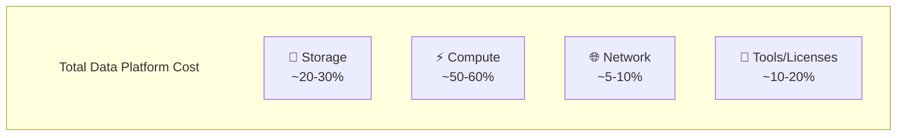

# 💰 Cost Optimization for Data Engineering

> Chiến lược tối ưu chi phí cho Data Platforms

---

## 📋 Mục Lục

1. [Cost Optimization Framework](#-cost-optimization-framework)
2. [Cloud Storage Optimization](#-cloud-storage-optimization)
3. [Compute Optimization](#-compute-optimization)
4. [Query Optimization for Cost](#-query-optimization-for-cost)
5. [Tooling & Automation](#-tooling--automation)
6. [FinOps Best Practices](#-finops-best-practices)

---

## 🎯 Cost Optimization Framework

### The Cost Equation



### Cost Optimization Priority

```
Priority 1: Quick Wins (Days)
├── Delete unused resources
├── Right-size over-provisioned
├── Use spot/preemptible instances
└── Implement auto-shutdown

Priority 2: Medium Effort (Weeks)
├── Storage tiering
├── Query optimization
├── Reserved capacity
└── Data lifecycle policies

Priority 3: Architecture (Months)
├── Re-architect pipelines
├── Change storage formats
├── Migrate to cheaper services
└── Implement data mesh
```

### ROI Calculator

```python
def calculate_optimization_roi(
    current_monthly_cost: float,
    estimated_savings_percent: float,
    implementation_hours: int,
    hourly_rate: float = 100
) -> dict:
    """Calculate ROI for optimization initiative"""
    
    monthly_savings = current_monthly_cost * (estimated_savings_percent / 100)
    implementation_cost = implementation_hours * hourly_rate
    payback_months = implementation_cost / monthly_savings
    annual_net_savings = (monthly_savings * 12) - implementation_cost
    
    return {
        "monthly_savings": monthly_savings,
        "implementation_cost": implementation_cost,
        "payback_months": round(payback_months, 1),
        "annual_net_savings": annual_net_savings,
        "year_1_roi": round(annual_net_savings / implementation_cost * 100, 1)
    }

# Example
result = calculate_optimization_roi(
    current_monthly_cost=50000,
    estimated_savings_percent=30,
    implementation_hours=80
)
# {'monthly_savings': 15000, 'implementation_cost': 8000, 
#  'payback_months': 0.5, 'annual_net_savings': 172000, 'year_1_roi': 2150.0}
```

---

## 💾 Cloud Storage Optimization

### Storage Tiering Strategy

| Tier | AWS | GCP | Azure | Use Case | Cost |
|------|-----|-----|-------|----------|------|
| Hot | S3 Standard | Standard | Hot | Active data, frequent access | $$$ |
| Warm | S3 IA | Nearline | Cool | Monthly access | $$ |
| Cold | S3 Glacier IR | Coldline | Cold | Quarterly access | $ |
| Archive | Glacier Deep | Archive | Archive | Yearly/Compliance | ¢ |

### Lifecycle Policies

```yaml
# AWS S3 Lifecycle Policy
Rules:
  - Id: raw-data-lifecycle
    Filter:
      Prefix: raw/
    Status: Enabled
    Transitions:
      - Days: 30
        StorageClass: STANDARD_IA
      - Days: 90
        StorageClass: GLACIER_IR
      - Days: 365
        StorageClass: DEEP_ARCHIVE
    Expiration:
      Days: 2555  # 7 years for compliance

  - Id: temp-data-cleanup
    Filter:
      Prefix: temp/
    Status: Enabled
    Expiration:
      Days: 7
```

### Data Format Impact

```
File Format Comparison (1TB raw data):

Format      | Storage Size | Scan Speed | Cost/Month (S3)
------------|-------------|-------------|----------------
CSV         | 1000 GB     | Slow       | $23.00
JSON        | 1200 GB     | Slow       | $27.60
Parquet     | 150 GB      | Fast       | $3.45
Parquet+Zstd| 80 GB       | Fast       | $1.84

→ Parquet with compression = 92% storage savings
→ Plus: Faster queries = less compute cost
```

### Partition Pruning Savings

```sql
-- BAD: Full table scan ($5.00 per TB scanned)
SELECT * FROM events 
WHERE event_date = '2024-01-15';
-- Scans entire table: 100TB × $5 = $500

-- GOOD: With date partitioning
SELECT * FROM events 
WHERE event_date = '2024-01-15';
-- Scans 1 partition: 0.3TB × $5 = $1.50

-- 333x cost reduction with partitioning!
```

### Storage Deduplication

```python
# Identify duplicate files
from collections import defaultdict
import hashlib

def find_duplicate_files(bucket_path):
    """Find duplicate files by content hash"""
    hash_to_files = defaultdict(list)
    
    for file in list_files(bucket_path):
        content_hash = hashlib.md5(file.content).hexdigest()
        hash_to_files[content_hash].append(file.path)
    
    duplicates = {h: files for h, files in hash_to_files.items() 
                  if len(files) > 1}
    
    wasted_storage = sum(
        sum(get_size(f) for f in files[1:])  # All but first
        for files in duplicates.values()
    )
    
    return duplicates, wasted_storage
```

---

## ⚡ Compute Optimization

### Right-Sizing Clusters

```
Signs of Over-Provisioning:
├── CPU utilization < 30%
├── Memory utilization < 40%
├── Workers often idle
└── Auto-scale never triggers

Signs of Under-Provisioning:
├── CPU utilization > 85%
├── OOM errors
├── Constant auto-scale at max
└── Job timeouts
```

### Spot/Preemptible Instances

| Provider | Name | Savings | Use Case |
|----------|------|---------|----------|
| AWS | Spot Instances | 60-90% | Batch, fault-tolerant |
| GCP | Preemptible VMs | 60-91% | Dataproc, GKE |
| Azure | Spot VMs | 60-90% | Batch processing |

```python
# Spark on EMR with Spot Instances
spark_config = {
    "spark.dynamicAllocation.enabled": "true",
    "spark.dynamicAllocation.minExecutors": "1",
    "spark.dynamicAllocation.maxExecutors": "100",
    
    # Graceful handling of spot interruption
    "spark.decommission.enabled": "true",
    "spark.storage.decommission.shuffleBlocks.enabled": "true",
}

# EMR Instance Fleet with Spot
instance_fleet = {
    "InstanceFleetType": "CORE",
    "TargetSpotCapacity": 10,
    "TargetOnDemandCapacity": 2,  # Minimum stable capacity
    "LaunchSpecifications": {
        "SpotSpecification": {
            "TimeoutDurationMinutes": 60,
            "TimeoutAction": "SWITCH_TO_ON_DEMAND"
        }
    }
}
```

### Auto-Shutdown Policies

```python
# Databricks cluster auto-termination
cluster_config = {
    "cluster_name": "analytics-cluster",
    "autotermination_minutes": 30,  # Terminate after 30 min idle
    "autoscale": {
        "min_workers": 1,
        "max_workers": 10
    }
}

# Snowflake warehouse auto-suspend
ALTER WAREHOUSE analytics_wh SET
    AUTO_SUSPEND = 60,      -- Suspend after 60 seconds idle
    AUTO_RESUME = TRUE,
    MIN_CLUSTER_COUNT = 1,
    MAX_CLUSTER_COUNT = 3;
```

### Batch Job Optimization

```
Optimization Techniques:
1. Schedule during off-peak (lower spot prices)
2. Use larger instances for shorter time
3. Cache intermediate results
4. Incremental processing instead of full refresh
```

```python
# Incremental vs Full Load Cost Comparison
def estimate_processing_cost(
    full_table_size_gb: float,
    daily_increment_gb: float,
    cost_per_dbu_hour: float = 0.55,
    processing_speed_gb_per_dbu_hour: float = 10
):
    """Compare full load vs incremental costs"""
    
    # Full load daily
    full_load_dbu_hours = full_table_size_gb / processing_speed_gb_per_dbu_hour
    full_load_daily_cost = full_load_dbu_hours * cost_per_dbu_hour
    
    # Incremental daily
    incremental_dbu_hours = daily_increment_gb / processing_speed_gb_per_dbu_hour
    incremental_daily_cost = incremental_dbu_hours * cost_per_dbu_hour
    
    savings_percent = (1 - incremental_daily_cost/full_load_daily_cost) * 100
    
    return {
        "full_load_daily": full_load_daily_cost,
        "incremental_daily": incremental_daily_cost,
        "daily_savings": full_load_daily_cost - incremental_daily_cost,
        "monthly_savings": (full_load_daily_cost - incremental_daily_cost) * 30,
        "savings_percent": round(savings_percent, 1)
    }

# Example: 1TB table with 10GB daily increment
result = estimate_processing_cost(1000, 10)
# {'full_load_daily': 55.0, 'incremental_daily': 0.55, 
#  'daily_savings': 54.45, 'monthly_savings': 1633.5, 'savings_percent': 99.0}
```

---

## 🔍 Query Optimization for Cost

### BigQuery Cost Optimization

```sql
-- 1. Use LIMIT for exploration (doesn't help in BigQuery!)
-- BigQuery scans full columns regardless of LIMIT
-- Use table preview instead

-- 2. Select only needed columns
-- BAD: $5.00 (scans all 100 columns)
SELECT * FROM large_table;

-- GOOD: $0.50 (scans only 10 columns)
SELECT col1, col2, col3 FROM large_table;

-- 3. Use partitioned tables
-- BAD: Full scan
SELECT * FROM events WHERE DATE(event_time) = '2024-01-15';

-- GOOD: Partition pruning
SELECT * FROM events WHERE event_date = '2024-01-15';

-- 4. Use clustering
CREATE TABLE orders
PARTITION BY DATE(order_date)
CLUSTER BY customer_id, product_id
AS SELECT * FROM raw_orders;

-- 5. Use approximate functions
-- EXACT (expensive): 
SELECT COUNT(DISTINCT user_id) FROM events;

-- APPROXIMATE (cheap, ~1% error):
SELECT APPROX_COUNT_DISTINCT(user_id) FROM events;
```

### Snowflake Credit Optimization

```sql
-- 1. Use appropriate warehouse size
-- X-Small for simple queries, Large for complex transforms

-- 2. Set query timeout
ALTER SESSION SET STATEMENT_TIMEOUT_IN_SECONDS = 300;

-- 3. Use result caching
SELECT /* use cache */ customer_id, SUM(revenue)
FROM sales
GROUP BY customer_id;
-- Second run uses cached result (0 credits)

-- 4. Monitor expensive queries
SELECT 
    query_id,
    query_text,
    credits_used_cloud_services,
    execution_time / 1000 / 60 as execution_minutes
FROM snowflake.account_usage.query_history
WHERE start_time > DATEADD(day, -7, CURRENT_TIMESTAMP())
ORDER BY credits_used_cloud_services DESC
LIMIT 20;

-- 5. Materialized views for repeated aggregations
CREATE MATERIALIZED VIEW daily_sales_mv AS
SELECT 
    DATE(order_date) as order_day,
    product_category,
    SUM(revenue) as total_revenue
FROM fact_orders
GROUP BY 1, 2;
```

### Query Cost Estimation

```python
# BigQuery dry run for cost estimation
from google.cloud import bigquery

def estimate_query_cost(query: str, cost_per_tb: float = 5.0) -> dict:
    """Estimate BigQuery query cost before running"""
    client = bigquery.Client()
    
    job_config = bigquery.QueryJobConfig(dry_run=True, use_query_cache=False)
    query_job = client.query(query, job_config=job_config)
    
    bytes_processed = query_job.total_bytes_processed
    tb_processed = bytes_processed / (1024 ** 4)
    estimated_cost = tb_processed * cost_per_tb
    
    return {
        "bytes_processed": bytes_processed,
        "gb_processed": bytes_processed / (1024 ** 3),
        "estimated_cost_usd": round(estimated_cost, 4)
    }

# Before running expensive query
estimate = estimate_query_cost("""
    SELECT * FROM bigquery-public-data.github_repos.commits
""")
print(f"This query will cost: ${estimate['estimated_cost_usd']}")
```

---

## 🔧 Tooling & Automation

### Cost Monitoring Dashboard

```python
# Daily cost tracking script
import boto3
from datetime import datetime, timedelta

def get_daily_costs(days: int = 30) -> list:
    """Get daily AWS costs for data services"""
    client = boto3.client('ce')
    
    end_date = datetime.now().strftime('%Y-%m-%d')
    start_date = (datetime.now() - timedelta(days=days)).strftime('%Y-%m-%d')
    
    response = client.get_cost_and_usage(
        TimePeriod={'Start': start_date, 'End': end_date},
        Granularity='DAILY',
        Metrics=['UnblendedCost'],
        Filter={
            'Dimensions': {
                'Key': 'SERVICE',
                'Values': [
                    'Amazon Simple Storage Service',
                    'Amazon Elastic MapReduce',
                    'AWS Glue',
                    'Amazon Athena',
                    'Amazon Redshift'
                ]
            }
        },
        GroupBy=[
            {'Type': 'DIMENSION', 'Key': 'SERVICE'}
        ]
    )
    
    return response['ResultsByTime']
```

### Automated Cost Alerts

```yaml
# CloudWatch Alarm for cost threshold
AWSTemplateFormatVersion: '2010-09-09'
Resources:
  DataPlatformBudget:
    Type: AWS::Budgets::Budget
    Properties:
      Budget:
        BudgetName: data-platform-monthly
        BudgetLimit:
          Amount: 10000
          Unit: USD
        TimeUnit: MONTHLY
        BudgetType: COST
        CostFilters:
          TagKeyValue:
            - team$data-engineering
      NotificationsWithSubscribers:
        - Notification:
            NotificationType: ACTUAL
            ComparisonOperator: GREATER_THAN
            Threshold: 80
          Subscribers:
            - SubscriptionType: EMAIL
              Address: data-team@company.com
        - Notification:
            NotificationType: FORECASTED
            ComparisonOperator: GREATER_THAN
            Threshold: 100
          Subscribers:
            - SubscriptionType: SNS
              Address: !Ref AlertTopic
```

### Unused Resource Detection

```python
# Find idle/unused resources
def find_unused_resources(days_threshold: int = 30):
    """Identify resources not accessed recently"""
    
    unused = {
        "s3_buckets": [],
        "glue_tables": [],
        "redshift_tables": []
    }
    
    # S3: Check last access time
    s3 = boto3.client('s3')
    for bucket in s3.list_buckets()['Buckets']:
        # Enable S3 Storage Lens for access patterns
        last_accessed = get_bucket_last_access(bucket['Name'])
        if last_accessed > timedelta(days=days_threshold):
            unused["s3_buckets"].append({
                "bucket": bucket['Name'],
                "size_gb": get_bucket_size(bucket['Name']),
                "last_accessed": last_accessed
            })
    
    # Glue: Check table last access
    glue = boto3.client('glue')
    for db in glue.get_databases()['DatabaseList']:
        for table in glue.get_tables(DatabaseName=db['Name'])['TableList']:
            if 'LastAccessTime' in table:
                if table['LastAccessTime'] < datetime.now() - timedelta(days=days_threshold):
                    unused["glue_tables"].append(table['Name'])
    
    return unused
```

---

## 📊 FinOps Best Practices

### Cost Allocation with Tags

```
Required Tags for Data Platform:
├── team: data-engineering
├── project: data-warehouse
├── environment: prod/staging/dev
├── pipeline: daily-etl / realtime-stream
└── cost-center: 12345
```

```python
# Enforce tagging with Terraform
resource "aws_s3_bucket" "data_lake" {
  bucket = "company-data-lake"
  
  tags = {
    Team        = "data-engineering"
    Project     = "data-warehouse"
    Environment = var.environment
    CostCenter  = var.cost_center
    ManagedBy   = "terraform"
  }
}
```

### Cost Optimization Calendar

```
Weekly:
├── Review cost dashboard
├── Check for anomalies
└── Validate auto-shutdown working

Monthly:
├── Review top 10 expensive queries
├── Check storage growth trends
├── Validate reserved capacity usage
└── Update cost forecasts

Quarterly:
├── Re-negotiate contracts
├── Review architecture for savings
├── Update lifecycle policies
├── Reserved capacity planning
```

### Cost vs Performance Trade-offs

| Optimization | Cost Savings | Performance Impact | Recommendation |
|-------------|--------------|-------------------|----------------|
| Spot instances | 60-90% | Possible interruption | Use for batch |
| Lower compression | -10% storage | Faster queries | Balance based on access |
| Smaller warehouse | 50% | Slower queries | Use for dev/test |
| Caching | 80% repeat queries | None | Always enable |
| Precomputation | - | ++ | For frequent queries |

### ROI Tracking Template

```markdown
# Cost Optimization Initiative

## Summary
- **Initiative**: Migrate from JSON to Parquet
- **Investment**: 40 hours engineering time
- **Timeline**: 2 weeks

## Baseline (Before)
- Monthly storage cost: $2,500
- Monthly compute cost: $15,000
- Query latency: 45 seconds avg

## Target (After)
- Monthly storage cost: $500 (-80%)
- Monthly compute cost: $5,000 (-67%)
- Query latency: 5 seconds avg

## Actual Results
- Monthly storage cost: $450 (-82%)
- Monthly compute cost: $4,800 (-68%)
- Query latency: 4 seconds avg

## ROI
- Monthly savings: $12,250
- Implementation cost: $4,000 (40hrs × $100)
- Payback period: 10 days
- Annual savings: $147,000
```

---

## 🔗 Liên Kết

- [Cloud Platforms](10_Cloud_Platforms.md)
- [Data Formats & Storage](06_Data_Formats_Storage.md)
- [SQL Mastery](02_SQL_Mastery_Guide.md)
- [Monitoring & Observability](12_Monitoring_Observability.md)

---

*Cập nhật: February 2026*
