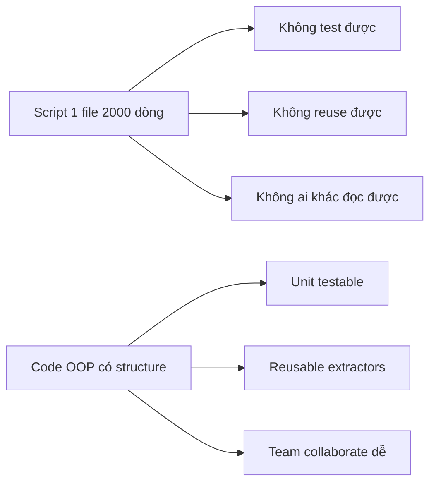

# 🏗️ OOP & Design Patterns cho Data Engineering

> DE vẫn là SWE. Code pipeline tốt = code sạch, dễ maintain, dễ test.

---

## 📋 Mục Lục

1. [Tại Sao DE Cần OOP?](#tại-sao-de-cần-oop)
2. [4 Pillars of OOP](#4-pillars-of-oop)
3. [SOLID Principles cho DE](#solid-principles-cho-de)
4. [Design Patterns Hay Dùng Trong DE](#design-patterns-hay-dùng-trong-de)
5. [Anti-Patterns OOP Trong DE](#anti-patterns-oop-trong-de)

---

## Tại Sao DE Cần OOP?



### Thực tế

```
Junior DE code:
- 1 file main.py, 800 dòng
- Tất cả logic trong 1 function
- Copy-paste khi cần thêm source mới
- "It works" nhưng impossible to maintain

Senior DE code:
- Package structure rõ ràng
- Classes cho mỗi responsibility
- Interface cho extensibility
- Unit tests cover từng component
```

---

## 4 Pillars of OOP

### 1. Encapsulation - Đóng gói

> Giấu implementation details, expose interface

**Trong DE context:**

```python
# ❌ BAD: Expose everything
class Pipeline:
    def __init__(self):
        self.connection_string = "postgresql://..."
        self.data = []
        self.errors = []
    
    def run(self):
        # Caller có thể modify connection_string trực tiếp
        pass

# ✅ GOOD: Encapsulate internals
class Pipeline:
    def __init__(self, config: PipelineConfig):
        self._connection = self._create_connection(config)
        self._data: list = []
        self._errors: list = []
    
    def run(self) -> PipelineResult:
        """Public interface - caller không cần biết internals"""
        self._extract()
        self._transform()
        self._load()
        return PipelineResult(
            records_processed=len(self._data),
            errors=self._errors
        )
    
    def _create_connection(self, config):
        """Private - implementation detail"""
        pass
    
    def _extract(self):
        """Private - implementation detail"""
        pass
```

**Tại sao quan trọng cho DE:**
- Connection strings, credentials phải private
- Internal state (buffers, caches) không nên expose
- Public API clear → Team khác dùng được

---

### 2. Abstraction - Trừu tượng hóa

> Define "cái gì" mà không define "làm sao"

```python
from abc import ABC, abstractmethod

# Abstract base cho tất cả extractors
class BaseExtractor(ABC):
    """Define WHAT an extractor does, not HOW"""
    
    @abstractmethod
    def connect(self) -> None:
        """Establish connection to source"""
        pass
    
    @abstractmethod
    def extract(self, query: str) -> list[dict]:
        """Extract data from source"""
        pass
    
    @abstractmethod
    def close(self) -> None:
        """Clean up resources"""
        pass
    
    # Template method - concrete behavior
    def extract_with_retry(self, query: str, max_retries: int = 3) -> list[dict]:
        for attempt in range(max_retries):
            try:
                self.connect()
                return self.extract(query)
            except Exception as e:
                if attempt == max_retries - 1:
                    raise
                time.sleep(2 ** attempt)
            finally:
                self.close()
```

**Tại sao quan trọng cho DE:**
- Pipeline có nhiều sources (API, DB, S3, Kafka...)
- Abstraction cho phép swap source mà không đổi pipeline logic
- New source = New class implementing interface, zero changes to existing code

---

### 3. Inheritance - Kế thừa

> Reuse code từ parent class

```python
class BaseExtractor(ABC):
    def __init__(self, config: dict):
        self.config = config
        self.logger = logging.getLogger(self.__class__.__name__)
        self._metrics = MetricsCollector()
    
    def extract_with_metrics(self, query: str) -> list[dict]:
        start = time.time()
        self.logger.info(f"Starting extraction: {query[:50]}...")
        
        data = self.extract(query)
        
        duration = time.time() - start
        self._metrics.record("extraction_duration", duration)
        self._metrics.record("records_extracted", len(data))
        self.logger.info(f"Extracted {len(data)} records in {duration:.2f}s")
        
        return data

# Các con chỉ cần implement extract()
class PostgresExtractor(BaseExtractor):
    def connect(self):
        self._conn = psycopg2.connect(**self.config)
    
    def extract(self, query: str) -> list[dict]:
        cursor = self._conn.cursor(cursor_factory=RealDictCursor)
        cursor.execute(query)
        return cursor.fetchall()
    
    def close(self):
        self._conn.close()

class S3Extractor(BaseExtractor):
    def connect(self):
        self._client = boto3.client("s3", **self.config)
    
    def extract(self, query: str) -> list[dict]:
        # query = "s3://bucket/prefix/"
        obj = self._client.get_object(Bucket=..., Key=...)
        return pd.read_parquet(obj["Body"]).to_dict("records")
    
    def close(self):
        pass  # boto3 handles cleanup

class APIExtractor(BaseExtractor):
    def connect(self):
        self._session = requests.Session()
        self._session.headers.update({"Authorization": f"Bearer {self.config['token']}"})
    
    def extract(self, query: str) -> list[dict]:
        response = self._session.get(query)
        response.raise_for_status()
        return response.json()["data"]
    
    def close(self):
        self._session.close()
```

**Trong DE:**
- Logging, metrics, retry logic → Base class
- Source-specific logic → Child class
- Thêm source mới = Thêm 1 class nhỏ

---

### 4. Polymorphism - Đa hình

> Cùng interface, khác behavior

```python
def run_pipeline(extractor: BaseExtractor, query: str, loader: BaseLoader):
    """
    Function này không cần biết extractor/loader cụ thể là gì.
    Postgres? S3? API? Không quan trọng.
    Miễn implement đúng interface.
    """
    data = extractor.extract_with_metrics(query)
    transformed = transform(data)
    loader.load(transformed)

# Cùng function, khác behavior:
run_pipeline(PostgresExtractor(pg_config), "SELECT * FROM users", BigQueryLoader(bq_config))
run_pipeline(APIExtractor(api_config), "https://api.example.com/data", S3Loader(s3_config))
run_pipeline(S3Extractor(s3_config), "s3://bucket/data/", SnowflakeLoader(sf_config))
```

**Tại sao quan trọng cho DE:**
- Pipeline orchestrator không cần biết source/destination details
- Dễ test (mock extractors/loaders)
- Dễ thêm source/destination mới

---

## SOLID Principles cho DE

### S - Single Responsibility

```python
# ❌ BAD: 1 class làm mọi thứ
class DataPipeline:
    def extract_from_api(self): ...
    def clean_data(self): ...
    def validate_schema(self): ...
    def load_to_warehouse(self): ...
    def send_slack_alert(self): ...
    def update_dashboard(self): ...

# ✅ GOOD: Mỗi class 1 trách nhiệm
class APIExtractor:
    def extract(self): ...

class DataCleaner:
    def clean(self, data): ...

class SchemaValidator:
    def validate(self, data, schema): ...

class WarehouseLoader:
    def load(self, data): ...

class AlertService:
    def send(self, message): ...
```

### O - Open/Closed

```python
# ✅ Open for extension, closed for modification
# Thêm source mới = Thêm class, KHÔNG sửa code cũ

class ExtractorFactory:
    _registry: dict[str, type[BaseExtractor]] = {}
    
    @classmethod
    def register(cls, name: str, extractor_class: type[BaseExtractor]):
        cls._registry[name] = extractor_class
    
    @classmethod
    def create(cls, name: str, config: dict) -> BaseExtractor:
        if name not in cls._registry:
            raise ValueError(f"Unknown extractor: {name}")
        return cls._registry[name](config)

# Register extractors
ExtractorFactory.register("postgres", PostgresExtractor)
ExtractorFactory.register("s3", S3Extractor)
ExtractorFactory.register("api", APIExtractor)

# Thêm source mới chỉ cần 1 dòng:
ExtractorFactory.register("kafka", KafkaExtractor)
```

### L - Liskov Substitution

```python
# Mọi child phải thay thế được parent mà không break

# ❌ BAD: Child thay đổi behavior
class CachedExtractor(BaseExtractor):
    def extract(self, query: str) -> list[dict]:
        # Returns cached data, format khác!
        return {"cached": True, "data": [...]}  # Wrong return type!

# ✅ GOOD: Child giữ đúng contract
class CachedExtractor(BaseExtractor):
    def __init__(self, config, cache: Cache):
        super().__init__(config)
        self._cache = cache
    
    def extract(self, query: str) -> list[dict]:
        cached = self._cache.get(query)
        if cached:
            return cached  # Same return type: list[dict]
        
        data = super().extract(query)
        self._cache.set(query, data)
        return data  # Same return type: list[dict]
```

### I - Interface Segregation

```python
# ❌ BAD: Fat interface
class DataSource(ABC):
    @abstractmethod
    def connect(self): ...
    @abstractmethod
    def extract(self): ...
    @abstractmethod
    def stream(self): ...        # Không phải source nào cũng stream
    @abstractmethod
    def subscribe(self): ...     # Chỉ Kafka-like mới cần
    @abstractmethod
    def acknowledge(self): ...   # Chỉ queue mới cần

# ✅ GOOD: Small, focused interfaces
class Extractable(ABC):
    @abstractmethod
    def extract(self, query: str) -> list[dict]: ...

class Streamable(ABC):
    @abstractmethod
    def stream(self) -> Iterator[dict]: ...

class Subscribable(ABC):
    @abstractmethod
    def subscribe(self, topic: str): ...
    @abstractmethod
    def acknowledge(self, offset: int): ...

# Classes implement chỉ interfaces cần thiết
class PostgresSource(Extractable):
    def extract(self, query): ...

class KafkaSource(Streamable, Subscribable):
    def stream(self): ...
    def subscribe(self, topic): ...
    def acknowledge(self, offset): ...
```

### D - Dependency Inversion

```python
# ❌ BAD: High-level depends on low-level
class Pipeline:
    def __init__(self):
        self.extractor = PostgresExtractor()  # Hardcoded!
        self.loader = BigQueryLoader()        # Hardcoded!

# ✅ GOOD: Depend on abstractions
class Pipeline:
    def __init__(self, extractor: BaseExtractor, loader: BaseLoader):
        self.extractor = extractor
        self.loader = loader
    
    def run(self, query: str):
        data = self.extractor.extract(query)
        self.loader.load(data)

# Inject dependencies
pipeline = Pipeline(
    extractor=PostgresExtractor(config),
    loader=BigQueryLoader(config)
)

# Easy to test!
pipeline_test = Pipeline(
    extractor=MockExtractor(),
    loader=MockLoader()
)
```

---

## Design Patterns Hay Dùng Trong DE

### 1. Factory Pattern

> Tạo objects mà không cần biết class cụ thể

```python
class TransformFactory:
    """Create transformer based on data type"""
    
    @staticmethod
    def create(data_type: str) -> BaseTransformer:
        transformers = {
            "json": JSONTransformer(),
            "csv": CSVTransformer(),
            "parquet": ParquetTransformer(),
            "avro": AvroTransformer(),
        }
        if data_type not in transformers:
            raise ValueError(f"Unsupported: {data_type}")
        return transformers[data_type]

# Usage: Config-driven pipeline
for source in config["sources"]:
    transformer = TransformFactory.create(source["format"])
    data = transformer.transform(raw_data)
```

**Use case DE:** Config-driven pipelines, multi-format ingestion

### 2. Strategy Pattern

> Thay đổi algorithm tại runtime

```python
class PartitionStrategy(ABC):
    @abstractmethod
    def partition(self, data: pd.DataFrame) -> dict[str, pd.DataFrame]:
        pass

class DatePartition(PartitionStrategy):
    def __init__(self, column: str, granularity: str = "day"):
        self.column = column
        self.granularity = granularity
    
    def partition(self, data):
        return {str(k): v for k, v in data.groupby(
            data[self.column].dt.date
        )}

class HashPartition(PartitionStrategy):
    def __init__(self, column: str, num_buckets: int):
        self.column = column
        self.num_buckets = num_buckets
    
    def partition(self, data):
        data["_bucket"] = data[self.column].apply(
            lambda x: hash(x) % self.num_buckets
        )
        return {str(k): v for k, v in data.groupby("_bucket")}

# Usage
class DataWriter:
    def __init__(self, strategy: PartitionStrategy):
        self.strategy = strategy
    
    def write(self, data: pd.DataFrame, path: str):
        partitions = self.strategy.partition(data)
        for key, partition_data in partitions.items():
            partition_data.to_parquet(f"{path}/{key}.parquet")

# Swap strategy at runtime
writer = DataWriter(DatePartition("created_at"))
writer = DataWriter(HashPartition("user_id", num_buckets=16))
```

**Use case DE:** Partitioning strategies, compression strategies, quality check strategies

### 3. Builder Pattern

> Xây dựng complex objects step-by-step

```python
class PipelineBuilder:
    def __init__(self, name: str):
        self._name = name
        self._extractors: list[BaseExtractor] = []
        self._transformers: list[BaseTransformer] = []
        self._validators: list[BaseValidator] = []
        self._loader: BaseLoader | None = None
        self._alerts: list[AlertChannel] = []
    
    def add_source(self, extractor: BaseExtractor) -> "PipelineBuilder":
        self._extractors.append(extractor)
        return self
    
    def add_transform(self, transformer: BaseTransformer) -> "PipelineBuilder":
        self._transformers.append(transformer)
        return self
    
    def add_validation(self, validator: BaseValidator) -> "PipelineBuilder":
        self._validators.append(validator)
        return self
    
    def set_destination(self, loader: BaseLoader) -> "PipelineBuilder":
        self._loader = loader
        return self
    
    def add_alert(self, channel: AlertChannel) -> "PipelineBuilder":
        self._alerts.append(channel)
        return self
    
    def build(self) -> Pipeline:
        if not self._extractors:
            raise ValueError("At least one source required")
        if not self._loader:
            raise ValueError("Destination required")
        return Pipeline(
            name=self._name,
            extractors=self._extractors,
            transformers=self._transformers,
            validators=self._validators,
            loader=self._loader,
            alerts=self._alerts
        )

# Fluent API usage
pipeline = (
    PipelineBuilder("daily_orders")
    .add_source(PostgresExtractor(pg_config))
    .add_source(APIExtractor(api_config))
    .add_transform(CleanTransformer())
    .add_transform(EnrichTransformer())
    .add_validation(SchemaValidator(schema))
    .add_validation(RowCountValidator(min_rows=1000))
    .set_destination(BigQueryLoader(bq_config))
    .add_alert(SlackAlert("#data-alerts"))
    .build()
)
```

**Use case DE:** Complex pipeline configuration, query builder

### 4. Observer Pattern

> Notify khi event xảy ra

```python
class PipelineEvent:
    STARTED = "started"
    COMPLETED = "completed"
    FAILED = "failed"
    DATA_QUALITY_ISSUE = "dq_issue"

class PipelineObserver(ABC):
    @abstractmethod
    def on_event(self, event: str, context: dict): ...

class SlackNotifier(PipelineObserver):
    def on_event(self, event, context):
        if event == PipelineEvent.FAILED:
            send_slack(f"🔴 Pipeline {context['name']} failed: {context['error']}")
        elif event == PipelineEvent.COMPLETED:
            send_slack(f"✅ Pipeline {context['name']} completed: {context['records']} records")

class MetricsCollector(PipelineObserver):
    def on_event(self, event, context):
        statsd.increment(f"pipeline.{event}", tags=[f"name:{context['name']}"])

class AuditLogger(PipelineObserver):
    def on_event(self, event, context):
        audit_log.info(f"Pipeline {context['name']}: {event}", extra=context)

# Pipeline emits events
class Pipeline:
    def __init__(self):
        self._observers: list[PipelineObserver] = []
    
    def add_observer(self, observer: PipelineObserver):
        self._observers.append(observer)
    
    def _notify(self, event: str, context: dict):
        for observer in self._observers:
            observer.on_event(event, context)
    
    def run(self):
        self._notify(PipelineEvent.STARTED, {"name": self.name})
        try:
            result = self._execute()
            self._notify(PipelineEvent.COMPLETED, {"name": self.name, "records": result.count})
        except Exception as e:
            self._notify(PipelineEvent.FAILED, {"name": self.name, "error": str(e)})
            raise
```

**Use case DE:** Pipeline monitoring, alerting, audit logging

### 5. Decorator Pattern

> Thêm behavior mà không sửa code gốc

```python
class RetryDecorator(BaseExtractor):
    """Wrap any extractor with retry logic"""
    
    def __init__(self, extractor: BaseExtractor, max_retries: int = 3):
        self._extractor = extractor
        self._max_retries = max_retries
    
    def connect(self):
        self._extractor.connect()
    
    def extract(self, query: str) -> list[dict]:
        for attempt in range(self._max_retries):
            try:
                return self._extractor.extract(query)
            except Exception as e:
                if attempt == self._max_retries - 1:
                    raise
                time.sleep(2 ** attempt)
    
    def close(self):
        self._extractor.close()

class CacheDecorator(BaseExtractor):
    """Wrap any extractor with caching"""
    
    def __init__(self, extractor: BaseExtractor, cache: Redis, ttl: int = 3600):
        self._extractor = extractor
        self._cache = cache
        self._ttl = ttl
    
    def extract(self, query: str) -> list[dict]:
        cache_key = hashlib.md5(query.encode()).hexdigest()
        cached = self._cache.get(cache_key)
        if cached:
            return json.loads(cached)
        
        data = self._extractor.extract(query)
        self._cache.setex(cache_key, self._ttl, json.dumps(data))
        return data

# Stack decorators
extractor = PostgresExtractor(config)
extractor = RetryDecorator(extractor, max_retries=3)
extractor = CacheDecorator(extractor, redis_client, ttl=3600)
# Now: PostgresExtractor with retry AND caching!
```

**Use case DE:** Retry, caching, logging, metrics — cross-cutting concerns

---

## Anti-Patterns OOP Trong DE

### 1. Over-Engineering

```python
# ❌ BAD: 15 classes cho 1 simple ETL
class AbstractExtractorFactoryProviderStrategy:
    ...

# ✅ GOOD: Phù hợp với complexity
# Pipeline đơn giản → Script đơn giản
# Pipeline phức tạp → OOP structure
```

**Rule:** Nếu pipeline chỉ có 1 source, 1 dest, không cần Factory. Start simple, refactor khi cần.

### 2. Inheritance Hell

```python
# ❌ BAD: Quá nhiều tầng kế thừa
class BaseExtractor: ...
class DatabaseExtractor(BaseExtractor): ...
class SQLExtractor(DatabaseExtractor): ...
class PostgresExtractor(SQLExtractor): ...
class PostgresWithSSLExtractor(PostgresExtractor): ...

# ✅ GOOD: Prefer composition over inheritance
class PostgresExtractor(BaseExtractor):
    def __init__(self, connection: ConnectionManager, ssl: SSLConfig = None):
        self._connection = connection  # Composition!
        self._ssl = ssl
```

### 3. God Class

```python
# ❌ BAD: 1 class biết tất cả
class DataPlatform:
    def extract_postgres(self): ...
    def extract_api(self): ...
    def transform_json(self): ...
    def validate_schema(self): ...
    def load_bigquery(self): ...
    def send_email(self): ...
    def update_catalog(self): ...
    def run_dbt(self): ...
    # 50 more methods...

# ✅ GOOD: Small, focused classes
# Xem SOLID - Single Responsibility ở trên
```

---

## Khi Nào Dùng OOP vs Functional?

| Situation | Approach | Tại sao |
|-----------|----------|---------|
| Pipeline with many sources | OOP (Abstract classes) | Polymorphism |
| Data transformations | Functional (pure functions) | No side effects |
| Stateful processing | OOP (encapsulation) | Manage state |
| Config-driven pipeline | OOP (Factory) | Dynamic creation |
| One-off script | Neither (just script) | Keep it simple |

```python
# Mix both: OOP for structure, functional for transforms

class Pipeline:  # OOP for structure
    def run(self):
        data = self.extractor.extract(query)
        data = transform_data(data)  # Functional for transforms
        self.loader.load(data)

# Pure functions for transforms
def clean_nulls(df: pd.DataFrame) -> pd.DataFrame:
    return df.dropna()

def standardize_dates(df: pd.DataFrame) -> pd.DataFrame:
    df["date"] = pd.to_datetime(df["date"])
    return df

# Compose transforms
def transform_data(df: pd.DataFrame) -> pd.DataFrame:
    return (
        df
        .pipe(clean_nulls)
        .pipe(standardize_dates)
        .pipe(add_computed_columns)
    )
```

---

## Checklist

- [ ] Mỗi class có 1 trách nhiệm rõ ràng
- [ ] Dùng abstract base classes cho extensibility
- [ ] Dependency injection (không hardcode dependencies)
- [ ] Prefer composition over inheritance
- [ ] Methods ngắn (<20 dòng)
- [ ] Naming rõ ràng (class = noun, method = verb)
- [ ] Don't over-engineer simple pipelines

---

## Liên Kết

- [15_Clean_Code_Data_Engineering](15_Clean_Code_Data_Engineering.md)
- [13_Python_Data_Engineering](13_Python_Data_Engineering.md)
- [11_Testing_CICD](11_Testing_CICD.md) - Testing OOP code
- [Design Patterns (mindset)](../mindset/01_Design_Patterns.md)

---

*OOP không phải mục đích, mà là công cụ để code dễ maintain, test, và extend*
