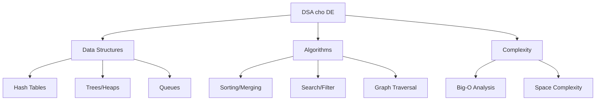

# 🧮 Data Structures & Algorithms cho DE

> Không cần LeetCode Hard, nhưng cần hiểu đúng DS&A để viết pipeline hiệu quả

---

## 📋 Mục Lục

1. [DE Cần DSA Gì?](#de-cần-dsa-gì)
2. [Data Structures Thiết Yếu](#data-structures-thiết-yếu)
3. [Algorithms Hay Dùng](#algorithms-hay-dùng)
4. [Complexity Analysis](#complexity-analysis)
5. [DSA Trong Interview DE](#dsa-trong-interview-de)

---

## DE Cần DSA Gì?



### DE KHÔNG cần

| Không cần | Tại sao |
|-----------|---------|
| Dynamic Programming hard | DE không build compilers |
| Complex graph algorithms | Ngoại trừ DAG scheduling |
| Competitive programming tricks | Thực tế không cần |
| Red-Black Tree implementation | Dùng library sẵn |

### DE CẦN

| Cần | Tại sao |
|-----|---------|
| Hash tables (dict) | JOIN logic, dedup, lookup |
| Sorting | Merge sorted files, ORDER BY |
| Queue/Stack | Pipeline orchestration, BFS/DFS |
| Tree structures | Partition pruning, indexes |
| Complexity analysis | Biết code có scale không |
| Streaming algorithms | Approximate counting, sketches |

---

## Data Structures Thiết Yếu

### 1. Hash Table (Dictionary)

> Cấu trúc quan trọng nhất cho DE

**Tại sao:**
- JOIN = Hash lookup
- Deduplication = Hash set
- GROUP BY = Hash aggregation
- Caching = Hash map

```python
# === USE CASE 1: Deduplication ===
def deduplicate_records(records: list[dict], key: str) -> list[dict]:
    """O(n) dedup using set"""
    seen = set()
    unique = []
    for record in records:
        record_key = record[key]
        if record_key not in seen:
            seen.add(record_key)
            unique.append(record)
    return unique

# VS naive approach: O(n²)
# for each record, check if exists in unique list → SLOW!

# === USE CASE 2: Hash JOIN ===
def hash_join(left: list[dict], right: list[dict], key: str) -> list[dict]:
    """
    O(n + m) hash join - same concept as Spark's Hash Join
    
    1. Build phase: Hash the smaller table
    2. Probe phase: Scan larger table, lookup in hash
    """
    # Build hash table from right (smaller) table
    right_index = {}
    for row in right:
        right_index[row[key]] = row
    
    # Probe with left (larger) table
    result = []
    for row in left:
        match = right_index.get(row[key])
        if match:
            result.append({**row, **match})
    
    return result

# Complexity: O(n + m) vs Nested Loop Join O(n × m)
# 1M × 100K: Hash = instant, Nested = hours

# === USE CASE 3: Counting/Aggregation ===
from collections import Counter, defaultdict

def aggregate_by_key(records: list[dict], group_key: str, value_key: str) -> dict:
    """GROUP BY SUM() in Python"""
    result = defaultdict(float)
    for record in records:
        result[record[group_key]] += record[value_key]
    return dict(result)

# Example
orders = [
    {"category": "electronics", "amount": 100},
    {"category": "books", "amount": 30},
    {"category": "electronics", "amount": 200},
]
print(aggregate_by_key(orders, "category", "amount"))
# {"electronics": 300, "books": 30}
```

**Khi nào Hash Table không tốt:**
- Data quá lớn cho memory → External hash join (Spark)
- Need ordered access → TreeMap thay vì HashMap

---

### 2. Queue & Stack

> Pipeline orchestration, BFS/DFS, buffering

```python
from collections import deque

# === USE CASE 1: Task Queue (BFS for DAG) ===
def execute_dag(dag: dict[str, list[str]]) -> list[str]:
    """
    Topological sort using Kahn's algorithm (BFS)
    Same concept Airflow uses for DAG execution!
    """
    # Calculate in-degree
    in_degree = {node: 0 for node in dag}
    for node, deps in dag.items():
        for dep in deps:
            in_degree[dep] = in_degree.get(dep, 0) + 1
    
    # Start with nodes that have no dependencies
    queue = deque([node for node, degree in in_degree.items() if degree == 0])
    execution_order = []
    
    while queue:
        node = queue.popleft()
        execution_order.append(node)
        
        for dependent in dag.get(node, []):
            in_degree[dependent] -= 1
            if in_degree[dependent] == 0:
                queue.append(dependent)
    
    return execution_order

# Example DAG (like Airflow)
dag = {
    "extract_orders": ["transform_orders"],
    "extract_customers": ["transform_orders"],
    "transform_orders": ["load_warehouse"],
    "load_warehouse": ["update_dashboard"],
    "update_dashboard": [],
}
print(execute_dag(dag))
# ['extract_orders', 'extract_customers', 'transform_orders', 'load_warehouse', 'update_dashboard']

# === USE CASE 2: Buffered Writer ===
class BufferedWriter:
    """Buffer records then flush in batches"""
    
    def __init__(self, batch_size: int = 1000):
        self._buffer: deque = deque()
        self._batch_size = batch_size
    
    def add(self, record: dict):
        self._buffer.append(record)
        if len(self._buffer) >= self._batch_size:
            self.flush()
    
    def flush(self):
        batch = []
        while self._buffer and len(batch) < self._batch_size:
            batch.append(self._buffer.popleft())
        if batch:
            self._write_batch(batch)  # Bulk insert

# === USE CASE 3: Rate Limiter (Sliding Window) ===
class RateLimiter:
    """Limit API calls using sliding window queue"""
    
    def __init__(self, max_calls: int, window_seconds: int):
        self._calls: deque = deque()
        self._max_calls = max_calls
        self._window = window_seconds
    
    def can_call(self) -> bool:
        now = time.time()
        # Remove old entries
        while self._calls and self._calls[0] < now - self._window:
            self._calls.popleft()
        
        if len(self._calls) < self._max_calls:
            self._calls.append(now)
            return True
        return False
```

---

### 3. Heap (Priority Queue)

> Top-K queries, merge sorted streams, scheduling

```python
import heapq

# === USE CASE 1: Top-K Elements ===
def top_k_customers(records: list[dict], k: int) -> list[dict]:
    """
    Find top K customers by revenue
    O(n log k) - much better than O(n log n) sorting all
    """
    return heapq.nlargest(k, records, key=lambda x: x["revenue"])

# === USE CASE 2: Merge K Sorted Files ===
def merge_sorted_files(file_paths: list[str]) -> Iterator[dict]:
    """
    K-way merge of sorted files
    Same concept as Spark's merge sort!
    O(N log K) where N = total records, K = number of files
    """
    files = [open(f) for f in file_paths]
    readers = [csv.DictReader(f) for f in files]
    
    # Initialize heap with first row from each file
    heap = []
    for i, reader in enumerate(readers):
        row = next(reader, None)
        if row:
            heapq.heappush(heap, (row["sort_key"], i, row))
    
    # Merge
    while heap:
        _, file_idx, row = heapq.heappop(heap)
        yield row
        
        next_row = next(readers[file_idx], None)
        if next_row:
            heapq.heappush(heap, (next_row["sort_key"], file_idx, next_row))
    
    for f in files:
        f.close()

# === USE CASE 3: Task Scheduler (Priority) ===
class TaskScheduler:
    """Schedule tasks by priority"""
    
    def __init__(self):
        self._tasks = []  # Min-heap
        self._counter = 0
    
    def add_task(self, priority: int, task_name: str):
        # Lower priority = higher urgency
        heapq.heappush(self._tasks, (priority, self._counter, task_name))
        self._counter += 1
    
    def get_next_task(self) -> str:
        _, _, task = heapq.heappop(self._tasks)
        return task
```

---

### 4. Tree Structures

> Partition pruning, indexes, hierarchical data

```python
# === USE CASE 1: Partition Pruning (Simplified) ===
class PartitionTree:
    """
    How query engines skip irrelevant partitions
    Concept behind Hive/Iceberg/Delta partition pruning
    """
    def __init__(self):
        self.root = {}  # year -> month -> day -> file_paths
    
    def add_partition(self, year: int, month: int, day: int, path: str):
        self.root.setdefault(year, {}).setdefault(month, {}).setdefault(day, []).append(path)
    
    def get_files(self, year: int = None, month: int = None, day: int = None) -> list[str]:
        """Prune partitions - only return relevant files"""
        files = []
        
        years = [year] if year else self.root.keys()
        for y in years:
            if y not in self.root:
                continue
            months = [month] if month else self.root[y].keys()
            for m in months:
                if m not in self.root[y]:
                    continue
                days = [day] if day else self.root[y][m].keys()
                for d in days:
                    if d in self.root[y][m]:
                        files.extend(self.root[y][m][d])
        
        return files

# Without pruning: scan ALL 365 files
# With pruning (WHERE date = '2024-01-15'): scan 1 file!

# === USE CASE 2: Trie for String Matching ===
class Trie:
    """
    Used in: Data catalogs, autocomplete for column search
    O(m) lookup where m = string length
    """
    def __init__(self):
        self.children = {}
        self.is_end = False
        self.value = None
    
    def insert(self, key: str, value: any):
        node = self
        for char in key:
            if char not in node.children:
                node.children[char] = Trie()
            node = node.children[char]
        node.is_end = True
        node.value = value
    
    def search_prefix(self, prefix: str) -> list:
        """Find all entries matching prefix"""
        node = self
        for char in prefix:
            if char not in node.children:
                return []
            node = node.children[char]
        
        results = []
        self._collect(node, prefix, results)
        return results
    
    def _collect(self, node, prefix, results):
        if node.is_end:
            results.append((prefix, node.value))
        for char, child in node.children.items():
            self._collect(child, prefix + char, results)

# Usage: Column search in data catalog
catalog = Trie()
catalog.insert("orders.order_id", {"type": "INT", "table": "orders"})
catalog.insert("orders.order_date", {"type": "DATE", "table": "orders"})
catalog.insert("orders.order_amount", {"type": "DECIMAL", "table": "orders"})

print(catalog.search_prefix("orders.order"))
# Returns all 3 columns starting with "orders.order"
```

---

### 5. Bloom Filter

> Probabilistic data structure cho membership testing

```python
import hashlib
import math

class BloomFilter:
    """
    Used in: 
    - Spark JOIN optimization (avoid shuffle for no-match keys)
    - Parquet/ORC row group skipping
    - Dedup checking at scale
    
    False positives possible, false negatives NEVER
    """
    
    def __init__(self, expected_items: int, false_positive_rate: float = 0.01):
        self.size = self._optimal_size(expected_items, false_positive_rate)
        self.num_hashes = self._optimal_hashes(self.size, expected_items)
        self.bits = [False] * self.size
    
    def _optimal_size(self, n, p):
        return int(-n * math.log(p) / (math.log(2) ** 2))
    
    def _optimal_hashes(self, m, n):
        return int(m / n * math.log(2))
    
    def _hashes(self, item: str) -> list[int]:
        positions = []
        for i in range(self.num_hashes):
            h = hashlib.md5(f"{item}_{i}".encode()).hexdigest()
            positions.append(int(h, 16) % self.size)
        return positions
    
    def add(self, item: str):
        for pos in self._hashes(item):
            self.bits[pos] = True
    
    def might_contain(self, item: str) -> bool:
        """True = MAYBE exists, False = DEFINITELY not exists"""
        return all(self.bits[pos] for pos in self._hashes(item))

# Example: Skip expensive JOIN operation
seen_keys = BloomFilter(expected_items=10_000_000)

# Build phase
for record in dimension_table:
    seen_keys.add(record["id"])

# Probe phase - skip records that definitely don't match
for record in fact_table:
    if seen_keys.might_contain(record["dim_id"]):
        # Might match - do actual lookup
        perform_join(record)
    else:
        # Definitely no match - skip entirely!
        pass
```

---

## Algorithms Hay Dùng

### 1. Sorting & Merging

```python
# External merge sort - when data > memory
def external_sort(input_file: str, output_file: str, chunk_size: int = 100_000):
    """
    Same concept as Spark's sort-merge join
    1. Sort chunks that fit in memory
    2. Merge sorted chunks using K-way merge
    """
    # Phase 1: Sort chunks
    chunk_files = []
    chunk = []
    for record in read_records(input_file):
        chunk.append(record)
        if len(chunk) >= chunk_size:
            chunk.sort(key=lambda x: x["sort_key"])
            fname = write_chunk(chunk)
            chunk_files.append(fname)
            chunk = []
    
    if chunk:
        chunk.sort(key=lambda x: x["sort_key"])
        chunk_files.append(write_chunk(chunk))
    
    # Phase 2: K-way merge (using heap)
    merge_sorted_files(chunk_files, output_file)
```

### 2. Two-Pointer / Sliding Window

```python
# === Sliding Window for moving averages ===
def moving_average(data: list[float], window: int) -> list[float]:
    """
    O(n) sliding window
    Used in: Real-time metrics, anomaly detection
    """
    result = []
    window_sum = sum(data[:window])
    result.append(window_sum / window)
    
    for i in range(window, len(data)):
        window_sum += data[i] - data[i - window]
        result.append(window_sum / window)
    
    return result

# === Merge sorted streams (like Flink's merge) ===
def merge_two_sorted(stream_a: Iterator, stream_b: Iterator) -> Iterator:
    """Two-pointer merge"""
    a = next(stream_a, None)
    b = next(stream_b, None)
    
    while a is not None and b is not None:
        if a["timestamp"] <= b["timestamp"]:
            yield a
            a = next(stream_a, None)
        else:
            yield b
            b = next(stream_b, None)
    
    # Drain remaining
    while a is not None:
        yield a
        a = next(stream_a, None)
    while b is not None:
        yield b
        b = next(stream_b, None)
```

### 3. Consistent Hashing

```python
import bisect
import hashlib

class ConsistentHash:
    """
    Used in: 
    - Kafka partition assignment
    - Database sharding
    - Cache distribution
    
    Add/remove nodes affects only 1/N keys (vs rehashing ALL)
    """
    
    def __init__(self, replicas: int = 100):
        self._replicas = replicas
        self._ring: list[int] = []
        self._nodes: dict[int, str] = {}
    
    def add_node(self, node: str):
        for i in range(self._replicas):
            key = self._hash(f"{node}:{i}")
            bisect.insort(self._ring, key)
            self._nodes[key] = node
    
    def remove_node(self, node: str):
        for i in range(self._replicas):
            key = self._hash(f"{node}:{i}")
            self._ring.remove(key)
            del self._nodes[key]
    
    def get_node(self, item: str) -> str:
        """Which node should handle this item?"""
        key = self._hash(item)
        idx = bisect.bisect_right(self._ring, key)
        if idx >= len(self._ring):
            idx = 0
        return self._nodes[self._ring[idx]]
    
    def _hash(self, key: str) -> int:
        return int(hashlib.md5(key.encode()).hexdigest(), 16)

# Example: Distribute data across 3 partitions
ring = ConsistentHash()
ring.add_node("partition_0")
ring.add_node("partition_1")
ring.add_node("partition_2")

print(ring.get_node("user_123"))  # → "partition_1"
print(ring.get_node("user_456"))  # → "partition_0"
```

---

## Complexity Analysis cho DE

### Big-O Cheat Sheet cho DE Operations

| Operation | Complexity | Example |
|-----------|-----------|---------|
| Hash lookup | O(1) | Dictionary get |
| Bloom filter check | O(k) | Membership test |
| Binary search | O(log n) | Sorted file lookup |
| Linear scan | O(n) | Full table scan |
| Sort | O(n log n) | ORDER BY |
| Hash JOIN | O(n + m) | Equi-join |
| Nested Loop JOIN | O(n × m) | Cross join |
| Cartesian product | O(n × m) | Bad query! |

### Practical Impact

```
Dataset: 100M records

O(1) hash lookup:        0.001 seconds
O(log n) binary search:  0.00003 seconds (26 steps)
O(n) linear scan:        100 seconds
O(n log n) sort:         2,650 seconds (44 min)
O(n²) nested loop:       10^16 seconds = 317 MILLION years
```

### Vì sao DE cần biết Big-O

```python
# ❌ O(n²) - Checks every pair → 10M records = 100 TRILLION operations
def find_duplicates_bad(records):
    duplicates = []
    for i in range(len(records)):
        for j in range(i + 1, len(records)):
            if records[i]["id"] == records[j]["id"]:
                duplicates.append(records[i])
    return duplicates

# ✅ O(n) - Uses hash set → 10M records = 10M operations
def find_duplicates_good(records):
    seen = set()
    duplicates = []
    for record in records:
        if record["id"] in seen:
            duplicates.append(record)
        else:
            seen.add(record["id"])
    return duplicates

# At 10M records: Bad = hours, Good = seconds
```

---

## DSA Trong Interview DE

### Common Interview Questions

**1. Remove duplicates from sorted array (Two Pointer)**

```python
def remove_duplicates(arr):
    if not arr:
        return 0
    
    write = 1
    for read in range(1, len(arr)):
        if arr[read] != arr[read - 1]:
            arr[write] = arr[read]
            write += 1
    return write
```

**2. Merge intervals (Scheduling)**

```python
def merge_intervals(intervals):
    """
    Use case: Merge overlapping time windows
    E.g., which hours was a user active?
    """
    intervals.sort(key=lambda x: x[0])
    merged = [intervals[0]]
    
    for start, end in intervals[1:]:
        if start <= merged[-1][1]:
            merged[-1] = (merged[-1][0], max(merged[-1][1], end))
        else:
            merged.append((start, end))
    
    return merged
```

**3. Group Anagrams (Hashing)**

```python
def group_anagrams(strs):
    """Similar to GROUP BY in concept"""
    groups = defaultdict(list)
    for s in strs:
        key = tuple(sorted(s))
        groups[key].append(s)
    return list(groups.values())
```

**4. LRU Cache (OrderedDict)**

```python
from collections import OrderedDict

class LRUCache:
    """
    Use case: Cache recent query results
    Evict least recently used when full
    """
    def __init__(self, capacity: int):
        self.cache = OrderedDict()
        self.capacity = capacity
    
    def get(self, key):
        if key in self.cache:
            self.cache.move_to_end(key)
            return self.cache[key]
        return None
    
    def put(self, key, value):
        if key in self.cache:
            self.cache.move_to_end(key)
        self.cache[key] = value
        if len(self.cache) > self.capacity:
            self.cache.popitem(last=False)
```

---

## Checklist

- [ ] Hiểu Hash Table và dùng cho JOIN, dedup, GROUP BY
- [ ] Hiểu Queue/Stack cho DAG execution
- [ ] Hiểu Heap cho Top-K và merge sorted
- [ ] Biết phân tích Big-O cho pipeline operations
- [ ] Biết Bloom Filter (concept, use case)
- [ ] Biết Consistent Hashing (concept)
- [ ] Practice 10-15 medium LeetCode problems liên quan DE

---

## Resources

- [02_SQL_Mastery_Guide](02_SQL_Mastery_Guide.md) - SQL uses these DS under the hood
- [05_Distributed_Systems_Fundamentals](05_Distributed_Systems_Fundamentals.md) - Distributed versions
- [05_Coding_Test_DE](../interview/05_Coding_Test_DE.md) - Practice problems

---

*Không cần LeetCode Hard, nhưng cần hiểu đủ để viết code scale*
