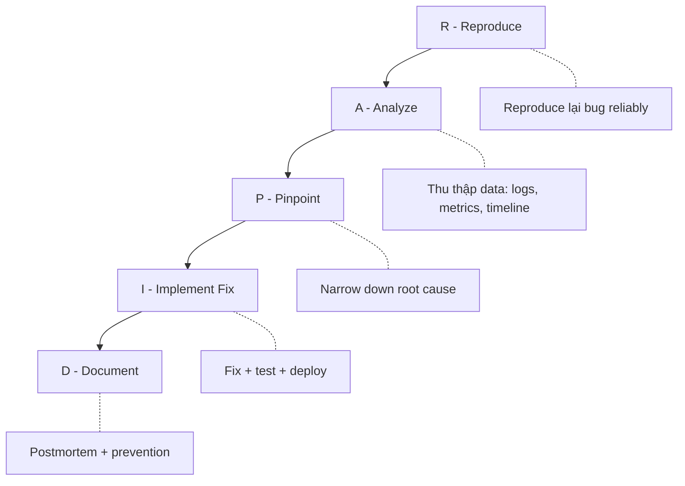

# 🔧 Debugging & Troubleshooting cho Data Engineer

> Kỹ năng #1 trong nghề: Fix pipeline lúc 3 AM mà không panic

---

## 📋 Mục Lục

1. [Debugging Mindset](#debugging-mindset)
2. [Systematic Debugging Framework](#systematic-debugging-framework)
3. [Common Failure Patterns](#common-failure-patterns)
4. [Debugging by Layer](#debugging-by-layer)
5. [Log Analysis & Profiling](#log-analysis--profiling)
6. [Production Incident Playbook](#production-incident-playbook)
7. [Prevention: Shift Left](#prevention-shift-left)

---

## Debugging Mindset

### Tại Sao Debugging Là Kỹ Năng #1?

```
Budget breakdown thời gian của DE thực tế:
┌──────────────────────────────────┐
│ 40%  Debugging & fixing issues   │ ← CHỦ YẾU LÀ ĐÂY
│ 25%  Maintaining existing pipes  │
│ 20%  Building new pipelines      │
│ 10%  Meetings & communication    │
│  5%  Learning new tools          │
└──────────────────────────────────┘

→ 65% = fix + maintain. Chỉ 20% thực sự build mới.
→ Debugging tốt = Bạn nhanh hơn người khác 3-5x
```

### Junior vs Senior Debugging

| | Junior | Senior |
|--|--------|--------|
| **Phản ứng đầu** | Panic, hỏi ngay | Đọc error message cẩn thận |
| **Approach** | Random changes | Systematic elimination |
| **Google** | Copy-paste solution | Hiểu root cause trước |
| **Timeline** | 2-4 giờ cho bug đơn giản | 15-30 phút |
| **Kết quả** | Fix symptom | Fix root cause + prevent |

### 5 Rules of Debugging

```
Rule 1: READ THE ERROR MESSAGE — 70% bugs có answer trong error message
Rule 2: REPRODUCE FIRST — Không reproduce được = không fix được
Rule 3: CHANGE ONE THING AT A TIME — Multiple changes = không biết cái nào fix
Rule 4: BINARY SEARCH — Chia đôi problem space, eliminate half
Rule 5: WRITE IT DOWN — Debugging log giúp tránh đi vòng tròn
```

---

## Systematic Debugging Framework

### RAPID Framework



### Step 1: Reproduce (R)

```python
# Checklist reproduce:
reproduce_checklist = {
    "same_data": "Dùng exact same input data",
    "same_env": "Cùng environment (dev/staging/prod)?",
    "same_config": "Cùng config, env vars?",
    "same_timing": "Liên quan đến time? (timezone, DST, midnight)?",
    "same_volume": "Chỉ xảy ra với data lớn?",
    "same_concurrency": "Chỉ xảy ra khi parallel?",
}

# Nếu không reproduce được:
cant_reproduce = [
    "Race condition (timing-dependent)",
    "Data-dependent (specific records trigger it)",
    "Resource-dependent (OOM only at scale)",
    "Environment-dependent (prod-only config)",
]
```

### Step 2: Analyze (A)

```python
# Thu thập evidence trước khi đoán
class DebugEvidence:
    """Thu thập tất cả evidence trước khi form hypothesis"""
    
    def collect(self):
        return {
            # Error info
            "error_message": "Exact error text",
            "stack_trace": "Full traceback",
            "error_code": "Exit code / HTTP status",
            
            # Timeline
            "when_started": "Khi nào bắt đầu fail?",
            "when_last_success": "Lần cuối success là khi nào?",
            "what_changed": "Code deploy? Config change? Data change?",
            
            # Context
            "which_env": "Dev / Staging / Prod?",
            "which_data": "All data hay specific subset?",
            "frequency": "Always fail hay intermittent?",
            
            # Resources
            "cpu_usage": "Normal hay spiked?",
            "memory_usage": "Normal hay near limit?",
            "disk_usage": "Đủ space không?",
            "network": "Connectivity issues?",
        }
```

### Step 3: Pinpoint (P)

```
Dùng Binary Search để narrow down:

Pipeline: Extract → Transform → Load → Validate → Publish

1. Check output của Transform:
   - OK → Bug ở Load/Validate/Publish
   - FAIL → Bug ở Extract/Transform
   
2. Nếu FAIL, check Extract output:
   - OK → Bug ở Transform
   - FAIL → Bug ở Extract
   
3. Nếu Transform fail, check specific transformation:
   - 20 transformations → check transformation #10
   - OK → Bug ở #11-#20
   - FAIL → Bug ở #1-#10
   
4. Continue until exact line found

→ Log(N) steps thay vì N steps
```

### Step 4: Implement Fix (I)

```python
# Fix checklist
fix_checklist = {
    "root_cause": "Fix root cause, không chỉ symptom",
    "test": "Viết test reproduce bug TRƯỚC khi fix",
    "regression": "Existing tests vẫn pass?",
    "edge_cases": "Fix có tạo edge case mới?",
    "rollback": "Có thể rollback nếu fix gây issue?",
    "monitoring": "Thêm monitoring cho bug này?",
}
```

### Step 5: Document (D)

```markdown
# Postmortem: [Bug Title]

## Summary
One-line description

## Impact
- Duration: 2 hours
- Affected: 3 downstream dashboards
- Data loss: None (backfilled)

## Root Cause
Schema change in source API (field renamed)

## Detection
Alert: "Row count drop > 50%" triggered at 14:30

## Resolution
1. Updated source schema mapping
2. Backfilled missing data
3. Added schema validation check

## Prevention
- [ ] Add schema drift detection
- [ ] Pin API version in config
- [ ] Add integration test for source schema
```

---

## Common Failure Patterns

### Pattern 1: Data Skew

```
Symptom: Spark job hangs at 99%, one task takes 10x longer
Cause: One partition key has disproportionate data

Example:
  user_type = "free"     → 8M records (80%)
  user_type = "premium"  → 1.5M records (15%)
  user_type = "admin"    → 500K records (5%)
```

```python
# Detect skew
from pyspark.sql import functions as F

df.groupBy("partition_key") \
  .count() \
  .orderBy(F.desc("count")) \
  .show(20)

# Fix: Salting
df_salted = df.withColumn(
    "salted_key",
    F.concat(
        F.col("partition_key"),
        F.lit("_"),
        (F.rand() * 10).cast("int").cast("string")
    )
)

# Fix: Broadcast join (if one side is small)
from pyspark.sql.functions import broadcast
result = large_df.join(broadcast(small_df), "key")

# Fix: Adaptive Query Execution (Spark 3+)
spark.conf.set("spark.sql.adaptive.enabled", "true")
spark.conf.set("spark.sql.adaptive.skewJoin.enabled", "true")
```

### Pattern 2: OOM (Out of Memory)

```
Symptom: "java.lang.OutOfMemoryError: Java heap space"
         "Container killed by YARN for exceeding memory limits"

Decision tree:
┌─ OOM Error
├── Driver OOM?
│   ├── .collect() on large data → Don't collect!
│   ├── Large broadcast variable → Reduce or don't broadcast
│   └── Too many small files → Coalesce first
└── Executor OOM?
    ├── Data skew → See Pattern 1
    ├── Cartesian join → Fix join condition
    ├── Large aggregation → Increase partitions
    └── UDF memory leak → Check UDF code
```

```python
# Debug OOM: Check what's consuming memory
spark.conf.set("spark.executor.memory", "8g")
spark.conf.set("spark.executor.memoryOverhead", "2g")  # Off-heap
spark.conf.set("spark.sql.shuffle.partitions", "400")  # More partitions = less per partition

# Common fix: Repartition before heavy operation
df = df.repartition(200, "key_column")  # Even distribution

# Check partition sizes
df.withColumn("partition_id", F.spark_partition_id()) \
  .groupBy("partition_id") \
  .count() \
  .describe() \
  .show()
```

### Pattern 3: Schema Drift

```
Symptom: "Column 'user_email' not found"
         "Cannot cast 'price' from string to decimal"
         "Unexpected column 'new_field_v2'"

Cause: Source system changed schema without notice
```

```python
# Detect schema drift
def detect_schema_drift(
    expected_schema: dict,
    actual_schema: dict
) -> dict:
    expected_cols = set(expected_schema.keys())
    actual_cols = set(actual_schema.keys())
    
    return {
        "missing_columns": expected_cols - actual_cols,
        "new_columns": actual_cols - expected_cols,
        "type_changes": {
            col: (expected_schema[col], actual_schema[col])
            for col in expected_cols & actual_cols
            if expected_schema[col] != actual_schema[col]
        }
    }

# Prevention: Schema validation at ingestion
from great_expectations.core import ExpectationSuite

suite = ExpectationSuite("source_schema_check")
suite.add_expectation(
    ExpectationConfiguration(
        expectation_type="expect_table_columns_to_match_set",
        kwargs={"column_set": ["id", "name", "email", "price"]},
    )
)
```

### Pattern 4: Zombie Connections / Connection Pool Exhaustion

```
Symptom: "Too many connections"
         "Connection refused"
         Pipeline hangs indefinitely

Cause: Connections not properly closed, pool exhausted
```

```python
# ❌ BAD: Connection leak
def process_batch(records):
    conn = psycopg2.connect(...)
    cursor = conn.cursor()
    cursor.executemany(INSERT_SQL, records)
    conn.commit()
    # Connection never closed! Leak!

# ✅ GOOD: Context manager
def process_batch(records):
    with psycopg2.connect(...) as conn:
        with conn.cursor() as cursor:
            cursor.executemany(INSERT_SQL, records)
            conn.commit()
    # Auto-closed

# ✅ BETTER: Connection pool with health checks
from sqlalchemy import create_engine

engine = create_engine(
    DATABASE_URL,
    pool_size=10,
    max_overflow=5,
    pool_timeout=30,
    pool_recycle=1800,     # Recycle every 30 min
    pool_pre_ping=True,    # Health check before use
)
```

### Pattern 5: Duplicate Data

```
Symptom: Row count doubled after rerun
         Aggregations show 2x expected values

Cause: Non-idempotent writes, no deduplication
```

```python
# Fix: Make writes idempotent

# Approach 1: UPSERT / MERGE
UPSERT_SQL = """
INSERT INTO target (id, name, value, updated_at)
VALUES (%s, %s, %s, %s)
ON CONFLICT (id) DO UPDATE SET
    name = EXCLUDED.name,
    value = EXCLUDED.value,
    updated_at = EXCLUDED.updated_at
"""

# Approach 2: Delete-then-insert (partition swap)
"""
DELETE FROM target WHERE partition_date = '{date}';
INSERT INTO target SELECT * FROM staging WHERE partition_date = '{date}';
"""

# Approach 3: Dedup in query
"""
SELECT DISTINCT ON (id) *
FROM source
ORDER BY id, updated_at DESC
"""
```

### Pattern 6: Time Zone Hell

```
Symptom: Data missing for 1 hour (DST)
         Duplicate data for 1 hour (DST)
         Wrong dates in reports
         "Yesterday" query returns wrong results
```

```python
# Rule: ALWAYS store in UTC, convert for display only

from datetime import datetime
import pytz

# ❌ BAD
now = datetime.now()  # Local time, ambiguous

# ✅ GOOD  
now_utc = datetime.now(tz=pytz.UTC)

# ❌ BAD: Naive comparison
if event_time > start_of_day:  # Which timezone's start?

# ✅ GOOD: Explicit timezone
vietnam_tz = pytz.timezone("Asia/Ho_Chi_Minh")
start_of_day_vn = datetime.now(vietnam_tz).replace(
    hour=0, minute=0, second=0, microsecond=0
)
start_of_day_utc = start_of_day_vn.astimezone(pytz.UTC)

# SQL: Always explicit
"""
-- ❌
WHERE created_at >= CURRENT_DATE

-- ✅  
WHERE created_at >= (CURRENT_DATE AT TIME ZONE 'Asia/Ho_Chi_Minh')
                      AT TIME ZONE 'UTC'
"""
```

### Pattern 7: Small Files Problem

```
Symptom: "Too many open files"
         S3 LIST operation slow (>10K files)
         Spark job startup takes 30 min (file listing)
         High cloud storage costs (API calls)

Cause: Streaming writes create tiny files
       Over-partitioning (partition per minute)
```

```python
# Fix Spark: Compaction
spark.sql("""
OPTIMIZE my_table 
WHERE date >= current_date - INTERVAL 7 days
""")

# Fix Spark: Coalesce before write
df.coalesce(10).write.parquet("s3://bucket/output/")

# Fix Spark: Adaptive coalescing
spark.conf.set("spark.sql.adaptive.enabled", "true")
spark.conf.set("spark.sql.adaptive.coalescePartitions.enabled", "true")

# Fix: Hive/Iceberg compaction job
"""
-- Iceberg: Rewrite small files
CALL system.rewrite_data_files(
    table => 'db.my_table',
    options => map('min-file-size-bytes', '10485760')  -- 10MB min
)
"""
```

### Pattern 8: Deadlocks

```
Symptom: Pipeline hangs indefinitely
         "deadlock detected" in PostgreSQL
         Two pipelines waiting for each other

Cause: Concurrent writes to same table with conflicting lock order
```

```sql
-- Detect deadlocks (PostgreSQL)
SELECT 
    blocked.pid AS blocked_pid,
    blocked_activity.query AS blocked_query,
    blocking.pid AS blocking_pid,
    blocking_activity.query AS blocking_query
FROM pg_catalog.pg_locks blocked
JOIN pg_catalog.pg_locks blocking 
    ON blocking.locktype = blocked.locktype
    AND blocking.relation = blocked.relation
    AND blocking.pid != blocked.pid
JOIN pg_stat_activity blocked_activity 
    ON blocked_activity.pid = blocked.pid
JOIN pg_stat_activity blocking_activity 
    ON blocking_activity.pid = blocking.pid
WHERE NOT blocked.granted;

-- Fix: Consistent lock ordering
-- Always acquire locks in same order: table_a → table_b → table_c
-- Use advisory locks for custom synchronization
SELECT pg_advisory_lock(42);  -- Acquire
-- Do work
SELECT pg_advisory_unlock(42);  -- Release
```

---

## Debugging by Layer

### Layer 1: Data Source

```
Common issues:
├── API rate limiting → 429 errors → Add backoff
├── API schema changed → Missing/renamed fields → Schema check
├── Database timeout → Connection pool exhausted → Pool config
├── File not found → Path changed → Parameterize paths
├── Permission denied → IAM/credentials expired → Auto-rotate
└── Data format changed → CSV delimiter changed → Validation

Debug commands:
$ curl -v https://api.example.com/data   # Test API
$ psql -h host -U user -d db -c "SELECT 1"  # Test DB
$ aws s3 ls s3://bucket/path/             # Check S3 files
```

### Layer 2: Processing (Spark/Python)

```python
# Spark debugging toolkit
# 1. Check execution plan
df.explain(extended=True)

# 2. Check partitions
print(f"Partitions: {df.rdd.getNumPartitions()}")

# 3. Sample data at each step
df_step1 = extract()
print(f"After extract: {df_step1.count()} rows")
df_step1.show(5)

df_step2 = transform(df_step1) 
print(f"After transform: {df_step2.count()} rows")
df_step2.show(5)

# 4. Check for nulls
for col_name in df.columns:
    null_count = df.filter(F.col(col_name).isNull()).count()
    if null_count > 0:
        print(f"⚠️ {col_name}: {null_count} nulls")

# 5. Check Spark UI
# http://spark-master:4040/jobs/  → Active/failed jobs
# http://spark-master:4040/stages/ → Stage details
# http://spark-master:4040/sql/    → Query plans
```

### Layer 3: Storage / Warehouse

```sql
-- PostgreSQL debugging
-- Long-running queries
SELECT pid, now() - pg_stat_activity.query_start AS duration,
       query, state
FROM pg_stat_activity
WHERE (now() - pg_stat_activity.query_start) > interval '5 minutes'
ORDER BY duration DESC;

-- Table bloat
SELECT schemaname, tablename,
       pg_size_pretty(pg_total_relation_size(schemaname||'.'||tablename)) as total_size,
       pg_size_pretty(pg_relation_size(schemaname||'.'||tablename)) as data_size
FROM pg_tables
WHERE schemaname = 'public'
ORDER BY pg_total_relation_size(schemaname||'.'||tablename) DESC;

-- Missing indexes
SELECT relname, seq_scan, idx_scan,
       CASE WHEN seq_scan > 0 
            THEN round(100.0 * idx_scan / (seq_scan + idx_scan), 1) 
            ELSE 100 END AS idx_pct
FROM pg_stat_user_tables
WHERE seq_scan > 1000
ORDER BY seq_scan DESC;
```

### Layer 4: Orchestration (Airflow)

```python
# Common Airflow issues:
airflow_issues = {
    "DAG not showing up": [
        "Syntax error in DAG file → Check: python dags/my_dag.py",
        "Wrong folder → Check: $AIRFLOW_HOME/dags/",
        "Import error → Check: airflow dags list-import-errors",
    ],
    "Task stuck in 'queued'": [
        "No available workers → Check: airflow celery flower",
        "Pool limit reached → Check: Admin > Pools",
        "Parallelism limit → airflow.cfg: parallelism",
    ],
    "Task keeps retrying": [
        "Transient error → Check task logs, increase retry_delay",
        "Permanent error → Fix code, not just retry",
        "Resource contention → Add concurrency limits",
    ],
    "Scheduler not picking DAGs": [
        "Scheduler dead → systemctl status airflow-scheduler",
        "DAG paused → Unpause in UI",
        "Schedule in past → Set catchup=False",
    ],
}

# Debug commands
"""
airflow dags list                    # List all DAGs
airflow dags list-import-errors      # Show parse errors
airflow tasks test dag_id task_id date   # Test single task
airflow dags trigger dag_id          # Manual trigger
airflow tasks states-for-dag-run dag_id run_id  # Check states
"""
```

---

## Log Analysis & Profiling

### Structured Logging

```python
import structlog
import logging

# Setup structured logging
structlog.configure(
    processors=[
        structlog.processors.TimeStamper(fmt="iso"),
        structlog.processors.add_log_level,
        structlog.processors.StackInfoRenderer(),
        structlog.dev.ConsoleRenderer()  # Dev
        # structlog.processors.JSONRenderer()  # Prod
    ],
    wrapper_class=structlog.stdlib.BoundLogger,
    context_class=dict,
    logger_factory=structlog.stdlib.LoggerFactory(),
)

logger = structlog.get_logger()

# Usage in pipeline
def process_batch(batch_id: str, records: list):
    log = logger.bind(
        batch_id=batch_id,
        record_count=len(records),
        pipeline="user_events"
    )
    
    log.info("batch_started")
    
    try:
        result = transform(records)
        log.info("batch_completed", 
                output_count=len(result),
                duration_ms=elapsed)
    except Exception as e:
        log.error("batch_failed",
                 error=str(e),
                 error_type=type(e).__name__,
                 first_record=records[0] if records else None)
        raise
```

### Performance Profiling

```python
# Python profiling
import cProfile
import pstats

def profile_pipeline():
    """Profile pipeline to find bottlenecks"""
    profiler = cProfile.Profile()
    profiler.enable()
    
    # Run pipeline
    run_pipeline()
    
    profiler.disable()
    stats = pstats.Stats(profiler)
    stats.sort_stats('cumulative')
    stats.print_stats(20)  # Top 20 slowest functions

# Memory profiling
from memory_profiler import profile

@profile
def memory_heavy_function():
    data = load_large_file()  # Shows memory at each line
    transformed = transform(data)
    return transformed

# Spark profiling via Spark UI
"""
Key metrics to check:
1. Shuffle Read/Write → Too much = bad partitioning
2. GC Time → >10% = need more memory
3. Task Duration distribution → Skew = uneven data
4. Input/Output size → Unexpected = data issue
"""

# Time profiling decorator
import functools
import time

def timer(func):
    @functools.wraps(func)
    def wrapper(*args, **kwargs):
        start = time.perf_counter()
        result = func(*args, **kwargs)
        elapsed = time.perf_counter() - start
        logger.info(f"{func.__name__}", duration_seconds=round(elapsed, 2))
        return result
    return wrapper

@timer
def extract():
    ...

@timer  
def transform(data):
    ...

@timer
def load(data):
    ...
```

---

## Production Incident Playbook

### Severity Levels

| Level | Definition | Response Time | Example |
|-------|-----------|---------------|---------|
| **SEV1** | Data loss, complete outage | 15 min | Pipeline deleting prod data |
| **SEV2** | Major feature broken | 1 hour | Dashboard showing wrong numbers |
| **SEV3** | Degraded performance | 4 hours | Pipeline 3x slower than SLA |
| **SEV4** | Minor issue | Next day | Warning in logs, no impact |

### Incident Response Checklist

```markdown
## When Alert Fires (First 5 Minutes)

1. □ Acknowledge alert
2. □ Check: Is this real or false alarm?
3. □ Assess severity (SEV1-4)
4. □ If SEV1/2: Page team lead, start incident channel

## Investigation (5-30 Minutes)

5. □ Check recent changes (deploys, config, data)
6. □ Check dashboards: latency, errors, throughput
7. □ Check upstream systems: source health
8. □ Check downstream impact: who is affected?

## Mitigation (ASAP)

9. □ Can we rollback? → Do it
10. □ Can we skip bad data? → Feature flag
11. □ Can we switch to backup? → Failover
12. □ None of above → Manual fix

## Resolution

13. □ Root cause identified
14. □ Fix implemented & tested
15. □ Backfill data if needed
16. □ Verify downstream systems recovered

## Post-Incident (Within 48 Hours)

17. □ Write postmortem
18. □ Create prevention tickets
19. □ Share learnings with team
```

### "My Pipeline Is Slow" Decision Tree

```
Pipeline is slow
├── WHICH part is slow? (instrument each step)
│
├── Extract is slow?
│   ├── API throttling → Add caching, reduce frequency
│   ├── Full table scan → Add WHERE clause, incremental
│   └── Network → Check bandwidth, use compression
│
├── Transform is slow?
│   ├── Spark? → Check Spark UI
│   │   ├── Shuffle heavy → Reduce joins, broadcast small tables
│   │   ├── Skewed → Salt keys, AQE
│   │   ├── Too few partitions → Repartition
│   │   └── UDF bottleneck → Use native Spark functions
│   │
│   ├── Python? → Profile with cProfile
│   │   ├── Loop over rows → Vectorize with Polars/Pandas
│   │   ├── Repeated DB calls → Batch queries
│   │   └── String operations → Use compiled regex
│   │
│   └── SQL? → Check EXPLAIN ANALYZE
│       ├── Full table scan → Add indexes
│       ├── Nested loops → Different join strategy
│       └── Sorts → Materialized views, pre-aggregation
│
├── Load is slow?
│   ├── Row-by-row insert → COPY/bulk insert
│   ├── Too many indexes → Drop, rebuild after load
│   ├── Lock contention → Partition swap, staging table
│   └── Network → Compress data, parallel upload
│
└── Orchestration overhead?
    ├── Too many small tasks → Combine
    ├── Scheduler bottleneck → More workers
    └── Sensor polling → Use deferrable operators
```

---

## Prevention: Shift Left

### Data Quality Checks at Source

```python
# Check BEFORE processing
def validate_source(df) -> bool:
    checks = {
        "row_count": df.count() > 0,
        "no_full_nulls": not any(
            df.filter(F.col(c).isNull()).count() == df.count() 
            for c in df.columns
        ),
        "schema_match": set(df.columns) == EXPECTED_COLUMNS,
        "freshness": df.agg(F.max("updated_at")).first()[0] > yesterday,
    }
    
    failed = [k for k, v in checks.items() if not v]
    if failed:
        raise DataQualityError(f"Source validation failed: {failed}")
    return True
```

### Circuit Breaker Pattern

```python
class CircuitBreaker:
    """Stop calling failing service after N failures"""
    
    def __init__(self, failure_threshold=5, reset_timeout=60):
        self.failure_count = 0
        self.failure_threshold = failure_threshold
        self.reset_timeout = reset_timeout
        self.last_failure_time = None
        self.state = "CLOSED"  # CLOSED=normal, OPEN=blocking, HALF_OPEN=testing
    
    def call(self, func, *args, **kwargs):
        if self.state == "OPEN":
            if time.time() - self.last_failure_time > self.reset_timeout:
                self.state = "HALF_OPEN"
            else:
                raise CircuitBreakerOpen("Service unavailable, circuit is open")
        
        try:
            result = func(*args, **kwargs)
            if self.state == "HALF_OPEN":
                self.state = "CLOSED"
                self.failure_count = 0
            return result
        except Exception as e:
            self.failure_count += 1
            self.last_failure_time = time.time()
            if self.failure_count >= self.failure_threshold:
                self.state = "OPEN"
            raise

# Usage
api_breaker = CircuitBreaker(failure_threshold=3, reset_timeout=300)
result = api_breaker.call(requests.get, "https://api.example.com/data")
```

### Monitoring Checklist

```
Essential metrics cho mọi pipeline:

□ Duration (p50, p95, p99)
□ Row count (input vs output)
□ Error rate
□ Data freshness (time since last successful run)
□ Schema: column count, types
□ Null percentage per column
□ Duplicate rate
□ Resource usage (CPU, memory, disk)
```

---

## Debugging Tools Cheat Sheet

| Tool | Mục đích | Command |
|------|---------|---------|
| **curl** | Test HTTP APIs | `curl -v -H "Auth: token" URL` |
| **telnet** | Test TCP port | `telnet host 5432` |
| **nslookup** | DNS resolve | `nslookup api.example.com` |
| **psql** | PostgreSQL debug | `\dt+ \di+ \x` |
| **spark-shell** | Test Spark code | `spark-shell --master local[*]` |
| **jstack** | Java thread dump | `jstack <pid>` |
| **strace** | System call trace | `strace -p <pid> -e trace=network` |
| **htop** | Resource monitor | `htop -p <pid>` |
| **iotop** | Disk I/O monitor | `iotop -aoP` |
| **tcpdump** | Network packets | `tcpdump -i eth0 port 5432` |
| **pg_stat** | PostgreSQL stats | `SELECT * FROM pg_stat_activity` |

---

## Checklist

- [ ] Có debugging framework (RAPID)
- [ ] Biết 8 common failure patterns
- [ ] Có structured logging trong pipelines
- [ ] Biết dùng profiling tools
- [ ] Có incident response playbook
- [ ] Có monitoring cho mọi pipeline
- [ ] Viết postmortem sau mỗi incident

---

## Liên Kết

- [12_Monitoring_Observability](12_Monitoring_Observability.md) - Setup monitoring
- [11_Testing_CICD](11_Testing_CICD.md) - Prevention through testing
- [15_Clean_Code_Data_Engineering](15_Clean_Code_Data_Engineering.md) - Readable, debuggable code
- [22_Schema_Evolution_Migration](22_Schema_Evolution_Migration.md) - Prevent schema issues

---

*Debug smart, not hard. Kỹ năng debug tốt = career accelerator.*
