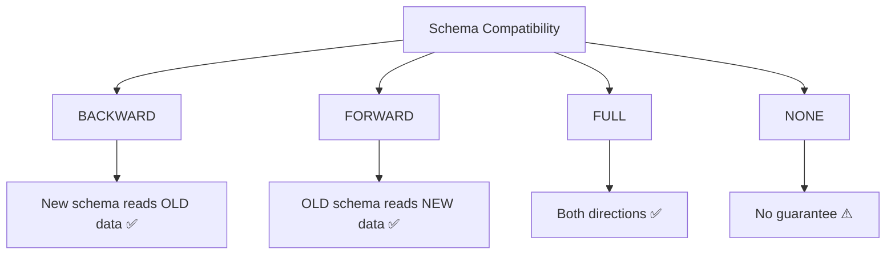
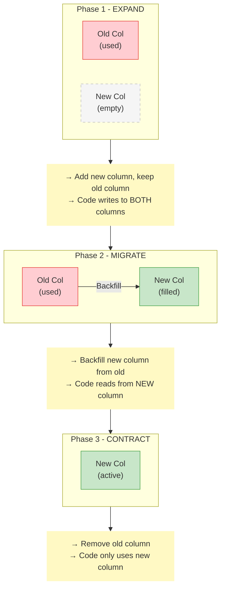

# 🔄 Schema Evolution & Data Migration

> 90% DE gặp hàng tuần: source đổi schema, warehouse cần ALTER, data phải migrate

---

## 📋 Mục Lục

1. [Tại Sao Schema Evolution Quan Trọng?](#tại-sao-schema-evolution-quan-trọng)
2. [Schema Compatibility Types](#schema-compatibility-types)
3. [Schema Evolution by Tool](#schema-evolution-by-tool)
4. [Data Migration Patterns](#data-migration-patterns)
5. [Zero-Downtime Migration](#zero-downtime-migration)
6. [Schema Registry](#schema-registry)
7. [Real-World Scenarios](#real-world-scenarios)

---

## Tại Sao Schema Evolution Quan Trọng?

```
Thực tế của Data Engineer:

Week 1: Source team thêm field "middle_name"
Week 2: Marketing đổi "campaign_id" type từ INT → VARCHAR
Week 3: API v2 rename "user_email" → "email_address"  
Week 4: Legal yêu cầu xoá PII columns
Week 5: New microservice thêm 20 columns vào events

→ Schema KHÔNG BAO GIỜ ổn định. Phải handle evolution.
```

### Cost of Not Handling Schema Evolution

| Scenario | Impact | Recovery Time |
|----------|--------|--------------|
| Pipeline breaks on new column | ⬛ Downtime | 30 min - 2 hr |
| Type mismatch crashes job | ⬛ Data loss possible | 1-4 hr |
| Renamed field → nulls in warehouse | ⬛⬛ Wrong reports | 4-8 hr (detect + fix) |
| Deleted column → downstream breaks | ⬛⬛⬛ Cascade failure | 1-2 days |

---

## Schema Compatibility Types

### 4 Types theo Confluent Schema Registry



### Backward Compatible (Phổ biến nhất)

```
Rule: Consumer mới có thể đọc data cũ

Được phép:
✅ Thêm column (với default value)
✅ Xoá column (consumer phải handle missing)

Không được:
❌ Rename column
❌ Thay đổi data type
❌ Xoá column bắt buộc (required)
```

```python
# Ví dụ Backward Compatible
# Schema v1
schema_v1 = {
    "user_id": "INT",
    "name": "STRING",
    "email": "STRING",
}

# Schema v2 — Backward compatible
schema_v2 = {
    "user_id": "INT",
    "name": "STRING", 
    "email": "STRING",
    "phone": "STRING DEFAULT NULL",    # ✅ New field with default
    "created_at": "TIMESTAMP DEFAULT NOW()",  # ✅ New field with default
}

# Consumer v2 reading v1 data → phone=NULL, created_at=NOW() → OK!
```

### Forward Compatible

```
Rule: Consumer cũ có thể đọc data mới

Được phép:
✅ Xoá column (old consumer ignores missing)
✅ Thêm column (old consumer ignores unknown)

Không được:
❌ Thay đổi data type
❌ Thêm required column
```

### Full Compatible (Khuyến nghị cho Production)

```
Rule: Cả hai chiều đều đọc được

Được phép:
✅ Thêm optional column
✅ Xoá optional column

Không được:
❌ Thêm/xoá required column
❌ Rename column
❌ Thay đổi type
```

---

## Schema Evolution by Tool

### Apache Iceberg

```sql
-- Iceberg có schema evolution xuất sắc nhất

-- Thêm column
ALTER TABLE catalog.db.users ADD COLUMN phone STRING;

-- Rename column (!)
ALTER TABLE catalog.db.users RENAME COLUMN user_email TO email;

-- Thay đổi type (widening only)
ALTER TABLE catalog.db.users ALTER COLUMN age TYPE BIGINT;
-- INT → BIGINT ✅
-- FLOAT → DOUBLE ✅
-- STRING → gì cũng ❌

-- Reorder columns
ALTER TABLE catalog.db.users ALTER COLUMN phone AFTER name;

-- Drop column
ALTER TABLE catalog.db.users DROP COLUMN legacy_field;

-- Iceberg partition evolution (KHÔNG cần rewrite!)
ALTER TABLE catalog.db.events 
ADD PARTITION FIELD hours(event_time);
-- Old data: partitioned by day
-- New data: partitioned by hour
-- Cả hai đọc được transparently!
```

### Delta Lake

```python
# Delta Lake schema evolution
from delta.tables import DeltaTable

# Auto-merge new columns
spark.conf.set("spark.databricks.delta.schema.autoMerge.enabled", "true")

# Manual merge with schema evolution
(deltaTable.alias("target")
    .merge(
        newData.alias("source"),
        "target.id = source.id"
    )
    .whenMatchedUpdateAll()
    .whenNotMatchedInsertAll()
    .option("mergeSchema", "true")  # ← Allow new columns
    .execute()
)

# Overwrite schema completely (careful!)
(df.write
    .format("delta")
    .option("overwriteSchema", "true")
    .mode("overwrite")
    .saveAsTable("db.users")
)
```

### Avro Schema Evolution

```json
// Schema v1
{
  "type": "record",
  "name": "User",
  "fields": [
    {"name": "id", "type": "int"},
    {"name": "name", "type": "string"},
    {"name": "email", "type": "string"}
  ]
}

// Schema v2 — Backward compatible
{
  "type": "record",
  "name": "User",
  "fields": [
    {"name": "id", "type": "int"},
    {"name": "name", "type": "string"},
    {"name": "email", "type": "string"},
    {"name": "phone", "type": ["null", "string"], "default": null},
    {"name": "age", "type": ["null", "int"], "default": null}
  ]
}

// Rules:
// ✅ New field MUST have default value
// ✅ Use union type ["null", "actual_type"] for optional
// ❌ Cannot remove field without default
// ❌ Cannot change field type (except promotion: int→long)
```

### PostgreSQL / Data Warehouse

```sql
-- Safe ALTER operations (thường non-blocking)
ALTER TABLE users ADD COLUMN phone VARCHAR(20);        -- ✅ Fast
ALTER TABLE users ADD COLUMN age INT DEFAULT 0;        -- ⚠️ Rewrites table in older PG
ALTER TABLE users ALTER COLUMN name TYPE VARCHAR(500); -- ⚠️ May lock table
ALTER TABLE users DROP COLUMN legacy_field;            -- ✅ Fast (marks invisible)

-- Dangerous ALTER operations
ALTER TABLE users ALTER COLUMN price TYPE NUMERIC(10,2);  -- ⬛ Table rewrite!
ALTER TABLE users ADD COLUMN id SERIAL PRIMARY KEY;       -- ⬛ Table rewrite!

-- Safe approach for type changes
-- Step 1: Add new column
ALTER TABLE users ADD COLUMN price_new NUMERIC(10,2);
-- Step 2: Backfill (batched)
UPDATE users SET price_new = price::NUMERIC(10,2) WHERE id BETWEEN 1 AND 10000;
UPDATE users SET price_new = price::NUMERIC(10,2) WHERE id BETWEEN 10001 AND 20000;
-- Step 3: Swap (in transaction)
BEGIN;
ALTER TABLE users RENAME COLUMN price TO price_old;
ALTER TABLE users RENAME COLUMN price_new TO price;
COMMIT;
-- Step 4: Drop old (after verification)
ALTER TABLE users DROP COLUMN price_old;
```

---

## Data Migration Patterns

### Pattern 1: Expand-Contract (Recommended)

```
Safest pattern for production migrations


```

```python
# Expand-Contract implementation
class SchemaManager:
    
    def expand(self, conn):
        """Phase 1: Add new column alongside old"""
        conn.execute("""
            ALTER TABLE users ADD COLUMN email_v2 VARCHAR(255);
        """)
        # Update application to write to BOTH columns
    
    def migrate(self, conn, batch_size=10000):
        """Phase 2: Backfill new column"""
        while True:
            result = conn.execute(f"""
                UPDATE users 
                SET email_v2 = email 
                WHERE email_v2 IS NULL 
                AND email IS NOT NULL
                LIMIT {batch_size};
            """)
            if result.rowcount == 0:
                break
            conn.commit()
            time.sleep(0.1)  # Don't overwhelm DB
    
    def contract(self, conn):
        """Phase 3: Remove old column"""
        # Only after verifying all systems use new column
        conn.execute("""
            ALTER TABLE users DROP COLUMN email;
            ALTER TABLE users RENAME COLUMN email_v2 TO email;
        """)
```

### Pattern 2: Shadow Table

```sql
-- For large schema changes that can't be done in-place

-- Step 1: Create shadow table with new schema
CREATE TABLE users_v2 (
    id BIGINT PRIMARY KEY,  -- Changed from INT
    full_name VARCHAR(500), -- Merged first_name + last_name
    email VARCHAR(255),
    phone VARCHAR(20),
    created_at TIMESTAMPTZ DEFAULT NOW()
);

-- Step 2: Backfill with transformation
INSERT INTO users_v2 (id, full_name, email, phone, created_at)
SELECT 
    id::BIGINT,
    first_name || ' ' || last_name,
    email,
    NULL,
    COALESCE(created_at, '2020-01-01'::TIMESTAMPTZ)
FROM users;

-- Step 3: Catch up with changes during migration
-- (Use CDC or trigger to capture changes)

-- Step 4: Atomic swap
BEGIN;
ALTER TABLE users RENAME TO users_old;
ALTER TABLE users_v2 RENAME TO users;
COMMIT;

-- Step 5: Keep old table as backup for 7 days
-- DROP TABLE users_old;  -- After verification
```

### Pattern 3: View Abstraction

```sql
-- Use views to abstract schema changes from consumers

-- Original table
CREATE TABLE users_raw (
    id INT,
    first_name VARCHAR(100),
    last_name VARCHAR(100),
    email VARCHAR(255)
);

-- Consumer-facing view
CREATE OR REPLACE VIEW users AS
SELECT 
    id,
    first_name || ' ' || last_name AS full_name,
    first_name,  -- Keep for backward compat
    last_name,   -- Keep for backward compat
    email
FROM users_raw;

-- When source adds new column:
ALTER TABLE users_raw ADD COLUMN phone VARCHAR(20);

-- Update view to expose it:
CREATE OR REPLACE VIEW users AS
SELECT 
    id,
    first_name || ' ' || last_name AS full_name,
    first_name,
    last_name,
    email,
    phone  -- New!
FROM users_raw;

-- Consumers don't break because view interface is stable
```

---

## Zero-Downtime Migration

### Bảng 10TB trên Production

```
Scenario: Cần thay đổi partition key trên bảng 10TB

❌ KHÔNG LÀM:
ALTER TABLE events PARTITION BY RANGE (event_date);
→ Lock table → Downtime → Pipeline breaks

✅ LÀM:
```

```python
class ZeroDowntimeMigration:
    """
    Migrate 10TB table without downtime
    
    Strategy: Dual-write + backfill + cutover
    """
    
    def phase1_create_target(self):
        """Create new table with desired schema"""
        execute("""
            CREATE TABLE events_v2 (
                id BIGINT,
                event_type VARCHAR(50),
                event_data JSONB,
                event_date DATE,
                created_at TIMESTAMPTZ
            ) PARTITION BY RANGE (event_date);
            
            -- Create partitions for recent + future dates
            CREATE TABLE events_v2_2024_01 PARTITION OF events_v2
                FOR VALUES FROM ('2024-01-01') TO ('2024-02-01');
            -- ... more partitions
        """)
    
    def phase2_dual_write(self):
        """Write to BOTH tables"""
        # Update pipeline to write to events AND events_v2
        # Critical: Do this BEFORE backfill to avoid gaps
        pass
    
    def phase3_backfill(self, batch_days=7):
        """Backfill historical data in batches"""
        start_date = date(2020, 1, 1)
        end_date = date.today()
        
        current = start_date
        while current < end_date:
            batch_end = current + timedelta(days=batch_days)
            execute(f"""
                INSERT INTO events_v2
                SELECT * FROM events
                WHERE event_date >= '{current}'
                AND event_date < '{batch_end}'
                ON CONFLICT (id) DO NOTHING;
            """)
            current = batch_end
            time.sleep(1)  # Throttle
    
    def phase4_verify(self):
        """Verify data matches"""
        old_count = execute("SELECT COUNT(*) FROM events")
        new_count = execute("SELECT COUNT(*) FROM events_v2")
        
        # Sample verification
        for date in random_dates(100):
            old = execute(f"SELECT COUNT(*), SUM(amount) FROM events WHERE event_date='{date}'")
            new = execute(f"SELECT COUNT(*), SUM(amount) FROM events_v2 WHERE event_date='{date}'")
            assert old == new, f"Mismatch on {date}"
    
    def phase5_cutover(self):
        """Atomic swap"""
        execute("""
            BEGIN;
            ALTER TABLE events RENAME TO events_old;
            ALTER TABLE events_v2 RENAME TO events;
            COMMIT;
        """)
    
    def phase6_cleanup(self, days_to_keep=14):
        """Drop old table after verification period"""
        # Wait 14 days, monitor, then drop
        execute("DROP TABLE events_old;")
```

---

## Schema Registry

### Confluent Schema Registry (Kafka)

```python
# Schema Registry cho Kafka messages

from confluent_kafka.schema_registry import SchemaRegistryClient
from confluent_kafka.schema_registry.avro import AvroSerializer

# Config
schema_registry_conf = {
    "url": "http://schema-registry:8081"
}
registry = SchemaRegistryClient(schema_registry_conf)

# Register schema
schema_str = """
{
    "type": "record",
    "name": "UserEvent",
    "namespace": "com.example",
    "fields": [
        {"name": "user_id", "type": "int"},
        {"name": "event_type", "type": "string"},
        {"name": "timestamp", "type": "long", "logicalType": "timestamp-millis"}
    ]
}
"""

# Set compatibility level
registry.set_compatibility(
    subject_name="user-events-value",
    level="BACKWARD"
)

# Check if new schema is compatible
is_compatible = registry.test_compatibility(
    subject_name="user-events-value",
    schema=new_schema
)

if not is_compatible:
    raise SchemaIncompatibleError(
        "New schema breaks backward compatibility!"
    )
```

### dbt Schema Management

```yaml
# dbt: models/staging/stg_users.yml
version: 2

models:
  - name: stg_users
    description: "Cleaned user data"
    columns:
      - name: user_id
        description: "Primary key"
        tests:
          - not_null
          - unique
      
      - name: email
        description: "User email"
        tests:
          - not_null
      
      # New column - add with documentation
      - name: phone
        description: "Added in v2.3, nullable"
        tests:
          - accepted_values:
              values: ['valid_phone_pattern']
              config:
                where: "phone IS NOT NULL"  # Optional

# dbt: Schema change detection macro
# macros/schema_check.sql

    
    
    
    
        
            {{ exceptions.raise_compiler_error(
                "Missing column: " ~ expected ~ " in " ~ model
            ) }}
        
    

```

---

## Real-World Scenarios

### Scenario 1: API v1 → v2 Migration

```python
# Source API changes from v1 to v2
# v1: {"user_email": "...", "user_name": "..."}
# v2: {"email": "...", "name": "...", "phone": "..."}

class AdaptiveExtractor:
    """Handle multiple API versions gracefully"""
    
    FIELD_MAPPINGS = {
        "v1": {
            "user_email": "email",
            "user_name": "name",
        },
        "v2": {}  # v2 uses canonical names
    }
    
    def normalize(self, record: dict, version: str = "auto") -> dict:
        if version == "auto":
            version = self._detect_version(record)
        
        mapping = self.FIELD_MAPPINGS.get(version, {})
        normalized = {}
        
        for key, value in record.items():
            canonical_key = mapping.get(key, key)
            normalized[canonical_key] = value
        
        # Add defaults for new v2 fields missing in v1
        normalized.setdefault("phone", None)
        
        return normalized
    
    def _detect_version(self, record: dict) -> str:
        if "user_email" in record:
            return "v1"
        return "v2"
```

### Scenario 2: Integer Overflow Migration

```sql
-- user_id approaching INT max (2.1 billion)
-- Need to migrate to BIGINT

-- Step 1: Add new column
ALTER TABLE events ADD COLUMN user_id_big BIGINT;

-- Step 2: Backfill in batches (10TB table)
DO $$
DECLARE
    batch_size INT := 100000;
    max_id BIGINT;
    current_id BIGINT := 0;
BEGIN
    SELECT MAX(id) INTO max_id FROM events;
    
    WHILE current_id < max_id LOOP
        UPDATE events 
        SET user_id_big = user_id::BIGINT
        WHERE id BETWEEN current_id AND current_id + batch_size
        AND user_id_big IS NULL;
        
        current_id := current_id + batch_size;
        COMMIT;
        PERFORM pg_sleep(0.1);  -- Throttle
    END LOOP;
END $$;

-- Step 3: Add NOT NULL (after backfill complete)
ALTER TABLE events ALTER COLUMN user_id_big SET NOT NULL;

-- Step 4: Swap columns
BEGIN;
ALTER TABLE events RENAME COLUMN user_id TO user_id_old;
ALTER TABLE events RENAME COLUMN user_id_big TO user_id;
COMMIT;

-- Step 5: Update indexes
CREATE INDEX CONCURRENTLY idx_events_user_id_new ON events(user_id);
DROP INDEX idx_events_user_id;
ALTER INDEX idx_events_user_id_new RENAME TO idx_events_user_id;
```

---

## Checklist

- [ ] Hiểu 4 loại schema compatibility
- [ ] Biết Expand-Contract pattern
- [ ] Có thể migrate bảng lớn zero-downtime
- [ ] Biết dùng Schema Registry
- [ ] Hiểu schema evolution của Iceberg/Delta
- [ ] Có strategy cho view abstraction
- [ ] Biết handle API version changes

---

## Liên Kết

- [06_Data_Formats_Storage](06_Data_Formats_Storage.md) - Avro schema evolution
- [21_Debugging_Troubleshooting](21_Debugging_Troubleshooting.md) - Debug schema issues
- [24_Data_Contracts](24_Data_Contracts.md) - Prevent breaking changes
- [01_Data_Modeling_Fundamentals](01_Data_Modeling_Fundamentals.md) - SCD types

---

*Schema luôn thay đổi. Câu hỏi không phải "if" mà là "when" và "are you ready?"*
