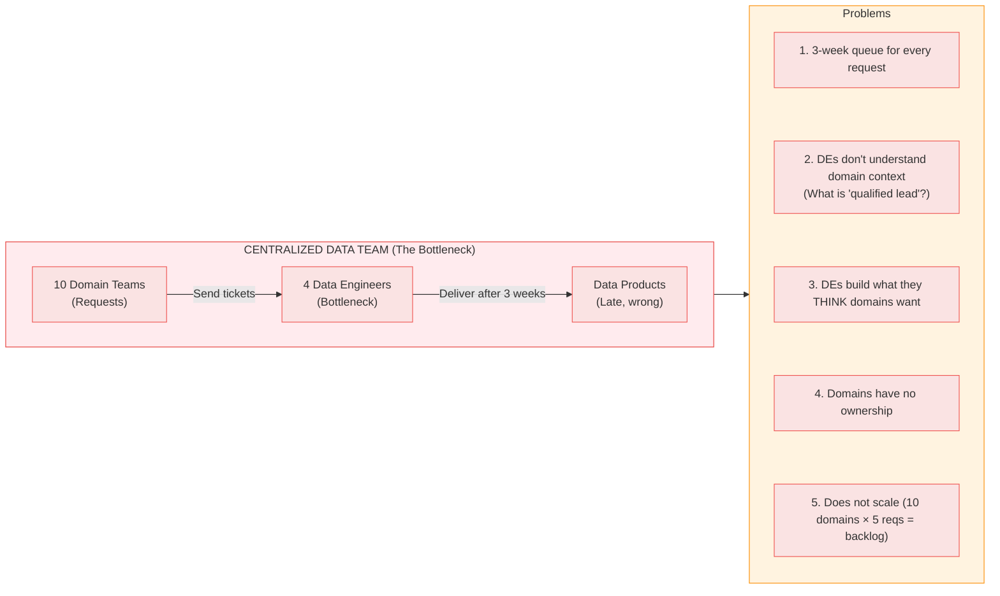
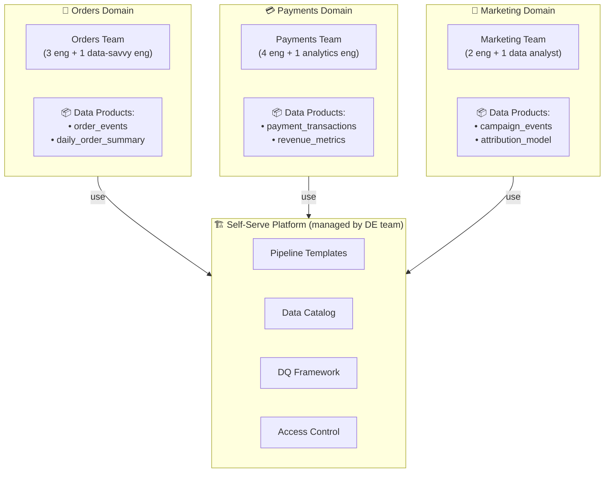

# Data Mesh & Data Products — Complete Guide

> From centralized data team to distributed domain ownership — taught through a real company transformation, not definitions.

(Từ data team tập trung → domain ownership phân tán — được dạy qua ví dụ thực tế, không phải định nghĩa)

---

## 📋 Mục Lục

1. [The Problem (Through a Story)](#the-problem-through-a-story)
2. [4 Principles — In Practice](#4-principles--in-practice)
3. [Building a Real Data Product (Complete Example)](#building-a-real-data-product)
4. [Self-Serve Data Platform — What You Actually Build](#self-serve-data-platform)
5. [Implementation: From Centralized to Mesh](#implementation-from-centralized-to-mesh)
6. [When to Use / When NOT to Use](#when-to-use--when-not-to-use)
7. [Data Mesh vs Data Fabric vs Centralized](#data-mesh-vs-data-fabric-vs-centralized)

---

## The Problem (Through a Story)

### Scene 1: Monday 9 AM — The Request

You are a DE on a 4-person central data team at a 500-person e-commerce company. Three domains send you requests simultaneously:

```
JIRA-4521 (Orders Team):    "Need daily order metrics by region, due Friday"
JIRA-4522 (Payments Team):  "Revenue dashboard broken, URGENT"
JIRA-4523 (Marketing Team): "Campaign attribution model needs new event data"
```

Your backlog already has 15 tickets. Average time to deliver: **3-4 weeks.**

### Scene 2: Tuesday — The Meeting

Orders Team PM in standup: "We asked for this data 3 weeks ago. Our product launch is blocked."

Your manager: "We're hiring a 5th DE. Should help in 3 months."

Orders Team PM: "We have 4 backend engineers who could build this themselves, but they don't have access to the data warehouse."

### Scene 3: The Real Problem



### Data Mesh says: Give each domain ownership of their own data



> 💡 **Key shift:** The 4 DEs stop building domain pipelines. They become a **platform team** that builds tools so domains can self-serve. The Orders Team's backend engineer — who already understands what "qualified order" means — writes the dbt model directly.

---

## 4 Principles — In Practice

### Principle 1: Domain Ownership

**What it actually means:**

The Orders Team doesn't just REQUEST data. They OWN it. They:
- Write the dbt models that generate `daily_order_summary`
- Define what "completed order" means (not the DE team)
- Run data quality checks and get alerted when they fail
- Respond to downstream consumers: "Why did order counts drop?"

**The hard part nobody tells you:**

```
Before Data Mesh:
  Orders backend engineer: "I write APIs. Data is the data team's job."
  
After Data Mesh:
  Orders backend engineer: "I write APIs AND I own the data product 
  that downstream teams consume. If my data is wrong, I fix it."
  
This is a CULTURE change, not a technology change.
Most Data Mesh failures are culture failures, not tech failures.
```

### Principle 2: Data as a Product

A data product is NOT just a table. It's a **product** with SLAs, documentation, consumers, and a feedback channel:

| Attribute | Table (Before) | Data Product (After) |
|-----------|---------------|---------------------|
| Owner | "It's... somewhere in the warehouse" | "Orders Team owns it, ask #data-orders on Slack" |
| Freshness | "It updates... eventually?" | "SLA: < 1 hour. Alert if breached" |
| Quality | "Probably fine" | "4 automated checks, 99.9% completeness" |
| Schema | "SELECT * to find out" | "Documented, versioned, breaking changes notified 30 days prior" |
| Discovery | "Ask Dave, he knows" | "Searchable in Data Catalog with examples" |

### Principle 3: Self-Serve Data Platform

**What the platform team (former central DE team) builds:**

```yaml
# Platform capabilities the DE team provides:
pipeline_templates:
  - name: "batch_s3_to_iceberg"
    description: "Template for batch ingestion from S3 to Iceberg"
    usage: "Domain engineer fills in source/target, platform handles infra"
    
  - name: "cdc_mysql_to_kafka"  
    description: "CDC from MySQL to Kafka using Debezium"
    usage: "Domain specifies MySQL tables, platform provisions Debezium connector"

data_quality:
  framework: "Great Expectations + custom"
  built_in_checks: ["not_null", "unique", "freshness", "row_count_anomaly"]
  domain_custom_checks: "Domains can add domain-specific checks"

catalog:
  tool: "DataHub / Unity Catalog"
  auto_features: ["schema detection", "lineage tracking", "usage stats"]
  
governance:
  auto_enforced: ["PII detection", "naming conventions", "retention policies"]
  domain_managed: ["schema design", "quality thresholds", "consumer SLAs"]
```

### Principle 4: Federated Computational Governance

**Not** "every domain does whatever they want." **Not** "central team controls everything."

**Federated:** global policies set centrally, enforced automatically, domain-specific decisions made locally.

```python
# governance_policies.py — Enforced by the platform automatically

GLOBAL_POLICIES = {
    # Central team decides these — non-negotiable
    "naming": {
        "table_pattern": r"^[a-z][a-z0-9_]*$",     # No CamelCase
        "column_pattern": r"^[a-z][a-z0-9_]*$",
        "date_format": "YYYY-MM-DD",                 # Not MM/DD/YYYY 
    },
    "pii": {
        "auto_detect": True,                          # Platform scans for emails, SSNs
        "classification_required": True,              # Every table must have PII classification
        "masking_enforcement": "row_level_security",
    },
    "retention": {
        "max_raw_data": "7 years",
        "max_pii_unmasked": "2 years",
        "audit_logs": "indefinite",
    },
}

DOMAIN_POLICIES = {
    # Each domain decides these — within global guardrails
    "schema_design": "domain_choice",         # Star vs OBT vs normalized
    "quality_thresholds": "domain_choice",    # 99% vs 99.9% completeness
    "refresh_frequency": "domain_choice",     # Hourly vs daily
    "consumer_sla": "domain_choice",          # Freshness guarantees
}
```

---

## Building a Real Data Product

### The Complete Example: Orders Domain → `daily_order_summary`

This is what a data product looks like end-to-end. Not a diagram — actual files you'd find in a repo.

#### Step 1: Data Product Specification

```yaml
# orders/data_products/daily_order_summary/data_product.yaml
apiVersion: dataproduct/v1
kind: DataProduct

metadata:
  name: daily_order_summary
  domain: orders
  owner: orders-team
  version: "2.3.0"
  classification: internal  # Not PII
  
  contacts:
    slack: "#data-orders"
    oncall: "orders-data-oncall@company.com"

spec:
  description: |
    Aggregated daily order metrics by region and product category.
    Use this for revenue reporting, regional analysis, and trend monitoring.
    DO NOT use this for real-time order tracking (use order_events instead).

  sla:
    freshness: "< 1 hour from source update"
    completeness: "> 99.9% of rows"
    accuracy: "> 99.99%"
    availability: "99.5% uptime"
  
  schema:
    columns:
      - name: order_date
        type: DATE
        description: "Order completion date (UTC)"
        not_null: true
        
      - name: region
        type: STRING
        description: "Geographic region (APAC, EMEA, NA, LATAM)"
        allowed_values: [APAC, EMEA, NA, LATAM]
        
      - name: product_category
        type: STRING
        description: "Product category from catalog"
        
      - name: total_orders
        type: INTEGER
        description: "Count of completed orders"
        constraint: ">= 0"
        
      - name: total_revenue_usd
        type: DECIMAL(15,2)
        description: "Sum of order amounts in USD"
        constraint: ">= 0"
        
      - name: avg_order_value_usd
        type: DECIMAL(10,2)
        description: "Average order value in USD"
  
  quality_checks:
    - name: no_negative_revenue
      sql: "SELECT COUNT(*) FROM {table} WHERE total_revenue_usd < 0"
      expected: 0
      
    - name: row_count_anomaly
      sql: |
        SELECT CASE WHEN today_count < avg_7d * 0.5 THEN 1 ELSE 0 END
        FROM (
          SELECT COUNT(*) as today_count,
                 (SELECT AVG(cnt) FROM (
                    SELECT COUNT(*) as cnt FROM {table} 
                    WHERE order_date >= CURRENT_DATE - 7
                    GROUP BY order_date
                 )) as avg_7d
          FROM {table}
          WHERE order_date = CURRENT_DATE
        )
      expected: 0
      severity: critical

  consumers:
    - team: finance
      use_case: "Monthly revenue reports"
      sla_dependency: "Must have data by 8 AM UTC"
      
    - team: executive-dashboard
      use_case: "CEO daily KPI dashboard"
      sla_dependency: "Must have data by 7 AM UTC"

  breaking_change_policy:
    notification_period: "30 days"
    migration_guide_required: true
    channels: ["#data-orders", "#data-consumers"]
```

#### Step 2: dbt Model Implementation

```sql
-- orders/data_products/daily_order_summary/models/gold/daily_order_summary.sql
{{
  config(
    materialized = 'incremental',
    unique_key = ['order_date', 'region', 'product_category'],
    partition_by = {'field': 'order_date', 'data_type': 'date'},
    cluster_by = ['region'],
    tags = ['daily', 'data-product', 'orders-domain']
  )
}}

WITH completed_orders AS (
    SELECT
        o.order_id,
        o.completed_at,
        o.region,
        p.category AS product_category,
        o.amount_usd
    FROM {{ ref('silver_orders') }} o
    JOIN {{ ref('silver_products') }} p 
        ON o.product_id = p.product_id
    WHERE o.status = 'completed'
    
        AND o.completed_at >= (SELECT MAX(order_date) FROM {{ this }})
    
)

SELECT
    DATE(completed_at) AS order_date,
    region,
    product_category,
    COUNT(DISTINCT order_id) AS total_orders,
    SUM(amount_usd) AS total_revenue_usd,
    ROUND(AVG(amount_usd), 2) AS avg_order_value_usd,
    CURRENT_TIMESTAMP() AS _processed_at
FROM completed_orders
GROUP BY 1, 2, 3
```

#### Step 3: dbt Data Quality Tests

```yaml
# orders/data_products/daily_order_summary/models/gold/schema.yml
version: 2

models:
  - name: daily_order_summary
    description: "Orders domain data product — daily aggregated metrics"
    meta:
      owner: orders-team
      sla_freshness: "< 1 hour"
      data_product: true
      
    columns:
      - name: order_date
        tests:
          - not_null
          - dbt_expectations.expect_column_values_to_be_between:
              min_value: "2020-01-01"
              max_value: "{{ modules.datetime.date.today().isoformat() }}"

      - name: region
        tests:
          - not_null
          - accepted_values:
              values: ['APAC', 'EMEA', 'NA', 'LATAM']

      - name: total_orders
        tests:
          - not_null
          - dbt_expectations.expect_column_values_to_be_between:
              min_value: 0

      - name: total_revenue_usd
        tests:
          - not_null
          - dbt_expectations.expect_column_values_to_be_between:
              min_value: 0

    tests:
      # Composite uniqueness — one row per date/region/category
      - unique:
          column_name: "order_date || '|' || region || '|' || product_category"
      
      # Row count anomaly detection
      - dbt_expectations.expect_table_row_count_to_be_between:
          min_value: 1
          # Alert if less than 50% of 7-day average
```

#### Step 4: Catalog Registration

```python
# orders/data_products/daily_order_summary/catalog_register.py
# Auto-registers this data product in DataHub on every deploy

from datahub.emitter.mce_builder import make_dataset_urn
from datahub.emitter.rest_emitter import DatahubRestEmitter

def register_data_product():
    emitter = DatahubRestEmitter("http://datahub:8080")
    
    dataset_urn = make_dataset_urn(
        platform="iceberg",
        name="gold.daily_order_summary",
    )
    
    # Register with all metadata
    emitter.emit_mce({
        "proposedSnapshot": {
            "urn": dataset_urn,
            "aspects": [
                {
                    "ownership": {
                        "owners": [{"owner": "urn:li:corpuser:orders-team"}],
                    }
                },
                {
                    "glossaryTerms": {
                        "terms": [
                            {"urn": "urn:li:glossaryTerm:DataProduct"},
                            {"urn": "urn:li:glossaryTerm:OrdersDomain"},
                        ]
                    }
                },
                {
                    "institutionalMemory": {
                        "elements": [{
                            "url": "https://wiki.company.com/data/orders/daily_order_summary",
                            "description": "Data Product specification and usage guide",
                        }]
                    }
                },
            ]
        }
    })
```

> 💡 **This is the difference between "we do Data Mesh" and actually doing Data Mesh.** Most companies stop at the data_product.yaml. A real data product has the spec, the model code, quality tests, catalog registration, AND an on-call rotation for when things break.

---

## Self-Serve Data Platform

### What the Platform Team Actually Builds

The central DE team transforms into a platform team. Here's what they ship:

```python
# platform/pipeline_template.py — Template that domain engineers use

from dataclasses import dataclass
from typing import List, Optional

@dataclass
class PipelineConfig:
    """Domain engineers fill this in. Platform handles the rest."""
    domain: str
    source_type: str                    # "s3", "mysql_cdc", "api"
    source_connection: str              # Connection string or bucket
    target_table: str                   # Iceberg table name
    schedule: str                       # Cron expression
    quality_checks: List[str]           # Built-in check names
    owner_email: str
    slack_channel: str
    sla_freshness_minutes: int = 60

class PipelineFactory:
    """Platform generates the full pipeline from a config."""
    
    def create_pipeline(self, config: PipelineConfig):
        # 1. Provision Iceberg table
        self._create_iceberg_table(config)
        
        # 2. Generate Airflow DAG from template
        self._generate_dag(config)
        
        # 3. Set up quality checks
        self._configure_quality(config)
        
        # 4. Register in catalog
        self._register_in_catalog(config)
        
        # 5. Set up monitoring + alerting
        self._setup_monitoring(config)
        
        print(f"✅ Pipeline ready for {config.domain}.{config.target_table}")
        print(f"   Schedule: {config.schedule}")
        print(f"   Quality: {len(config.quality_checks)} checks")
        print(f"   Alerts → {config.slack_channel}")

# Domain engineer usage (the ENTIRE effort for them):
orders_pipeline = PipelineConfig(
    domain="orders",
    source_type="mysql_cdc",
    source_connection="mysql://orders-db:3306/orders",
    target_table="bronze.order_events",
    schedule="*/15 * * * *",  # Every 15 minutes
    quality_checks=["not_null:order_id", "freshness:15min", "row_count_anomaly"],
    owner_email="orders-team@company.com",
    slack_channel="#data-orders",
)

factory = PipelineFactory()
factory.create_pipeline(orders_pipeline)
# That's it. Domain engineer writes 12 lines. Platform handles everything else.
```

---

## Implementation: From Centralized to Mesh

### The 4-Phase Migration (Not Big Bang)

```
Phase 1 (Month 1-3): PILOT
  Pick 1 mature domain (e.g., Orders — they have engineers, clear data)
  Build platform MVP: 1 pipeline template, basic catalog, DQ checks
  Orders team builds 1 data product → learn and iterate
  
Phase 2 (Month 4-6): EXPAND
  Add 2 more domains (Payments, Products)
  Improve platform based on Phase 1 lessons
  Central team: 50% platform work, 50% still serving old requests
  
Phase 3 (Month 7-12): TRANSITION
  Remaining domains onboard
  Central team: 80% platform, 20% consulting
  Establish governance council (1 rep per domain)
  
Phase 4 (Month 12+): STEADY STATE
  All domains self-serve
  Central team = pure platform team
  Governance is federated and automated
```

### What Goes Wrong (and How to Fix It)

| Failure Mode | Root Cause | Fix |
|-------------|-----------|-----|
| "Domains don't want to own data" | Culture — engineers see data as someone else's job | Start with domains that have data-savvy people. Don't force unwilling teams |
| "Quality dropped after decentralization" | No governance enforcement | Platform must AUTOMATICALLY enforce naming, PII, quality thresholds |
| "Everyone built differently" | No templates, no standards | Platform provides opinionated templates, not blank canvases |
| "Cost exploded" | Each domain provisioned their own infra | Platform controls infra — domains use, don't provision |
| "Nobody can find anything" | No catalog, no documentation | Catalog registration must be MANDATORY, not optional |

---

## When to Use / When NOT to Use

### ✅ Use Data Mesh When

| Signal | Why it indicates Mesh |
|--------|-----------------------|
| 3+ distinct data domains with separate teams | Enough complexity to justify distributed ownership |
| Central team backlog > 3 weeks | Bottleneck is organizational, not technical |
| Domain teams have engineers (even 1 each) | Someone can actually own the data |
| Company > 200 people | Coordination cost justifies the investment |
| Data products have different SLAs per domain | One-size-fits-all governance doesn't work |

### ❌ Do NOT Use Data Mesh When

| Signal | What to use instead |
|--------|-------------------|
| < 3 domains or < 50 people | Centralized team is perfectly fine |
| No engineering talent in domains | They can't own what they can't build |
| You haven't mastered basic DE yet | Get fundamentals right first (Medallion, dbt, DQ) |
| "We want Data Mesh because it's trendy" | This is not a reason. It's organizational surgery |
| Single monolithic application | One app = one team = no need to distribute |

> ⚠️ **Warning from the field:** Every failed Data Mesh implementation I've seen failed for the same reason: they treated it as a technology project ("let's deploy DataHub!") instead of an organizational change ("let's change how teams own data"). The technology is 20% of the work. Culture is 80%.

---

## Data Mesh vs Data Fabric vs Centralized

| Dimension | **Centralized** | **Data Mesh** | **Data Fabric** |
|-----------|-----------------|---------------|-----------------|
| **Org model** | 1 data team owns everything | Domain teams own their data | Central team + AI automation |
| **Scaling** | Bottleneck at ~5 domains | Scales horizontally with domains | Scales with AI/metadata mgmt |
| **Who writes pipelines** | Central data engineers | Domain engineers using templates | Auto-generated by AI |
| **Governance** | Central control | Federated (global + local) | AI-assisted, centrally managed |
| **Best for** | Companies < 100 people | Large enterprises with mature domains | Data-heavy companies investing in AI/ML |
| **Risk** | Permanent bottleneck | Culture failure if domains won't own | Vendor lock-in, AI complexity |
| **Cost** | Low (shared resources) | Medium (distributed) | High (AI/ML infrastructure) |
| **Maturity needed** | Junior DE team can manage | Senior DE team + mature domains | Senior DE + ML engineers |

---

## Liên Kết

- [Data Contracts](24_Data_Contracts.md) — the formal agreement between data producers and consumers
- [Architectural Thinking](../mindset/02_Architectural_Thinking.md) — design patterns for combining components
- [01_Design_Patterns](../mindset/01_Design_Patterns.md) — individual patterns used within a Mesh
- [11_Data_Catalogs](../tools/11_Data_Catalogs_Guide.md) — tools for the self-serve platform (DataHub, Unity Catalog)

---

*Data Mesh is organizational change disguised as a technology initiative. The tools are easy. Getting teams to own their data is hard.*

*Updated: February 2026*
