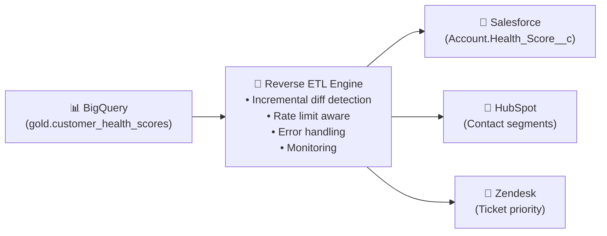

# Reverse ETL — Complete Guide

> Push enriched data FROM your warehouse BACK into operational systems — taught through real scenarios where "just make an API" doesn't work.

(Đẩy data đã được enriched từ warehouse ngược lại vào operational systems)

---

## 📋 Mục Lục

1. [The Problem (Through a Story)](#the-problem-through-a-story)
2. [Architecture Patterns](#architecture-patterns)
3. [Build vs Buy Decision](#build-vs-buy-decision)
4. [Full Implementation: Customer Health → Salesforce](#full-implementation-customer-health--salesforce)
5. [Handling Rate Limits (The Hard Part)](#handling-rate-limits)
6. [Monitoring & Failure Recovery](#monitoring--failure-recovery)
7. [When to Use / When NOT to Use](#when-to-use--when-not-to-use)

---

## The Problem (Through a Story)

### Scene 1: The Brilliant Score Nobody Uses

Your data team builds a Customer Health Score model. It runs daily in BigQuery, analyzing product usage, support tickets, payment history, and NPS responses. It's genuinely good — 87% accuracy at predicting churn 30 days out.

```sql
-- This lives in BigQuery gold layer
SELECT
    customer_id,
    company_name,
    health_score,           -- 0-100 composite score
    churn_probability,      -- ML model output
    days_since_last_login,
    support_ticket_count_30d,
    feature_adoption_pct,
    expansion_signal         -- TRUE if near quota limit
FROM gold.customer_health_scores
WHERE health_score < 40     -- At-risk customers
ORDER BY annual_revenue DESC;
-- Result: 142 at-risk accounts totaling $8.2M ARR
```

But the Sales team works in Salesforce. They never open BigQuery. They don't even have BigQuery access. Every morning they check Salesforce dashboards, work their Salesforce queues, update Salesforce opportunities.

**$8.2M in at-risk revenue identified. Nobody acts on it because the data is in the wrong system.**

### Scene 2: The Hacky Solution

A junior DE writes a Python script that:
1. Queries BigQuery for health scores
2. Updates Salesforce via API
3. Runs via cron on someone's laptop

```python
# hacky_sync.py — DO NOT do this in production
# Problems: runs on a laptop, no monitoring, no error handling,
# no deduplication, no rate limiting, breaks every 2 weeks

import simple_salesforce
from google.cloud import bigquery

bq = bigquery.Client()
sf = simple_salesforce.Salesforce(username="dave@company.com", ...)

rows = bq.query("SELECT * FROM gold.customer_health_scores").result()

for row in rows:  # ← No batching. 10,000 individual API calls.
    sf.Account.update(row["sf_account_id"], {
        "Health_Score__c": row["health_score"],
    })
    # ← No error handling. One failure = script dies, partial update.
    # ← No rate limiting. Salesforce will throttle you.
    # ← No dedup. If script runs twice = double updates counted in audit log.

print("done")  # ← "monitoring"
```

This breaks every Tuesday when Dave's laptop goes to sleep. Sales: "Why is the health score always stale?"

### Scene 3: Reverse ETL Does This Right



---

## Architecture Patterns

### Pattern 1: Diff-Based Sync (Most Common)

The engine compares the current warehouse state against the last synced state. Only changed records get pushed.

```
Full sync: 50,000 customers × every hour = 50,000 API calls/hour
Diff sync: ~200 changed customers/hour = 200 API calls/hour

Result: 250x fewer API calls. Stays within rate limits.
```

#### How diff detection works:

```python
# diff_engine.py — Core of any Reverse ETL system
import hashlib
from typing import List, Dict, Optional
from datetime import datetime

class DiffEngine:
    """
    Detect which records changed since the last sync.
    Stores a hash of each record's synced state.
    """
    
    def __init__(self, state_store):
        self.state_store = state_store  # Redis, PostgreSQL, or S3
    
    def compute_diff(
        self, 
        current_records: List[Dict], 
        sync_id: str,
        key_field: str,
    ) -> Dict[str, List[Dict]]:
        """
        Compare current records against last synced state.
        Returns: {"added": [...], "updated": [...], "deleted": [...]}
        """
        result = {"added": [], "updated": [], "deleted": []}
        
        # Get previous state
        previous_hashes = self.state_store.get_all_hashes(sync_id)
        current_keys = set()
        
        for record in current_records:
            key = str(record[key_field])
            current_keys.add(key)
            
            # Hash the record (excluding metadata fields)
            record_hash = self._hash_record(record)
            previous_hash = previous_hashes.get(key)
            
            if previous_hash is None:
                result["added"].append(record)
            elif record_hash != previous_hash:
                result["updated"].append(record)
            # else: unchanged — skip
        
        # Detect deletes: keys in previous but not in current
        deleted_keys = set(previous_hashes.keys()) - current_keys
        for key in deleted_keys:
            result["deleted"].append({key_field: key})
        
        return result
    
    def commit(self, sync_id: str, records: List[Dict], key_field: str):
        """Save current state after successful sync."""
        hashes = {
            str(r[key_field]): self._hash_record(r) for r in records
        }
        self.state_store.save_all_hashes(sync_id, hashes)
    
    def _hash_record(self, record: Dict) -> str:
        # Exclude internal fields from hash
        clean = {k: v for k, v in sorted(record.items()) 
                 if not k.startswith("_")}
        return hashlib.sha256(str(clean).encode()).hexdigest()
```

### Pattern 2: dbt + Reverse ETL (The Modern Stack)

```
  dbt defines WHAT data to sync (SQL models)
  Reverse ETL tool defines WHERE to push it
  
  This is powerful because:
  - Business logic is version-controlled in dbt (not hidden in a tool UI)
  - Same dbt model can be synced to 3 destinations simultaneously
  - Data team reviews the SQL, ops team manages the destinations
```

```sql
-- dbt model: marts/sales/customer_health_for_salesforce.sql
-- This model is SPECIFICALLY designed for Reverse ETL to Salesforce

{{
  config(
    materialized = 'table',
    tags = ['reverse_etl', 'salesforce']
  )
}}

SELECT
    c.salesforce_account_id,       -- Required: lookup key in Salesforce
    h.health_score,
    h.churn_probability,
    h.expansion_signal,
    h.days_since_last_login,
    CASE
        WHEN h.health_score < 30 THEN 'Critical'
        WHEN h.health_score < 60 THEN 'At Risk'
        WHEN h.health_score < 80 THEN 'Healthy'
        ELSE 'Champion'
    END AS health_tier,            -- Match Salesforce picklist values
    h.last_calculated_at
FROM {{ ref('customer_health_scores') }} h
JOIN {{ ref('customer_id_mapping') }} c 
    ON h.customer_id = c.internal_customer_id
WHERE c.salesforce_account_id IS NOT NULL  -- Only sync customers IN Salesforce
```

---

## Build vs Buy Decision

| Criterion | Build Custom | Buy (Census/Hightouch) |
|-----------|-------------|----------------------|
| **Destinations** | 1-2 | 3+ |
| **Who configures syncs** | Engineers only | Marketing/Sales/Ops too |
| **Rate limit handling** | You implement | Built-in |
| **Error recovery** | You implement | Built-in |
| **Monitoring** | You implement | Built-in dashboards |
| **Cost** | Engineering time ($) | $500-5,000/mo |
| **Data sensitivity** | Full control (no SaaS) | Data passes through vendor |
| **Team size** | 1 DE can maintain | Non-technical users can manage |

> 💡 **Rule of thumb:** If you're syncing to 1 destination and you have engineers, build it. If you're syncing to 3+ destinations or non-engineers need to manage it, buy it.

---

## Full Implementation: Customer Health → Salesforce

### The Complete Production Pipeline

```python
# reverse_etl_pipeline.py — Production-grade Reverse ETL

import logging
import time
from datetime import datetime, timedelta
from typing import List, Dict, Optional
from dataclasses import dataclass, field
from google.cloud import bigquery
from simple_salesforce import Salesforce, SalesforceError

logger = logging.getLogger(__name__)

@dataclass
class SyncConfig:
    """Configuration for a Reverse ETL sync."""
    name: str
    source_query: str
    destination: str
    dest_object: str           # Salesforce object (Account, Contact, etc.)
    key_field: str             # Field to match records (External_ID__c)
    field_mapping: Dict[str, str]  # source_col → dest_field
    schedule: str = "0 * * * *"    # Cron: every hour
    batch_size: int = 200          # Salesforce bulk API limit
    max_retries: int = 3
    rate_limit_pause_seconds: int = 60

@dataclass 
class SyncResult:
    """Result of a sync run."""
    sync_name: str
    started_at: datetime
    completed_at: Optional[datetime] = None
    records_added: int = 0
    records_updated: int = 0
    records_failed: int = 0
    errors: List[str] = field(default_factory=list)
    
    @property
    def success(self) -> bool:
        return self.records_failed == 0 and self.completed_at is not None


class ReverseETLPipeline:
    """
    Production Reverse ETL pipeline with:
    - Incremental diff detection
    - Salesforce bulk API with rate limit handling
    - Retry with exponential backoff
    - Comprehensive logging and monitoring
    """
    
    def __init__(self, bq_client: bigquery.Client, sf: Salesforce):
        self.bq = bq_client
        self.sf = sf
        self.diff_engine = DiffEngine(state_store=RedisStateStore())
    
    def run_sync(self, config: SyncConfig) -> SyncResult:
        """Execute a full sync cycle."""
        result = SyncResult(sync_name=config.name, started_at=datetime.utcnow())
        
        try:
            # Step 1: Extract from warehouse
            logger.info(f"[{config.name}] Extracting from BigQuery...")
            current_records = self._extract(config.source_query)
            logger.info(f"[{config.name}] Extracted {len(current_records)} records")
            
            # Step 2: Compute diff (only changed records)
            logger.info(f"[{config.name}] Computing diff...")
            diff = self.diff_engine.compute_diff(
                current_records, config.name, config.key_field
            )
            
            total_changes = len(diff["added"]) + len(diff["updated"])
            logger.info(
                f"[{config.name}] Diff: {len(diff['added'])} added, "
                f"{len(diff['updated'])} updated, {len(diff['deleted'])} deleted, "
                f"{len(current_records) - total_changes} unchanged (skipped)"
            )
            
            if total_changes == 0:
                logger.info(f"[{config.name}] No changes. Skipping sync.")
                result.completed_at = datetime.utcnow()
                return result
            
            # Step 3: Map fields to destination format
            records_to_sync = self._map_fields(
                diff["added"] + diff["updated"], config.field_mapping
            )
            
            # Step 4: Load to Salesforce (with rate limit handling)
            logger.info(f"[{config.name}] Syncing {len(records_to_sync)} records to Salesforce...")
            self._load_to_salesforce(
                records_to_sync, config, result
            )
            
            # Step 5: Commit state (only after successful load)
            if result.records_failed == 0:
                self.diff_engine.commit(
                    config.name, current_records, config.key_field
                )
            
            result.completed_at = datetime.utcnow()
            duration = (result.completed_at - result.started_at).total_seconds()
            logger.info(
                f"[{config.name}] ✅ Complete in {duration:.1f}s. "
                f"Added: {result.records_added}, Updated: {result.records_updated}, "
                f"Failed: {result.records_failed}"
            )
            
        except Exception as e:
            result.errors.append(str(e))
            logger.error(f"[{config.name}] ❌ Sync failed: {e}")
            raise
        
        return result
    
    def _extract(self, query: str) -> List[Dict]:
        """Extract records from BigQuery."""
        rows = self.bq.query(query).result()
        return [dict(row) for row in rows]
    
    def _map_fields(
        self, records: List[Dict], mapping: Dict[str, str]
    ) -> List[Dict]:
        """Map source fields to destination field names."""
        return [
            {mapping[k]: v for k, v in record.items() if k in mapping}
            for record in records
        ]
    
    def _load_to_salesforce(
        self, records: List[Dict], config: SyncConfig, result: SyncResult
    ):
        """
        Bulk upsert to Salesforce with rate limit handling.
        
        Key considerations:
        - Salesforce bulk API accepts max 200 records per batch
        - Rate limit: 100,000 API calls per 24 hours (Enterprise)
        - On rate limit (HTTP 429): pause and retry
        """
        batches = [
            records[i:i + config.batch_size]
            for i in range(0, len(records), config.batch_size)
        ]
        
        for batch_idx, batch in enumerate(batches):
            retries = 0
            while retries <= config.max_retries:
                try:
                    # Use Salesforce Bulk API for efficiency
                    sf_object = getattr(self.sf.bulk, config.dest_object)
                    responses = sf_object.upsert(
                        batch, config.key_field, batch_size=200
                    )
                    
                    for resp in responses:
                        if resp.get("success"):
                            if resp.get("created"):
                                result.records_added += 1
                            else:
                                result.records_updated += 1
                        else:
                            result.records_failed += 1
                            error_msg = str(resp.get("errors", []))
                            result.errors.append(error_msg)
                            logger.warning(f"Record failed: {error_msg}")
                    
                    break  # Success — exit retry loop
                    
                except SalesforceError as e:
                    if "REQUEST_LIMIT_EXCEEDED" in str(e):
                        retries += 1
                        pause = config.rate_limit_pause_seconds * retries
                        logger.warning(
                            f"Rate limited! Pausing {pause}s "
                            f"(retry {retries}/{config.max_retries})"
                        )
                        time.sleep(pause)
                    else:
                        raise
            
            if (batch_idx + 1) % 10 == 0:
                logger.info(
                    f"  Progress: {batch_idx + 1}/{len(batches)} batches "
                    f"({result.records_added + result.records_updated} synced)"
                )


# === Usage ===

config = SyncConfig(
    name="customer_health_to_salesforce",
    source_query="""
        SELECT
            salesforce_account_id,
            health_score,
            churn_probability,
            expansion_signal,
            days_since_last_login,
            CASE
                WHEN health_score < 30 THEN 'Critical'
                WHEN health_score < 60 THEN 'At Risk'
                WHEN health_score < 80 THEN 'Healthy'
                ELSE 'Champion'
            END AS health_tier,
            CURRENT_TIMESTAMP() AS last_synced_at
        FROM `project.gold.customer_health_scores` h
        JOIN `project.gold.customer_id_mapping` c 
            ON h.customer_id = c.internal_customer_id
        WHERE c.salesforce_account_id IS NOT NULL
    """,
    destination="salesforce",
    dest_object="Account",
    key_field="External_ID__c",
    field_mapping={
        "salesforce_account_id": "External_ID__c",
        "health_score": "Health_Score__c",
        "churn_probability": "Churn_Probability__c",
        "expansion_signal": "Expansion_Signal__c",
        "health_tier": "Health_Tier__c",
        "last_synced_at": "Health_Score_Updated__c",
    },
    batch_size=200,
    rate_limit_pause_seconds=60,
)

pipeline = ReverseETLPipeline(bq_client, sf_client)
result = pipeline.run_sync(config)
```

---

## Handling Rate Limits

### The problem most people learn the hard way

```
You have 50,000 customers to sync to Salesforce.
Salesforce Enterprise = 100,000 API calls per 24 hours.
Your Reverse ETL uses 1 API call per record.

50,000 customers × 1 call each = 50,000 calls
+ Your CRM team's daily usage = 30,000 calls
+ Other integrations = 25,000 calls
─────────────────────────────────────────
Total: 105,000 calls > 100,000 limit

Result: Salesforce blocks ALL API calls at 3 PM.
Sales team can't update deals. VP of Sales escalates to CTO.
Your career at this company is in trouble.
```

### Solution: Smart Batching + Time Distribution

```python
# rate_limiter.py — Respect SaaS API limits

RATE_LIMITS = {
    "salesforce": {
        "daily_limit": 100_000,
        "reserve_for_users": 40_000,  # Leave capacity for human usage
        "available_for_sync": 60_000,
        "bulk_batch_size": 200,       # Bulk API: 200 records per call
        "effective_records_per_day": 60_000 * 200,  # 12M records!
    },
    "hubspot": {
        "daily_limit": 500_000,       # Enterprise
        "per_10_seconds": 100,        # Burst limit
        "batch_size": 100,
    },
    "google_ads": {
        "daily_operations": 15_000,
        "per_minute": 1_000,
    },
}

# Key insight: Use BULK APIs, not individual record APIs
# Salesforce REST API: 1 call = 1 record → 50,000 calls for 50,000 records
# Salesforce BULK API: 1 call = 200 records → 250 calls for 50,000 records
# That's a 200x improvement!
```

### HubSpot Example: What Happens When You Hit the Limit

```python
# hubspot_sync.py — Real rate limit handling

import time
import requests
from typing import List, Dict

class HubSpotSync:
    """Sync data to HubSpot with rate limit awareness."""
    
    BASE_URL = "https://api.hubapi.com"
    
    def __init__(self, api_key: str):
        self.api_key = api_key
        self.calls_this_window = 0
        self.window_start = time.time()
    
    def upsert_contacts(self, contacts: List[Dict]):
        """
        Batch upsert contacts to HubSpot.
        
        HubSpot limits:
        - 100 requests per 10 seconds
        - 500,000 requests per day (Enterprise)
        """
        # Use batch endpoint: 100 contacts per call
        batches = [contacts[i:i+100] for i in range(0, len(contacts), 100)]
        
        for batch in batches:
            self._respect_rate_limit()
            
            response = requests.post(
                f"{self.BASE_URL}/crm/v3/objects/contacts/batch/upsert",
                headers={
                    "Authorization": f"Bearer {self.api_key}",
                    "Content-Type": "application/json",
                },
                json={
                    "inputs": [
                        {
                            "idProperty": "email",
                            "id": c["email"],
                            "properties": {
                                "health_score": str(c["health_score"]),
                                "segment": c["segment"],
                                "last_login": c.get("last_login_date", ""),
                            }
                        }
                        for c in batch
                    ]
                }
            )
            
            if response.status_code == 429:
                # Rate limited — HubSpot tells you when to retry
                retry_after = int(response.headers.get("Retry-After", 10))
                logger.warning(f"HubSpot rate limited. Waiting {retry_after}s...")
                time.sleep(retry_after)
                # Retry this batch
                continue
            
            response.raise_for_status()
            self.calls_this_window += 1
    
    def _respect_rate_limit(self):
        """Proactively throttle to stay under rate limits."""
        # HubSpot: 100 requests per 10 seconds
        if self.calls_this_window >= 90:  # Leave 10% headroom
            elapsed = time.time() - self.window_start
            if elapsed < 10:
                sleep_time = 10 - elapsed + 0.5  # Extra 0.5s buffer
                logger.info(f"Pre-emptive throttle: sleeping {sleep_time:.1f}s")
                time.sleep(sleep_time)
            
            self.calls_this_window = 0
            self.window_start = time.time()
```

---

## Monitoring & Failure Recovery

### What to Monitor

```python
# monitoring.py — Metrics for Reverse ETL pipelines

METRICS = {
    "sync_records_total": {
        "type": "counter",
        "labels": ["sync_name", "status"],  # status: success, failed, skipped
        "alert": "If failed > 5% of total → page on-call",
    },
    "sync_duration_seconds": {
        "type": "histogram",
        "alert": "If > 2x average → investigate",
    },
    "sync_freshness_seconds": {
        "type": "gauge",
        "description": "Seconds since last successful sync",
        "alert": "If > 2 hours → sales team has stale data",
    },
    "destination_rate_limit_hits": {
        "type": "counter",
        "alert": "If > 5 per hour → review API usage budget",
    },
}
```

### Failure Recovery: What Happens When Salesforce Is Down

```
Scenario: Salesforce maintenance window on Saturday 2-6 AM UTC.
Your sync runs every hour.

WITHOUT recovery plan:
  02:00 — Sync fails → Error logged
  03:00 — Sync fails → Error logged  
  04:00 — Sync fails → Error logged
  05:00 — Sync fails → Error logged
  06:00 — Salesforce back → Sync succeeds but ONLY with current hour's diff
  
  Result: 4 hours of data changes are LOST. Health scores are stale.

WITH recovery plan (idempotent full sync on failure):
  02:00 — Sync fails → Mark as "needs_full_sync"
  03:00 — Sync fails → Already marked
  06:00 — Salesforce back → Detect "needs_full_sync" flag → Do FULL diff sync
  06:05 — All 4 hours of changes synced in one batch

  Result: Zero data loss. Automatic recovery.
```

---

## When to Use / When NOT to Use

### ✅ Use Reverse ETL When

| Situation | Example |
|-----------|---------|
| Data enrichment for operational teams | Health scores in Salesforce, segments in HubSpot |
| Personalization at scale | User segments → feature flags, in-app messaging |
| Automated workflows | "High churn risk" → auto-create support ticket |
| Ad targeting | Customer segments → Google/Facebook Ads audiences |
| Operational reporting | Warehouse metrics → Slack / PagerDuty |

### ❌ Do NOT Use Reverse ETL When

| Situation | What to use instead |
|-----------|-------------------|
| Real-time sync (< 1 min latency) | Event streaming (Kafka → direct integration) |
| Simple data copy between DBs | Database replication / CDC |
| One-off data migration | Migration script |
| Frontend needs fresh data | API from warehouse directly (OLAP API) |
| Syncing to internal systems you control | Write to the DB directly |

> 💡 **Key insight:** Reverse ETL solves the "last mile" problem — getting insights from the warehouse into the tools where people actually work. If your users don't work in the warehouse (and most don't), Reverse ETL is how insights become actions.

---

## Liên Kết

- [08_Data_Integration_APIs](08_Data_Integration_APIs.md) — API patterns, CDC, webhook processing
- [23_Data_Mesh_Data_Products](23_Data_Mesh_Data_Products.md) — Data products that Reverse ETL distributes
- [07_dbt](../tools/07_dbt.md) — dbt models that define what to sync

---

*Reverse ETL closes the loop: Operational data → Warehouse → Insights → Back to Operations. Data warehouse is not the destination — it's the engine.*

*Updated: February 2026*
