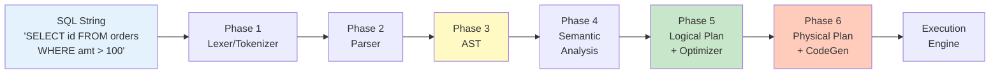
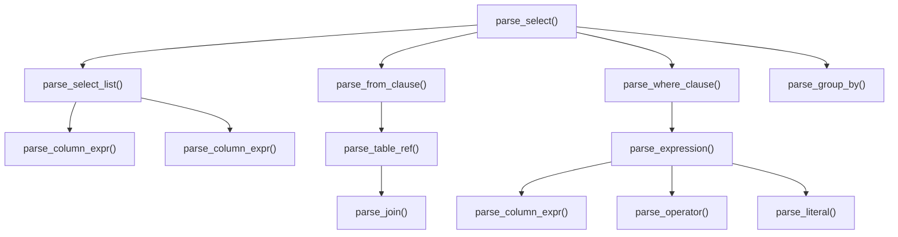
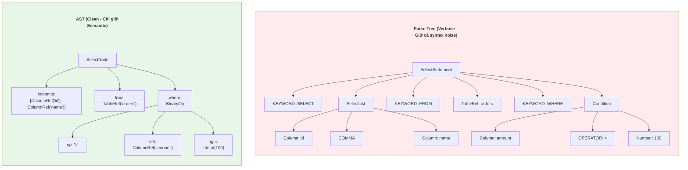
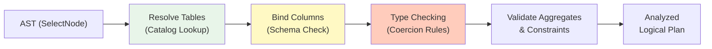
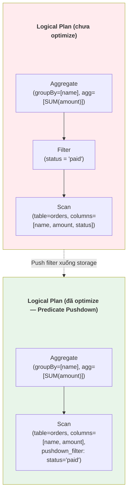
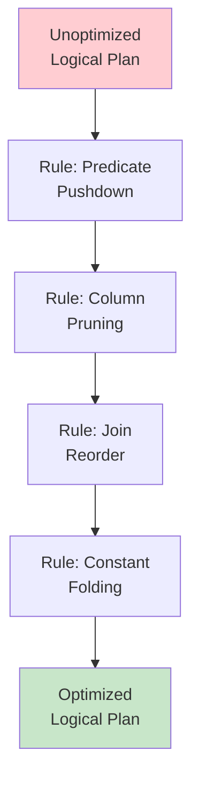
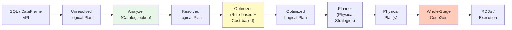

# 🌳 SQL Compilation & Abstract Syntax Trees

> Từ chuỗi ký tự `SELECT * FROM orders WHERE amount > 100` đến Execution Plan tối ưu — hành trình mà mọi Query Engine phải đi qua.

---

## 📋 Mục Lục

1. [Tại Sao DE Cần Hiểu Compiler?](#tại-sao-de-cần-hiểu-compiler)
2. [Tổng Quan Pipeline Biên Dịch SQL](#tổng-quan-pipeline-biên-dịch-sql)
3. [Phase 1: Lexical Analysis (Tokenizer)](#phase-1-lexical-analysis-tokenizer)
4. [Phase 2: Syntax Analysis (Parser)](#phase-2-syntax-analysis-parser)
5. [Phase 3: Abstract Syntax Tree (AST)](#phase-3-abstract-syntax-tree-ast)
6. [Phase 4: Semantic Analysis](#phase-4-semantic-analysis)
7. [Phase 5: Logical Plan & Optimization](#phase-5-logical-plan--optimization)
8. [Phase 6: Physical Plan & Code Generation](#phase-6-physical-plan--code-generation)
9. [Deep Dive: Catalyst Optimizer (Spark)](#deep-dive-catalyst-optimizer-spark)
10. [Deep Dive: Calcite (Trino/Hive/Flink)](#deep-dive-calcite-trinohiveflink)
11. [Thực Hành: Viết Mini SQL Parser bằng Python](#thực-hành-viết-mini-sql-parser-bằng-python)
12. [Parser Generators: ANTLR, JavaCC, Tree-sitter](#parser-generators-antlr-javacc-tree-sitter)
13. [So Sánh Các Approach](#so-sánh-các-approach)
14. [Checklist](#checklist)

---

## Tại Sao DE Cần Hiểu Compiler?

| Tình huống thực tế | Kiến thức Compiler giúp gì |
|---------------------|---------------------------|
| Spark query chạy chậm, EXPLAIN plan khó đọc | Hiểu AST → Logical Plan → Physical Plan giúp bạn đọc plan như đọc code |
| Viết custom UDF mà Catalyst không push-down filter được | Hiểu cách Optimizer traverse AST để biết tại sao UDF chặn optimization |
| Debug lỗi `ParseException` kỳ lạ trong dbt/Trino | Hiểu Tokenizer/Parser giúp bạn biết chính xác ký tự nào gây lỗi |
| Muốn viết SQL linter/formatter cho team | Cần biết cách parse SQL thành AST rồi render lại |
| Chuyển từ "Người dùng Spark" → "Người đóng góp Spark" | Source code Catalyst = 100% compiler theory |

---

## Tổng Quan Pipeline Biên Dịch SQL

Mọi Query Engine (Spark, Trino, DuckDB, PostgreSQL) đều đi qua pipeline này:



**Analogy (Phép so sánh):** Giống như một nhà máy sản xuất:
- **Lexer** = Bộ phận nhận nguyên liệu thô, phân loại từng loại (sắt, đồng, nhựa)
- **Parser** = Bộ phận kiểm tra bản vẽ thiết kế có hợp lệ không
- **AST** = Bản vẽ 3D của sản phẩm
- **Optimizer** = Kỹ sư tối ưu quy trình sản xuất
- **Physical Plan** = Lệnh điều khiển từng máy CNC cụ thể

---

## Phase 1: Lexical Analysis (Tokenizer)

### Tokenizer làm gì?

Tokenizer (hay Lexer) biến chuỗi ký tự thô thành danh sách **Tokens** — đơn vị nhỏ nhất có nghĩa.

```
Input:  "SELECT id, name FROM orders WHERE amount > 100.50"

Output Tokens:
  Token(KEYWORD,  "SELECT")
  Token(IDENT,    "id")
  Token(COMMA,    ",")
  Token(IDENT,    "name")
  Token(KEYWORD,  "FROM")
  Token(IDENT,    "orders")
  Token(KEYWORD,  "WHERE")
  Token(IDENT,    "amount")
  Token(OPERATOR, ">")
  Token(NUMBER,   "100.50")
  Token(EOF)
```

### Các loại Token trong SQL

| Token Type | Ví dụ | Ghi chú |
|-----------|-------|---------|
| KEYWORD | SELECT, FROM, WHERE, JOIN, GROUP BY | Reserved words, case-insensitive |
| IDENTIFIER | orders, customer_id, my_schema.table | Tên bảng, cột, schema |
| LITERAL_NUMBER | 42, 3.14, 1e10 | Integer, Float, Scientific |
| LITERAL_STRING | 'hello', "world" | Quoted strings |
| OPERATOR | =, >, <, >=, !=, LIKE, IN | Comparison & logical |
| PUNCTUATION | (, ), ,, ; | Delimiters |
| WHITESPACE | spaces, tabs, newlines | Thường bị bỏ qua |
| COMMENT | -- single line, /* multi */ | Bị strip trước khi parse |

### === USE CASE: Viết SQL Tokenizer bằng Python ===

```python
"""
SQL Tokenizer — Biến SQL string thành danh sách tokens.
Complexity: O(n) với n = số ký tự trong SQL string.
Ứng dụng thực tế: SQL linter, custom SQL parser, syntax highlighter.
"""
import re
from dataclasses import dataclass
from enum import Enum, auto
from typing import List

class TokenType(Enum):
    KEYWORD    = auto()
    IDENT      = auto()
    NUMBER     = auto()
    STRING     = auto()
    OPERATOR   = auto()
    COMMA      = auto()
    LPAREN     = auto()
    RPAREN     = auto()
    SEMICOLON  = auto()
    DOT        = auto()
    STAR       = auto()
    EOF        = auto()

@dataclass
class Token:
    type: TokenType
    value: str
    position: int  # vị trí trong chuỗi gốc, hữu ích cho error reporting

SQL_KEYWORDS = {
    'SELECT', 'FROM', 'WHERE', 'JOIN', 'LEFT', 'RIGHT', 'INNER', 'OUTER',
    'ON', 'AND', 'OR', 'NOT', 'IN', 'LIKE', 'BETWEEN', 'IS', 'NULL',
    'AS', 'ORDER', 'BY', 'GROUP', 'HAVING', 'LIMIT', 'OFFSET',
    'INSERT', 'UPDATE', 'DELETE', 'CREATE', 'DROP', 'ALTER', 'TABLE',
    'INTO', 'VALUES', 'SET', 'DISTINCT', 'UNION', 'ALL', 'EXISTS',
    'CASE', 'WHEN', 'THEN', 'ELSE', 'END', 'CAST', 'WITH', 'ASC', 'DESC',
}

# Regex patterns — thứ tự quan trọng (greedy match)
TOKEN_PATTERNS = [
    (r"--[^<br>]*",               None),           # Single-line comment → skip
    (r"/\*[\s\S]*?\*/",         None),           # Multi-line comment → skip
    (r"\s+",                    None),           # Whitespace → skip
    (r"'[^']*'",                TokenType.STRING),
    (r">=|<=|!=|<>|<|>|=",      TokenType.OPERATOR),
    (r"\d+\.?\d*",              TokenType.NUMBER),
    (r"[a-zA-Z_]\w*",          None),           # Xử lý riêng: KEYWORD hoặc IDENT
    (r"\(",                     TokenType.LPAREN),
    (r"\)",                     TokenType.RPAREN),
    (r",",                      TokenType.COMMA),
    (r"\.",                     TokenType.DOT),
    (r"\*",                     TokenType.STAR),
    (r";",                      TokenType.SEMICOLON),
]

def tokenize(sql: str) -> List[Token]:
    """
    Tokenize SQL string. O(n) time complexity.
    Raises ValueError nếu gặp ký tự không nhận diện được.
    """
    tokens = []
    pos = 0

    while pos < len(sql):
        match = None
        for pattern, token_type in TOKEN_PATTERNS:
            regex = re.compile(pattern)
            match = regex.match(sql, pos)
            if match:
                value = match.group(0)
                if token_type is not None:
                    tokens.append(Token(token_type, value, pos))
                elif pattern == r"[a-zA-Z_]\w*":
                    # Phân biệt KEYWORD vs IDENTIFIER
                    if value.upper() in SQL_KEYWORDS:
                        tokens.append(Token(TokenType.KEYWORD, value.upper(), pos))
                    else:
                        tokens.append(Token(TokenType.IDENT, value, pos))
                # else: comment hoặc whitespace → bỏ qua
                pos = match.end()
                break

        if not match:
            raise ValueError(
                f"Unexpected character '{sql[pos]}' at position {pos}\n"
                f"Context: ...{sql[max(0,pos-10):pos+10]}..."
            )

    tokens.append(Token(TokenType.EOF, "", pos))
    return tokens


# === Demo ===
if __name__ == "__main__":
    sql = """
    SELECT o.id, c.name, SUM(o.amount) as total
    FROM orders o
    JOIN customers c ON o.customer_id = c.id
    WHERE o.amount > 100.50
    GROUP BY o.id, c.name
    """
    for tok in tokenize(sql):
        print(f"  {tok.type.name:10s} | {tok.value}")
```

---

## Phase 2: Syntax Analysis (Parser)

### Parser làm gì?

Parser nhận danh sách Tokens từ Lexer và xây dựng **Parse Tree** (cây phân tích cú pháp). Nó kiểm tra xem SQL có đúng ngữ pháp (grammar) hay không.

### SQL Grammar (BNF đơn giản hoá)

```
<select_stmt>  ::= SELECT <select_list> FROM <table_ref>
                    [WHERE <expression>]
                    [GROUP BY <column_list>]
                    [ORDER BY <order_list>]
                    [LIMIT <number>]

<select_list>  ::= <column_expr> (',' <column_expr>)*
                 | '*'

<column_expr>  ::= <identifier>
                 | <identifier> '.' <identifier>
                 | <function_call> [AS <identifier>]

<expression>   ::= <column_expr> <operator> <literal>
                 | <expression> AND <expression>
                 | <expression> OR <expression>
```

### Recursive Descent Parser

Kỹ thuật phổ biến nhất cho SQL parser. Mỗi Production Rule trong grammar tương ứng với 1 hàm đệ quy.



---

## Phase 3: Abstract Syntax Tree (AST)

### Parse Tree vs AST

**Parse Tree** giữ nguyên mọi token (kể cả dấu phẩy, ngoặc — noise). **AST** loại bỏ noise, chỉ giữ cấu trúc ngữ nghĩa.



### === USE CASE: AST Node Definitions + Mini Parser ===

```python
"""
Mini SQL Parser — Parse SELECT statements thành AST.
Ứng dụng: Nền tảng để viết SQL linter, auto-formatter, hoặc query rewriter.
Complexity: O(n) với n = số tokens.
"""
from dataclasses import dataclass, field
from typing import List, Optional

# ============================================================
# AST Node Definitions
# ============================================================

@dataclass
class ASTNode:
    """Base class cho tất cả AST nodes"""
    pass

@dataclass
class ColumnRef(ASTNode):
    """Tham chiếu đến cột: 'id' hoặc 'orders.id'"""
    name: str
    table: Optional[str] = None

@dataclass
class Literal(ASTNode):
    """Giá trị hằng: 100, 'hello', NULL"""
    value: object

@dataclass
class BinaryOp(ASTNode):
    """Phép so sánh/toán tử: amount > 100, a AND b"""
    op: str
    left: ASTNode
    right: ASTNode

@dataclass
class FunctionCall(ASTNode):
    """Hàm: SUM(amount), COUNT(*)"""
    name: str
    args: List[ASTNode]
    alias: Optional[str] = None

@dataclass
class TableRef(ASTNode):
    """Bảng: 'orders', 'orders o', 'schema.orders'"""
    name: str
    alias: Optional[str] = None
    schema: Optional[str] = None

@dataclass
class JoinNode(ASTNode):
    """JOIN: orders JOIN customers ON ..."""
    join_type: str   # INNER, LEFT, RIGHT, CROSS
    table: TableRef
    condition: Optional[ASTNode] = None

@dataclass
class SelectNode(ASTNode):
    """Root node cho SELECT statement"""
    columns: List[ASTNode]
    from_table: Optional[TableRef] = None
    joins: List[JoinNode] = field(default_factory=list)
    where: Optional[ASTNode] = None
    group_by: List[ColumnRef] = field(default_factory=list)
    order_by: List[ColumnRef] = field(default_factory=list)
    limit: Optional[int] = None
    distinct: bool = False


# ============================================================
# Recursive Descent Parser
# ============================================================

class SQLParser:
    """
    Recursive Descent Parser cho SELECT statements.
    Grammar hỗ trợ: SELECT, FROM, JOIN, WHERE, GROUP BY, LIMIT.
    """
    def __init__(self, tokens: list):
        self.tokens = tokens
        self.pos = 0

    def current(self):
        return self.tokens[self.pos] if self.pos < len(self.tokens) else None

    def peek(self):
        return self.tokens[self.pos]

    def advance(self):
        tok = self.tokens[self.pos]
        self.pos += 1
        return tok

    def expect(self, token_type=None, value=None):
        tok = self.advance()
        if token_type and tok.type != token_type:
            raise SyntaxError(f"Expected {token_type}, got {tok.type} ('{tok.value}') at pos {tok.position}")
        if value and tok.value != value:
            raise SyntaxError(f"Expected '{value}', got '{tok.value}' at pos {tok.position}")
        return tok

    def parse(self) -> SelectNode:
        """Entry point: parse toàn bộ SELECT statement"""
        return self.parse_select()

    def parse_select(self) -> SelectNode:
        self.expect(value="SELECT")

        distinct = False
        if self.peek().value == "DISTINCT":
            self.advance()
            distinct = True

        columns = self.parse_select_list()

        self.expect(value="FROM")
        from_table = self.parse_table_ref()

        # Parse JOINs
        joins = []
        while self.peek().value in ("JOIN", "INNER", "LEFT", "RIGHT", "CROSS"):
            joins.append(self.parse_join())

        # Parse WHERE
        where = None
        if self.peek().value == "WHERE":
            self.advance()
            where = self.parse_expression()

        # Parse GROUP BY
        group_by = []
        if self.peek().value == "GROUP":
            self.advance()
            self.expect(value="BY")
            group_by = self.parse_column_list()

        # Parse LIMIT
        limit = None
        if self.peek().type != TokenType.EOF and self.peek().value == "LIMIT":
            self.advance()
            limit = int(self.advance().value)

        return SelectNode(
            columns=columns, from_table=from_table, joins=joins,
            where=where, group_by=group_by, limit=limit, distinct=distinct
        )

    def parse_select_list(self) -> List[ASTNode]:
        columns = [self.parse_column_expr()]
        while self.peek().type == TokenType.COMMA:
            self.advance()
            columns.append(self.parse_column_expr())
        return columns

    def parse_column_expr(self) -> ASTNode:
        if self.peek().type == TokenType.STAR:
            self.advance()
            return ColumnRef(name="*")

        tok = self.advance()
        # Check for table.column (dot notation)
        if self.peek().type == TokenType.DOT:
            self.advance()
            col_name = self.advance().value
            node = ColumnRef(name=col_name, table=tok.value)
        # Check for function call: SUM(...)
        elif self.peek().type == TokenType.LPAREN:
            self.advance()  # consume '('
            args = [self.parse_column_expr()]
            self.expect(token_type=TokenType.RPAREN)
            alias = None
            if self.peek().value == "AS":
                self.advance()
                alias = self.advance().value
            node = FunctionCall(name=tok.value.upper(), args=args, alias=alias)
        else:
            node = ColumnRef(name=tok.value)

        # Check for alias without AS
        if (self.peek().type == TokenType.IDENT
            and self.peek().value.upper() not in SQL_KEYWORDS
            and self.peek().value != "AS"):
            pass  # simplified — skip implicit alias for now

        return node

    def parse_table_ref(self) -> TableRef:
        name = self.advance().value
        alias = None
        if (self.peek().type == TokenType.IDENT
            and self.peek().value.upper() not in ("WHERE","JOIN","LEFT","RIGHT","INNER",
                                                   "GROUP","ORDER","LIMIT","ON")):
            alias = self.advance().value
        return TableRef(name=name, alias=alias)

    def parse_join(self) -> JoinNode:
        join_type = "INNER"
        if self.peek().value in ("LEFT", "RIGHT", "CROSS"):
            join_type = self.advance().value
        if self.peek().value in ("OUTER",):
            self.advance()
        self.expect(value="JOIN")
        table = self.parse_table_ref()
        condition = None
        if self.peek().value == "ON":
            self.advance()
            condition = self.parse_expression()
        return JoinNode(join_type=join_type, table=table, condition=condition)

    def parse_expression(self) -> ASTNode:
        left = self.parse_primary()
        if self.peek().type == TokenType.OPERATOR:
            op = self.advance().value
            right = self.parse_primary()
            node = BinaryOp(op=op, left=left, right=right)
        else:
            node = left
        # Handle AND/OR chaining
        while self.peek().value in ("AND", "OR"):
            logic_op = self.advance().value
            right = self.parse_expression()
            node = BinaryOp(op=logic_op, left=node, right=right)
        return node

    def parse_primary(self) -> ASTNode:
        tok = self.peek()
        if tok.type == TokenType.NUMBER:
            self.advance()
            return Literal(value=float(tok.value) if '.' in tok.value else int(tok.value))
        if tok.type == TokenType.STRING:
            self.advance()
            return Literal(value=tok.value.strip("'"))
        if tok.type == TokenType.IDENT:
            self.advance()
            if self.peek().type == TokenType.DOT:
                self.advance()
                col = self.advance().value
                return ColumnRef(name=col, table=tok.value)
            return ColumnRef(name=tok.value)
        raise SyntaxError(f"Unexpected token: {tok}")

    def parse_column_list(self) -> List[ColumnRef]:
        cols = []
        tok = self.advance()
        if self.peek().type == TokenType.DOT:
            self.advance()
            col = self.advance().value
            cols.append(ColumnRef(name=col, table=tok.value))
        else:
            cols.append(ColumnRef(name=tok.value))
        while self.peek().type == TokenType.COMMA:
            self.advance()
            tok = self.advance()
            if self.peek().type == TokenType.DOT:
                self.advance()
                col = self.advance().value
                cols.append(ColumnRef(name=col, table=tok.value))
            else:
                cols.append(ColumnRef(name=tok.value))
        return cols


# === Demo: Parse a real SQL ===
if __name__ == "__main__":
    sql = "SELECT o.id, c.name, SUM(o.amount) AS total FROM orders o JOIN customers c ON o.customer_id = c.id WHERE o.amount > 100 GROUP BY o.id, c.name LIMIT 50"

    tokens = tokenize(sql)
    parser = SQLParser(tokens)
    ast = parser.parse()

    print("=== AST ===")
    print(f"Columns: {ast.columns}")
    print(f"From: {ast.from_table}")
    print(f"Joins: {ast.joins}")
    print(f"Where: {ast.where}")
    print(f"Group By: {ast.group_by}")
    print(f"Limit: {ast.limit}")
```

---

## Phase 4: Semantic Analysis

Sau khi có AST, engine cần kiểm tra **ngữ nghĩa** (semantics):

| Kiểm tra | Ví dụ lỗi |
|----------|-----------|
| Table tồn tại không? | `SELECT * FROM non_existent_table` |
| Column có trong table? | `SELECT xyz FROM orders` (orders không có cột xyz) |
| Type có khớp không? | `WHERE name > 100` (so sánh string với number) |
| Ambiguous column? | `SELECT id FROM orders JOIN customers` (cả 2 bảng đều có `id`) |
| Aggregate hợp lệ? | `SELECT name, SUM(amount)` thiếu `GROUP BY name` |



---

## Phase 5: Logical Plan & Optimization

### Logical Plan

AST được chuyển thành **Logical Plan** — một cây các phép toán Relational Algebra:



### Các Rule Optimization phổ biến

| Rule | Trước | Sau | Tác dụng |
|------|-------|-----|----------|
| **Predicate Pushdown** | Filter trên toàn bộ scan | Filter đẩy xuống Storage layer | Giảm I/O lên tới 99% |
| **Projection Pushdown** | Đọc tất cả columns | Chỉ đọc columns cần | Giảm memory + I/O (columnar formats) |
| **Constant Folding** | `WHERE 1+1 = 2` | `WHERE true` → bỏ filter | Bớt computation |
| **Join Reordering** | A JOIN B JOIN C (B lớn nhất) | A JOIN C JOIN B | Giảm intermediate data |
| **Common Subexpression** | `SUM(a*b), AVG(a*b)` | Tính `a*b` 1 lần, reuse | Giảm computation |



---

## Phase 6: Physical Plan & Code Generation

Physical Plan chọn **thuật toán cụ thể** cho mỗi phép toán logic:

| Logical Operator | Physical Operator Options | Khi nào dùng |
|-----------------|--------------------------|--------------|
| Join | **Hash Join** | Bảng nhỏ fit RAM (broadcast) |
| Join | **Sort-Merge Join** | Cả 2 bảng lớn, đã sorted |
| Join | **Nested Loop Join** | Cross join hoặc non-equi join |
| Aggregate | **Hash Aggregate** | Cardinality thấp (ít groups) |
| Aggregate | **Sort Aggregate** | Data đã sorted sẵn |
| Scan | **Sequential Scan** | Không có index/filter |
| Scan | **Index Scan** | Có index phù hợp |

### Cost-Based Optimizer (CBO)

Khác với Rule-Based (áp rule cố định), CBO dùng **statistics** để chọn plan tốt nhất:

```
Statistics cần:
- Table cardinality: orders có 100M rows
- Column statistics: amount: min=0, max=99999, distinct=50000, null_count=0
- Histogram: phân bố giá trị amount (skew detection)

CBO tính toán:
- Hash Join cost = build_hash(small_table) + probe(large_table)
- Sort-Merge Join cost = sort(table_A) + sort(table_B) + merge
- Chọn plan có cost thấp nhất
```

---

## Deep Dive: Catalyst Optimizer (Spark)

Spark SQL dùng **Catalyst** — một framework optimizer viết bằng Scala, dựa trên Trees và Rules.



**Tại sao điều này quan trọng cho DE?**

```python
# Spark: 2 cách viết, Catalyst generate CÙNG physical plan
# Cách 1: SQL
spark.sql("""
    SELECT department, AVG(salary) 
    FROM employees 
    WHERE salary > 50000 
    GROUP BY department
""")

# Cách 2: DataFrame API
(df.filter(col("salary") > 50000)
   .groupBy("department")
   .agg(avg("salary")))

# Cả 2 đi qua Catalyst → cùng 1 Optimized Plan → cùng performance.
# KẾT LUẬN: Đừng tranh cãi SQL vs DataFrame API. Catalyst lo hết.
```

---

## Deep Dive: Calcite (Trino/Hive/Flink)

**Apache Calcite** là framework optimizer phổ biến nhất thế giới open-source. Được dùng bởi:
- Trino/Presto
- Apache Hive
- Apache Flink
- Apache Drill
- Apache Phoenix (HBase)

| Tính năng | Catalyst (Spark) | Calcite (Trino/Flink) |
|-----------|-----------------|----------------------|
| Ngôn ngữ | Scala | Java |
| Pattern matching | Scala case classes | RelOptRule |
| CBO | Có (từ Spark 2.2) | Có (Volcano/Cascades) |
| SQL Parser | ANTLR-based | JavaCC-based (SqlParser) |
| Extensible | Plugin UDFs | Plugin rules + adapters |
| Dùng cho | Spark ecosystem | Multi-engine (Trino, Flink) |

---

## Parser Generators: ANTLR, JavaCC, Tree-sitter

Không ai viết parser từ đầu cho production SQL engine. Họ dùng **Parser Generator**:

### ANTLR (ANother Tool for Language Recognition)

**Dùng bởi:** Spark SQL, Presto (ban đầu), Hive

```
// File: SqlBase.g4 (ANTLR grammar cho Spark SQL — rút gọn)
grammar SqlBase;

statement
    : query                                          #statementDefault
    | CREATE TABLE identifier tableSchema            #createTable
    ;

query
    : SELECT setQuantifier? selectItem (',' selectItem)*
      FROM tableRef
      (WHERE booleanExpression)?
      (GROUP BY groupByItem (',' groupByItem)*)?
    ;

selectItem
    : expression (AS? identifier)?                   #selectSingle
    | '*'                                            #selectAll
    ;
```

**Flow:**
```
SqlBase.g4 (grammar) → ANTLR tool → SqlBaseParser.java + SqlBaseLexer.java
                                      ↓
                        SQL string → Parse Tree → AST → Logical Plan
```

### So sánh Parser Generators

| Feature | ANTLR | JavaCC | Tree-sitter | Hand-written |
|---------|-------|--------|-------------|-------------|
| Ngôn ngữ output | Java, Python, C++, Go | Java | C (with bindings) | Any |
| Tốc độ parse | Nhanh | Nhanh | Rất nhanh (incremental) | Nhanh nhất (tuỳ code) |
| Khó debug? | Trung bình | Khó | Dễ (parse tree rõ ràng) | Dễ (bạn kiểm soát 100%) |
| Grammar format | .g4 (EBNF-like) | .jj (embedded Java) | .js (DSL) | N/A |
| Dùng bởi | Spark, Presto | Calcite, Solr | GitHub, Neovim | PostgreSQL, MySQL |
| Error recovery | Tốt | Trung bình | Rất tốt | Tuỳ implementation |

> **💡 Senior Advice:** PostgreSQL và MySQL chọn viết parser bằng tay (hand-written recursive descent) vì họ cần kiểm soát tuyệt đối error messages và performance. Đừng nghĩ parser generator luôn là lựa chọn tốt nhất.

---

## So Sánh Các Approach

| Aspect | Spark Catalyst | Trino (Calcite-like) | DuckDB | PostgreSQL |
|--------|---------------|---------------------|--------|-----------|
| Parser | ANTLR (.g4) | Hand-written | Hand-written (C++) | Hand-written (C) |
| AST representation | TreeNode (Scala) | SqlNode (Java) | ParsedExpression (C++) | Node (C structs) |
| Optimizer | Rule + Cost | Rule + Cost (Cascades) | DPhyp join optimizer | Genetic Algorithm (GEQO) |
| CodeGen | Whole-stage (Janino) | Bytecode gen | Vectorized (no codegen) | Interpreted |
| Ngôn ngữ lõi | Scala/Java | Java | C++ | C |

---

## 💡 Nhận định từ thực tế (Senior Advice)

1. **Đọc EXPLAIN là Đọc AST:** Khi bạn chạy `EXPLAIN ANALYZE` trong Trino hay `df.explain(True)` trong Spark, bạn đang đọc Physical Plan — sản phẩm cuối cùng của toàn bộ pipeline compiler. Hiểu pipeline này giúp bạn đọc plan nhanh gấp 10 lần.

2. **UDF giết Optimizer:** Khi bạn viết UDF (User-Defined Function), Catalyst/Calcite coi nó là **hộp đen** (black box). Không thể push-down filter qua UDF, không thể constant-fold. Đó là lý do Spark khuyến khích dùng built-in functions thay vì Python UDFs.

3. **SQL và DataFrame API không khác nhau:** Nhiều DE tranh cãi "SQL hay DataFrame API nhanh hơn?". Câu trả lời: **Cùng performance** vì cả 2 đều đi qua cùng một Optimizer. Hãy chọn cái team bạn đọc dễ hơn.

---

## Checklist

- [ ] Giải thích được 6 phases của SQL compilation pipeline
- [ ] Viết được Tokenizer đơn giản cho SQL subset
- [ ] Phân biệt Parse Tree vs Abstract Syntax Tree
- [ ] Hiểu Recursive Descent Parsing và viết được parser cho SELECT
- [ ] Liệt kê được 5 Optimization Rules phổ biến (Predicate Pushdown, Projection Pushdown, Join Reorder, Constant Folding, CSE)
- [ ] Giải thích sự khác nhau giữa Rule-Based và Cost-Based Optimizer
- [ ] Hiểu tại sao UDF chặn Optimizer push-down
- [ ] So sánh được ANTLR vs JavaCC vs Hand-written parser
- [ ] Đọc được output của EXPLAIN ANALYZE và map về Logical → Physical Plan
- [ ] Biết Catalyst (Spark) và Calcite (Trino/Flink) khác nhau ở đâu

---

*Document Version: 1.0*
*Last Updated: March 2026*
*Coverage: Lexical Analysis, Parsing, AST, Semantic Analysis, Logical Plan, Physical Plan, Catalyst, Calcite, ANTLR, CodeGen*
