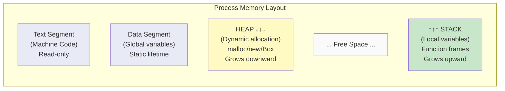
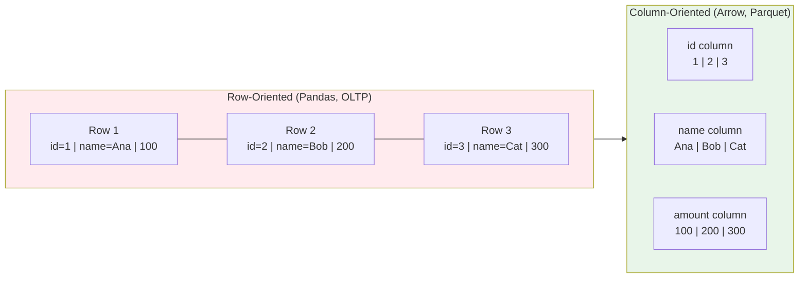
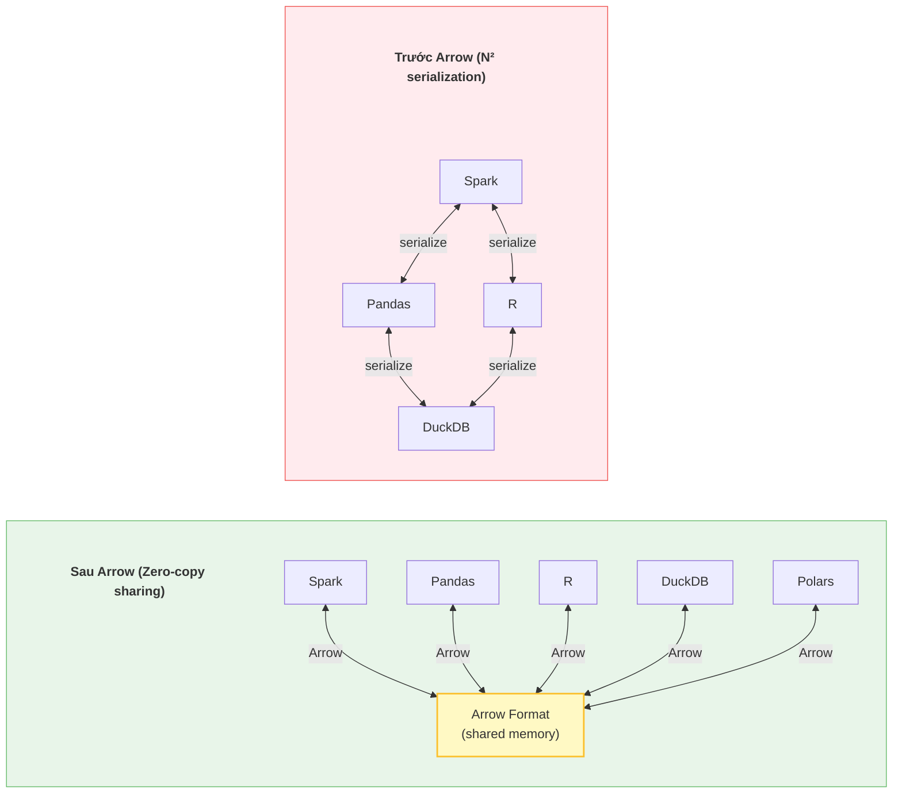
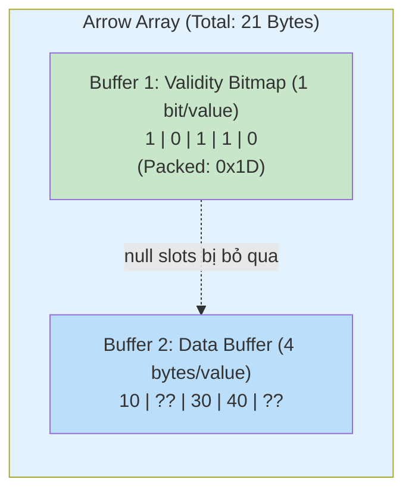
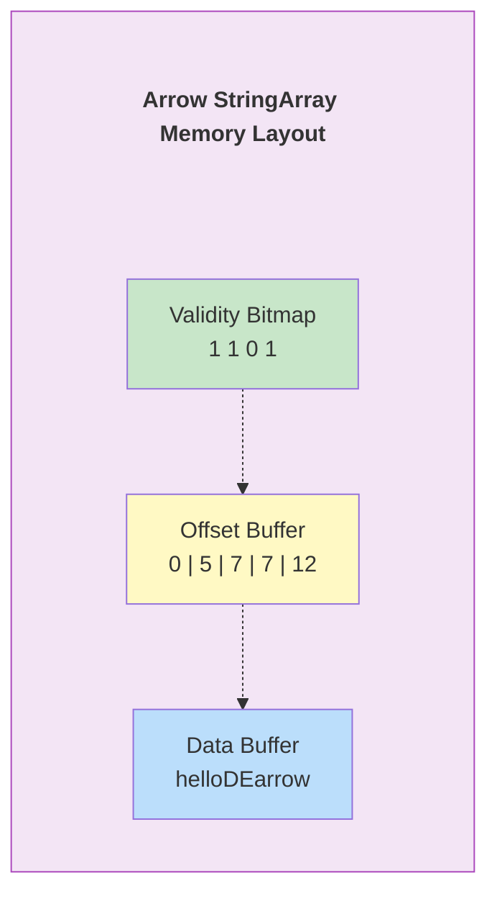
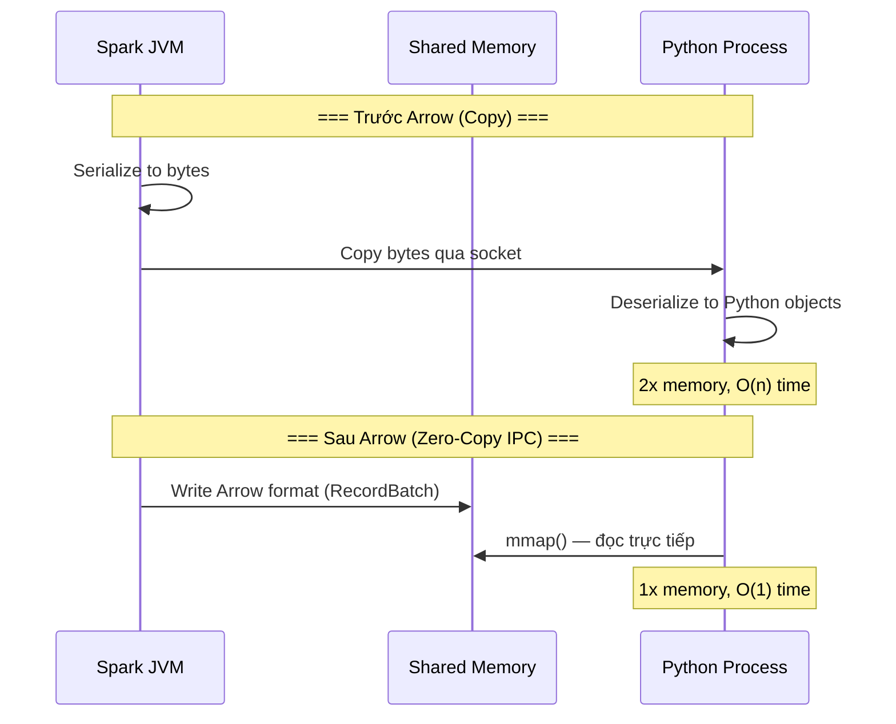
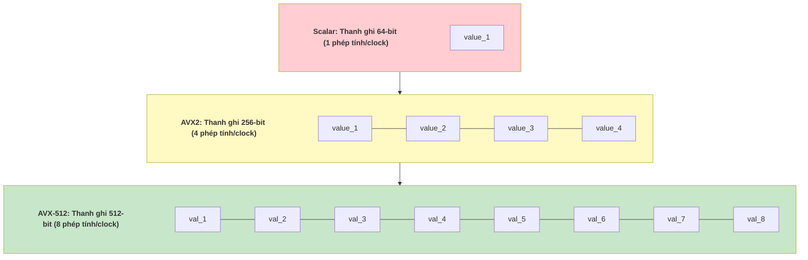

# 🧠 Memory Layout, Apache Arrow & Vectorized Execution

> Hiểu cách data được lưu trong RAM — chìa khoá để hiểu tại sao Polars nhanh hơn Pandas 50x, tại sao Arrow là lingua franca của Modern Data Stack.

---

## 📋 Mục Lục

1. [Tại Sao DE Cần Hiểu Memory?](#tại-sao-de-cần-hiểu-memory)
2. [Kiến Trúc Bộ Nhớ: Stack vs Heap](#kiến-trúc-bộ-nhớ-stack-vs-heap)
3. [Row-Oriented vs Column-Oriented In-Memory](#row-oriented-vs-column-oriented-in-memory)
4. [Apache Arrow: Kiến Trúc Chi Tiết](#apache-arrow-kiến-trúc-chi-tiết)
5. [Arrow Buffers: Validity, Offset, Data](#arrow-buffers-validity-offset-data)
6. [Zero-Copy IPC & Memory Mapping](#zero-copy-ipc--memory-mapping)
7. [Vectorized Execution & SIMD](#vectorized-execution--simd)
8. [Memory Management: GC vs Manual vs Borrow Checker](#memory-management-gc-vs-manual-vs-borrow-checker)
9. [Cache Locality & CPU Pipeline](#cache-locality--cpu-pipeline)
10. [Thực Hành: Arrow trong Python/Rust](#thực-hành-arrow-trong-pythonrust)
11. [So Sánh Memory Models](#so-sánh-memory-models-của-các-engines)
12. [Checklist](#checklist)

---

## Tại Sao DE Cần Hiểu Memory?

| Câu hỏi thực tế | Memory knowledge trả lời |
|------------------|-------------------------|
| Tại sao Polars nhanh hơn Pandas 50x trên cùng data? | Polars dùng Arrow columnar layout + vectorized ops, Pandas dùng NumPy row-aligned + Python GIL |
| Tại sao Spark OOM nhưng DuckDB thì không? | DuckDB dùng disk-spill + memory-mapped I/O, Spark buffer toàn bộ shuffle data trên heap |
| Tại sao chuyển data giữa PySpark → Pandas chậm khủng? | Serialization overhead: JVM → Python object copy. Arrow Flight loại bỏ việc này |
| Tại sao Parquet đọc nhanh hơn CSV 100x? | Columnar format + predicate pushdown dùng min/max stats → skip data không cần |

---

## Kiến Trúc Bộ Nhớ: Stack vs Heap



| Thuộc tính | Stack | Heap |
|-----------|-------|------|
| **Tốc độ** | Cực nhanh (O(1) push/pop) | Chậm hơn (allocator phải tìm block trống) |
| **Kích thước** | Nhỏ (thường 1-8 MB/thread) | Lớn (giới hạn bởi RAM vật lý + swap) |
| **Lifetime** | Tự động giải phóng khi function return | Phải manually free (C/C++) hoặc GC (Java) |
| **Ứng dụng DE** | Loop counters, small buffers | DataFrames, Arrow RecordBatches, Spark Shuffle buffers |
| **Lỗi phổ biến** | StackOverflow (đệ quy quá sâu) | Memory Leak, OOM (Out of Memory) |

---

## Row-Oriented vs Column-Oriented In-Memory



* **Row-Oriented**: `SELECT * FROM t WHERE id = 2` → Nhanh (đọc 1 row liên tục). `SELECT SUM(amount) FROM t` → Chậm (phải nhảy cóc qua name, id).
* **Column-Oriented**: `SELECT SUM(amount) FROM t` → Nhanh (đọc 1 array liên tục, SIMD-friendly). `SELECT * FROM t WHERE id = 2` → Chậm hơn (phải đọc từ 3 arrays riêng).

---

## Apache Arrow: Kiến Trúc Chi Tiết

### Arrow là gì?

Apache Arrow là **in-memory columnar format specification** — một tiêu chuẩn chung để lưu dữ liệu dạng cột trong RAM. Nó KHÔNG phải là database, không phải query engine. Nó là **ngôn ngữ giao tiếp bộ nhớ** (memory lingua franca).



### Ai dùng Arrow?

| Project | Vai trò của Arrow |
|---------|------------------|
| **Polars** | Core engine xây trên Arrow2 (arrow-rs) |
| **DuckDB** | Arrow interface cho input/output |
| **Spark** | Arrow transport PySpark ↔ JVM (pandas_udf) |
| **DataFusion** | Query engine xây 100% trên Arrow (Rust) |
| **Snowflake** | Arrow Flight cho data transfer |
| **BigQuery** | Arrow format cho Storage Read API |

---

## Arrow Buffers: Validity, Offset, Data

### Cấu trúc một Arrow Array (Column)

Mỗi Arrow column gồm **3 buffers** chính:

**Ví dụ Column:** `[10, NULL, 30, 40, NULL]` (Int32, nullable)



### Variable-Length Types (String, Binary)

String cần thêm **Offset Buffer**:

**Example Column:** `["hello", "DE", NULL, "arrow"]`

1. **Validity Bitmap:** `[1, 1, 0, 1]`
2. **Offset Buffer (Int32, length = n+1):** `[0, 5, 7, 7, 12]`
   - `"hello"` = bytes[0:5]
   - `"DE"` = bytes[5:7]
   - `NULL` = bytes[7:7] (empty)
   - `"arrow"` = bytes[7:12]
3. **Data Buffer (UTF-8 bytes):** `h e l l o D E a r r o w` (12 bytes liên tục)

*Random access formula:* `string[i] = data[offset[i] : offset[i+1]]  → O(1)`



---

## Zero-Copy IPC & Memory Mapping

### Zero-Copy nghĩa là gì?

**Copy:** Khi chuyển data từ Process A (Spark JVM) sang Process B (Python), phải copy toàn bộ bytes sang vùng memory mới → tốn thời gian O(n), tốn gấp đôi RAM.

**Zero-Copy:** Process B đọc trực tiếp memory của Process A qua shared memory hoặc memory-mapped file → O(1), không tốn thêm RAM.



### Memory-Mapped Files (mmap)

```python
"""
=== USE CASE: Đọc file Parquet/Arrow qua Memory-Mapping ===
Ứng dụng: DuckDB, Polars dùng mmap để đọc file lớn hơn RAM.
Complexity: O(1) để "open" file, OS tự page-in khi cần.
"""
import pyarrow as pa
import pyarrow.ipc as ipc
import mmap
import os

# Ghi Arrow IPC file
table = pa.table({
    "id": pa.array(range(10_000_000), type=pa.int64()),
    "value": pa.array([i * 1.5 for i in range(10_000_000)], type=pa.float64()),
})

with pa.OSFile("data.arrow", "wb") as f:
    writer = ipc.new_file(f, table.schema)
    writer.write_table(table)
    writer.close()

# Đọc qua mmap — KHÔNG load toàn bộ file vào RAM
# OS sẽ lazy-load pages khi bạn access
source = pa.memory_map("data.arrow", "r")
reader = ipc.open_file(source)
batch = reader.get_batch(0)

print(f"File size: {os.path.getsize('data.arrow') / 1e6:.1f} MB")
print(f"Batch rows: {batch.num_rows:,}")
print(f"Column 'id' sum: {batch.column('id').to_pylist()[:5]}...")
# → File 153 MB nhưng RAM usage chỉ vài MB (OS quản lý pages)
```

---

## Vectorized Execution & SIMD

### Scalar vs Vectorized Processing

```
=== Scalar (row-at-a-time) — Pandas apply(), Python for-loop ===

for each row:
    result[i] = row.amount * 1.1    # 1 phép nhân per iteration
                                     # Python overhead mỗi vòng lặp

→ 10 triệu rows = 10 triệu lần gọi Python interpreter


=== Vectorized (batch-at-a-time) — Arrow, Polars, NumPy ===

result = amount_array * 1.1         # 1 lệnh CPU xử lý 4-8 giá trị cùng lúc (SIMD)
                                     # Không có Python overhead

→ 10 triệu rows = ~1.25 triệu SIMD instructions (8 values/instruction)
```

### SIMD (Single Instruction, Multiple Data)



### === USE CASE: Vectorized Filter trong Rust (DataFusion-style) ===

```rust
/// Vectorized filter: chọn các giá trị > threshold từ Arrow Int64Array.
/// Ứng dụng: DataFusion, Polars dùng pattern này cho WHERE clause.
/// Complexity: O(n) nhưng nhanh gấp 4-8x nhờ SIMD auto-vectorization.
use arrow::array::{Int64Array, BooleanArray};
use arrow::compute::filter;

fn vectorized_filter_gt(
    values: &Int64Array,
    threshold: i64,
) -> Int64Array {
    // Step 1: Tạo boolean mask (SIMD-friendly vì iterate contiguous memory)
    let mask: BooleanArray = values
        .iter()
        .map(|v| v.map(|x| x > threshold))
        .collect();

    // Step 2: Apply mask — Arrow kernel dùng SIMD internally
    // Kernel đọc validity bitmap + data buffer → output filtered array
    filter(values, &mask)
        .unwrap()
        .as_any()
        .downcast_ref::<Int64Array>()
        .unwrap()
        .clone()
}

fn main() {
    let values = Int64Array::from(vec![10, 200, 30, 400, 50, 600]);
    let result = vectorized_filter_gt(&values, 100);
    // result = [200, 400, 600]
    println!("Filtered: {:?}", result);
}
```

---

## Memory Management: GC vs Manual vs Borrow Checker

| Thuộc tính | Garbage Collection (Java/Python) | Manual (C/C++) | Borrow Checker (Rust) |
|-----------|--------------------------------|----------------|----------------------|
| **Ai dùng** | Spark (JVM), Pandas (CPython) | PostgreSQL, MySQL | Polars, DataFusion, arrow-rs |
| **GC Pause** | Có (stop-the-world, vài ms → vài giây) | Không | Không |
| **Memory Leak** | Hiếm (GC dọn) | Phổ biến (quên free) | Không thể (compile-time check) |
| **Use-after-free** | Không thể | Phổ biến (dangling pointer) | Không thể (ownership rules) |
| **Double free** | Không thể | Phổ biến | Không thể |
| **Predictable latency** | Không (GC bất kỳ lúc nào) | Có | Có |
| **DE Impact** | Spark GC pause → task timeout jitter | PostgreSQL buffer management rất phức tạp | Polars zero-overhead memory = consistent latency |

### Tại sao GC là vấn đề cho Data Engineering?

```
Spark Executor (JVM) xử lý 10GB shuffle data:

Timeline:
0s ─── processing ─── 3s ─── GC PAUSE ─── 5s ─── processing ─── 8s
                              ↑
                     JVM dừng mọi thread để dọn heap
                     (Full GC = stop-the-world 2 giây)

Hậu quả:
- Task timeout nếu GC kéo dài
- Spark Speculation khởi chạy duplicate task → lãng phí cluster
- Shuffle fetch fail vì peer executor đang GC

Giải pháp Spark 3.x:
- Tungsten: off-heap memory management (bypass JVM GC)
- Project Tungsten allocate memory trực tiếp trên OS heap
  → Spark tự quản lý memory giống C, không phụ thuộc JVM GC
```

---

## Cache Locality & CPU Pipeline

### Tại sao Column layout nhanh hơn?

```
CPU Cache Hierachy:
L1 Cache:   64 KB,   ~1ns latency    ← Arrow column fits here for small batches
L2 Cache:   256 KB,  ~3ns latency
L3 Cache:   8-32 MB, ~10ns latency
RAM:        GBs,     ~100ns latency   ← 100x chậm hơn L1!

=== Row layout: SUM(amount) ===
Mỗi row = {id: 8B, name: 32B, amount: 8B} = 48 bytes
Cache line = 64 bytes → chỉ fit được 1.3 rows
Để scan 1M rows: phải load 1M × 48B = 48MB → không fit L3

=== Column layout: SUM(amount) ===
amount column = array of Int64 = 8 bytes each
Cache line = 64 bytes → fit được 8 values!
Để scan 1M amounts: chỉ load 1M × 8B = 8MB → fit L3 cache
+ CPU prefetcher dự đoán access pattern linear → zero stall
```

---

## Thực Hành: Arrow trong Python/Rust

### === USE CASE: Arrow RecordBatch Operations (Python) ===

```python
"""
Arrow RecordBatch — đơn vị xử lý cơ bản của Polars, DuckDB, DataFusion.
Ứng dụng: Xây ETL pipeline xử lý batch-at-a-time thay vì row-at-a-time.
Complexity: O(n) nhưng constant factor nhỏ hơn Pandas 10-50x.
"""
import pyarrow as pa
import pyarrow.compute as pc

# Tạo RecordBatch (giống DataFrame nhưng immutable, zero-copy)
batch = pa.RecordBatch.from_pydict({
    "customer_id": pa.array([1, 2, 3, 4, 5], type=pa.int32()),
    "name": pa.array(["Alice", "Bob", None, "Diana", "Eve"]),
    "revenue": pa.array([1500.0, None, 3200.0, 800.0, 5100.0], type=pa.float64()),
})

# Arrow Compute: vectorized operations (SIMD under the hood)
# 1. Filter: revenue > 1000 (predicate pushdown equivalent)
mask = pc.greater(batch.column("revenue"), 1000.0)
filtered = pc.filter(batch, mask)
print(f"High-value customers: {filtered.num_rows}")  # 3

# 2. Aggregate: sum, mean
total = pc.sum(batch.column("revenue"))  # handles NULL automatically (skip nulls)
avg = pc.mean(batch.column("revenue"))
print(f"Total: {total}, Avg: {avg}")

# 3. Null handling — Arrow tracks nulls via validity bitmap
null_count = batch.column("revenue").null_count
print(f"Revenue nulls: {null_count}")  # 1

# 4. Zero-copy slice (không copy data, chỉ tạo view mới)
first_3 = batch.slice(0, 3)  # O(1), zero memory overhead
```

### === USE CASE: Arrow Flight (high-speed data transfer) ===

```python
"""
Arrow Flight — gRPC + Arrow IPC cho data transfer giữa services.
Ứng dụng: Thay thế JDBC/ODBC. Snowflake, Dremio, DuckDB dùng Flight.
Nhanh hơn JDBC 10-100x vì zero serialization overhead.
"""
import pyarrow.flight as flight

# Server phục vụ data qua Arrow Flight
class DataServer(flight.FlightServerBase):
    def __init__(self, location, data: dict):
        super().__init__(location)
        self.data = data

    def do_get(self, context, ticket):
        """Client request data → trả về Arrow RecordBatches via gRPC stream"""
        table_name = ticket.ticket.decode()
        table = self.data[table_name]
        return flight.RecordBatchStream(table)

# Client đọc data — ZERO serialization overhead
client = flight.connect("grpc://localhost:8815")
reader = client.do_get(flight.Ticket(b"orders"))
table = reader.read_all()  # Arrow Table, không cần parse JSON/CSV
print(f"Received {table.num_rows:,} rows via Arrow Flight")
```

---

## So Sánh Memory Models Của Các Engines

| Engine | Memory Model | Format | Vectorized? | Language |
|--------|-------------|--------|-------------|----------|
| **Pandas** | NumPy arrays (row-ish) | Mixed ownership | Partially (NumPy) | Python/C |
| **Polars** | Arrow columnar (arrow-rs) | Arrow native | Fully vectorized | Rust |
| **DuckDB** | Custom columnar + mmap | Arrow-compatible | Fully vectorized | C++ |
| **Spark** | JVM Heap + Tungsten off-heap | Tungsten UnsafeRow | Whole-stage codegen | Scala/Java |
| **DataFusion** | Arrow RecordBatch | Arrow native | Fully vectorized | Rust |
| **ClickHouse** | Custom columnar (MergeTree) | Proprietary | Fully vectorized + SIMD | C++ |
| **Trino** | JVM Heap + Slice | Pages (columnar blocks) | Partially vectorized | Java |

---

## 💡 Nhận định từ thực tế (Senior Advice)

1. **Arrow là "TCP/IP của Data":** Giống như TCP/IP trở thành standard cho networking, Arrow đang trở thành standard cho in-memory data format. Nếu bạn build tool mới mà không support Arrow, bạn sẽ bị hệ sinh thái bỏ lại.

2. **Pandas sẽ chết (dần dần):** Pandas 2.0 đã switch backend sang Arrow (PyArrow). Nhưng API của Pandas quá cồng kềnh và không thread-safe. Hãy học Polars ngay — nó xây 100% trên Arrow, multi-threaded by default, và API nhất quán hơn.

3. **Off-heap là xu hướng:** Spark Tungsten, DuckDB mmap, Polars arrow-rs — tất cả đều né tránh Garbage Collector. Nếu bạn viết custom data tool bằng Java, hãy allocate off-heap (DirectByteBuffer hoặc Unsafe) thay vì để JVM GC quản lý data buffers.

4. **Đừng serialize khi không cần:** Mỗi lần bạn `.to_json()`, `.to_csv()` rồi đầu bên kia `pd.read_csv()` là bạn đang lãng phí CPU vào việc biến data thành text rồi parse lại. Hãy dùng Arrow IPC hoặc Parquet cho inter-process communication.

---

## Checklist

- [ ] Vẽ được sơ đồ Stack vs Heap và giải thích khi nào data nằm ở đâu
- [ ] Giải thích tại sao columnar layout nhanh hơn row layout cho analytics (cache locality + SIMD)
- [ ] Mô tả 3 buffers của Arrow Array: Validity Bitmap, Offset Buffer, Data Buffer
- [ ] Giải thích Zero-Copy IPC là gì và tại sao nó quan trọng
- [ ] Hiểu SIMD là gì và cách vectorized execution tận dụng nó
- [ ] So sánh GC (Java) vs Manual (C++) vs Borrow Checker (Rust) cho data workloads
- [ ] Biết tại sao Spark GC pause gây task timeout và cách Tungsten giải quyết
- [ ] Sử dụng được PyArrow compute functions (filter, aggregate, slice)
- [ ] Hiểu Arrow Flight là gì và tại sao nó nhanh hơn JDBC
- [ ] Giải thích được CPU cache hierarchy và tác động đến query performance

---

*Document Version: 1.0*
*Last Updated: March 2026*
*Coverage: Memory Layout, Apache Arrow, Validity/Offset/Data Buffers, Zero-Copy IPC, SIMD, Vectorized Execution, GC vs Borrow Checker, Arrow Flight, Cache Locality*
