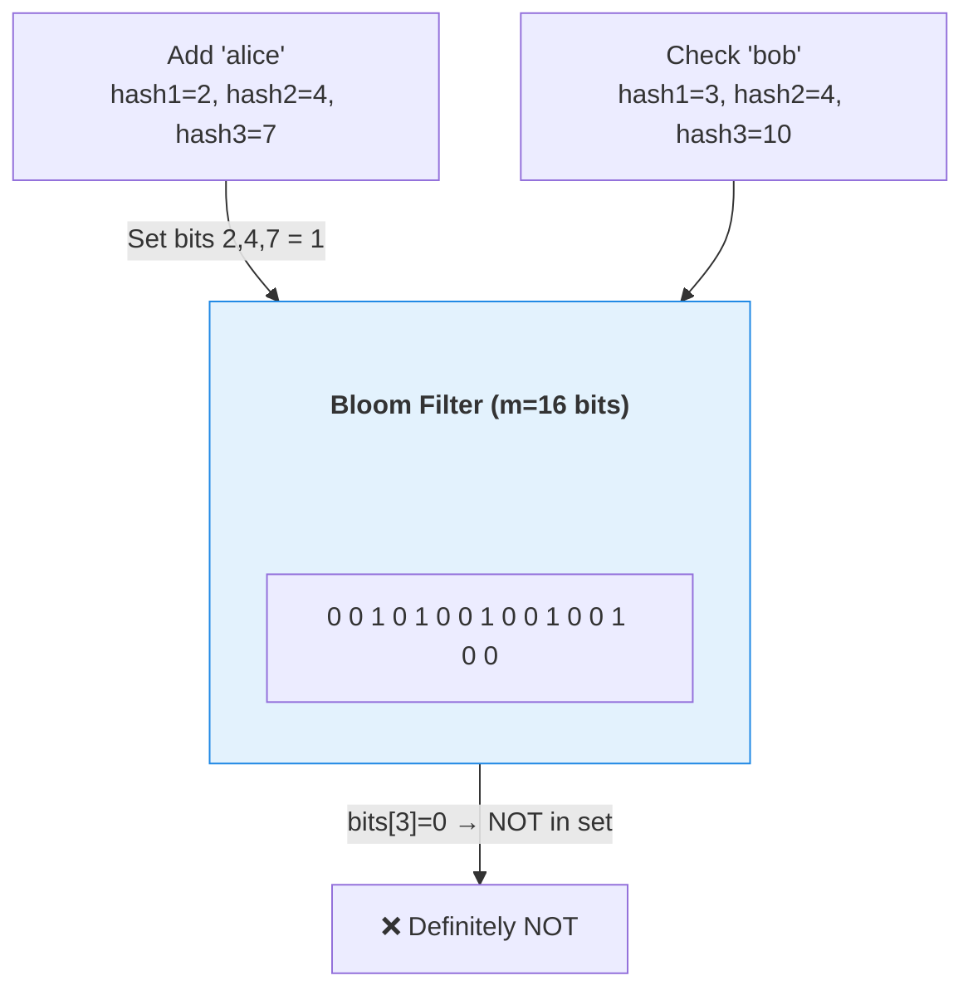
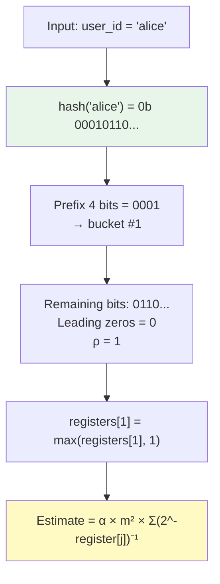
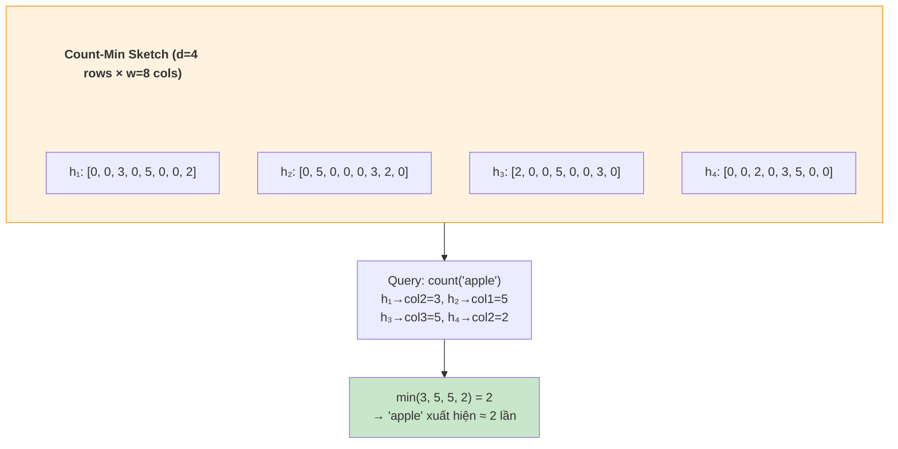
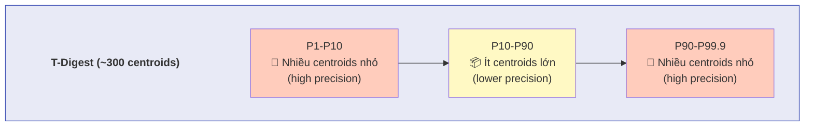

# 🎲 Probabilistic Data Structures cho Data Engineering

> Khi bạn có 1 tỷ events/ngày, bạn không thể `COUNT(DISTINCT user_id)` bằng cách giữ HashSet trong RAM. Bạn cần các cấu trúc dữ liệu xác suất — hy sinh chút accuracy để đổi lấy memory giảm 1000x.

---

## 📋 Mục Lục

1. [Tại Sao Cần Probabilistic DS?](#tại-sao-cần-probabilistic-ds)
2. [Hashing Fundamentals](#hashing-fundamentals)
3. [Bloom Filter — Membership Testing](#bloom-filter--membership-testing)
4. [HyperLogLog — Cardinality Estimation](#hyperloglog--cardinality-estimation)
5. [Count-Min Sketch — Frequency Estimation](#count-min-sketch--frequency-estimation)
6. [T-Digest — Quantile Estimation](#t-digest--quantile-estimation)
7. [Cuckoo Filter — Bloom Filter 2.0](#cuckoo-filter--bloom-filter-20)
8. [Ứng Dụng Thực Tế Trong Production](#ứng-dụng-thực-tế-trong-production)
9. [So Sánh Tổng Hợp](#so-sánh-tổng-hợp)
10. [Checklist](#checklist)

---

## Tại Sao Cần Probabilistic DS?

| Bài toán | Giải pháp chính xác | Memory cần | Giải pháp xác suất | Memory cần | Error |
|----------|---------------------|-----------|---------------------|-----------|-------|
| "Có bao nhiêu unique users hôm nay?" (1B events) | HashSet<user_id> | ~8 GB | HyperLogLog | **12 KB** | ±0.8% |
| "URL nào được truy cập nhiều nhất?" (100M requests) | HashMap<url, count> | ~10 GB | Count-Min Sketch | **160 KB** | Top-k chính xác > 99% |
| "P99 latency của API là bao nhiêu?" (streaming) | Sort toàn bộ array | O(n log n) time | T-Digest | **~10 KB** | ±0.5% |
| "User này đã xem sản phẩm này chưa?" (100M users × 10M products) | HashSet per user | TB-scale | Bloom Filter | **~1.2 GB** | 1% false positive |

> **Nhận xét:** Probabilistic DS đánh đổi **accuracy nhỏ** lấy **memory giảm 1000-100000x**. Ở quy mô Big Data, đây không phải trade-off, đây là **bắt buộc**.

---

## Hashing Fundamentals

Gần như mọi Probabilistic DS đều dựa trên **hash functions**. Hiểu hashing là nền tảng.

### Yêu cầu của Hash Function cho Probabilistic DS

| Yêu cầu | Giải thích | Hash phổ biến |
|----------|-----------|--------------|
| **Uniform distribution** | Output phải phân bố đều trên khoảng [0, 2^k) | MurmurHash3, xxHash |
| **Deterministic** | Cùng input → cùng output | Tất cả |
| **Avalanche effect** | 1 bit input thay đổi → ~50% bits output thay đổi | MurmurHash3 |
| **Independence** | Dùng nhiều hash functions → output phải independent | Dùng seed khác nhau |
| **Speed** | Phải hash hàng tỷ values/giây | xxHash (nhanh nhất), MurmurHash3 |

```python
"""
=== USE CASE: Hash function cho Probabilistic DS ===
Ứng dụng: Nền tảng cho Bloom Filter, HyperLogLog, Count-Min Sketch.
"""
import mmh3  # MurmurHash3 — hash function tiêu chuẩn cho probabilistic DS

def multi_hash(key: str, num_hashes: int) -> list[int]:
    """
    Tạo num_hashes hash values độc lập từ 1 key.
    Trick: dùng seed khác nhau thay vì implement nhiều hash functions.
    Complexity: O(num_hashes) — mỗi hash call O(len(key)).
    """
    return [mmh3.hash(key, seed=i, signed=False) for i in range(num_hashes)]

# Demo
hashes = multi_hash("user_12345", num_hashes=4)
print(f"Hashes: {[hex(h) for h in hashes]}")
# → ['0xa3f2b1c4', '0x7d8e0912', '0x1b4c7f3a', '0xe5a91d02']
```

---

## Bloom Filter — Membership Testing

### Bloom Filter trả lời: "Phần tử X có trong tập S không?"

- **"Có"** → Có thể sai (false positive)
- **"Không"** → Chắc chắn đúng (no false negatives)



### Toán học: Xác suất False Positive

```
Tham số:
  m = kích thước bit array
  k = số hash functions
  n = số phần tử đã insert

Xác suất false positive:
  p ≈ (1 - e^(-kn/m))^k

Optimal k (để minimize p):
  k = (m/n) × ln(2) ≈ 0.693 × (m/n)

Ví dụ thực tế:
  n = 100 triệu users
  p = 1% (chấp nhận 1% false positive)
  → m = -n × ln(p) / (ln(2))^2 ≈ 958 triệu bits ≈ 114 MB
  → k = (m/n) × ln(2) ≈ 7 hash functions
```

### === USE CASE: Bloom Filter cho Spark Shuffle Optimization ===

```python
"""
Bloom Filter — Skip partition không cần thiết khi JOIN.
Ứng dụng thực tế: Spark Broadcast Bloom Filter JOIN.
  - Bảng lớn (orders: 1 tỷ rows)
  - Bảng nhỏ (vip_customers: 10,000 rows)
  - Thay vì shuffle 1 tỷ rows, build Bloom Filter từ vip_customers,
    broadcast filter, skip 99% rows ở bảng lớn trước khi shuffle.
Complexity: Build O(n), Lookup O(k), Space O(m bits).
"""
from bitarray import bitarray
import mmh3
import math

class BloomFilter:
    def __init__(self, expected_items: int, false_positive_rate: float = 0.01):
        # Tính kích thước tối ưu
        self.size = self._optimal_size(expected_items, false_positive_rate)
        self.num_hashes = self._optimal_hashes(self.size, expected_items)
        self.bits = bitarray(self.size)
        self.bits.setall(0)
        self.count = 0

    @staticmethod
    def _optimal_size(n: int, p: float) -> int:
        """m = -n * ln(p) / (ln2)^2"""
        return int(-n * math.log(p) / (math.log(2) ** 2))

    @staticmethod
    def _optimal_hashes(m: int, n: int) -> int:
        """k = (m/n) * ln(2)"""
        return max(1, int((m / n) * math.log(2)))

    def add(self, item: str):
        """O(k) — set k bits"""
        for seed in range(self.num_hashes):
            idx = mmh3.hash(item, seed=seed, signed=False) % self.size
            self.bits[idx] = 1
        self.count += 1

    def might_contain(self, item: str) -> bool:
        """O(k) — check k bits. False = definitely not in set."""
        return all(
            self.bits[mmh3.hash(item, seed=seed, signed=False) % self.size]
            for seed in range(self.num_hashes)
        )


# === Simulate Spark Broadcast Bloom Filter JOIN ===
# Build filter từ bảng nhỏ (vip_customers)
vip_filter = BloomFilter(expected_items=10_000, false_positive_rate=0.01)
vip_ids = [f"CUST_{i}" for i in range(10_000)]
for cid in vip_ids:
    vip_filter.add(cid)

print(f"Bloom Filter: {vip_filter.size / 8 / 1024:.1f} KB, {vip_filter.num_hashes} hashes")

# Simulate scanning bảng lớn (orders) — skip non-VIP rows
orders_total = 1_000_000
orders_skipped = 0
for i in range(orders_total):
    customer_id = f"CUST_{i}"
    if not vip_filter.might_contain(customer_id):
        orders_skipped += 1
        continue
    # Chỉ process rows mà Bloom Filter nói "có thể là VIP"

print(f"Skipped {orders_skipped:,}/{orders_total:,} rows ({orders_skipped/orders_total*100:.1f}%)")
# → Skipped ~990,000/1,000,000 rows (99.0%) — chỉ shuffle 1% data!
```

---

## HyperLogLog — Cardinality Estimation

### Bài toán: COUNT(DISTINCT) cho 1 tỷ values

HyperLogLog (HLL) trả lời: **"Có bao nhiêu phần tử unique?"** với memory cố định ~12 KB.

### Ý tưởng cốt lõi (trực giác)

```
Tung đồng xu. Nếu bạn thấy chuỗi "HHHH" (4 heads liên tiếp), bạn đoán
mình đã tung khoảng 2^4 = 16 lần.

Áp dụng: Hash mỗi value → đếm số leading zeros trong binary representation.
Nếu thấy max 20 leading zeros → ước lượng ~2^20 ≈ 1M unique values.

Trick: Chia thành 2^p "registers" (buckets) để giảm variance.
Mỗi register theo dõi max leading zeros trong bucket của nó.
Ước lượng cuối = harmonic mean của tất cả registers.
```



### Thuật toán chi tiết

```
HyperLogLog(precision p):
  m = 2^p registers (array of bytes, each stores max ρ)
  
  ADD(value):
    h = hash(value)            // 64-bit hash
    bucket = h >> (64 - p)     // top p bits → bucket index
    w = h << p                 // remaining bits
    ρ = number_of_leading_zeros(w) + 1
    registers[bucket] = max(registers[bucket], ρ)
  
  COUNT():
    Z = Σ 2^(-registers[j]) for j = 0..m-1    // harmonic indicator
    E_raw = α_m × m² / Z
    // Apply bias corrections for small/large ranges
    return E_corrected

Memory: m × 6 bits (mỗi register cần 6 bits vì max ρ ≤ 64)
  p=14 → m = 16,384 registers → 12 KB (standard precision)
```

### === USE CASE: HyperLogLog — Đếm Unique Users Realtime ===

```python
"""
HyperLogLog — đếm COUNT(DISTINCT) với 12KB memory.
Ứng dụng: Dashboard realtime "Bao nhiêu unique users online?"
           Redis PFCOUNT, BigQuery APPROX_COUNT_DISTINCT, Spark approx_count_distinct.
Complexity: Add O(1), Count O(m), Space O(m) = O(2^p) ≈ 12KB.
Error: ±1.04/√m ≈ ±0.81% (p=14).
"""
import mmh3
import math

class HyperLogLog:
    def __init__(self, precision: int = 14):
        """precision: ảnh hưởng accuracy vs memory. p=14 = 12KB, ±0.81%."""
        self.p = precision
        self.m = 1 << precision  # số registers = 2^p
        self.registers = [0] * self.m
        # Alpha constant (bias correction)
        self.alpha = 0.7213 / (1 + 1.079 / self.m)

    def add(self, value: str):
        """O(1) — hash + update 1 register"""
        h = mmh3.hash64(value, signed=False)[0]  # 64-bit hash
        # Top p bits → bucket index
        bucket = h >> (64 - self.p)
        # Remaining bits → count leading zeros
        w = h << self.p & ((1 << 64) - 1)  # mask to 64 bits
        rho = self._leading_zeros(w) + 1
        self.registers[bucket] = max(self.registers[bucket], rho)

    def count(self) -> int:
        """O(m) — harmonic mean of registers"""
        Z = sum(2.0 ** (-reg) for reg in self.registers)
        E = self.alpha * self.m * self.m / Z

        # Small range correction (linear counting)
        if E <= 2.5 * self.m:
            V = self.registers.count(0)  # empty registers
            if V > 0:
                E = self.m * math.log(self.m / V)

        return int(E)

    def merge(self, other: 'HyperLogLog'):
        """O(m) — merge 2 HLLs (distributed counting!)"""
        assert self.m == other.m
        self.registers = [max(a, b) for a, b in zip(self.registers, other.registers)]

    @staticmethod
    def _leading_zeros(value: int) -> int:
        if value == 0:
            return 64
        n = 0
        while (value & (1 << 63)) == 0:
            n += 1
            value <<= 1
        return n

    @property
    def memory_bytes(self) -> int:
        return self.m  # 1 byte per register (could be 6 bits)


# === Demo: 10 triệu unique users ===
hll = HyperLogLog(precision=14)

n_users = 10_000_000
for i in range(n_users):
    hll.add(f"user_{i}")

estimated = hll.count()
error_pct = abs(estimated - n_users) / n_users * 100
print(f"Actual: {n_users:,}")
print(f"Estimated: {estimated:,}")
print(f"Error: {error_pct:.2f}%")
print(f"Memory: {hll.memory_bytes / 1024:.1f} KB")
# → Actual: 10,000,000 | Estimated: ~9,950,000 | Error: ~0.5% | Memory: 16 KB

# === Merge (distributed counting across Spark partitions) ===
hll_partition1 = HyperLogLog(precision=14)
hll_partition2 = HyperLogLog(precision=14)
for i in range(5_000_000):
    hll_partition1.add(f"user_{i}")
for i in range(3_000_000, 10_000_000):
    hll_partition2.add(f"user_{i}")
hll_partition1.merge(hll_partition2)
print(f"Merged estimate: {hll_partition1.count():,}")
# → ~10,000,000 (dù có overlap 2M users, HLL deduplicate tự động)
```

---

## Count-Min Sketch — Frequency Estimation

### Bài toán: "URL nào được truy cập nhiều nhất?" (Heavy Hitters)

Count-Min Sketch (CMS) trả lời: **"Phần tử X xuất hiện bao nhiêu lần?"** — có thể over-estimate nhưng KHÔNG BAO GIỜ under-estimate.



### === USE CASE: Count-Min Sketch — Tìm Heavy Hitters trong Kafka Stream ===

```python
"""
Count-Min Sketch — Tìm Top-K frequent items trong data stream.
Ứng dụng: Kafka consumer đếm top URLs, top error codes, top search queries
           mà KHÔNG cần giữ HashMap khổng lồ trong RAM.
Complexity: Add O(d), Query O(d), Space O(d × w).
Error guarantee: count ≤ true_count + ε×N (N = tổng events).
"""
import mmh3
from typing import List, Tuple

class CountMinSketch:
    def __init__(self, width: int = 10000, depth: int = 7):
        """
        width (w): số cột → càng lớn, càng chính xác.
        depth (d): số hàng (hash functions) → càng lớn, càng ít over-estimate.
        Error bound: ε = e/w, δ = e^(-d)
        Với w=10000, d=7: ε ≈ 0.027%, fail prob δ ≈ 0.09%
        """
        self.w = width
        self.d = depth
        self.table = [[0] * width for _ in range(depth)]
        self.total = 0  # tổng số events

    def add(self, item: str, count: int = 1):
        """O(d) — increment d counters"""
        self.total += count
        for i in range(self.d):
            col = mmh3.hash(item, seed=i, signed=False) % self.w
            self.table[i][col] += count

    def estimate(self, item: str) -> int:
        """O(d) — return min across d rows (least over-estimated)"""
        return min(
            self.table[i][mmh3.hash(item, seed=i, signed=False) % self.w]
            for i in range(self.d)
        )


class TopKTracker:
    """Track top-K heavy hitters using Count-Min Sketch + min-heap."""
    def __init__(self, k: int = 10, cms_width: int = 10000):
        self.k = k
        self.cms = CountMinSketch(width=cms_width)
        self.candidates: dict[str, int] = {}

    def add(self, item: str):
        self.cms.add(item)
        est = self.cms.estimate(item)
        self.candidates[item] = est
        # Prune candidates: giữ top 2K để memory bounded
        if len(self.candidates) > self.k * 2:
            sorted_items = sorted(self.candidates.items(), key=lambda x: -x[1])
            self.candidates = dict(sorted_items[:self.k])

    def top_k(self) -> List[Tuple[str, int]]:
        return sorted(self.candidates.items(), key=lambda x: -x[1])[:self.k]


# === Demo: Top 5 URLs từ 1 triệu requests ===
import random
# Simulate Zipf distribution (realistic web traffic)
urls = [f"/api/v1/endpoint_{i}" for i in range(10000)]
weights = [1.0 / (i + 1) for i in range(10000)]  # Zipf: endpoint_0 phổ biến nhất

tracker = TopKTracker(k=5, cms_width=50000)
for _ in range(1_000_000):
    url = random.choices(urls, weights=weights, k=1)[0]
    tracker.add(url)

print("Top 5 URLs (CMS estimate):")
for url, count in tracker.top_k():
    print(f"  {url}: ~{count:,} hits")

print(f"\nCMS memory: {tracker.cms.w * tracker.cms.d * 4 / 1024:.0f} KB")
# → ~1.4 MB thay vì 10GB HashMap
```

---

## T-Digest — Quantile Estimation

### Bài toán: "P99 latency của API là bao nhiêu?" (Streaming)

T-Digest trả lời: **"Giá trị tại percentile X là bao nhiêu?"** — cực chính xác ở tail (P99, P99.9).

### Ý tưởng cốt lõi

```
T-Digest giữ một tập "centroids" (đại diện), mỗi centroid = (mean, weight).
  - Ở middle (P50): centroids lớn (gom nhiều points) → tiết kiệm memory
  - Ở tails (P1, P99): centroids nhỏ (mỗi centroid ≈ 1-2 points) → chính xác

Ví dụ với 1 triệu latency values:
  P50 area: [centroid(mean=120ms, weight=50000), centroid(mean=121ms, weight=48000)]
  P99 area: [centroid(mean=450ms, weight=3), centroid(mean=455ms, weight=2)]
  P99.9:    [centroid(mean=890ms, weight=1)]

→ Dùng ~300 centroids (~10KB) để represent 1M values
→ P99 error < 0.01%
```



### === USE CASE: T-Digest — Monitoring P99 Latency Realtime ===

```python
"""
T-Digest — tính percentiles chính xác cho streaming data.
Ứng dụng: API latency monitoring, Prometheus histogram alternative,
           ClickHouse quantilesTDigest(), Redis t-digest module.
Complexity: Add O(log n) amortized, Query O(δ) with δ=compression.
Memory: O(δ) centroids ≈ 10KB for δ=300.
"""
from dataclasses import dataclass
from typing import List
import bisect
import math

@dataclass
class Centroid:
    mean: float
    weight: int = 1

class TDigest:
    def __init__(self, compression: float = 300):
        """
        compression (δ): controls accuracy vs memory.
        Higher δ → more centroids → more accurate → more memory.
        δ=100: ~3KB, ±1% at P99
        δ=300: ~10KB, ±0.1% at P99 (recommended)
        """
        self.compression = compression
        self.centroids: List[Centroid] = []
        self.total_weight = 0
        self._buffer: List[float] = []
        self._buffer_size = 500  # flush threshold

    def add(self, value: float):
        """Amortized O(log n) — buffer then batch-merge."""
        self._buffer.append(value)
        if len(self._buffer) >= self._buffer_size:
            self._flush()

    def _flush(self):
        """Merge buffer into centroids."""
        self._buffer.sort()
        for val in self._buffer:
            self._insert_centroid(val)
        self._buffer.clear()
        self._compress()

    def _insert_centroid(self, value: float):
        """Insert a single value into the centroid list."""
        if not self.centroids:
            self.centroids.append(Centroid(mean=value, weight=1))
            self.total_weight += 1
            return

        # Find nearest centroid
        idx = bisect.bisect_left([c.mean for c in self.centroids], value)
        idx = max(0, min(idx, len(self.centroids) - 1))

        c = self.centroids[idx]
        # k-size bound: centroids at tails should be smaller
        q = self._quantile_of_centroid(idx)
        max_weight = self._max_weight(q)

        if c.weight + 1 <= max_weight:
            # Merge into existing centroid
            c.mean = (c.mean * c.weight + value) / (c.weight + 1)
            c.weight += 1
        else:
            # Create new centroid
            new_c = Centroid(mean=value, weight=1)
            self.centroids.insert(idx if value < c.mean else idx + 1, new_c)
        self.total_weight += 1

    def _max_weight(self, q: float) -> float:
        """Scale function: tails get smaller max weight."""
        return max(1, int(4 * self.total_weight * q * (1 - q) / self.compression))

    def _quantile_of_centroid(self, idx: int) -> float:
        weight_so_far = sum(c.weight for c in self.centroids[:idx])
        return (weight_so_far + self.centroids[idx].weight / 2) / max(1, self.total_weight)

    def _compress(self):
        """Merge centroids that are too close together."""
        if len(self.centroids) <= self.compression:
            return
        new_centroids = [self.centroids[0]]
        for c in self.centroids[1:]:
            last = new_centroids[-1]
            q = self._quantile_of_centroid(len(new_centroids) - 1)
            if last.weight + c.weight <= self._max_weight(q):
                total_w = last.weight + c.weight
                last.mean = (last.mean * last.weight + c.mean * c.weight) / total_w
                last.weight = total_w
            else:
                new_centroids.append(c)
        self.centroids = new_centroids

    def percentile(self, p: float) -> float:
        """
        Query: giá trị tại percentile p (0-100).
        O(δ) — scan centroids.
        """
        self._flush()
        if not self.centroids:
            return 0

        target_weight = (p / 100.0) * self.total_weight
        cumulative = 0

        for i, c in enumerate(self.centroids):
            if cumulative + c.weight >= target_weight:
                # Interpolate within centroid
                inner_frac = (target_weight - cumulative) / c.weight
                if i + 1 < len(self.centroids):
                    next_mean = self.centroids[i + 1].mean
                    return c.mean + inner_frac * (next_mean - c.mean)
                return c.mean
            cumulative += c.weight

        return self.centroids[-1].mean


# === Demo: Monitor API latency ===
import random

td = TDigest(compression=300)

# Simulate 1M API calls — mostly fast, few very slow (tail)
for _ in range(1_000_000):
    if random.random() < 0.99:
        latency = random.gauss(50, 10)      # 99% calls: ~50ms ± 10ms
    elif random.random() < 0.9:
        latency = random.gauss(200, 50)     # 0.9% calls: ~200ms (slow)
    else:
        latency = random.gauss(800, 100)    # 0.1% calls: ~800ms (very slow)
    td.add(max(1, latency))

print(f"P50:   {td.percentile(50):.1f} ms")    # ~50ms
print(f"P90:   {td.percentile(90):.1f} ms")    # ~55ms
print(f"P99:   {td.percentile(99):.1f} ms")    # ~200ms
print(f"P99.9: {td.percentile(99.9):.1f} ms")  # ~800ms
print(f"Centroids: {len(td.centroids)}")         # ~300
print(f"Memory: ~{len(td.centroids) * 12 / 1024:.1f} KB")  # ~3.5 KB
```

---

## Cuckoo Filter — Bloom Filter 2.0

Bloom Filter có 2 nhược điểm lớn:
1. **Không thể DELETE** phần tử (vì 1 bit có thể thuộc nhiều phần tử)
2. **Không thể đếm** (counting)

**Cuckoo Filter** giải quyết cả 2:

| Feature | Bloom Filter | Cuckoo Filter |
|---------|-------------|---------------|
| Lookup | O(k) | O(2) — chỉ check 2 buckets |
| Insert | O(k) | O(1) amortized |
| Delete | ❌ Không thể | ✅ Có thể |
| Space efficiency | Good | Better (13% nhỏ hơn cho cùng FP rate) |
| False positive | Tuỳ m/n/k | Tuỳ fingerprint size |
| Dùng ở đâu | Spark, Cassandra, Redis | ScyllaDB, RocksDB |

---

## Ứng Dụng Thực Tế Trong Production

| Tool/Engine | Probabilistic DS | Ứng dụng cụ thể |
|-------------|-----------------|------------------|
| **Redis** | HyperLogLog (PFADD/PFCOUNT) | Đếm unique visitors per page |
| **Redis** | Bloom Filter (BF.ADD/BF.EXISTS) | Dedup Kafka messages |
| **Spark** | Bloom Filter (DataFrameStatFunction) | Skip partitions trong JOIN |
| **BigQuery** | HyperLogLog++ (APPROX_COUNT_DISTINCT) | COUNT DISTINCT rẻ tiền hơn 10x |
| **ClickHouse** | T-Digest (quantilesTDigest) | API latency percentiles |
| **Flink** | Count-Min Sketch | Top-K trending queries realtime |
| **Druid/Pinot** | HLL + Theta Sketch (Apache DataSketches) | Realtime analytics dashboards |
| **Presto/Trino** | HyperLogLog (approx_distinct) | Approximate DISTINCT count |

---

## So Sánh Tổng Hợp

| DS | Câu hỏi trả lời | Memory | Error | Mergeable? | Delete? |
|----|-----------------|--------|-------|-----------|---------|
| **Bloom Filter** | "X có trong tập S không?" | O(n) bits | FP only, no FN | ✅ (OR bitwise) | ❌ |
| **Cuckoo Filter** | "X có trong tập S không?" | O(n) bits (nhỏ hơn Bloom) | FP only, no FN | ❌ | ✅ |
| **HyperLogLog** | "Bao nhiêu unique?" | 12 KB (cố định) | ±0.81% | ✅ (max registers) | ❌ |
| **Count-Min Sketch** | "X xuất hiện bao nhiêu lần?" | O(d×w) counters | Over-estimate only | ✅ (sum counters) | ❌ |
| **T-Digest** | "Giá trị tại Percentile X?" | ~10 KB | <±1% at P99 | ✅ (merge centroids) | ❌ |

> **💡 Tính Mergeable rất quan trọng:** Trong hệ thống phân tán (Spark, Flink), mỗi partition tính riêng rồi merge lại ở driver. HLL và CMS support merge = dùng được trong MapReduce. T-Digest cũng merge được = tính percentiles phân tán.

---

## 💡 Nhận định từ thực tế (Senior Advice)

1. **Dùng library, đừng tự implement:** Code ở trên để bạn hiểu nguyên lý. Trong production, hãy dùng:
   - Redis: `PFADD/PFCOUNT` (HLL), `BF.ADD/BF.EXISTS` (Bloom)
   - Python: `datasketch` library (HLL, MinHash, CMS)
   - Java: `stream-lib` (T-Digest, CMS, HLL)
   - BigQuery/Trino: `APPROX_COUNT_DISTINCT()` (tối ưu sẵn)

2. **HLL là "must-know":** Nếu bạn chỉ học 1 Probabilistic DS, hãy học HyperLogLog. 90% use cases trong DE là đếm unique (unique users, unique IPs, unique search queries). Redis PFCOUNT + BigQuery APPROX_COUNT_DISTINCT sẽ covers được hầu hết nhu cầu.

3. **Cẩn thận với Bloom Filter trong Spark:** Spark Dynamic Bloom Filter JOIN rất mạnh nhưng có thể backfire nếu bảng filter quá lớn (>100MB). Khi đó overhead tạo và broadcast filter lớn hơn saving từ skip. Rule of thumb: chỉ dùng khi bảng filter < 10% bảng lớn.

---

## Checklist

- [ ] Giải thích được vì sao Probabilistic DS cần thiết ở quy mô Big Data
- [ ] Hiểu yêu cầu của hash function: uniform, deterministic, avalanche
- [ ] Implement hoặc giải thích được Bloom Filter (structure, add, query)
- [ ] Tính được optimal m (size) và k (hashes) cho Bloom Filter
- [ ] Giải thích ý tưởng HyperLogLog: leading zeros + harmonic mean
- [ ] Biết HLL chỉ cần 12KB cho 1 tỷ unique values, error ±0.81%
- [ ] Giải thích Count-Min Sketch: multiple hash rows, min query
- [ ] Biết CMS chỉ over-estimate, không bao giờ under-estimate
- [ ] Hiểu T-Digest: centroids nhỏ ở tail, lớn ở middle
- [ ] Biết cách Merge các Probabilistic DS trong hệ thống phân tán
- [ ] Map được: Bloom→Spark JOIN skip, HLL→COUNT DISTINCT, CMS→Top-K, T-Digest→P99

---

*Document Version: 1.0*
*Last Updated: March 2026*
*Coverage: Bloom Filter, Cuckoo Filter, HyperLogLog, Count-Min Sketch, T-Digest, Hashing, Streaming Algorithms, Production Applications*
